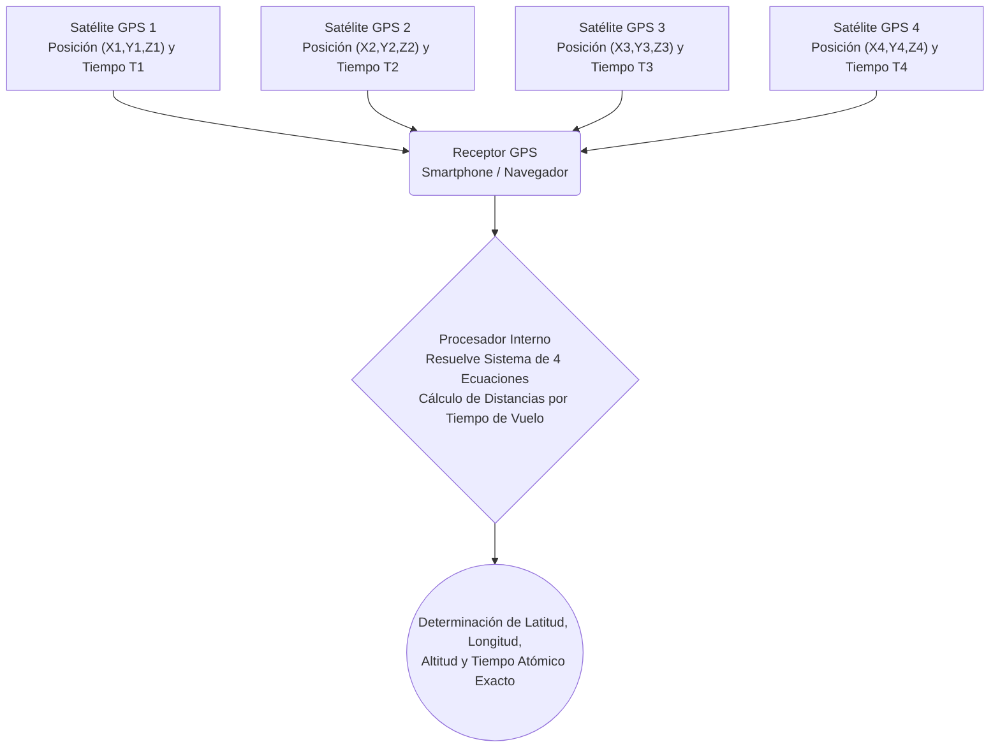

# Espacio y Tecnología: Cómo Funciona el GPS - Relatividad y Posicionamiento por Satélite

Cada vez que consultamos una ruta en el teléfono móvil, solicitamos un servicio de transporte o seguimos las indicaciones del navegador del coche, nos beneficiamos del **Sistema de Posicionamiento Global (GPS)**. Desde orientar aeronaves y buques transoceánicos hasta sincronizar marcas de tiempo con precisión de microsegundos en transacciones financieras globales, el GPS se ha convertido en una infraestructura esencial e invisible de la sociedad contemporánea.

Sin embargo, pocos usuarios son conscientes de que esta herramienta cotidiana depende de manera crítica de la **teoría de la relatividad** de Albert Einstein, una de las ramas de la física teórica que a menudo parece alejada de la vida diaria. Sin las correcciones relativistas prescritas por Einstein, el GPS acumularía un error de posición de aproximadamente **11,4 kilómetros (7 millas) cada día**, volviéndose completamente inservible en cuestión de horas.

En este artículo examinamos a fondo los principios geométricos de la trilateración, los efectos de las relatividades especial y general sobre los relojes orbitales, y la sofisticada ingeniería que permite mantener una precisión métrica en todo el planeta.

## 1. Funcionamiento Básico del GPS: Trilateración y Tiempo Ultranegociable

El GPS determina la posición geográfica tridimensional de un receptor en la superficie terrestre captando señales electromagnéticas emitidas por una constelación de satélites en órbita. El pilar geométrico de este cálculo es la **trilateración**.

### 1.1. Enfoque Geométrico de la Trilateración

Para determinar una coordenada espacial unívoca en tres dimensiones, el receptor debe sincronizarse como mínimo con **cuatro satélites GPS**:

1. **Primer Satélite (Esfera de Incertidumbre)**: Al medir el tiempo que tarda la señal de radio en viajar desde el satélite hasta el receptor y multiplicarlo por la velocidad de la luz, se obtiene la distancia exacta. El usuario se sitúa en algún punto de una esfera imaginaria cuyo radio es dicha distancia.
2. **Segundo Satélite (Intersección Circular)**: Al incorporar la distancia a un segundo satélite, la intersección de dos esferas genera un círculo en el espacio tridimensional.
3. **Tercer Satélite (Convergencia a Dos Puntos)**: La esfera del tercer satélite interseca dicho círculo en exactamente **dos puntos discretos**. Uno de ellos suele estar situado en el espacio exterior o en el manto terrestre, descartándose por imposibilidad física, lo que fija una posición única (latitud, longitud y altitud).
4. **Cuarto Satélite (Corrección del Reloj del Receptor)**: Aunque tres esferas resuelven teóricamente las coordenadas espaciales $(X, Y, Z)$, existe una limitación fundamental: **el error de reloj interno del receptor**. El oscilador de cuarzo de un smartphone no posee la exactitud de los relojes atómicos orbitales. El cuarto satélite proporciona la ecuación adicional requerida para resolver simultáneamente $X, Y, Z$ y el desfase de tiempo $\Delta t$.

### 1.2. Cálculo de Distancias: La Velocidad de la Luz como Multiplicador

La distancia entre el satélite y el receptor se deduce mediante el tiempo de vuelo de la onda electromagnética:

$$ \text{Distancia} = c \times \Delta t $$

Donde $c \approx 3 \times 10^8 \text{ m/s}$ es la velocidad de la luz en el vacío. Dado que la luz recorre unos 300 metros en tan solo un microsegundo ($10^{-6}\text{ s}$), un desfase de **un microsegundo provoca un error posicional de 300 metros**. Incluso un nanosegundo ($10^{-9}\text{ s}$) de desviación introduce un desfase de 30 centímetros.

Por ello, los satélites GPS incorporan **relojes atómicos de cesio-133 y rubidio-87** con estabilidades extraordinarias. Sin embargo, aun con la mayor precisión mecánica, las leyes del cosmos imponen un desafío ineludible: **el propio fluir del tiempo es diferente en el espacio orbital respecto a la superficie de la Tierra**.

## 2. La Relatividad de Einstein: Adelanto y Atraso del Tiempo en Órbita

Formuladas en 1905 y 1915, la **Teoría de la Relatividad Especial** y la **Teoría de la Relatividad General** de Albert Einstein derribaron la premisa newtoniana de un tiempo y un espacio absolutos. El tiempo transcurre a ritmos diferentes en función de la velocidad del observador y de la intensidad del campo gravitatorio.

### 2.1. Relatividad Especial: El Movimiento Rápido Dilata el Tiempo

La relatividad especial concluye que los relojes en movimiento respecto a un observador en reposo avanzan más lentamente. Esta dilatación temporal cinemática se expresa mediante el factor de Lorentz:

$$ \Delta t' = \frac{\Delta t}{\sqrt{1 - \frac{v^2}{c^2}}} $$

Donde $v$ es la velocidad del satélite y $c$ la velocidad de la luz.

Los satélites GPS orbitan a una altitud de aproximadamente 20.200 km, completando una revolución cada 11 horas y 58 minutos. Esto implica una velocidad orbital de unos **$3,874\text{ km/s}$** (casi $14.000\text{ km/h}$). Debido a esta elevada velocidad, los relojes atómicos del satélite **se retrasan unos 7 microsegundos diarios ($-7\ \mu\text{s/día}$)** respecto a los relojes en la Tierra.

### 2.2. Relatividad General: La Gravedad Débil Acelera el Tiempo

La relatividad general redefine la gravedad como la curvatura del espacio-tiempo provocada por la masa y la energía. Cerca de masas considerables, el tiempo se ralentiza; por el contrario, **cuanto menor es la gravedad (a mayor distancia de la Tierra), más rápido transcurre el tiempo**.

A 20.200 km de altitud, la gravedad terrestre equivale aproximadamente a una cuarta parte de la existente en la superficie. Al encontrarse en un espacio-tiempo menos curvado, los relojes atómicos del GPS **se adelantan unos 45 microsegundos diarios ($+45\ \mu\text{s/día}$)** respecto a los relojes terrestres.

### 2.3. Superposición de Efectos: Desfase Neto Diario de +38 Microsegundos

Al experimentar simultáneamente ambas condiciones físicas, sumamos los dos efectos relativistas:

- **Efecto de Relatividad Especial (cinemático)**: $-7\ \mu\text{s/día}$ (se retrasa)
- **Efecto de Relatividad General (gravitatorio)**: $+45\ \mu\text{s/día}$ (se adelanta)

$$ \text{Desfase Neto} = +45\ \mu\text{s/día} - 7\ \mu\text{s/día} = +38\ \mu\text{s/día} $$

El efecto gravitatorio predomina con holgura. Por consiguiente, los relojes atómicos a bordo de los satélites GPS **avanzan 38 microsegundos más rápido al día** que los relojes en tierra.

## 3. Por Qué 38 Microsegundos Representan un Error Catastrófico

En la escala humana ordinaria, 38 microsegundos (0,000038 segundos) es un intervalo imperceptible. Pero al multiplicarse por la velocidad de la luz ($300.000\text{ km/s}$), el impacto es colosal:

$$ \text{Deriva Diaria} = (3 \times 10^8\text{ m/s}) \times (38 \times 10^{-6}\text{ s}) = 11.400\text{ metros} = 11,4\text{ km/día} $$

Sin compensación relativista:
- En solo 24 horas, el error acumulado alcanzaría **11,4 km**.
- Al segundo día, sumaría **22,8 km**.
- Al tercer día, superaría los **34 km**.

En pocos días, los sistemas de navegación mostrarían a un coche dentro del océano o a kilómetros de su carretera real, y el tráfico aéreo perdería toda referencia espacial válida.

## 4. Cómo Compensa el GPS los Efectos Relativistas

Para evitar esta divergencia letal, los ingenieros del sistema GPS implementaron una solución integral en dos etapas: preajuste de frecuencia antes del lanzamiento y correcciones dinámicas en tiempo real.

### 4.1. Desfase de Frecuencia Previo al Lanzamiento

La corrección más ingeniosa se realiza en tierra firme antes del despegue del cohete.

La frecuencia base estándar de un reloj atómico es de **10,23 MHz**. Si se lanzara con este valor nominal, en órbita oscilaría demasiado rápido. Por ello, los ingenieros calibran deliberadamente los osciladores a una frecuencia ligeramente menor:

$$ f_{\text{satélite}} = 10,22999999543\text{ MHz} $$

Al alcanzar la órbita de 20.200 km, el adelanto relativista neto de $+38\ \mu\text{s/día}$ compensa exactamente esta reducción previa, haciendo que la señal llegue a los receptores terrestres en la frecuencia precisa de diseño de **10,23 MHz**.

### 4.2. Monitorización y Calibración Continua desde Estaciones Terrestres

El ajuste de frecuencia inicial presupone una órbita circular ideal. En la práctica existen perturbaciones:
- **Excentricidad Orbital**: Las órbitas presentan una ligera elipticidad ($e \approx 0,01$), produciendo fluctuaciones periódicas de hasta 45 nanosegundos entre perigeo y apogeo.
- **Irregularidades Gravitatorias**: La Tierra no es una esfera uniforme (geoide imperfecto).
- **Presión de Radiación Solar y Atracción Lunar**.

Por ello, la **Estación de Control Principal (MCS)** y las bases de rastreo planetarias supervisan continuamente las órbitas y los relojes. Calculan polinomios de corrección de reloj ($a_0, a_1, a_2$) y los transmiten a los satélites mediante enlaces ascendentes. Los satélites emiten estos parámetros dentro de su **Mensaje de Navegación**, lo que permite a receptores y teléfonos inteligentes sincronizar su cálculo de posición en tiempo real.

## 5. El GPS como Pilar Silencioso de la Civilización Moderna

Las aplicaciones del GPS van mucho más allá de las indicaciones giro a giro en aplicaciones móviles:

- **Transporte y Vehículos Autónomos**: Los sistemas de guiado aeronáutico (ADS-B), el atraque de cargueros marítimos y los vehículos autónomos de nivel 4/5 confían en el GPS diferencial (DGPS) y cinemático en tiempo real (RTK) para lograr precisiones de pocos centímetros.
- **Finanzas y Telecomunicaciones**: Las plataformas de negociación de alta frecuencia (HFT) requieren sellos de tiempo en microsegundos según normativas como MiFID II. Las redes 5G sincronizan fases de emisión mediante pulsos por segundo (1PPS) derivados del GPS.
- **Agricultura de Precisión e Ingeniería Civil**: Tractores autónomos guiados por satélite siembran y abonan parcelas con un margen de 2 centímetros; palas excavadoras realizan nivelaciones automáticas vinculadas a modelos BIM.
- **Sismología y Meteorología Espacial**: Sensores GPS detectan desplazamientos milimétricos en fallas tectónicas antes de terremotos, y analizan la refracción atmosférica de las señales para cuantificar el vapor de agua y predecir tempestades extremas.

## 6. Conclusión: Leyes Cósmicas en la Palma de la Mano

Cada vez que miramos el punto azul en la pantalla de nuestro smartphone, presenciamos una síntesis sublime del intelecto humano: el encuentro entre la geometría euclidiana, la vibración cuántica del átomo de cesio y la visión relativista del espacio-tiempo concebida por Einstein hace más de un siglo.
