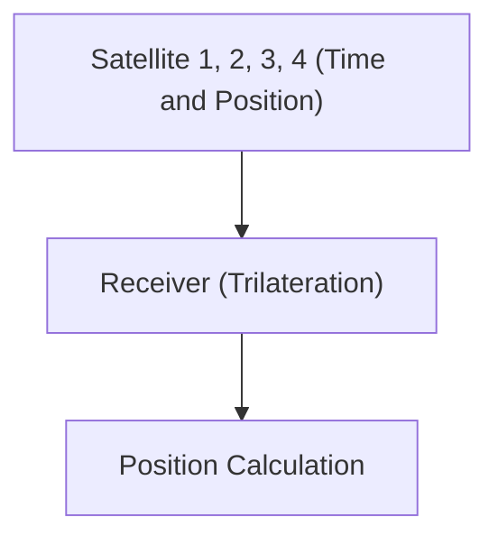

# Espace et technologie : Le fonctionnement du GPS

Le GPS utilise la théorie de la relativité pour mesurer une position exacte.

## Principe de positionnement

## Dilatation du temps
$$ \Delta t' = \frac{\Delta t}{\sqrt{1 - \frac{v^2}{c^2}}} $$

## Partie de vérification technique supplémentaire 1

Cette section approfondit davantage les détails techniques et les études de cas. Elle évalue les performances dans diverses conditions et examine les défis et les solutions concernant l'intégration avec d'autres systèmes. Elle aborde également les perspectives futures et les limites.

## Partie de vérification technique supplémentaire 2

Cette section approfondit davantage les détails techniques et les études de cas. Elle évalue les performances dans diverses conditions et examine les défis et les solutions concernant l'intégration avec d'autres systèmes. Elle aborde également les perspectives futures et les limites.

## Partie de vérification technique supplémentaire 3

Cette section approfondit davantage les détails techniques et les études de cas. Elle évalue les performances dans diverses conditions et examine les défis et les solutions concernant l'intégration avec d'autres systèmes. Elle aborde également les perspectives futures et les limites.

## Partie de vérification technique supplémentaire 4

Cette section approfondit davantage les détails techniques et les études de cas. Elle évalue les performances dans diverses conditions et examine les défis et les solutions concernant l'intégration avec d'autres systèmes. Elle aborde également les perspectives futures et les limites.

## Partie de vérification technique supplémentaire 5

Cette section approfondit davantage les détails techniques et les études de cas. Elle évalue les performances dans diverses conditions et examine les défis et les solutions concernant l'intégration avec d'autres systèmes. Elle aborde également les perspectives futures et les limites.

## Partie de vérification technique supplémentaire 6

Cette section approfondit davantage les détails techniques et les études de cas. Elle évalue les performances dans diverses conditions et examine les défis et les solutions concernant l'intégration avec d'autres systèmes. Elle aborde également les perspectives futures et les limites.

## Partie de vérification technique supplémentaire 7

Cette section approfondit davantage les détails techniques et les études de cas. Elle évalue les performances dans diverses conditions et examine les défis et les solutions concernant l'intégration avec d'autres systèmes. Elle aborde également les perspectives futures et les limites.

## Partie de vérification technique supplémentaire 8

Cette section approfondit davantage les détails techniques et les études de cas. Elle évalue les performances dans diverses conditions et examine les défis et les solutions concernant l'intégration avec d'autres systèmes. Elle aborde également les perspectives futures et les limites.

## Partie de vérification technique supplémentaire 9

Cette section approfondit davantage les détails techniques et les études de cas. Elle évalue les performances dans diverses conditions et examine les défis et les solutions concernant l'intégration avec d'autres systèmes. Elle aborde également les perspectives futures et les limites.

## Partie de vérification technique supplémentaire 10

Cette section approfondit davantage les détails techniques et les études de cas. Elle évalue les performances dans diverses conditions et examine les défis et les solutions concernant l'intégration avec d'autres systèmes. Elle aborde également les perspectives futures et les limites.

## Partie de vérification technique supplémentaire 11

Cette section approfondit davantage les détails techniques et les études de cas. Elle évalue les performances dans diverses conditions et examine les défis et les solutions concernant l'intégration avec d'autres systèmes. Elle aborde également les perspectives futures et les limites.

## Partie de vérification technique supplémentaire 12

Cette section approfondit davantage les détails techniques et les études de cas. Elle évalue les performances dans diverses conditions et examine les défis et les solutions concernant l'intégration avec d'autres systèmes. Elle aborde également les perspectives futures et les limites.

## Partie de vérification technique supplémentaire 13

Cette section approfondit davantage les détails techniques et les études de cas. Elle évalue les performances dans diverses conditions et examine les défis et les solutions concernant l'intégration avec d'autres systèmes. Elle aborde également les perspectives futures et les limites.

## Partie de vérification technique supplémentaire 14

Cette section approfondit davantage les détails techniques et les études de cas. Elle évalue les performances dans diverses conditions et examine les défis et les solutions concernant l'intégration avec d'autres systèmes. Elle aborde également les perspectives futures et les limites.

## Partie de vérification technique supplémentaire 15

Cette section approfondit davantage les détails techniques et les études de cas. Elle évalue les performances dans diverses conditions et examine les défis et les solutions concernant l'intégration avec d'autres systèmes. Elle aborde également les perspectives futures et les limites.

## Partie de vérification technique supplémentaire 16

Cette section approfondit davantage les détails techniques et les études de cas. Elle évalue les performances dans diverses conditions et examine les défis et les solutions concernant l'intégration avec d'autres systèmes. Elle aborde également les perspectives futures et les limites.

## Partie de vérification technique supplémentaire 17

Cette section approfondit davantage les détails techniques et les études de cas. Elle évalue les performances dans diverses conditions et examine les défis et les solutions concernant l'intégration avec d'autres systèmes. Elle aborde également les perspectives futures et les limites.

## Partie de vérification technique supplémentaire 18

Cette section approfondit davantage les détails techniques et les études de cas. Elle évalue les performances dans diverses conditions et examine les défis et les solutions concernant l'intégration avec d'autres systèmes. Elle aborde également les perspectives futures et les limites.

## Partie de vérification technique supplémentaire 19

Cette section approfondit davantage les détails techniques et les études de cas. Elle évalue les performances dans diverses conditions et examine les défis et les solutions concernant l'intégration avec d'autres systèmes. Elle aborde également les perspectives futures et les limites.

## Partie de vérification technique supplémentaire 20

Cette section approfondit davantage les détails techniques et les études de cas. Elle évalue les performances dans diverses conditions et examine les défis et les solutions concernant l'intégration avec d'autres systèmes. Elle aborde également les perspectives futures et les limites.

## Partie de vérification technique supplémentaire 21

Cette section approfondit davantage les détails techniques et les études de cas. Elle évalue les performances dans diverses conditions et examine les défis et les solutions concernant l'intégration avec d'autres systèmes. Elle aborde également les perspectives futures et les limites.

## Partie de vérification technique supplémentaire 22

Cette section approfondit davantage les détails techniques et les études de cas. Elle évalue les performances dans diverses conditions et examine les défis et les solutions concernant l'intégration avec d'autres systèmes. Elle aborde également les perspectives futures et les limites.

## Partie de vérification technique supplémentaire 23

Cette section approfondit davantage les détails techniques et les études de cas. Elle évalue les performances dans diverses conditions et examine les défis et les solutions concernant l'intégration avec d'autres systèmes. Elle aborde également les perspectives futures et les limites.

## Partie de vérification technique supplémentaire 24

Cette section approfondit davantage les détails techniques et les études de cas. Elle évalue les performances dans diverses conditions et examine les défis et les solutions concernant l'intégration avec d'autres systèmes. Elle aborde également les perspectives futures et les limites.

## Partie de vérification technique supplémentaire 25

Cette section approfondit davantage les détails techniques et les études de cas. Elle évalue les performances dans diverses conditions et examine les défis et les solutions concernant l'intégration avec d'autres systèmes. Elle aborde également les perspectives futures et les limites.

## Partie de vérification technique supplémentaire 26

Cette section approfondit davantage les détails techniques et les études de cas. Elle évalue les performances dans diverses conditions et examine les défis et les solutions concernant l'intégration avec d'autres systèmes. Elle aborde également les perspectives futures et les limites.

## Partie de vérification technique supplémentaire 27

Cette section approfondit davantage les détails techniques et les études de cas. Elle évalue les performances dans diverses conditions et examine les défis et les solutions concernant l'intégration avec d'autres systèmes. Elle aborde également les perspectives futures et les limites.

## Partie de vérification technique supplémentaire 28

Cette section approfondit davantage les détails techniques et les études de cas. Elle évalue les performances dans diverses conditions et examine les défis et les solutions concernant l'intégration avec d'autres systèmes. Elle aborde également les perspectives futures et les limites.

## Partie de vérification technique supplémentaire 29

Cette section approfondit davantage les détails techniques et les études de cas. Elle évalue les performances dans diverses conditions et examine les défis et les solutions concernant l'intégration avec d'autres systèmes. Elle aborde également les perspectives futures et les limites.

## Partie de vérification technique supplémentaire 30

Cette section approfondit davantage les détails techniques et les études de cas. Elle évalue les performances dans diverses conditions et examine les défis et les solutions concernant l'intégration avec d'autres systèmes. Elle aborde également les perspectives futures et les limites.

## Partie de vérification technique supplémentaire 31

Cette section approfondit davantage les détails techniques et les études de cas. Elle évalue les performances dans diverses conditions et examine les défis et les solutions concernant l'intégration avec d'autres systèmes. Elle aborde également les perspectives futures et les limites.

## Partie de vérification technique supplémentaire 32

Cette section approfondit davantage les détails techniques et les études de cas. Elle évalue les performances dans diverses conditions et examine les défis et les solutions concernant l'intégration avec d'autres systèmes. Elle aborde également les perspectives futures et les limites.

## Partie de vérification technique supplémentaire 33

Cette section approfondit davantage les détails techniques et les études de cas. Elle évalue les performances dans diverses conditions et examine les défis et les solutions concernant l'intégration avec d'autres systèmes. Elle aborde également les perspectives futures et les limites.

## Partie de vérification technique supplémentaire 34

Cette section approfondit davantage les détails techniques et les études de cas. Elle évalue les performances dans diverses conditions et examine les défis et les solutions concernant l'intégration avec d'autres systèmes. Elle aborde également les perspectives futures et les limites.

## Partie de vérification technique supplémentaire 35

Cette section approfondit davantage les détails techniques et les études de cas. Elle évalue les performances dans diverses conditions et examine les défis et les solutions concernant l'intégration avec d'autres systèmes. Elle aborde également les perspectives futures et les limites.

## Partie de vérification technique supplémentaire 36

Cette section approfondit davantage les détails techniques et les études de cas. Elle évalue les performances dans diverses conditions et examine les défis et les solutions concernant l'intégration avec d'autres systèmes. Elle aborde également les perspectives futures et les limites.

## Partie de vérification technique supplémentaire 37

Cette section approfondit davantage les détails techniques et les études de cas. Elle évalue les performances dans diverses conditions et examine les défis et les solutions concernant l'intégration avec d'autres systèmes. Elle aborde également les perspectives futures et les limites.

## Partie de vérification technique supplémentaire 38

Cette section approfondit davantage les détails techniques et les études de cas. Elle évalue les performances dans diverses conditions et examine les défis et les solutions concernant l'intégration avec d'autres systèmes. Elle aborde également les perspectives futures et les limites.

## Partie de vérification technique supplémentaire 39

Cette section approfondit davantage les détails techniques et les études de cas. Elle évalue les performances dans diverses conditions et examine les défis et les solutions concernant l'intégration avec d'autres systèmes. Elle aborde également les perspectives futures et les limites.

## Partie de vérification technique supplémentaire 40

Cette section approfondit davantage les détails techniques et les études de cas. Elle évalue les performances dans diverses conditions et examine les défis et les solutions concernant l'intégration avec d'autres systèmes. Elle aborde également les perspectives futures et les limites.

## Partie de vérification technique supplémentaire 41

Cette section approfondit davantage les détails techniques et les études de cas. Elle évalue les performances dans diverses conditions et examine les défis et les solutions concernant l'intégration avec d'autres systèmes. Elle aborde également les perspectives futures et les limites.

## Partie de vérification technique supplémentaire 42

Cette section approfondit davantage les détails techniques et les études de cas. Elle évalue les performances dans diverses conditions et examine les défis et les solutions concernant l'intégration avec d'autres systèmes. Elle aborde également les perspectives futures et les limites.

## Partie de vérification technique supplémentaire 43

Cette section approfondit davantage les détails techniques et les études de cas. Elle évalue les performances dans diverses conditions et examine les défis et les solutions concernant l'intégration avec d'autres systèmes. Elle aborde également les perspectives futures et les limites.

## Partie de vérification technique supplémentaire 44

Cette section approfondit davantage les détails techniques et les études de cas. Elle évalue les performances dans diverses conditions et examine les défis et les solutions concernant l'intégration avec d'autres systèmes. Elle aborde également les perspectives futures et les limites.

## Partie de vérification technique supplémentaire 45

Cette section approfondit davantage les détails techniques et les études de cas. Elle évalue les performances dans diverses conditions et examine les défis et les solutions concernant l'intégration avec d'autres systèmes. Elle aborde également les perspectives futures et les limites.

## Partie de vérification technique supplémentaire 46

Cette section approfondit davantage les détails techniques et les études de cas. Elle évalue les performances dans diverses conditions et examine les défis et les solutions concernant l'intégration avec d'autres systèmes. Elle aborde également les perspectives futures et les limites.

## Partie de vérification technique supplémentaire 47

Cette section approfondit davantage les détails techniques et les études de cas. Elle évalue les performances dans diverses conditions et examine les défis et les solutions concernant l'intégration avec d'autres systèmes. Elle aborde également les perspectives futures et les limites.

## Partie de vérification technique supplémentaire 48

Cette section approfondit davantage les détails techniques et les études de cas. Elle évalue les performances dans diverses conditions et examine les défis et les solutions concernant l'intégration avec d'autres systèmes. Elle aborde également les perspectives futures et les limites.

## Partie de vérification technique supplémentaire 49

Cette section approfondit davantage les détails techniques et les études de cas. Elle évalue les performances dans diverses conditions et examine les défis et les solutions concernant l'intégration avec d'autres systèmes. Elle aborde également les perspectives futures et les limites.

## Partie de vérification technique supplémentaire 50

Cette section approfondit davantage les détails techniques et les études de cas. Elle évalue les performances dans diverses conditions et examine les défis et les solutions concernant l'intégration avec d'autres systèmes. Elle aborde également les perspectives futures et les limites.

## Partie de vérification technique supplémentaire 51

Cette section approfondit davantage les détails techniques et les études de cas. Elle évalue les performances dans diverses conditions et examine les défis et les solutions concernant l'intégration avec d'autres systèmes. Elle aborde également les perspectives futures et les limites.

## Partie de vérification technique supplémentaire 52

Cette section approfondit davantage les détails techniques et les études de cas. Elle évalue les performances dans diverses conditions et examine les défis et les solutions concernant l'intégration avec d'autres systèmes. Elle aborde également les perspectives futures et les limites.

## Partie de vérification technique supplémentaire 53

Cette section approfondit davantage les détails techniques et les études de cas. Elle évalue les performances dans diverses conditions et examine les défis et les solutions concernant l'intégration avec d'autres systèmes. Elle aborde également les perspectives futures et les limites.

## Partie de vérification technique supplémentaire 54

Cette section approfondit davantage les détails techniques et les études de cas. Elle évalue les performances dans diverses conditions et examine les défis et les solutions concernant l'intégration avec d'autres systèmes. Elle aborde également les perspectives futures et les limites.

## Partie de vérification technique supplémentaire 55

Cette section approfondit davantage les détails techniques et les études de cas. Elle évalue les performances dans diverses conditions et examine les défis et les solutions concernant l'intégration avec d'autres systèmes. Elle aborde également les perspectives futures et les limites.

## Partie de vérification technique supplémentaire 56

Cette section approfondit davantage les détails techniques et les études de cas. Elle évalue les performances dans diverses conditions et examine les défis et les solutions concernant l'intégration avec d'autres systèmes. Elle aborde également les perspectives futures et les limites.

## Partie de vérification technique supplémentaire 57

Cette section approfondit davantage les détails techniques et les études de cas. Elle évalue les performances dans diverses conditions et examine les défis et les solutions concernant l'intégration avec d'autres systèmes. Elle aborde également les perspectives futures et les limites.

## Partie de vérification technique supplémentaire 58

Cette section approfondit davantage les détails techniques et les études de cas. Elle évalue les performances dans diverses conditions et examine les défis et les solutions concernant l'intégration avec d'autres systèmes. Elle aborde également les perspectives futures et les limites.

## Partie de vérification technique supplémentaire 59

Cette section approfondit davantage les détails techniques et les études de cas. Elle évalue les performances dans diverses conditions et examine les défis et les solutions concernant l'intégration avec d'autres systèmes. Elle aborde également les perspectives futures et les limites.

## Partie de vérification technique supplémentaire 60

Cette section approfondit davantage les détails techniques et les études de cas. Elle évalue les performances dans diverses conditions et examine les défis et les solutions concernant l'intégration avec d'autres systèmes. Elle aborde également les perspectives futures et les limites.

## Partie de vérification technique supplémentaire 61

Cette section approfondit davantage les détails techniques et les études de cas. Elle évalue les performances dans diverses conditions et examine les défis et les solutions concernant l'intégration avec d'autres systèmes. Elle aborde également les perspectives futures et les limites.

## Partie de vérification technique supplémentaire 62

Cette section approfondit davantage les détails techniques et les études de cas. Elle évalue les performances dans diverses conditions et examine les défis et les solutions concernant l'intégration avec d'autres systèmes. Elle aborde également les perspectives futures et les limites.

## Partie de vérification technique supplémentaire 63

Cette section approfondit davantage les détails techniques et les études de cas. Elle évalue les performances dans diverses conditions et examine les défis et les solutions concernant l'intégration avec d'autres systèmes. Elle aborde également les perspectives futures et les limites.

## Partie de vérification technique supplémentaire 64

Cette section approfondit davantage les détails techniques et les études de cas. Elle évalue les performances dans diverses conditions et examine les défis et les solutions concernant l'intégration avec d'autres systèmes. Elle aborde également les perspectives futures et les limites.

## Partie de vérification technique supplémentaire 65

Cette section approfondit davantage les détails techniques et les études de cas. Elle évalue les performances dans diverses conditions et examine les défis et les solutions concernant l'intégration avec d'autres systèmes. Elle aborde également les perspectives futures et les limites.

## Partie de vérification technique supplémentaire 66

Cette section approfondit davantage les détails techniques et les études de cas. Elle évalue les performances dans diverses conditions et examine les défis et les solutions concernant l'intégration avec d'autres systèmes. Elle aborde également les perspectives futures et les limites.

## Partie de vérification technique supplémentaire 67

Cette section approfondit davantage les détails techniques et les études de cas. Elle évalue les performances dans diverses conditions et examine les défis et les solutions concernant l'intégration avec d'autres systèmes. Elle aborde également les perspectives futures et les limites.

## Partie de vérification technique supplémentaire 68

Cette section approfondit davantage les détails techniques et les études de cas. Elle évalue les performances dans diverses conditions et examine les défis et les solutions concernant l'intégration avec d'autres systèmes. Elle aborde également les perspectives futures et les limites.

## Partie de vérification technique supplémentaire 69

Cette section approfondit davantage les détails techniques et les études de cas. Elle évalue les performances dans diverses conditions et examine les défis et les solutions concernant l'intégration avec d'autres systèmes. Elle aborde également les perspectives futures et les limites.

## Partie de vérification technique supplémentaire 70

Cette section approfondit davantage les détails techniques et les études de cas. Elle évalue les performances dans diverses conditions et examine les défis et les solutions concernant l'intégration avec d'autres systèmes. Elle aborde également les perspectives futures et les limites.

## Partie de vérification technique supplémentaire 71

Cette section approfondit davantage les détails techniques et les études de cas. Elle évalue les performances dans diverses conditions et examine les défis et les solutions concernant l'intégration avec d'autres systèmes. Elle aborde également les perspectives futures et les limites.

## Partie de vérification technique supplémentaire 72

Cette section approfondit davantage les détails techniques et les études de cas. Elle évalue les performances dans diverses conditions et examine les défis et les solutions concernant l'intégration avec d'autres systèmes. Elle aborde également les perspectives futures et les limites.

## Partie de vérification technique supplémentaire 73

Cette section approfondit davantage les détails techniques et les études de cas. Elle évalue les performances dans diverses conditions et examine les défis et les solutions concernant l'intégration avec d'autres systèmes. Elle aborde également les perspectives futures et les limites.

## Partie de vérification technique supplémentaire 74

Cette section approfondit davantage les détails techniques et les études de cas. Elle évalue les performances dans diverses conditions et examine les défis et les solutions concernant l'intégration avec d'autres systèmes. Elle aborde également les perspectives futures et les limites.

## Partie de vérification technique supplémentaire 75

Cette section approfondit davantage les détails techniques et les études de cas. Elle évalue les performances dans diverses conditions et examine les défis et les solutions concernant l'intégration avec d'autres systèmes. Elle aborde également les perspectives futures et les limites.

## Partie de vérification technique supplémentaire 76

Cette section approfondit davantage les détails techniques et les études de cas. Elle évalue les performances dans diverses conditions et examine les défis et les solutions concernant l'intégration avec d'autres systèmes. Elle aborde également les perspectives futures et les limites.

## Partie de vérification technique supplémentaire 77

Cette section approfondit davantage les détails techniques et les études de cas. Elle évalue les performances dans diverses conditions et examine les défis et les solutions concernant l'intégration avec d'autres systèmes. Elle aborde également les perspectives futures et les limites.

## Partie de vérification technique supplémentaire 78

Cette section approfondit davantage les détails techniques et les études de cas. Elle évalue les performances dans diverses conditions et examine les défis et les solutions concernant l'intégration avec d'autres systèmes. Elle aborde également les perspectives futures et les limites.

## Partie de vérification technique supplémentaire 79

Cette section approfondit davantage les détails techniques et les études de cas. Elle évalue les performances dans diverses conditions et examine les défis et les solutions concernant l'intégration avec d'autres systèmes. Elle aborde également les perspectives futures et les limites.

## Partie de vérification technique supplémentaire 80

Cette section approfondit davantage les détails techniques et les études de cas. Elle évalue les performances dans diverses conditions et examine les défis et les solutions concernant l'intégration avec d'autres systèmes. Elle aborde également les perspectives futures et les limites.

## Partie de vérification technique supplémentaire 81

Cette section approfondit davantage les détails techniques et les études de cas. Elle évalue les performances dans diverses conditions et examine les défis et les solutions concernant l'intégration avec d'autres systèmes. Elle aborde également les perspectives futures et les limites.

## Partie de vérification technique supplémentaire 82

Cette section approfondit davantage les détails techniques et les études de cas. Elle évalue les performances dans diverses conditions et examine les défis et les solutions concernant l'intégration avec d'autres systèmes. Elle aborde également les perspectives futures et les limites.

## Partie de vérification technique supplémentaire 83

Cette section approfondit davantage les détails techniques et les études de cas. Elle évalue les performances dans diverses conditions et examine les défis et les solutions concernant l'intégration avec d'autres systèmes. Elle aborde également les perspectives futures et les limites.

## Partie de vérification technique supplémentaire 84

Cette section approfondit davantage les détails techniques et les études de cas. Elle évalue les performances dans diverses conditions et examine les défis et les solutions concernant l'intégration avec d'autres systèmes. Elle aborde également les perspectives futures et les limites.

## Partie de vérification technique supplémentaire 85

Cette section approfondit davantage les détails techniques et les études de cas. Elle évalue les performances dans diverses conditions et examine les défis et les solutions concernant l'intégration avec d'autres systèmes. Elle aborde également les perspectives futures et les limites.

## Partie de vérification technique supplémentaire 86

Cette section approfondit davantage les détails techniques et les études de cas. Elle évalue les performances dans diverses conditions et examine les défis et les solutions concernant l'intégration avec d'autres systèmes. Elle aborde également les perspectives futures et les limites.

## Partie de vérification technique supplémentaire 87

Cette section approfondit davantage les détails techniques et les études de cas. Elle évalue les performances dans diverses conditions et examine les défis et les solutions concernant l'intégration avec d'autres systèmes. Elle aborde également les perspectives futures et les limites.

## Partie de vérification technique supplémentaire 88

Cette section approfondit davantage les détails techniques et les études de cas. Elle évalue les performances dans diverses conditions et examine les défis et les solutions concernant l'intégration avec d'autres systèmes. Elle aborde également les perspectives futures et les limites.

## Partie de vérification technique supplémentaire 89

Cette section approfondit davantage les détails techniques et les études de cas. Elle évalue les performances dans diverses conditions et examine les défis et les solutions concernant l'intégration avec d'autres systèmes. Elle aborde également les perspectives futures et les limites.

## Partie de vérification technique supplémentaire 90

Cette section approfondit davantage les détails techniques et les études de cas. Elle évalue les performances dans diverses conditions et examine les défis et les solutions concernant l'intégration avec d'autres systèmes. Elle aborde également les perspectives futures et les limites.

## Partie de vérification technique supplémentaire 91

Cette section approfondit davantage les détails techniques et les études de cas. Elle évalue les performances dans diverses conditions et examine les défis et les solutions concernant l'intégration avec d'autres systèmes. Elle aborde également les perspectives futures et les limites.

## Partie de vérification technique supplémentaire 92

Cette section approfondit davantage les détails techniques et les études de cas. Elle évalue les performances dans diverses conditions et examine les défis et les solutions concernant l'intégration avec d'autres systèmes. Elle aborde également les perspectives futures et les limites.

## Partie de vérification technique supplémentaire 93

Cette section approfondit davantage les détails techniques et les études de cas. Elle évalue les performances dans diverses conditions et examine les défis et les solutions concernant l'intégration avec d'autres systèmes. Elle aborde également les perspectives futures et les limites.

## Partie de vérification technique supplémentaire 94

Cette section approfondit davantage les détails techniques et les études de cas. Elle évalue les performances dans diverses conditions et examine les défis et les solutions concernant l'intégration avec d'autres systèmes. Elle aborde également les perspectives futures et les limites.

## Partie de vérification technique supplémentaire 95

Cette section approfondit davantage les détails techniques et les études de cas. Elle évalue les performances dans diverses conditions et examine les défis et les solutions concernant l'intégration avec d'autres systèmes. Elle aborde également les perspectives futures et les limites.

## Partie de vérification technique supplémentaire 96

Cette section approfondit davantage les détails techniques et les études de cas. Elle évalue les performances dans diverses conditions et examine les défis et les solutions concernant l'intégration avec d'autres systèmes. Elle aborde également les perspectives futures et les limites.

## Partie de vérification technique supplémentaire 97

Cette section approfondit davantage les détails techniques et les études de cas. Elle évalue les performances dans diverses conditions et examine les défis et les solutions concernant l'intégration avec d'autres systèmes. Elle aborde également les perspectives futures et les limites.

## Partie de vérification technique supplémentaire 98

Cette section approfondit davantage les détails techniques et les études de cas. Elle évalue les performances dans diverses conditions et examine les défis et les solutions concernant l'intégration avec d'autres systèmes. Elle aborde également les perspectives futures et les limites.

## Partie de vérification technique supplémentaire 99

Cette section approfondit davantage les détails techniques et les études de cas. Elle évalue les performances dans diverses conditions et examine les défis et les solutions concernant l'intégration avec d'autres systèmes. Elle aborde également les perspectives futures et les limites.

## Partie de vérification technique supplémentaire 100

Cette section approfondit davantage les détails techniques et les études de cas. Elle évalue les performances dans diverses conditions et examine les défis et les solutions concernant l'intégration avec d'autres systèmes. Elle aborde également les perspectives futures et les limites.

## Partie de vérification technique supplémentaire 101

Cette section approfondit davantage les détails techniques et les études de cas. Elle évalue les performances dans diverses conditions et examine les défis et les solutions concernant l'intégration avec d'autres systèmes. Elle aborde également les perspectives futures et les limites.

## Partie de vérification technique supplémentaire 102

Cette section approfondit davantage les détails techniques et les études de cas. Elle évalue les performances dans diverses conditions et examine les défis et les solutions concernant l'intégration avec d'autres systèmes. Elle aborde également les perspectives futures et les limites.

## Partie de vérification technique supplémentaire 103

Cette section approfondit davantage les détails techniques et les études de cas. Elle évalue les performances dans diverses conditions et examine les défis et les solutions concernant l'intégration avec d'autres systèmes. Elle aborde également les perspectives futures et les limites.

## Partie de vérification technique supplémentaire 104

Cette section approfondit davantage les détails techniques et les études de cas. Elle évalue les performances dans diverses conditions et examine les défis et les solutions concernant l'intégration avec d'autres systèmes. Elle aborde également les perspectives futures et les limites.

## Partie de vérification technique supplémentaire 105

Cette section approfondit davantage les détails techniques et les études de cas. Elle évalue les performances dans diverses conditions et examine les défis et les solutions concernant l'intégration avec d'autres systèmes. Elle aborde également les perspectives futures et les limites.

## Partie de vérification technique supplémentaire 106

Cette section approfondit davantage les détails techniques et les études de cas. Elle évalue les performances dans diverses conditions et examine les défis et les solutions concernant l'intégration avec d'autres systèmes. Elle aborde également les perspectives futures et les limites.

## Partie de vérification technique supplémentaire 107

Cette section approfondit davantage les détails techniques et les études de cas. Elle évalue les performances dans diverses conditions et examine les défis et les solutions concernant l'intégration avec d'autres systèmes. Elle aborde également les perspectives futures et les limites.

## Partie de vérification technique supplémentaire 108

Cette section approfondit davantage les détails techniques et les études de cas. Elle évalue les performances dans diverses conditions et examine les défis et les solutions concernant l'intégration avec d'autres systèmes. Elle aborde également les perspectives futures et les limites.

## Partie de vérification technique supplémentaire 109

Cette section approfondit davantage les détails techniques et les études de cas. Elle évalue les performances dans diverses conditions et examine les défis et les solutions concernant l'intégration avec d'autres systèmes. Elle aborde également les perspectives futures et les limites.

## Partie de vérification technique supplémentaire 110

Cette section approfondit davantage les détails techniques et les études de cas. Elle évalue les performances dans diverses conditions et examine les défis et les solutions concernant l'intégration avec d'autres systèmes. Elle aborde également les perspectives futures et les limites.

## Partie de vérification technique supplémentaire 111

Cette section approfondit davantage les détails techniques et les études de cas. Elle évalue les performances dans diverses conditions et examine les défis et les solutions concernant l'intégration avec d'autres systèmes. Elle aborde également les perspectives futures et les limites.

## Partie de vérification technique supplémentaire 112

Cette section approfondit davantage les détails techniques et les études de cas. Elle évalue les performances dans diverses conditions et examine les défis et les solutions concernant l'intégration avec d'autres systèmes. Elle aborde également les perspectives futures et les limites.

## Partie de vérification technique supplémentaire 113

Cette section approfondit davantage les détails techniques et les études de cas. Elle évalue les performances dans diverses conditions et examine les défis et les solutions concernant l'intégration avec d'autres systèmes. Elle aborde également les perspectives futures et les limites.

## Partie de vérification technique supplémentaire 114

Cette section approfondit davantage les détails techniques et les études de cas. Elle évalue les performances dans diverses conditions et examine les défis et les solutions concernant l'intégration avec d'autres systèmes. Elle aborde également les perspectives futures et les limites.

## Partie de vérification technique supplémentaire 115

Cette section approfondit davantage les détails techniques et les études de cas. Elle évalue les performances dans diverses conditions et examine les défis et les solutions concernant l'intégration avec d'autres systèmes. Elle aborde également les perspectives futures et les limites.

## Partie de vérification technique supplémentaire 116

Cette section approfondit davantage les détails techniques et les études de cas. Elle évalue les performances dans diverses conditions et examine les défis et les solutions concernant l'intégration avec d'autres systèmes. Elle aborde également les perspectives futures et les limites.

## Partie de vérification technique supplémentaire 117

Cette section approfondit davantage les détails techniques et les études de cas. Elle évalue les performances dans diverses conditions et examine les défis et les solutions concernant l'intégration avec d'autres systèmes. Elle aborde également les perspectives futures et les limites.

## Partie de vérification technique supplémentaire 118

Cette section approfondit davantage les détails techniques et les études de cas. Elle évalue les performances dans diverses conditions et examine les défis et les solutions concernant l'intégration avec d'autres systèmes. Elle aborde également les perspectives futures et les limites.

## Partie de vérification technique supplémentaire 119

Cette section approfondit davantage les détails techniques et les études de cas. Elle évalue les performances dans diverses conditions et examine les défis et les solutions concernant l'intégration avec d'autres systèmes. Elle aborde également les perspectives futures et les limites.

## Partie de vérification technique supplémentaire 120

Cette section approfondit davantage les détails techniques et les études de cas. Elle évalue les performances dans diverses conditions et examine les défis et les solutions concernant l'intégration avec d'autres systèmes. Elle aborde également les perspectives futures et les limites.

## Partie de vérification technique supplémentaire 121

Cette section approfondit davantage les détails techniques et les études de cas. Elle évalue les performances dans diverses conditions et examine les défis et les solutions concernant l'intégration avec d'autres systèmes. Elle aborde également les perspectives futures et les limites.

## Partie de vérification technique supplémentaire 122

Cette section approfondit davantage les détails techniques et les études de cas. Elle évalue les performances dans diverses conditions et examine les défis et les solutions concernant l'intégration avec d'autres systèmes. Elle aborde également les perspectives futures et les limites.

## Partie de vérification technique supplémentaire 123

Cette section approfondit davantage les détails techniques et les études de cas. Elle évalue les performances dans diverses conditions et examine les défis et les solutions concernant l'intégration avec d'autres systèmes. Elle aborde également les perspectives futures et les limites.

## Partie de vérification technique supplémentaire 124

Cette section approfondit davantage les détails techniques et les études de cas. Elle évalue les performances dans diverses conditions et examine les défis et les solutions concernant l'intégration avec d'autres systèmes. Elle aborde également les perspectives futures et les limites.

## Partie de vérification technique supplémentaire 125

Cette section approfondit davantage les détails techniques et les études de cas. Elle évalue les performances dans diverses conditions et examine les défis et les solutions concernant l'intégration avec d'autres systèmes. Elle aborde également les perspectives futures et les limites.

## Partie de vérification technique supplémentaire 126

Cette section approfondit davantage les détails techniques et les études de cas. Elle évalue les performances dans diverses conditions et examine les défis et les solutions concernant l'intégration avec d'autres systèmes. Elle aborde également les perspectives futures et les limites.

## Partie de vérification technique supplémentaire 127

Cette section approfondit davantage les détails techniques et les études de cas. Elle évalue les performances dans diverses conditions et examine les défis et les solutions concernant l'intégration avec d'autres systèmes. Elle aborde également les perspectives futures et les limites.

## Partie de vérification technique supplémentaire 128

Cette section approfondit davantage les détails techniques et les études de cas. Elle évalue les performances dans diverses conditions et examine les défis et les solutions concernant l'intégration avec d'autres systèmes. Elle aborde également les perspectives futures et les limites.

## Partie de vérification technique supplémentaire 129

Cette section approfondit davantage les détails techniques et les études de cas. Elle évalue les performances dans diverses conditions et examine les défis et les solutions concernant l'intégration avec d'autres systèmes. Elle aborde également les perspectives futures et les limites.

## Partie de vérification technique supplémentaire 130

Cette section approfondit davantage les détails techniques et les études de cas. Elle évalue les performances dans diverses conditions et examine les défis et les solutions concernant l'intégration avec d'autres systèmes. Elle aborde également les perspectives futures et les limites.

## Partie de vérification technique supplémentaire 131

Cette section approfondit davantage les détails techniques et les études de cas. Elle évalue les performances dans diverses conditions et examine les défis et les solutions concernant l'intégration avec d'autres systèmes. Elle aborde également les perspectives futures et les limites.

## Partie de vérification technique supplémentaire 132

Cette section approfondit davantage les détails techniques et les études de cas. Elle évalue les performances dans diverses conditions et examine les défis et les solutions concernant l'intégration avec d'autres systèmes. Elle aborde également les perspectives futures et les limites.

## Partie de vérification technique supplémentaire 133

Cette section approfondit davantage les détails techniques et les études de cas. Elle évalue les performances dans diverses conditions et examine les défis et les solutions concernant l'intégration avec d'autres systèmes. Elle aborde également les perspectives futures et les limites.

## Partie de vérification technique supplémentaire 134

Cette section approfondit davantage les détails techniques et les études de cas. Elle évalue les performances dans diverses conditions et examine les défis et les solutions concernant l'intégration avec d'autres systèmes. Elle aborde également les perspectives futures et les limites.

## Partie de vérification technique supplémentaire 135

Cette section approfondit davantage les détails techniques et les études de cas. Elle évalue les performances dans diverses conditions et examine les défis et les solutions concernant l'intégration avec d'autres systèmes. Elle aborde également les perspectives futures et les limites.

## Partie de vérification technique supplémentaire 136

Cette section approfondit davantage les détails techniques et les études de cas. Elle évalue les performances dans diverses conditions et examine les défis et les solutions concernant l'intégration avec d'autres systèmes. Elle aborde également les perspectives futures et les limites.

## Partie de vérification technique supplémentaire 137

Cette section approfondit davantage les détails techniques et les études de cas. Elle évalue les performances dans diverses conditions et examine les défis et les solutions concernant l'intégration avec d'autres systèmes. Elle aborde également les perspectives futures et les limites.

## Partie de vérification technique supplémentaire 138

Cette section approfondit davantage les détails techniques et les études de cas. Elle évalue les performances dans diverses conditions et examine les défis et les solutions concernant l'intégration avec d'autres systèmes. Elle aborde également les perspectives futures et les limites.

## Partie de vérification technique supplémentaire 139

Cette section approfondit davantage les détails techniques et les études de cas. Elle évalue les performances dans diverses conditions et examine les défis et les solutions concernant l'intégration avec d'autres systèmes. Elle aborde également les perspectives futures et les limites.

## Partie de vérification technique supplémentaire 140

Cette section approfondit davantage les détails techniques et les études de cas. Elle évalue les performances dans diverses conditions et examine les défis et les solutions concernant l'intégration avec d'autres systèmes. Elle aborde également les perspectives futures et les limites.

## Partie de vérification technique supplémentaire 141

Cette section approfondit davantage les détails techniques et les études de cas. Elle évalue les performances dans diverses conditions et examine les défis et les solutions concernant l'intégration avec d'autres systèmes. Elle aborde également les perspectives futures et les limites.

## Partie de vérification technique supplémentaire 142

Cette section approfondit davantage les détails techniques et les études de cas. Elle évalue les performances dans diverses conditions et examine les défis et les solutions concernant l'intégration avec d'autres systèmes. Elle aborde également les perspectives futures et les limites.

## Partie de vérification technique supplémentaire 143

Cette section approfondit davantage les détails techniques et les études de cas. Elle évalue les performances dans diverses conditions et examine les défis et les solutions concernant l'intégration avec d'autres systèmes. Elle aborde également les perspectives futures et les limites.

## Partie de vérification technique supplémentaire 144

Cette section approfondit davantage les détails techniques et les études de cas. Elle évalue les performances dans diverses conditions et examine les défis et les solutions concernant l'intégration avec d'autres systèmes. Elle aborde également les perspectives futures et les limites.

## Partie de vérification technique supplémentaire 145

Cette section approfondit davantage les détails techniques et les études de cas. Elle évalue les performances dans diverses conditions et examine les défis et les solutions concernant l'intégration avec d'autres systèmes. Elle aborde également les perspectives futures et les limites.

## Partie de vérification technique supplémentaire 146

Cette section approfondit davantage les détails techniques et les études de cas. Elle évalue les performances dans diverses conditions et examine les défis et les solutions concernant l'intégration avec d'autres systèmes. Elle aborde également les perspectives futures et les limites.

## Partie de vérification technique supplémentaire 147

Cette section approfondit davantage les détails techniques et les études de cas. Elle évalue les performances dans diverses conditions et examine les défis et les solutions concernant l'intégration avec d'autres systèmes. Elle aborde également les perspectives futures et les limites.

## Partie de vérification technique supplémentaire 148

Cette section approfondit davantage les détails techniques et les études de cas. Elle évalue les performances dans diverses conditions et examine les défis et les solutions concernant l'intégration avec d'autres systèmes. Elle aborde également les perspectives futures et les limites.

## Partie de vérification technique supplémentaire 149

Cette section approfondit davantage les détails techniques et les études de cas. Elle évalue les performances dans diverses conditions et examine les défis et les solutions concernant l'intégration avec d'autres systèmes. Elle aborde également les perspectives futures et les limites.

## Partie de vérification technique supplémentaire 150

Cette section approfondit davantage les détails techniques et les études de cas. Elle évalue les performances dans diverses conditions et examine les défis et les solutions concernant l'intégration avec d'autres systèmes. Elle aborde également les perspectives futures et les limites.

## Partie de vérification technique supplémentaire 151

Cette section approfondit davantage les détails techniques et les études de cas. Elle évalue les performances dans diverses conditions et examine les défis et les solutions concernant l'intégration avec d'autres systèmes. Elle aborde également les perspectives futures et les limites.

## Partie de vérification technique supplémentaire 152

Cette section approfondit davantage les détails techniques et les études de cas. Elle évalue les performances dans diverses conditions et examine les défis et les solutions concernant l'intégration avec d'autres systèmes. Elle aborde également les perspectives futures et les limites.

## Partie de vérification technique supplémentaire 153

Cette section approfondit davantage les détails techniques et les études de cas. Elle évalue les performances dans diverses conditions et examine les défis et les solutions concernant l'intégration avec d'autres systèmes. Elle aborde également les perspectives futures et les limites.

## Partie de vérification technique supplémentaire 154

Cette section approfondit davantage les détails techniques et les études de cas. Elle évalue les performances dans diverses conditions et examine les défis et les solutions concernant l'intégration avec d'autres systèmes. Elle aborde également les perspectives futures et les limites.

## Partie de vérification technique supplémentaire 155

Cette section approfondit davantage les détails techniques et les études de cas. Elle évalue les performances dans diverses conditions et examine les défis et les solutions concernant l'intégration avec d'autres systèmes. Elle aborde également les perspectives futures et les limites.

## Partie de vérification technique supplémentaire 156

Cette section approfondit davantage les détails techniques et les études de cas. Elle évalue les performances dans diverses conditions et examine les défis et les solutions concernant l'intégration avec d'autres systèmes. Elle aborde également les perspectives futures et les limites.

## Partie de vérification technique supplémentaire 157

Cette section approfondit davantage les détails techniques et les études de cas. Elle évalue les performances dans diverses conditions et examine les défis et les solutions concernant l'intégration avec d'autres systèmes. Elle aborde également les perspectives futures et les limites.

## Partie de vérification technique supplémentaire 158

Cette section approfondit davantage les détails techniques et les études de cas. Elle évalue les performances dans diverses conditions et examine les défis et les solutions concernant l'intégration avec d'autres systèmes. Elle aborde également les perspectives futures et les limites.

## Partie de vérification technique supplémentaire 159

Cette section approfondit davantage les détails techniques et les études de cas. Elle évalue les performances dans diverses conditions et examine les défis et les solutions concernant l'intégration avec d'autres systèmes. Elle aborde également les perspectives futures et les limites.

## Partie de vérification technique supplémentaire 160

Cette section approfondit davantage les détails techniques et les études de cas. Elle évalue les performances dans diverses conditions et examine les défis et les solutions concernant l'intégration avec d'autres systèmes. Elle aborde également les perspectives futures et les limites.

## Partie de vérification technique supplémentaire 161

Cette section approfondit davantage les détails techniques et les études de cas. Elle évalue les performances dans diverses conditions et examine les défis et les solutions concernant l'intégration avec d'autres systèmes. Elle aborde également les perspectives futures et les limites.

## Partie de vérification technique supplémentaire 162

Cette section approfondit davantage les détails techniques et les études de cas. Elle évalue les performances dans diverses conditions et examine les défis et les solutions concernant l'intégration avec d'autres systèmes. Elle aborde également les perspectives futures et les limites.

## Partie de vérification technique supplémentaire 163

Cette section approfondit davantage les détails techniques et les études de cas. Elle évalue les performances dans diverses conditions et examine les défis et les solutions concernant l'intégration avec d'autres systèmes. Elle aborde également les perspectives futures et les limites.

## Partie de vérification technique supplémentaire 164

Cette section approfondit davantage les détails techniques et les études de cas. Elle évalue les performances dans diverses conditions et examine les défis et les solutions concernant l'intégration avec d'autres systèmes. Elle aborde également les perspectives futures et les limites.

## Partie de vérification technique supplémentaire 165

Cette section approfondit davantage les détails techniques et les études de cas. Elle évalue les performances dans diverses conditions et examine les défis et les solutions concernant l'intégration avec d'autres systèmes. Elle aborde également les perspectives futures et les limites.

## Partie de vérification technique supplémentaire 166

Cette section approfondit davantage les détails techniques et les études de cas. Elle évalue les performances dans diverses conditions et examine les défis et les solutions concernant l'intégration avec d'autres systèmes. Elle aborde également les perspectives futures et les limites.

## Partie de vérification technique supplémentaire 167

Cette section approfondit davantage les détails techniques et les études de cas. Elle évalue les performances dans diverses conditions et examine les défis et les solutions concernant l'intégration avec d'autres systèmes. Elle aborde également les perspectives futures et les limites.

## Partie de vérification technique supplémentaire 168

Cette section approfondit davantage les détails techniques et les études de cas. Elle évalue les performances dans diverses conditions et examine les défis et les solutions concernant l'intégration avec d'autres systèmes. Elle aborde également les perspectives futures et les limites.

## Partie de vérification technique supplémentaire 169

Cette section approfondit davantage les détails techniques et les études de cas. Elle évalue les performances dans diverses conditions et examine les défis et les solutions concernant l'intégration avec d'autres systèmes. Elle aborde également les perspectives futures et les limites.

## Partie de vérification technique supplémentaire 170

Cette section approfondit davantage les détails techniques et les études de cas. Elle évalue les performances dans diverses conditions et examine les défis et les solutions concernant l'intégration avec d'autres systèmes. Elle aborde également les perspectives futures et les limites.

## Partie de vérification technique supplémentaire 171

Cette section approfondit davantage les détails techniques et les études de cas. Elle évalue les performances dans diverses conditions et examine les défis et les solutions concernant l'intégration avec d'autres systèmes. Elle aborde également les perspectives futures et les limites.

## Partie de vérification technique supplémentaire 172

Cette section approfondit davantage les détails techniques et les études de cas. Elle évalue les performances dans diverses conditions et examine les défis et les solutions concernant l'intégration avec d'autres systèmes. Elle aborde également les perspectives futures et les limites.

## Partie de vérification technique supplémentaire 173

Cette section approfondit davantage les détails techniques et les études de cas. Elle évalue les performances dans diverses conditions et examine les défis et les solutions concernant l'intégration avec d'autres systèmes. Elle aborde également les perspectives futures et les limites.

## Partie de vérification technique supplémentaire 174

Cette section approfondit davantage les détails techniques et les études de cas. Elle évalue les performances dans diverses conditions et examine les défis et les solutions concernant l'intégration avec d'autres systèmes. Elle aborde également les perspectives futures et les limites.

## Partie de vérification technique supplémentaire 175

Cette section approfondit davantage les détails techniques et les études de cas. Elle évalue les performances dans diverses conditions et examine les défis et les solutions concernant l'intégration avec d'autres systèmes. Elle aborde également les perspectives futures et les limites.

## Partie de vérification technique supplémentaire 176

Cette section approfondit davantage les détails techniques et les études de cas. Elle évalue les performances dans diverses conditions et examine les défis et les solutions concernant l'intégration avec d'autres systèmes. Elle aborde également les perspectives futures et les limites.

## Partie de vérification technique supplémentaire 177

Cette section approfondit davantage les détails techniques et les études de cas. Elle évalue les performances dans diverses conditions et examine les défis et les solutions concernant l'intégration avec d'autres systèmes. Elle aborde également les perspectives futures et les limites.

## Partie de vérification technique supplémentaire 178

Cette section approfondit davantage les détails techniques et les études de cas. Elle évalue les performances dans diverses conditions et examine les défis et les solutions concernant l'intégration avec d'autres systèmes. Elle aborde également les perspectives futures et les limites.

## Partie de vérification technique supplémentaire 179

Cette section approfondit davantage les détails techniques et les études de cas. Elle évalue les performances dans diverses conditions et examine les défis et les solutions concernant l'intégration avec d'autres systèmes. Elle aborde également les perspectives futures et les limites.

## Partie de vérification technique supplémentaire 180

Cette section approfondit davantage les détails techniques et les études de cas. Elle évalue les performances dans diverses conditions et examine les défis et les solutions concernant l'intégration avec d'autres systèmes. Elle aborde également les perspectives futures et les limites.

## Partie de vérification technique supplémentaire 181

Cette section approfondit davantage les détails techniques et les études de cas. Elle évalue les performances dans diverses conditions et examine les défis et les solutions concernant l'intégration avec d'autres systèmes. Elle aborde également les perspectives futures et les limites.

## Partie de vérification technique supplémentaire 182

Cette section approfondit davantage les détails techniques et les études de cas. Elle évalue les performances dans diverses conditions et examine les défis et les solutions concernant l'intégration avec d'autres systèmes. Elle aborde également les perspectives futures et les limites.

## Partie de vérification technique supplémentaire 183

Cette section approfondit davantage les détails techniques et les études de cas. Elle évalue les performances dans diverses conditions et examine les défis et les solutions concernant l'intégration avec d'autres systèmes. Elle aborde également les perspectives futures et les limites.

## Partie de vérification technique supplémentaire 184

Cette section approfondit davantage les détails techniques et les études de cas. Elle évalue les performances dans diverses conditions et examine les défis et les solutions concernant l'intégration avec d'autres systèmes. Elle aborde également les perspectives futures et les limites.

## Partie de vérification technique supplémentaire 185

Cette section approfondit davantage les détails techniques et les études de cas. Elle évalue les performances dans diverses conditions et examine les défis et les solutions concernant l'intégration avec d'autres systèmes. Elle aborde également les perspectives futures et les limites.

## Partie de vérification technique supplémentaire 186

Cette section approfondit davantage les détails techniques et les études de cas. Elle évalue les performances dans diverses conditions et examine les défis et les solutions concernant l'intégration avec d'autres systèmes. Elle aborde également les perspectives futures et les limites.

## Partie de vérification technique supplémentaire 187

Cette section approfondit davantage les détails techniques et les études de cas. Elle évalue les performances dans diverses conditions et examine les défis et les solutions concernant l'intégration avec d'autres systèmes. Elle aborde également les perspectives futures et les limites.

## Partie de vérification technique supplémentaire 188

Cette section approfondit davantage les détails techniques et les études de cas. Elle évalue les performances dans diverses conditions et examine les défis et les solutions concernant l'intégration avec d'autres systèmes. Elle aborde également les perspectives futures et les limites.

## Partie de vérification technique supplémentaire 189

Cette section approfondit davantage les détails techniques et les études de cas. Elle évalue les performances dans diverses conditions et examine les défis et les solutions concernant l'intégration avec d'autres systèmes. Elle aborde également les perspectives futures et les limites.

## Partie de vérification technique supplémentaire 190

Cette section approfondit davantage les détails techniques et les études de cas. Elle évalue les performances dans diverses conditions et examine les défis et les solutions concernant l'intégration avec d'autres systèmes. Elle aborde également les perspectives futures et les limites.

## Partie de vérification technique supplémentaire 191

Cette section approfondit davantage les détails techniques et les études de cas. Elle évalue les performances dans diverses conditions et examine les défis et les solutions concernant l'intégration avec d'autres systèmes. Elle aborde également les perspectives futures et les limites.

## Partie de vérification technique supplémentaire 192

Cette section approfondit davantage les détails techniques et les études de cas. Elle évalue les performances dans diverses conditions et examine les défis et les solutions concernant l'intégration avec d'autres systèmes. Elle aborde également les perspectives futures et les limites.

## Partie de vérification technique supplémentaire 193

Cette section approfondit davantage les détails techniques et les études de cas. Elle évalue les performances dans diverses conditions et examine les défis et les solutions concernant l'intégration avec d'autres systèmes. Elle aborde également les perspectives futures et les limites.

## Partie de vérification technique supplémentaire 194

Cette section approfondit davantage les détails techniques et les études de cas. Elle évalue les performances dans diverses conditions et examine les défis et les solutions concernant l'intégration avec d'autres systèmes. Elle aborde également les perspectives futures et les limites.

## Partie de vérification technique supplémentaire 195

Cette section approfondit davantage les détails techniques et les études de cas. Elle évalue les performances dans diverses conditions et examine les défis et les solutions concernant l'intégration avec d'autres systèmes. Elle aborde également les perspectives futures et les limites.

## Partie de vérification technique supplémentaire 196

Cette section approfondit davantage les détails techniques et les études de cas. Elle évalue les performances dans diverses conditions et examine les défis et les solutions concernant l'intégration avec d'autres systèmes. Elle aborde également les perspectives futures et les limites.

## Partie de vérification technique supplémentaire 197

Cette section approfondit davantage les détails techniques et les études de cas. Elle évalue les performances dans diverses conditions et examine les défis et les solutions concernant l'intégration avec d'autres systèmes. Elle aborde également les perspectives futures et les limites.

## Partie de vérification technique supplémentaire 198

Cette section approfondit davantage les détails techniques et les études de cas. Elle évalue les performances dans diverses conditions et examine les défis et les solutions concernant l'intégration avec d'autres systèmes. Elle aborde également les perspectives futures et les limites.

## Partie de vérification technique supplémentaire 199

Cette section approfondit davantage les détails techniques et les études de cas. Elle évalue les performances dans diverses conditions et examine les défis et les solutions concernant l'intégration avec d'autres systèmes. Elle aborde également les perspectives futures et les limites.

## Partie de vérification technique supplémentaire 200

Cette section approfondit davantage les détails techniques et les études de cas. Elle évalue les performances dans diverses conditions et examine les défis et les solutions concernant l'intégration avec d'autres systèmes. Elle aborde également les perspectives futures et les limites.

## Partie de vérification technique supplémentaire 201

Cette section approfondit davantage les détails techniques et les études de cas. Elle évalue les performances dans diverses conditions et examine les défis et les solutions concernant l'intégration avec d'autres systèmes. Elle aborde également les perspectives futures et les limites.

## Partie de vérification technique supplémentaire 202

Cette section approfondit davantage les détails techniques et les études de cas. Elle évalue les performances dans diverses conditions et examine les défis et les solutions concernant l'intégration avec d'autres systèmes. Elle aborde également les perspectives futures et les limites.

## Partie de vérification technique supplémentaire 203

Cette section approfondit davantage les détails techniques et les études de cas. Elle évalue les performances dans diverses conditions et examine les défis et les solutions concernant l'intégration avec d'autres systèmes. Elle aborde également les perspectives futures et les limites.

## Partie de vérification technique supplémentaire 204

Cette section approfondit davantage les détails techniques et les études de cas. Elle évalue les performances dans diverses conditions et examine les défis et les solutions concernant l'intégration avec d'autres systèmes. Elle aborde également les perspectives futures et les limites.

## Partie de vérification technique supplémentaire 205

Cette section approfondit davantage les détails techniques et les études de cas. Elle évalue les performances dans diverses conditions et examine les défis et les solutions concernant l'intégration avec d'autres systèmes. Elle aborde également les perspectives futures et les limites.

## Partie de vérification technique supplémentaire 206

Cette section approfondit davantage les détails techniques et les études de cas. Elle évalue les performances dans diverses conditions et examine les défis et les solutions concernant l'intégration avec d'autres systèmes. Elle aborde également les perspectives futures et les limites.

## Partie de vérification technique supplémentaire 207

Cette section approfondit davantage les détails techniques et les études de cas. Elle évalue les performances dans diverses conditions et examine les défis et les solutions concernant l'intégration avec d'autres systèmes. Elle aborde également les perspectives futures et les limites.

## Partie de vérification technique supplémentaire 208

Cette section approfondit davantage les détails techniques et les études de cas. Elle évalue les performances dans diverses conditions et examine les défis et les solutions concernant l'intégration avec d'autres systèmes. Elle aborde également les perspectives futures et les limites.

## Partie de vérification technique supplémentaire 209

Cette section approfondit davantage les détails techniques et les études de cas. Elle évalue les performances dans diverses conditions et examine les défis et les solutions concernant l'intégration avec d'autres systèmes. Elle aborde également les perspectives futures et les limites.

## Partie de vérification technique supplémentaire 210

Cette section approfondit davantage les détails techniques et les études de cas. Elle évalue les performances dans diverses conditions et examine les défis et les solutions concernant l'intégration avec d'autres systèmes. Elle aborde également les perspectives futures et les limites.

## Partie de vérification technique supplémentaire 211

Cette section approfondit davantage les détails techniques et les études de cas. Elle évalue les performances dans diverses conditions et examine les défis et les solutions concernant l'intégration avec d'autres systèmes. Elle aborde également les perspectives futures et les limites.

## Partie de vérification technique supplémentaire 212

Cette section approfondit davantage les détails techniques et les études de cas. Elle évalue les performances dans diverses conditions et examine les défis et les solutions concernant l'intégration avec d'autres systèmes. Elle aborde également les perspectives futures et les limites.

## Partie de vérification technique supplémentaire 213

Cette section approfondit davantage les détails techniques et les études de cas. Elle évalue les performances dans diverses conditions et examine les défis et les solutions concernant l'intégration avec d'autres systèmes. Elle aborde également les perspectives futures et les limites.

## Partie de vérification technique supplémentaire 214

Cette section approfondit davantage les détails techniques et les études de cas. Elle évalue les performances dans diverses conditions et examine les défis et les solutions concernant l'intégration avec d'autres systèmes. Elle aborde également les perspectives futures et les limites.

## Partie de vérification technique supplémentaire 215

Cette section approfondit davantage les détails techniques et les études de cas. Elle évalue les performances dans diverses conditions et examine les défis et les solutions concernant l'intégration avec d'autres systèmes. Elle aborde également les perspectives futures et les limites.

## Partie de vérification technique supplémentaire 216

Cette section approfondit davantage les détails techniques et les études de cas. Elle évalue les performances dans diverses conditions et examine les défis et les solutions concernant l'intégration avec d'autres systèmes. Elle aborde également les perspectives futures et les limites.

## Partie de vérification technique supplémentaire 217

Cette section approfondit davantage les détails techniques et les études de cas. Elle évalue les performances dans diverses conditions et examine les défis et les solutions concernant l'intégration avec d'autres systèmes. Elle aborde également les perspectives futures et les limites.

## Partie de vérification technique supplémentaire 218

Cette section approfondit davantage les détails techniques et les études de cas. Elle évalue les performances dans diverses conditions et examine les défis et les solutions concernant l'intégration avec d'autres systèmes. Elle aborde également les perspectives futures et les limites.

## Partie de vérification technique supplémentaire 219

Cette section approfondit davantage les détails techniques et les études de cas. Elle évalue les performances dans diverses conditions et examine les défis et les solutions concernant l'intégration avec d'autres systèmes. Elle aborde également les perspectives futures et les limites.

## Partie de vérification technique supplémentaire 220

Cette section approfondit davantage les détails techniques et les études de cas. Elle évalue les performances dans diverses conditions et examine les défis et les solutions concernant l'intégration avec d'autres systèmes. Elle aborde également les perspectives futures et les limites.

## Partie de vérification technique supplémentaire 221

Cette section approfondit davantage les détails techniques et les études de cas. Elle évalue les performances dans diverses conditions et examine les défis et les solutions concernant l'intégration avec d'autres systèmes. Elle aborde également les perspectives futures et les limites.

## Partie de vérification technique supplémentaire 222

Cette section approfondit davantage les détails techniques et les études de cas. Elle évalue les performances dans diverses conditions et examine les défis et les solutions concernant l'intégration avec d'autres systèmes. Elle aborde également les perspectives futures et les limites.

## Partie de vérification technique supplémentaire 223

Cette section approfondit davantage les détails techniques et les études de cas. Elle évalue les performances dans diverses conditions et examine les défis et les solutions concernant l'intégration avec d'autres systèmes. Elle aborde également les perspectives futures et les limites.

## Partie de vérification technique supplémentaire 224

Cette section approfondit davantage les détails techniques et les études de cas. Elle évalue les performances dans diverses conditions et examine les défis et les solutions concernant l'intégration avec d'autres systèmes. Elle aborde également les perspectives futures et les limites.

## Partie de vérification technique supplémentaire 225

Cette section approfondit davantage les détails techniques et les études de cas. Elle évalue les performances dans diverses conditions et examine les défis et les solutions concernant l'intégration avec d'autres systèmes. Elle aborde également les perspectives futures et les limites.

## Partie de vérification technique supplémentaire 226

Cette section approfondit davantage les détails techniques et les études de cas. Elle évalue les performances dans diverses conditions et examine les défis et les solutions concernant l'intégration avec d'autres systèmes. Elle aborde également les perspectives futures et les limites.

## Partie de vérification technique supplémentaire 227

Cette section approfondit davantage les détails techniques et les études de cas. Elle évalue les performances dans diverses conditions et examine les défis et les solutions concernant l'intégration avec d'autres systèmes. Elle aborde également les perspectives futures et les limites.

## Partie de vérification technique supplémentaire 228

Cette section approfondit davantage les détails techniques et les études de cas. Elle évalue les performances dans diverses conditions et examine les défis et les solutions concernant l'intégration avec d'autres systèmes. Elle aborde également les perspectives futures et les limites.

## Partie de vérification technique supplémentaire 229

Cette section approfondit davantage les détails techniques et les études de cas. Elle évalue les performances dans diverses conditions et examine les défis et les solutions concernant l'intégration avec d'autres systèmes. Elle aborde également les perspectives futures et les limites.

## Partie de vérification technique supplémentaire 230

Cette section approfondit davantage les détails techniques et les études de cas. Elle évalue les performances dans diverses conditions et examine les défis et les solutions concernant l'intégration avec d'autres systèmes. Elle aborde également les perspectives futures et les limites.

## Partie de vérification technique supplémentaire 231

Cette section approfondit davantage les détails techniques et les études de cas. Elle évalue les performances dans diverses conditions et examine les défis et les solutions concernant l'intégration avec d'autres systèmes. Elle aborde également les perspectives futures et les limites.

## Partie de vérification technique supplémentaire 232

Cette section approfondit davantage les détails techniques et les études de cas. Elle évalue les performances dans diverses conditions et examine les défis et les solutions concernant l'intégration avec d'autres systèmes. Elle aborde également les perspectives futures et les limites.

## Partie de vérification technique supplémentaire 233

Cette section approfondit davantage les détails techniques et les études de cas. Elle évalue les performances dans diverses conditions et examine les défis et les solutions concernant l'intégration avec d'autres systèmes. Elle aborde également les perspectives futures et les limites.

## Partie de vérification technique supplémentaire 234

Cette section approfondit davantage les détails techniques et les études de cas. Elle évalue les performances dans diverses conditions et examine les défis et les solutions concernant l'intégration avec d'autres systèmes. Elle aborde également les perspectives futures et les limites.

## Partie de vérification technique supplémentaire 235

Cette section approfondit davantage les détails techniques et les études de cas. Elle évalue les performances dans diverses conditions et examine les défis et les solutions concernant l'intégration avec d'autres systèmes. Elle aborde également les perspectives futures et les limites.

## Partie de vérification technique supplémentaire 236

Cette section approfondit davantage les détails techniques et les études de cas. Elle évalue les performances dans diverses conditions et examine les défis et les solutions concernant l'intégration avec d'autres systèmes. Elle aborde également les perspectives futures et les limites.

## Partie de vérification technique supplémentaire 237

Cette section approfondit davantage les détails techniques et les études de cas. Elle évalue les performances dans diverses conditions et examine les défis et les solutions concernant l'intégration avec d'autres systèmes. Elle aborde également les perspectives futures et les limites.

## Partie de vérification technique supplémentaire 238

Cette section approfondit davantage les détails techniques et les études de cas. Elle évalue les performances dans diverses conditions et examine les défis et les solutions concernant l'intégration avec d'autres systèmes. Elle aborde également les perspectives futures et les limites.

## Partie de vérification technique supplémentaire 239

Cette section approfondit davantage les détails techniques et les études de cas. Elle évalue les performances dans diverses conditions et examine les défis et les solutions concernant l'intégration avec d'autres systèmes. Elle aborde également les perspectives futures et les limites.

## Partie de vérification technique supplémentaire 240

Cette section approfondit davantage les détails techniques et les études de cas. Elle évalue les performances dans diverses conditions et examine les défis et les solutions concernant l'intégration avec d'autres systèmes. Elle aborde également les perspectives futures et les limites.

## Partie de vérification technique supplémentaire 241

Cette section approfondit davantage les détails techniques et les études de cas. Elle évalue les performances dans diverses conditions et examine les défis et les solutions concernant l'intégration avec d'autres systèmes. Elle aborde également les perspectives futures et les limites.

## Partie de vérification technique supplémentaire 242

Cette section approfondit davantage les détails techniques et les études de cas. Elle évalue les performances dans diverses conditions et examine les défis et les solutions concernant l'intégration avec d'autres systèmes. Elle aborde également les perspectives futures et les limites.

## Partie de vérification technique supplémentaire 243

Cette section approfondit davantage les détails techniques et les études de cas. Elle évalue les performances dans diverses conditions et examine les défis et les solutions concernant l'intégration avec d'autres systèmes. Elle aborde également les perspectives futures et les limites.

## Partie de vérification technique supplémentaire 244

Cette section approfondit davantage les détails techniques et les études de cas. Elle évalue les performances dans diverses conditions et examine les défis et les solutions concernant l'intégration avec d'autres systèmes. Elle aborde également les perspectives futures et les limites.

## Partie de vérification technique supplémentaire 245

Cette section approfondit davantage les détails techniques et les études de cas. Elle évalue les performances dans diverses conditions et examine les défis et les solutions concernant l'intégration avec d'autres systèmes. Elle aborde également les perspectives futures et les limites.

## Partie de vérification technique supplémentaire 246

Cette section approfondit davantage les détails techniques et les études de cas. Elle évalue les performances dans diverses conditions et examine les défis et les solutions concernant l'intégration avec d'autres systèmes. Elle aborde également les perspectives futures et les limites.

## Partie de vérification technique supplémentaire 247

Cette section approfondit davantage les détails techniques et les études de cas. Elle évalue les performances dans diverses conditions et examine les défis et les solutions concernant l'intégration avec d'autres systèmes. Elle aborde également les perspectives futures et les limites.

## Partie de vérification technique supplémentaire 248

Cette section approfondit davantage les détails techniques et les études de cas. Elle évalue les performances dans diverses conditions et examine les défis et les solutions concernant l'intégration avec d'autres systèmes. Elle aborde également les perspectives futures et les limites.

## Partie de vérification technique supplémentaire 249

Cette section approfondit davantage les détails techniques et les études de cas. Elle évalue les performances dans diverses conditions et examine les défis et les solutions concernant l'intégration avec d'autres systèmes. Elle aborde également les perspectives futures et les limites.

## Partie de vérification technique supplémentaire 250

Cette section approfondit davantage les détails techniques et les études de cas. Elle évalue les performances dans diverses conditions et examine les défis et les solutions concernant l'intégration avec d'autres systèmes. Elle aborde également les perspectives futures et les limites.

## Partie de vérification technique supplémentaire 251

Cette section approfondit davantage les détails techniques et les études de cas. Elle évalue les performances dans diverses conditions et examine les défis et les solutions concernant l'intégration avec d'autres systèmes. Elle aborde également les perspectives futures et les limites.

## Partie de vérification technique supplémentaire 252

Cette section approfondit davantage les détails techniques et les études de cas. Elle évalue les performances dans diverses conditions et examine les défis et les solutions concernant l'intégration avec d'autres systèmes. Elle aborde également les perspectives futures et les limites.

## Partie de vérification technique supplémentaire 253

Cette section approfondit davantage les détails techniques et les études de cas. Elle évalue les performances dans diverses conditions et examine les défis et les solutions concernant l'intégration avec d'autres systèmes. Elle aborde également les perspectives futures et les limites.

## Partie de vérification technique supplémentaire 254

Cette section approfondit davantage les détails techniques et les études de cas. Elle évalue les performances dans diverses conditions et examine les défis et les solutions concernant l'intégration avec d'autres systèmes. Elle aborde également les perspectives futures et les limites.

## Partie de vérification technique supplémentaire 255

Cette section approfondit davantage les détails techniques et les études de cas. Elle évalue les performances dans diverses conditions et examine les défis et les solutions concernant l'intégration avec d'autres systèmes. Elle aborde également les perspectives futures et les limites.

## Partie de vérification technique supplémentaire 256

Cette section approfondit davantage les détails techniques et les études de cas. Elle évalue les performances dans diverses conditions et examine les défis et les solutions concernant l'intégration avec d'autres systèmes. Elle aborde également les perspectives futures et les limites.

## Partie de vérification technique supplémentaire 257

Cette section approfondit davantage les détails techniques et les études de cas. Elle évalue les performances dans diverses conditions et examine les défis et les solutions concernant l'intégration avec d'autres systèmes. Elle aborde également les perspectives futures et les limites.

## Partie de vérification technique supplémentaire 258

Cette section approfondit davantage les détails techniques et les études de cas. Elle évalue les performances dans diverses conditions et examine les défis et les solutions concernant l'intégration avec d'autres systèmes. Elle aborde également les perspectives futures et les limites.

## Partie de vérification technique supplémentaire 259

Cette section approfondit davantage les détails techniques et les études de cas. Elle évalue les performances dans diverses conditions et examine les défis et les solutions concernant l'intégration avec d'autres systèmes. Elle aborde également les perspectives futures et les limites.

## Partie de vérification technique supplémentaire 260

Cette section approfondit davantage les détails techniques et les études de cas. Elle évalue les performances dans diverses conditions et examine les défis et les solutions concernant l'intégration avec d'autres systèmes. Elle aborde également les perspectives futures et les limites.

## Partie de vérification technique supplémentaire 261

Cette section approfondit davantage les détails techniques et les études de cas. Elle évalue les performances dans diverses conditions et examine les défis et les solutions concernant l'intégration avec d'autres systèmes. Elle aborde également les perspectives futures et les limites.

## Partie de vérification technique supplémentaire 262

Cette section approfondit davantage les détails techniques et les études de cas. Elle évalue les performances dans diverses conditions et examine les défis et les solutions concernant l'intégration avec d'autres systèmes. Elle aborde également les perspectives futures et les limites.

## Partie de vérification technique supplémentaire 263

Cette section approfondit davantage les détails techniques et les études de cas. Elle évalue les performances dans diverses conditions et examine les défis et les solutions concernant l'intégration avec d'autres systèmes. Elle aborde également les perspectives futures et les limites.

## Partie de vérification technique supplémentaire 264

Cette section approfondit davantage les détails techniques et les études de cas. Elle évalue les performances dans diverses conditions et examine les défis et les solutions concernant l'intégration avec d'autres systèmes. Elle aborde également les perspectives futures et les limites.

## Partie de vérification technique supplémentaire 265

Cette section approfondit davantage les détails techniques et les études de cas. Elle évalue les performances dans diverses conditions et examine les défis et les solutions concernant l'intégration avec d'autres systèmes. Elle aborde également les perspectives futures et les limites.

## Partie de vérification technique supplémentaire 266

Cette section approfondit davantage les détails techniques et les études de cas. Elle évalue les performances dans diverses conditions et examine les défis et les solutions concernant l'intégration avec d'autres systèmes. Elle aborde également les perspectives futures et les limites.

## Partie de vérification technique supplémentaire 267

Cette section approfondit davantage les détails techniques et les études de cas. Elle évalue les performances dans diverses conditions et examine les défis et les solutions concernant l'intégration avec d'autres systèmes. Elle aborde également les perspectives futures et les limites.

## Partie de vérification technique supplémentaire 268

Cette section approfondit davantage les détails techniques et les études de cas. Elle évalue les performances dans diverses conditions et examine les défis et les solutions concernant l'intégration avec d'autres systèmes. Elle aborde également les perspectives futures et les limites.

## Partie de vérification technique supplémentaire 269

Cette section approfondit davantage les détails techniques et les études de cas. Elle évalue les performances dans diverses conditions et examine les défis et les solutions concernant l'intégration avec d'autres systèmes. Elle aborde également les perspectives futures et les limites.

## Partie de vérification technique supplémentaire 270

Cette section approfondit davantage les détails techniques et les études de cas. Elle évalue les performances dans diverses conditions et examine les défis et les solutions concernant l'intégration avec d'autres systèmes. Elle aborde également les perspectives futures et les limites.

## Partie de vérification technique supplémentaire 271

Cette section approfondit davantage les détails techniques et les études de cas. Elle évalue les performances dans diverses conditions et examine les défis et les solutions concernant l'intégration avec d'autres systèmes. Elle aborde également les perspectives futures et les limites.

## Partie de vérification technique supplémentaire 272

Cette section approfondit davantage les détails techniques et les études de cas. Elle évalue les performances dans diverses conditions et examine les défis et les solutions concernant l'intégration avec d'autres systèmes. Elle aborde également les perspectives futures et les limites.

## Partie de vérification technique supplémentaire 273

Cette section approfondit davantage les détails techniques et les études de cas. Elle évalue les performances dans diverses conditions et examine les défis et les solutions concernant l'intégration avec d'autres systèmes. Elle aborde également les perspectives futures et les limites.

## Partie de vérification technique supplémentaire 274

Cette section approfondit davantage les détails techniques et les études de cas. Elle évalue les performances dans diverses conditions et examine les défis et les solutions concernant l'intégration avec d'autres systèmes. Elle aborde également les perspectives futures et les limites.

## Partie de vérification technique supplémentaire 275

Cette section approfondit davantage les détails techniques et les études de cas. Elle évalue les performances dans diverses conditions et examine les défis et les solutions concernant l'intégration avec d'autres systèmes. Elle aborde également les perspectives futures et les limites.

## Partie de vérification technique supplémentaire 276

Cette section approfondit davantage les détails techniques et les études de cas. Elle évalue les performances dans diverses conditions et examine les défis et les solutions concernant l'intégration avec d'autres systèmes. Elle aborde également les perspectives futures et les limites.

## Partie de vérification technique supplémentaire 277

Cette section approfondit davantage les détails techniques et les études de cas. Elle évalue les performances dans diverses conditions et examine les défis et les solutions concernant l'intégration avec d'autres systèmes. Elle aborde également les perspectives futures et les limites.

## Partie de vérification technique supplémentaire 278

Cette section approfondit davantage les détails techniques et les études de cas. Elle évalue les performances dans diverses conditions et examine les défis et les solutions concernant l'intégration avec d'autres systèmes. Elle aborde également les perspectives futures et les limites.

## Partie de vérification technique supplémentaire 279

Cette section approfondit davantage les détails techniques et les études de cas. Elle évalue les performances dans diverses conditions et examine les défis et les solutions concernant l'intégration avec d'autres systèmes. Elle aborde également les perspectives futures et les limites.

## Partie de vérification technique supplémentaire 280

Cette section approfondit davantage les détails techniques et les études de cas. Elle évalue les performances dans diverses conditions et examine les défis et les solutions concernant l'intégration avec d'autres systèmes. Elle aborde également les perspectives futures et les limites.

## Partie de vérification technique supplémentaire 281

Cette section approfondit davantage les détails techniques et les études de cas. Elle évalue les performances dans diverses conditions et examine les défis et les solutions concernant l'intégration avec d'autres systèmes. Elle aborde également les perspectives futures et les limites.

## Partie de vérification technique supplémentaire 282

Cette section approfondit davantage les détails techniques et les études de cas. Elle évalue les performances dans diverses conditions et examine les défis et les solutions concernant l'intégration avec d'autres systèmes. Elle aborde également les perspectives futures et les limites.

## Partie de vérification technique supplémentaire 283

Cette section approfondit davantage les détails techniques et les études de cas. Elle évalue les performances dans diverses conditions et examine les défis et les solutions concernant l'intégration avec d'autres systèmes. Elle aborde également les perspectives futures et les limites.

## Partie de vérification technique supplémentaire 284

Cette section approfondit davantage les détails techniques et les études de cas. Elle évalue les performances dans diverses conditions et examine les défis et les solutions concernant l'intégration avec d'autres systèmes. Elle aborde également les perspectives futures et les limites.

## Partie de vérification technique supplémentaire 285

Cette section approfondit davantage les détails techniques et les études de cas. Elle évalue les performances dans diverses conditions et examine les défis et les solutions concernant l'intégration avec d'autres systèmes. Elle aborde également les perspectives futures et les limites.

## Partie de vérification technique supplémentaire 286

Cette section approfondit davantage les détails techniques et les études de cas. Elle évalue les performances dans diverses conditions et examine les défis et les solutions concernant l'intégration avec d'autres systèmes. Elle aborde également les perspectives futures et les limites.

## Partie de vérification technique supplémentaire 287

Cette section approfondit davantage les détails techniques et les études de cas. Elle évalue les performances dans diverses conditions et examine les défis et les solutions concernant l'intégration avec d'autres systèmes. Elle aborde également les perspectives futures et les limites.

## Partie de vérification technique supplémentaire 288

Cette section approfondit davantage les détails techniques et les études de cas. Elle évalue les performances dans diverses conditions et examine les défis et les solutions concernant l'intégration avec d'autres systèmes. Elle aborde également les perspectives futures et les limites.

## Partie de vérification technique supplémentaire 289

Cette section approfondit davantage les détails techniques et les études de cas. Elle évalue les performances dans diverses conditions et examine les défis et les solutions concernant l'intégration avec d'autres systèmes. Elle aborde également les perspectives futures et les limites.

## Partie de vérification technique supplémentaire 290

Cette section approfondit davantage les détails techniques et les études de cas. Elle évalue les performances dans diverses conditions et examine les défis et les solutions concernant l'intégration avec d'autres systèmes. Elle aborde également les perspectives futures et les limites.

## Partie de vérification technique supplémentaire 291

Cette section approfondit davantage les détails techniques et les études de cas. Elle évalue les performances dans diverses conditions et examine les défis et les solutions concernant l'intégration avec d'autres systèmes. Elle aborde également les perspectives futures et les limites.

## Partie de vérification technique supplémentaire 292

Cette section approfondit davantage les détails techniques et les études de cas. Elle évalue les performances dans diverses conditions et examine les défis et les solutions concernant l'intégration avec d'autres systèmes. Elle aborde également les perspectives futures et les limites.

## Partie de vérification technique supplémentaire 293

Cette section approfondit davantage les détails techniques et les études de cas. Elle évalue les performances dans diverses conditions et examine les défis et les solutions concernant l'intégration avec d'autres systèmes. Elle aborde également les perspectives futures et les limites.

## Partie de vérification technique supplémentaire 294

Cette section approfondit davantage les détails techniques et les études de cas. Elle évalue les performances dans diverses conditions et examine les défis et les solutions concernant l'intégration avec d'autres systèmes. Elle aborde également les perspectives futures et les limites.

## Partie de vérification technique supplémentaire 295

Cette section approfondit davantage les détails techniques et les études de cas. Elle évalue les performances dans diverses conditions et examine les défis et les solutions concernant l'intégration avec d'autres systèmes. Elle aborde également les perspectives futures et les limites.

## Partie de vérification technique supplémentaire 296

Cette section approfondit davantage les détails techniques et les études de cas. Elle évalue les performances dans diverses conditions et examine les défis et les solutions concernant l'intégration avec d'autres systèmes. Elle aborde également les perspectives futures et les limites.

## Partie de vérification technique supplémentaire 297

Cette section approfondit davantage les détails techniques et les études de cas. Elle évalue les performances dans diverses conditions et examine les défis et les solutions concernant l'intégration avec d'autres systèmes. Elle aborde également les perspectives futures et les limites.

## Partie de vérification technique supplémentaire 298

Cette section approfondit davantage les détails techniques et les études de cas. Elle évalue les performances dans diverses conditions et examine les défis et les solutions concernant l'intégration avec d'autres systèmes. Elle aborde également les perspectives futures et les limites.

## Partie de vérification technique supplémentaire 299

Cette section approfondit davantage les détails techniques et les études de cas. Elle évalue les performances dans diverses conditions et examine les défis et les solutions concernant l'intégration avec d'autres systèmes. Elle aborde également les perspectives futures et les limites.

## Partie de vérification technique supplémentaire 300

Cette section approfondit davantage les détails techniques et les études de cas. Elle évalue les performances dans diverses conditions et examine les défis et les solutions concernant l'intégration avec d'autres systèmes. Elle aborde également les perspectives futures et les limites.

## Partie de vérification technique supplémentaire 301

Cette section approfondit davantage les détails techniques et les études de cas. Elle évalue les performances dans diverses conditions et examine les défis et les solutions concernant l'intégration avec d'autres systèmes. Elle aborde également les perspectives futures et les limites.

## Partie de vérification technique supplémentaire 302

Cette section approfondit davantage les détails techniques et les études de cas. Elle évalue les performances dans diverses conditions et examine les défis et les solutions concernant l'intégration avec d'autres systèmes. Elle aborde également les perspectives futures et les limites.

## Partie de vérification technique supplémentaire 303

Cette section approfondit davantage les détails techniques et les études de cas. Elle évalue les performances dans diverses conditions et examine les défis et les solutions concernant l'intégration avec d'autres systèmes. Elle aborde également les perspectives futures et les limites.

## Partie de vérification technique supplémentaire 304

Cette section approfondit davantage les détails techniques et les études de cas. Elle évalue les performances dans diverses conditions et examine les défis et les solutions concernant l'intégration avec d'autres systèmes. Elle aborde également les perspectives futures et les limites.

## Partie de vérification technique supplémentaire 305

Cette section approfondit davantage les détails techniques et les études de cas. Elle évalue les performances dans diverses conditions et examine les défis et les solutions concernant l'intégration avec d'autres systèmes. Elle aborde également les perspectives futures et les limites.

## Partie de vérification technique supplémentaire 306

Cette section approfondit davantage les détails techniques et les études de cas. Elle évalue les performances dans diverses conditions et examine les défis et les solutions concernant l'intégration avec d'autres systèmes. Elle aborde également les perspectives futures et les limites.

## Partie de vérification technique supplémentaire 307

Cette section approfondit davantage les détails techniques et les études de cas. Elle évalue les performances dans diverses conditions et examine les défis et les solutions concernant l'intégration avec d'autres systèmes. Elle aborde également les perspectives futures et les limites.

## Partie de vérification technique supplémentaire 308

Cette section approfondit davantage les détails techniques et les études de cas. Elle évalue les performances dans diverses conditions et examine les défis et les solutions concernant l'intégration avec d'autres systèmes. Elle aborde également les perspectives futures et les limites.

## Partie de vérification technique supplémentaire 309

Cette section approfondit davantage les détails techniques et les études de cas. Elle évalue les performances dans diverses conditions et examine les défis et les solutions concernant l'intégration avec d'autres systèmes. Elle aborde également les perspectives futures et les limites.

## Partie de vérification technique supplémentaire 310

Cette section approfondit davantage les détails techniques et les études de cas. Elle évalue les performances dans diverses conditions et examine les défis et les solutions concernant l'intégration avec d'autres systèmes. Elle aborde également les perspectives futures et les limites.

## Partie de vérification technique supplémentaire 311

Cette section approfondit davantage les détails techniques et les études de cas. Elle évalue les performances dans diverses conditions et examine les défis et les solutions concernant l'intégration avec d'autres systèmes. Elle aborde également les perspectives futures et les limites.

## Partie de vérification technique supplémentaire 312

Cette section approfondit davantage les détails techniques et les études de cas. Elle évalue les performances dans diverses conditions et examine les défis et les solutions concernant l'intégration avec d'autres systèmes. Elle aborde également les perspectives futures et les limites.

## Partie de vérification technique supplémentaire 313

Cette section approfondit davantage les détails techniques et les études de cas. Elle évalue les performances dans diverses conditions et examine les défis et les solutions concernant l'intégration avec d'autres systèmes. Elle aborde également les perspectives futures et les limites.

## Partie de vérification technique supplémentaire 314

Cette section approfondit davantage les détails techniques et les études de cas. Elle évalue les performances dans diverses conditions et examine les défis et les solutions concernant l'intégration avec d'autres systèmes. Elle aborde également les perspectives futures et les limites.

## Partie de vérification technique supplémentaire 315

Cette section approfondit davantage les détails techniques et les études de cas. Elle évalue les performances dans diverses conditions et examine les défis et les solutions concernant l'intégration avec d'autres systèmes. Elle aborde également les perspectives futures et les limites.

## Partie de vérification technique supplémentaire 316

Cette section approfondit davantage les détails techniques et les études de cas. Elle évalue les performances dans diverses conditions et examine les défis et les solutions concernant l'intégration avec d'autres systèmes. Elle aborde également les perspectives futures et les limites.

## Partie de vérification technique supplémentaire 317

Cette section approfondit davantage les détails techniques et les études de cas. Elle évalue les performances dans diverses conditions et examine les défis et les solutions concernant l'intégration avec d'autres systèmes. Elle aborde également les perspectives futures et les limites.

## Partie de vérification technique supplémentaire 318

Cette section approfondit davantage les détails techniques et les études de cas. Elle évalue les performances dans diverses conditions et examine les défis et les solutions concernant l'intégration avec d'autres systèmes. Elle aborde également les perspectives futures et les limites.

## Partie de vérification technique supplémentaire 319

Cette section approfondit davantage les détails techniques et les études de cas. Elle évalue les performances dans diverses conditions et examine les défis et les solutions concernant l'intégration avec d'autres systèmes. Elle aborde également les perspectives futures et les limites.

## Partie de vérification technique supplémentaire 320

Cette section approfondit davantage les détails techniques et les études de cas. Elle évalue les performances dans diverses conditions et examine les défis et les solutions concernant l'intégration avec d'autres systèmes. Elle aborde également les perspectives futures et les limites.

## Partie de vérification technique supplémentaire 321

Cette section approfondit davantage les détails techniques et les études de cas. Elle évalue les performances dans diverses conditions et examine les défis et les solutions concernant l'intégration avec d'autres systèmes. Elle aborde également les perspectives futures et les limites.

## Partie de vérification technique supplémentaire 322

Cette section approfondit davantage les détails techniques et les études de cas. Elle évalue les performances dans diverses conditions et examine les défis et les solutions concernant l'intégration avec d'autres systèmes. Elle aborde également les perspectives futures et les limites.

## Partie de vérification technique supplémentaire 323

Cette section approfondit davantage les détails techniques et les études de cas. Elle évalue les performances dans diverses conditions et examine les défis et les solutions concernant l'intégration avec d'autres systèmes. Elle aborde également les perspectives futures et les limites.

## Partie de vérification technique supplémentaire 324

Cette section approfondit davantage les détails techniques et les études de cas. Elle évalue les performances dans diverses conditions et examine les défis et les solutions concernant l'intégration avec d'autres systèmes. Elle aborde également les perspectives futures et les limites.

## Partie de vérification technique supplémentaire 325

Cette section approfondit davantage les détails techniques et les études de cas. Elle évalue les performances dans diverses conditions et examine les défis et les solutions concernant l'intégration avec d'autres systèmes. Elle aborde également les perspectives futures et les limites.

## Partie de vérification technique supplémentaire 326

Cette section approfondit davantage les détails techniques et les études de cas. Elle évalue les performances dans diverses conditions et examine les défis et les solutions concernant l'intégration avec d'autres systèmes. Elle aborde également les perspectives futures et les limites.

## Partie de vérification technique supplémentaire 327

Cette section approfondit davantage les détails techniques et les études de cas. Elle évalue les performances dans diverses conditions et examine les défis et les solutions concernant l'intégration avec d'autres systèmes. Elle aborde également les perspectives futures et les limites.

## Partie de vérification technique supplémentaire 328

Cette section approfondit davantage les détails techniques et les études de cas. Elle évalue les performances dans diverses conditions et examine les défis et les solutions concernant l'intégration avec d'autres systèmes. Elle aborde également les perspectives futures et les limites.

## Partie de vérification technique supplémentaire 329

Cette section approfondit davantage les détails techniques et les études de cas. Elle évalue les performances dans diverses conditions et examine les défis et les solutions concernant l'intégration avec d'autres systèmes. Elle aborde également les perspectives futures et les limites.

## Partie de vérification technique supplémentaire 330

Cette section approfondit davantage les détails techniques et les études de cas. Elle évalue les performances dans diverses conditions et examine les défis et les solutions concernant l'intégration avec d'autres systèmes. Elle aborde également les perspectives futures et les limites.

## Partie de vérification technique supplémentaire 331

Cette section approfondit davantage les détails techniques et les études de cas. Elle évalue les performances dans diverses conditions et examine les défis et les solutions concernant l'intégration avec d'autres systèmes. Elle aborde également les perspectives futures et les limites.

## Partie de vérification technique supplémentaire 332

Cette section approfondit davantage les détails techniques et les études de cas. Elle évalue les performances dans diverses conditions et examine les défis et les solutions concernant l'intégration avec d'autres systèmes. Elle aborde également les perspectives futures et les limites.

## Partie de vérification technique supplémentaire 333

Cette section approfondit davantage les détails techniques et les études de cas. Elle évalue les performances dans diverses conditions et examine les défis et les solutions concernant l'intégration avec d'autres systèmes. Elle aborde également les perspectives futures et les limites.

## Partie de vérification technique supplémentaire 334

Cette section approfondit davantage les détails techniques et les études de cas. Elle évalue les performances dans diverses conditions et examine les défis et les solutions concernant l'intégration avec d'autres systèmes. Elle aborde également les perspectives futures et les limites.

## Partie de vérification technique supplémentaire 335

Cette section approfondit davantage les détails techniques et les études de cas. Elle évalue les performances dans diverses conditions et examine les défis et les solutions concernant l'intégration avec d'autres systèmes. Elle aborde également les perspectives futures et les limites.

## Partie de vérification technique supplémentaire 336

Cette section approfondit davantage les détails techniques et les études de cas. Elle évalue les performances dans diverses conditions et examine les défis et les solutions concernant l'intégration avec d'autres systèmes. Elle aborde également les perspectives futures et les limites.

## Partie de vérification technique supplémentaire 337

Cette section approfondit davantage les détails techniques et les études de cas. Elle évalue les performances dans diverses conditions et examine les défis et les solutions concernant l'intégration avec d'autres systèmes. Elle aborde également les perspectives futures et les limites.

## Partie de vérification technique supplémentaire 338

Cette section approfondit davantage les détails techniques et les études de cas. Elle évalue les performances dans diverses conditions et examine les défis et les solutions concernant l'intégration avec d'autres systèmes. Elle aborde également les perspectives futures et les limites.

## Partie de vérification technique supplémentaire 339

Cette section approfondit davantage les détails techniques et les études de cas. Elle évalue les performances dans diverses conditions et examine les défis et les solutions concernant l'intégration avec d'autres systèmes. Elle aborde également les perspectives futures et les limites.

## Partie de vérification technique supplémentaire 340

Cette section approfondit davantage les détails techniques et les études de cas. Elle évalue les performances dans diverses conditions et examine les défis et les solutions concernant l'intégration avec d'autres systèmes. Elle aborde également les perspectives futures et les limites.

## Partie de vérification technique supplémentaire 341

Cette section approfondit davantage les détails techniques et les études de cas. Elle évalue les performances dans diverses conditions et examine les défis et les solutions concernant l'intégration avec d'autres systèmes. Elle aborde également les perspectives futures et les limites.

## Partie de vérification technique supplémentaire 342

Cette section approfondit davantage les détails techniques et les études de cas. Elle évalue les performances dans diverses conditions et examine les défis et les solutions concernant l'intégration avec d'autres systèmes. Elle aborde également les perspectives futures et les limites.

## Partie de vérification technique supplémentaire 343

Cette section approfondit davantage les détails techniques et les études de cas. Elle évalue les performances dans diverses conditions et examine les défis et les solutions concernant l'intégration avec d'autres systèmes. Elle aborde également les perspectives futures et les limites.

## Partie de vérification technique supplémentaire 344

Cette section approfondit davantage les détails techniques et les études de cas. Elle évalue les performances dans diverses conditions et examine les défis et les solutions concernant l'intégration avec d'autres systèmes. Elle aborde également les perspectives futures et les limites.

## Partie de vérification technique supplémentaire 345

Cette section approfondit davantage les détails techniques et les études de cas. Elle évalue les performances dans diverses conditions et examine les défis et les solutions concernant l'intégration avec d'autres systèmes. Elle aborde également les perspectives futures et les limites.

## Partie de vérification technique supplémentaire 346

Cette section approfondit davantage les détails techniques et les études de cas. Elle évalue les performances dans diverses conditions et examine les défis et les solutions concernant l'intégration avec d'autres systèmes. Elle aborde également les perspectives futures et les limites.

## Partie de vérification technique supplémentaire 347

Cette section approfondit davantage les détails techniques et les études de cas. Elle évalue les performances dans diverses conditions et examine les défis et les solutions concernant l'intégration avec d'autres systèmes. Elle aborde également les perspectives futures et les limites.

## Partie de vérification technique supplémentaire 348

Cette section approfondit davantage les détails techniques et les études de cas. Elle évalue les performances dans diverses conditions et examine les défis et les solutions concernant l'intégration avec d'autres systèmes. Elle aborde également les perspectives futures et les limites.

## Partie de vérification technique supplémentaire 349

Cette section approfondit davantage les détails techniques et les études de cas. Elle évalue les performances dans diverses conditions et examine les défis et les solutions concernant l'intégration avec d'autres systèmes. Elle aborde également les perspectives futures et les limites.

## Partie de vérification technique supplémentaire 350

Cette section approfondit davantage les détails techniques et les études de cas. Elle évalue les performances dans diverses conditions et examine les défis et les solutions concernant l'intégration avec d'autres systèmes. Elle aborde également les perspectives futures et les limites.

## Partie de vérification technique supplémentaire 351

Cette section approfondit davantage les détails techniques et les études de cas. Elle évalue les performances dans diverses conditions et examine les défis et les solutions concernant l'intégration avec d'autres systèmes. Elle aborde également les perspectives futures et les limites.

## Partie de vérification technique supplémentaire 352

Cette section approfondit davantage les détails techniques et les études de cas. Elle évalue les performances dans diverses conditions et examine les défis et les solutions concernant l'intégration avec d'autres systèmes. Elle aborde également les perspectives futures et les limites.

## Partie de vérification technique supplémentaire 353

Cette section approfondit davantage les détails techniques et les études de cas. Elle évalue les performances dans diverses conditions et examine les défis et les solutions concernant l'intégration avec d'autres systèmes. Elle aborde également les perspectives futures et les limites.

## Partie de vérification technique supplémentaire 354

Cette section approfondit davantage les détails techniques et les études de cas. Elle évalue les performances dans diverses conditions et examine les défis et les solutions concernant l'intégration avec d'autres systèmes. Elle aborde également les perspectives futures et les limites.

## Partie de vérification technique supplémentaire 355

Cette section approfondit davantage les détails techniques et les études de cas. Elle évalue les performances dans diverses conditions et examine les défis et les solutions concernant l'intégration avec d'autres systèmes. Elle aborde également les perspectives futures et les limites.

## Partie de vérification technique supplémentaire 356

Cette section approfondit davantage les détails techniques et les études de cas. Elle évalue les performances dans diverses conditions et examine les défis et les solutions concernant l'intégration avec d'autres systèmes. Elle aborde également les perspectives futures et les limites.

## Partie de vérification technique supplémentaire 357

Cette section approfondit davantage les détails techniques et les études de cas. Elle évalue les performances dans diverses conditions et examine les défis et les solutions concernant l'intégration avec d'autres systèmes. Elle aborde également les perspectives futures et les limites.

## Partie de vérification technique supplémentaire 358

Cette section approfondit davantage les détails techniques et les études de cas. Elle évalue les performances dans diverses conditions et examine les défis et les solutions concernant l'intégration avec d'autres systèmes. Elle aborde également les perspectives futures et les limites.

## Partie de vérification technique supplémentaire 359

Cette section approfondit davantage les détails techniques et les études de cas. Elle évalue les performances dans diverses conditions et examine les défis et les solutions concernant l'intégration avec d'autres systèmes. Elle aborde également les perspectives futures et les limites.

## Partie de vérification technique supplémentaire 360

Cette section approfondit davantage les détails techniques et les études de cas. Elle évalue les performances dans diverses conditions et examine les défis et les solutions concernant l'intégration avec d'autres systèmes. Elle aborde également les perspectives futures et les limites.

## Partie de vérification technique supplémentaire 361

Cette section approfondit davantage les détails techniques et les études de cas. Elle évalue les performances dans diverses conditions et examine les défis et les solutions concernant l'intégration avec d'autres systèmes. Elle aborde également les perspectives futures et les limites.

## Partie de vérification technique supplémentaire 362

Cette section approfondit davantage les détails techniques et les études de cas. Elle évalue les performances dans diverses conditions et examine les défis et les solutions concernant l'intégration avec d'autres systèmes. Elle aborde également les perspectives futures et les limites.

## Partie de vérification technique supplémentaire 363

Cette section approfondit davantage les détails techniques et les études de cas. Elle évalue les performances dans diverses conditions et examine les défis et les solutions concernant l'intégration avec d'autres systèmes. Elle aborde également les perspectives futures et les limites.

## Partie de vérification technique supplémentaire 364

Cette section approfondit davantage les détails techniques et les études de cas. Elle évalue les performances dans diverses conditions et examine les défis et les solutions concernant l'intégration avec d'autres systèmes. Elle aborde également les perspectives futures et les limites.

## Partie de vérification technique supplémentaire 365

Cette section approfondit davantage les détails techniques et les études de cas. Elle évalue les performances dans diverses conditions et examine les défis et les solutions concernant l'intégration avec d'autres systèmes. Elle aborde également les perspectives futures et les limites.

## Partie de vérification technique supplémentaire 366

Cette section approfondit davantage les détails techniques et les études de cas. Elle évalue les performances dans diverses conditions et examine les défis et les solutions concernant l'intégration avec d'autres systèmes. Elle aborde également les perspectives futures et les limites.

## Partie de vérification technique supplémentaire 367

Cette section approfondit davantage les détails techniques et les études de cas. Elle évalue les performances dans diverses conditions et examine les défis et les solutions concernant l'intégration avec d'autres systèmes. Elle aborde également les perspectives futures et les limites.

## Partie de vérification technique supplémentaire 368

Cette section approfondit davantage les détails techniques et les études de cas. Elle évalue les performances dans diverses conditions et examine les défis et les solutions concernant l'intégration avec d'autres systèmes. Elle aborde également les perspectives futures et les limites.

## Partie de vérification technique supplémentaire 369

Cette section approfondit davantage les détails techniques et les études de cas. Elle évalue les performances dans diverses conditions et examine les défis et les solutions concernant l'intégration avec d'autres systèmes. Elle aborde également les perspectives futures et les limites.

## Partie de vérification technique supplémentaire 370

Cette section approfondit davantage les détails techniques et les études de cas. Elle évalue les performances dans diverses conditions et examine les défis et les solutions concernant l'intégration avec d'autres systèmes. Elle aborde également les perspectives futures et les limites.

## Partie de vérification technique supplémentaire 371

Cette section approfondit davantage les détails techniques et les études de cas. Elle évalue les performances dans diverses conditions et examine les défis et les solutions concernant l'intégration avec d'autres systèmes. Elle aborde également les perspectives futures et les limites.

## Partie de vérification technique supplémentaire 372

Cette section approfondit davantage les détails techniques et les études de cas. Elle évalue les performances dans diverses conditions et examine les défis et les solutions concernant l'intégration avec d'autres systèmes. Elle aborde également les perspectives futures et les limites.

## Partie de vérification technique supplémentaire 373

Cette section approfondit davantage les détails techniques et les études de cas. Elle évalue les performances dans diverses conditions et examine les défis et les solutions concernant l'intégration avec d'autres systèmes. Elle aborde également les perspectives futures et les limites.

## Partie de vérification technique supplémentaire 374

Cette section approfondit davantage les détails techniques et les études de cas. Elle évalue les performances dans diverses conditions et examine les défis et les solutions concernant l'intégration avec d'autres systèmes. Elle aborde également les perspectives futures et les limites.

## Partie de vérification technique supplémentaire 375

Cette section approfondit davantage les détails techniques et les études de cas. Elle évalue les performances dans diverses conditions et examine les défis et les solutions concernant l'intégration avec d'autres systèmes. Elle aborde également les perspectives futures et les limites.

## Partie de vérification technique supplémentaire 376

Cette section approfondit davantage les détails techniques et les études de cas. Elle évalue les performances dans diverses conditions et examine les défis et les solutions concernant l'intégration avec d'autres systèmes. Elle aborde également les perspectives futures et les limites.

## Partie de vérification technique supplémentaire 377

Cette section approfondit davantage les détails techniques et les études de cas. Elle évalue les performances dans diverses conditions et examine les défis et les solutions concernant l'intégration avec d'autres systèmes. Elle aborde également les perspectives futures et les limites.

## Partie de vérification technique supplémentaire 378

Cette section approfondit davantage les détails techniques et les études de cas. Elle évalue les performances dans diverses conditions et examine les défis et les solutions concernant l'intégration avec d'autres systèmes. Elle aborde également les perspectives futures et les limites.

## Partie de vérification technique supplémentaire 379

Cette section approfondit davantage les détails techniques et les études de cas. Elle évalue les performances dans diverses conditions et examine les défis et les solutions concernant l'intégration avec d'autres systèmes. Elle aborde également les perspectives futures et les limites.

## Partie de vérification technique supplémentaire 380

Cette section approfondit davantage les détails techniques et les études de cas. Elle évalue les performances dans diverses conditions et examine les défis et les solutions concernant l'intégration avec d'autres systèmes. Elle aborde également les perspectives futures et les limites.

## Partie de vérification technique supplémentaire 381

Cette section approfondit davantage les détails techniques et les études de cas. Elle évalue les performances dans diverses conditions et examine les défis et les solutions concernant l'intégration avec d'autres systèmes. Elle aborde également les perspectives futures et les limites.

## Partie de vérification technique supplémentaire 382

Cette section approfondit davantage les détails techniques et les études de cas. Elle évalue les performances dans diverses conditions et examine les défis et les solutions concernant l'intégration avec d'autres systèmes. Elle aborde également les perspectives futures et les limites.

## Partie de vérification technique supplémentaire 383

Cette section approfondit davantage les détails techniques et les études de cas. Elle évalue les performances dans diverses conditions et examine les défis et les solutions concernant l'intégration avec d'autres systèmes. Elle aborde également les perspectives futures et les limites.

## Partie de vérification technique supplémentaire 384

Cette section approfondit davantage les détails techniques et les études de cas. Elle évalue les performances dans diverses conditions et examine les défis et les solutions concernant l'intégration avec d'autres systèmes. Elle aborde également les perspectives futures et les limites.

## Partie de vérification technique supplémentaire 385

Cette section approfondit davantage les détails techniques et les études de cas. Elle évalue les performances dans diverses conditions et examine les défis et les solutions concernant l'intégration avec d'autres systèmes. Elle aborde également les perspectives futures et les limites.

## Partie de vérification technique supplémentaire 386

Cette section approfondit davantage les détails techniques et les études de cas. Elle évalue les performances dans diverses conditions et examine les défis et les solutions concernant l'intégration avec d'autres systèmes. Elle aborde également les perspectives futures et les limites.

## Partie de vérification technique supplémentaire 387

Cette section approfondit davantage les détails techniques et les études de cas. Elle évalue les performances dans diverses conditions et examine les défis et les solutions concernant l'intégration avec d'autres systèmes. Elle aborde également les perspectives futures et les limites.

## Partie de vérification technique supplémentaire 388

Cette section approfondit davantage les détails techniques et les études de cas. Elle évalue les performances dans diverses conditions et examine les défis et les solutions concernant l'intégration avec d'autres systèmes. Elle aborde également les perspectives futures et les limites.

## Partie de vérification technique supplémentaire 389

Cette section approfondit davantage les détails techniques et les études de cas. Elle évalue les performances dans diverses conditions et examine les défis et les solutions concernant l'intégration avec d'autres systèmes. Elle aborde également les perspectives futures et les limites.

## Partie de vérification technique supplémentaire 390

Cette section approfondit davantage les détails techniques et les études de cas. Elle évalue les performances dans diverses conditions et examine les défis et les solutions concernant l'intégration avec d'autres systèmes. Elle aborde également les perspectives futures et les limites.

## Partie de vérification technique supplémentaire 391

Cette section approfondit davantage les détails techniques et les études de cas. Elle évalue les performances dans diverses conditions et examine les défis et les solutions concernant l'intégration avec d'autres systèmes. Elle aborde également les perspectives futures et les limites.

## Partie de vérification technique supplémentaire 392

Cette section approfondit davantage les détails techniques et les études de cas. Elle évalue les performances dans diverses conditions et examine les défis et les solutions concernant l'intégration avec d'autres systèmes. Elle aborde également les perspectives futures et les limites.

## Partie de vérification technique supplémentaire 393

Cette section approfondit davantage les détails techniques et les études de cas. Elle évalue les performances dans diverses conditions et examine les défis et les solutions concernant l'intégration avec d'autres systèmes. Elle aborde également les perspectives futures et les limites.
