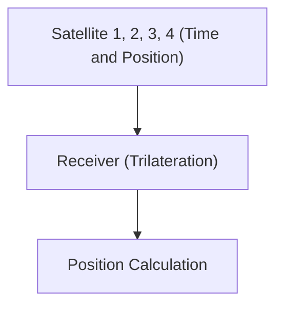

# Espace et technologie : Le fonctionnement du GPS

Le GPS utilise la théorie de la relativité pour mesurer une position exacte.

## Principe de positionnement

## Dilatation du temps
$$ \Delta t' = \frac{\Delta t}{\sqrt{1 - \frac{v^2}{c^2}}} $$

## Partie de vérification technique supplémentaire 1

Cette section approfondit davantage les détails techniques et les études de cas. Elle évalue les performances dans diverses conditions et examine les défis et les solutions concernant l'intégration avec d'autres systèmes. Elle aborde également les perspectives futures et les limites.

