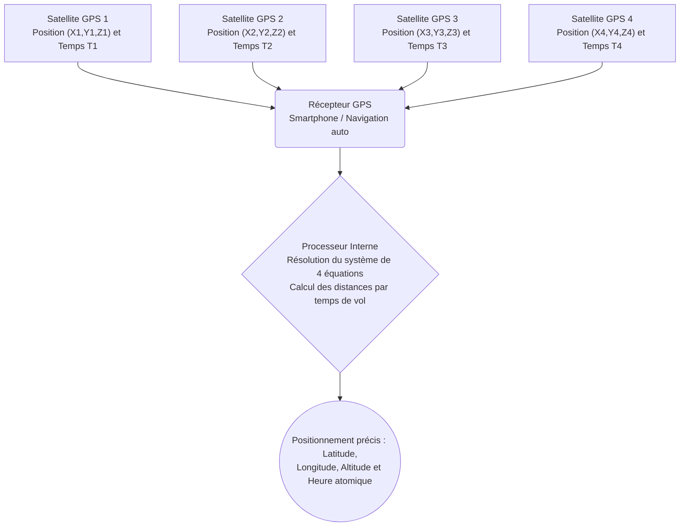

# Espace & Technologie : Fonctionnement du GPS - Relativité et Positionnement Satellitaire

Chaque fois que nous consultons un itinéraire sur notre smartphone, commandons un taxi ou suivons un système de navigation embarqué, nous utilisons le **Système de Positionnement Global (GPS)**. Du guidage des avions de ligne au-dessus des océans à la synchronisation à la microseconde des transactions sur les marchés boursiers mondiaux, le GPS est devenu une infrastructure critique et invisible de la civilisation contemporaine.

Pourtant, cette technologie omniprésente repose sur une réalité physique fascinante : elle ne pourrait fonctionner sans les **théories de la relativité restreinte et générale** d'Albert Einstein. Si l'on négligeait les effets relativistes, le GPS accumulerait une erreur de localisation d'environ **11,4 kilomètres par jour**, rendant le système entièrement inopérant en l'espace de quelques heures.

Cet article détaille les fondements géométriques de la trilatération, l'influence des effets relativistes sur les horloges satellitaires et les prouesses d'ingénierie qui permettent de maintenir une précision métrique sur l'ensemble du globe.

## 1. Principes Fondamentaux du GPS : Trilatération et Mesure Ultraciblée du Temps

Le GPS détermine les coordonnées géographiques d'un récepteur terrestre en captant les ondes radio émises par une constellation de satellites en orbite. La technique géométrique au cœur de ce processus est la **trilatération**.

### 1.1. L'Approche Géométrique de la Trilatération

Pour repérer avec exactitude un point dans l'espace tridimensionnel, un récepteur doit acquérir les signaux d'au moins **quatre satellites GPS** distincts :

1. **Premier Satellite (Sphère d'Incertitude)** : En multipliant la durée de propagation du signal par la vitesse de la lumière, le récepteur calcule sa distance au satellite. L'utilisateur se situe sur une sphère théorique centrée sur ce premier satellite.
2. **Deuxième Satellite (Intersection Circulaire)** : En mesurant la distance à un deuxième satellite, l'intersection des deux sphères forme un cercle dans l'espace 3D.
3. **Troisième Satellite (Réduction à Deux Points)** : La sphère d'un troisième satellite intercepte ce cercle en exactement **deux points distincts**. L'un d'eux étant situé loin dans l'espace ou au cœur de la croûte terrestre, il est écarté par impossibilité physique, ce qui fixe la position tridimensionnelle (latitude, longitude, altitude).
4. **Quatrième Satellite (Correction d'Horloge du Récepteur)** : Bien que trois sphères suffisent sur le plan géométrique pour résoudre les coordonnées $(X, Y, Z)$, un défi technique majeur subsiste : **l'imprécision de l'horloge interne du récepteur**. Le cristal de quartz d'un smartphone n'a pas la précision nanoseconde d'une horloge atomique. Le quatrième satellite fournit la quatrième équation indispensable pour résoudre simultanément les coordonnées spatiales et le biais temporel $\Delta t$ du récepteur.

```mermaid
flowchart TD
    S1["Satellite GPS 1\nPosition (X1,Y1,Z1) et Temps T1"] --> R(Récepteur GPS\nSmartphone / Navigation auto)
    S2["Satellite GPS 2\nPosition (X2,Y2,Z2) et Temps T2"] --> R
    S3["Satellite GPS 3\nPosition (X3,Y3,Z3) et Temps T3"] --> R
    S4["Satellite GPS 4\nPosition (X4,Y4,Z4) et Temps T4"] --> R
    R --> C{"Processeur Interne\nRésolution du système de 4 équations\nCalcul des distances par temps de vol"}
    C --> P((Positionnement précis : Latitude,\nLongitude, Altitude et Heure atomique))
```

### 1.2. Calcul des Distances : La Vitesse de la Lumière comme Facteur Multiplicateur

La distance séparant le satellite du récepteur est obtenue à partir du temps de vol (Time of Flight) de l'onde :

$$ \text{Distance} = c \times \Delta t $$

Où $c \approx 3 \times 10^8 \text{ m/s}$ représente la vitesse de la lumière dans le vide. La lumière parcourant environ 300 mètres en une microseconde ($10^{-6}\text{ s}$), une erreur de **seulement 1 microseconde engendre un écart de position de 300 mètres**. Un décalage d'une nanoseconde ($10^{-9}\text{ s}$) induit déjà une erreur de 30 centimètres.

Pour atteindre une exactitude maximale, les satellites GPS emportent des **horloges atomiques au césium-133 et au rubidium-87**, capables de ne dévier que d'une seconde en plusieurs centaines de milliers d'années. Pourtant, malgré cette rigueur technologique, un phénomène physique fondamental intervient : **le temps s'écoule à un rythme différent en orbite et sur Terre**.

## 2. La Relativité d'Einstein : Accélération et Ralentissement du Temps en Orbite

Présentées en 1905 et 1915, la **relativité restreinte** et la **relativité générale** ont aboli le concept newtonien de temps et d'espace absolus. Selon Einstein, le temps s'écoule à une vitesse relative qui dépend de la vitesse de déplacement de l'observateur et du champ gravitationnel local.

### 2.1. Relativité Restreinte : La Vitesse Ralentit les Horloges

La relativité restreinte démontre qu'une horloge en mouvement rapide par rapport à un observateur immobile semble tourner plus lentement. Cette dilatation cinématique du temps est formulée par le facteur de Lorentz :

$$ \Delta t' = \frac{\Delta t}{\sqrt{1 - \frac{v^2}{c^2}}} $$

Où $v$ est la vitesse de déplacement et $c$ la vitesse de la lumière.

Les satellites GPS circulent sur une orbite terrestre moyenne (MEO) à 20 200 km d'altitude à une vitesse orbitale d'environ **$3,874\text{ km/s}$** (près de 14 000 km/h). En raison de cette célérité, les horloges atomiques à bord des satellites **retardent d'environ 7 microsecondes par jour ($-7\ \mu\text{s/jour}$)** par rapport aux horloges terrestres.

### 2.2. Relativité Générale : Une Faible Gravité Accélère le Temps

La relativité générale définit la gravitation comme la courbure de l'espace-temps provoquée par la masse. Au voisinage d'une grande masse, l'espace-temps est courbé et le temps s'écoule plus lentement ; inversement, **plus l'on s'éloigne de la masse et plus le champ gravitationnel faiblit, plus le temps s'accélère**.

À 20 200 km d'altitude, la pesanteur terrestre n'est plus que d'environ un quart de sa valeur au sol. Évoluant dans un espace-temps moins courbé, les horloges des satellites GPS **avancent d'environ 45 microsecondes par jour ($+45\ \mu\text{s/jour}$)** par rapport à leurs homologues terrestres.

### 2.3. Effet Net : Une Avance Quotidienne de +38 Microsecondes

Les deux phénomènes agissant simultanément sur le satellite, il convient d'additionner leurs contributions respectives :

- **Effet de Relativité Restreinte (vitesse)** : $-7\ \mu\text{s/jour}$ (ralentissement)
- **Effet de Relativité Générale (gravité)** : $+45\ \mu\text{s/jour}$ (accélération)

$$ \text{Dérive Nette} = +45\ \mu\text{s/jour} - 7\ \mu\text{s/jour} = +38\ \mu\text{s/jour} $$

Le décalage gravitationnel l'emporte nettement. Par conséquent, les horloges atomiques des satellites GPS **avancent de 38 microsecondes par jour** par rapport aux horloges terrestres.

## 3. Pourquoi 38 Microsecondes Constituent une Erreur Fatale

À l'échelle des sens humains, 38 microsecondes (0,000038 s) paraissent infinitésimales. Pourtant, rapporté à la vitesse de la lumière ($300\ 000\text{ km/s}$), ce décalage entraîne une dérive spatiale dramatique :

$$ \text{Erreur Quotidienne} = (3 \times 10^8\text{ m/s}) \times (38 \times 10^{-6}\text{ s}) = 11\ 400\text{ mètres} = 11,4\text{ km/jour} $$

Sans correction relativiste :
- Après 24 heures, l'erreur de localisation atteindrait **11,4 km**.
- Après 48 heures, elle s'élèverait à **22,8 km**.
- Au bout de trois jours, elle franchirait **34 km**.

Les systèmes de navigation routière afficheraient des véhicules en pleine mer ou au sommet de montagnes, et la navigation aérienne deviendrait impossible.

## 4. Comment le Système GPS Corrige les Effets Relativistes

Pour neutraliser cette dérive astronomique, les ingénieurs du GPS combinent un réglage matériel initial avant lancement et des calibrages télémétriques continus depuis le sol.

### 4.1. Décalage de Fréquence Initial au Sol

La correction la plus élégante a lieu sur Terre avant le départ du satellite.

La fréquence nominale d'oscillation d'une horloge atomique standard est de **10,23 MHz**. Pour compenser l'accélération orbitale de 38 microsecondes par jour, les ingénieurs abaissent volontairement la fréquence de base à :

$$ f_{\text{satellite}} = 10,22999999543\text{ MHz} $$

Une fois placé sur son orbite à 20 200 km, les effets relativistes cumulés rehaussent la cadence de l'horloge pour qu'elle corresponde exactement à **10,23 MHz** perçue depuis la surface terrestre.

### 4.2. Surveillance Terrestre Continue et Télémétrie Orbitale

Ce réglage initial s'appuie sur une orbite circulaire théorique. En conditions réelles, plusieurs facteurs viennent perturber la trajectoire :
- **Excentricité Orbitale** : L'orbite présente une légère ellipticité ($e \approx 0,01$), entraînant des variations périodiques de vitesse et d'altitude jusqu'à 45 nanosecondes.
- **Forme Réelle de la Terre (Géoïde)** : La répartition asymétrique des masses terrestres modifie localement le potentiel gravitationnel.
- **Pression de Radiation Solaire et Gravité Lunaire**.

Pour y remédier, la **Station de Contrôle Principale (MCS)** et son réseau mondial de stations au sol mesurent en permanence les dérives des orbites et des horloges. Elles calculent des coefficients polynomiaux ($a_0, a_1, a_2$) transmis aux satellites par liaison montante. Ces données sont intégrées au **Message de Navigation (Navigation Message)** diffusé par les satellites, permettant aux smartphones d'effectuer des calculs d'une précision millimétrique.

## 5. Le GPS au Cœur des Infrastructures de la Société Moderne

Le rôle du GPS dépasse largement la cartographie sur smartphone :

- **Transports et Mobilité Autonome** : Le guidage automatique des avions (ADS-B), le routage des porte-conteneurs et les véhicules autonomes de niveau 4/5 s'appuient sur le GPS différentiel (DGPS) et le positionnement cinématique en temps réel (RTK) pour obtenir une précision au centimètre près.
- **Télécommunications et Marchés Financiers** : Le trading haute fréquence (HFT) impose des horodatages sub-microsecondes conformes à la directive MiFID II. Les réseaux cellulaires 4G/5G synchronisent l'émission de leurs antennes grâce au signal 1PPS du GPS.
- **Agriculture de Précision et BTP** : Des tracteurs autonomes pilotés par RTK sèment et épandent avec 2 centimètres de précision ; des engins de terrassement guidés par modèle 3D automatisent le nivellement des sols.
- **Géophysique et Prévention des Risques** : Le suivi continu par GPS mesure les déformations millimétriques des failles tectoniques pour anticiper les séismes, tandis que l'évaluation du retard du signal dans la troposphère permet de cartographier la vapeur d'eau et de prédire les pluies diluviennes.

## 6. Conclusion : Les Lois de l'Univers au Bout des Doigts

Chaque fois que vous observez le point bleu clignotant sur l'écran de votre téléphone, vous admirez la concrétisation magistrale d'un siècle de science : la rencontre entre la géométrie d'Euclide, le tic-tac subatomique du césium et la vision de l'espace-temps d'Albert Einstein.
