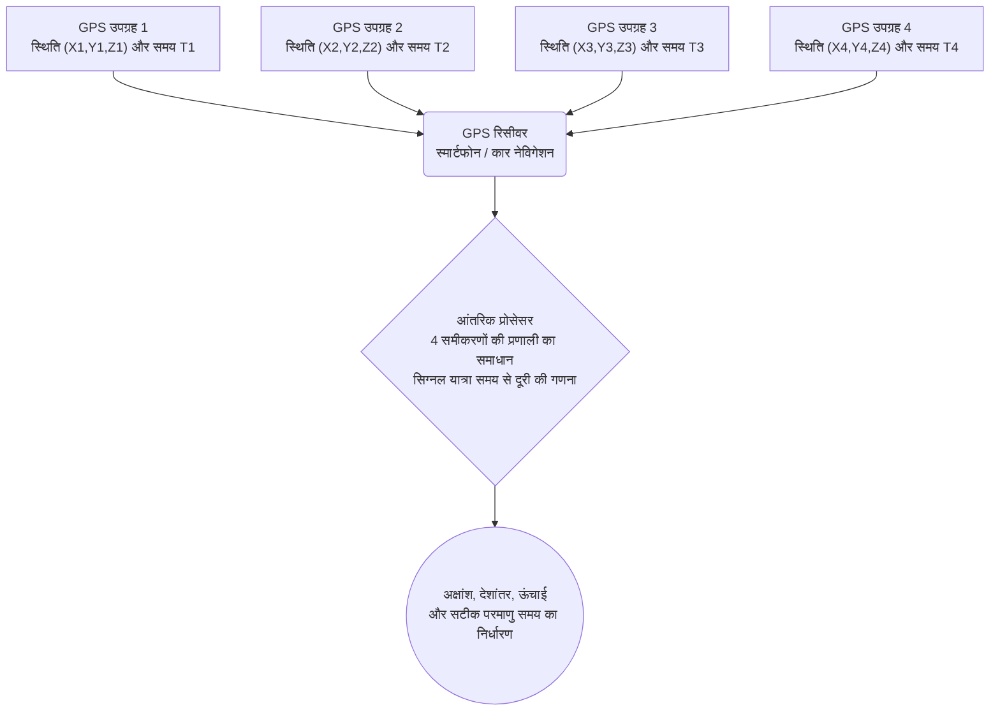

# अंतरिक्ष और प्रौद्योगिकी: GPS कैसे काम करता है - सापेक्षता का सिद्धांत और उपग्रह नेविगेशन

जब भी हम अपने स्मार्टफोन पर डिजिटल मैप देखते हैं, कैब बुक करते हैं या कार नेविगेशन का उपयोग करते हैं, तो हम **ग्लोबल पोजिशनिंग सिस्टम (GPS)** पर निर्भर होते हैं। महासागरों के ऊपर हवाई जहाजों के संचालन से लेकर वैश्विक शेयर बाजारों में माइक्रोसेकंड स्तर के वित्तीय लेनदेन के समय निर्धारण तक, GPS आधुनिक समाज का एक अदृश्य लेकिन अत्यंत महत्वपूर्ण आधार बन चुका है।

हालाँकि, बहुत कम लोग यह जानते हैं कि यह दैनिक तकनीक अल्बर्ट आइंस्टीन के **सापेक्षता के सिद्धांत (Theory of Relativity)** पर आधारित है—भौतिकी का एक ऐसा क्षेत्र जिसे अक्सर व्यावहारिक जीवन से दूर माना जाता है। यदि सापेक्षता के प्रभावों को सुधारा न जाए, तो GPS में प्रतिदिन लगभग **11.4 किलोमीटर (लगभग 7 मील)** की विशाल स्थिति त्रुटि जमा हो जाएगी, जिससे यह प्रणाली कुछ ही घंटों में पूरी तरह से अनुपयोगी हो जाएगी।

इस लेख में, हम GPS के बुनियादी ज्यामितीय सिद्धांतों (Trilateration), विशेष और सामान्य सापेक्षता के प्रभावों, और इस भौतिक विचलन को हल करने वाले इंजीनियरिंग नवाचारों का विस्तार से विश्लेषण करेंगे।

## 1. GPS की कार्यप्रणाली: त्रिकोणीय स्थिति निर्धारण और सटीक समय

GPS पृथ्वी की परिक्रमा कर रहे उपग्रहों द्वारा भेजे गए रेडियो संकेतों को धरातल पर स्थित रिसीवर (जैसे स्मार्टफोन) द्वारा ग्रहण करके सटीक त्रि-आयामी निर्देशांक निर्धारित करता है। इस प्रक्रिया का गणितीय आधार **त्रिकोणीय स्थिति निर्धारण (Trilateration)** है।

### 1.1. त्रिकोणीय स्थिति निर्धारण (Trilateration) का ज्यामितीय दृष्टिकोण

त्रि-आयामी अंतरिक्ष में किसी बिंदु की सटीक स्थिति जानने के लिए रिसीवर को कम से कम **4 GPS उपग्रहों** से संकेत प्राप्त करने की आवश्यकता होती है:

1. **पहला उपग्रह (दूरी का गोला)**: रेडियो तरंग के पहुंचने में लगे समय को प्रकाश की गति से गुणा करके रिसीवर से उपग्रह की दूरी की गणना की जाती है। इसका अर्थ है कि रिसीवर उस उपग्रह को केंद्र मानकर बनी काल्पनिक गोलाकार सतह पर स्थित है।
2. **दूसरा उपग्रह (वृत्ताकार प्रतिच्छेदन)**: दूसरे उपग्रह से दूरी जोड़ने पर, दो गोले आपस में प्रतिच्छेद करके अंतरिक्ष में एक वृत्त (Ring) बनाते हैं।
3. **तीसरा उपग्रह (दो बिंदुओं पर संकुचन)**: तीसरे उपग्रह का गोला उस वृत्त को ठीक **दो अलग-अलग बिंदुओं** पर काटता है। इनमें से एक बिंदु अंतरिक्ष में या पृथ्वी के बहुत गहरे गर्भ में होता है, जिसे भौतिक रूप से खारिज कर दिया जाता है। इस प्रकार पृथ्वी की सतह पर एक अद्वितीय बिंदु (अक्षांश, देशांतर और ऊंचाई) तय हो जाता है।
4. **चौथा उपग्रह (रिसीवर घड़ी की त्रुटि का निवारण)**: यद्यपि तीन गोले स्थानिक निर्देशांक $(X, Y, Z)$ निर्धारित करने के लिए पर्याप्त लगते हैं, लेकिन एक बड़ी बाधा होती है: **रिसीवर की आंतरिक घड़ी की अशुद्धि**। स्मार्टफोन की क्वार्ट्ज घड़ी उपग्रह की परमाणु घड़ी जितनी सटीक नहीं होती। चौथा उपग्रह एक अतिरिक्त समीकरण प्रदान करता है, जिससे $X, Y, Z$ के साथ-साथ समय की त्रुटि $\Delta t$ का भी एक साथ सटीक समाधान हो जाता है।

### 1.2. दूरी की गणना: प्रकाश की गति का विशाल गुणक

उपग्रह से रिसीवर तक की दूरी विद्युत चुम्बकीय तरंगों की यात्रा अवधि से निकाली जाती है:

$$ \text{दूरी} = c \times \Delta t $$

यहाँ $c \approx 3 \times 10^8 \text{ m/s}$ निर्वात में प्रकाश की गति है। प्रकाश मात्र एक माइक्रोसेकंड ($10^{-6}\text{ s}$) में लगभग 300 मीटर की यात्रा करता है। इसका अर्थ है कि समय में **केवल 1 माइक्रोसेकंड की चूक से 300 मीटर की भारी स्थिति त्रुटि** उत्पन्न हो जाएगी। यहाँ तक कि एक नैनोसेकंड ($10^{-9}\text{ s}$) का अंतर भी 30 सेंटीमीटर की त्रुटि पैदा करता है।

इसलिए GPS उपग्रहों में अत्यधिक सटीक **सीज़ियम-133 और रूबिडियम-87 परमाणु घड़ियाँ** लगाई जाती हैं। लेकिन घड़ियाँ चाहे कितनी भी सटीक क्यों न हों, वे एक सार्वभौमिक भौतिक नियम का सामना करती हैं: **अंतरिक्ष में समय की गति पृथ्वी की सतह से भिन्न होती है**।

## 2. आइंस्टीन की सापेक्षता: कक्षीय घड़ियों का धीमा और तेज चलना

1905 और 1915 में प्रकाशित आइंस्टीन के **विशेष सापेक्षता सिद्धांत** और **सामान्य सापेक्षता सिद्धांत** ने न्यूटन के निरपेक्ष समय की अवधारणा को समाप्त कर दिया। समय पूरे ब्रह्मांड में समान रूप से नहीं बहता, बल्कि यह गति और गुरुत्वाकर्षण क्षेत्र की तीव्रता पर निर्भर करता है।

### 2.1. विशेष सापेक्षता: उच्च गति समय को धीमा करती है

विशेष सापेक्षता के अनुसार, स्थिर प्रेक्षक की तुलना में तेजी से गतिमान घड़ी धीमी चलती है (Kinematic Time Dilation)। इसे लोरेंट्ज़ कारक द्वारा दर्शाया जाता है:

$$ \Delta t' = \frac{\Delta t}{\sqrt{1 - \frac{v^2}{c^2}}} $$

जहाँ $v$ उपग्रह का कक्षीय वेग है और $c$ प्रकाश की गति है।

GPS उपग्रह लगभग 20,200 किमी की ऊंचाई पर लगभग **$3.874\text{ km/s}$** (लगभग 14,000 किमी/घंटा) की तीव्र गति से परिक्रमा करते हैं। इस तीव्र गति के कारण, उपग्रह की परमाणु घड़ी पृथ्वी की स्थिर घड़ियों की तुलना में **प्रतिदिन लगभग 7 माइक्रोसेकंड धीमी ($-7\ \mu\text{s/दिन}$)** चलती है।

### 2.2. सामान्य सापेक्षता: कमजोर गुरुत्वाकर्षण समय को तेज करता है

सामान्य सापेक्षता गुरुत्वाकर्षण को द्रव्यमान द्वारा स्पेस-टाइम में उत्पन्न होने वाले घुमाव (Curvature) के रूप में परिभाषित करती है। बड़े द्रव्यमान के पास समय धीमा चलता है; इसके विपरीत, **गुरुत्वाकर्षण जितना कमजोर होगा, समय उतना ही तेज चलेगा**।

20,200 किमी की ऊंचाई पर पृथ्वी का गुरुत्वाकर्षण धरातल की तुलना में लगभग एक-चौथाई ही रह जाता है। कम मुड़े हुए स्पेस-टाइम में होने के कारण, GPS उपग्रह की घड़ियाँ पृथ्वी की घड़ियों की तुलना में **प्रतिदिन लगभग 45 माइक्रोसेकंड तेज ($+45\ \mu\text{s/दिन}$)** चलती हैं।

### 2.3. संयुक्त सापेक्षता प्रभाव: प्रतिदिन +38 माइक्रोसेकंड की बढ़त

चूँकि दोनों प्रभाव एक साथ काम करते हैं, हम दोनों का योग निकालते हैं:

- **विशेष सापेक्षता प्रभाव (गति के कारण)**: $-7\ \mu\text{s/दिन}$ (धीमी)
- **सामान्य सापेक्षता प्रभाव (गुरुत्वाकर्षण के कारण)**: $+45\ \mu\text{s/दिन}$ (तेज)

$$ \text{शुद्ध दैनिक अंतर} = +45\ \mu\text{s/दिन} - 7\ \mu\text{s/दिन} = +38\ \mu\text{s/दिन} $$

सामान्य सापेक्षता का गुरुत्वाकर्षण प्रभाव बहुत अधिक शक्तिशाली है। नतीजतन, GPS उपग्रहों की परमाणु घड़ियाँ पृथ्वी की घड़ियों से **प्रतिदिन 38 माइक्रोसेकंड तेजी से आगे बढ़ती हैं**।

## 3. 38 माइक्रोसेकंड एक विनाशकारी त्रुटि क्यों है?

मानव अनुभूति के लिए 38 माइक्रोसेकंड (0.000038 सेकंड) नगण्य लग सकता है। लेकिन जब इसे प्रकाश की गति ($300,000\text{ km/s}$) से गुणा किया जाता है, तो परिणाम भयावह होता है:

$$ \text{दैनिक स्थिति विचलन} = (3 \times 10^8\text{ m/s}) \times (38 \times 10^{-6}\text{ s}) = 11,400\text{ मीटर} = 11.4\text{ किमी/दिन} $$

यदि सापेक्षता में सुधार न किया जाए:
- पहले ही दिन त्रुटि **11.4 किमी** हो जाएगी।
- दूसरे दिन यह बढ़कर **22.8 किमी** हो जाएगी।
- तीसरे दिन यह **34 किमी** से अधिक हो जाएगी।

कुछ ही दिनों में कार नेविगेशन वाहन को समुद्र या पहाड़ों के बीच दिखाने लगेगा और हवाई जहाजों का सुरक्षित संचालन असंभव हो जाएगा।

## 4. GPS इंजीनियर इस सापेक्षता प्रभाव को कैसे ठीक करते हैं

इस भारी त्रुटि को रोकने के लिए GPS इंजीनियरों ने दोहरे स्तर का समाधान तैयार किया: प्रक्षेपण से पहले हार्डवेयर का समायोजन और ग्राउंड स्टेशनों से रीयल-टाइम डेटा सुधार।

### 4.1. प्रक्षेपण से पहले आवृत्ति ऑफसेट (पूर्व-समायोजन)

सबसे चतुराई भरा सुधार रॉकेट के प्रक्षेपण से पहले ही जमीन पर कर दिया जाता है।

जमीन पर परमाणु घड़ी की मानक आवृत्ति **10.23 MHz** होती है। यदि इसे इसी आवृत्ति पर अंतरिक्ष में भेजा जाए, तो यह कक्षा में बहुत तेज चलने लगेगी। इसलिए इंजीनियर उपग्रह की मास्टर घड़ी की आवृत्ति को जानबूझकर थोड़ा कम कर देते हैं:

$$ f_{\text{उपग्रह}} = 10.22999999543\text{ MHz} $$

जब उपग्रह 20,200 किमी की ऊंचाई पर कक्षा में पहुंचता है, तो सापेक्षता के कारण प्रतिदिन $+38\ \mu\text{s}$ की गति वृद्धि इस कमी को पूरी तरह संतुलित कर देती है। पृथ्वी पर रिसीवर को यह संकेत सटीक **10.23 MHz** पर प्राप्त होता है।

### 4.2. ग्राउंड स्टेशनों द्वारा निरंतर निगरानी और डेटा सुधार

पूर्व-समायोजन एक पूर्ण वृत्ताकार कक्षा पर आधारित होता है। वास्तविक दुनिया में अन्य कारक भी होते हैं:
- **कक्षीय दीर्घवृत्ताकारिता (Eccentricity)**: कक्षा पूरी तरह गोल नहीं होती ($e \approx 0.01$), जिससे समय में 45 नैनोसेकंड तक का आवधिक उतार-चढ़ाव आता है।
- **पृथ्वी के आकार की अनियमितता (Geoid)**: पृथ्वी का द्रव्यमान पूरी तरह एकसमान नहीं है।
- **सूर्य का विकिरण दबाव और चंद्रमा का गुरुत्वाकर्षण**।

इसलिए, मास्टर कंट्रोल स्टेशन (MCS) और वैश्विक ट्रैकिंग स्टेशन 24 घंटे सभी उपग्रहों की निगरानी करते हैं। वे समय सुधार गुणांक ($a_0, a_1, a_2$) की गणना करके उपग्रहों को भेजते हैं। उपग्रह इसे **नेविगेशन संदेश (Navigation Message)** के माध्यम से प्रसारित करते हैं, जिससे स्मार्टफोन रिसीवर वास्तविक समय में शेष सूक्ष्म त्रुटियों को समाप्त कर देते हैं।

## 5. आधुनिक समाज के अदृश्य आधार के रूप में GPS

GPS की भूमिका केवल स्मार्टफोन में रास्ता खोजने तक सीमित नहीं है:

- **परिवहन और स्वायत्त वाहन**: विमानन नेविगेशन (ADS-B), मालवाहक जहाजों का संचालन और स्तर 4/5 के स्वायत्त वाहन सेंटीमीटर-स्तरीय सटीकता के लिए RTK-GPS पर निर्भर हैं।
- **वित्तीय बाजार और दूरसंचार**: हाई-फ़्रीक्वेंसी ट्रेडिंग (HFT) को MiFID II नियमों के तहत माइक्रोसेकंड टाइमस्टैम्प की आवश्यकता होती है। 5G मोबाइल टावर रेडियो तरंगों को समन्वयित करने के लिए GPS के 1PPS सिग्नल का उपयोग करते हैं।
- **सटीक कृषि और निर्माण कार्य**: स्वचालित ट्रैक्टर 2 सेमी की सटीकता के साथ बीज बोते हैं; निर्माण मशीनें 3D मॉडल के आधार पर स्वचालित रूप से खुदाई और लेवलिंग करती हैं।
- **आपदा प्रबंधन और भूविज्ञान**: GPS नेटवर्क भूकंप का अध्ययन करने के लिए टेक्टोनिक प्लेटों की मिलीमीटर-स्तरीय हलचल को ट्रैक करते हैं, और क्षोभमंडल में सिग्नल की देरी का विश्लेषण करके भारी बारिश की सटीक भविष्यवाणी करते हैं।

## 6. निष्कर्ष: हमारी हथेली में ब्रह्मांड के भौतिक नियम

जब भी आप अपने फोन पर नीले रंग के लोकेशन आइकन को देखते हैं, तो आप मानव प्रतिभा के एक अद्भुत संगम के साक्षी होते हैं: जहाँ यूक्लिडियन ज्यामिति, सीज़ियम परमाणुओं का कंपन और 20,000 किमी ऊपर आइंस्टीन का स्पेस-टाइम सिद्धांत एक साथ मिलकर हमारे दैनिक जीवन को आसान बना रहे हैं।
