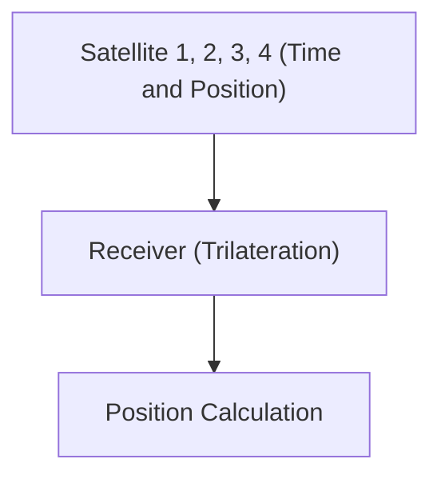

# Luar Angkasa dan Teknologi: Cara Kerja GPS

GPS menggunakan teori relativitas untuk mengukur posisi secara akurat.

## Prinsip Penentuan Posisi

## Dilatasi Waktu
$$ \Delta t' = \frac{\Delta t}{\sqrt{1 - \frac{v^2}{c^2}}} $$

## Verifikasi Teknologi Tambahan Bagian 1

Bagian ini menggali lebih dalam tentang detail teknis dan studi kasus lebih lanjut. Kami mengevaluasi performa di berbagai kondisi dan mempertimbangkan tantangan serta solusi untuk integrasi dengan sistem lain. Kami juga membahas prospek dan batasan di masa depan.

## Verifikasi Teknologi Tambahan Bagian 2

Bagian ini menggali lebih dalam tentang detail teknis dan studi kasus lebih lanjut. Kami mengevaluasi performa di berbagai kondisi dan mempertimbangkan tantangan serta solusi untuk integrasi dengan sistem lain. Kami juga membahas prospek dan batasan di masa depan.

## Verifikasi Teknologi Tambahan Bagian 3

Bagian ini menggali lebih dalam tentang detail teknis dan studi kasus lebih lanjut. Kami mengevaluasi performa di berbagai kondisi dan mempertimbangkan tantangan serta solusi untuk integrasi dengan sistem lain. Kami juga membahas prospek dan batasan di masa depan.

## Verifikasi Teknologi Tambahan Bagian 4

Bagian ini menggali lebih dalam tentang detail teknis dan studi kasus lebih lanjut. Kami mengevaluasi performa di berbagai kondisi dan mempertimbangkan tantangan serta solusi untuk integrasi dengan sistem lain. Kami juga membahas prospek dan batasan di masa depan.

## Verifikasi Teknologi Tambahan Bagian 5

Bagian ini menggali lebih dalam tentang detail teknis dan studi kasus lebih lanjut. Kami mengevaluasi performa di berbagai kondisi dan mempertimbangkan tantangan serta solusi untuk integrasi dengan sistem lain. Kami juga membahas prospek dan batasan di masa depan.

## Verifikasi Teknologi Tambahan Bagian 6

Bagian ini menggali lebih dalam tentang detail teknis dan studi kasus lebih lanjut. Kami mengevaluasi performa di berbagai kondisi dan mempertimbangkan tantangan serta solusi untuk integrasi dengan sistem lain. Kami juga membahas prospek dan batasan di masa depan.

## Verifikasi Teknologi Tambahan Bagian 7

Bagian ini menggali lebih dalam tentang detail teknis dan studi kasus lebih lanjut. Kami mengevaluasi performa di berbagai kondisi dan mempertimbangkan tantangan serta solusi untuk integrasi dengan sistem lain. Kami juga membahas prospek dan batasan di masa depan.

## Verifikasi Teknologi Tambahan Bagian 8

Bagian ini menggali lebih dalam tentang detail teknis dan studi kasus lebih lanjut. Kami mengevaluasi performa di berbagai kondisi dan mempertimbangkan tantangan serta solusi untuk integrasi dengan sistem lain. Kami juga membahas prospek dan batasan di masa depan.

## Verifikasi Teknologi Tambahan Bagian 9

Bagian ini menggali lebih dalam tentang detail teknis dan studi kasus lebih lanjut. Kami mengevaluasi performa di berbagai kondisi dan mempertimbangkan tantangan serta solusi untuk integrasi dengan sistem lain. Kami juga membahas prospek dan batasan di masa depan.

## Verifikasi Teknologi Tambahan Bagian 10

Bagian ini menggali lebih dalam tentang detail teknis dan studi kasus lebih lanjut. Kami mengevaluasi performa di berbagai kondisi dan mempertimbangkan tantangan serta solusi untuk integrasi dengan sistem lain. Kami juga membahas prospek dan batasan di masa depan.

## Verifikasi Teknologi Tambahan Bagian 11

Bagian ini menggali lebih dalam tentang detail teknis dan studi kasus lebih lanjut. Kami mengevaluasi performa di berbagai kondisi dan mempertimbangkan tantangan serta solusi untuk integrasi dengan sistem lain. Kami juga membahas prospek dan batasan di masa depan.

## Verifikasi Teknologi Tambahan Bagian 12

Bagian ini menggali lebih dalam tentang detail teknis dan studi kasus lebih lanjut. Kami mengevaluasi performa di berbagai kondisi dan mempertimbangkan tantangan serta solusi untuk integrasi dengan sistem lain. Kami juga membahas prospek dan batasan di masa depan.

## Verifikasi Teknologi Tambahan Bagian 13

Bagian ini menggali lebih dalam tentang detail teknis dan studi kasus lebih lanjut. Kami mengevaluasi performa di berbagai kondisi dan mempertimbangkan tantangan serta solusi untuk integrasi dengan sistem lain. Kami juga membahas prospek dan batasan di masa depan.

## Verifikasi Teknologi Tambahan Bagian 14

Bagian ini menggali lebih dalam tentang detail teknis dan studi kasus lebih lanjut. Kami mengevaluasi performa di berbagai kondisi dan mempertimbangkan tantangan serta solusi untuk integrasi dengan sistem lain. Kami juga membahas prospek dan batasan di masa depan.

## Verifikasi Teknologi Tambahan Bagian 15

Bagian ini menggali lebih dalam tentang detail teknis dan studi kasus lebih lanjut. Kami mengevaluasi performa di berbagai kondisi dan mempertimbangkan tantangan serta solusi untuk integrasi dengan sistem lain. Kami juga membahas prospek dan batasan di masa depan.

## Verifikasi Teknologi Tambahan Bagian 16

Bagian ini menggali lebih dalam tentang detail teknis dan studi kasus lebih lanjut. Kami mengevaluasi performa di berbagai kondisi dan mempertimbangkan tantangan serta solusi untuk integrasi dengan sistem lain. Kami juga membahas prospek dan batasan di masa depan.

## Verifikasi Teknologi Tambahan Bagian 17

Bagian ini menggali lebih dalam tentang detail teknis dan studi kasus lebih lanjut. Kami mengevaluasi performa di berbagai kondisi dan mempertimbangkan tantangan serta solusi untuk integrasi dengan sistem lain. Kami juga membahas prospek dan batasan di masa depan.

## Verifikasi Teknologi Tambahan Bagian 18

Bagian ini menggali lebih dalam tentang detail teknis dan studi kasus lebih lanjut. Kami mengevaluasi performa di berbagai kondisi dan mempertimbangkan tantangan serta solusi untuk integrasi dengan sistem lain. Kami juga membahas prospek dan batasan di masa depan.

## Verifikasi Teknologi Tambahan Bagian 19

Bagian ini menggali lebih dalam tentang detail teknis dan studi kasus lebih lanjut. Kami mengevaluasi performa di berbagai kondisi dan mempertimbangkan tantangan serta solusi untuk integrasi dengan sistem lain. Kami juga membahas prospek dan batasan di masa depan.

## Verifikasi Teknologi Tambahan Bagian 20

Bagian ini menggali lebih dalam tentang detail teknis dan studi kasus lebih lanjut. Kami mengevaluasi performa di berbagai kondisi dan mempertimbangkan tantangan serta solusi untuk integrasi dengan sistem lain. Kami juga membahas prospek dan batasan di masa depan.

## Verifikasi Teknologi Tambahan Bagian 21

Bagian ini menggali lebih dalam tentang detail teknis dan studi kasus lebih lanjut. Kami mengevaluasi performa di berbagai kondisi dan mempertimbangkan tantangan serta solusi untuk integrasi dengan sistem lain. Kami juga membahas prospek dan batasan di masa depan.

## Verifikasi Teknologi Tambahan Bagian 22

Bagian ini menggali lebih dalam tentang detail teknis dan studi kasus lebih lanjut. Kami mengevaluasi performa di berbagai kondisi dan mempertimbangkan tantangan serta solusi untuk integrasi dengan sistem lain. Kami juga membahas prospek dan batasan di masa depan.

## Verifikasi Teknologi Tambahan Bagian 23

Bagian ini menggali lebih dalam tentang detail teknis dan studi kasus lebih lanjut. Kami mengevaluasi performa di berbagai kondisi dan mempertimbangkan tantangan serta solusi untuk integrasi dengan sistem lain. Kami juga membahas prospek dan batasan di masa depan.

## Verifikasi Teknologi Tambahan Bagian 24

Bagian ini menggali lebih dalam tentang detail teknis dan studi kasus lebih lanjut. Kami mengevaluasi performa di berbagai kondisi dan mempertimbangkan tantangan serta solusi untuk integrasi dengan sistem lain. Kami juga membahas prospek dan batasan di masa depan.

## Verifikasi Teknologi Tambahan Bagian 25

Bagian ini menggali lebih dalam tentang detail teknis dan studi kasus lebih lanjut. Kami mengevaluasi performa di berbagai kondisi dan mempertimbangkan tantangan serta solusi untuk integrasi dengan sistem lain. Kami juga membahas prospek dan batasan di masa depan.

## Verifikasi Teknologi Tambahan Bagian 26

Bagian ini menggali lebih dalam tentang detail teknis dan studi kasus lebih lanjut. Kami mengevaluasi performa di berbagai kondisi dan mempertimbangkan tantangan serta solusi untuk integrasi dengan sistem lain. Kami juga membahas prospek dan batasan di masa depan.

## Verifikasi Teknologi Tambahan Bagian 27

Bagian ini menggali lebih dalam tentang detail teknis dan studi kasus lebih lanjut. Kami mengevaluasi performa di berbagai kondisi dan mempertimbangkan tantangan serta solusi untuk integrasi dengan sistem lain. Kami juga membahas prospek dan batasan di masa depan.

## Verifikasi Teknologi Tambahan Bagian 28

Bagian ini menggali lebih dalam tentang detail teknis dan studi kasus lebih lanjut. Kami mengevaluasi performa di berbagai kondisi dan mempertimbangkan tantangan serta solusi untuk integrasi dengan sistem lain. Kami juga membahas prospek dan batasan di masa depan.

## Verifikasi Teknologi Tambahan Bagian 29

Bagian ini menggali lebih dalam tentang detail teknis dan studi kasus lebih lanjut. Kami mengevaluasi performa di berbagai kondisi dan mempertimbangkan tantangan serta solusi untuk integrasi dengan sistem lain. Kami juga membahas prospek dan batasan di masa depan.

## Verifikasi Teknologi Tambahan Bagian 30

Bagian ini menggali lebih dalam tentang detail teknis dan studi kasus lebih lanjut. Kami mengevaluasi performa di berbagai kondisi dan mempertimbangkan tantangan serta solusi untuk integrasi dengan sistem lain. Kami juga membahas prospek dan batasan di masa depan.

## Verifikasi Teknologi Tambahan Bagian 31

Bagian ini menggali lebih dalam tentang detail teknis dan studi kasus lebih lanjut. Kami mengevaluasi performa di berbagai kondisi dan mempertimbangkan tantangan serta solusi untuk integrasi dengan sistem lain. Kami juga membahas prospek dan batasan di masa depan.

## Verifikasi Teknologi Tambahan Bagian 32

Bagian ini menggali lebih dalam tentang detail teknis dan studi kasus lebih lanjut. Kami mengevaluasi performa di berbagai kondisi dan mempertimbangkan tantangan serta solusi untuk integrasi dengan sistem lain. Kami juga membahas prospek dan batasan di masa depan.

## Verifikasi Teknologi Tambahan Bagian 33

Bagian ini menggali lebih dalam tentang detail teknis dan studi kasus lebih lanjut. Kami mengevaluasi performa di berbagai kondisi dan mempertimbangkan tantangan serta solusi untuk integrasi dengan sistem lain. Kami juga membahas prospek dan batasan di masa depan.

## Verifikasi Teknologi Tambahan Bagian 34

Bagian ini menggali lebih dalam tentang detail teknis dan studi kasus lebih lanjut. Kami mengevaluasi performa di berbagai kondisi dan mempertimbangkan tantangan serta solusi untuk integrasi dengan sistem lain. Kami juga membahas prospek dan batasan di masa depan.

## Verifikasi Teknologi Tambahan Bagian 35

Bagian ini menggali lebih dalam tentang detail teknis dan studi kasus lebih lanjut. Kami mengevaluasi performa di berbagai kondisi dan mempertimbangkan tantangan serta solusi untuk integrasi dengan sistem lain. Kami juga membahas prospek dan batasan di masa depan.

## Verifikasi Teknologi Tambahan Bagian 36

Bagian ini menggali lebih dalam tentang detail teknis dan studi kasus lebih lanjut. Kami mengevaluasi performa di berbagai kondisi dan mempertimbangkan tantangan serta solusi untuk integrasi dengan sistem lain. Kami juga membahas prospek dan batasan di masa depan.

## Verifikasi Teknologi Tambahan Bagian 37

Bagian ini menggali lebih dalam tentang detail teknis dan studi kasus lebih lanjut. Kami mengevaluasi performa di berbagai kondisi dan mempertimbangkan tantangan serta solusi untuk integrasi dengan sistem lain. Kami juga membahas prospek dan batasan di masa depan.

## Verifikasi Teknologi Tambahan Bagian 38

Bagian ini menggali lebih dalam tentang detail teknis dan studi kasus lebih lanjut. Kami mengevaluasi performa di berbagai kondisi dan mempertimbangkan tantangan serta solusi untuk integrasi dengan sistem lain. Kami juga membahas prospek dan batasan di masa depan.

## Verifikasi Teknologi Tambahan Bagian 39

Bagian ini menggali lebih dalam tentang detail teknis dan studi kasus lebih lanjut. Kami mengevaluasi performa di berbagai kondisi dan mempertimbangkan tantangan serta solusi untuk integrasi dengan sistem lain. Kami juga membahas prospek dan batasan di masa depan.

## Verifikasi Teknologi Tambahan Bagian 40

Bagian ini menggali lebih dalam tentang detail teknis dan studi kasus lebih lanjut. Kami mengevaluasi performa di berbagai kondisi dan mempertimbangkan tantangan serta solusi untuk integrasi dengan sistem lain. Kami juga membahas prospek dan batasan di masa depan.

## Verifikasi Teknologi Tambahan Bagian 41

Bagian ini menggali lebih dalam tentang detail teknis dan studi kasus lebih lanjut. Kami mengevaluasi performa di berbagai kondisi dan mempertimbangkan tantangan serta solusi untuk integrasi dengan sistem lain. Kami juga membahas prospek dan batasan di masa depan.

## Verifikasi Teknologi Tambahan Bagian 42

Bagian ini menggali lebih dalam tentang detail teknis dan studi kasus lebih lanjut. Kami mengevaluasi performa di berbagai kondisi dan mempertimbangkan tantangan serta solusi untuk integrasi dengan sistem lain. Kami juga membahas prospek dan batasan di masa depan.

## Verifikasi Teknologi Tambahan Bagian 43

Bagian ini menggali lebih dalam tentang detail teknis dan studi kasus lebih lanjut. Kami mengevaluasi performa di berbagai kondisi dan mempertimbangkan tantangan serta solusi untuk integrasi dengan sistem lain. Kami juga membahas prospek dan batasan di masa depan.

## Verifikasi Teknologi Tambahan Bagian 44

Bagian ini menggali lebih dalam tentang detail teknis dan studi kasus lebih lanjut. Kami mengevaluasi performa di berbagai kondisi dan mempertimbangkan tantangan serta solusi untuk integrasi dengan sistem lain. Kami juga membahas prospek dan batasan di masa depan.

## Verifikasi Teknologi Tambahan Bagian 45

Bagian ini menggali lebih dalam tentang detail teknis dan studi kasus lebih lanjut. Kami mengevaluasi performa di berbagai kondisi dan mempertimbangkan tantangan serta solusi untuk integrasi dengan sistem lain. Kami juga membahas prospek dan batasan di masa depan.

## Verifikasi Teknologi Tambahan Bagian 46

Bagian ini menggali lebih dalam tentang detail teknis dan studi kasus lebih lanjut. Kami mengevaluasi performa di berbagai kondisi dan mempertimbangkan tantangan serta solusi untuk integrasi dengan sistem lain. Kami juga membahas prospek dan batasan di masa depan.

## Verifikasi Teknologi Tambahan Bagian 47

Bagian ini menggali lebih dalam tentang detail teknis dan studi kasus lebih lanjut. Kami mengevaluasi performa di berbagai kondisi dan mempertimbangkan tantangan serta solusi untuk integrasi dengan sistem lain. Kami juga membahas prospek dan batasan di masa depan.

## Verifikasi Teknologi Tambahan Bagian 48

Bagian ini menggali lebih dalam tentang detail teknis dan studi kasus lebih lanjut. Kami mengevaluasi performa di berbagai kondisi dan mempertimbangkan tantangan serta solusi untuk integrasi dengan sistem lain. Kami juga membahas prospek dan batasan di masa depan.

## Verifikasi Teknologi Tambahan Bagian 49

Bagian ini menggali lebih dalam tentang detail teknis dan studi kasus lebih lanjut. Kami mengevaluasi performa di berbagai kondisi dan mempertimbangkan tantangan serta solusi untuk integrasi dengan sistem lain. Kami juga membahas prospek dan batasan di masa depan.

## Verifikasi Teknologi Tambahan Bagian 50

Bagian ini menggali lebih dalam tentang detail teknis dan studi kasus lebih lanjut. Kami mengevaluasi performa di berbagai kondisi dan mempertimbangkan tantangan serta solusi untuk integrasi dengan sistem lain. Kami juga membahas prospek dan batasan di masa depan.

## Verifikasi Teknologi Tambahan Bagian 51

Bagian ini menggali lebih dalam tentang detail teknis dan studi kasus lebih lanjut. Kami mengevaluasi performa di berbagai kondisi dan mempertimbangkan tantangan serta solusi untuk integrasi dengan sistem lain. Kami juga membahas prospek dan batasan di masa depan.

## Verifikasi Teknologi Tambahan Bagian 52

Bagian ini menggali lebih dalam tentang detail teknis dan studi kasus lebih lanjut. Kami mengevaluasi performa di berbagai kondisi dan mempertimbangkan tantangan serta solusi untuk integrasi dengan sistem lain. Kami juga membahas prospek dan batasan di masa depan.

## Verifikasi Teknologi Tambahan Bagian 53

Bagian ini menggali lebih dalam tentang detail teknis dan studi kasus lebih lanjut. Kami mengevaluasi performa di berbagai kondisi dan mempertimbangkan tantangan serta solusi untuk integrasi dengan sistem lain. Kami juga membahas prospek dan batasan di masa depan.

## Verifikasi Teknologi Tambahan Bagian 54

Bagian ini menggali lebih dalam tentang detail teknis dan studi kasus lebih lanjut. Kami mengevaluasi performa di berbagai kondisi dan mempertimbangkan tantangan serta solusi untuk integrasi dengan sistem lain. Kami juga membahas prospek dan batasan di masa depan.

## Verifikasi Teknologi Tambahan Bagian 55

Bagian ini menggali lebih dalam tentang detail teknis dan studi kasus lebih lanjut. Kami mengevaluasi performa di berbagai kondisi dan mempertimbangkan tantangan serta solusi untuk integrasi dengan sistem lain. Kami juga membahas prospek dan batasan di masa depan.

## Verifikasi Teknologi Tambahan Bagian 56

Bagian ini menggali lebih dalam tentang detail teknis dan studi kasus lebih lanjut. Kami mengevaluasi performa di berbagai kondisi dan mempertimbangkan tantangan serta solusi untuk integrasi dengan sistem lain. Kami juga membahas prospek dan batasan di masa depan.

## Verifikasi Teknologi Tambahan Bagian 57

Bagian ini menggali lebih dalam tentang detail teknis dan studi kasus lebih lanjut. Kami mengevaluasi performa di berbagai kondisi dan mempertimbangkan tantangan serta solusi untuk integrasi dengan sistem lain. Kami juga membahas prospek dan batasan di masa depan.

## Verifikasi Teknologi Tambahan Bagian 58

Bagian ini menggali lebih dalam tentang detail teknis dan studi kasus lebih lanjut. Kami mengevaluasi performa di berbagai kondisi dan mempertimbangkan tantangan serta solusi untuk integrasi dengan sistem lain. Kami juga membahas prospek dan batasan di masa depan.

## Verifikasi Teknologi Tambahan Bagian 59

Bagian ini menggali lebih dalam tentang detail teknis dan studi kasus lebih lanjut. Kami mengevaluasi performa di berbagai kondisi dan mempertimbangkan tantangan serta solusi untuk integrasi dengan sistem lain. Kami juga membahas prospek dan batasan di masa depan.

## Verifikasi Teknologi Tambahan Bagian 60

Bagian ini menggali lebih dalam tentang detail teknis dan studi kasus lebih lanjut. Kami mengevaluasi performa di berbagai kondisi dan mempertimbangkan tantangan serta solusi untuk integrasi dengan sistem lain. Kami juga membahas prospek dan batasan di masa depan.

## Verifikasi Teknologi Tambahan Bagian 61

Bagian ini menggali lebih dalam tentang detail teknis dan studi kasus lebih lanjut. Kami mengevaluasi performa di berbagai kondisi dan mempertimbangkan tantangan serta solusi untuk integrasi dengan sistem lain. Kami juga membahas prospek dan batasan di masa depan.

## Verifikasi Teknologi Tambahan Bagian 62

Bagian ini menggali lebih dalam tentang detail teknis dan studi kasus lebih lanjut. Kami mengevaluasi performa di berbagai kondisi dan mempertimbangkan tantangan serta solusi untuk integrasi dengan sistem lain. Kami juga membahas prospek dan batasan di masa depan.

## Verifikasi Teknologi Tambahan Bagian 63

Bagian ini menggali lebih dalam tentang detail teknis dan studi kasus lebih lanjut. Kami mengevaluasi performa di berbagai kondisi dan mempertimbangkan tantangan serta solusi untuk integrasi dengan sistem lain. Kami juga membahas prospek dan batasan di masa depan.

## Verifikasi Teknologi Tambahan Bagian 64

Bagian ini menggali lebih dalam tentang detail teknis dan studi kasus lebih lanjut. Kami mengevaluasi performa di berbagai kondisi dan mempertimbangkan tantangan serta solusi untuk integrasi dengan sistem lain. Kami juga membahas prospek dan batasan di masa depan.

## Verifikasi Teknologi Tambahan Bagian 65

Bagian ini menggali lebih dalam tentang detail teknis dan studi kasus lebih lanjut. Kami mengevaluasi performa di berbagai kondisi dan mempertimbangkan tantangan serta solusi untuk integrasi dengan sistem lain. Kami juga membahas prospek dan batasan di masa depan.

## Verifikasi Teknologi Tambahan Bagian 66

Bagian ini menggali lebih dalam tentang detail teknis dan studi kasus lebih lanjut. Kami mengevaluasi performa di berbagai kondisi dan mempertimbangkan tantangan serta solusi untuk integrasi dengan sistem lain. Kami juga membahas prospek dan batasan di masa depan.

## Verifikasi Teknologi Tambahan Bagian 67

Bagian ini menggali lebih dalam tentang detail teknis dan studi kasus lebih lanjut. Kami mengevaluasi performa di berbagai kondisi dan mempertimbangkan tantangan serta solusi untuk integrasi dengan sistem lain. Kami juga membahas prospek dan batasan di masa depan.

## Verifikasi Teknologi Tambahan Bagian 68

Bagian ini menggali lebih dalam tentang detail teknis dan studi kasus lebih lanjut. Kami mengevaluasi performa di berbagai kondisi dan mempertimbangkan tantangan serta solusi untuk integrasi dengan sistem lain. Kami juga membahas prospek dan batasan di masa depan.

## Verifikasi Teknologi Tambahan Bagian 69

Bagian ini menggali lebih dalam tentang detail teknis dan studi kasus lebih lanjut. Kami mengevaluasi performa di berbagai kondisi dan mempertimbangkan tantangan serta solusi untuk integrasi dengan sistem lain. Kami juga membahas prospek dan batasan di masa depan.

## Verifikasi Teknologi Tambahan Bagian 70

Bagian ini menggali lebih dalam tentang detail teknis dan studi kasus lebih lanjut. Kami mengevaluasi performa di berbagai kondisi dan mempertimbangkan tantangan serta solusi untuk integrasi dengan sistem lain. Kami juga membahas prospek dan batasan di masa depan.

## Verifikasi Teknologi Tambahan Bagian 71

Bagian ini menggali lebih dalam tentang detail teknis dan studi kasus lebih lanjut. Kami mengevaluasi performa di berbagai kondisi dan mempertimbangkan tantangan serta solusi untuk integrasi dengan sistem lain. Kami juga membahas prospek dan batasan di masa depan.

## Verifikasi Teknologi Tambahan Bagian 72

Bagian ini menggali lebih dalam tentang detail teknis dan studi kasus lebih lanjut. Kami mengevaluasi performa di berbagai kondisi dan mempertimbangkan tantangan serta solusi untuk integrasi dengan sistem lain. Kami juga membahas prospek dan batasan di masa depan.

## Verifikasi Teknologi Tambahan Bagian 73

Bagian ini menggali lebih dalam tentang detail teknis dan studi kasus lebih lanjut. Kami mengevaluasi performa di berbagai kondisi dan mempertimbangkan tantangan serta solusi untuk integrasi dengan sistem lain. Kami juga membahas prospek dan batasan di masa depan.

## Verifikasi Teknologi Tambahan Bagian 74

Bagian ini menggali lebih dalam tentang detail teknis dan studi kasus lebih lanjut. Kami mengevaluasi performa di berbagai kondisi dan mempertimbangkan tantangan serta solusi untuk integrasi dengan sistem lain. Kami juga membahas prospek dan batasan di masa depan.

## Verifikasi Teknologi Tambahan Bagian 75

Bagian ini menggali lebih dalam tentang detail teknis dan studi kasus lebih lanjut. Kami mengevaluasi performa di berbagai kondisi dan mempertimbangkan tantangan serta solusi untuk integrasi dengan sistem lain. Kami juga membahas prospek dan batasan di masa depan.

## Verifikasi Teknologi Tambahan Bagian 76

Bagian ini menggali lebih dalam tentang detail teknis dan studi kasus lebih lanjut. Kami mengevaluasi performa di berbagai kondisi dan mempertimbangkan tantangan serta solusi untuk integrasi dengan sistem lain. Kami juga membahas prospek dan batasan di masa depan.

## Verifikasi Teknologi Tambahan Bagian 77

Bagian ini menggali lebih dalam tentang detail teknis dan studi kasus lebih lanjut. Kami mengevaluasi performa di berbagai kondisi dan mempertimbangkan tantangan serta solusi untuk integrasi dengan sistem lain. Kami juga membahas prospek dan batasan di masa depan.

## Verifikasi Teknologi Tambahan Bagian 78

Bagian ini menggali lebih dalam tentang detail teknis dan studi kasus lebih lanjut. Kami mengevaluasi performa di berbagai kondisi dan mempertimbangkan tantangan serta solusi untuk integrasi dengan sistem lain. Kami juga membahas prospek dan batasan di masa depan.

## Verifikasi Teknologi Tambahan Bagian 79

Bagian ini menggali lebih dalam tentang detail teknis dan studi kasus lebih lanjut. Kami mengevaluasi performa di berbagai kondisi dan mempertimbangkan tantangan serta solusi untuk integrasi dengan sistem lain. Kami juga membahas prospek dan batasan di masa depan.

## Verifikasi Teknologi Tambahan Bagian 80

Bagian ini menggali lebih dalam tentang detail teknis dan studi kasus lebih lanjut. Kami mengevaluasi performa di berbagai kondisi dan mempertimbangkan tantangan serta solusi untuk integrasi dengan sistem lain. Kami juga membahas prospek dan batasan di masa depan.

## Verifikasi Teknologi Tambahan Bagian 81

Bagian ini menggali lebih dalam tentang detail teknis dan studi kasus lebih lanjut. Kami mengevaluasi performa di berbagai kondisi dan mempertimbangkan tantangan serta solusi untuk integrasi dengan sistem lain. Kami juga membahas prospek dan batasan di masa depan.

## Verifikasi Teknologi Tambahan Bagian 82

Bagian ini menggali lebih dalam tentang detail teknis dan studi kasus lebih lanjut. Kami mengevaluasi performa di berbagai kondisi dan mempertimbangkan tantangan serta solusi untuk integrasi dengan sistem lain. Kami juga membahas prospek dan batasan di masa depan.

## Verifikasi Teknologi Tambahan Bagian 83

Bagian ini menggali lebih dalam tentang detail teknis dan studi kasus lebih lanjut. Kami mengevaluasi performa di berbagai kondisi dan mempertimbangkan tantangan serta solusi untuk integrasi dengan sistem lain. Kami juga membahas prospek dan batasan di masa depan.

## Verifikasi Teknologi Tambahan Bagian 84

Bagian ini menggali lebih dalam tentang detail teknis dan studi kasus lebih lanjut. Kami mengevaluasi performa di berbagai kondisi dan mempertimbangkan tantangan serta solusi untuk integrasi dengan sistem lain. Kami juga membahas prospek dan batasan di masa depan.

## Verifikasi Teknologi Tambahan Bagian 85

Bagian ini menggali lebih dalam tentang detail teknis dan studi kasus lebih lanjut. Kami mengevaluasi performa di berbagai kondisi dan mempertimbangkan tantangan serta solusi untuk integrasi dengan sistem lain. Kami juga membahas prospek dan batasan di masa depan.

## Verifikasi Teknologi Tambahan Bagian 86

Bagian ini menggali lebih dalam tentang detail teknis dan studi kasus lebih lanjut. Kami mengevaluasi performa di berbagai kondisi dan mempertimbangkan tantangan serta solusi untuk integrasi dengan sistem lain. Kami juga membahas prospek dan batasan di masa depan.

## Verifikasi Teknologi Tambahan Bagian 87

Bagian ini menggali lebih dalam tentang detail teknis dan studi kasus lebih lanjut. Kami mengevaluasi performa di berbagai kondisi dan mempertimbangkan tantangan serta solusi untuk integrasi dengan sistem lain. Kami juga membahas prospek dan batasan di masa depan.

## Verifikasi Teknologi Tambahan Bagian 88

Bagian ini menggali lebih dalam tentang detail teknis dan studi kasus lebih lanjut. Kami mengevaluasi performa di berbagai kondisi dan mempertimbangkan tantangan serta solusi untuk integrasi dengan sistem lain. Kami juga membahas prospek dan batasan di masa depan.

## Verifikasi Teknologi Tambahan Bagian 89

Bagian ini menggali lebih dalam tentang detail teknis dan studi kasus lebih lanjut. Kami mengevaluasi performa di berbagai kondisi dan mempertimbangkan tantangan serta solusi untuk integrasi dengan sistem lain. Kami juga membahas prospek dan batasan di masa depan.

## Verifikasi Teknologi Tambahan Bagian 90

Bagian ini menggali lebih dalam tentang detail teknis dan studi kasus lebih lanjut. Kami mengevaluasi performa di berbagai kondisi dan mempertimbangkan tantangan serta solusi untuk integrasi dengan sistem lain. Kami juga membahas prospek dan batasan di masa depan.

## Verifikasi Teknologi Tambahan Bagian 91

Bagian ini menggali lebih dalam tentang detail teknis dan studi kasus lebih lanjut. Kami mengevaluasi performa di berbagai kondisi dan mempertimbangkan tantangan serta solusi untuk integrasi dengan sistem lain. Kami juga membahas prospek dan batasan di masa depan.

## Verifikasi Teknologi Tambahan Bagian 92

Bagian ini menggali lebih dalam tentang detail teknis dan studi kasus lebih lanjut. Kami mengevaluasi performa di berbagai kondisi dan mempertimbangkan tantangan serta solusi untuk integrasi dengan sistem lain. Kami juga membahas prospek dan batasan di masa depan.

## Verifikasi Teknologi Tambahan Bagian 93

Bagian ini menggali lebih dalam tentang detail teknis dan studi kasus lebih lanjut. Kami mengevaluasi performa di berbagai kondisi dan mempertimbangkan tantangan serta solusi untuk integrasi dengan sistem lain. Kami juga membahas prospek dan batasan di masa depan.

## Verifikasi Teknologi Tambahan Bagian 94

Bagian ini menggali lebih dalam tentang detail teknis dan studi kasus lebih lanjut. Kami mengevaluasi performa di berbagai kondisi dan mempertimbangkan tantangan serta solusi untuk integrasi dengan sistem lain. Kami juga membahas prospek dan batasan di masa depan.

## Verifikasi Teknologi Tambahan Bagian 95

Bagian ini menggali lebih dalam tentang detail teknis dan studi kasus lebih lanjut. Kami mengevaluasi performa di berbagai kondisi dan mempertimbangkan tantangan serta solusi untuk integrasi dengan sistem lain. Kami juga membahas prospek dan batasan di masa depan.

## Verifikasi Teknologi Tambahan Bagian 96

Bagian ini menggali lebih dalam tentang detail teknis dan studi kasus lebih lanjut. Kami mengevaluasi performa di berbagai kondisi dan mempertimbangkan tantangan serta solusi untuk integrasi dengan sistem lain. Kami juga membahas prospek dan batasan di masa depan.

## Verifikasi Teknologi Tambahan Bagian 97

Bagian ini menggali lebih dalam tentang detail teknis dan studi kasus lebih lanjut. Kami mengevaluasi performa di berbagai kondisi dan mempertimbangkan tantangan serta solusi untuk integrasi dengan sistem lain. Kami juga membahas prospek dan batasan di masa depan.

## Verifikasi Teknologi Tambahan Bagian 98

Bagian ini menggali lebih dalam tentang detail teknis dan studi kasus lebih lanjut. Kami mengevaluasi performa di berbagai kondisi dan mempertimbangkan tantangan serta solusi untuk integrasi dengan sistem lain. Kami juga membahas prospek dan batasan di masa depan.

## Verifikasi Teknologi Tambahan Bagian 99

Bagian ini menggali lebih dalam tentang detail teknis dan studi kasus lebih lanjut. Kami mengevaluasi performa di berbagai kondisi dan mempertimbangkan tantangan serta solusi untuk integrasi dengan sistem lain. Kami juga membahas prospek dan batasan di masa depan.

## Verifikasi Teknologi Tambahan Bagian 100

Bagian ini menggali lebih dalam tentang detail teknis dan studi kasus lebih lanjut. Kami mengevaluasi performa di berbagai kondisi dan mempertimbangkan tantangan serta solusi untuk integrasi dengan sistem lain. Kami juga membahas prospek dan batasan di masa depan.

## Verifikasi Teknologi Tambahan Bagian 101

Bagian ini menggali lebih dalam tentang detail teknis dan studi kasus lebih lanjut. Kami mengevaluasi performa di berbagai kondisi dan mempertimbangkan tantangan serta solusi untuk integrasi dengan sistem lain. Kami juga membahas prospek dan batasan di masa depan.

## Verifikasi Teknologi Tambahan Bagian 102

Bagian ini menggali lebih dalam tentang detail teknis dan studi kasus lebih lanjut. Kami mengevaluasi performa di berbagai kondisi dan mempertimbangkan tantangan serta solusi untuk integrasi dengan sistem lain. Kami juga membahas prospek dan batasan di masa depan.

## Verifikasi Teknologi Tambahan Bagian 103

Bagian ini menggali lebih dalam tentang detail teknis dan studi kasus lebih lanjut. Kami mengevaluasi performa di berbagai kondisi dan mempertimbangkan tantangan serta solusi untuk integrasi dengan sistem lain. Kami juga membahas prospek dan batasan di masa depan.

## Verifikasi Teknologi Tambahan Bagian 104

Bagian ini menggali lebih dalam tentang detail teknis dan studi kasus lebih lanjut. Kami mengevaluasi performa di berbagai kondisi dan mempertimbangkan tantangan serta solusi untuk integrasi dengan sistem lain. Kami juga membahas prospek dan batasan di masa depan.

## Verifikasi Teknologi Tambahan Bagian 105

Bagian ini menggali lebih dalam tentang detail teknis dan studi kasus lebih lanjut. Kami mengevaluasi performa di berbagai kondisi dan mempertimbangkan tantangan serta solusi untuk integrasi dengan sistem lain. Kami juga membahas prospek dan batasan di masa depan.

## Verifikasi Teknologi Tambahan Bagian 106

Bagian ini menggali lebih dalam tentang detail teknis dan studi kasus lebih lanjut. Kami mengevaluasi performa di berbagai kondisi dan mempertimbangkan tantangan serta solusi untuk integrasi dengan sistem lain. Kami juga membahas prospek dan batasan di masa depan.

## Verifikasi Teknologi Tambahan Bagian 107

Bagian ini menggali lebih dalam tentang detail teknis dan studi kasus lebih lanjut. Kami mengevaluasi performa di berbagai kondisi dan mempertimbangkan tantangan serta solusi untuk integrasi dengan sistem lain. Kami juga membahas prospek dan batasan di masa depan.

## Verifikasi Teknologi Tambahan Bagian 108

Bagian ini menggali lebih dalam tentang detail teknis dan studi kasus lebih lanjut. Kami mengevaluasi performa di berbagai kondisi dan mempertimbangkan tantangan serta solusi untuk integrasi dengan sistem lain. Kami juga membahas prospek dan batasan di masa depan.

## Verifikasi Teknologi Tambahan Bagian 109

Bagian ini menggali lebih dalam tentang detail teknis dan studi kasus lebih lanjut. Kami mengevaluasi performa di berbagai kondisi dan mempertimbangkan tantangan serta solusi untuk integrasi dengan sistem lain. Kami juga membahas prospek dan batasan di masa depan.

## Verifikasi Teknologi Tambahan Bagian 110

Bagian ini menggali lebih dalam tentang detail teknis dan studi kasus lebih lanjut. Kami mengevaluasi performa di berbagai kondisi dan mempertimbangkan tantangan serta solusi untuk integrasi dengan sistem lain. Kami juga membahas prospek dan batasan di masa depan.

## Verifikasi Teknologi Tambahan Bagian 111

Bagian ini menggali lebih dalam tentang detail teknis dan studi kasus lebih lanjut. Kami mengevaluasi performa di berbagai kondisi dan mempertimbangkan tantangan serta solusi untuk integrasi dengan sistem lain. Kami juga membahas prospek dan batasan di masa depan.

## Verifikasi Teknologi Tambahan Bagian 112

Bagian ini menggali lebih dalam tentang detail teknis dan studi kasus lebih lanjut. Kami mengevaluasi performa di berbagai kondisi dan mempertimbangkan tantangan serta solusi untuk integrasi dengan sistem lain. Kami juga membahas prospek dan batasan di masa depan.

## Verifikasi Teknologi Tambahan Bagian 113

Bagian ini menggali lebih dalam tentang detail teknis dan studi kasus lebih lanjut. Kami mengevaluasi performa di berbagai kondisi dan mempertimbangkan tantangan serta solusi untuk integrasi dengan sistem lain. Kami juga membahas prospek dan batasan di masa depan.

## Verifikasi Teknologi Tambahan Bagian 114

Bagian ini menggali lebih dalam tentang detail teknis dan studi kasus lebih lanjut. Kami mengevaluasi performa di berbagai kondisi dan mempertimbangkan tantangan serta solusi untuk integrasi dengan sistem lain. Kami juga membahas prospek dan batasan di masa depan.

## Verifikasi Teknologi Tambahan Bagian 115

Bagian ini menggali lebih dalam tentang detail teknis dan studi kasus lebih lanjut. Kami mengevaluasi performa di berbagai kondisi dan mempertimbangkan tantangan serta solusi untuk integrasi dengan sistem lain. Kami juga membahas prospek dan batasan di masa depan.

## Verifikasi Teknologi Tambahan Bagian 116

Bagian ini menggali lebih dalam tentang detail teknis dan studi kasus lebih lanjut. Kami mengevaluasi performa di berbagai kondisi dan mempertimbangkan tantangan serta solusi untuk integrasi dengan sistem lain. Kami juga membahas prospek dan batasan di masa depan.

## Verifikasi Teknologi Tambahan Bagian 117

Bagian ini menggali lebih dalam tentang detail teknis dan studi kasus lebih lanjut. Kami mengevaluasi performa di berbagai kondisi dan mempertimbangkan tantangan serta solusi untuk integrasi dengan sistem lain. Kami juga membahas prospek dan batasan di masa depan.

## Verifikasi Teknologi Tambahan Bagian 118

Bagian ini menggali lebih dalam tentang detail teknis dan studi kasus lebih lanjut. Kami mengevaluasi performa di berbagai kondisi dan mempertimbangkan tantangan serta solusi untuk integrasi dengan sistem lain. Kami juga membahas prospek dan batasan di masa depan.

## Verifikasi Teknologi Tambahan Bagian 119

Bagian ini menggali lebih dalam tentang detail teknis dan studi kasus lebih lanjut. Kami mengevaluasi performa di berbagai kondisi dan mempertimbangkan tantangan serta solusi untuk integrasi dengan sistem lain. Kami juga membahas prospek dan batasan di masa depan.

## Verifikasi Teknologi Tambahan Bagian 120

Bagian ini menggali lebih dalam tentang detail teknis dan studi kasus lebih lanjut. Kami mengevaluasi performa di berbagai kondisi dan mempertimbangkan tantangan serta solusi untuk integrasi dengan sistem lain. Kami juga membahas prospek dan batasan di masa depan.

## Verifikasi Teknologi Tambahan Bagian 121

Bagian ini menggali lebih dalam tentang detail teknis dan studi kasus lebih lanjut. Kami mengevaluasi performa di berbagai kondisi dan mempertimbangkan tantangan serta solusi untuk integrasi dengan sistem lain. Kami juga membahas prospek dan batasan di masa depan.

## Verifikasi Teknologi Tambahan Bagian 122

Bagian ini menggali lebih dalam tentang detail teknis dan studi kasus lebih lanjut. Kami mengevaluasi performa di berbagai kondisi dan mempertimbangkan tantangan serta solusi untuk integrasi dengan sistem lain. Kami juga membahas prospek dan batasan di masa depan.

## Verifikasi Teknologi Tambahan Bagian 123

Bagian ini menggali lebih dalam tentang detail teknis dan studi kasus lebih lanjut. Kami mengevaluasi performa di berbagai kondisi dan mempertimbangkan tantangan serta solusi untuk integrasi dengan sistem lain. Kami juga membahas prospek dan batasan di masa depan.

## Verifikasi Teknologi Tambahan Bagian 124

Bagian ini menggali lebih dalam tentang detail teknis dan studi kasus lebih lanjut. Kami mengevaluasi performa di berbagai kondisi dan mempertimbangkan tantangan serta solusi untuk integrasi dengan sistem lain. Kami juga membahas prospek dan batasan di masa depan.

## Verifikasi Teknologi Tambahan Bagian 125

Bagian ini menggali lebih dalam tentang detail teknis dan studi kasus lebih lanjut. Kami mengevaluasi performa di berbagai kondisi dan mempertimbangkan tantangan serta solusi untuk integrasi dengan sistem lain. Kami juga membahas prospek dan batasan di masa depan.

## Verifikasi Teknologi Tambahan Bagian 126

Bagian ini menggali lebih dalam tentang detail teknis dan studi kasus lebih lanjut. Kami mengevaluasi performa di berbagai kondisi dan mempertimbangkan tantangan serta solusi untuk integrasi dengan sistem lain. Kami juga membahas prospek dan batasan di masa depan.

## Verifikasi Teknologi Tambahan Bagian 127

Bagian ini menggali lebih dalam tentang detail teknis dan studi kasus lebih lanjut. Kami mengevaluasi performa di berbagai kondisi dan mempertimbangkan tantangan serta solusi untuk integrasi dengan sistem lain. Kami juga membahas prospek dan batasan di masa depan.

## Verifikasi Teknologi Tambahan Bagian 128

Bagian ini menggali lebih dalam tentang detail teknis dan studi kasus lebih lanjut. Kami mengevaluasi performa di berbagai kondisi dan mempertimbangkan tantangan serta solusi untuk integrasi dengan sistem lain. Kami juga membahas prospek dan batasan di masa depan.

## Verifikasi Teknologi Tambahan Bagian 129

Bagian ini menggali lebih dalam tentang detail teknis dan studi kasus lebih lanjut. Kami mengevaluasi performa di berbagai kondisi dan mempertimbangkan tantangan serta solusi untuk integrasi dengan sistem lain. Kami juga membahas prospek dan batasan di masa depan.

## Verifikasi Teknologi Tambahan Bagian 130

Bagian ini menggali lebih dalam tentang detail teknis dan studi kasus lebih lanjut. Kami mengevaluasi performa di berbagai kondisi dan mempertimbangkan tantangan serta solusi untuk integrasi dengan sistem lain. Kami juga membahas prospek dan batasan di masa depan.

## Verifikasi Teknologi Tambahan Bagian 131

Bagian ini menggali lebih dalam tentang detail teknis dan studi kasus lebih lanjut. Kami mengevaluasi performa di berbagai kondisi dan mempertimbangkan tantangan serta solusi untuk integrasi dengan sistem lain. Kami juga membahas prospek dan batasan di masa depan.

## Verifikasi Teknologi Tambahan Bagian 132

Bagian ini menggali lebih dalam tentang detail teknis dan studi kasus lebih lanjut. Kami mengevaluasi performa di berbagai kondisi dan mempertimbangkan tantangan serta solusi untuk integrasi dengan sistem lain. Kami juga membahas prospek dan batasan di masa depan.

## Verifikasi Teknologi Tambahan Bagian 133

Bagian ini menggali lebih dalam tentang detail teknis dan studi kasus lebih lanjut. Kami mengevaluasi performa di berbagai kondisi dan mempertimbangkan tantangan serta solusi untuk integrasi dengan sistem lain. Kami juga membahas prospek dan batasan di masa depan.

## Verifikasi Teknologi Tambahan Bagian 134

Bagian ini menggali lebih dalam tentang detail teknis dan studi kasus lebih lanjut. Kami mengevaluasi performa di berbagai kondisi dan mempertimbangkan tantangan serta solusi untuk integrasi dengan sistem lain. Kami juga membahas prospek dan batasan di masa depan.

## Verifikasi Teknologi Tambahan Bagian 135

Bagian ini menggali lebih dalam tentang detail teknis dan studi kasus lebih lanjut. Kami mengevaluasi performa di berbagai kondisi dan mempertimbangkan tantangan serta solusi untuk integrasi dengan sistem lain. Kami juga membahas prospek dan batasan di masa depan.

## Verifikasi Teknologi Tambahan Bagian 136

Bagian ini menggali lebih dalam tentang detail teknis dan studi kasus lebih lanjut. Kami mengevaluasi performa di berbagai kondisi dan mempertimbangkan tantangan serta solusi untuk integrasi dengan sistem lain. Kami juga membahas prospek dan batasan di masa depan.

## Verifikasi Teknologi Tambahan Bagian 137

Bagian ini menggali lebih dalam tentang detail teknis dan studi kasus lebih lanjut. Kami mengevaluasi performa di berbagai kondisi dan mempertimbangkan tantangan serta solusi untuk integrasi dengan sistem lain. Kami juga membahas prospek dan batasan di masa depan.

## Verifikasi Teknologi Tambahan Bagian 138

Bagian ini menggali lebih dalam tentang detail teknis dan studi kasus lebih lanjut. Kami mengevaluasi performa di berbagai kondisi dan mempertimbangkan tantangan serta solusi untuk integrasi dengan sistem lain. Kami juga membahas prospek dan batasan di masa depan.

## Verifikasi Teknologi Tambahan Bagian 139

Bagian ini menggali lebih dalam tentang detail teknis dan studi kasus lebih lanjut. Kami mengevaluasi performa di berbagai kondisi dan mempertimbangkan tantangan serta solusi untuk integrasi dengan sistem lain. Kami juga membahas prospek dan batasan di masa depan.

## Verifikasi Teknologi Tambahan Bagian 140

Bagian ini menggali lebih dalam tentang detail teknis dan studi kasus lebih lanjut. Kami mengevaluasi performa di berbagai kondisi dan mempertimbangkan tantangan serta solusi untuk integrasi dengan sistem lain. Kami juga membahas prospek dan batasan di masa depan.

## Verifikasi Teknologi Tambahan Bagian 141

Bagian ini menggali lebih dalam tentang detail teknis dan studi kasus lebih lanjut. Kami mengevaluasi performa di berbagai kondisi dan mempertimbangkan tantangan serta solusi untuk integrasi dengan sistem lain. Kami juga membahas prospek dan batasan di masa depan.

## Verifikasi Teknologi Tambahan Bagian 142

Bagian ini menggali lebih dalam tentang detail teknis dan studi kasus lebih lanjut. Kami mengevaluasi performa di berbagai kondisi dan mempertimbangkan tantangan serta solusi untuk integrasi dengan sistem lain. Kami juga membahas prospek dan batasan di masa depan.

## Verifikasi Teknologi Tambahan Bagian 143

Bagian ini menggali lebih dalam tentang detail teknis dan studi kasus lebih lanjut. Kami mengevaluasi performa di berbagai kondisi dan mempertimbangkan tantangan serta solusi untuk integrasi dengan sistem lain. Kami juga membahas prospek dan batasan di masa depan.

## Verifikasi Teknologi Tambahan Bagian 144

Bagian ini menggali lebih dalam tentang detail teknis dan studi kasus lebih lanjut. Kami mengevaluasi performa di berbagai kondisi dan mempertimbangkan tantangan serta solusi untuk integrasi dengan sistem lain. Kami juga membahas prospek dan batasan di masa depan.

## Verifikasi Teknologi Tambahan Bagian 145

Bagian ini menggali lebih dalam tentang detail teknis dan studi kasus lebih lanjut. Kami mengevaluasi performa di berbagai kondisi dan mempertimbangkan tantangan serta solusi untuk integrasi dengan sistem lain. Kami juga membahas prospek dan batasan di masa depan.

## Verifikasi Teknologi Tambahan Bagian 146

Bagian ini menggali lebih dalam tentang detail teknis dan studi kasus lebih lanjut. Kami mengevaluasi performa di berbagai kondisi dan mempertimbangkan tantangan serta solusi untuk integrasi dengan sistem lain. Kami juga membahas prospek dan batasan di masa depan.

## Verifikasi Teknologi Tambahan Bagian 147

Bagian ini menggali lebih dalam tentang detail teknis dan studi kasus lebih lanjut. Kami mengevaluasi performa di berbagai kondisi dan mempertimbangkan tantangan serta solusi untuk integrasi dengan sistem lain. Kami juga membahas prospek dan batasan di masa depan.

## Verifikasi Teknologi Tambahan Bagian 148

Bagian ini menggali lebih dalam tentang detail teknis dan studi kasus lebih lanjut. Kami mengevaluasi performa di berbagai kondisi dan mempertimbangkan tantangan serta solusi untuk integrasi dengan sistem lain. Kami juga membahas prospek dan batasan di masa depan.

## Verifikasi Teknologi Tambahan Bagian 149

Bagian ini menggali lebih dalam tentang detail teknis dan studi kasus lebih lanjut. Kami mengevaluasi performa di berbagai kondisi dan mempertimbangkan tantangan serta solusi untuk integrasi dengan sistem lain. Kami juga membahas prospek dan batasan di masa depan.

## Verifikasi Teknologi Tambahan Bagian 150

Bagian ini menggali lebih dalam tentang detail teknis dan studi kasus lebih lanjut. Kami mengevaluasi performa di berbagai kondisi dan mempertimbangkan tantangan serta solusi untuk integrasi dengan sistem lain. Kami juga membahas prospek dan batasan di masa depan.

## Verifikasi Teknologi Tambahan Bagian 151

Bagian ini menggali lebih dalam tentang detail teknis dan studi kasus lebih lanjut. Kami mengevaluasi performa di berbagai kondisi dan mempertimbangkan tantangan serta solusi untuk integrasi dengan sistem lain. Kami juga membahas prospek dan batasan di masa depan.

## Verifikasi Teknologi Tambahan Bagian 152

Bagian ini menggali lebih dalam tentang detail teknis dan studi kasus lebih lanjut. Kami mengevaluasi performa di berbagai kondisi dan mempertimbangkan tantangan serta solusi untuk integrasi dengan sistem lain. Kami juga membahas prospek dan batasan di masa depan.

## Verifikasi Teknologi Tambahan Bagian 153

Bagian ini menggali lebih dalam tentang detail teknis dan studi kasus lebih lanjut. Kami mengevaluasi performa di berbagai kondisi dan mempertimbangkan tantangan serta solusi untuk integrasi dengan sistem lain. Kami juga membahas prospek dan batasan di masa depan.

## Verifikasi Teknologi Tambahan Bagian 154

Bagian ini menggali lebih dalam tentang detail teknis dan studi kasus lebih lanjut. Kami mengevaluasi performa di berbagai kondisi dan mempertimbangkan tantangan serta solusi untuk integrasi dengan sistem lain. Kami juga membahas prospek dan batasan di masa depan.

## Verifikasi Teknologi Tambahan Bagian 155

Bagian ini menggali lebih dalam tentang detail teknis dan studi kasus lebih lanjut. Kami mengevaluasi performa di berbagai kondisi dan mempertimbangkan tantangan serta solusi untuk integrasi dengan sistem lain. Kami juga membahas prospek dan batasan di masa depan.

## Verifikasi Teknologi Tambahan Bagian 156

Bagian ini menggali lebih dalam tentang detail teknis dan studi kasus lebih lanjut. Kami mengevaluasi performa di berbagai kondisi dan mempertimbangkan tantangan serta solusi untuk integrasi dengan sistem lain. Kami juga membahas prospek dan batasan di masa depan.

## Verifikasi Teknologi Tambahan Bagian 157

Bagian ini menggali lebih dalam tentang detail teknis dan studi kasus lebih lanjut. Kami mengevaluasi performa di berbagai kondisi dan mempertimbangkan tantangan serta solusi untuk integrasi dengan sistem lain. Kami juga membahas prospek dan batasan di masa depan.

## Verifikasi Teknologi Tambahan Bagian 158

Bagian ini menggali lebih dalam tentang detail teknis dan studi kasus lebih lanjut. Kami mengevaluasi performa di berbagai kondisi dan mempertimbangkan tantangan serta solusi untuk integrasi dengan sistem lain. Kami juga membahas prospek dan batasan di masa depan.

## Verifikasi Teknologi Tambahan Bagian 159

Bagian ini menggali lebih dalam tentang detail teknis dan studi kasus lebih lanjut. Kami mengevaluasi performa di berbagai kondisi dan mempertimbangkan tantangan serta solusi untuk integrasi dengan sistem lain. Kami juga membahas prospek dan batasan di masa depan.

## Verifikasi Teknologi Tambahan Bagian 160

Bagian ini menggali lebih dalam tentang detail teknis dan studi kasus lebih lanjut. Kami mengevaluasi performa di berbagai kondisi dan mempertimbangkan tantangan serta solusi untuk integrasi dengan sistem lain. Kami juga membahas prospek dan batasan di masa depan.

## Verifikasi Teknologi Tambahan Bagian 161

Bagian ini menggali lebih dalam tentang detail teknis dan studi kasus lebih lanjut. Kami mengevaluasi performa di berbagai kondisi dan mempertimbangkan tantangan serta solusi untuk integrasi dengan sistem lain. Kami juga membahas prospek dan batasan di masa depan.

## Verifikasi Teknologi Tambahan Bagian 162

Bagian ini menggali lebih dalam tentang detail teknis dan studi kasus lebih lanjut. Kami mengevaluasi performa di berbagai kondisi dan mempertimbangkan tantangan serta solusi untuk integrasi dengan sistem lain. Kami juga membahas prospek dan batasan di masa depan.

## Verifikasi Teknologi Tambahan Bagian 163

Bagian ini menggali lebih dalam tentang detail teknis dan studi kasus lebih lanjut. Kami mengevaluasi performa di berbagai kondisi dan mempertimbangkan tantangan serta solusi untuk integrasi dengan sistem lain. Kami juga membahas prospek dan batasan di masa depan.

## Verifikasi Teknologi Tambahan Bagian 164

Bagian ini menggali lebih dalam tentang detail teknis dan studi kasus lebih lanjut. Kami mengevaluasi performa di berbagai kondisi dan mempertimbangkan tantangan serta solusi untuk integrasi dengan sistem lain. Kami juga membahas prospek dan batasan di masa depan.

## Verifikasi Teknologi Tambahan Bagian 165

Bagian ini menggali lebih dalam tentang detail teknis dan studi kasus lebih lanjut. Kami mengevaluasi performa di berbagai kondisi dan mempertimbangkan tantangan serta solusi untuk integrasi dengan sistem lain. Kami juga membahas prospek dan batasan di masa depan.

## Verifikasi Teknologi Tambahan Bagian 166

Bagian ini menggali lebih dalam tentang detail teknis dan studi kasus lebih lanjut. Kami mengevaluasi performa di berbagai kondisi dan mempertimbangkan tantangan serta solusi untuk integrasi dengan sistem lain. Kami juga membahas prospek dan batasan di masa depan.

## Verifikasi Teknologi Tambahan Bagian 167

Bagian ini menggali lebih dalam tentang detail teknis dan studi kasus lebih lanjut. Kami mengevaluasi performa di berbagai kondisi dan mempertimbangkan tantangan serta solusi untuk integrasi dengan sistem lain. Kami juga membahas prospek dan batasan di masa depan.

## Verifikasi Teknologi Tambahan Bagian 168

Bagian ini menggali lebih dalam tentang detail teknis dan studi kasus lebih lanjut. Kami mengevaluasi performa di berbagai kondisi dan mempertimbangkan tantangan serta solusi untuk integrasi dengan sistem lain. Kami juga membahas prospek dan batasan di masa depan.

## Verifikasi Teknologi Tambahan Bagian 169

Bagian ini menggali lebih dalam tentang detail teknis dan studi kasus lebih lanjut. Kami mengevaluasi performa di berbagai kondisi dan mempertimbangkan tantangan serta solusi untuk integrasi dengan sistem lain. Kami juga membahas prospek dan batasan di masa depan.

## Verifikasi Teknologi Tambahan Bagian 170

Bagian ini menggali lebih dalam tentang detail teknis dan studi kasus lebih lanjut. Kami mengevaluasi performa di berbagai kondisi dan mempertimbangkan tantangan serta solusi untuk integrasi dengan sistem lain. Kami juga membahas prospek dan batasan di masa depan.

## Verifikasi Teknologi Tambahan Bagian 171

Bagian ini menggali lebih dalam tentang detail teknis dan studi kasus lebih lanjut. Kami mengevaluasi performa di berbagai kondisi dan mempertimbangkan tantangan serta solusi untuk integrasi dengan sistem lain. Kami juga membahas prospek dan batasan di masa depan.

## Verifikasi Teknologi Tambahan Bagian 172

Bagian ini menggali lebih dalam tentang detail teknis dan studi kasus lebih lanjut. Kami mengevaluasi performa di berbagai kondisi dan mempertimbangkan tantangan serta solusi untuk integrasi dengan sistem lain. Kami juga membahas prospek dan batasan di masa depan.

## Verifikasi Teknologi Tambahan Bagian 173

Bagian ini menggali lebih dalam tentang detail teknis dan studi kasus lebih lanjut. Kami mengevaluasi performa di berbagai kondisi dan mempertimbangkan tantangan serta solusi untuk integrasi dengan sistem lain. Kami juga membahas prospek dan batasan di masa depan.

## Verifikasi Teknologi Tambahan Bagian 174

Bagian ini menggali lebih dalam tentang detail teknis dan studi kasus lebih lanjut. Kami mengevaluasi performa di berbagai kondisi dan mempertimbangkan tantangan serta solusi untuk integrasi dengan sistem lain. Kami juga membahas prospek dan batasan di masa depan.

## Verifikasi Teknologi Tambahan Bagian 175

Bagian ini menggali lebih dalam tentang detail teknis dan studi kasus lebih lanjut. Kami mengevaluasi performa di berbagai kondisi dan mempertimbangkan tantangan serta solusi untuk integrasi dengan sistem lain. Kami juga membahas prospek dan batasan di masa depan.

## Verifikasi Teknologi Tambahan Bagian 176

Bagian ini menggali lebih dalam tentang detail teknis dan studi kasus lebih lanjut. Kami mengevaluasi performa di berbagai kondisi dan mempertimbangkan tantangan serta solusi untuk integrasi dengan sistem lain. Kami juga membahas prospek dan batasan di masa depan.

## Verifikasi Teknologi Tambahan Bagian 177

Bagian ini menggali lebih dalam tentang detail teknis dan studi kasus lebih lanjut. Kami mengevaluasi performa di berbagai kondisi dan mempertimbangkan tantangan serta solusi untuk integrasi dengan sistem lain. Kami juga membahas prospek dan batasan di masa depan.

## Verifikasi Teknologi Tambahan Bagian 178

Bagian ini menggali lebih dalam tentang detail teknis dan studi kasus lebih lanjut. Kami mengevaluasi performa di berbagai kondisi dan mempertimbangkan tantangan serta solusi untuk integrasi dengan sistem lain. Kami juga membahas prospek dan batasan di masa depan.

## Verifikasi Teknologi Tambahan Bagian 179

Bagian ini menggali lebih dalam tentang detail teknis dan studi kasus lebih lanjut. Kami mengevaluasi performa di berbagai kondisi dan mempertimbangkan tantangan serta solusi untuk integrasi dengan sistem lain. Kami juga membahas prospek dan batasan di masa depan.

## Verifikasi Teknologi Tambahan Bagian 180

Bagian ini menggali lebih dalam tentang detail teknis dan studi kasus lebih lanjut. Kami mengevaluasi performa di berbagai kondisi dan mempertimbangkan tantangan serta solusi untuk integrasi dengan sistem lain. Kami juga membahas prospek dan batasan di masa depan.

## Verifikasi Teknologi Tambahan Bagian 181

Bagian ini menggali lebih dalam tentang detail teknis dan studi kasus lebih lanjut. Kami mengevaluasi performa di berbagai kondisi dan mempertimbangkan tantangan serta solusi untuk integrasi dengan sistem lain. Kami juga membahas prospek dan batasan di masa depan.

## Verifikasi Teknologi Tambahan Bagian 182

Bagian ini menggali lebih dalam tentang detail teknis dan studi kasus lebih lanjut. Kami mengevaluasi performa di berbagai kondisi dan mempertimbangkan tantangan serta solusi untuk integrasi dengan sistem lain. Kami juga membahas prospek dan batasan di masa depan.

## Verifikasi Teknologi Tambahan Bagian 183

Bagian ini menggali lebih dalam tentang detail teknis dan studi kasus lebih lanjut. Kami mengevaluasi performa di berbagai kondisi dan mempertimbangkan tantangan serta solusi untuk integrasi dengan sistem lain. Kami juga membahas prospek dan batasan di masa depan.

## Verifikasi Teknologi Tambahan Bagian 184

Bagian ini menggali lebih dalam tentang detail teknis dan studi kasus lebih lanjut. Kami mengevaluasi performa di berbagai kondisi dan mempertimbangkan tantangan serta solusi untuk integrasi dengan sistem lain. Kami juga membahas prospek dan batasan di masa depan.

## Verifikasi Teknologi Tambahan Bagian 185

Bagian ini menggali lebih dalam tentang detail teknis dan studi kasus lebih lanjut. Kami mengevaluasi performa di berbagai kondisi dan mempertimbangkan tantangan serta solusi untuk integrasi dengan sistem lain. Kami juga membahas prospek dan batasan di masa depan.

## Verifikasi Teknologi Tambahan Bagian 186

Bagian ini menggali lebih dalam tentang detail teknis dan studi kasus lebih lanjut. Kami mengevaluasi performa di berbagai kondisi dan mempertimbangkan tantangan serta solusi untuk integrasi dengan sistem lain. Kami juga membahas prospek dan batasan di masa depan.

## Verifikasi Teknologi Tambahan Bagian 187

Bagian ini menggali lebih dalam tentang detail teknis dan studi kasus lebih lanjut. Kami mengevaluasi performa di berbagai kondisi dan mempertimbangkan tantangan serta solusi untuk integrasi dengan sistem lain. Kami juga membahas prospek dan batasan di masa depan.

## Verifikasi Teknologi Tambahan Bagian 188

Bagian ini menggali lebih dalam tentang detail teknis dan studi kasus lebih lanjut. Kami mengevaluasi performa di berbagai kondisi dan mempertimbangkan tantangan serta solusi untuk integrasi dengan sistem lain. Kami juga membahas prospek dan batasan di masa depan.

## Verifikasi Teknologi Tambahan Bagian 189

Bagian ini menggali lebih dalam tentang detail teknis dan studi kasus lebih lanjut. Kami mengevaluasi performa di berbagai kondisi dan mempertimbangkan tantangan serta solusi untuk integrasi dengan sistem lain. Kami juga membahas prospek dan batasan di masa depan.

## Verifikasi Teknologi Tambahan Bagian 190

Bagian ini menggali lebih dalam tentang detail teknis dan studi kasus lebih lanjut. Kami mengevaluasi performa di berbagai kondisi dan mempertimbangkan tantangan serta solusi untuk integrasi dengan sistem lain. Kami juga membahas prospek dan batasan di masa depan.

## Verifikasi Teknologi Tambahan Bagian 191

Bagian ini menggali lebih dalam tentang detail teknis dan studi kasus lebih lanjut. Kami mengevaluasi performa di berbagai kondisi dan mempertimbangkan tantangan serta solusi untuk integrasi dengan sistem lain. Kami juga membahas prospek dan batasan di masa depan.

## Verifikasi Teknologi Tambahan Bagian 192

Bagian ini menggali lebih dalam tentang detail teknis dan studi kasus lebih lanjut. Kami mengevaluasi performa di berbagai kondisi dan mempertimbangkan tantangan serta solusi untuk integrasi dengan sistem lain. Kami juga membahas prospek dan batasan di masa depan.

## Verifikasi Teknologi Tambahan Bagian 193

Bagian ini menggali lebih dalam tentang detail teknis dan studi kasus lebih lanjut. Kami mengevaluasi performa di berbagai kondisi dan mempertimbangkan tantangan serta solusi untuk integrasi dengan sistem lain. Kami juga membahas prospek dan batasan di masa depan.

## Verifikasi Teknologi Tambahan Bagian 194

Bagian ini menggali lebih dalam tentang detail teknis dan studi kasus lebih lanjut. Kami mengevaluasi performa di berbagai kondisi dan mempertimbangkan tantangan serta solusi untuk integrasi dengan sistem lain. Kami juga membahas prospek dan batasan di masa depan.

## Verifikasi Teknologi Tambahan Bagian 195

Bagian ini menggali lebih dalam tentang detail teknis dan studi kasus lebih lanjut. Kami mengevaluasi performa di berbagai kondisi dan mempertimbangkan tantangan serta solusi untuk integrasi dengan sistem lain. Kami juga membahas prospek dan batasan di masa depan.

## Verifikasi Teknologi Tambahan Bagian 196

Bagian ini menggali lebih dalam tentang detail teknis dan studi kasus lebih lanjut. Kami mengevaluasi performa di berbagai kondisi dan mempertimbangkan tantangan serta solusi untuk integrasi dengan sistem lain. Kami juga membahas prospek dan batasan di masa depan.

## Verifikasi Teknologi Tambahan Bagian 197

Bagian ini menggali lebih dalam tentang detail teknis dan studi kasus lebih lanjut. Kami mengevaluasi performa di berbagai kondisi dan mempertimbangkan tantangan serta solusi untuk integrasi dengan sistem lain. Kami juga membahas prospek dan batasan di masa depan.

## Verifikasi Teknologi Tambahan Bagian 198

Bagian ini menggali lebih dalam tentang detail teknis dan studi kasus lebih lanjut. Kami mengevaluasi performa di berbagai kondisi dan mempertimbangkan tantangan serta solusi untuk integrasi dengan sistem lain. Kami juga membahas prospek dan batasan di masa depan.

## Verifikasi Teknologi Tambahan Bagian 199

Bagian ini menggali lebih dalam tentang detail teknis dan studi kasus lebih lanjut. Kami mengevaluasi performa di berbagai kondisi dan mempertimbangkan tantangan serta solusi untuk integrasi dengan sistem lain. Kami juga membahas prospek dan batasan di masa depan.

## Verifikasi Teknologi Tambahan Bagian 200

Bagian ini menggali lebih dalam tentang detail teknis dan studi kasus lebih lanjut. Kami mengevaluasi performa di berbagai kondisi dan mempertimbangkan tantangan serta solusi untuk integrasi dengan sistem lain. Kami juga membahas prospek dan batasan di masa depan.

## Verifikasi Teknologi Tambahan Bagian 201

Bagian ini menggali lebih dalam tentang detail teknis dan studi kasus lebih lanjut. Kami mengevaluasi performa di berbagai kondisi dan mempertimbangkan tantangan serta solusi untuk integrasi dengan sistem lain. Kami juga membahas prospek dan batasan di masa depan.

## Verifikasi Teknologi Tambahan Bagian 202

Bagian ini menggali lebih dalam tentang detail teknis dan studi kasus lebih lanjut. Kami mengevaluasi performa di berbagai kondisi dan mempertimbangkan tantangan serta solusi untuk integrasi dengan sistem lain. Kami juga membahas prospek dan batasan di masa depan.

## Verifikasi Teknologi Tambahan Bagian 203

Bagian ini menggali lebih dalam tentang detail teknis dan studi kasus lebih lanjut. Kami mengevaluasi performa di berbagai kondisi dan mempertimbangkan tantangan serta solusi untuk integrasi dengan sistem lain. Kami juga membahas prospek dan batasan di masa depan.

## Verifikasi Teknologi Tambahan Bagian 204

Bagian ini menggali lebih dalam tentang detail teknis dan studi kasus lebih lanjut. Kami mengevaluasi performa di berbagai kondisi dan mempertimbangkan tantangan serta solusi untuk integrasi dengan sistem lain. Kami juga membahas prospek dan batasan di masa depan.

## Verifikasi Teknologi Tambahan Bagian 205

Bagian ini menggali lebih dalam tentang detail teknis dan studi kasus lebih lanjut. Kami mengevaluasi performa di berbagai kondisi dan mempertimbangkan tantangan serta solusi untuk integrasi dengan sistem lain. Kami juga membahas prospek dan batasan di masa depan.

## Verifikasi Teknologi Tambahan Bagian 206

Bagian ini menggali lebih dalam tentang detail teknis dan studi kasus lebih lanjut. Kami mengevaluasi performa di berbagai kondisi dan mempertimbangkan tantangan serta solusi untuk integrasi dengan sistem lain. Kami juga membahas prospek dan batasan di masa depan.

## Verifikasi Teknologi Tambahan Bagian 207

Bagian ini menggali lebih dalam tentang detail teknis dan studi kasus lebih lanjut. Kami mengevaluasi performa di berbagai kondisi dan mempertimbangkan tantangan serta solusi untuk integrasi dengan sistem lain. Kami juga membahas prospek dan batasan di masa depan.

## Verifikasi Teknologi Tambahan Bagian 208

Bagian ini menggali lebih dalam tentang detail teknis dan studi kasus lebih lanjut. Kami mengevaluasi performa di berbagai kondisi dan mempertimbangkan tantangan serta solusi untuk integrasi dengan sistem lain. Kami juga membahas prospek dan batasan di masa depan.

## Verifikasi Teknologi Tambahan Bagian 209

Bagian ini menggali lebih dalam tentang detail teknis dan studi kasus lebih lanjut. Kami mengevaluasi performa di berbagai kondisi dan mempertimbangkan tantangan serta solusi untuk integrasi dengan sistem lain. Kami juga membahas prospek dan batasan di masa depan.

## Verifikasi Teknologi Tambahan Bagian 210

Bagian ini menggali lebih dalam tentang detail teknis dan studi kasus lebih lanjut. Kami mengevaluasi performa di berbagai kondisi dan mempertimbangkan tantangan serta solusi untuk integrasi dengan sistem lain. Kami juga membahas prospek dan batasan di masa depan.

## Verifikasi Teknologi Tambahan Bagian 211

Bagian ini menggali lebih dalam tentang detail teknis dan studi kasus lebih lanjut. Kami mengevaluasi performa di berbagai kondisi dan mempertimbangkan tantangan serta solusi untuk integrasi dengan sistem lain. Kami juga membahas prospek dan batasan di masa depan.

## Verifikasi Teknologi Tambahan Bagian 212

Bagian ini menggali lebih dalam tentang detail teknis dan studi kasus lebih lanjut. Kami mengevaluasi performa di berbagai kondisi dan mempertimbangkan tantangan serta solusi untuk integrasi dengan sistem lain. Kami juga membahas prospek dan batasan di masa depan.

## Verifikasi Teknologi Tambahan Bagian 213

Bagian ini menggali lebih dalam tentang detail teknis dan studi kasus lebih lanjut. Kami mengevaluasi performa di berbagai kondisi dan mempertimbangkan tantangan serta solusi untuk integrasi dengan sistem lain. Kami juga membahas prospek dan batasan di masa depan.

## Verifikasi Teknologi Tambahan Bagian 214

Bagian ini menggali lebih dalam tentang detail teknis dan studi kasus lebih lanjut. Kami mengevaluasi performa di berbagai kondisi dan mempertimbangkan tantangan serta solusi untuk integrasi dengan sistem lain. Kami juga membahas prospek dan batasan di masa depan.

## Verifikasi Teknologi Tambahan Bagian 215

Bagian ini menggali lebih dalam tentang detail teknis dan studi kasus lebih lanjut. Kami mengevaluasi performa di berbagai kondisi dan mempertimbangkan tantangan serta solusi untuk integrasi dengan sistem lain. Kami juga membahas prospek dan batasan di masa depan.

## Verifikasi Teknologi Tambahan Bagian 216

Bagian ini menggali lebih dalam tentang detail teknis dan studi kasus lebih lanjut. Kami mengevaluasi performa di berbagai kondisi dan mempertimbangkan tantangan serta solusi untuk integrasi dengan sistem lain. Kami juga membahas prospek dan batasan di masa depan.

## Verifikasi Teknologi Tambahan Bagian 217

Bagian ini menggali lebih dalam tentang detail teknis dan studi kasus lebih lanjut. Kami mengevaluasi performa di berbagai kondisi dan mempertimbangkan tantangan serta solusi untuk integrasi dengan sistem lain. Kami juga membahas prospek dan batasan di masa depan.

## Verifikasi Teknologi Tambahan Bagian 218

Bagian ini menggali lebih dalam tentang detail teknis dan studi kasus lebih lanjut. Kami mengevaluasi performa di berbagai kondisi dan mempertimbangkan tantangan serta solusi untuk integrasi dengan sistem lain. Kami juga membahas prospek dan batasan di masa depan.

## Verifikasi Teknologi Tambahan Bagian 219

Bagian ini menggali lebih dalam tentang detail teknis dan studi kasus lebih lanjut. Kami mengevaluasi performa di berbagai kondisi dan mempertimbangkan tantangan serta solusi untuk integrasi dengan sistem lain. Kami juga membahas prospek dan batasan di masa depan.

## Verifikasi Teknologi Tambahan Bagian 220

Bagian ini menggali lebih dalam tentang detail teknis dan studi kasus lebih lanjut. Kami mengevaluasi performa di berbagai kondisi dan mempertimbangkan tantangan serta solusi untuk integrasi dengan sistem lain. Kami juga membahas prospek dan batasan di masa depan.

## Verifikasi Teknologi Tambahan Bagian 221

Bagian ini menggali lebih dalam tentang detail teknis dan studi kasus lebih lanjut. Kami mengevaluasi performa di berbagai kondisi dan mempertimbangkan tantangan serta solusi untuk integrasi dengan sistem lain. Kami juga membahas prospek dan batasan di masa depan.

## Verifikasi Teknologi Tambahan Bagian 222

Bagian ini menggali lebih dalam tentang detail teknis dan studi kasus lebih lanjut. Kami mengevaluasi performa di berbagai kondisi dan mempertimbangkan tantangan serta solusi untuk integrasi dengan sistem lain. Kami juga membahas prospek dan batasan di masa depan.

## Verifikasi Teknologi Tambahan Bagian 223

Bagian ini menggali lebih dalam tentang detail teknis dan studi kasus lebih lanjut. Kami mengevaluasi performa di berbagai kondisi dan mempertimbangkan tantangan serta solusi untuk integrasi dengan sistem lain. Kami juga membahas prospek dan batasan di masa depan.

## Verifikasi Teknologi Tambahan Bagian 224

Bagian ini menggali lebih dalam tentang detail teknis dan studi kasus lebih lanjut. Kami mengevaluasi performa di berbagai kondisi dan mempertimbangkan tantangan serta solusi untuk integrasi dengan sistem lain. Kami juga membahas prospek dan batasan di masa depan.

## Verifikasi Teknologi Tambahan Bagian 225

Bagian ini menggali lebih dalam tentang detail teknis dan studi kasus lebih lanjut. Kami mengevaluasi performa di berbagai kondisi dan mempertimbangkan tantangan serta solusi untuk integrasi dengan sistem lain. Kami juga membahas prospek dan batasan di masa depan.

## Verifikasi Teknologi Tambahan Bagian 226

Bagian ini menggali lebih dalam tentang detail teknis dan studi kasus lebih lanjut. Kami mengevaluasi performa di berbagai kondisi dan mempertimbangkan tantangan serta solusi untuk integrasi dengan sistem lain. Kami juga membahas prospek dan batasan di masa depan.

## Verifikasi Teknologi Tambahan Bagian 227

Bagian ini menggali lebih dalam tentang detail teknis dan studi kasus lebih lanjut. Kami mengevaluasi performa di berbagai kondisi dan mempertimbangkan tantangan serta solusi untuk integrasi dengan sistem lain. Kami juga membahas prospek dan batasan di masa depan.

## Verifikasi Teknologi Tambahan Bagian 228

Bagian ini menggali lebih dalam tentang detail teknis dan studi kasus lebih lanjut. Kami mengevaluasi performa di berbagai kondisi dan mempertimbangkan tantangan serta solusi untuk integrasi dengan sistem lain. Kami juga membahas prospek dan batasan di masa depan.

## Verifikasi Teknologi Tambahan Bagian 229

Bagian ini menggali lebih dalam tentang detail teknis dan studi kasus lebih lanjut. Kami mengevaluasi performa di berbagai kondisi dan mempertimbangkan tantangan serta solusi untuk integrasi dengan sistem lain. Kami juga membahas prospek dan batasan di masa depan.

## Verifikasi Teknologi Tambahan Bagian 230

Bagian ini menggali lebih dalam tentang detail teknis dan studi kasus lebih lanjut. Kami mengevaluasi performa di berbagai kondisi dan mempertimbangkan tantangan serta solusi untuk integrasi dengan sistem lain. Kami juga membahas prospek dan batasan di masa depan.

## Verifikasi Teknologi Tambahan Bagian 231

Bagian ini menggali lebih dalam tentang detail teknis dan studi kasus lebih lanjut. Kami mengevaluasi performa di berbagai kondisi dan mempertimbangkan tantangan serta solusi untuk integrasi dengan sistem lain. Kami juga membahas prospek dan batasan di masa depan.

## Verifikasi Teknologi Tambahan Bagian 232

Bagian ini menggali lebih dalam tentang detail teknis dan studi kasus lebih lanjut. Kami mengevaluasi performa di berbagai kondisi dan mempertimbangkan tantangan serta solusi untuk integrasi dengan sistem lain. Kami juga membahas prospek dan batasan di masa depan.

## Verifikasi Teknologi Tambahan Bagian 233

Bagian ini menggali lebih dalam tentang detail teknis dan studi kasus lebih lanjut. Kami mengevaluasi performa di berbagai kondisi dan mempertimbangkan tantangan serta solusi untuk integrasi dengan sistem lain. Kami juga membahas prospek dan batasan di masa depan.

## Verifikasi Teknologi Tambahan Bagian 234

Bagian ini menggali lebih dalam tentang detail teknis dan studi kasus lebih lanjut. Kami mengevaluasi performa di berbagai kondisi dan mempertimbangkan tantangan serta solusi untuk integrasi dengan sistem lain. Kami juga membahas prospek dan batasan di masa depan.

## Verifikasi Teknologi Tambahan Bagian 235

Bagian ini menggali lebih dalam tentang detail teknis dan studi kasus lebih lanjut. Kami mengevaluasi performa di berbagai kondisi dan mempertimbangkan tantangan serta solusi untuk integrasi dengan sistem lain. Kami juga membahas prospek dan batasan di masa depan.

## Verifikasi Teknologi Tambahan Bagian 236

Bagian ini menggali lebih dalam tentang detail teknis dan studi kasus lebih lanjut. Kami mengevaluasi performa di berbagai kondisi dan mempertimbangkan tantangan serta solusi untuk integrasi dengan sistem lain. Kami juga membahas prospek dan batasan di masa depan.

## Verifikasi Teknologi Tambahan Bagian 237

Bagian ini menggali lebih dalam tentang detail teknis dan studi kasus lebih lanjut. Kami mengevaluasi performa di berbagai kondisi dan mempertimbangkan tantangan serta solusi untuk integrasi dengan sistem lain. Kami juga membahas prospek dan batasan di masa depan.

## Verifikasi Teknologi Tambahan Bagian 238

Bagian ini menggali lebih dalam tentang detail teknis dan studi kasus lebih lanjut. Kami mengevaluasi performa di berbagai kondisi dan mempertimbangkan tantangan serta solusi untuk integrasi dengan sistem lain. Kami juga membahas prospek dan batasan di masa depan.

## Verifikasi Teknologi Tambahan Bagian 239

Bagian ini menggali lebih dalam tentang detail teknis dan studi kasus lebih lanjut. Kami mengevaluasi performa di berbagai kondisi dan mempertimbangkan tantangan serta solusi untuk integrasi dengan sistem lain. Kami juga membahas prospek dan batasan di masa depan.

## Verifikasi Teknologi Tambahan Bagian 240

Bagian ini menggali lebih dalam tentang detail teknis dan studi kasus lebih lanjut. Kami mengevaluasi performa di berbagai kondisi dan mempertimbangkan tantangan serta solusi untuk integrasi dengan sistem lain. Kami juga membahas prospek dan batasan di masa depan.

## Verifikasi Teknologi Tambahan Bagian 241

Bagian ini menggali lebih dalam tentang detail teknis dan studi kasus lebih lanjut. Kami mengevaluasi performa di berbagai kondisi dan mempertimbangkan tantangan serta solusi untuk integrasi dengan sistem lain. Kami juga membahas prospek dan batasan di masa depan.

## Verifikasi Teknologi Tambahan Bagian 242

Bagian ini menggali lebih dalam tentang detail teknis dan studi kasus lebih lanjut. Kami mengevaluasi performa di berbagai kondisi dan mempertimbangkan tantangan serta solusi untuk integrasi dengan sistem lain. Kami juga membahas prospek dan batasan di masa depan.

## Verifikasi Teknologi Tambahan Bagian 243

Bagian ini menggali lebih dalam tentang detail teknis dan studi kasus lebih lanjut. Kami mengevaluasi performa di berbagai kondisi dan mempertimbangkan tantangan serta solusi untuk integrasi dengan sistem lain. Kami juga membahas prospek dan batasan di masa depan.

## Verifikasi Teknologi Tambahan Bagian 244

Bagian ini menggali lebih dalam tentang detail teknis dan studi kasus lebih lanjut. Kami mengevaluasi performa di berbagai kondisi dan mempertimbangkan tantangan serta solusi untuk integrasi dengan sistem lain. Kami juga membahas prospek dan batasan di masa depan.

## Verifikasi Teknologi Tambahan Bagian 245

Bagian ini menggali lebih dalam tentang detail teknis dan studi kasus lebih lanjut. Kami mengevaluasi performa di berbagai kondisi dan mempertimbangkan tantangan serta solusi untuk integrasi dengan sistem lain. Kami juga membahas prospek dan batasan di masa depan.

## Verifikasi Teknologi Tambahan Bagian 246

Bagian ini menggali lebih dalam tentang detail teknis dan studi kasus lebih lanjut. Kami mengevaluasi performa di berbagai kondisi dan mempertimbangkan tantangan serta solusi untuk integrasi dengan sistem lain. Kami juga membahas prospek dan batasan di masa depan.

## Verifikasi Teknologi Tambahan Bagian 247

Bagian ini menggali lebih dalam tentang detail teknis dan studi kasus lebih lanjut. Kami mengevaluasi performa di berbagai kondisi dan mempertimbangkan tantangan serta solusi untuk integrasi dengan sistem lain. Kami juga membahas prospek dan batasan di masa depan.

## Verifikasi Teknologi Tambahan Bagian 248

Bagian ini menggali lebih dalam tentang detail teknis dan studi kasus lebih lanjut. Kami mengevaluasi performa di berbagai kondisi dan mempertimbangkan tantangan serta solusi untuk integrasi dengan sistem lain. Kami juga membahas prospek dan batasan di masa depan.

## Verifikasi Teknologi Tambahan Bagian 249

Bagian ini menggali lebih dalam tentang detail teknis dan studi kasus lebih lanjut. Kami mengevaluasi performa di berbagai kondisi dan mempertimbangkan tantangan serta solusi untuk integrasi dengan sistem lain. Kami juga membahas prospek dan batasan di masa depan.

## Verifikasi Teknologi Tambahan Bagian 250

Bagian ini menggali lebih dalam tentang detail teknis dan studi kasus lebih lanjut. Kami mengevaluasi performa di berbagai kondisi dan mempertimbangkan tantangan serta solusi untuk integrasi dengan sistem lain. Kami juga membahas prospek dan batasan di masa depan.

## Verifikasi Teknologi Tambahan Bagian 251

Bagian ini menggali lebih dalam tentang detail teknis dan studi kasus lebih lanjut. Kami mengevaluasi performa di berbagai kondisi dan mempertimbangkan tantangan serta solusi untuk integrasi dengan sistem lain. Kami juga membahas prospek dan batasan di masa depan.

## Verifikasi Teknologi Tambahan Bagian 252

Bagian ini menggali lebih dalam tentang detail teknis dan studi kasus lebih lanjut. Kami mengevaluasi performa di berbagai kondisi dan mempertimbangkan tantangan serta solusi untuk integrasi dengan sistem lain. Kami juga membahas prospek dan batasan di masa depan.

## Verifikasi Teknologi Tambahan Bagian 253

Bagian ini menggali lebih dalam tentang detail teknis dan studi kasus lebih lanjut. Kami mengevaluasi performa di berbagai kondisi dan mempertimbangkan tantangan serta solusi untuk integrasi dengan sistem lain. Kami juga membahas prospek dan batasan di masa depan.

## Verifikasi Teknologi Tambahan Bagian 254

Bagian ini menggali lebih dalam tentang detail teknis dan studi kasus lebih lanjut. Kami mengevaluasi performa di berbagai kondisi dan mempertimbangkan tantangan serta solusi untuk integrasi dengan sistem lain. Kami juga membahas prospek dan batasan di masa depan.

## Verifikasi Teknologi Tambahan Bagian 255

Bagian ini menggali lebih dalam tentang detail teknis dan studi kasus lebih lanjut. Kami mengevaluasi performa di berbagai kondisi dan mempertimbangkan tantangan serta solusi untuk integrasi dengan sistem lain. Kami juga membahas prospek dan batasan di masa depan.

## Verifikasi Teknologi Tambahan Bagian 256

Bagian ini menggali lebih dalam tentang detail teknis dan studi kasus lebih lanjut. Kami mengevaluasi performa di berbagai kondisi dan mempertimbangkan tantangan serta solusi untuk integrasi dengan sistem lain. Kami juga membahas prospek dan batasan di masa depan.

## Verifikasi Teknologi Tambahan Bagian 257

Bagian ini menggali lebih dalam tentang detail teknis dan studi kasus lebih lanjut. Kami mengevaluasi performa di berbagai kondisi dan mempertimbangkan tantangan serta solusi untuk integrasi dengan sistem lain. Kami juga membahas prospek dan batasan di masa depan.

## Verifikasi Teknologi Tambahan Bagian 258

Bagian ini menggali lebih dalam tentang detail teknis dan studi kasus lebih lanjut. Kami mengevaluasi performa di berbagai kondisi dan mempertimbangkan tantangan serta solusi untuk integrasi dengan sistem lain. Kami juga membahas prospek dan batasan di masa depan.

## Verifikasi Teknologi Tambahan Bagian 259

Bagian ini menggali lebih dalam tentang detail teknis dan studi kasus lebih lanjut. Kami mengevaluasi performa di berbagai kondisi dan mempertimbangkan tantangan serta solusi untuk integrasi dengan sistem lain. Kami juga membahas prospek dan batasan di masa depan.

## Verifikasi Teknologi Tambahan Bagian 260

Bagian ini menggali lebih dalam tentang detail teknis dan studi kasus lebih lanjut. Kami mengevaluasi performa di berbagai kondisi dan mempertimbangkan tantangan serta solusi untuk integrasi dengan sistem lain. Kami juga membahas prospek dan batasan di masa depan.

## Verifikasi Teknologi Tambahan Bagian 261

Bagian ini menggali lebih dalam tentang detail teknis dan studi kasus lebih lanjut. Kami mengevaluasi performa di berbagai kondisi dan mempertimbangkan tantangan serta solusi untuk integrasi dengan sistem lain. Kami juga membahas prospek dan batasan di masa depan.

## Verifikasi Teknologi Tambahan Bagian 262

Bagian ini menggali lebih dalam tentang detail teknis dan studi kasus lebih lanjut. Kami mengevaluasi performa di berbagai kondisi dan mempertimbangkan tantangan serta solusi untuk integrasi dengan sistem lain. Kami juga membahas prospek dan batasan di masa depan.

## Verifikasi Teknologi Tambahan Bagian 263

Bagian ini menggali lebih dalam tentang detail teknis dan studi kasus lebih lanjut. Kami mengevaluasi performa di berbagai kondisi dan mempertimbangkan tantangan serta solusi untuk integrasi dengan sistem lain. Kami juga membahas prospek dan batasan di masa depan.

## Verifikasi Teknologi Tambahan Bagian 264

Bagian ini menggali lebih dalam tentang detail teknis dan studi kasus lebih lanjut. Kami mengevaluasi performa di berbagai kondisi dan mempertimbangkan tantangan serta solusi untuk integrasi dengan sistem lain. Kami juga membahas prospek dan batasan di masa depan.

## Verifikasi Teknologi Tambahan Bagian 265

Bagian ini menggali lebih dalam tentang detail teknis dan studi kasus lebih lanjut. Kami mengevaluasi performa di berbagai kondisi dan mempertimbangkan tantangan serta solusi untuk integrasi dengan sistem lain. Kami juga membahas prospek dan batasan di masa depan.

## Verifikasi Teknologi Tambahan Bagian 266

Bagian ini menggali lebih dalam tentang detail teknis dan studi kasus lebih lanjut. Kami mengevaluasi performa di berbagai kondisi dan mempertimbangkan tantangan serta solusi untuk integrasi dengan sistem lain. Kami juga membahas prospek dan batasan di masa depan.

## Verifikasi Teknologi Tambahan Bagian 267

Bagian ini menggali lebih dalam tentang detail teknis dan studi kasus lebih lanjut. Kami mengevaluasi performa di berbagai kondisi dan mempertimbangkan tantangan serta solusi untuk integrasi dengan sistem lain. Kami juga membahas prospek dan batasan di masa depan.

## Verifikasi Teknologi Tambahan Bagian 268

Bagian ini menggali lebih dalam tentang detail teknis dan studi kasus lebih lanjut. Kami mengevaluasi performa di berbagai kondisi dan mempertimbangkan tantangan serta solusi untuk integrasi dengan sistem lain. Kami juga membahas prospek dan batasan di masa depan.

## Verifikasi Teknologi Tambahan Bagian 269

Bagian ini menggali lebih dalam tentang detail teknis dan studi kasus lebih lanjut. Kami mengevaluasi performa di berbagai kondisi dan mempertimbangkan tantangan serta solusi untuk integrasi dengan sistem lain. Kami juga membahas prospek dan batasan di masa depan.

## Verifikasi Teknologi Tambahan Bagian 270

Bagian ini menggali lebih dalam tentang detail teknis dan studi kasus lebih lanjut. Kami mengevaluasi performa di berbagai kondisi dan mempertimbangkan tantangan serta solusi untuk integrasi dengan sistem lain. Kami juga membahas prospek dan batasan di masa depan.

## Verifikasi Teknologi Tambahan Bagian 271

Bagian ini menggali lebih dalam tentang detail teknis dan studi kasus lebih lanjut. Kami mengevaluasi performa di berbagai kondisi dan mempertimbangkan tantangan serta solusi untuk integrasi dengan sistem lain. Kami juga membahas prospek dan batasan di masa depan.

## Verifikasi Teknologi Tambahan Bagian 272

Bagian ini menggali lebih dalam tentang detail teknis dan studi kasus lebih lanjut. Kami mengevaluasi performa di berbagai kondisi dan mempertimbangkan tantangan serta solusi untuk integrasi dengan sistem lain. Kami juga membahas prospek dan batasan di masa depan.

## Verifikasi Teknologi Tambahan Bagian 273

Bagian ini menggali lebih dalam tentang detail teknis dan studi kasus lebih lanjut. Kami mengevaluasi performa di berbagai kondisi dan mempertimbangkan tantangan serta solusi untuk integrasi dengan sistem lain. Kami juga membahas prospek dan batasan di masa depan.

## Verifikasi Teknologi Tambahan Bagian 274

Bagian ini menggali lebih dalam tentang detail teknis dan studi kasus lebih lanjut. Kami mengevaluasi performa di berbagai kondisi dan mempertimbangkan tantangan serta solusi untuk integrasi dengan sistem lain. Kami juga membahas prospek dan batasan di masa depan.

## Verifikasi Teknologi Tambahan Bagian 275

Bagian ini menggali lebih dalam tentang detail teknis dan studi kasus lebih lanjut. Kami mengevaluasi performa di berbagai kondisi dan mempertimbangkan tantangan serta solusi untuk integrasi dengan sistem lain. Kami juga membahas prospek dan batasan di masa depan.

## Verifikasi Teknologi Tambahan Bagian 276

Bagian ini menggali lebih dalam tentang detail teknis dan studi kasus lebih lanjut. Kami mengevaluasi performa di berbagai kondisi dan mempertimbangkan tantangan serta solusi untuk integrasi dengan sistem lain. Kami juga membahas prospek dan batasan di masa depan.

## Verifikasi Teknologi Tambahan Bagian 277

Bagian ini menggali lebih dalam tentang detail teknis dan studi kasus lebih lanjut. Kami mengevaluasi performa di berbagai kondisi dan mempertimbangkan tantangan serta solusi untuk integrasi dengan sistem lain. Kami juga membahas prospek dan batasan di masa depan.

## Verifikasi Teknologi Tambahan Bagian 278

Bagian ini menggali lebih dalam tentang detail teknis dan studi kasus lebih lanjut. Kami mengevaluasi performa di berbagai kondisi dan mempertimbangkan tantangan serta solusi untuk integrasi dengan sistem lain. Kami juga membahas prospek dan batasan di masa depan.

## Verifikasi Teknologi Tambahan Bagian 279

Bagian ini menggali lebih dalam tentang detail teknis dan studi kasus lebih lanjut. Kami mengevaluasi performa di berbagai kondisi dan mempertimbangkan tantangan serta solusi untuk integrasi dengan sistem lain. Kami juga membahas prospek dan batasan di masa depan.

## Verifikasi Teknologi Tambahan Bagian 280

Bagian ini menggali lebih dalam tentang detail teknis dan studi kasus lebih lanjut. Kami mengevaluasi performa di berbagai kondisi dan mempertimbangkan tantangan serta solusi untuk integrasi dengan sistem lain. Kami juga membahas prospek dan batasan di masa depan.

## Verifikasi Teknologi Tambahan Bagian 281

Bagian ini menggali lebih dalam tentang detail teknis dan studi kasus lebih lanjut. Kami mengevaluasi performa di berbagai kondisi dan mempertimbangkan tantangan serta solusi untuk integrasi dengan sistem lain. Kami juga membahas prospek dan batasan di masa depan.

## Verifikasi Teknologi Tambahan Bagian 282

Bagian ini menggali lebih dalam tentang detail teknis dan studi kasus lebih lanjut. Kami mengevaluasi performa di berbagai kondisi dan mempertimbangkan tantangan serta solusi untuk integrasi dengan sistem lain. Kami juga membahas prospek dan batasan di masa depan.

## Verifikasi Teknologi Tambahan Bagian 283

Bagian ini menggali lebih dalam tentang detail teknis dan studi kasus lebih lanjut. Kami mengevaluasi performa di berbagai kondisi dan mempertimbangkan tantangan serta solusi untuk integrasi dengan sistem lain. Kami juga membahas prospek dan batasan di masa depan.

## Verifikasi Teknologi Tambahan Bagian 284

Bagian ini menggali lebih dalam tentang detail teknis dan studi kasus lebih lanjut. Kami mengevaluasi performa di berbagai kondisi dan mempertimbangkan tantangan serta solusi untuk integrasi dengan sistem lain. Kami juga membahas prospek dan batasan di masa depan.

## Verifikasi Teknologi Tambahan Bagian 285

Bagian ini menggali lebih dalam tentang detail teknis dan studi kasus lebih lanjut. Kami mengevaluasi performa di berbagai kondisi dan mempertimbangkan tantangan serta solusi untuk integrasi dengan sistem lain. Kami juga membahas prospek dan batasan di masa depan.

## Verifikasi Teknologi Tambahan Bagian 286

Bagian ini menggali lebih dalam tentang detail teknis dan studi kasus lebih lanjut. Kami mengevaluasi performa di berbagai kondisi dan mempertimbangkan tantangan serta solusi untuk integrasi dengan sistem lain. Kami juga membahas prospek dan batasan di masa depan.

## Verifikasi Teknologi Tambahan Bagian 287

Bagian ini menggali lebih dalam tentang detail teknis dan studi kasus lebih lanjut. Kami mengevaluasi performa di berbagai kondisi dan mempertimbangkan tantangan serta solusi untuk integrasi dengan sistem lain. Kami juga membahas prospek dan batasan di masa depan.

## Verifikasi Teknologi Tambahan Bagian 288

Bagian ini menggali lebih dalam tentang detail teknis dan studi kasus lebih lanjut. Kami mengevaluasi performa di berbagai kondisi dan mempertimbangkan tantangan serta solusi untuk integrasi dengan sistem lain. Kami juga membahas prospek dan batasan di masa depan.

## Verifikasi Teknologi Tambahan Bagian 289

Bagian ini menggali lebih dalam tentang detail teknis dan studi kasus lebih lanjut. Kami mengevaluasi performa di berbagai kondisi dan mempertimbangkan tantangan serta solusi untuk integrasi dengan sistem lain. Kami juga membahas prospek dan batasan di masa depan.

## Verifikasi Teknologi Tambahan Bagian 290

Bagian ini menggali lebih dalam tentang detail teknis dan studi kasus lebih lanjut. Kami mengevaluasi performa di berbagai kondisi dan mempertimbangkan tantangan serta solusi untuk integrasi dengan sistem lain. Kami juga membahas prospek dan batasan di masa depan.

## Verifikasi Teknologi Tambahan Bagian 291

Bagian ini menggali lebih dalam tentang detail teknis dan studi kasus lebih lanjut. Kami mengevaluasi performa di berbagai kondisi dan mempertimbangkan tantangan serta solusi untuk integrasi dengan sistem lain. Kami juga membahas prospek dan batasan di masa depan.

## Verifikasi Teknologi Tambahan Bagian 292

Bagian ini menggali lebih dalam tentang detail teknis dan studi kasus lebih lanjut. Kami mengevaluasi performa di berbagai kondisi dan mempertimbangkan tantangan serta solusi untuk integrasi dengan sistem lain. Kami juga membahas prospek dan batasan di masa depan.

## Verifikasi Teknologi Tambahan Bagian 293

Bagian ini menggali lebih dalam tentang detail teknis dan studi kasus lebih lanjut. Kami mengevaluasi performa di berbagai kondisi dan mempertimbangkan tantangan serta solusi untuk integrasi dengan sistem lain. Kami juga membahas prospek dan batasan di masa depan.

## Verifikasi Teknologi Tambahan Bagian 294

Bagian ini menggali lebih dalam tentang detail teknis dan studi kasus lebih lanjut. Kami mengevaluasi performa di berbagai kondisi dan mempertimbangkan tantangan serta solusi untuk integrasi dengan sistem lain. Kami juga membahas prospek dan batasan di masa depan.

## Verifikasi Teknologi Tambahan Bagian 295

Bagian ini menggali lebih dalam tentang detail teknis dan studi kasus lebih lanjut. Kami mengevaluasi performa di berbagai kondisi dan mempertimbangkan tantangan serta solusi untuk integrasi dengan sistem lain. Kami juga membahas prospek dan batasan di masa depan.

## Verifikasi Teknologi Tambahan Bagian 296

Bagian ini menggali lebih dalam tentang detail teknis dan studi kasus lebih lanjut. Kami mengevaluasi performa di berbagai kondisi dan mempertimbangkan tantangan serta solusi untuk integrasi dengan sistem lain. Kami juga membahas prospek dan batasan di masa depan.

## Verifikasi Teknologi Tambahan Bagian 297

Bagian ini menggali lebih dalam tentang detail teknis dan studi kasus lebih lanjut. Kami mengevaluasi performa di berbagai kondisi dan mempertimbangkan tantangan serta solusi untuk integrasi dengan sistem lain. Kami juga membahas prospek dan batasan di masa depan.

## Verifikasi Teknologi Tambahan Bagian 298

Bagian ini menggali lebih dalam tentang detail teknis dan studi kasus lebih lanjut. Kami mengevaluasi performa di berbagai kondisi dan mempertimbangkan tantangan serta solusi untuk integrasi dengan sistem lain. Kami juga membahas prospek dan batasan di masa depan.

## Verifikasi Teknologi Tambahan Bagian 299

Bagian ini menggali lebih dalam tentang detail teknis dan studi kasus lebih lanjut. Kami mengevaluasi performa di berbagai kondisi dan mempertimbangkan tantangan serta solusi untuk integrasi dengan sistem lain. Kami juga membahas prospek dan batasan di masa depan.

## Verifikasi Teknologi Tambahan Bagian 300

Bagian ini menggali lebih dalam tentang detail teknis dan studi kasus lebih lanjut. Kami mengevaluasi performa di berbagai kondisi dan mempertimbangkan tantangan serta solusi untuk integrasi dengan sistem lain. Kami juga membahas prospek dan batasan di masa depan.

## Verifikasi Teknologi Tambahan Bagian 301

Bagian ini menggali lebih dalam tentang detail teknis dan studi kasus lebih lanjut. Kami mengevaluasi performa di berbagai kondisi dan mempertimbangkan tantangan serta solusi untuk integrasi dengan sistem lain. Kami juga membahas prospek dan batasan di masa depan.

## Verifikasi Teknologi Tambahan Bagian 302

Bagian ini menggali lebih dalam tentang detail teknis dan studi kasus lebih lanjut. Kami mengevaluasi performa di berbagai kondisi dan mempertimbangkan tantangan serta solusi untuk integrasi dengan sistem lain. Kami juga membahas prospek dan batasan di masa depan.

## Verifikasi Teknologi Tambahan Bagian 303

Bagian ini menggali lebih dalam tentang detail teknis dan studi kasus lebih lanjut. Kami mengevaluasi performa di berbagai kondisi dan mempertimbangkan tantangan serta solusi untuk integrasi dengan sistem lain. Kami juga membahas prospek dan batasan di masa depan.

## Verifikasi Teknologi Tambahan Bagian 304

Bagian ini menggali lebih dalam tentang detail teknis dan studi kasus lebih lanjut. Kami mengevaluasi performa di berbagai kondisi dan mempertimbangkan tantangan serta solusi untuk integrasi dengan sistem lain. Kami juga membahas prospek dan batasan di masa depan.

## Verifikasi Teknologi Tambahan Bagian 305

Bagian ini menggali lebih dalam tentang detail teknis dan studi kasus lebih lanjut. Kami mengevaluasi performa di berbagai kondisi dan mempertimbangkan tantangan serta solusi untuk integrasi dengan sistem lain. Kami juga membahas prospek dan batasan di masa depan.

## Verifikasi Teknologi Tambahan Bagian 306

Bagian ini menggali lebih dalam tentang detail teknis dan studi kasus lebih lanjut. Kami mengevaluasi performa di berbagai kondisi dan mempertimbangkan tantangan serta solusi untuk integrasi dengan sistem lain. Kami juga membahas prospek dan batasan di masa depan.

## Verifikasi Teknologi Tambahan Bagian 307

Bagian ini menggali lebih dalam tentang detail teknis dan studi kasus lebih lanjut. Kami mengevaluasi performa di berbagai kondisi dan mempertimbangkan tantangan serta solusi untuk integrasi dengan sistem lain. Kami juga membahas prospek dan batasan di masa depan.

## Verifikasi Teknologi Tambahan Bagian 308

Bagian ini menggali lebih dalam tentang detail teknis dan studi kasus lebih lanjut. Kami mengevaluasi performa di berbagai kondisi dan mempertimbangkan tantangan serta solusi untuk integrasi dengan sistem lain. Kami juga membahas prospek dan batasan di masa depan.

## Verifikasi Teknologi Tambahan Bagian 309

Bagian ini menggali lebih dalam tentang detail teknis dan studi kasus lebih lanjut. Kami mengevaluasi performa di berbagai kondisi dan mempertimbangkan tantangan serta solusi untuk integrasi dengan sistem lain. Kami juga membahas prospek dan batasan di masa depan.

## Verifikasi Teknologi Tambahan Bagian 310

Bagian ini menggali lebih dalam tentang detail teknis dan studi kasus lebih lanjut. Kami mengevaluasi performa di berbagai kondisi dan mempertimbangkan tantangan serta solusi untuk integrasi dengan sistem lain. Kami juga membahas prospek dan batasan di masa depan.

## Verifikasi Teknologi Tambahan Bagian 311

Bagian ini menggali lebih dalam tentang detail teknis dan studi kasus lebih lanjut. Kami mengevaluasi performa di berbagai kondisi dan mempertimbangkan tantangan serta solusi untuk integrasi dengan sistem lain. Kami juga membahas prospek dan batasan di masa depan.

## Verifikasi Teknologi Tambahan Bagian 312

Bagian ini menggali lebih dalam tentang detail teknis dan studi kasus lebih lanjut. Kami mengevaluasi performa di berbagai kondisi dan mempertimbangkan tantangan serta solusi untuk integrasi dengan sistem lain. Kami juga membahas prospek dan batasan di masa depan.

## Verifikasi Teknologi Tambahan Bagian 313

Bagian ini menggali lebih dalam tentang detail teknis dan studi kasus lebih lanjut. Kami mengevaluasi performa di berbagai kondisi dan mempertimbangkan tantangan serta solusi untuk integrasi dengan sistem lain. Kami juga membahas prospek dan batasan di masa depan.

## Verifikasi Teknologi Tambahan Bagian 314

Bagian ini menggali lebih dalam tentang detail teknis dan studi kasus lebih lanjut. Kami mengevaluasi performa di berbagai kondisi dan mempertimbangkan tantangan serta solusi untuk integrasi dengan sistem lain. Kami juga membahas prospek dan batasan di masa depan.

## Verifikasi Teknologi Tambahan Bagian 315

Bagian ini menggali lebih dalam tentang detail teknis dan studi kasus lebih lanjut. Kami mengevaluasi performa di berbagai kondisi dan mempertimbangkan tantangan serta solusi untuk integrasi dengan sistem lain. Kami juga membahas prospek dan batasan di masa depan.

## Verifikasi Teknologi Tambahan Bagian 316

Bagian ini menggali lebih dalam tentang detail teknis dan studi kasus lebih lanjut. Kami mengevaluasi performa di berbagai kondisi dan mempertimbangkan tantangan serta solusi untuk integrasi dengan sistem lain. Kami juga membahas prospek dan batasan di masa depan.

## Verifikasi Teknologi Tambahan Bagian 317

Bagian ini menggali lebih dalam tentang detail teknis dan studi kasus lebih lanjut. Kami mengevaluasi performa di berbagai kondisi dan mempertimbangkan tantangan serta solusi untuk integrasi dengan sistem lain. Kami juga membahas prospek dan batasan di masa depan.

## Verifikasi Teknologi Tambahan Bagian 318

Bagian ini menggali lebih dalam tentang detail teknis dan studi kasus lebih lanjut. Kami mengevaluasi performa di berbagai kondisi dan mempertimbangkan tantangan serta solusi untuk integrasi dengan sistem lain. Kami juga membahas prospek dan batasan di masa depan.

## Verifikasi Teknologi Tambahan Bagian 319

Bagian ini menggali lebih dalam tentang detail teknis dan studi kasus lebih lanjut. Kami mengevaluasi performa di berbagai kondisi dan mempertimbangkan tantangan serta solusi untuk integrasi dengan sistem lain. Kami juga membahas prospek dan batasan di masa depan.

## Verifikasi Teknologi Tambahan Bagian 320

Bagian ini menggali lebih dalam tentang detail teknis dan studi kasus lebih lanjut. Kami mengevaluasi performa di berbagai kondisi dan mempertimbangkan tantangan serta solusi untuk integrasi dengan sistem lain. Kami juga membahas prospek dan batasan di masa depan.

## Verifikasi Teknologi Tambahan Bagian 321

Bagian ini menggali lebih dalam tentang detail teknis dan studi kasus lebih lanjut. Kami mengevaluasi performa di berbagai kondisi dan mempertimbangkan tantangan serta solusi untuk integrasi dengan sistem lain. Kami juga membahas prospek dan batasan di masa depan.

## Verifikasi Teknologi Tambahan Bagian 322

Bagian ini menggali lebih dalam tentang detail teknis dan studi kasus lebih lanjut. Kami mengevaluasi performa di berbagai kondisi dan mempertimbangkan tantangan serta solusi untuk integrasi dengan sistem lain. Kami juga membahas prospek dan batasan di masa depan.

## Verifikasi Teknologi Tambahan Bagian 323

Bagian ini menggali lebih dalam tentang detail teknis dan studi kasus lebih lanjut. Kami mengevaluasi performa di berbagai kondisi dan mempertimbangkan tantangan serta solusi untuk integrasi dengan sistem lain. Kami juga membahas prospek dan batasan di masa depan.

## Verifikasi Teknologi Tambahan Bagian 324

Bagian ini menggali lebih dalam tentang detail teknis dan studi kasus lebih lanjut. Kami mengevaluasi performa di berbagai kondisi dan mempertimbangkan tantangan serta solusi untuk integrasi dengan sistem lain. Kami juga membahas prospek dan batasan di masa depan.

## Verifikasi Teknologi Tambahan Bagian 325

Bagian ini menggali lebih dalam tentang detail teknis dan studi kasus lebih lanjut. Kami mengevaluasi performa di berbagai kondisi dan mempertimbangkan tantangan serta solusi untuk integrasi dengan sistem lain. Kami juga membahas prospek dan batasan di masa depan.

## Verifikasi Teknologi Tambahan Bagian 326

Bagian ini menggali lebih dalam tentang detail teknis dan studi kasus lebih lanjut. Kami mengevaluasi performa di berbagai kondisi dan mempertimbangkan tantangan serta solusi untuk integrasi dengan sistem lain. Kami juga membahas prospek dan batasan di masa depan.

## Verifikasi Teknologi Tambahan Bagian 327

Bagian ini menggali lebih dalam tentang detail teknis dan studi kasus lebih lanjut. Kami mengevaluasi performa di berbagai kondisi dan mempertimbangkan tantangan serta solusi untuk integrasi dengan sistem lain. Kami juga membahas prospek dan batasan di masa depan.

## Verifikasi Teknologi Tambahan Bagian 328

Bagian ini menggali lebih dalam tentang detail teknis dan studi kasus lebih lanjut. Kami mengevaluasi performa di berbagai kondisi dan mempertimbangkan tantangan serta solusi untuk integrasi dengan sistem lain. Kami juga membahas prospek dan batasan di masa depan.

## Verifikasi Teknologi Tambahan Bagian 329

Bagian ini menggali lebih dalam tentang detail teknis dan studi kasus lebih lanjut. Kami mengevaluasi performa di berbagai kondisi dan mempertimbangkan tantangan serta solusi untuk integrasi dengan sistem lain. Kami juga membahas prospek dan batasan di masa depan.

## Verifikasi Teknologi Tambahan Bagian 330

Bagian ini menggali lebih dalam tentang detail teknis dan studi kasus lebih lanjut. Kami mengevaluasi performa di berbagai kondisi dan mempertimbangkan tantangan serta solusi untuk integrasi dengan sistem lain. Kami juga membahas prospek dan batasan di masa depan.

## Verifikasi Teknologi Tambahan Bagian 331

Bagian ini menggali lebih dalam tentang detail teknis dan studi kasus lebih lanjut. Kami mengevaluasi performa di berbagai kondisi dan mempertimbangkan tantangan serta solusi untuk integrasi dengan sistem lain. Kami juga membahas prospek dan batasan di masa depan.

## Verifikasi Teknologi Tambahan Bagian 332

Bagian ini menggali lebih dalam tentang detail teknis dan studi kasus lebih lanjut. Kami mengevaluasi performa di berbagai kondisi dan mempertimbangkan tantangan serta solusi untuk integrasi dengan sistem lain. Kami juga membahas prospek dan batasan di masa depan.

## Verifikasi Teknologi Tambahan Bagian 333

Bagian ini menggali lebih dalam tentang detail teknis dan studi kasus lebih lanjut. Kami mengevaluasi performa di berbagai kondisi dan mempertimbangkan tantangan serta solusi untuk integrasi dengan sistem lain. Kami juga membahas prospek dan batasan di masa depan.

## Verifikasi Teknologi Tambahan Bagian 334

Bagian ini menggali lebih dalam tentang detail teknis dan studi kasus lebih lanjut. Kami mengevaluasi performa di berbagai kondisi dan mempertimbangkan tantangan serta solusi untuk integrasi dengan sistem lain. Kami juga membahas prospek dan batasan di masa depan.

## Verifikasi Teknologi Tambahan Bagian 335

Bagian ini menggali lebih dalam tentang detail teknis dan studi kasus lebih lanjut. Kami mengevaluasi performa di berbagai kondisi dan mempertimbangkan tantangan serta solusi untuk integrasi dengan sistem lain. Kami juga membahas prospek dan batasan di masa depan.

## Verifikasi Teknologi Tambahan Bagian 336

Bagian ini menggali lebih dalam tentang detail teknis dan studi kasus lebih lanjut. Kami mengevaluasi performa di berbagai kondisi dan mempertimbangkan tantangan serta solusi untuk integrasi dengan sistem lain. Kami juga membahas prospek dan batasan di masa depan.

## Verifikasi Teknologi Tambahan Bagian 337

Bagian ini menggali lebih dalam tentang detail teknis dan studi kasus lebih lanjut. Kami mengevaluasi performa di berbagai kondisi dan mempertimbangkan tantangan serta solusi untuk integrasi dengan sistem lain. Kami juga membahas prospek dan batasan di masa depan.

## Verifikasi Teknologi Tambahan Bagian 338

Bagian ini menggali lebih dalam tentang detail teknis dan studi kasus lebih lanjut. Kami mengevaluasi performa di berbagai kondisi dan mempertimbangkan tantangan serta solusi untuk integrasi dengan sistem lain. Kami juga membahas prospek dan batasan di masa depan.

## Verifikasi Teknologi Tambahan Bagian 339

Bagian ini menggali lebih dalam tentang detail teknis dan studi kasus lebih lanjut. Kami mengevaluasi performa di berbagai kondisi dan mempertimbangkan tantangan serta solusi untuk integrasi dengan sistem lain. Kami juga membahas prospek dan batasan di masa depan.

## Verifikasi Teknologi Tambahan Bagian 340

Bagian ini menggali lebih dalam tentang detail teknis dan studi kasus lebih lanjut. Kami mengevaluasi performa di berbagai kondisi dan mempertimbangkan tantangan serta solusi untuk integrasi dengan sistem lain. Kami juga membahas prospek dan batasan di masa depan.

## Verifikasi Teknologi Tambahan Bagian 341

Bagian ini menggali lebih dalam tentang detail teknis dan studi kasus lebih lanjut. Kami mengevaluasi performa di berbagai kondisi dan mempertimbangkan tantangan serta solusi untuk integrasi dengan sistem lain. Kami juga membahas prospek dan batasan di masa depan.

## Verifikasi Teknologi Tambahan Bagian 342

Bagian ini menggali lebih dalam tentang detail teknis dan studi kasus lebih lanjut. Kami mengevaluasi performa di berbagai kondisi dan mempertimbangkan tantangan serta solusi untuk integrasi dengan sistem lain. Kami juga membahas prospek dan batasan di masa depan.

## Verifikasi Teknologi Tambahan Bagian 343

Bagian ini menggali lebih dalam tentang detail teknis dan studi kasus lebih lanjut. Kami mengevaluasi performa di berbagai kondisi dan mempertimbangkan tantangan serta solusi untuk integrasi dengan sistem lain. Kami juga membahas prospek dan batasan di masa depan.

## Verifikasi Teknologi Tambahan Bagian 344

Bagian ini menggali lebih dalam tentang detail teknis dan studi kasus lebih lanjut. Kami mengevaluasi performa di berbagai kondisi dan mempertimbangkan tantangan serta solusi untuk integrasi dengan sistem lain. Kami juga membahas prospek dan batasan di masa depan.

## Verifikasi Teknologi Tambahan Bagian 345

Bagian ini menggali lebih dalam tentang detail teknis dan studi kasus lebih lanjut. Kami mengevaluasi performa di berbagai kondisi dan mempertimbangkan tantangan serta solusi untuk integrasi dengan sistem lain. Kami juga membahas prospek dan batasan di masa depan.

## Verifikasi Teknologi Tambahan Bagian 346

Bagian ini menggali lebih dalam tentang detail teknis dan studi kasus lebih lanjut. Kami mengevaluasi performa di berbagai kondisi dan mempertimbangkan tantangan serta solusi untuk integrasi dengan sistem lain. Kami juga membahas prospek dan batasan di masa depan.

## Verifikasi Teknologi Tambahan Bagian 347

Bagian ini menggali lebih dalam tentang detail teknis dan studi kasus lebih lanjut. Kami mengevaluasi performa di berbagai kondisi dan mempertimbangkan tantangan serta solusi untuk integrasi dengan sistem lain. Kami juga membahas prospek dan batasan di masa depan.

## Verifikasi Teknologi Tambahan Bagian 348

Bagian ini menggali lebih dalam tentang detail teknis dan studi kasus lebih lanjut. Kami mengevaluasi performa di berbagai kondisi dan mempertimbangkan tantangan serta solusi untuk integrasi dengan sistem lain. Kami juga membahas prospek dan batasan di masa depan.

## Verifikasi Teknologi Tambahan Bagian 349

Bagian ini menggali lebih dalam tentang detail teknis dan studi kasus lebih lanjut. Kami mengevaluasi performa di berbagai kondisi dan mempertimbangkan tantangan serta solusi untuk integrasi dengan sistem lain. Kami juga membahas prospek dan batasan di masa depan.

## Verifikasi Teknologi Tambahan Bagian 350

Bagian ini menggali lebih dalam tentang detail teknis dan studi kasus lebih lanjut. Kami mengevaluasi performa di berbagai kondisi dan mempertimbangkan tantangan serta solusi untuk integrasi dengan sistem lain. Kami juga membahas prospek dan batasan di masa depan.

## Verifikasi Teknologi Tambahan Bagian 351

Bagian ini menggali lebih dalam tentang detail teknis dan studi kasus lebih lanjut. Kami mengevaluasi performa di berbagai kondisi dan mempertimbangkan tantangan serta solusi untuk integrasi dengan sistem lain. Kami juga membahas prospek dan batasan di masa depan.

## Verifikasi Teknologi Tambahan Bagian 352

Bagian ini menggali lebih dalam tentang detail teknis dan studi kasus lebih lanjut. Kami mengevaluasi performa di berbagai kondisi dan mempertimbangkan tantangan serta solusi untuk integrasi dengan sistem lain. Kami juga membahas prospek dan batasan di masa depan.

## Verifikasi Teknologi Tambahan Bagian 353

Bagian ini menggali lebih dalam tentang detail teknis dan studi kasus lebih lanjut. Kami mengevaluasi performa di berbagai kondisi dan mempertimbangkan tantangan serta solusi untuk integrasi dengan sistem lain. Kami juga membahas prospek dan batasan di masa depan.

## Verifikasi Teknologi Tambahan Bagian 354

Bagian ini menggali lebih dalam tentang detail teknis dan studi kasus lebih lanjut. Kami mengevaluasi performa di berbagai kondisi dan mempertimbangkan tantangan serta solusi untuk integrasi dengan sistem lain. Kami juga membahas prospek dan batasan di masa depan.

## Verifikasi Teknologi Tambahan Bagian 355

Bagian ini menggali lebih dalam tentang detail teknis dan studi kasus lebih lanjut. Kami mengevaluasi performa di berbagai kondisi dan mempertimbangkan tantangan serta solusi untuk integrasi dengan sistem lain. Kami juga membahas prospek dan batasan di masa depan.

## Verifikasi Teknologi Tambahan Bagian 356

Bagian ini menggali lebih dalam tentang detail teknis dan studi kasus lebih lanjut. Kami mengevaluasi performa di berbagai kondisi dan mempertimbangkan tantangan serta solusi untuk integrasi dengan sistem lain. Kami juga membahas prospek dan batasan di masa depan.

## Verifikasi Teknologi Tambahan Bagian 357

Bagian ini menggali lebih dalam tentang detail teknis dan studi kasus lebih lanjut. Kami mengevaluasi performa di berbagai kondisi dan mempertimbangkan tantangan serta solusi untuk integrasi dengan sistem lain. Kami juga membahas prospek dan batasan di masa depan.

## Verifikasi Teknologi Tambahan Bagian 358

Bagian ini menggali lebih dalam tentang detail teknis dan studi kasus lebih lanjut. Kami mengevaluasi performa di berbagai kondisi dan mempertimbangkan tantangan serta solusi untuk integrasi dengan sistem lain. Kami juga membahas prospek dan batasan di masa depan.

## Verifikasi Teknologi Tambahan Bagian 359

Bagian ini menggali lebih dalam tentang detail teknis dan studi kasus lebih lanjut. Kami mengevaluasi performa di berbagai kondisi dan mempertimbangkan tantangan serta solusi untuk integrasi dengan sistem lain. Kami juga membahas prospek dan batasan di masa depan.

## Verifikasi Teknologi Tambahan Bagian 360

Bagian ini menggali lebih dalam tentang detail teknis dan studi kasus lebih lanjut. Kami mengevaluasi performa di berbagai kondisi dan mempertimbangkan tantangan serta solusi untuk integrasi dengan sistem lain. Kami juga membahas prospek dan batasan di masa depan.

## Verifikasi Teknologi Tambahan Bagian 361

Bagian ini menggali lebih dalam tentang detail teknis dan studi kasus lebih lanjut. Kami mengevaluasi performa di berbagai kondisi dan mempertimbangkan tantangan serta solusi untuk integrasi dengan sistem lain. Kami juga membahas prospek dan batasan di masa depan.

## Verifikasi Teknologi Tambahan Bagian 362

Bagian ini menggali lebih dalam tentang detail teknis dan studi kasus lebih lanjut. Kami mengevaluasi performa di berbagai kondisi dan mempertimbangkan tantangan serta solusi untuk integrasi dengan sistem lain. Kami juga membahas prospek dan batasan di masa depan.

## Verifikasi Teknologi Tambahan Bagian 363

Bagian ini menggali lebih dalam tentang detail teknis dan studi kasus lebih lanjut. Kami mengevaluasi performa di berbagai kondisi dan mempertimbangkan tantangan serta solusi untuk integrasi dengan sistem lain. Kami juga membahas prospek dan batasan di masa depan.

## Verifikasi Teknologi Tambahan Bagian 364

Bagian ini menggali lebih dalam tentang detail teknis dan studi kasus lebih lanjut. Kami mengevaluasi performa di berbagai kondisi dan mempertimbangkan tantangan serta solusi untuk integrasi dengan sistem lain. Kami juga membahas prospek dan batasan di masa depan.

## Verifikasi Teknologi Tambahan Bagian 365

Bagian ini menggali lebih dalam tentang detail teknis dan studi kasus lebih lanjut. Kami mengevaluasi performa di berbagai kondisi dan mempertimbangkan tantangan serta solusi untuk integrasi dengan sistem lain. Kami juga membahas prospek dan batasan di masa depan.

## Verifikasi Teknologi Tambahan Bagian 366

Bagian ini menggali lebih dalam tentang detail teknis dan studi kasus lebih lanjut. Kami mengevaluasi performa di berbagai kondisi dan mempertimbangkan tantangan serta solusi untuk integrasi dengan sistem lain. Kami juga membahas prospek dan batasan di masa depan.

## Verifikasi Teknologi Tambahan Bagian 367

Bagian ini menggali lebih dalam tentang detail teknis dan studi kasus lebih lanjut. Kami mengevaluasi performa di berbagai kondisi dan mempertimbangkan tantangan serta solusi untuk integrasi dengan sistem lain. Kami juga membahas prospek dan batasan di masa depan.

## Verifikasi Teknologi Tambahan Bagian 368

Bagian ini menggali lebih dalam tentang detail teknis dan studi kasus lebih lanjut. Kami mengevaluasi performa di berbagai kondisi dan mempertimbangkan tantangan serta solusi untuk integrasi dengan sistem lain. Kami juga membahas prospek dan batasan di masa depan.

## Verifikasi Teknologi Tambahan Bagian 369

Bagian ini menggali lebih dalam tentang detail teknis dan studi kasus lebih lanjut. Kami mengevaluasi performa di berbagai kondisi dan mempertimbangkan tantangan serta solusi untuk integrasi dengan sistem lain. Kami juga membahas prospek dan batasan di masa depan.

## Verifikasi Teknologi Tambahan Bagian 370

Bagian ini menggali lebih dalam tentang detail teknis dan studi kasus lebih lanjut. Kami mengevaluasi performa di berbagai kondisi dan mempertimbangkan tantangan serta solusi untuk integrasi dengan sistem lain. Kami juga membahas prospek dan batasan di masa depan.

## Verifikasi Teknologi Tambahan Bagian 371

Bagian ini menggali lebih dalam tentang detail teknis dan studi kasus lebih lanjut. Kami mengevaluasi performa di berbagai kondisi dan mempertimbangkan tantangan serta solusi untuk integrasi dengan sistem lain. Kami juga membahas prospek dan batasan di masa depan.

## Verifikasi Teknologi Tambahan Bagian 372

Bagian ini menggali lebih dalam tentang detail teknis dan studi kasus lebih lanjut. Kami mengevaluasi performa di berbagai kondisi dan mempertimbangkan tantangan serta solusi untuk integrasi dengan sistem lain. Kami juga membahas prospek dan batasan di masa depan.

## Verifikasi Teknologi Tambahan Bagian 373

Bagian ini menggali lebih dalam tentang detail teknis dan studi kasus lebih lanjut. Kami mengevaluasi performa di berbagai kondisi dan mempertimbangkan tantangan serta solusi untuk integrasi dengan sistem lain. Kami juga membahas prospek dan batasan di masa depan.

## Verifikasi Teknologi Tambahan Bagian 374

Bagian ini menggali lebih dalam tentang detail teknis dan studi kasus lebih lanjut. Kami mengevaluasi performa di berbagai kondisi dan mempertimbangkan tantangan serta solusi untuk integrasi dengan sistem lain. Kami juga membahas prospek dan batasan di masa depan.

## Verifikasi Teknologi Tambahan Bagian 375

Bagian ini menggali lebih dalam tentang detail teknis dan studi kasus lebih lanjut. Kami mengevaluasi performa di berbagai kondisi dan mempertimbangkan tantangan serta solusi untuk integrasi dengan sistem lain. Kami juga membahas prospek dan batasan di masa depan.

## Verifikasi Teknologi Tambahan Bagian 376

Bagian ini menggali lebih dalam tentang detail teknis dan studi kasus lebih lanjut. Kami mengevaluasi performa di berbagai kondisi dan mempertimbangkan tantangan serta solusi untuk integrasi dengan sistem lain. Kami juga membahas prospek dan batasan di masa depan.

## Verifikasi Teknologi Tambahan Bagian 377

Bagian ini menggali lebih dalam tentang detail teknis dan studi kasus lebih lanjut. Kami mengevaluasi performa di berbagai kondisi dan mempertimbangkan tantangan serta solusi untuk integrasi dengan sistem lain. Kami juga membahas prospek dan batasan di masa depan.

## Verifikasi Teknologi Tambahan Bagian 378

Bagian ini menggali lebih dalam tentang detail teknis dan studi kasus lebih lanjut. Kami mengevaluasi performa di berbagai kondisi dan mempertimbangkan tantangan serta solusi untuk integrasi dengan sistem lain. Kami juga membahas prospek dan batasan di masa depan.

## Verifikasi Teknologi Tambahan Bagian 379

Bagian ini menggali lebih dalam tentang detail teknis dan studi kasus lebih lanjut. Kami mengevaluasi performa di berbagai kondisi dan mempertimbangkan tantangan serta solusi untuk integrasi dengan sistem lain. Kami juga membahas prospek dan batasan di masa depan.

## Verifikasi Teknologi Tambahan Bagian 380

Bagian ini menggali lebih dalam tentang detail teknis dan studi kasus lebih lanjut. Kami mengevaluasi performa di berbagai kondisi dan mempertimbangkan tantangan serta solusi untuk integrasi dengan sistem lain. Kami juga membahas prospek dan batasan di masa depan.

## Verifikasi Teknologi Tambahan Bagian 381

Bagian ini menggali lebih dalam tentang detail teknis dan studi kasus lebih lanjut. Kami mengevaluasi performa di berbagai kondisi dan mempertimbangkan tantangan serta solusi untuk integrasi dengan sistem lain. Kami juga membahas prospek dan batasan di masa depan.

## Verifikasi Teknologi Tambahan Bagian 382

Bagian ini menggali lebih dalam tentang detail teknis dan studi kasus lebih lanjut. Kami mengevaluasi performa di berbagai kondisi dan mempertimbangkan tantangan serta solusi untuk integrasi dengan sistem lain. Kami juga membahas prospek dan batasan di masa depan.

## Verifikasi Teknologi Tambahan Bagian 383

Bagian ini menggali lebih dalam tentang detail teknis dan studi kasus lebih lanjut. Kami mengevaluasi performa di berbagai kondisi dan mempertimbangkan tantangan serta solusi untuk integrasi dengan sistem lain. Kami juga membahas prospek dan batasan di masa depan.

## Verifikasi Teknologi Tambahan Bagian 384

Bagian ini menggali lebih dalam tentang detail teknis dan studi kasus lebih lanjut. Kami mengevaluasi performa di berbagai kondisi dan mempertimbangkan tantangan serta solusi untuk integrasi dengan sistem lain. Kami juga membahas prospek dan batasan di masa depan.

## Verifikasi Teknologi Tambahan Bagian 385

Bagian ini menggali lebih dalam tentang detail teknis dan studi kasus lebih lanjut. Kami mengevaluasi performa di berbagai kondisi dan mempertimbangkan tantangan serta solusi untuk integrasi dengan sistem lain. Kami juga membahas prospek dan batasan di masa depan.

## Verifikasi Teknologi Tambahan Bagian 386

Bagian ini menggali lebih dalam tentang detail teknis dan studi kasus lebih lanjut. Kami mengevaluasi performa di berbagai kondisi dan mempertimbangkan tantangan serta solusi untuk integrasi dengan sistem lain. Kami juga membahas prospek dan batasan di masa depan.

## Verifikasi Teknologi Tambahan Bagian 387

Bagian ini menggali lebih dalam tentang detail teknis dan studi kasus lebih lanjut. Kami mengevaluasi performa di berbagai kondisi dan mempertimbangkan tantangan serta solusi untuk integrasi dengan sistem lain. Kami juga membahas prospek dan batasan di masa depan.

## Verifikasi Teknologi Tambahan Bagian 388

Bagian ini menggali lebih dalam tentang detail teknis dan studi kasus lebih lanjut. Kami mengevaluasi performa di berbagai kondisi dan mempertimbangkan tantangan serta solusi untuk integrasi dengan sistem lain. Kami juga membahas prospek dan batasan di masa depan.

## Verifikasi Teknologi Tambahan Bagian 389

Bagian ini menggali lebih dalam tentang detail teknis dan studi kasus lebih lanjut. Kami mengevaluasi performa di berbagai kondisi dan mempertimbangkan tantangan serta solusi untuk integrasi dengan sistem lain. Kami juga membahas prospek dan batasan di masa depan.

## Verifikasi Teknologi Tambahan Bagian 390

Bagian ini menggali lebih dalam tentang detail teknis dan studi kasus lebih lanjut. Kami mengevaluasi performa di berbagai kondisi dan mempertimbangkan tantangan serta solusi untuk integrasi dengan sistem lain. Kami juga membahas prospek dan batasan di masa depan.

## Verifikasi Teknologi Tambahan Bagian 391

Bagian ini menggali lebih dalam tentang detail teknis dan studi kasus lebih lanjut. Kami mengevaluasi performa di berbagai kondisi dan mempertimbangkan tantangan serta solusi untuk integrasi dengan sistem lain. Kami juga membahas prospek dan batasan di masa depan.

## Verifikasi Teknologi Tambahan Bagian 392

Bagian ini menggali lebih dalam tentang detail teknis dan studi kasus lebih lanjut. Kami mengevaluasi performa di berbagai kondisi dan mempertimbangkan tantangan serta solusi untuk integrasi dengan sistem lain. Kami juga membahas prospek dan batasan di masa depan.

## Verifikasi Teknologi Tambahan Bagian 393

Bagian ini menggali lebih dalam tentang detail teknis dan studi kasus lebih lanjut. Kami mengevaluasi performa di berbagai kondisi dan mempertimbangkan tantangan serta solusi untuk integrasi dengan sistem lain. Kami juga membahas prospek dan batasan di masa depan.

