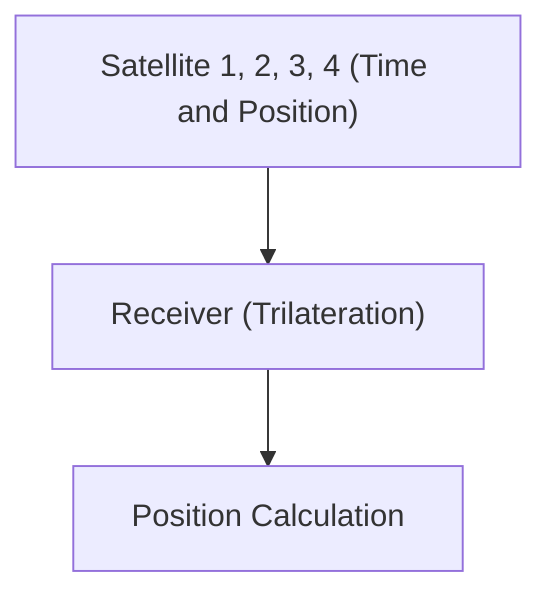

# Luar Angkasa dan Teknologi: Cara Kerja GPS

GPS menggunakan teori relativitas untuk mengukur posisi secara akurat.

## Prinsip Penentuan Posisi

## Dilatasi Waktu
$$ \Delta t' = \frac{\Delta t}{\sqrt{1 - \frac{v^2}{c^2}}} $$

## Verifikasi Teknologi Tambahan Bagian 1

Bagian ini menggali lebih dalam tentang detail teknis dan studi kasus lebih lanjut. Kami mengevaluasi performa di berbagai kondisi dan mempertimbangkan tantangan serta solusi untuk integrasi dengan sistem lain. Kami juga membahas prospek dan batasan di masa depan.

