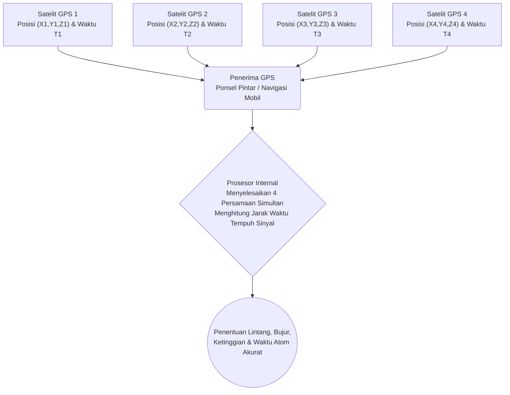

# Luar Angkasa & Teknologi: Cara Kerja GPS - Teori Relativitas dan Pemosisian Satelit

Setiap kali kita membuka peta digital di ponsel pintar, memesan transportasi online, atau mengikuti navigasi kendaraan, kita memanfaatkan **Global Positioning System (GPS)**. Mulai dari memandu pesawat terbang melintasi samudra luas hingga menyinkronkan penanda waktu mikrodetik transaksi bursa saham dunia, GPS telah menjadi infrastruktur penting yang tak kasat mata bagi peradaban modern.

Namun, tidak banyak yang menyadari bahwa kepraktisan sehari-hari ini sangat bergantung pada **Teori Relativitas Albert Einstein**—cabang fisika teoretis yang terkesan sangat jauh dari kehidupan sehari-hari. Tanpa koreksi relativitas, kesalahan posisi GPS akan menumpuk sekitar **11,4 kilometer setiap hari**, membuat seluruh sistem satelit navigasi lumpuh dan tidak berguna dalam hitungan jam.

Artikel ini membahas tuntas prinsip geometris trilaterasi, dampak relativitas khusus dan umum terhadap jam atom di orbit, serta kecerdasan rekayasa teknik yang menjaga akurasi navigasi di seluruh dunia.

## 1. Prinsip Dasar GPS: Trilaterasi dan Pengukuran Waktu yang Presisi

GPS menentukan koordinat tiga dimensi penerima di permukaan bumi dengan menangkap sinyal gelombang radio yang dipancarkan oleh konstelasi satelit di orbit. Fondasi matematika di balik penentuan posisi ini adalah metode **trilaterasi**.

### 1.1. Pendekatan Geometris Trilaterasi

Untuk menentukan posisi spasial secara presisi di ruang tiga dimensi, sebuah penerima membutuhkan sinyal dari minimal **empat satelit GPS**:

1. **Satelit Pertama (Bola Ketidakpastian)**: Dengan mengalikan waktu tempuh gelombang radio dengan kecepatan cahaya, penerima menghitung jarak ke satelit pertama. Pengguna berada di suatu tempat pada permukaan bola imajiner berpusat di satelit tersebut.
2. **Satelit Kedua (Irisan Lingkaran)**: Mengukur jarak ke satelit kedua menghasilkan perpotongan dua bola yang membentuk sebuah lingkaran di ruang 3D.
3. **Satelit Ketiga (Mengerucut ke Dua Titik)**: Bola dari satelit ketiga memotong lingkaran tersebut tepat di **dua titik terpisah**. Salah satu titik biasanya berada di luar angkasa atau jauh di dalam perut bumi, sehingga dapat diabaikan secara fisik. Hal ini menyisakan satu titik koordinat nyata (lintang, bujur, dan ketinggian).
4. **Satelit Keempat (Koreksi Jam Penerima)**: Meskipun secara matematis tiga bola cukup untuk menentukan koordinat $(X, Y, Z)$, terdapat kendala praktis: **ketidakakuratan jam internal penerima**. Osilator kristal kuarsa pada ponsel pintar tidak memiliki ketelitian nanodetik seperti jam atom satelit. Satelit keempat memberikan persamaan tambahan untuk memecahkan koordinat spasial sekaligus bias waktu penerima $\Delta t$.

```mermaid
flowchart TD
    S1["Satelit GPS 1\nPosisi (X1,Y1,Z1) & Waktu T1"] --> R(Penerima GPS\nPonsel Pintar / Navigasi Mobil)
    S2["Satelit GPS 2\nPosisi (X2,Y2,Z2) & Waktu T2"] --> R
    S3["Satelit GPS 3\nPosisi (X3,Y3,Z3) & Waktu T3"] --> R
    S4["Satelit GPS 4\nPosisi (X4,Y4,Z4) & Waktu T4"] --> R
    R --> C{"Prosesor Internal\nMenyelesaikan 4 Persamaan Simultan\nMenghitung Jarak Waktu Tempuh Sinyal"}
    C --> P((Penentuan Lintang, Bujur,\nKetinggian & Waktu Atom Akurat))
```

### 1.2. Perhitungan Jarak: Kecepatan Cahaya sebagai Pengali Masif

Jarak antara satelit dan penerima dihitung berdasarkan waktu tempuh (Time of Flight) gelombang elektromagnetik:

$$ \text{Jarak} = c \times \Delta t $$

Di mana $c \approx 3 \times 10^8 \text{ m/s}$ adalah kecepatan cahaya dalam ruang hampa. Karena cahaya merambat sekitar 300 meter dalam satu mikrodetik ($10^{-6}\text{ s}$), ketidakakuratan waktu sebesar **satu mikrodetik saja akan menimbulkan kesalahan posisi sebesar 300 meter**. Penyimpangan satu nanodetik ($10^{-9}\text{ s}$) pun menyebabkan pergeseran 30 sentimeter.

Oleh karena itu, satelit GPS dibekali **jam atom sesium-133 dan rubidium-87** dengan stabilitas luar biasa. Namun, betapa pun sempurnanya jam tersebut, ia menghadapi kenyataan fisika mendasar: **waktu itu sendiri mengalir dengan kecepatan berbeda di orbit dibandingkan di permukaan bumi**.

## 2. Relativitas Einstein: Detik Jam Orbit yang Berlari Berbeda

Diumumkan pada tahun 1905 dan 1915, **Teori Relativitas Khusus** dan **Teori Relativitas Umum** Albert Einstein meruntuhkan asumsi mekanika Newton tentang waktu mutlak. Waktu tidak berdetik seragam di seluruh alam semesta, melainkan dipengaruhi oleh kecepatan gerak dan kuatnya medan gravitasi.

### 2.1. Relativitas Khusus: Gerak Cepat Memperlambat Waktu

Relativitas khusus membuktikan bahwa jam yang bergerak relatif terhadap pengamat diam akan berdetik lebih lambat (dilatasi waktu kinematis). Efek ini dirumuskan melalui faktor Lorentz:

$$ \Delta t' = \frac{\Delta t}{\sqrt{1 - \frac{v^2}{c^2}}} $$

Di mana $v$ adalah kecepatan satelit dan $c$ adalah kecepatan cahaya.

Satelit GPS mengorbit pada ketinggian sekitar 20.200 km dengan kecepatan orbit sekitar **$3,874\text{ km/detik}$** (hampir 14.000 km/jam). Karena pergerakan yang sangat cepat ini, jam atom pada satelit berdetik **lebih lambat sekitar 7 mikrodetik setiap hari ($-7\ \mu\text{s/hari}$)** dibandingkan jam di bumi.

### 2.2. Relativitas Umum: Gravitasi Lemah Mempercepat Waktu

Relativitas umum menjelaskan gravitasi sebagai kelengkungan ruang-waktu akibat massa. Di dekat massa besar, ruang-waktu melengkung kuat dan waktu mengalir lebih lambat; sebaliknya, **semakin jauh dari pusat massa dan semakin lemah gravitasi, waktu mengalir semakin cepat**.

Pada ketinggian 20.200 km, gravitasi bumi hanya sekitar seperempat dari gravitasi di permukaan. Berada dalam ruang-waktu yang lebih datar, jam atom satelit GPS berdetik **lebih cepat sekitar 45 mikrodetik setiap hari ($+45\ \mu\text{s/hari}$)** dibandingkan jam di darat.

### 2.3. Akumulasi Efek Relativistik: Selisih Bersih +38 Mikrodetik per Hari

Karena kedua fenomena fisika terjadi secara bersamaan, kita menggabungkan kedua efek tersebut:

- **Efek Relativitas Khusus (kecepatan)**: $-7\ \mu\text{s/hari}$ (lebih lambat)
- **Efek Relativitas Umum (gravitasi)**: $+45\ \mu\text{s/hari}$ (lebih cepat)

$$ \text{Pergeseran Bersih} = +45\ \mu\text{s/hari} - 7\ \mu\text{s/hari} = +38\ \mu\text{s/hari} $$

Efek gravitasi jauh lebih dominan. Akibatnya, jam atom pada satelit GPS **berjalan lebih cepat 38 mikrodetik setiap 24 jam** dibandingkan jam di permukaan bumi.

## 3. Mengapa 38 Mikrodetik Menimbulkan Kesalahan Fatal?

Bagi manusia, 38 mikrodetik (0,000038 detik) terasa mustahil disadari. Namun jika dikalikan dengan kecepatan cahaya ($300.000\text{ km/detik}$), pergeseran jarak yang dihasilkan sungguh luar biasa:

$$ \text{Penyimpangan Harian} = (3 \times 10^8\text{ m/s}) \times (38 \times 10^{-6}\text{ s}) = 11.400\text{ meter} = 11,4\text{ km/hari} $$

Jika efek relativitas diabaikan:
- Pada hari pertama, kesalahan posisi mencapai **11,4 km**.
- Pada hari kedua, terakumulasi menjadi **22,8 km**.
- Pada hari ketiga, melampaui **34 km**.

Dalam beberapa hari saja, penunjuk navigasi mobil akan menempatkan kendaraan di tengah laut atau hutan belantara, dan sistem penerbangan sipil akan kehilangan panduan navigasi yang aman.

## 4. Cara Sistem GPS Mengoreksi Efek Relativistik

Untuk mengatasi potensi kegagalan fatal ini, perancang sistem GPS memadukan rekayasa perangkat keras sebelum peluncuran dan algoritma koreksi telemetri waktu nyata.

### 4.1. Pengaturan Frekuensi Sebelum Peluncuran

Solusi paling cerdas diterapkan di darat sebelum roket meluncur ke luar angkasa.

Frekuensi standar osilator jam atom di bumi adalah **10,23 MHz**. Jika diluncurkan tanpa penyesuaian, jam tersebut akan berdetik terlalu cepat di orbit. Oleh sebab itu, para insinyur sengaja menurunkan frekuensi dasar osilator satelit sebelum peluncuran menjadi:

$$ f_{\text{satelit}} = 10,22999999543\text{ MHz} $$

Ketika satelit mencapai orbit 20.200 km, percepatan relativistik bersih sebesar $+38\ \mu\text{s/hari}$ secara otomatis menaikkan frekuensi tersebut tepat ke nilai standar **10,23 MHz** seperti yang diterima oleh perangkat di bumi.

### 4.2. Pemantauan Stasiun Bumi dan Koreksi Dinamis

Penyesuaian frekuensi mengasumsikan orbit lingkaran sempurna. Pada praktiknya terdapat gangguan:
- **Eksentrisitas Orbit**: Orbit satelit sedikit elips ($e \approx 0,01$), memicu fluktuasi periodik hingga 45 nanodetik.
- **Bentuk Geoid Bumi**: Distribusi massa bumi tidak seragam secara sempurna.
- **Tekanan Radiasi Matahari dan Gravitasi Bulan**.

Oleh karena itu, Stasiun Kontrol Utama (MCS) dan stasiun pelacak di seluruh dunia terus memantau satelit selama 24 jam. Stasiun menghitung parameter koreksi ($a_0, a_1, a_2$) dan mengunggahnya ke satelit. Satelit menyiarkannya dalam **Pesan Navigasi (Navigation Message)**, sehingga ponsel pintar dapat menghapus sisa kesalahan secara instan.

## 5. GPS sebagai Fondasi Vital Masyarakat Modern

Penerapan GPS kini jauh melampaui aplikasi navigasi di ponsel cerdas:

- **Transportasi dan Kendaraan Otonom**: Navigasi penerbangan (ADS-B), pemanduan kapal kargo, dan kendaraan swakemudi Level 4/5 mengandalkan Differential GPS (DGPS) dan RTK untuk akurasi tingkat sentimeter.
- **Finansial dan Telekomunikasi**: Perdagangan frekuensi tinggi (HFT) mewajibkan penanda waktu sub-mikrodetik sesuai standar MiFID II. Menara seluler 4G/5G menyinkronkan fase gelombang radio melalui pulsa 1PPS berbasis GPS.
- **Pertanian Presisi dan Konstruksi**: Traktor otomatis menanam benih dan menyemprotkan pupuk dengan toleransi 2 cm; alat berat konstruksi meratakan tanah secara otomatis berpedoman pada model digital 3D.
- **Mitigasi Bencana dan Geosains**: Jaringan GPS memantau pergeseran lempeng tektonik dalam skala milimeter untuk penelitian gempa bumi, serta mengukur keterlambatan sinyal di troposfer guna memperkirakan uap air dan memprediksi cuaca ekstrem.

## 6. Kesimpulan: Hukum Kosmik di Genggaman Tangan

Saat melihat titik biru yang memandu langkah Anda di layar ponsel, Anda sedang menyaksikan perpaduan luar biasa dari pencapaian sains manusia: bertemunya geometri Euclides, getaran atom sesium, dan teori kelengkungan ruang-waktu Einstein yang bekerja harmonis melintasi 20.000 kilometer ruang angkasa.
