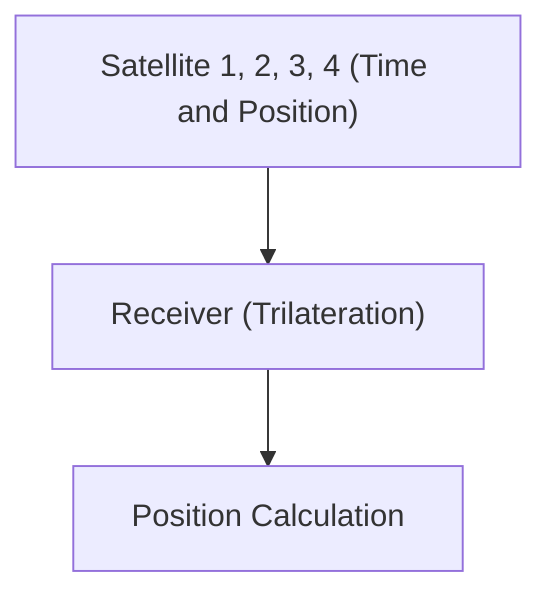

# 우주와 기술: GPS의 원리

GPS는 상대성 이론을 이용하여 정확한 위치를 측정합니다.

## 측위 원리

## 시간 지연
$$ \Delta t' = \frac{\Delta t}{\sqrt{1 - \frac{v^2}{c^2}}} $$

## 추가 기술 검증 파트 1

이 섹션에서는 더 깊은 기술적 세부 사항과 사례 연구에 대해 깊이 파고듭니다. 다양한 조건에서의 성능 평가 및 다른 시스템과의 통합과 관련된 과제와 해결책을 검토합니다. 향후 전망과 한계에 대해서도 고찰합니다.

