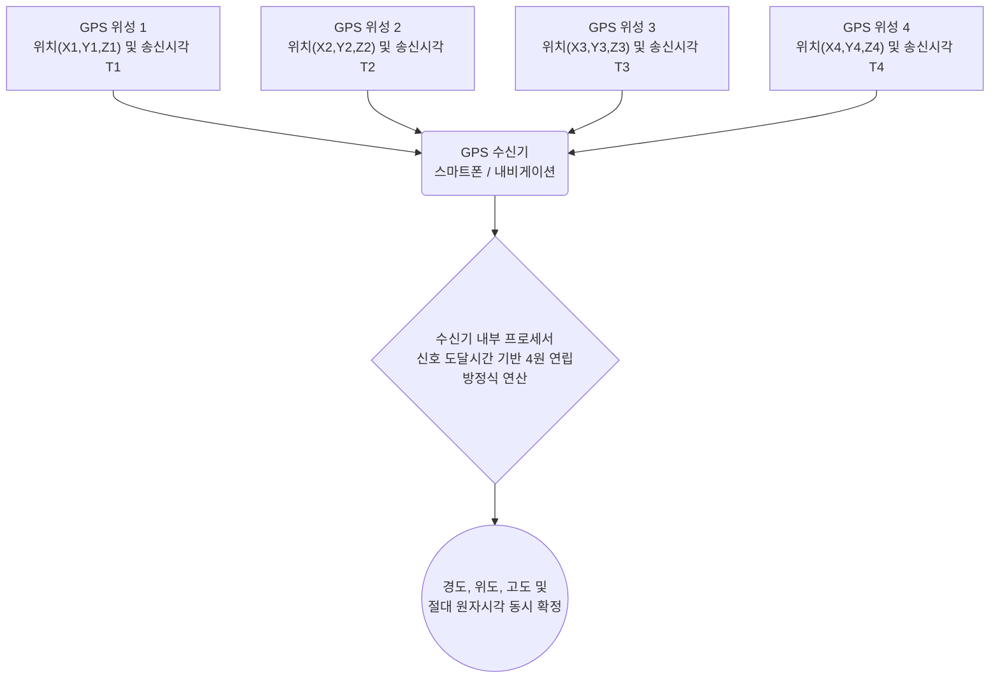

# 우주와 기술: GPS의 작동 원리 - 상대성이론과 위성 항법 시스템

우리가 일상에서 스마트폰 지도 앱을 켜거나 내비게이션의 안내를 받을 때 사용하는 기술이 바로 **GPS(Global Positioning System: 전지구 위치측정 시스템)** 입니다. 낯선 도심에서의 길 찾기부터 대양을 횡단하는 항공기와 선박의 안전 운항, 그리고 국제 금융 시장에서 밀리초 단위로 체결되는 거래의 타임스탬프 동기화에 이르기까지, GPS는 현대 문명의 존립을 지탱하는 보이지 않는 핵심 인프라입니다.

하지만 이 일상적인 GPS 시스템이, 언뜻 보기에는 우리의 현실과 거리가 멀어 보이는 알베르트 아인슈타인의 **상대성이론** 에 의해 유지되고 있다는 사실을 알고 계십니까? 만약 상대성이론에 의한 시간 보정이 이루어지지 않는다면, GPS는 **하루에 약 11.4킬로미터(약 7마일)** 라는 치명적인 오차를 축적하여 단 하루 만에 무용지물이 되고 맙니다.

본 글에서는 GPS가 삼차원 공간에서 위치를 측정하는 기하학적 원리인 삼변측량부터, 특수 및 일반 상대성이론이 인공위성의 시간에 미치는 극적인 영향, 그리고 인류 공학이 이 물리 법칙의 오차를 어떻게 극복해 냈는지를 포괄적이고 전문적으로 살펴봅니다.

## 1. GPS의 기본 메커니즘: 삼변측량과 정밀한 '시간'의 기하학

GPS는 지구 궤도를 도는 인공위성들로부터 발신되는 무선 전파 신호를 지상의 수신기(스마트폰 등)가 수신하여 현재 위치를 역산합니다. 이 위치 결정의 수학적 기반은 **삼변측량(Trilateration)** 기법입니다.

### 1.1. 삼변측량(Trilateration)의 기하학적 접근

3차원 공간에서 수신기의 위치를 특정하기 위해서는 최소 **4기 이상의 GPS 위성** 신호가 필요합니다:

1. **첫 번째 위성 (구면의 형성)**: 위성에서 발사된 전파가 수신기에 도달하는 시간을 측정하고 빛의 속도를 곱하면 위성과 수신기 사이의 거리 $R_1$이 계산됩니다. 이는 수신기가 위성을 중심으로 하는 반지름 $R_1$의 구면 상 어딘가에 있음을 의미합니다.
2. **두 번째 위성 (교차 원)**: 두 번째 위성으로부터의 거리가 더해지면, 두 구면이 만나 3차원 공간에 하나의 원(Ring)을 형성합니다.
3. **세 번째 위성 (두 개의 점으로 수렴)**: 세 번째 구면이 교차하면 원 위의 점은 **단 2개의 점** 으로 압축됩니다. 이 중 한 점은 우주 공간이나 지구 내부 깊숙한 곳처럼 물리적으로 불가능한 위치이므로 자연스럽게 배제되며, 지표면 근처의 단 하나의 점(위도, 경도, 고도)이 특정됩니다.
4. **네 번째 위성 (수신기 시계 오차 보정)**: 기하학적으로는 3개의 구면으로 $(X, Y, Z)$ 좌표가 결정되는 것처럼 보이지만, 현실의 공학에는 **수신기 시계의 부정확성** 이라는 거대한 난관이 존재합니다. 스마트폰의 수정 진동자 시계는 위성에 탑재된 원자시계처럼 나노초 단위의 정밀도를 갖추지 못합니다. 따라서 네 번째 위성 신호를 활용해 4원 연립방정식을 풂으로써 3차원 공간 좌표와 함께 수신기의 시간 오차 $\Delta t$를 동시에 완벽히 산출합니다.

```mermaid
flowchart TD
    S1["GPS 위성 1\n위치(X1,Y1,Z1) 및 송신시각 T1"] --> R(GPS 수신기\n스마트폰 / 내비게이션)
    S2["GPS 위성 2\n위치(X2,Y2,Z2) 및 송신시각 T2"] --> R
    S3["GPS 위성 3\n위치(X3,Y3,Z3) 및 송신시각 T3"] --> R
    S4["GPS 위성 4\n위치(X4,Y4,Z4) 및 송신시각 T4"] --> R
    R --> C{"수신기 내부 프로세서\n신호 도달시간 기반 4원 연립방정식 연산"}
    C --> P((경도, 위도, 고도 및\n절대 원자시각 동시 확정))
```

### 1.2. 거리 계산과 빛의 속도라는 거대한 배수

위성에서 수신기까지의 거리는 전자기파의 비행 시간(Time of Flight)을 통해 도출됩니다:

$$ \text{거리} = c \times \Delta t $$

여기서 $c \approx 3 \times 10^8 \text{ m/s}$ 는 진공 중의 빛의 속도입니다. 빛은 1마이크로초($10^{-6}$초) 동안 약 300미터를 이동합니다. 따라서 시간 측정에 **단 1마이크로초의 오차만 발생해도 300미터의 위치 오차** 가 발생하며, 1나노초($10^{-9}$초)의 오차도 30센티미터의 거리 차이를 낳습니다.

이 때문에 GPS 위성에는 수십만 년에 1초도 틀리지 않는 초고정밀 **세슘-133 원자시계** 와 **루비듐-87 원자시계** 가 탑재되어 있습니다. 그러나 시계 장치 자체가 아무리 완벽하더라도, 지구 궤도에 오른 시계는 근본적인 물리적 현실에 직면합니다. 바로 **시간의 흐름 자체가 지상과 다르다는 사실** 입니다.

## 2. 아인슈타인의 상대성이론: 궤도 시계가 겪는 시간의 왜곡

1905년의 **특수 상대성이론** 과 1915년의 **일반 상대성이론** 은 절대적 시간과 공간이라는 뉴턴 역학의 세계관을 완전히 무너뜨렸습니다. 아인슈타인에 따르면 시간은 우주 어디에서나 동일하게 흐르는 절대적 척도가 아니며, 관측자의 이동 속도와 중력장의 세기에 따라 상대적으로 변합니다.

### 2.1. 특수 상대성이론: 빠른 속도는 시간을 느리게 만든다

특수 상대성이론의 핵심 결론 중 하나는, 정지한 관측자에 대해 빠르게 움직이는 물체 내부의 시계는 더 천천히 간다는 것입니다(시간 팽창). 이는 로런츠 인자로 표현됩니다:

$$ \Delta t' = \frac{\Delta t}{\sqrt{1 - \frac{v^2}{c^2}}} $$

여기서 $v$ 는 물체의 상대 속도, $c$ 는 빛의 속도입니다.

GPS 위성은 지표면에서 약 20,200km 떨어진 중궤도(MEO)에서 약 11시간 58분마다 지구를 한 바퀴씩 돕니다. 이때의 공전 속도는 **초속 약 3.874km**(시속 약 14,000km)에 달합니다. 이 맹렬한 속도 때문에 지상에서 정지해 있는 관측자의 시계와 비교했을 때, 위성의 원자시계는 **하루에 약 7마이크로초($-7\ \mu\text{s/일}$) 느리게** 갑니다.

### 2.2. 일반 상대성이론: 약한 중력은 시간을 빠르게 흐르게 한다

반면 일반 상대성이론은 중력을 '질량에 의해 휘어진 4차원 시공간의 기하학적 곡률'로 설명합니다. 질량이 큰 천체에 가까울수록 시공간이 강하게 왜곡되어 시간이 느리게 흐르며, **중력이 약한 곳(질량 중심에서 멀리 떨어진 곳)일수록 시간은 더 빠르게 흐릅니다**.

지구 표면은 질량 중심에 가까워 중력이 강하지만, 고도 20,200km 상공에 위치한 위성이 받는 중력의 세기는 지표면의 약 4분의 1에 불과합니다. 시공간의 곡률이 얕은 환경에 머물기 때문에, GPS 위성의 시계는 지상의 시계보다 **하루에 약 45마이크로초($+45\ \mu\text{s/일}$) 빠르게** 갑니다.

### 2.3. 상대론적 효과의 합성: 하루 +38마이크로초의 누적

GPS 위성은 초고속 이동과 약한 중력이라는 두 가지 환경에 동시에 노출되어 있습니다. 따라서 두 상대론적 효과를 합산해야 합니다:

- **특수 상대성이론 효과 (속도에 의한 지연)**: $-7\ \mu\text{s/일}$
- **일반 상대성이론 효과 (중력에 의한 가속)**: $+45\ \mu\text{s/일}$

$$ \text{순 상대론적 오차} = +45\ \mu\text{s/일} - 7\ \mu\text{s/일} = +38\ \mu\text{s/일} $$

결과적으로 일반 상대성이론의 중력 효과가 특수 상대성이론의 속도 효과를 압도하여, 위성의 원자시계는 지상의 시계보다 **매일 38마이크로초씩 빠르게 흐릅니다**.

## 3. 왜 38마이크로초가 '치명적인 참사'를 부르는가?

인간의 일상적인 감각에서 38마이크로초(0.000038초)는 눈 깜빡임보다 훨씬 짧아 전혀 체감할 수 없는 찰나의 시간입니다. 그러나 빛의 속도($c = 300,000\text{ km/s}$)로 거리를 측정하는 GPS 시스템에서 이 시간 차이는 치명적인 파국을 초래합니다:

$$ \text{일일 거리 오차} = (3 \times 10^8\text{ m/s}) \times (38 \times 10^{-6}\text{ s}) = 11,400\text{ m} = 11.4\text{ km/일} $$

만약 상대성이론을 고려하지 않고 GPS 시스템을 가동했다면:
- 단 하루 만에 지상 위치 측정 오차가 **11.4km** 나 발생합니다.
- 이틀째에는 **22.8km**, 사흘째에는 **34.2km** 로 오차가 걷잡을 수 없이 누적됩니다.

이러한 오차는 자동차 내비게이션이 주행 중인 도로 대신 산속이나 바다 한가운데를 가리키게 만들고, 항공기 자동 착륙을 불가능하게 하며, GPS 인프라 전체를 쓸모없는 고철 덩어리로 전락시킬 것입니다.

## 4. GPS 공학은 상대성이론을 어떻게 극복했는가?

이러한 물리적 오차를 상쇄하기 위해 GPS 시스템은 발사 전 하드웨어 오프셋 조정과 지상 관제국의 실시간 보정 알고리즘을 결합한 정밀 공학 체계를 구축했습니다.

### 4.1. 발사 전 원자시계 주파수 의도적 감쇄 (프리셋 오프셋)

가장 우아하고 결정적인 해결책은 위성을 지구에서 발사하기 전에 미리 실행되었습니다.

지상에서 사용되는 표준 원자시계의 기본 진동 주파수는 **10.23 MHz** 입니다. 이를 그대로 궤도로 쏘아 올리면 하루 38마이크로초 빠르게 진동하게 됩니다. 따라서 엔지니어들은 발사 전 지상에서 위성 원자시계의 기준 진동 주파수를 의도적으로 약간 낮추어 설정했습니다:

$$ f_{\text{satellite}} = 10.22999999543\text{ MHz} $$

위성이 고도 20,200km 궤도에 안착하여 약한 중력과 고속 운동 상태에 들어가면, 상대성이론 효과에 의해 진동 주파수가 정확히 상승하여 지상 관측자 기준으로 완벽한 **10.23 MHz** 에 맞춰지게 됩니다.

### 4.2. 지상 관제국의 실시간 감시와 항법 궤도 보정

발사 전 주파수 조정은 완벽한 원궤도를 가정한 이론적 기준치입니다. 그러나 실제 궤도에서는 다양한 외란이 발생합니다:
- **궤도 이심률(Eccentricity)**: GPS 위성의 궤도는 완벽한 원이 아닌 약 0.01의 이심률을 갖는 타원형입니다. 근지점에서는 속도가 빠르고 중력이 강하며, 원지점에서는 속도가 느리고 중력이 약해져 최대 45나노초 규모의 주기적인 상대론적 변동이 발생합니다.
- **지구 중력장의 불균일성**: 지구는 완전한 구형이 아니며 질량 분포가 불균등합니다(지오이드 기복).
- **태양광 복사압과 조석력**: 태양과 달의 인력 및 복사압이 위성 궤도를 미세하게 교란합니다.

이를 해결하기 위해 지상의 **주관제국(Master Control Station)** 과 전 세계 추적 기지들이 24시간 모든 GPS 위성의 궤도와 시계 오차를 감시합니다. 관제국은 정밀한 시계 보정 다항식 계수($a_0, a_1, a_2$)를 계산하여 위성에 업로드하고, 위성은 이를 **항법 메시지(Navigation Message)** 에 담아 지상으로 송출합니다. 스마트폰 수신기는 이 보정 파라미터를 실시간 방정식에 대입함으로써 언제 어디서나 수 미터에서 센티미터 수준의 정밀도를 유지합니다.

## 5. 현대 문명을 지탱하는 GPS 핵심 인프라

오늘날 GPS는 단순한 길 안내 서비스를 넘어 현대 문명의 모든 영역을 지탱하는 핵심 인프라로 자리 잡았습니다:

- **모빌리티와 자율주행 혁신**: 항공기의 정밀 항법(ADS-B), 선박의 최적 항로 제어, 그리고 레벨 4/5 자율주행차의 cm급 정밀 측위(RTK-GPS)는 필수 불가결한 기술입니다.
- **금융 및 초고속 통신의 기준**: 뉴욕, 런던, 도쿄 등 글로벌 금융 시장의 알고리즘 기반 고频 거래(HFT)는 거래 순서를 입증하기 위해 마이크로초 단위의 시각 동기화가 요구되며, 이는 GPS 원자시각에 의존합니다. 또한 5G 이동통신 기지국 간의 위상 동기화에도 활용됩니다.
- **정밀 농업 및 스마트 건설**: 자율주행 트랙터는 2cm 오차 범위 내에서 파종과 시비를 수행하고, 건설 현장의 굴착기와 불도저는 3D 지형 설계도와 연동되어 무인 자동 굴삭을 수행합니다.
- **방재 및 지구과학 연구**: 지각 변동을 밀리미터 단위로 장기 모니터링하여 지진과 화산 활동을 조기 감지하고, GPS 전파가 대류권을 통과할 때 발생하는 지연 시간을 분석해 국지성 집중호우를 예측하는 등 최첨단 과학 연구에도 크게 기여하고 있습니다.

## 6. 맺음말: 일상 속에 살아 숨 쉬는 우주의 물리 법칙

우리가 주머니에서 스마트폰을 꺼내 파란색 현재 위치 아이콘을 바라볼 때, 그 작은 점 뒤에는 2만 킬로미터 상공을 질주하는 인공위성 네트워크와, 아인슈타인이 100여 년 전 종이와 연필로 정립한 시공간 상대성이론이라는 우주의 심오한 진리가 함께 작동하고 있습니다.

GPS는 순수 이론물리학의 산물이었던 상대성이론이 인류의 실생활을 어떻게 획기적으로 변화시켰는지를 증명하는 가장 위대한 공학적 승리입니다. 스마트폰 화면에 뜨는 정확한 현재 위치는 인간의 이성과 우주의 법칙이 만나는 아름다운 기적입니다.
