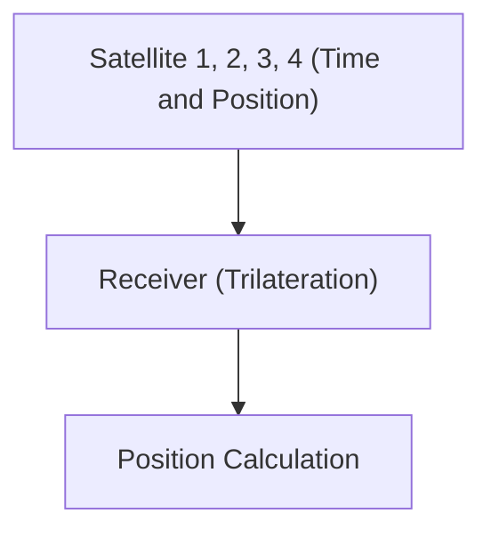

# 宇宙と技術: GPSの仕組み

GPSは相対性理論を利用して正確な位置を測定します。

## 測位原理

```mermaid
flowchart TD
    A["Satellite 1, 2, 3, 4 (Time and Position)"] --> B["Receiver (Trilateration)"]
    B --> C["Position Calculation"]
```

## 時間の遅れ
$$ \Delta t' = \frac{\Delta t}{\sqrt{1 - \frac{v^2}{c^2}}} $$

