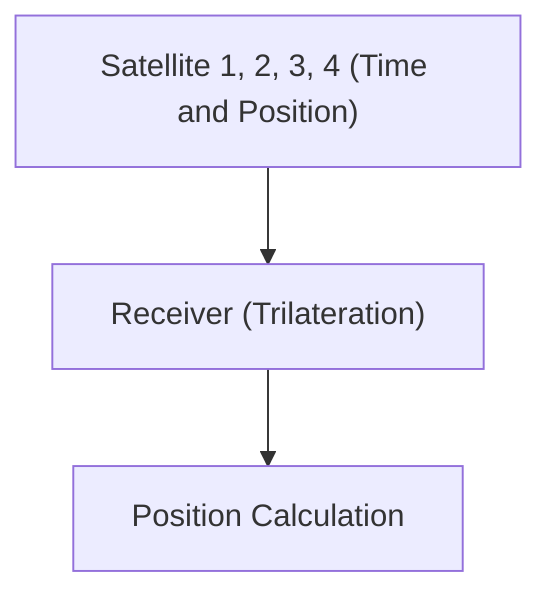

# Espaço e Tecnologia: Como o GPS Funciona

O GPS utiliza a teoria da relatividade para medir posições com precisão.

## Princípio de Posicionamento

## Dilatação do Tempo
$$ \Delta t' = \frac{\Delta t}{\sqrt{1 - \frac{v^2}{c^2}}} $$

## Verificação de Tecnologia Adicional Parte 1

Nesta seção, nos aprofundaremos em mais detalhes técnicos e estudos de caso. Avaliaremos o desempenho sob várias condições e examinaremos os desafios e soluções para a integração com outros sistemas. Perspectivas futuras e limitações também serão discutidas.

