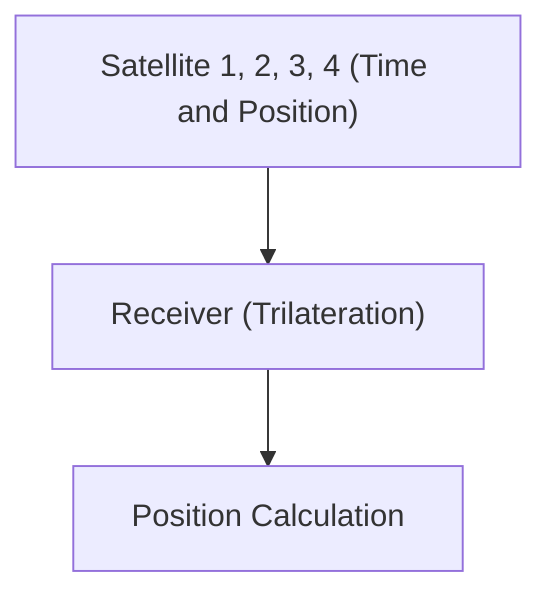

# Espaço e Tecnologia: Como o GPS Funciona

O GPS utiliza a teoria da relatividade para medir posições com precisão.

## Princípio de Posicionamento

## Dilatação do Tempo
$$ \Delta t' = \frac{\Delta t}{\sqrt{1 - \frac{v^2}{c^2}}} $$

## Verificação de Tecnologia Adicional Parte 1

Nesta seção, nos aprofundaremos em mais detalhes técnicos e estudos de caso. Avaliaremos o desempenho sob várias condições e examinaremos os desafios e soluções para a integração com outros sistemas. Perspectivas futuras e limitações também serão discutidas.

## Verificação de Tecnologia Adicional Parte 2

Nesta seção, nos aprofundaremos em mais detalhes técnicos e estudos de caso. Avaliaremos o desempenho sob várias condições e examinaremos os desafios e soluções para a integração com outros sistemas. Perspectivas futuras e limitações também serão discutidas.

## Verificação de Tecnologia Adicional Parte 3

Nesta seção, nos aprofundaremos em mais detalhes técnicos e estudos de caso. Avaliaremos o desempenho sob várias condições e examinaremos os desafios e soluções para a integração com outros sistemas. Perspectivas futuras e limitações também serão discutidas.

## Verificação de Tecnologia Adicional Parte 4

Nesta seção, nos aprofundaremos em mais detalhes técnicos e estudos de caso. Avaliaremos o desempenho sob várias condições e examinaremos os desafios e soluções para a integração com outros sistemas. Perspectivas futuras e limitações também serão discutidas.

## Verificação de Tecnologia Adicional Parte 5

Nesta seção, nos aprofundaremos em mais detalhes técnicos e estudos de caso. Avaliaremos o desempenho sob várias condições e examinaremos os desafios e soluções para a integração com outros sistemas. Perspectivas futuras e limitações também serão discutidas.

## Verificação de Tecnologia Adicional Parte 6

Nesta seção, nos aprofundaremos em mais detalhes técnicos e estudos de caso. Avaliaremos o desempenho sob várias condições e examinaremos os desafios e soluções para a integração com outros sistemas. Perspectivas futuras e limitações também serão discutidas.

## Verificação de Tecnologia Adicional Parte 7

Nesta seção, nos aprofundaremos em mais detalhes técnicos e estudos de caso. Avaliaremos o desempenho sob várias condições e examinaremos os desafios e soluções para a integração com outros sistemas. Perspectivas futuras e limitações também serão discutidas.

## Verificação de Tecnologia Adicional Parte 8

Nesta seção, nos aprofundaremos em mais detalhes técnicos e estudos de caso. Avaliaremos o desempenho sob várias condições e examinaremos os desafios e soluções para a integração com outros sistemas. Perspectivas futuras e limitações também serão discutidas.

## Verificação de Tecnologia Adicional Parte 9

Nesta seção, nos aprofundaremos em mais detalhes técnicos e estudos de caso. Avaliaremos o desempenho sob várias condições e examinaremos os desafios e soluções para a integração com outros sistemas. Perspectivas futuras e limitações também serão discutidas.

## Verificação de Tecnologia Adicional Parte 10

Nesta seção, nos aprofundaremos em mais detalhes técnicos e estudos de caso. Avaliaremos o desempenho sob várias condições e examinaremos os desafios e soluções para a integração com outros sistemas. Perspectivas futuras e limitações também serão discutidas.

## Verificação de Tecnologia Adicional Parte 11

Nesta seção, nos aprofundaremos em mais detalhes técnicos e estudos de caso. Avaliaremos o desempenho sob várias condições e examinaremos os desafios e soluções para a integração com outros sistemas. Perspectivas futuras e limitações também serão discutidas.

## Verificação de Tecnologia Adicional Parte 12

Nesta seção, nos aprofundaremos em mais detalhes técnicos e estudos de caso. Avaliaremos o desempenho sob várias condições e examinaremos os desafios e soluções para a integração com outros sistemas. Perspectivas futuras e limitações também serão discutidas.

## Verificação de Tecnologia Adicional Parte 13

Nesta seção, nos aprofundaremos em mais detalhes técnicos e estudos de caso. Avaliaremos o desempenho sob várias condições e examinaremos os desafios e soluções para a integração com outros sistemas. Perspectivas futuras e limitações também serão discutidas.

## Verificação de Tecnologia Adicional Parte 14

Nesta seção, nos aprofundaremos em mais detalhes técnicos e estudos de caso. Avaliaremos o desempenho sob várias condições e examinaremos os desafios e soluções para a integração com outros sistemas. Perspectivas futuras e limitações também serão discutidas.

## Verificação de Tecnologia Adicional Parte 15

Nesta seção, nos aprofundaremos em mais detalhes técnicos e estudos de caso. Avaliaremos o desempenho sob várias condições e examinaremos os desafios e soluções para a integração com outros sistemas. Perspectivas futuras e limitações também serão discutidas.

## Verificação de Tecnologia Adicional Parte 16

Nesta seção, nos aprofundaremos em mais detalhes técnicos e estudos de caso. Avaliaremos o desempenho sob várias condições e examinaremos os desafios e soluções para a integração com outros sistemas. Perspectivas futuras e limitações também serão discutidas.

## Verificação de Tecnologia Adicional Parte 17

Nesta seção, nos aprofundaremos em mais detalhes técnicos e estudos de caso. Avaliaremos o desempenho sob várias condições e examinaremos os desafios e soluções para a integração com outros sistemas. Perspectivas futuras e limitações também serão discutidas.

## Verificação de Tecnologia Adicional Parte 18

Nesta seção, nos aprofundaremos em mais detalhes técnicos e estudos de caso. Avaliaremos o desempenho sob várias condições e examinaremos os desafios e soluções para a integração com outros sistemas. Perspectivas futuras e limitações também serão discutidas.

## Verificação de Tecnologia Adicional Parte 19

Nesta seção, nos aprofundaremos em mais detalhes técnicos e estudos de caso. Avaliaremos o desempenho sob várias condições e examinaremos os desafios e soluções para a integração com outros sistemas. Perspectivas futuras e limitações também serão discutidas.

## Verificação de Tecnologia Adicional Parte 20

Nesta seção, nos aprofundaremos em mais detalhes técnicos e estudos de caso. Avaliaremos o desempenho sob várias condições e examinaremos os desafios e soluções para a integração com outros sistemas. Perspectivas futuras e limitações também serão discutidas.

## Verificação de Tecnologia Adicional Parte 21

Nesta seção, nos aprofundaremos em mais detalhes técnicos e estudos de caso. Avaliaremos o desempenho sob várias condições e examinaremos os desafios e soluções para a integração com outros sistemas. Perspectivas futuras e limitações também serão discutidas.

## Verificação de Tecnologia Adicional Parte 22

Nesta seção, nos aprofundaremos em mais detalhes técnicos e estudos de caso. Avaliaremos o desempenho sob várias condições e examinaremos os desafios e soluções para a integração com outros sistemas. Perspectivas futuras e limitações também serão discutidas.

## Verificação de Tecnologia Adicional Parte 23

Nesta seção, nos aprofundaremos em mais detalhes técnicos e estudos de caso. Avaliaremos o desempenho sob várias condições e examinaremos os desafios e soluções para a integração com outros sistemas. Perspectivas futuras e limitações também serão discutidas.

## Verificação de Tecnologia Adicional Parte 24

Nesta seção, nos aprofundaremos em mais detalhes técnicos e estudos de caso. Avaliaremos o desempenho sob várias condições e examinaremos os desafios e soluções para a integração com outros sistemas. Perspectivas futuras e limitações também serão discutidas.

## Verificação de Tecnologia Adicional Parte 25

Nesta seção, nos aprofundaremos em mais detalhes técnicos e estudos de caso. Avaliaremos o desempenho sob várias condições e examinaremos os desafios e soluções para a integração com outros sistemas. Perspectivas futuras e limitações também serão discutidas.

## Verificação de Tecnologia Adicional Parte 26

Nesta seção, nos aprofundaremos em mais detalhes técnicos e estudos de caso. Avaliaremos o desempenho sob várias condições e examinaremos os desafios e soluções para a integração com outros sistemas. Perspectivas futuras e limitações também serão discutidas.

## Verificação de Tecnologia Adicional Parte 27

Nesta seção, nos aprofundaremos em mais detalhes técnicos e estudos de caso. Avaliaremos o desempenho sob várias condições e examinaremos os desafios e soluções para a integração com outros sistemas. Perspectivas futuras e limitações também serão discutidas.

## Verificação de Tecnologia Adicional Parte 28

Nesta seção, nos aprofundaremos em mais detalhes técnicos e estudos de caso. Avaliaremos o desempenho sob várias condições e examinaremos os desafios e soluções para a integração com outros sistemas. Perspectivas futuras e limitações também serão discutidas.

## Verificação de Tecnologia Adicional Parte 29

Nesta seção, nos aprofundaremos em mais detalhes técnicos e estudos de caso. Avaliaremos o desempenho sob várias condições e examinaremos os desafios e soluções para a integração com outros sistemas. Perspectivas futuras e limitações também serão discutidas.

## Verificação de Tecnologia Adicional Parte 30

Nesta seção, nos aprofundaremos em mais detalhes técnicos e estudos de caso. Avaliaremos o desempenho sob várias condições e examinaremos os desafios e soluções para a integração com outros sistemas. Perspectivas futuras e limitações também serão discutidas.

## Verificação de Tecnologia Adicional Parte 31

Nesta seção, nos aprofundaremos em mais detalhes técnicos e estudos de caso. Avaliaremos o desempenho sob várias condições e examinaremos os desafios e soluções para a integração com outros sistemas. Perspectivas futuras e limitações também serão discutidas.

## Verificação de Tecnologia Adicional Parte 32

Nesta seção, nos aprofundaremos em mais detalhes técnicos e estudos de caso. Avaliaremos o desempenho sob várias condições e examinaremos os desafios e soluções para a integração com outros sistemas. Perspectivas futuras e limitações também serão discutidas.

## Verificação de Tecnologia Adicional Parte 33

Nesta seção, nos aprofundaremos em mais detalhes técnicos e estudos de caso. Avaliaremos o desempenho sob várias condições e examinaremos os desafios e soluções para a integração com outros sistemas. Perspectivas futuras e limitações também serão discutidas.

## Verificação de Tecnologia Adicional Parte 34

Nesta seção, nos aprofundaremos em mais detalhes técnicos e estudos de caso. Avaliaremos o desempenho sob várias condições e examinaremos os desafios e soluções para a integração com outros sistemas. Perspectivas futuras e limitações também serão discutidas.

## Verificação de Tecnologia Adicional Parte 35

Nesta seção, nos aprofundaremos em mais detalhes técnicos e estudos de caso. Avaliaremos o desempenho sob várias condições e examinaremos os desafios e soluções para a integração com outros sistemas. Perspectivas futuras e limitações também serão discutidas.

## Verificação de Tecnologia Adicional Parte 36

Nesta seção, nos aprofundaremos em mais detalhes técnicos e estudos de caso. Avaliaremos o desempenho sob várias condições e examinaremos os desafios e soluções para a integração com outros sistemas. Perspectivas futuras e limitações também serão discutidas.

## Verificação de Tecnologia Adicional Parte 37

Nesta seção, nos aprofundaremos em mais detalhes técnicos e estudos de caso. Avaliaremos o desempenho sob várias condições e examinaremos os desafios e soluções para a integração com outros sistemas. Perspectivas futuras e limitações também serão discutidas.

## Verificação de Tecnologia Adicional Parte 38

Nesta seção, nos aprofundaremos em mais detalhes técnicos e estudos de caso. Avaliaremos o desempenho sob várias condições e examinaremos os desafios e soluções para a integração com outros sistemas. Perspectivas futuras e limitações também serão discutidas.

## Verificação de Tecnologia Adicional Parte 39

Nesta seção, nos aprofundaremos em mais detalhes técnicos e estudos de caso. Avaliaremos o desempenho sob várias condições e examinaremos os desafios e soluções para a integração com outros sistemas. Perspectivas futuras e limitações também serão discutidas.

## Verificação de Tecnologia Adicional Parte 40

Nesta seção, nos aprofundaremos em mais detalhes técnicos e estudos de caso. Avaliaremos o desempenho sob várias condições e examinaremos os desafios e soluções para a integração com outros sistemas. Perspectivas futuras e limitações também serão discutidas.

## Verificação de Tecnologia Adicional Parte 41

Nesta seção, nos aprofundaremos em mais detalhes técnicos e estudos de caso. Avaliaremos o desempenho sob várias condições e examinaremos os desafios e soluções para a integração com outros sistemas. Perspectivas futuras e limitações também serão discutidas.

## Verificação de Tecnologia Adicional Parte 42

Nesta seção, nos aprofundaremos em mais detalhes técnicos e estudos de caso. Avaliaremos o desempenho sob várias condições e examinaremos os desafios e soluções para a integração com outros sistemas. Perspectivas futuras e limitações também serão discutidas.

## Verificação de Tecnologia Adicional Parte 43

Nesta seção, nos aprofundaremos em mais detalhes técnicos e estudos de caso. Avaliaremos o desempenho sob várias condições e examinaremos os desafios e soluções para a integração com outros sistemas. Perspectivas futuras e limitações também serão discutidas.

## Verificação de Tecnologia Adicional Parte 44

Nesta seção, nos aprofundaremos em mais detalhes técnicos e estudos de caso. Avaliaremos o desempenho sob várias condições e examinaremos os desafios e soluções para a integração com outros sistemas. Perspectivas futuras e limitações também serão discutidas.

## Verificação de Tecnologia Adicional Parte 45

Nesta seção, nos aprofundaremos em mais detalhes técnicos e estudos de caso. Avaliaremos o desempenho sob várias condições e examinaremos os desafios e soluções para a integração com outros sistemas. Perspectivas futuras e limitações também serão discutidas.

## Verificação de Tecnologia Adicional Parte 46

Nesta seção, nos aprofundaremos em mais detalhes técnicos e estudos de caso. Avaliaremos o desempenho sob várias condições e examinaremos os desafios e soluções para a integração com outros sistemas. Perspectivas futuras e limitações também serão discutidas.

## Verificação de Tecnologia Adicional Parte 47

Nesta seção, nos aprofundaremos em mais detalhes técnicos e estudos de caso. Avaliaremos o desempenho sob várias condições e examinaremos os desafios e soluções para a integração com outros sistemas. Perspectivas futuras e limitações também serão discutidas.

## Verificação de Tecnologia Adicional Parte 48

Nesta seção, nos aprofundaremos em mais detalhes técnicos e estudos de caso. Avaliaremos o desempenho sob várias condições e examinaremos os desafios e soluções para a integração com outros sistemas. Perspectivas futuras e limitações também serão discutidas.

## Verificação de Tecnologia Adicional Parte 49

Nesta seção, nos aprofundaremos em mais detalhes técnicos e estudos de caso. Avaliaremos o desempenho sob várias condições e examinaremos os desafios e soluções para a integração com outros sistemas. Perspectivas futuras e limitações também serão discutidas.

## Verificação de Tecnologia Adicional Parte 50

Nesta seção, nos aprofundaremos em mais detalhes técnicos e estudos de caso. Avaliaremos o desempenho sob várias condições e examinaremos os desafios e soluções para a integração com outros sistemas. Perspectivas futuras e limitações também serão discutidas.

## Verificação de Tecnologia Adicional Parte 51

Nesta seção, nos aprofundaremos em mais detalhes técnicos e estudos de caso. Avaliaremos o desempenho sob várias condições e examinaremos os desafios e soluções para a integração com outros sistemas. Perspectivas futuras e limitações também serão discutidas.

## Verificação de Tecnologia Adicional Parte 52

Nesta seção, nos aprofundaremos em mais detalhes técnicos e estudos de caso. Avaliaremos o desempenho sob várias condições e examinaremos os desafios e soluções para a integração com outros sistemas. Perspectivas futuras e limitações também serão discutidas.

## Verificação de Tecnologia Adicional Parte 53

Nesta seção, nos aprofundaremos em mais detalhes técnicos e estudos de caso. Avaliaremos o desempenho sob várias condições e examinaremos os desafios e soluções para a integração com outros sistemas. Perspectivas futuras e limitações também serão discutidas.

## Verificação de Tecnologia Adicional Parte 54

Nesta seção, nos aprofundaremos em mais detalhes técnicos e estudos de caso. Avaliaremos o desempenho sob várias condições e examinaremos os desafios e soluções para a integração com outros sistemas. Perspectivas futuras e limitações também serão discutidas.

## Verificação de Tecnologia Adicional Parte 55

Nesta seção, nos aprofundaremos em mais detalhes técnicos e estudos de caso. Avaliaremos o desempenho sob várias condições e examinaremos os desafios e soluções para a integração com outros sistemas. Perspectivas futuras e limitações também serão discutidas.

## Verificação de Tecnologia Adicional Parte 56

Nesta seção, nos aprofundaremos em mais detalhes técnicos e estudos de caso. Avaliaremos o desempenho sob várias condições e examinaremos os desafios e soluções para a integração com outros sistemas. Perspectivas futuras e limitações também serão discutidas.

## Verificação de Tecnologia Adicional Parte 57

Nesta seção, nos aprofundaremos em mais detalhes técnicos e estudos de caso. Avaliaremos o desempenho sob várias condições e examinaremos os desafios e soluções para a integração com outros sistemas. Perspectivas futuras e limitações também serão discutidas.

## Verificação de Tecnologia Adicional Parte 58

Nesta seção, nos aprofundaremos em mais detalhes técnicos e estudos de caso. Avaliaremos o desempenho sob várias condições e examinaremos os desafios e soluções para a integração com outros sistemas. Perspectivas futuras e limitações também serão discutidas.

## Verificação de Tecnologia Adicional Parte 59

Nesta seção, nos aprofundaremos em mais detalhes técnicos e estudos de caso. Avaliaremos o desempenho sob várias condições e examinaremos os desafios e soluções para a integração com outros sistemas. Perspectivas futuras e limitações também serão discutidas.

## Verificação de Tecnologia Adicional Parte 60

Nesta seção, nos aprofundaremos em mais detalhes técnicos e estudos de caso. Avaliaremos o desempenho sob várias condições e examinaremos os desafios e soluções para a integração com outros sistemas. Perspectivas futuras e limitações também serão discutidas.

## Verificação de Tecnologia Adicional Parte 61

Nesta seção, nos aprofundaremos em mais detalhes técnicos e estudos de caso. Avaliaremos o desempenho sob várias condições e examinaremos os desafios e soluções para a integração com outros sistemas. Perspectivas futuras e limitações também serão discutidas.

## Verificação de Tecnologia Adicional Parte 62

Nesta seção, nos aprofundaremos em mais detalhes técnicos e estudos de caso. Avaliaremos o desempenho sob várias condições e examinaremos os desafios e soluções para a integração com outros sistemas. Perspectivas futuras e limitações também serão discutidas.

## Verificação de Tecnologia Adicional Parte 63

Nesta seção, nos aprofundaremos em mais detalhes técnicos e estudos de caso. Avaliaremos o desempenho sob várias condições e examinaremos os desafios e soluções para a integração com outros sistemas. Perspectivas futuras e limitações também serão discutidas.

## Verificação de Tecnologia Adicional Parte 64

Nesta seção, nos aprofundaremos em mais detalhes técnicos e estudos de caso. Avaliaremos o desempenho sob várias condições e examinaremos os desafios e soluções para a integração com outros sistemas. Perspectivas futuras e limitações também serão discutidas.

## Verificação de Tecnologia Adicional Parte 65

Nesta seção, nos aprofundaremos em mais detalhes técnicos e estudos de caso. Avaliaremos o desempenho sob várias condições e examinaremos os desafios e soluções para a integração com outros sistemas. Perspectivas futuras e limitações também serão discutidas.

## Verificação de Tecnologia Adicional Parte 66

Nesta seção, nos aprofundaremos em mais detalhes técnicos e estudos de caso. Avaliaremos o desempenho sob várias condições e examinaremos os desafios e soluções para a integração com outros sistemas. Perspectivas futuras e limitações também serão discutidas.

## Verificação de Tecnologia Adicional Parte 67

Nesta seção, nos aprofundaremos em mais detalhes técnicos e estudos de caso. Avaliaremos o desempenho sob várias condições e examinaremos os desafios e soluções para a integração com outros sistemas. Perspectivas futuras e limitações também serão discutidas.

## Verificação de Tecnologia Adicional Parte 68

Nesta seção, nos aprofundaremos em mais detalhes técnicos e estudos de caso. Avaliaremos o desempenho sob várias condições e examinaremos os desafios e soluções para a integração com outros sistemas. Perspectivas futuras e limitações também serão discutidas.

## Verificação de Tecnologia Adicional Parte 69

Nesta seção, nos aprofundaremos em mais detalhes técnicos e estudos de caso. Avaliaremos o desempenho sob várias condições e examinaremos os desafios e soluções para a integração com outros sistemas. Perspectivas futuras e limitações também serão discutidas.

## Verificação de Tecnologia Adicional Parte 70

Nesta seção, nos aprofundaremos em mais detalhes técnicos e estudos de caso. Avaliaremos o desempenho sob várias condições e examinaremos os desafios e soluções para a integração com outros sistemas. Perspectivas futuras e limitações também serão discutidas.

## Verificação de Tecnologia Adicional Parte 71

Nesta seção, nos aprofundaremos em mais detalhes técnicos e estudos de caso. Avaliaremos o desempenho sob várias condições e examinaremos os desafios e soluções para a integração com outros sistemas. Perspectivas futuras e limitações também serão discutidas.

## Verificação de Tecnologia Adicional Parte 72

Nesta seção, nos aprofundaremos em mais detalhes técnicos e estudos de caso. Avaliaremos o desempenho sob várias condições e examinaremos os desafios e soluções para a integração com outros sistemas. Perspectivas futuras e limitações também serão discutidas.

## Verificação de Tecnologia Adicional Parte 73

Nesta seção, nos aprofundaremos em mais detalhes técnicos e estudos de caso. Avaliaremos o desempenho sob várias condições e examinaremos os desafios e soluções para a integração com outros sistemas. Perspectivas futuras e limitações também serão discutidas.

## Verificação de Tecnologia Adicional Parte 74

Nesta seção, nos aprofundaremos em mais detalhes técnicos e estudos de caso. Avaliaremos o desempenho sob várias condições e examinaremos os desafios e soluções para a integração com outros sistemas. Perspectivas futuras e limitações também serão discutidas.

## Verificação de Tecnologia Adicional Parte 75

Nesta seção, nos aprofundaremos em mais detalhes técnicos e estudos de caso. Avaliaremos o desempenho sob várias condições e examinaremos os desafios e soluções para a integração com outros sistemas. Perspectivas futuras e limitações também serão discutidas.

## Verificação de Tecnologia Adicional Parte 76

Nesta seção, nos aprofundaremos em mais detalhes técnicos e estudos de caso. Avaliaremos o desempenho sob várias condições e examinaremos os desafios e soluções para a integração com outros sistemas. Perspectivas futuras e limitações também serão discutidas.

## Verificação de Tecnologia Adicional Parte 77

Nesta seção, nos aprofundaremos em mais detalhes técnicos e estudos de caso. Avaliaremos o desempenho sob várias condições e examinaremos os desafios e soluções para a integração com outros sistemas. Perspectivas futuras e limitações também serão discutidas.

## Verificação de Tecnologia Adicional Parte 78

Nesta seção, nos aprofundaremos em mais detalhes técnicos e estudos de caso. Avaliaremos o desempenho sob várias condições e examinaremos os desafios e soluções para a integração com outros sistemas. Perspectivas futuras e limitações também serão discutidas.

## Verificação de Tecnologia Adicional Parte 79

Nesta seção, nos aprofundaremos em mais detalhes técnicos e estudos de caso. Avaliaremos o desempenho sob várias condições e examinaremos os desafios e soluções para a integração com outros sistemas. Perspectivas futuras e limitações também serão discutidas.

## Verificação de Tecnologia Adicional Parte 80

Nesta seção, nos aprofundaremos em mais detalhes técnicos e estudos de caso. Avaliaremos o desempenho sob várias condições e examinaremos os desafios e soluções para a integração com outros sistemas. Perspectivas futuras e limitações também serão discutidas.

## Verificação de Tecnologia Adicional Parte 81

Nesta seção, nos aprofundaremos em mais detalhes técnicos e estudos de caso. Avaliaremos o desempenho sob várias condições e examinaremos os desafios e soluções para a integração com outros sistemas. Perspectivas futuras e limitações também serão discutidas.

## Verificação de Tecnologia Adicional Parte 82

Nesta seção, nos aprofundaremos em mais detalhes técnicos e estudos de caso. Avaliaremos o desempenho sob várias condições e examinaremos os desafios e soluções para a integração com outros sistemas. Perspectivas futuras e limitações também serão discutidas.

## Verificação de Tecnologia Adicional Parte 83

Nesta seção, nos aprofundaremos em mais detalhes técnicos e estudos de caso. Avaliaremos o desempenho sob várias condições e examinaremos os desafios e soluções para a integração com outros sistemas. Perspectivas futuras e limitações também serão discutidas.

## Verificação de Tecnologia Adicional Parte 84

Nesta seção, nos aprofundaremos em mais detalhes técnicos e estudos de caso. Avaliaremos o desempenho sob várias condições e examinaremos os desafios e soluções para a integração com outros sistemas. Perspectivas futuras e limitações também serão discutidas.

## Verificação de Tecnologia Adicional Parte 85

Nesta seção, nos aprofundaremos em mais detalhes técnicos e estudos de caso. Avaliaremos o desempenho sob várias condições e examinaremos os desafios e soluções para a integração com outros sistemas. Perspectivas futuras e limitações também serão discutidas.

## Verificação de Tecnologia Adicional Parte 86

Nesta seção, nos aprofundaremos em mais detalhes técnicos e estudos de caso. Avaliaremos o desempenho sob várias condições e examinaremos os desafios e soluções para a integração com outros sistemas. Perspectivas futuras e limitações também serão discutidas.

## Verificação de Tecnologia Adicional Parte 87

Nesta seção, nos aprofundaremos em mais detalhes técnicos e estudos de caso. Avaliaremos o desempenho sob várias condições e examinaremos os desafios e soluções para a integração com outros sistemas. Perspectivas futuras e limitações também serão discutidas.

## Verificação de Tecnologia Adicional Parte 88

Nesta seção, nos aprofundaremos em mais detalhes técnicos e estudos de caso. Avaliaremos o desempenho sob várias condições e examinaremos os desafios e soluções para a integração com outros sistemas. Perspectivas futuras e limitações também serão discutidas.

## Verificação de Tecnologia Adicional Parte 89

Nesta seção, nos aprofundaremos em mais detalhes técnicos e estudos de caso. Avaliaremos o desempenho sob várias condições e examinaremos os desafios e soluções para a integração com outros sistemas. Perspectivas futuras e limitações também serão discutidas.

## Verificação de Tecnologia Adicional Parte 90

Nesta seção, nos aprofundaremos em mais detalhes técnicos e estudos de caso. Avaliaremos o desempenho sob várias condições e examinaremos os desafios e soluções para a integração com outros sistemas. Perspectivas futuras e limitações também serão discutidas.

## Verificação de Tecnologia Adicional Parte 91

Nesta seção, nos aprofundaremos em mais detalhes técnicos e estudos de caso. Avaliaremos o desempenho sob várias condições e examinaremos os desafios e soluções para a integração com outros sistemas. Perspectivas futuras e limitações também serão discutidas.

## Verificação de Tecnologia Adicional Parte 92

Nesta seção, nos aprofundaremos em mais detalhes técnicos e estudos de caso. Avaliaremos o desempenho sob várias condições e examinaremos os desafios e soluções para a integração com outros sistemas. Perspectivas futuras e limitações também serão discutidas.

## Verificação de Tecnologia Adicional Parte 93

Nesta seção, nos aprofundaremos em mais detalhes técnicos e estudos de caso. Avaliaremos o desempenho sob várias condições e examinaremos os desafios e soluções para a integração com outros sistemas. Perspectivas futuras e limitações também serão discutidas.

## Verificação de Tecnologia Adicional Parte 94

Nesta seção, nos aprofundaremos em mais detalhes técnicos e estudos de caso. Avaliaremos o desempenho sob várias condições e examinaremos os desafios e soluções para a integração com outros sistemas. Perspectivas futuras e limitações também serão discutidas.

## Verificação de Tecnologia Adicional Parte 95

Nesta seção, nos aprofundaremos em mais detalhes técnicos e estudos de caso. Avaliaremos o desempenho sob várias condições e examinaremos os desafios e soluções para a integração com outros sistemas. Perspectivas futuras e limitações também serão discutidas.

## Verificação de Tecnologia Adicional Parte 96

Nesta seção, nos aprofundaremos em mais detalhes técnicos e estudos de caso. Avaliaremos o desempenho sob várias condições e examinaremos os desafios e soluções para a integração com outros sistemas. Perspectivas futuras e limitações também serão discutidas.

## Verificação de Tecnologia Adicional Parte 97

Nesta seção, nos aprofundaremos em mais detalhes técnicos e estudos de caso. Avaliaremos o desempenho sob várias condições e examinaremos os desafios e soluções para a integração com outros sistemas. Perspectivas futuras e limitações também serão discutidas.

## Verificação de Tecnologia Adicional Parte 98

Nesta seção, nos aprofundaremos em mais detalhes técnicos e estudos de caso. Avaliaremos o desempenho sob várias condições e examinaremos os desafios e soluções para a integração com outros sistemas. Perspectivas futuras e limitações também serão discutidas.

## Verificação de Tecnologia Adicional Parte 99

Nesta seção, nos aprofundaremos em mais detalhes técnicos e estudos de caso. Avaliaremos o desempenho sob várias condições e examinaremos os desafios e soluções para a integração com outros sistemas. Perspectivas futuras e limitações também serão discutidas.

## Verificação de Tecnologia Adicional Parte 100

Nesta seção, nos aprofundaremos em mais detalhes técnicos e estudos de caso. Avaliaremos o desempenho sob várias condições e examinaremos os desafios e soluções para a integração com outros sistemas. Perspectivas futuras e limitações também serão discutidas.

## Verificação de Tecnologia Adicional Parte 101

Nesta seção, nos aprofundaremos em mais detalhes técnicos e estudos de caso. Avaliaremos o desempenho sob várias condições e examinaremos os desafios e soluções para a integração com outros sistemas. Perspectivas futuras e limitações também serão discutidas.

## Verificação de Tecnologia Adicional Parte 102

Nesta seção, nos aprofundaremos em mais detalhes técnicos e estudos de caso. Avaliaremos o desempenho sob várias condições e examinaremos os desafios e soluções para a integração com outros sistemas. Perspectivas futuras e limitações também serão discutidas.

## Verificação de Tecnologia Adicional Parte 103

Nesta seção, nos aprofundaremos em mais detalhes técnicos e estudos de caso. Avaliaremos o desempenho sob várias condições e examinaremos os desafios e soluções para a integração com outros sistemas. Perspectivas futuras e limitações também serão discutidas.

## Verificação de Tecnologia Adicional Parte 104

Nesta seção, nos aprofundaremos em mais detalhes técnicos e estudos de caso. Avaliaremos o desempenho sob várias condições e examinaremos os desafios e soluções para a integração com outros sistemas. Perspectivas futuras e limitações também serão discutidas.

## Verificação de Tecnologia Adicional Parte 105

Nesta seção, nos aprofundaremos em mais detalhes técnicos e estudos de caso. Avaliaremos o desempenho sob várias condições e examinaremos os desafios e soluções para a integração com outros sistemas. Perspectivas futuras e limitações também serão discutidas.

## Verificação de Tecnologia Adicional Parte 106

Nesta seção, nos aprofundaremos em mais detalhes técnicos e estudos de caso. Avaliaremos o desempenho sob várias condições e examinaremos os desafios e soluções para a integração com outros sistemas. Perspectivas futuras e limitações também serão discutidas.

## Verificação de Tecnologia Adicional Parte 107

Nesta seção, nos aprofundaremos em mais detalhes técnicos e estudos de caso. Avaliaremos o desempenho sob várias condições e examinaremos os desafios e soluções para a integração com outros sistemas. Perspectivas futuras e limitações também serão discutidas.

## Verificação de Tecnologia Adicional Parte 108

Nesta seção, nos aprofundaremos em mais detalhes técnicos e estudos de caso. Avaliaremos o desempenho sob várias condições e examinaremos os desafios e soluções para a integração com outros sistemas. Perspectivas futuras e limitações também serão discutidas.

## Verificação de Tecnologia Adicional Parte 109

Nesta seção, nos aprofundaremos em mais detalhes técnicos e estudos de caso. Avaliaremos o desempenho sob várias condições e examinaremos os desafios e soluções para a integração com outros sistemas. Perspectivas futuras e limitações também serão discutidas.

## Verificação de Tecnologia Adicional Parte 110

Nesta seção, nos aprofundaremos em mais detalhes técnicos e estudos de caso. Avaliaremos o desempenho sob várias condições e examinaremos os desafios e soluções para a integração com outros sistemas. Perspectivas futuras e limitações também serão discutidas.

## Verificação de Tecnologia Adicional Parte 111

Nesta seção, nos aprofundaremos em mais detalhes técnicos e estudos de caso. Avaliaremos o desempenho sob várias condições e examinaremos os desafios e soluções para a integração com outros sistemas. Perspectivas futuras e limitações também serão discutidas.

## Verificação de Tecnologia Adicional Parte 112

Nesta seção, nos aprofundaremos em mais detalhes técnicos e estudos de caso. Avaliaremos o desempenho sob várias condições e examinaremos os desafios e soluções para a integração com outros sistemas. Perspectivas futuras e limitações também serão discutidas.

## Verificação de Tecnologia Adicional Parte 113

Nesta seção, nos aprofundaremos em mais detalhes técnicos e estudos de caso. Avaliaremos o desempenho sob várias condições e examinaremos os desafios e soluções para a integração com outros sistemas. Perspectivas futuras e limitações também serão discutidas.

## Verificação de Tecnologia Adicional Parte 114

Nesta seção, nos aprofundaremos em mais detalhes técnicos e estudos de caso. Avaliaremos o desempenho sob várias condições e examinaremos os desafios e soluções para a integração com outros sistemas. Perspectivas futuras e limitações também serão discutidas.

## Verificação de Tecnologia Adicional Parte 115

Nesta seção, nos aprofundaremos em mais detalhes técnicos e estudos de caso. Avaliaremos o desempenho sob várias condições e examinaremos os desafios e soluções para a integração com outros sistemas. Perspectivas futuras e limitações também serão discutidas.

## Verificação de Tecnologia Adicional Parte 116

Nesta seção, nos aprofundaremos em mais detalhes técnicos e estudos de caso. Avaliaremos o desempenho sob várias condições e examinaremos os desafios e soluções para a integração com outros sistemas. Perspectivas futuras e limitações também serão discutidas.

## Verificação de Tecnologia Adicional Parte 117

Nesta seção, nos aprofundaremos em mais detalhes técnicos e estudos de caso. Avaliaremos o desempenho sob várias condições e examinaremos os desafios e soluções para a integração com outros sistemas. Perspectivas futuras e limitações também serão discutidas.

## Verificação de Tecnologia Adicional Parte 118

Nesta seção, nos aprofundaremos em mais detalhes técnicos e estudos de caso. Avaliaremos o desempenho sob várias condições e examinaremos os desafios e soluções para a integração com outros sistemas. Perspectivas futuras e limitações também serão discutidas.

## Verificação de Tecnologia Adicional Parte 119

Nesta seção, nos aprofundaremos em mais detalhes técnicos e estudos de caso. Avaliaremos o desempenho sob várias condições e examinaremos os desafios e soluções para a integração com outros sistemas. Perspectivas futuras e limitações também serão discutidas.

## Verificação de Tecnologia Adicional Parte 120

Nesta seção, nos aprofundaremos em mais detalhes técnicos e estudos de caso. Avaliaremos o desempenho sob várias condições e examinaremos os desafios e soluções para a integração com outros sistemas. Perspectivas futuras e limitações também serão discutidas.

## Verificação de Tecnologia Adicional Parte 121

Nesta seção, nos aprofundaremos em mais detalhes técnicos e estudos de caso. Avaliaremos o desempenho sob várias condições e examinaremos os desafios e soluções para a integração com outros sistemas. Perspectivas futuras e limitações também serão discutidas.

## Verificação de Tecnologia Adicional Parte 122

Nesta seção, nos aprofundaremos em mais detalhes técnicos e estudos de caso. Avaliaremos o desempenho sob várias condições e examinaremos os desafios e soluções para a integração com outros sistemas. Perspectivas futuras e limitações também serão discutidas.

## Verificação de Tecnologia Adicional Parte 123

Nesta seção, nos aprofundaremos em mais detalhes técnicos e estudos de caso. Avaliaremos o desempenho sob várias condições e examinaremos os desafios e soluções para a integração com outros sistemas. Perspectivas futuras e limitações também serão discutidas.

## Verificação de Tecnologia Adicional Parte 124

Nesta seção, nos aprofundaremos em mais detalhes técnicos e estudos de caso. Avaliaremos o desempenho sob várias condições e examinaremos os desafios e soluções para a integração com outros sistemas. Perspectivas futuras e limitações também serão discutidas.

## Verificação de Tecnologia Adicional Parte 125

Nesta seção, nos aprofundaremos em mais detalhes técnicos e estudos de caso. Avaliaremos o desempenho sob várias condições e examinaremos os desafios e soluções para a integração com outros sistemas. Perspectivas futuras e limitações também serão discutidas.

## Verificação de Tecnologia Adicional Parte 126

Nesta seção, nos aprofundaremos em mais detalhes técnicos e estudos de caso. Avaliaremos o desempenho sob várias condições e examinaremos os desafios e soluções para a integração com outros sistemas. Perspectivas futuras e limitações também serão discutidas.

## Verificação de Tecnologia Adicional Parte 127

Nesta seção, nos aprofundaremos em mais detalhes técnicos e estudos de caso. Avaliaremos o desempenho sob várias condições e examinaremos os desafios e soluções para a integração com outros sistemas. Perspectivas futuras e limitações também serão discutidas.

## Verificação de Tecnologia Adicional Parte 128

Nesta seção, nos aprofundaremos em mais detalhes técnicos e estudos de caso. Avaliaremos o desempenho sob várias condições e examinaremos os desafios e soluções para a integração com outros sistemas. Perspectivas futuras e limitações também serão discutidas.

## Verificação de Tecnologia Adicional Parte 129

Nesta seção, nos aprofundaremos em mais detalhes técnicos e estudos de caso. Avaliaremos o desempenho sob várias condições e examinaremos os desafios e soluções para a integração com outros sistemas. Perspectivas futuras e limitações também serão discutidas.

## Verificação de Tecnologia Adicional Parte 130

Nesta seção, nos aprofundaremos em mais detalhes técnicos e estudos de caso. Avaliaremos o desempenho sob várias condições e examinaremos os desafios e soluções para a integração com outros sistemas. Perspectivas futuras e limitações também serão discutidas.

## Verificação de Tecnologia Adicional Parte 131

Nesta seção, nos aprofundaremos em mais detalhes técnicos e estudos de caso. Avaliaremos o desempenho sob várias condições e examinaremos os desafios e soluções para a integração com outros sistemas. Perspectivas futuras e limitações também serão discutidas.

## Verificação de Tecnologia Adicional Parte 132

Nesta seção, nos aprofundaremos em mais detalhes técnicos e estudos de caso. Avaliaremos o desempenho sob várias condições e examinaremos os desafios e soluções para a integração com outros sistemas. Perspectivas futuras e limitações também serão discutidas.

## Verificação de Tecnologia Adicional Parte 133

Nesta seção, nos aprofundaremos em mais detalhes técnicos e estudos de caso. Avaliaremos o desempenho sob várias condições e examinaremos os desafios e soluções para a integração com outros sistemas. Perspectivas futuras e limitações também serão discutidas.

## Verificação de Tecnologia Adicional Parte 134

Nesta seção, nos aprofundaremos em mais detalhes técnicos e estudos de caso. Avaliaremos o desempenho sob várias condições e examinaremos os desafios e soluções para a integração com outros sistemas. Perspectivas futuras e limitações também serão discutidas.

## Verificação de Tecnologia Adicional Parte 135

Nesta seção, nos aprofundaremos em mais detalhes técnicos e estudos de caso. Avaliaremos o desempenho sob várias condições e examinaremos os desafios e soluções para a integração com outros sistemas. Perspectivas futuras e limitações também serão discutidas.

## Verificação de Tecnologia Adicional Parte 136

Nesta seção, nos aprofundaremos em mais detalhes técnicos e estudos de caso. Avaliaremos o desempenho sob várias condições e examinaremos os desafios e soluções para a integração com outros sistemas. Perspectivas futuras e limitações também serão discutidas.

## Verificação de Tecnologia Adicional Parte 137

Nesta seção, nos aprofundaremos em mais detalhes técnicos e estudos de caso. Avaliaremos o desempenho sob várias condições e examinaremos os desafios e soluções para a integração com outros sistemas. Perspectivas futuras e limitações também serão discutidas.

## Verificação de Tecnologia Adicional Parte 138

Nesta seção, nos aprofundaremos em mais detalhes técnicos e estudos de caso. Avaliaremos o desempenho sob várias condições e examinaremos os desafios e soluções para a integração com outros sistemas. Perspectivas futuras e limitações também serão discutidas.

## Verificação de Tecnologia Adicional Parte 139

Nesta seção, nos aprofundaremos em mais detalhes técnicos e estudos de caso. Avaliaremos o desempenho sob várias condições e examinaremos os desafios e soluções para a integração com outros sistemas. Perspectivas futuras e limitações também serão discutidas.

## Verificação de Tecnologia Adicional Parte 140

Nesta seção, nos aprofundaremos em mais detalhes técnicos e estudos de caso. Avaliaremos o desempenho sob várias condições e examinaremos os desafios e soluções para a integração com outros sistemas. Perspectivas futuras e limitações também serão discutidas.

## Verificação de Tecnologia Adicional Parte 141

Nesta seção, nos aprofundaremos em mais detalhes técnicos e estudos de caso. Avaliaremos o desempenho sob várias condições e examinaremos os desafios e soluções para a integração com outros sistemas. Perspectivas futuras e limitações também serão discutidas.

## Verificação de Tecnologia Adicional Parte 142

Nesta seção, nos aprofundaremos em mais detalhes técnicos e estudos de caso. Avaliaremos o desempenho sob várias condições e examinaremos os desafios e soluções para a integração com outros sistemas. Perspectivas futuras e limitações também serão discutidas.

## Verificação de Tecnologia Adicional Parte 143

Nesta seção, nos aprofundaremos em mais detalhes técnicos e estudos de caso. Avaliaremos o desempenho sob várias condições e examinaremos os desafios e soluções para a integração com outros sistemas. Perspectivas futuras e limitações também serão discutidas.

## Verificação de Tecnologia Adicional Parte 144

Nesta seção, nos aprofundaremos em mais detalhes técnicos e estudos de caso. Avaliaremos o desempenho sob várias condições e examinaremos os desafios e soluções para a integração com outros sistemas. Perspectivas futuras e limitações também serão discutidas.

## Verificação de Tecnologia Adicional Parte 145

Nesta seção, nos aprofundaremos em mais detalhes técnicos e estudos de caso. Avaliaremos o desempenho sob várias condições e examinaremos os desafios e soluções para a integração com outros sistemas. Perspectivas futuras e limitações também serão discutidas.

## Verificação de Tecnologia Adicional Parte 146

Nesta seção, nos aprofundaremos em mais detalhes técnicos e estudos de caso. Avaliaremos o desempenho sob várias condições e examinaremos os desafios e soluções para a integração com outros sistemas. Perspectivas futuras e limitações também serão discutidas.

## Verificação de Tecnologia Adicional Parte 147

Nesta seção, nos aprofundaremos em mais detalhes técnicos e estudos de caso. Avaliaremos o desempenho sob várias condições e examinaremos os desafios e soluções para a integração com outros sistemas. Perspectivas futuras e limitações também serão discutidas.

## Verificação de Tecnologia Adicional Parte 148

Nesta seção, nos aprofundaremos em mais detalhes técnicos e estudos de caso. Avaliaremos o desempenho sob várias condições e examinaremos os desafios e soluções para a integração com outros sistemas. Perspectivas futuras e limitações também serão discutidas.

## Verificação de Tecnologia Adicional Parte 149

Nesta seção, nos aprofundaremos em mais detalhes técnicos e estudos de caso. Avaliaremos o desempenho sob várias condições e examinaremos os desafios e soluções para a integração com outros sistemas. Perspectivas futuras e limitações também serão discutidas.

## Verificação de Tecnologia Adicional Parte 150

Nesta seção, nos aprofundaremos em mais detalhes técnicos e estudos de caso. Avaliaremos o desempenho sob várias condições e examinaremos os desafios e soluções para a integração com outros sistemas. Perspectivas futuras e limitações também serão discutidas.

## Verificação de Tecnologia Adicional Parte 151

Nesta seção, nos aprofundaremos em mais detalhes técnicos e estudos de caso. Avaliaremos o desempenho sob várias condições e examinaremos os desafios e soluções para a integração com outros sistemas. Perspectivas futuras e limitações também serão discutidas.

## Verificação de Tecnologia Adicional Parte 152

Nesta seção, nos aprofundaremos em mais detalhes técnicos e estudos de caso. Avaliaremos o desempenho sob várias condições e examinaremos os desafios e soluções para a integração com outros sistemas. Perspectivas futuras e limitações também serão discutidas.

## Verificação de Tecnologia Adicional Parte 153

Nesta seção, nos aprofundaremos em mais detalhes técnicos e estudos de caso. Avaliaremos o desempenho sob várias condições e examinaremos os desafios e soluções para a integração com outros sistemas. Perspectivas futuras e limitações também serão discutidas.

## Verificação de Tecnologia Adicional Parte 154

Nesta seção, nos aprofundaremos em mais detalhes técnicos e estudos de caso. Avaliaremos o desempenho sob várias condições e examinaremos os desafios e soluções para a integração com outros sistemas. Perspectivas futuras e limitações também serão discutidas.

## Verificação de Tecnologia Adicional Parte 155

Nesta seção, nos aprofundaremos em mais detalhes técnicos e estudos de caso. Avaliaremos o desempenho sob várias condições e examinaremos os desafios e soluções para a integração com outros sistemas. Perspectivas futuras e limitações também serão discutidas.

## Verificação de Tecnologia Adicional Parte 156

Nesta seção, nos aprofundaremos em mais detalhes técnicos e estudos de caso. Avaliaremos o desempenho sob várias condições e examinaremos os desafios e soluções para a integração com outros sistemas. Perspectivas futuras e limitações também serão discutidas.

## Verificação de Tecnologia Adicional Parte 157

Nesta seção, nos aprofundaremos em mais detalhes técnicos e estudos de caso. Avaliaremos o desempenho sob várias condições e examinaremos os desafios e soluções para a integração com outros sistemas. Perspectivas futuras e limitações também serão discutidas.

## Verificação de Tecnologia Adicional Parte 158

Nesta seção, nos aprofundaremos em mais detalhes técnicos e estudos de caso. Avaliaremos o desempenho sob várias condições e examinaremos os desafios e soluções para a integração com outros sistemas. Perspectivas futuras e limitações também serão discutidas.

## Verificação de Tecnologia Adicional Parte 159

Nesta seção, nos aprofundaremos em mais detalhes técnicos e estudos de caso. Avaliaremos o desempenho sob várias condições e examinaremos os desafios e soluções para a integração com outros sistemas. Perspectivas futuras e limitações também serão discutidas.

## Verificação de Tecnologia Adicional Parte 160

Nesta seção, nos aprofundaremos em mais detalhes técnicos e estudos de caso. Avaliaremos o desempenho sob várias condições e examinaremos os desafios e soluções para a integração com outros sistemas. Perspectivas futuras e limitações também serão discutidas.

## Verificação de Tecnologia Adicional Parte 161

Nesta seção, nos aprofundaremos em mais detalhes técnicos e estudos de caso. Avaliaremos o desempenho sob várias condições e examinaremos os desafios e soluções para a integração com outros sistemas. Perspectivas futuras e limitações também serão discutidas.

## Verificação de Tecnologia Adicional Parte 162

Nesta seção, nos aprofundaremos em mais detalhes técnicos e estudos de caso. Avaliaremos o desempenho sob várias condições e examinaremos os desafios e soluções para a integração com outros sistemas. Perspectivas futuras e limitações também serão discutidas.

## Verificação de Tecnologia Adicional Parte 163

Nesta seção, nos aprofundaremos em mais detalhes técnicos e estudos de caso. Avaliaremos o desempenho sob várias condições e examinaremos os desafios e soluções para a integração com outros sistemas. Perspectivas futuras e limitações também serão discutidas.

## Verificação de Tecnologia Adicional Parte 164

Nesta seção, nos aprofundaremos em mais detalhes técnicos e estudos de caso. Avaliaremos o desempenho sob várias condições e examinaremos os desafios e soluções para a integração com outros sistemas. Perspectivas futuras e limitações também serão discutidas.

## Verificação de Tecnologia Adicional Parte 165

Nesta seção, nos aprofundaremos em mais detalhes técnicos e estudos de caso. Avaliaremos o desempenho sob várias condições e examinaremos os desafios e soluções para a integração com outros sistemas. Perspectivas futuras e limitações também serão discutidas.

## Verificação de Tecnologia Adicional Parte 166

Nesta seção, nos aprofundaremos em mais detalhes técnicos e estudos de caso. Avaliaremos o desempenho sob várias condições e examinaremos os desafios e soluções para a integração com outros sistemas. Perspectivas futuras e limitações também serão discutidas.

## Verificação de Tecnologia Adicional Parte 167

Nesta seção, nos aprofundaremos em mais detalhes técnicos e estudos de caso. Avaliaremos o desempenho sob várias condições e examinaremos os desafios e soluções para a integração com outros sistemas. Perspectivas futuras e limitações também serão discutidas.

## Verificação de Tecnologia Adicional Parte 168

Nesta seção, nos aprofundaremos em mais detalhes técnicos e estudos de caso. Avaliaremos o desempenho sob várias condições e examinaremos os desafios e soluções para a integração com outros sistemas. Perspectivas futuras e limitações também serão discutidas.

## Verificação de Tecnologia Adicional Parte 169

Nesta seção, nos aprofundaremos em mais detalhes técnicos e estudos de caso. Avaliaremos o desempenho sob várias condições e examinaremos os desafios e soluções para a integração com outros sistemas. Perspectivas futuras e limitações também serão discutidas.

## Verificação de Tecnologia Adicional Parte 170

Nesta seção, nos aprofundaremos em mais detalhes técnicos e estudos de caso. Avaliaremos o desempenho sob várias condições e examinaremos os desafios e soluções para a integração com outros sistemas. Perspectivas futuras e limitações também serão discutidas.

## Verificação de Tecnologia Adicional Parte 171

Nesta seção, nos aprofundaremos em mais detalhes técnicos e estudos de caso. Avaliaremos o desempenho sob várias condições e examinaremos os desafios e soluções para a integração com outros sistemas. Perspectivas futuras e limitações também serão discutidas.

## Verificação de Tecnologia Adicional Parte 172

Nesta seção, nos aprofundaremos em mais detalhes técnicos e estudos de caso. Avaliaremos o desempenho sob várias condições e examinaremos os desafios e soluções para a integração com outros sistemas. Perspectivas futuras e limitações também serão discutidas.

## Verificação de Tecnologia Adicional Parte 173

Nesta seção, nos aprofundaremos em mais detalhes técnicos e estudos de caso. Avaliaremos o desempenho sob várias condições e examinaremos os desafios e soluções para a integração com outros sistemas. Perspectivas futuras e limitações também serão discutidas.

## Verificação de Tecnologia Adicional Parte 174

Nesta seção, nos aprofundaremos em mais detalhes técnicos e estudos de caso. Avaliaremos o desempenho sob várias condições e examinaremos os desafios e soluções para a integração com outros sistemas. Perspectivas futuras e limitações também serão discutidas.

## Verificação de Tecnologia Adicional Parte 175

Nesta seção, nos aprofundaremos em mais detalhes técnicos e estudos de caso. Avaliaremos o desempenho sob várias condições e examinaremos os desafios e soluções para a integração com outros sistemas. Perspectivas futuras e limitações também serão discutidas.

## Verificação de Tecnologia Adicional Parte 176

Nesta seção, nos aprofundaremos em mais detalhes técnicos e estudos de caso. Avaliaremos o desempenho sob várias condições e examinaremos os desafios e soluções para a integração com outros sistemas. Perspectivas futuras e limitações também serão discutidas.

## Verificação de Tecnologia Adicional Parte 177

Nesta seção, nos aprofundaremos em mais detalhes técnicos e estudos de caso. Avaliaremos o desempenho sob várias condições e examinaremos os desafios e soluções para a integração com outros sistemas. Perspectivas futuras e limitações também serão discutidas.

## Verificação de Tecnologia Adicional Parte 178

Nesta seção, nos aprofundaremos em mais detalhes técnicos e estudos de caso. Avaliaremos o desempenho sob várias condições e examinaremos os desafios e soluções para a integração com outros sistemas. Perspectivas futuras e limitações também serão discutidas.

## Verificação de Tecnologia Adicional Parte 179

Nesta seção, nos aprofundaremos em mais detalhes técnicos e estudos de caso. Avaliaremos o desempenho sob várias condições e examinaremos os desafios e soluções para a integração com outros sistemas. Perspectivas futuras e limitações também serão discutidas.

## Verificação de Tecnologia Adicional Parte 180

Nesta seção, nos aprofundaremos em mais detalhes técnicos e estudos de caso. Avaliaremos o desempenho sob várias condições e examinaremos os desafios e soluções para a integração com outros sistemas. Perspectivas futuras e limitações também serão discutidas.

## Verificação de Tecnologia Adicional Parte 181

Nesta seção, nos aprofundaremos em mais detalhes técnicos e estudos de caso. Avaliaremos o desempenho sob várias condições e examinaremos os desafios e soluções para a integração com outros sistemas. Perspectivas futuras e limitações também serão discutidas.

## Verificação de Tecnologia Adicional Parte 182

Nesta seção, nos aprofundaremos em mais detalhes técnicos e estudos de caso. Avaliaremos o desempenho sob várias condições e examinaremos os desafios e soluções para a integração com outros sistemas. Perspectivas futuras e limitações também serão discutidas.

## Verificação de Tecnologia Adicional Parte 183

Nesta seção, nos aprofundaremos em mais detalhes técnicos e estudos de caso. Avaliaremos o desempenho sob várias condições e examinaremos os desafios e soluções para a integração com outros sistemas. Perspectivas futuras e limitações também serão discutidas.

## Verificação de Tecnologia Adicional Parte 184

Nesta seção, nos aprofundaremos em mais detalhes técnicos e estudos de caso. Avaliaremos o desempenho sob várias condições e examinaremos os desafios e soluções para a integração com outros sistemas. Perspectivas futuras e limitações também serão discutidas.

## Verificação de Tecnologia Adicional Parte 185

Nesta seção, nos aprofundaremos em mais detalhes técnicos e estudos de caso. Avaliaremos o desempenho sob várias condições e examinaremos os desafios e soluções para a integração com outros sistemas. Perspectivas futuras e limitações também serão discutidas.

## Verificação de Tecnologia Adicional Parte 186

Nesta seção, nos aprofundaremos em mais detalhes técnicos e estudos de caso. Avaliaremos o desempenho sob várias condições e examinaremos os desafios e soluções para a integração com outros sistemas. Perspectivas futuras e limitações também serão discutidas.

## Verificação de Tecnologia Adicional Parte 187

Nesta seção, nos aprofundaremos em mais detalhes técnicos e estudos de caso. Avaliaremos o desempenho sob várias condições e examinaremos os desafios e soluções para a integração com outros sistemas. Perspectivas futuras e limitações também serão discutidas.

## Verificação de Tecnologia Adicional Parte 188

Nesta seção, nos aprofundaremos em mais detalhes técnicos e estudos de caso. Avaliaremos o desempenho sob várias condições e examinaremos os desafios e soluções para a integração com outros sistemas. Perspectivas futuras e limitações também serão discutidas.

## Verificação de Tecnologia Adicional Parte 189

Nesta seção, nos aprofundaremos em mais detalhes técnicos e estudos de caso. Avaliaremos o desempenho sob várias condições e examinaremos os desafios e soluções para a integração com outros sistemas. Perspectivas futuras e limitações também serão discutidas.

## Verificação de Tecnologia Adicional Parte 190

Nesta seção, nos aprofundaremos em mais detalhes técnicos e estudos de caso. Avaliaremos o desempenho sob várias condições e examinaremos os desafios e soluções para a integração com outros sistemas. Perspectivas futuras e limitações também serão discutidas.

## Verificação de Tecnologia Adicional Parte 191

Nesta seção, nos aprofundaremos em mais detalhes técnicos e estudos de caso. Avaliaremos o desempenho sob várias condições e examinaremos os desafios e soluções para a integração com outros sistemas. Perspectivas futuras e limitações também serão discutidas.

## Verificação de Tecnologia Adicional Parte 192

Nesta seção, nos aprofundaremos em mais detalhes técnicos e estudos de caso. Avaliaremos o desempenho sob várias condições e examinaremos os desafios e soluções para a integração com outros sistemas. Perspectivas futuras e limitações também serão discutidas.

## Verificação de Tecnologia Adicional Parte 193

Nesta seção, nos aprofundaremos em mais detalhes técnicos e estudos de caso. Avaliaremos o desempenho sob várias condições e examinaremos os desafios e soluções para a integração com outros sistemas. Perspectivas futuras e limitações também serão discutidas.

## Verificação de Tecnologia Adicional Parte 194

Nesta seção, nos aprofundaremos em mais detalhes técnicos e estudos de caso. Avaliaremos o desempenho sob várias condições e examinaremos os desafios e soluções para a integração com outros sistemas. Perspectivas futuras e limitações também serão discutidas.

## Verificação de Tecnologia Adicional Parte 195

Nesta seção, nos aprofundaremos em mais detalhes técnicos e estudos de caso. Avaliaremos o desempenho sob várias condições e examinaremos os desafios e soluções para a integração com outros sistemas. Perspectivas futuras e limitações também serão discutidas.

## Verificação de Tecnologia Adicional Parte 196

Nesta seção, nos aprofundaremos em mais detalhes técnicos e estudos de caso. Avaliaremos o desempenho sob várias condições e examinaremos os desafios e soluções para a integração com outros sistemas. Perspectivas futuras e limitações também serão discutidas.

## Verificação de Tecnologia Adicional Parte 197

Nesta seção, nos aprofundaremos em mais detalhes técnicos e estudos de caso. Avaliaremos o desempenho sob várias condições e examinaremos os desafios e soluções para a integração com outros sistemas. Perspectivas futuras e limitações também serão discutidas.

## Verificação de Tecnologia Adicional Parte 198

Nesta seção, nos aprofundaremos em mais detalhes técnicos e estudos de caso. Avaliaremos o desempenho sob várias condições e examinaremos os desafios e soluções para a integração com outros sistemas. Perspectivas futuras e limitações também serão discutidas.

## Verificação de Tecnologia Adicional Parte 199

Nesta seção, nos aprofundaremos em mais detalhes técnicos e estudos de caso. Avaliaremos o desempenho sob várias condições e examinaremos os desafios e soluções para a integração com outros sistemas. Perspectivas futuras e limitações também serão discutidas.

## Verificação de Tecnologia Adicional Parte 200

Nesta seção, nos aprofundaremos em mais detalhes técnicos e estudos de caso. Avaliaremos o desempenho sob várias condições e examinaremos os desafios e soluções para a integração com outros sistemas. Perspectivas futuras e limitações também serão discutidas.

## Verificação de Tecnologia Adicional Parte 201

Nesta seção, nos aprofundaremos em mais detalhes técnicos e estudos de caso. Avaliaremos o desempenho sob várias condições e examinaremos os desafios e soluções para a integração com outros sistemas. Perspectivas futuras e limitações também serão discutidas.

## Verificação de Tecnologia Adicional Parte 202

Nesta seção, nos aprofundaremos em mais detalhes técnicos e estudos de caso. Avaliaremos o desempenho sob várias condições e examinaremos os desafios e soluções para a integração com outros sistemas. Perspectivas futuras e limitações também serão discutidas.

## Verificação de Tecnologia Adicional Parte 203

Nesta seção, nos aprofundaremos em mais detalhes técnicos e estudos de caso. Avaliaremos o desempenho sob várias condições e examinaremos os desafios e soluções para a integração com outros sistemas. Perspectivas futuras e limitações também serão discutidas.

## Verificação de Tecnologia Adicional Parte 204

Nesta seção, nos aprofundaremos em mais detalhes técnicos e estudos de caso. Avaliaremos o desempenho sob várias condições e examinaremos os desafios e soluções para a integração com outros sistemas. Perspectivas futuras e limitações também serão discutidas.

## Verificação de Tecnologia Adicional Parte 205

Nesta seção, nos aprofundaremos em mais detalhes técnicos e estudos de caso. Avaliaremos o desempenho sob várias condições e examinaremos os desafios e soluções para a integração com outros sistemas. Perspectivas futuras e limitações também serão discutidas.

## Verificação de Tecnologia Adicional Parte 206

Nesta seção, nos aprofundaremos em mais detalhes técnicos e estudos de caso. Avaliaremos o desempenho sob várias condições e examinaremos os desafios e soluções para a integração com outros sistemas. Perspectivas futuras e limitações também serão discutidas.

## Verificação de Tecnologia Adicional Parte 207

Nesta seção, nos aprofundaremos em mais detalhes técnicos e estudos de caso. Avaliaremos o desempenho sob várias condições e examinaremos os desafios e soluções para a integração com outros sistemas. Perspectivas futuras e limitações também serão discutidas.

## Verificação de Tecnologia Adicional Parte 208

Nesta seção, nos aprofundaremos em mais detalhes técnicos e estudos de caso. Avaliaremos o desempenho sob várias condições e examinaremos os desafios e soluções para a integração com outros sistemas. Perspectivas futuras e limitações também serão discutidas.

## Verificação de Tecnologia Adicional Parte 209

Nesta seção, nos aprofundaremos em mais detalhes técnicos e estudos de caso. Avaliaremos o desempenho sob várias condições e examinaremos os desafios e soluções para a integração com outros sistemas. Perspectivas futuras e limitações também serão discutidas.

## Verificação de Tecnologia Adicional Parte 210

Nesta seção, nos aprofundaremos em mais detalhes técnicos e estudos de caso. Avaliaremos o desempenho sob várias condições e examinaremos os desafios e soluções para a integração com outros sistemas. Perspectivas futuras e limitações também serão discutidas.

## Verificação de Tecnologia Adicional Parte 211

Nesta seção, nos aprofundaremos em mais detalhes técnicos e estudos de caso. Avaliaremos o desempenho sob várias condições e examinaremos os desafios e soluções para a integração com outros sistemas. Perspectivas futuras e limitações também serão discutidas.

## Verificação de Tecnologia Adicional Parte 212

Nesta seção, nos aprofundaremos em mais detalhes técnicos e estudos de caso. Avaliaremos o desempenho sob várias condições e examinaremos os desafios e soluções para a integração com outros sistemas. Perspectivas futuras e limitações também serão discutidas.

## Verificação de Tecnologia Adicional Parte 213

Nesta seção, nos aprofundaremos em mais detalhes técnicos e estudos de caso. Avaliaremos o desempenho sob várias condições e examinaremos os desafios e soluções para a integração com outros sistemas. Perspectivas futuras e limitações também serão discutidas.

## Verificação de Tecnologia Adicional Parte 214

Nesta seção, nos aprofundaremos em mais detalhes técnicos e estudos de caso. Avaliaremos o desempenho sob várias condições e examinaremos os desafios e soluções para a integração com outros sistemas. Perspectivas futuras e limitações também serão discutidas.

## Verificação de Tecnologia Adicional Parte 215

Nesta seção, nos aprofundaremos em mais detalhes técnicos e estudos de caso. Avaliaremos o desempenho sob várias condições e examinaremos os desafios e soluções para a integração com outros sistemas. Perspectivas futuras e limitações também serão discutidas.

## Verificação de Tecnologia Adicional Parte 216

Nesta seção, nos aprofundaremos em mais detalhes técnicos e estudos de caso. Avaliaremos o desempenho sob várias condições e examinaremos os desafios e soluções para a integração com outros sistemas. Perspectivas futuras e limitações também serão discutidas.

## Verificação de Tecnologia Adicional Parte 217

Nesta seção, nos aprofundaremos em mais detalhes técnicos e estudos de caso. Avaliaremos o desempenho sob várias condições e examinaremos os desafios e soluções para a integração com outros sistemas. Perspectivas futuras e limitações também serão discutidas.

## Verificação de Tecnologia Adicional Parte 218

Nesta seção, nos aprofundaremos em mais detalhes técnicos e estudos de caso. Avaliaremos o desempenho sob várias condições e examinaremos os desafios e soluções para a integração com outros sistemas. Perspectivas futuras e limitações também serão discutidas.

## Verificação de Tecnologia Adicional Parte 219

Nesta seção, nos aprofundaremos em mais detalhes técnicos e estudos de caso. Avaliaremos o desempenho sob várias condições e examinaremos os desafios e soluções para a integração com outros sistemas. Perspectivas futuras e limitações também serão discutidas.

## Verificação de Tecnologia Adicional Parte 220

Nesta seção, nos aprofundaremos em mais detalhes técnicos e estudos de caso. Avaliaremos o desempenho sob várias condições e examinaremos os desafios e soluções para a integração com outros sistemas. Perspectivas futuras e limitações também serão discutidas.

## Verificação de Tecnologia Adicional Parte 221

Nesta seção, nos aprofundaremos em mais detalhes técnicos e estudos de caso. Avaliaremos o desempenho sob várias condições e examinaremos os desafios e soluções para a integração com outros sistemas. Perspectivas futuras e limitações também serão discutidas.

## Verificação de Tecnologia Adicional Parte 222

Nesta seção, nos aprofundaremos em mais detalhes técnicos e estudos de caso. Avaliaremos o desempenho sob várias condições e examinaremos os desafios e soluções para a integração com outros sistemas. Perspectivas futuras e limitações também serão discutidas.

## Verificação de Tecnologia Adicional Parte 223

Nesta seção, nos aprofundaremos em mais detalhes técnicos e estudos de caso. Avaliaremos o desempenho sob várias condições e examinaremos os desafios e soluções para a integração com outros sistemas. Perspectivas futuras e limitações também serão discutidas.

## Verificação de Tecnologia Adicional Parte 224

Nesta seção, nos aprofundaremos em mais detalhes técnicos e estudos de caso. Avaliaremos o desempenho sob várias condições e examinaremos os desafios e soluções para a integração com outros sistemas. Perspectivas futuras e limitações também serão discutidas.

## Verificação de Tecnologia Adicional Parte 225

Nesta seção, nos aprofundaremos em mais detalhes técnicos e estudos de caso. Avaliaremos o desempenho sob várias condições e examinaremos os desafios e soluções para a integração com outros sistemas. Perspectivas futuras e limitações também serão discutidas.

## Verificação de Tecnologia Adicional Parte 226

Nesta seção, nos aprofundaremos em mais detalhes técnicos e estudos de caso. Avaliaremos o desempenho sob várias condições e examinaremos os desafios e soluções para a integração com outros sistemas. Perspectivas futuras e limitações também serão discutidas.

## Verificação de Tecnologia Adicional Parte 227

Nesta seção, nos aprofundaremos em mais detalhes técnicos e estudos de caso. Avaliaremos o desempenho sob várias condições e examinaremos os desafios e soluções para a integração com outros sistemas. Perspectivas futuras e limitações também serão discutidas.

## Verificação de Tecnologia Adicional Parte 228

Nesta seção, nos aprofundaremos em mais detalhes técnicos e estudos de caso. Avaliaremos o desempenho sob várias condições e examinaremos os desafios e soluções para a integração com outros sistemas. Perspectivas futuras e limitações também serão discutidas.

## Verificação de Tecnologia Adicional Parte 229

Nesta seção, nos aprofundaremos em mais detalhes técnicos e estudos de caso. Avaliaremos o desempenho sob várias condições e examinaremos os desafios e soluções para a integração com outros sistemas. Perspectivas futuras e limitações também serão discutidas.

## Verificação de Tecnologia Adicional Parte 230

Nesta seção, nos aprofundaremos em mais detalhes técnicos e estudos de caso. Avaliaremos o desempenho sob várias condições e examinaremos os desafios e soluções para a integração com outros sistemas. Perspectivas futuras e limitações também serão discutidas.

## Verificação de Tecnologia Adicional Parte 231

Nesta seção, nos aprofundaremos em mais detalhes técnicos e estudos de caso. Avaliaremos o desempenho sob várias condições e examinaremos os desafios e soluções para a integração com outros sistemas. Perspectivas futuras e limitações também serão discutidas.

## Verificação de Tecnologia Adicional Parte 232

Nesta seção, nos aprofundaremos em mais detalhes técnicos e estudos de caso. Avaliaremos o desempenho sob várias condições e examinaremos os desafios e soluções para a integração com outros sistemas. Perspectivas futuras e limitações também serão discutidas.

## Verificação de Tecnologia Adicional Parte 233

Nesta seção, nos aprofundaremos em mais detalhes técnicos e estudos de caso. Avaliaremos o desempenho sob várias condições e examinaremos os desafios e soluções para a integração com outros sistemas. Perspectivas futuras e limitações também serão discutidas.

## Verificação de Tecnologia Adicional Parte 234

Nesta seção, nos aprofundaremos em mais detalhes técnicos e estudos de caso. Avaliaremos o desempenho sob várias condições e examinaremos os desafios e soluções para a integração com outros sistemas. Perspectivas futuras e limitações também serão discutidas.

## Verificação de Tecnologia Adicional Parte 235

Nesta seção, nos aprofundaremos em mais detalhes técnicos e estudos de caso. Avaliaremos o desempenho sob várias condições e examinaremos os desafios e soluções para a integração com outros sistemas. Perspectivas futuras e limitações também serão discutidas.

## Verificação de Tecnologia Adicional Parte 236

Nesta seção, nos aprofundaremos em mais detalhes técnicos e estudos de caso. Avaliaremos o desempenho sob várias condições e examinaremos os desafios e soluções para a integração com outros sistemas. Perspectivas futuras e limitações também serão discutidas.

## Verificação de Tecnologia Adicional Parte 237

Nesta seção, nos aprofundaremos em mais detalhes técnicos e estudos de caso. Avaliaremos o desempenho sob várias condições e examinaremos os desafios e soluções para a integração com outros sistemas. Perspectivas futuras e limitações também serão discutidas.

## Verificação de Tecnologia Adicional Parte 238

Nesta seção, nos aprofundaremos em mais detalhes técnicos e estudos de caso. Avaliaremos o desempenho sob várias condições e examinaremos os desafios e soluções para a integração com outros sistemas. Perspectivas futuras e limitações também serão discutidas.

## Verificação de Tecnologia Adicional Parte 239

Nesta seção, nos aprofundaremos em mais detalhes técnicos e estudos de caso. Avaliaremos o desempenho sob várias condições e examinaremos os desafios e soluções para a integração com outros sistemas. Perspectivas futuras e limitações também serão discutidas.

## Verificação de Tecnologia Adicional Parte 240

Nesta seção, nos aprofundaremos em mais detalhes técnicos e estudos de caso. Avaliaremos o desempenho sob várias condições e examinaremos os desafios e soluções para a integração com outros sistemas. Perspectivas futuras e limitações também serão discutidas.

## Verificação de Tecnologia Adicional Parte 241

Nesta seção, nos aprofundaremos em mais detalhes técnicos e estudos de caso. Avaliaremos o desempenho sob várias condições e examinaremos os desafios e soluções para a integração com outros sistemas. Perspectivas futuras e limitações também serão discutidas.

## Verificação de Tecnologia Adicional Parte 242

Nesta seção, nos aprofundaremos em mais detalhes técnicos e estudos de caso. Avaliaremos o desempenho sob várias condições e examinaremos os desafios e soluções para a integração com outros sistemas. Perspectivas futuras e limitações também serão discutidas.

## Verificação de Tecnologia Adicional Parte 243

Nesta seção, nos aprofundaremos em mais detalhes técnicos e estudos de caso. Avaliaremos o desempenho sob várias condições e examinaremos os desafios e soluções para a integração com outros sistemas. Perspectivas futuras e limitações também serão discutidas.

## Verificação de Tecnologia Adicional Parte 244

Nesta seção, nos aprofundaremos em mais detalhes técnicos e estudos de caso. Avaliaremos o desempenho sob várias condições e examinaremos os desafios e soluções para a integração com outros sistemas. Perspectivas futuras e limitações também serão discutidas.

## Verificação de Tecnologia Adicional Parte 245

Nesta seção, nos aprofundaremos em mais detalhes técnicos e estudos de caso. Avaliaremos o desempenho sob várias condições e examinaremos os desafios e soluções para a integração com outros sistemas. Perspectivas futuras e limitações também serão discutidas.

## Verificação de Tecnologia Adicional Parte 246

Nesta seção, nos aprofundaremos em mais detalhes técnicos e estudos de caso. Avaliaremos o desempenho sob várias condições e examinaremos os desafios e soluções para a integração com outros sistemas. Perspectivas futuras e limitações também serão discutidas.

## Verificação de Tecnologia Adicional Parte 247

Nesta seção, nos aprofundaremos em mais detalhes técnicos e estudos de caso. Avaliaremos o desempenho sob várias condições e examinaremos os desafios e soluções para a integração com outros sistemas. Perspectivas futuras e limitações também serão discutidas.

## Verificação de Tecnologia Adicional Parte 248

Nesta seção, nos aprofundaremos em mais detalhes técnicos e estudos de caso. Avaliaremos o desempenho sob várias condições e examinaremos os desafios e soluções para a integração com outros sistemas. Perspectivas futuras e limitações também serão discutidas.

## Verificação de Tecnologia Adicional Parte 249

Nesta seção, nos aprofundaremos em mais detalhes técnicos e estudos de caso. Avaliaremos o desempenho sob várias condições e examinaremos os desafios e soluções para a integração com outros sistemas. Perspectivas futuras e limitações também serão discutidas.

## Verificação de Tecnologia Adicional Parte 250

Nesta seção, nos aprofundaremos em mais detalhes técnicos e estudos de caso. Avaliaremos o desempenho sob várias condições e examinaremos os desafios e soluções para a integração com outros sistemas. Perspectivas futuras e limitações também serão discutidas.

## Verificação de Tecnologia Adicional Parte 251

Nesta seção, nos aprofundaremos em mais detalhes técnicos e estudos de caso. Avaliaremos o desempenho sob várias condições e examinaremos os desafios e soluções para a integração com outros sistemas. Perspectivas futuras e limitações também serão discutidas.

## Verificação de Tecnologia Adicional Parte 252

Nesta seção, nos aprofundaremos em mais detalhes técnicos e estudos de caso. Avaliaremos o desempenho sob várias condições e examinaremos os desafios e soluções para a integração com outros sistemas. Perspectivas futuras e limitações também serão discutidas.

## Verificação de Tecnologia Adicional Parte 253

Nesta seção, nos aprofundaremos em mais detalhes técnicos e estudos de caso. Avaliaremos o desempenho sob várias condições e examinaremos os desafios e soluções para a integração com outros sistemas. Perspectivas futuras e limitações também serão discutidas.

## Verificação de Tecnologia Adicional Parte 254

Nesta seção, nos aprofundaremos em mais detalhes técnicos e estudos de caso. Avaliaremos o desempenho sob várias condições e examinaremos os desafios e soluções para a integração com outros sistemas. Perspectivas futuras e limitações também serão discutidas.

## Verificação de Tecnologia Adicional Parte 255

Nesta seção, nos aprofundaremos em mais detalhes técnicos e estudos de caso. Avaliaremos o desempenho sob várias condições e examinaremos os desafios e soluções para a integração com outros sistemas. Perspectivas futuras e limitações também serão discutidas.

## Verificação de Tecnologia Adicional Parte 256

Nesta seção, nos aprofundaremos em mais detalhes técnicos e estudos de caso. Avaliaremos o desempenho sob várias condições e examinaremos os desafios e soluções para a integração com outros sistemas. Perspectivas futuras e limitações também serão discutidas.

## Verificação de Tecnologia Adicional Parte 257

Nesta seção, nos aprofundaremos em mais detalhes técnicos e estudos de caso. Avaliaremos o desempenho sob várias condições e examinaremos os desafios e soluções para a integração com outros sistemas. Perspectivas futuras e limitações também serão discutidas.

## Verificação de Tecnologia Adicional Parte 258

Nesta seção, nos aprofundaremos em mais detalhes técnicos e estudos de caso. Avaliaremos o desempenho sob várias condições e examinaremos os desafios e soluções para a integração com outros sistemas. Perspectivas futuras e limitações também serão discutidas.

## Verificação de Tecnologia Adicional Parte 259

Nesta seção, nos aprofundaremos em mais detalhes técnicos e estudos de caso. Avaliaremos o desempenho sob várias condições e examinaremos os desafios e soluções para a integração com outros sistemas. Perspectivas futuras e limitações também serão discutidas.

## Verificação de Tecnologia Adicional Parte 260

Nesta seção, nos aprofundaremos em mais detalhes técnicos e estudos de caso. Avaliaremos o desempenho sob várias condições e examinaremos os desafios e soluções para a integração com outros sistemas. Perspectivas futuras e limitações também serão discutidas.

## Verificação de Tecnologia Adicional Parte 261

Nesta seção, nos aprofundaremos em mais detalhes técnicos e estudos de caso. Avaliaremos o desempenho sob várias condições e examinaremos os desafios e soluções para a integração com outros sistemas. Perspectivas futuras e limitações também serão discutidas.

## Verificação de Tecnologia Adicional Parte 262

Nesta seção, nos aprofundaremos em mais detalhes técnicos e estudos de caso. Avaliaremos o desempenho sob várias condições e examinaremos os desafios e soluções para a integração com outros sistemas. Perspectivas futuras e limitações também serão discutidas.

## Verificação de Tecnologia Adicional Parte 263

Nesta seção, nos aprofundaremos em mais detalhes técnicos e estudos de caso. Avaliaremos o desempenho sob várias condições e examinaremos os desafios e soluções para a integração com outros sistemas. Perspectivas futuras e limitações também serão discutidas.

## Verificação de Tecnologia Adicional Parte 264

Nesta seção, nos aprofundaremos em mais detalhes técnicos e estudos de caso. Avaliaremos o desempenho sob várias condições e examinaremos os desafios e soluções para a integração com outros sistemas. Perspectivas futuras e limitações também serão discutidas.

## Verificação de Tecnologia Adicional Parte 265

Nesta seção, nos aprofundaremos em mais detalhes técnicos e estudos de caso. Avaliaremos o desempenho sob várias condições e examinaremos os desafios e soluções para a integração com outros sistemas. Perspectivas futuras e limitações também serão discutidas.

## Verificação de Tecnologia Adicional Parte 266

Nesta seção, nos aprofundaremos em mais detalhes técnicos e estudos de caso. Avaliaremos o desempenho sob várias condições e examinaremos os desafios e soluções para a integração com outros sistemas. Perspectivas futuras e limitações também serão discutidas.

## Verificação de Tecnologia Adicional Parte 267

Nesta seção, nos aprofundaremos em mais detalhes técnicos e estudos de caso. Avaliaremos o desempenho sob várias condições e examinaremos os desafios e soluções para a integração com outros sistemas. Perspectivas futuras e limitações também serão discutidas.

## Verificação de Tecnologia Adicional Parte 268

Nesta seção, nos aprofundaremos em mais detalhes técnicos e estudos de caso. Avaliaremos o desempenho sob várias condições e examinaremos os desafios e soluções para a integração com outros sistemas. Perspectivas futuras e limitações também serão discutidas.

## Verificação de Tecnologia Adicional Parte 269

Nesta seção, nos aprofundaremos em mais detalhes técnicos e estudos de caso. Avaliaremos o desempenho sob várias condições e examinaremos os desafios e soluções para a integração com outros sistemas. Perspectivas futuras e limitações também serão discutidas.

## Verificação de Tecnologia Adicional Parte 270

Nesta seção, nos aprofundaremos em mais detalhes técnicos e estudos de caso. Avaliaremos o desempenho sob várias condições e examinaremos os desafios e soluções para a integração com outros sistemas. Perspectivas futuras e limitações também serão discutidas.

## Verificação de Tecnologia Adicional Parte 271

Nesta seção, nos aprofundaremos em mais detalhes técnicos e estudos de caso. Avaliaremos o desempenho sob várias condições e examinaremos os desafios e soluções para a integração com outros sistemas. Perspectivas futuras e limitações também serão discutidas.

## Verificação de Tecnologia Adicional Parte 272

Nesta seção, nos aprofundaremos em mais detalhes técnicos e estudos de caso. Avaliaremos o desempenho sob várias condições e examinaremos os desafios e soluções para a integração com outros sistemas. Perspectivas futuras e limitações também serão discutidas.

## Verificação de Tecnologia Adicional Parte 273

Nesta seção, nos aprofundaremos em mais detalhes técnicos e estudos de caso. Avaliaremos o desempenho sob várias condições e examinaremos os desafios e soluções para a integração com outros sistemas. Perspectivas futuras e limitações também serão discutidas.

## Verificação de Tecnologia Adicional Parte 274

Nesta seção, nos aprofundaremos em mais detalhes técnicos e estudos de caso. Avaliaremos o desempenho sob várias condições e examinaremos os desafios e soluções para a integração com outros sistemas. Perspectivas futuras e limitações também serão discutidas.

## Verificação de Tecnologia Adicional Parte 275

Nesta seção, nos aprofundaremos em mais detalhes técnicos e estudos de caso. Avaliaremos o desempenho sob várias condições e examinaremos os desafios e soluções para a integração com outros sistemas. Perspectivas futuras e limitações também serão discutidas.

## Verificação de Tecnologia Adicional Parte 276

Nesta seção, nos aprofundaremos em mais detalhes técnicos e estudos de caso. Avaliaremos o desempenho sob várias condições e examinaremos os desafios e soluções para a integração com outros sistemas. Perspectivas futuras e limitações também serão discutidas.

## Verificação de Tecnologia Adicional Parte 277

Nesta seção, nos aprofundaremos em mais detalhes técnicos e estudos de caso. Avaliaremos o desempenho sob várias condições e examinaremos os desafios e soluções para a integração com outros sistemas. Perspectivas futuras e limitações também serão discutidas.

## Verificação de Tecnologia Adicional Parte 278

Nesta seção, nos aprofundaremos em mais detalhes técnicos e estudos de caso. Avaliaremos o desempenho sob várias condições e examinaremos os desafios e soluções para a integração com outros sistemas. Perspectivas futuras e limitações também serão discutidas.

## Verificação de Tecnologia Adicional Parte 279

Nesta seção, nos aprofundaremos em mais detalhes técnicos e estudos de caso. Avaliaremos o desempenho sob várias condições e examinaremos os desafios e soluções para a integração com outros sistemas. Perspectivas futuras e limitações também serão discutidas.

## Verificação de Tecnologia Adicional Parte 280

Nesta seção, nos aprofundaremos em mais detalhes técnicos e estudos de caso. Avaliaremos o desempenho sob várias condições e examinaremos os desafios e soluções para a integração com outros sistemas. Perspectivas futuras e limitações também serão discutidas.

## Verificação de Tecnologia Adicional Parte 281

Nesta seção, nos aprofundaremos em mais detalhes técnicos e estudos de caso. Avaliaremos o desempenho sob várias condições e examinaremos os desafios e soluções para a integração com outros sistemas. Perspectivas futuras e limitações também serão discutidas.

## Verificação de Tecnologia Adicional Parte 282

Nesta seção, nos aprofundaremos em mais detalhes técnicos e estudos de caso. Avaliaremos o desempenho sob várias condições e examinaremos os desafios e soluções para a integração com outros sistemas. Perspectivas futuras e limitações também serão discutidas.

## Verificação de Tecnologia Adicional Parte 283

Nesta seção, nos aprofundaremos em mais detalhes técnicos e estudos de caso. Avaliaremos o desempenho sob várias condições e examinaremos os desafios e soluções para a integração com outros sistemas. Perspectivas futuras e limitações também serão discutidas.

## Verificação de Tecnologia Adicional Parte 284

Nesta seção, nos aprofundaremos em mais detalhes técnicos e estudos de caso. Avaliaremos o desempenho sob várias condições e examinaremos os desafios e soluções para a integração com outros sistemas. Perspectivas futuras e limitações também serão discutidas.

## Verificação de Tecnologia Adicional Parte 285

Nesta seção, nos aprofundaremos em mais detalhes técnicos e estudos de caso. Avaliaremos o desempenho sob várias condições e examinaremos os desafios e soluções para a integração com outros sistemas. Perspectivas futuras e limitações também serão discutidas.

## Verificação de Tecnologia Adicional Parte 286

Nesta seção, nos aprofundaremos em mais detalhes técnicos e estudos de caso. Avaliaremos o desempenho sob várias condições e examinaremos os desafios e soluções para a integração com outros sistemas. Perspectivas futuras e limitações também serão discutidas.

## Verificação de Tecnologia Adicional Parte 287

Nesta seção, nos aprofundaremos em mais detalhes técnicos e estudos de caso. Avaliaremos o desempenho sob várias condições e examinaremos os desafios e soluções para a integração com outros sistemas. Perspectivas futuras e limitações também serão discutidas.

## Verificação de Tecnologia Adicional Parte 288

Nesta seção, nos aprofundaremos em mais detalhes técnicos e estudos de caso. Avaliaremos o desempenho sob várias condições e examinaremos os desafios e soluções para a integração com outros sistemas. Perspectivas futuras e limitações também serão discutidas.

## Verificação de Tecnologia Adicional Parte 289

Nesta seção, nos aprofundaremos em mais detalhes técnicos e estudos de caso. Avaliaremos o desempenho sob várias condições e examinaremos os desafios e soluções para a integração com outros sistemas. Perspectivas futuras e limitações também serão discutidas.

## Verificação de Tecnologia Adicional Parte 290

Nesta seção, nos aprofundaremos em mais detalhes técnicos e estudos de caso. Avaliaremos o desempenho sob várias condições e examinaremos os desafios e soluções para a integração com outros sistemas. Perspectivas futuras e limitações também serão discutidas.

## Verificação de Tecnologia Adicional Parte 291

Nesta seção, nos aprofundaremos em mais detalhes técnicos e estudos de caso. Avaliaremos o desempenho sob várias condições e examinaremos os desafios e soluções para a integração com outros sistemas. Perspectivas futuras e limitações também serão discutidas.

## Verificação de Tecnologia Adicional Parte 292

Nesta seção, nos aprofundaremos em mais detalhes técnicos e estudos de caso. Avaliaremos o desempenho sob várias condições e examinaremos os desafios e soluções para a integração com outros sistemas. Perspectivas futuras e limitações também serão discutidas.

## Verificação de Tecnologia Adicional Parte 293

Nesta seção, nos aprofundaremos em mais detalhes técnicos e estudos de caso. Avaliaremos o desempenho sob várias condições e examinaremos os desafios e soluções para a integração com outros sistemas. Perspectivas futuras e limitações também serão discutidas.

## Verificação de Tecnologia Adicional Parte 294

Nesta seção, nos aprofundaremos em mais detalhes técnicos e estudos de caso. Avaliaremos o desempenho sob várias condições e examinaremos os desafios e soluções para a integração com outros sistemas. Perspectivas futuras e limitações também serão discutidas.

## Verificação de Tecnologia Adicional Parte 295

Nesta seção, nos aprofundaremos em mais detalhes técnicos e estudos de caso. Avaliaremos o desempenho sob várias condições e examinaremos os desafios e soluções para a integração com outros sistemas. Perspectivas futuras e limitações também serão discutidas.

## Verificação de Tecnologia Adicional Parte 296

Nesta seção, nos aprofundaremos em mais detalhes técnicos e estudos de caso. Avaliaremos o desempenho sob várias condições e examinaremos os desafios e soluções para a integração com outros sistemas. Perspectivas futuras e limitações também serão discutidas.

## Verificação de Tecnologia Adicional Parte 297

Nesta seção, nos aprofundaremos em mais detalhes técnicos e estudos de caso. Avaliaremos o desempenho sob várias condições e examinaremos os desafios e soluções para a integração com outros sistemas. Perspectivas futuras e limitações também serão discutidas.

## Verificação de Tecnologia Adicional Parte 298

Nesta seção, nos aprofundaremos em mais detalhes técnicos e estudos de caso. Avaliaremos o desempenho sob várias condições e examinaremos os desafios e soluções para a integração com outros sistemas. Perspectivas futuras e limitações também serão discutidas.

## Verificação de Tecnologia Adicional Parte 299

Nesta seção, nos aprofundaremos em mais detalhes técnicos e estudos de caso. Avaliaremos o desempenho sob várias condições e examinaremos os desafios e soluções para a integração com outros sistemas. Perspectivas futuras e limitações também serão discutidas.

## Verificação de Tecnologia Adicional Parte 300

Nesta seção, nos aprofundaremos em mais detalhes técnicos e estudos de caso. Avaliaremos o desempenho sob várias condições e examinaremos os desafios e soluções para a integração com outros sistemas. Perspectivas futuras e limitações também serão discutidas.

## Verificação de Tecnologia Adicional Parte 301

Nesta seção, nos aprofundaremos em mais detalhes técnicos e estudos de caso. Avaliaremos o desempenho sob várias condições e examinaremos os desafios e soluções para a integração com outros sistemas. Perspectivas futuras e limitações também serão discutidas.

## Verificação de Tecnologia Adicional Parte 302

Nesta seção, nos aprofundaremos em mais detalhes técnicos e estudos de caso. Avaliaremos o desempenho sob várias condições e examinaremos os desafios e soluções para a integração com outros sistemas. Perspectivas futuras e limitações também serão discutidas.

## Verificação de Tecnologia Adicional Parte 303

Nesta seção, nos aprofundaremos em mais detalhes técnicos e estudos de caso. Avaliaremos o desempenho sob várias condições e examinaremos os desafios e soluções para a integração com outros sistemas. Perspectivas futuras e limitações também serão discutidas.

## Verificação de Tecnologia Adicional Parte 304

Nesta seção, nos aprofundaremos em mais detalhes técnicos e estudos de caso. Avaliaremos o desempenho sob várias condições e examinaremos os desafios e soluções para a integração com outros sistemas. Perspectivas futuras e limitações também serão discutidas.

## Verificação de Tecnologia Adicional Parte 305

Nesta seção, nos aprofundaremos em mais detalhes técnicos e estudos de caso. Avaliaremos o desempenho sob várias condições e examinaremos os desafios e soluções para a integração com outros sistemas. Perspectivas futuras e limitações também serão discutidas.

## Verificação de Tecnologia Adicional Parte 306

Nesta seção, nos aprofundaremos em mais detalhes técnicos e estudos de caso. Avaliaremos o desempenho sob várias condições e examinaremos os desafios e soluções para a integração com outros sistemas. Perspectivas futuras e limitações também serão discutidas.

## Verificação de Tecnologia Adicional Parte 307

Nesta seção, nos aprofundaremos em mais detalhes técnicos e estudos de caso. Avaliaremos o desempenho sob várias condições e examinaremos os desafios e soluções para a integração com outros sistemas. Perspectivas futuras e limitações também serão discutidas.

## Verificação de Tecnologia Adicional Parte 308

Nesta seção, nos aprofundaremos em mais detalhes técnicos e estudos de caso. Avaliaremos o desempenho sob várias condições e examinaremos os desafios e soluções para a integração com outros sistemas. Perspectivas futuras e limitações também serão discutidas.

## Verificação de Tecnologia Adicional Parte 309

Nesta seção, nos aprofundaremos em mais detalhes técnicos e estudos de caso. Avaliaremos o desempenho sob várias condições e examinaremos os desafios e soluções para a integração com outros sistemas. Perspectivas futuras e limitações também serão discutidas.

## Verificação de Tecnologia Adicional Parte 310

Nesta seção, nos aprofundaremos em mais detalhes técnicos e estudos de caso. Avaliaremos o desempenho sob várias condições e examinaremos os desafios e soluções para a integração com outros sistemas. Perspectivas futuras e limitações também serão discutidas.

## Verificação de Tecnologia Adicional Parte 311

Nesta seção, nos aprofundaremos em mais detalhes técnicos e estudos de caso. Avaliaremos o desempenho sob várias condições e examinaremos os desafios e soluções para a integração com outros sistemas. Perspectivas futuras e limitações também serão discutidas.

## Verificação de Tecnologia Adicional Parte 312

Nesta seção, nos aprofundaremos em mais detalhes técnicos e estudos de caso. Avaliaremos o desempenho sob várias condições e examinaremos os desafios e soluções para a integração com outros sistemas. Perspectivas futuras e limitações também serão discutidas.

## Verificação de Tecnologia Adicional Parte 313

Nesta seção, nos aprofundaremos em mais detalhes técnicos e estudos de caso. Avaliaremos o desempenho sob várias condições e examinaremos os desafios e soluções para a integração com outros sistemas. Perspectivas futuras e limitações também serão discutidas.

## Verificação de Tecnologia Adicional Parte 314

Nesta seção, nos aprofundaremos em mais detalhes técnicos e estudos de caso. Avaliaremos o desempenho sob várias condições e examinaremos os desafios e soluções para a integração com outros sistemas. Perspectivas futuras e limitações também serão discutidas.

## Verificação de Tecnologia Adicional Parte 315

Nesta seção, nos aprofundaremos em mais detalhes técnicos e estudos de caso. Avaliaremos o desempenho sob várias condições e examinaremos os desafios e soluções para a integração com outros sistemas. Perspectivas futuras e limitações também serão discutidas.

## Verificação de Tecnologia Adicional Parte 316

Nesta seção, nos aprofundaremos em mais detalhes técnicos e estudos de caso. Avaliaremos o desempenho sob várias condições e examinaremos os desafios e soluções para a integração com outros sistemas. Perspectivas futuras e limitações também serão discutidas.

## Verificação de Tecnologia Adicional Parte 317

Nesta seção, nos aprofundaremos em mais detalhes técnicos e estudos de caso. Avaliaremos o desempenho sob várias condições e examinaremos os desafios e soluções para a integração com outros sistemas. Perspectivas futuras e limitações também serão discutidas.

## Verificação de Tecnologia Adicional Parte 318

Nesta seção, nos aprofundaremos em mais detalhes técnicos e estudos de caso. Avaliaremos o desempenho sob várias condições e examinaremos os desafios e soluções para a integração com outros sistemas. Perspectivas futuras e limitações também serão discutidas.

## Verificação de Tecnologia Adicional Parte 319

Nesta seção, nos aprofundaremos em mais detalhes técnicos e estudos de caso. Avaliaremos o desempenho sob várias condições e examinaremos os desafios e soluções para a integração com outros sistemas. Perspectivas futuras e limitações também serão discutidas.

## Verificação de Tecnologia Adicional Parte 320

Nesta seção, nos aprofundaremos em mais detalhes técnicos e estudos de caso. Avaliaremos o desempenho sob várias condições e examinaremos os desafios e soluções para a integração com outros sistemas. Perspectivas futuras e limitações também serão discutidas.

## Verificação de Tecnologia Adicional Parte 321

Nesta seção, nos aprofundaremos em mais detalhes técnicos e estudos de caso. Avaliaremos o desempenho sob várias condições e examinaremos os desafios e soluções para a integração com outros sistemas. Perspectivas futuras e limitações também serão discutidas.

## Verificação de Tecnologia Adicional Parte 322

Nesta seção, nos aprofundaremos em mais detalhes técnicos e estudos de caso. Avaliaremos o desempenho sob várias condições e examinaremos os desafios e soluções para a integração com outros sistemas. Perspectivas futuras e limitações também serão discutidas.

## Verificação de Tecnologia Adicional Parte 323

Nesta seção, nos aprofundaremos em mais detalhes técnicos e estudos de caso. Avaliaremos o desempenho sob várias condições e examinaremos os desafios e soluções para a integração com outros sistemas. Perspectivas futuras e limitações também serão discutidas.

## Verificação de Tecnologia Adicional Parte 324

Nesta seção, nos aprofundaremos em mais detalhes técnicos e estudos de caso. Avaliaremos o desempenho sob várias condições e examinaremos os desafios e soluções para a integração com outros sistemas. Perspectivas futuras e limitações também serão discutidas.

## Verificação de Tecnologia Adicional Parte 325

Nesta seção, nos aprofundaremos em mais detalhes técnicos e estudos de caso. Avaliaremos o desempenho sob várias condições e examinaremos os desafios e soluções para a integração com outros sistemas. Perspectivas futuras e limitações também serão discutidas.

## Verificação de Tecnologia Adicional Parte 326

Nesta seção, nos aprofundaremos em mais detalhes técnicos e estudos de caso. Avaliaremos o desempenho sob várias condições e examinaremos os desafios e soluções para a integração com outros sistemas. Perspectivas futuras e limitações também serão discutidas.

## Verificação de Tecnologia Adicional Parte 327

Nesta seção, nos aprofundaremos em mais detalhes técnicos e estudos de caso. Avaliaremos o desempenho sob várias condições e examinaremos os desafios e soluções para a integração com outros sistemas. Perspectivas futuras e limitações também serão discutidas.

## Verificação de Tecnologia Adicional Parte 328

Nesta seção, nos aprofundaremos em mais detalhes técnicos e estudos de caso. Avaliaremos o desempenho sob várias condições e examinaremos os desafios e soluções para a integração com outros sistemas. Perspectivas futuras e limitações também serão discutidas.

## Verificação de Tecnologia Adicional Parte 329

Nesta seção, nos aprofundaremos em mais detalhes técnicos e estudos de caso. Avaliaremos o desempenho sob várias condições e examinaremos os desafios e soluções para a integração com outros sistemas. Perspectivas futuras e limitações também serão discutidas.

## Verificação de Tecnologia Adicional Parte 330

Nesta seção, nos aprofundaremos em mais detalhes técnicos e estudos de caso. Avaliaremos o desempenho sob várias condições e examinaremos os desafios e soluções para a integração com outros sistemas. Perspectivas futuras e limitações também serão discutidas.

## Verificação de Tecnologia Adicional Parte 331

Nesta seção, nos aprofundaremos em mais detalhes técnicos e estudos de caso. Avaliaremos o desempenho sob várias condições e examinaremos os desafios e soluções para a integração com outros sistemas. Perspectivas futuras e limitações também serão discutidas.

## Verificação de Tecnologia Adicional Parte 332

Nesta seção, nos aprofundaremos em mais detalhes técnicos e estudos de caso. Avaliaremos o desempenho sob várias condições e examinaremos os desafios e soluções para a integração com outros sistemas. Perspectivas futuras e limitações também serão discutidas.

## Verificação de Tecnologia Adicional Parte 333

Nesta seção, nos aprofundaremos em mais detalhes técnicos e estudos de caso. Avaliaremos o desempenho sob várias condições e examinaremos os desafios e soluções para a integração com outros sistemas. Perspectivas futuras e limitações também serão discutidas.

## Verificação de Tecnologia Adicional Parte 334

Nesta seção, nos aprofundaremos em mais detalhes técnicos e estudos de caso. Avaliaremos o desempenho sob várias condições e examinaremos os desafios e soluções para a integração com outros sistemas. Perspectivas futuras e limitações também serão discutidas.

## Verificação de Tecnologia Adicional Parte 335

Nesta seção, nos aprofundaremos em mais detalhes técnicos e estudos de caso. Avaliaremos o desempenho sob várias condições e examinaremos os desafios e soluções para a integração com outros sistemas. Perspectivas futuras e limitações também serão discutidas.

## Verificação de Tecnologia Adicional Parte 336

Nesta seção, nos aprofundaremos em mais detalhes técnicos e estudos de caso. Avaliaremos o desempenho sob várias condições e examinaremos os desafios e soluções para a integração com outros sistemas. Perspectivas futuras e limitações também serão discutidas.

## Verificação de Tecnologia Adicional Parte 337

Nesta seção, nos aprofundaremos em mais detalhes técnicos e estudos de caso. Avaliaremos o desempenho sob várias condições e examinaremos os desafios e soluções para a integração com outros sistemas. Perspectivas futuras e limitações também serão discutidas.

## Verificação de Tecnologia Adicional Parte 338

Nesta seção, nos aprofundaremos em mais detalhes técnicos e estudos de caso. Avaliaremos o desempenho sob várias condições e examinaremos os desafios e soluções para a integração com outros sistemas. Perspectivas futuras e limitações também serão discutidas.

## Verificação de Tecnologia Adicional Parte 339

Nesta seção, nos aprofundaremos em mais detalhes técnicos e estudos de caso. Avaliaremos o desempenho sob várias condições e examinaremos os desafios e soluções para a integração com outros sistemas. Perspectivas futuras e limitações também serão discutidas.

## Verificação de Tecnologia Adicional Parte 340

Nesta seção, nos aprofundaremos em mais detalhes técnicos e estudos de caso. Avaliaremos o desempenho sob várias condições e examinaremos os desafios e soluções para a integração com outros sistemas. Perspectivas futuras e limitações também serão discutidas.

## Verificação de Tecnologia Adicional Parte 341

Nesta seção, nos aprofundaremos em mais detalhes técnicos e estudos de caso. Avaliaremos o desempenho sob várias condições e examinaremos os desafios e soluções para a integração com outros sistemas. Perspectivas futuras e limitações também serão discutidas.

## Verificação de Tecnologia Adicional Parte 342

Nesta seção, nos aprofundaremos em mais detalhes técnicos e estudos de caso. Avaliaremos o desempenho sob várias condições e examinaremos os desafios e soluções para a integração com outros sistemas. Perspectivas futuras e limitações também serão discutidas.

## Verificação de Tecnologia Adicional Parte 343

Nesta seção, nos aprofundaremos em mais detalhes técnicos e estudos de caso. Avaliaremos o desempenho sob várias condições e examinaremos os desafios e soluções para a integração com outros sistemas. Perspectivas futuras e limitações também serão discutidas.

## Verificação de Tecnologia Adicional Parte 344

Nesta seção, nos aprofundaremos em mais detalhes técnicos e estudos de caso. Avaliaremos o desempenho sob várias condições e examinaremos os desafios e soluções para a integração com outros sistemas. Perspectivas futuras e limitações também serão discutidas.

## Verificação de Tecnologia Adicional Parte 345

Nesta seção, nos aprofundaremos em mais detalhes técnicos e estudos de caso. Avaliaremos o desempenho sob várias condições e examinaremos os desafios e soluções para a integração com outros sistemas. Perspectivas futuras e limitações também serão discutidas.

## Verificação de Tecnologia Adicional Parte 346

Nesta seção, nos aprofundaremos em mais detalhes técnicos e estudos de caso. Avaliaremos o desempenho sob várias condições e examinaremos os desafios e soluções para a integração com outros sistemas. Perspectivas futuras e limitações também serão discutidas.

## Verificação de Tecnologia Adicional Parte 347

Nesta seção, nos aprofundaremos em mais detalhes técnicos e estudos de caso. Avaliaremos o desempenho sob várias condições e examinaremos os desafios e soluções para a integração com outros sistemas. Perspectivas futuras e limitações também serão discutidas.

## Verificação de Tecnologia Adicional Parte 348

Nesta seção, nos aprofundaremos em mais detalhes técnicos e estudos de caso. Avaliaremos o desempenho sob várias condições e examinaremos os desafios e soluções para a integração com outros sistemas. Perspectivas futuras e limitações também serão discutidas.

## Verificação de Tecnologia Adicional Parte 349

Nesta seção, nos aprofundaremos em mais detalhes técnicos e estudos de caso. Avaliaremos o desempenho sob várias condições e examinaremos os desafios e soluções para a integração com outros sistemas. Perspectivas futuras e limitações também serão discutidas.

## Verificação de Tecnologia Adicional Parte 350

Nesta seção, nos aprofundaremos em mais detalhes técnicos e estudos de caso. Avaliaremos o desempenho sob várias condições e examinaremos os desafios e soluções para a integração com outros sistemas. Perspectivas futuras e limitações também serão discutidas.

## Verificação de Tecnologia Adicional Parte 351

Nesta seção, nos aprofundaremos em mais detalhes técnicos e estudos de caso. Avaliaremos o desempenho sob várias condições e examinaremos os desafios e soluções para a integração com outros sistemas. Perspectivas futuras e limitações também serão discutidas.

## Verificação de Tecnologia Adicional Parte 352

Nesta seção, nos aprofundaremos em mais detalhes técnicos e estudos de caso. Avaliaremos o desempenho sob várias condições e examinaremos os desafios e soluções para a integração com outros sistemas. Perspectivas futuras e limitações também serão discutidas.

## Verificação de Tecnologia Adicional Parte 353

Nesta seção, nos aprofundaremos em mais detalhes técnicos e estudos de caso. Avaliaremos o desempenho sob várias condições e examinaremos os desafios e soluções para a integração com outros sistemas. Perspectivas futuras e limitações também serão discutidas.

## Verificação de Tecnologia Adicional Parte 354

Nesta seção, nos aprofundaremos em mais detalhes técnicos e estudos de caso. Avaliaremos o desempenho sob várias condições e examinaremos os desafios e soluções para a integração com outros sistemas. Perspectivas futuras e limitações também serão discutidas.

## Verificação de Tecnologia Adicional Parte 355

Nesta seção, nos aprofundaremos em mais detalhes técnicos e estudos de caso. Avaliaremos o desempenho sob várias condições e examinaremos os desafios e soluções para a integração com outros sistemas. Perspectivas futuras e limitações também serão discutidas.

## Verificação de Tecnologia Adicional Parte 356

Nesta seção, nos aprofundaremos em mais detalhes técnicos e estudos de caso. Avaliaremos o desempenho sob várias condições e examinaremos os desafios e soluções para a integração com outros sistemas. Perspectivas futuras e limitações também serão discutidas.

## Verificação de Tecnologia Adicional Parte 357

Nesta seção, nos aprofundaremos em mais detalhes técnicos e estudos de caso. Avaliaremos o desempenho sob várias condições e examinaremos os desafios e soluções para a integração com outros sistemas. Perspectivas futuras e limitações também serão discutidas.

## Verificação de Tecnologia Adicional Parte 358

Nesta seção, nos aprofundaremos em mais detalhes técnicos e estudos de caso. Avaliaremos o desempenho sob várias condições e examinaremos os desafios e soluções para a integração com outros sistemas. Perspectivas futuras e limitações também serão discutidas.

## Verificação de Tecnologia Adicional Parte 359

Nesta seção, nos aprofundaremos em mais detalhes técnicos e estudos de caso. Avaliaremos o desempenho sob várias condições e examinaremos os desafios e soluções para a integração com outros sistemas. Perspectivas futuras e limitações também serão discutidas.

## Verificação de Tecnologia Adicional Parte 360

Nesta seção, nos aprofundaremos em mais detalhes técnicos e estudos de caso. Avaliaremos o desempenho sob várias condições e examinaremos os desafios e soluções para a integração com outros sistemas. Perspectivas futuras e limitações também serão discutidas.

## Verificação de Tecnologia Adicional Parte 361

Nesta seção, nos aprofundaremos em mais detalhes técnicos e estudos de caso. Avaliaremos o desempenho sob várias condições e examinaremos os desafios e soluções para a integração com outros sistemas. Perspectivas futuras e limitações também serão discutidas.

## Verificação de Tecnologia Adicional Parte 362

Nesta seção, nos aprofundaremos em mais detalhes técnicos e estudos de caso. Avaliaremos o desempenho sob várias condições e examinaremos os desafios e soluções para a integração com outros sistemas. Perspectivas futuras e limitações também serão discutidas.

## Verificação de Tecnologia Adicional Parte 363

Nesta seção, nos aprofundaremos em mais detalhes técnicos e estudos de caso. Avaliaremos o desempenho sob várias condições e examinaremos os desafios e soluções para a integração com outros sistemas. Perspectivas futuras e limitações também serão discutidas.

## Verificação de Tecnologia Adicional Parte 364

Nesta seção, nos aprofundaremos em mais detalhes técnicos e estudos de caso. Avaliaremos o desempenho sob várias condições e examinaremos os desafios e soluções para a integração com outros sistemas. Perspectivas futuras e limitações também serão discutidas.

## Verificação de Tecnologia Adicional Parte 365

Nesta seção, nos aprofundaremos em mais detalhes técnicos e estudos de caso. Avaliaremos o desempenho sob várias condições e examinaremos os desafios e soluções para a integração com outros sistemas. Perspectivas futuras e limitações também serão discutidas.

## Verificação de Tecnologia Adicional Parte 366

Nesta seção, nos aprofundaremos em mais detalhes técnicos e estudos de caso. Avaliaremos o desempenho sob várias condições e examinaremos os desafios e soluções para a integração com outros sistemas. Perspectivas futuras e limitações também serão discutidas.

## Verificação de Tecnologia Adicional Parte 367

Nesta seção, nos aprofundaremos em mais detalhes técnicos e estudos de caso. Avaliaremos o desempenho sob várias condições e examinaremos os desafios e soluções para a integração com outros sistemas. Perspectivas futuras e limitações também serão discutidas.

## Verificação de Tecnologia Adicional Parte 368

Nesta seção, nos aprofundaremos em mais detalhes técnicos e estudos de caso. Avaliaremos o desempenho sob várias condições e examinaremos os desafios e soluções para a integração com outros sistemas. Perspectivas futuras e limitações também serão discutidas.

## Verificação de Tecnologia Adicional Parte 369

Nesta seção, nos aprofundaremos em mais detalhes técnicos e estudos de caso. Avaliaremos o desempenho sob várias condições e examinaremos os desafios e soluções para a integração com outros sistemas. Perspectivas futuras e limitações também serão discutidas.

## Verificação de Tecnologia Adicional Parte 370

Nesta seção, nos aprofundaremos em mais detalhes técnicos e estudos de caso. Avaliaremos o desempenho sob várias condições e examinaremos os desafios e soluções para a integração com outros sistemas. Perspectivas futuras e limitações também serão discutidas.

## Verificação de Tecnologia Adicional Parte 371

Nesta seção, nos aprofundaremos em mais detalhes técnicos e estudos de caso. Avaliaremos o desempenho sob várias condições e examinaremos os desafios e soluções para a integração com outros sistemas. Perspectivas futuras e limitações também serão discutidas.

## Verificação de Tecnologia Adicional Parte 372

Nesta seção, nos aprofundaremos em mais detalhes técnicos e estudos de caso. Avaliaremos o desempenho sob várias condições e examinaremos os desafios e soluções para a integração com outros sistemas. Perspectivas futuras e limitações também serão discutidas.

## Verificação de Tecnologia Adicional Parte 373

Nesta seção, nos aprofundaremos em mais detalhes técnicos e estudos de caso. Avaliaremos o desempenho sob várias condições e examinaremos os desafios e soluções para a integração com outros sistemas. Perspectivas futuras e limitações também serão discutidas.

## Verificação de Tecnologia Adicional Parte 374

Nesta seção, nos aprofundaremos em mais detalhes técnicos e estudos de caso. Avaliaremos o desempenho sob várias condições e examinaremos os desafios e soluções para a integração com outros sistemas. Perspectivas futuras e limitações também serão discutidas.

## Verificação de Tecnologia Adicional Parte 375

Nesta seção, nos aprofundaremos em mais detalhes técnicos e estudos de caso. Avaliaremos o desempenho sob várias condições e examinaremos os desafios e soluções para a integração com outros sistemas. Perspectivas futuras e limitações também serão discutidas.

## Verificação de Tecnologia Adicional Parte 376

Nesta seção, nos aprofundaremos em mais detalhes técnicos e estudos de caso. Avaliaremos o desempenho sob várias condições e examinaremos os desafios e soluções para a integração com outros sistemas. Perspectivas futuras e limitações também serão discutidas.

## Verificação de Tecnologia Adicional Parte 377

Nesta seção, nos aprofundaremos em mais detalhes técnicos e estudos de caso. Avaliaremos o desempenho sob várias condições e examinaremos os desafios e soluções para a integração com outros sistemas. Perspectivas futuras e limitações também serão discutidas.

## Verificação de Tecnologia Adicional Parte 378

Nesta seção, nos aprofundaremos em mais detalhes técnicos e estudos de caso. Avaliaremos o desempenho sob várias condições e examinaremos os desafios e soluções para a integração com outros sistemas. Perspectivas futuras e limitações também serão discutidas.

## Verificação de Tecnologia Adicional Parte 379

Nesta seção, nos aprofundaremos em mais detalhes técnicos e estudos de caso. Avaliaremos o desempenho sob várias condições e examinaremos os desafios e soluções para a integração com outros sistemas. Perspectivas futuras e limitações também serão discutidas.

## Verificação de Tecnologia Adicional Parte 380

Nesta seção, nos aprofundaremos em mais detalhes técnicos e estudos de caso. Avaliaremos o desempenho sob várias condições e examinaremos os desafios e soluções para a integração com outros sistemas. Perspectivas futuras e limitações também serão discutidas.

## Verificação de Tecnologia Adicional Parte 381

Nesta seção, nos aprofundaremos em mais detalhes técnicos e estudos de caso. Avaliaremos o desempenho sob várias condições e examinaremos os desafios e soluções para a integração com outros sistemas. Perspectivas futuras e limitações também serão discutidas.

## Verificação de Tecnologia Adicional Parte 382

Nesta seção, nos aprofundaremos em mais detalhes técnicos e estudos de caso. Avaliaremos o desempenho sob várias condições e examinaremos os desafios e soluções para a integração com outros sistemas. Perspectivas futuras e limitações também serão discutidas.

## Verificação de Tecnologia Adicional Parte 383

Nesta seção, nos aprofundaremos em mais detalhes técnicos e estudos de caso. Avaliaremos o desempenho sob várias condições e examinaremos os desafios e soluções para a integração com outros sistemas. Perspectivas futuras e limitações também serão discutidas.

## Verificação de Tecnologia Adicional Parte 384

Nesta seção, nos aprofundaremos em mais detalhes técnicos e estudos de caso. Avaliaremos o desempenho sob várias condições e examinaremos os desafios e soluções para a integração com outros sistemas. Perspectivas futuras e limitações também serão discutidas.

## Verificação de Tecnologia Adicional Parte 385

Nesta seção, nos aprofundaremos em mais detalhes técnicos e estudos de caso. Avaliaremos o desempenho sob várias condições e examinaremos os desafios e soluções para a integração com outros sistemas. Perspectivas futuras e limitações também serão discutidas.

## Verificação de Tecnologia Adicional Parte 386

Nesta seção, nos aprofundaremos em mais detalhes técnicos e estudos de caso. Avaliaremos o desempenho sob várias condições e examinaremos os desafios e soluções para a integração com outros sistemas. Perspectivas futuras e limitações também serão discutidas.

## Verificação de Tecnologia Adicional Parte 387

Nesta seção, nos aprofundaremos em mais detalhes técnicos e estudos de caso. Avaliaremos o desempenho sob várias condições e examinaremos os desafios e soluções para a integração com outros sistemas. Perspectivas futuras e limitações também serão discutidas.

## Verificação de Tecnologia Adicional Parte 388

Nesta seção, nos aprofundaremos em mais detalhes técnicos e estudos de caso. Avaliaremos o desempenho sob várias condições e examinaremos os desafios e soluções para a integração com outros sistemas. Perspectivas futuras e limitações também serão discutidas.

## Verificação de Tecnologia Adicional Parte 389

Nesta seção, nos aprofundaremos em mais detalhes técnicos e estudos de caso. Avaliaremos o desempenho sob várias condições e examinaremos os desafios e soluções para a integração com outros sistemas. Perspectivas futuras e limitações também serão discutidas.

## Verificação de Tecnologia Adicional Parte 390

Nesta seção, nos aprofundaremos em mais detalhes técnicos e estudos de caso. Avaliaremos o desempenho sob várias condições e examinaremos os desafios e soluções para a integração com outros sistemas. Perspectivas futuras e limitações também serão discutidas.

## Verificação de Tecnologia Adicional Parte 391

Nesta seção, nos aprofundaremos em mais detalhes técnicos e estudos de caso. Avaliaremos o desempenho sob várias condições e examinaremos os desafios e soluções para a integração com outros sistemas. Perspectivas futuras e limitações também serão discutidas.

## Verificação de Tecnologia Adicional Parte 392

Nesta seção, nos aprofundaremos em mais detalhes técnicos e estudos de caso. Avaliaremos o desempenho sob várias condições e examinaremos os desafios e soluções para a integração com outros sistemas. Perspectivas futuras e limitações também serão discutidas.

## Verificação de Tecnologia Adicional Parte 393

Nesta seção, nos aprofundaremos em mais detalhes técnicos e estudos de caso. Avaliaremos o desempenho sob várias condições e examinaremos os desafios e soluções para a integração com outros sistemas. Perspectivas futuras e limitações também serão discutidas.
