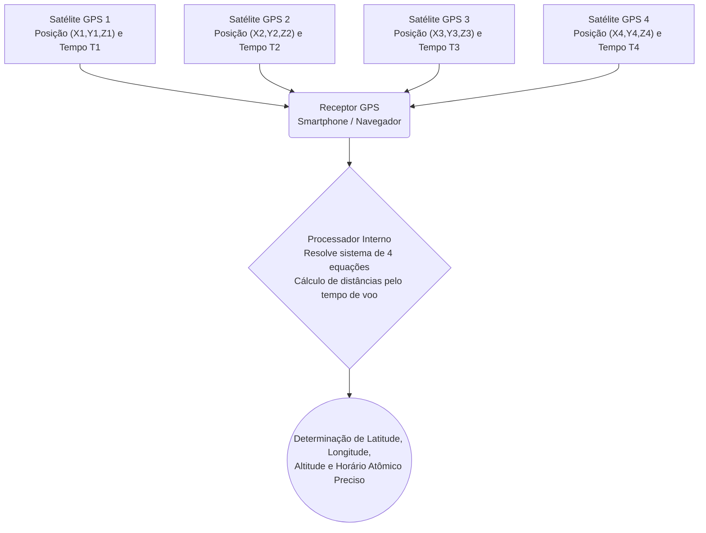

# Espaço e Tecnologia: Como Funciona o GPS - Relatividade e Posicionamento por Satélite

Sempre que consultamos um mapa em nosso smartphone, solicitamos um serviço de transporte por aplicativo ou utilizamos o GPS veicular, desfrutamos da precisão do **Sistema de Posicionamento Global (GPS)**. Da orientação de voos comerciais sobre os oceanos à sincronização em microssegundos de transações financeiras nas bolsas de valores, o GPS tornou-se uma infraestrutura essencial e invisível da civilização moderna.

No entanto, poucos sabem que essa tecnologia cotidiana depende diretamente da **teoria da relatividade** de Albert Einstein. Se as correções relativísticas fossem desconsideradas, o GPS acumularia um erro de posição de aproximadamente **11,4 quilômetros a cada dia**, inutilizando completamente o sistema em poucas horas.

Neste artigo, detalhamos os fundamentos geométricos da trilateração, os efeitos das relatividades restrita e geral sobre os relógios atômicos em órbita e as engenhosas técnicas que garantem uma precisão métrica em escala planetária.

## 1. Funcionamento Básico do GPS: Trilateração e Precisão Temporal

O GPS determina as coordenadas tridimensionais de um receptor na Terra captando ondas de rádio emitidas por uma constelação de satélites em órbita. O método matemático subjacente é a **trilateração**.

### 1.1. O Princípio Geométrico da Trilateração

Para identificar um ponto único no espaço tridimensional, o receptor precisa dos sinais de pelo menos **quatro satélites GPS**:

1. **Primeiro Satélite (Esfera de Incerteza)**: Multiplicando o tempo de viagem do sinal de rádio pela velocidade da luz, calcula-se a distância até o satélite. O usuário está localizado na superfície de uma esfera imaginária centrada nele.
2. **Segundo Satélite (Interseção Circular)**: Ao incluir o sinal de um segundo satélite, o cruzamento de duas esferas cria um círculo no espaço tridimensional.
3. **Terceiro Satélite (Dois Pontos Discretos)**: A esfera do terceiro satélite intercepta o círculo em exatamente **dois pontos**. Como um deles situa-se no espaço cósmico ou no manto subterrâneo, ele é descartado por impossibilidade física, determinando com exatidão latitude, longitude e altitude.
4. **Quarto Satélite (Correção do Relógio do Receptor)**: Embora três esferas resolvam espacialmente as coordenadas $(X, Y, Z)$, na prática depara-se com o **erro do relógio interno do receptor**. O oscilador de quartzo de um celular não possui a acurácia de nanossegundos de um relógio atômico. O quarto satélite fornece a quarta equação necessária para resolver simultaneamente as três coordenadas espaciais e a discrepância temporal $\Delta t$ do receptor.

```mermaid
flowchart TD
    S1["Satélite GPS 1\nPosição (X1,Y1,Z1) e Tempo T1"] --> R(Receptor GPS\nSmartphone / Navegador)
    S2["Satélite GPS 2\nPosição (X2,Y2,Z2) e Tempo T2"] --> R
    S3["Satélite GPS 3\nPosição (X3,Y3,Z3) e Tempo T3"] --> R
    S4["Satélite GPS 4\nPosição (X4,Y4,Z4) e Tempo T4"] --> R
    R --> C{"Processador Interno\nResolve sistema de 4 equações\nCálculo de distâncias pelo tempo de voo"}
    C --> P((Determinação de Latitude, Longitude,\nAltitude e Horário Atômico Preciso))
```

### 1.2. O Cálculo da Distância e o Multiplicador da Luz

A distância entre o satélite e o receptor é obtida pelo tempo de voo da onda eletromagnética:

$$ \text{Distância} = c \times \Delta t $$

Em que $c \approx 3 \times 10^8 \text{ m/s}$ representa a velocidade da luz no vácuo. Como a luz se propaga cerca de 300 metros em apenas um microssegundo ($10^{-6}\text{ s}$), uma imprecisão temporal de **um microssegundo resulta em um erro de 300 metros na posição**. Uma diferença de apenas um nanossegundo ($10^{-9}\text{ s}$) gera um deslocamento de 30 centímetros.

Por essa razão, os satélites GPS operam com **relógios atômicos de césio-133 e rubídio-87**, cuja margem de erro é inferior a um segundo a cada centenas de milhares de anos. Porém, mesmo com instrumentos perfeitos, surge uma condição física inexorável: **o tempo passa em ritmos diferentes no espaço e na superfície da Terra**.

## 2. A Relatividade de Einstein e a Marcha dos Relógios Orbitais

Formuladas em 1905 e 1915, a **Relatividade Restrita** e a **Relatividade Geral** de Albert Einstein demonstraram que o tempo não é uniforme em todo o cosmos, mas varia segundo a velocidade de deslocamento e o potencial gravitacional.

### 2.1. Relatividade Restrita: Velocidade Retarda o Tempo

A relatividade restrita estabelece que relógios em movimento rápido desaceleram em relação a observadores em repouso. Esse fenômeno de dilatação temporal cinemática é quantificado pelo fator de Lorentz:

$$ \Delta t' = \frac{\Delta t}{\sqrt{1 - \frac{v^2}{c^2}}} $$

Onde $v$ é a velocidade orbital e $c$ é a velocidade da luz.

Os satélites GPS orbitam a aproximadamente 20.200 km de altitude a uma velocidade de **$3,874\text{ km/s}$** (quase 14.000 km/h). Em razão desse deslocamento veloz, os relógios a bordo **atrasam cerca de 7 microssegundos por dia ($-7\ \mu\text{s/dia}$)** em relação aos relógios na superfície.

### 2.2. Relatividade Geral: Gravidade Fraca Acelera o Tempo

A relatividade geral define a gravidade como a curvatura do espaço-tempo provocada pela massa. Perto de corpos massivos, o tempo passa mais devagar; inversamente, **em regiões de campo gravitacional mais fraco, o tempo acelera**.

A 20.200 km de altitude, a gravidade terrestre é cerca de um quarto da verificada na superfície. Por estarem em um espaço-tempo menos curvado, os relógios atômicos dos satélites **adiantam cerca de 45 microssegundos por dia ($+45\ \mu\text{s/dia}$)** em comparação aos da Terra.

### 2.3. Efeito Cumulativo: Avanço Líquido de +38 Microssegundos por Dia

Somando simultaneamente os dois efeitos relativísticos:

- **Efeito da Relatividade Restrita (cinemático)**: $-7\ \mu\text{s/dia}$ (atraso)
- **Efeito da Relatividade Geral (gravitacional)**: $+45\ \mu\text{s/dia}$ (avanço)

$$ \text{Desvio Líquido} = +45\ \mu\text{s/dia} - 7\ \mu\text{s/dia} = +38\ \mu\text{s/dia} $$

O efeito gravitacional prevalece amplamente. Como resultado, os relógios a bordo dos satélites GPS **avançam 38 microssegundos a cada 24 horas**.

## 3. Por Que 38 Microssegundos Representam um Erro Catastrófico

Para a percepção humana diária, 38 microssegundos (0,000038 s) é um intervalo imperceptível. No entanto, multiplicado pela velocidade da luz ($300.000\text{ km/s}$), acarreta uma distorção monumental:

$$ \text{Erro Espacial Diário} = (3 \times 10^8\text{ m/s}) \times (38 \times 10^{-6}\text{ s}) = 11.400\text{ metros} = 11,4\text{ km/dia} $$

Se o sistema GPS ignorasse a relatividade:
- No primeiro dia, o erro acumulado atingiria **11,4 km**.
- No segundo dia, alcançaria **22,8 km**.
- No terceiro dia, superaria **34 km**.

Em pouquíssimo tempo, carros em trânsito seriam indicados no oceano e toda a navegação aérea se tornaria inviável.

## 4. Como a Engenharia do GPS Corrige os Desvios Relativísticos

Para neutralizar esse erro catastrófico, os projetistas do GPS criaram um método duplo combinando calibração mecânica pré-lançamento e correções de telemetria em tempo real.

### 4.1. Deslocamento de Frequência Pré-Lançamento

A medida mais engenhosa é adotada em solo antes de o satélite decolar.

A frequência de referência de um relógio atômico em terra é de **10,23 MHz**. Se colocado em órbita com esse valor, ele oscilaria mais rápido do que o padrão terrestre. Portanto, os engenheiros calibram deliberadamente os relógios para operarem ligeiramente mais lentos:

$$ f_{\text{satélite}} = 10,22999999543\text{ MHz} $$

Quando o satélite alcança a órbita de 20.200 km, o ganho relativístico de $+38\ \mu\text{s/dia}$ compensa perfeitamente essa defasagem intencional, fazendo com que o sinal seja percebido na Terra com exatos **10,23 MHz**.

### 4.2. Monitoramento Contínuo por Estações de Controle Terrestres

A compensação de frequência assume uma órbita circular padrão. No mundo real, ocorrem variações:
- **Excentricidade Orbital**: As órbitas possuem leve formato elíptico ($e \approx 0,01$), gerando oscilações periódicas de até 45 nanossegundos entre perigeu e apogeu.
- **Forma Real do Geoide Terrestre**: A distribuição de massa da Terra não é homogênea.
- **Radiação Solar e Atração Gravitacional da Lua**.

Por isso, a **Estação Principal de Controle (MCS)** e antenas terrestres distribuídas pelo planeta monitoram permanentemente os satélites. Elas calculam coeficientes de correção polinomial ($a_0, a_1, a_2$) e os transmitem via uplink. Os satélites retransmitem esses dados na **Mensagem de Navegação (Navigation Message)**, permitindo que os receptores corrijam continuamente qualquer desvio residual.

## 5. O GPS como Alicerce Invisível da Civilização Moderna

O alcance do GPS extrapola a simples navegação em smartphones:

- **Transporte e Condução Autônoma**: O controle de tráfego aéreo (ADS-B), a atracação de navios e veículos autônomos de nível 4/5 dependem de GPS diferencial (DGPS) e RTK para alcançar precisão centimétrica.
- **Telecomunicações e Finanças**: O trading de alta frequência (HFT) exige carimbos de tempo em microssegundos para cumprir regulações como MiFID II. Estações rádio-base de redes 5G sincronizam suas fases de emissão via pulsos de sincronismo (1PPS) gerados pelo GPS.
- **Agricultura de Precisão e Obras de Engenharia**: Tratores autônomos realizam plantio e pulverização com margem de 2 cm; tratores de esteira e escavadeiras executam nivelamentos automáticos baseados em projetos BIM 3D.
- **Sismologia e Meteorologia**: Redes de monitoramento captam deslocamentos milimétricos em placas tectônicas para estudos sísmicos e medem atrasos de sinal na troposfera para estimar vapor de água e prever temporais severos.

## 6. Conclusão: As Leis do Cosmo no Nosso Cotidiano

Ao olhar o ponto azul no mapa do seu smartphone, você contempla o ápice do conhecimento científico: a confluência da geometria de Euclides, das vibrações atômicas do césio e da genialidade de Einstein transformadas em tecnologia que conecta e move a humanidade.
