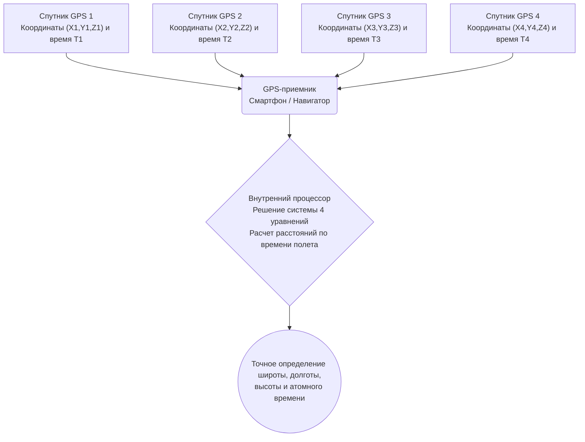

# Космос и технологии: как работает GPS - теория относительности и спутниковая навигация

Каждый раз, когда мы смотрим маршрут на экране смартфона, вызываем такси через приложение или ориентируемся по автомобильному навигатору, мы используем **Глобальную систему позиционирования (GPS)**. От прокладки курсов авиалайнеров над океанами и управления судами до микросекундной синхронизации биржевых транзакций на мировых финансовых рынках — GPS стала невидимой, но абсолютно необходимой опорой современного общества.

Однако далеко не все знают, что эта привычная повседневная технология напрямую зависит от **теории относительности Альберта Эйнштейна** — раздела теоретической физики, который на первый взгляд кажется предельно далеким от бытовой реальности. Если бы инженеры не учитывали релятивистские эффекты, навигационная ошибка GPS накапливалась бы со скоростью около **11,4 километра в сутки**, и уже через несколько часов система стала бы совершенно бесполезной.

В этой статье мы подробно рассмотрим геометрические принципы трилатерации, физику специальной и общей теории относительности применительно к спутникам и инженерные решения, устраняющие эти искажения.

## 1. Базовые принципы GPS: трилатерация и сверхточное время

GPS вычисляет трехмерные координаты приемника на Земле, улавливая радиосигналы, излучаемые спутниковой группировкой на околоземной орбите. В основе математического алгоритма лежит метод **трилатерации**.

### 1.1. Геометрический метод трилатерации

Чтобы однозначно определить положение объекта в трехмерном пространстве, приемник должен одновременно принимать сигналы как минимум от **четырех спутников GPS**:

1. **Первый спутник (сфера неопределенности)**: Умножив время прохождения радиосигнала на скорость света, приемник вычисляет расстояние до первого спутника. Это означает, что пользователь находится где-то на поверхности воображаемой сферы заданного радиуса с центром в спутнике.
2. **Второй спутник (пересечение в окружность)**: Добавление расстояния до второго спутника дает пересечение двух сфер, образующее окружность в трехмерном пространстве.
3. **Третий спутник (сужение до двух точек)**: Сфера третьего спутника пересекает эту окружность ровно в **двух дискретных точках**. Одна из них располагается либо глубоко в недрах Земли, либо высоко в космосе. Отбросив физически невозможный вариант, система однозначно определяет широту, долготу и высоту на поверхности планеты.
4. **Четвертый спутник (коррекция часов приемника)**: Теоретически трех сфер достаточно для нахождения координат $(X, Y, Z)$, но на практике возникает серьезное препятствие: **погрешность внутренних часов приемника**. Кварцевый генератор смартфона не может сравниться по точности с атомными часами на спутниках. Четвертый спутник дает четвертое уравнение, позволяющее одновременно вычислить пространственные координаты и устранить сдвиг времени приемника $\Delta t$.

### 1.2. Расчет расстояния: скорость света как гигантский множитель

Расстояние от спутника до приемника рассчитывается по времени распространения электромагнитной волны:

$$ \text{Расстояние} = c \times \Delta t $$

Где $c \approx 3 \times 10^8 \text{ м/с}$ — скорость света в вакууме. Свет проходит около 300 метров всего за одну микросекунду ($10^{-6}\text{ с}$). Следовательно, погрешность во времени всего в **одну микросекунду порождает ошибку в определении координат на 300 метров**. Сдвиг даже в одну наносекунду ($10^{-9}\text{ с}$) смещает позицию на 30 сантиметров.

По этой причине спутники GPS оснащены сверхточными **цезиевыми (Cs-133) и рубидиевыми (Rb-87) атомными часами**, накапливающими погрешность не более одной секунды за сотни тысяч лет. Однако, даже обладая идеальным хронометром, инженеры сталкиваются с фундаментальным законом Вселенной: **само течение времени на орбите отличается от земного**.

## 2. Теория относительности Эйнштейна: ускорение и замедление времени

Опубликованные в 1905 и 1915 годах **Специальная** и **Общая теория относительности** Альберта Эйнштейна разрушили представления Ньютона об абсолютном времени и пространстве. Время течет по-разному в зависимости от скорости движения наблюдателя и силы гравитационного поля.

### 2.1. Специальная теория относительности: движение замедляет время

Специальная теория относительности утверждает: часы, движущиеся относительно неподвижного наблюдателя, идут медленнее. Это релятивистское замедление времени описывается фактором Лоренца:

$$ \Delta t' = \frac{\Delta t}{\sqrt{1 - \frac{v^2}{c^2}}} $$

Где $v$ — орбитальная скорость спутника, а $c$ — скорость света.

Спутники GPS обращаются на высоте около 20 200 км со скоростью примерно **$3,874\text{ км/с}$** (около 14 000 км/ч), совершая оборот за 11 часов 58 минут. Из-за столь быстрого движения атомные часы спутника относительно наземных часов **отстают примерно на 7 микросекунд в сутки ($-7\ \mu\text{с/день}$)**.

### 2.2. Общая теория относительности: слабая гравитация ускоряет время

Общая теория относительности объясняет гравитацию как искривление четырехмерного пространства-времени под действием массы. Вблизи массивных тел время замедляется; напротив, **чем дальше от массы и чем слабее гравитационное поле, тем быстрее течет время**.

На высоте 20 200 км сила притяжения Земли составляет лишь около четверти от земной. Находясь в менее искривленном пространстве-времени, бортовые атомные часы GPS **спешат примерно на 45 микросекунд в сутки ($+45\ \mu\text{с/день}$)** по сравнению с наземными часами.

### 2.3. Суммарный релятивистский сдвиг: +38 микросекунд в сутки

Поскольку оба эффекта действуют одновременно, мы суммируем их величины:

- **Специальная теория относительности (скорость)**: $-7\ \mu\text{с/день}$ (отставание)
- **Общая теория относительности (гравитация)**: $+45\ \mu\text{с/день}$ (опережение)

$$ \text{Итоговый сдвиг} = +45\ \mu\text{с/день} - 7\ \mu\text{с/день} = +38\ \mu\text{с/день} $$

Гравитационный эффект значительно перевешивает кинематический. В результате часы на спутниках GPS **ежесуточно уходят вперед на 38 микросекунд**.

## 3. Почему 38 микросекунд — это фатальная катастрофа

Для человека 38 микросекунд (0,000038 с) — незаметное мгновение. Но при умножении на колоссальную скорость света ($300\ 000\text{ км/с}$) этот сдвиг оборачивается огромной позиционной погрешностью:

$$ \text{Суточный дрейф} = (3 \times 10^8\text{ м/с}) \times (38 \times 10^{-6}\text{ с}) = 11\ 400\text{ метров} = 11,4\text{ км/день} $$

Если бы релятивистские поправки не вносились:
- Уже через 24 часа ошибка составила бы **11,4 км**.
- На второй день — **22,8 км**.
- На третий день — свыше **34 км**.

Через считанные дни навигатор показывал бы автомобиль посреди океана, воздушные коридоры стали бы непригодны для полетов, а спутниковая навигация полностью лишилась бы практического смысла.

## 4. Инженерная компенсация релятивистских искажений в GPS

Для нейтрализации погрешности разработчики GPS реализовали двухступенчатую схему коррекции: предварительную расстройку генератора до старта и непрерывную передачу параметров с наземных станций.

### 4.1. Предстартовое смещение частоты генераторов

Самое изящное решение применяется еще на Земле до запуска ракеты.

Номинальная частота генератора наземных атомных часов составляет **10,23 МГц**. Если запустить часы с такой настройкой, на орбите они будут тикать слишком быстро. Поэтому инженеры намеренно занижают базовую частоту генератора спутника:

$$ f_{\text{спутник}} = 10,22999999543\text{ МГц} $$

Когда спутник выходит на рабочую орбиту в 20 200 км, релятивистское ускорение в $+38\ \mu\text{с/день}$ в точности компенсирует эту искусственную задержку. С точки зрения наземного приемника сигнал поступает на идеальной частоте **10,23 МГц**.

### 4.2. Наземный мониторинг и динамическая телеметрия

Предварительная расстройка рассчитана на идеальную круговую орбиту. В реальности действуют возмущающие факторы:
- **Эксцентриситет орбиты**: Орбита слегка эллиптична ($e \approx 0,01$), что вызывает периодические колебания времени величиной до 45 наносекунд.
- **Неоднородность геоида**: Земля не является идеальной сферой, гравитационный потенциал распределен неравномерно.
- **Давление солнечного ветра и притяжение Луны**.

Главная станция управления (MCS) и сеть станций слежения по всему миру непрерывно отслеживают спутники, вычисляют полиномиальные коэффициенты поправок ($a_0, a_1, a_2$) и передают их на спутники. Спутники транслируют эти данные в составе **Навигационного сообщения (Navigation Message)**, позволяя смартфонам пользователей в реальном времени устранять остаточные погрешности.

## 5. GPS как невидимый фундамент современной цивилизации

Возможности GPS простираются далеко за рамки прокладки маршрута на картах смартфонов:

- **Транспорт и беспилотные системы**: Системы автоматической посадки самолетов, морская логистика и автономный транспорт (Level 4/5) используют дифференциальный GPS (DGPS) и кинематику реального времени (RTK) для достижения сантиметровой точности.
- **Финансы и телекоммуникации**: Высокочастотная торговля (HFT) требует меток времени с микросекундной точностью по стандартам MiFID II. Сотовые вышки 4G/5G синхронизируют фазы радиопередатчиков с помощью меток 1PPS от GPS.
- **Точное земледелие и строительство**: Беспилотные тракторы распахивают и удобряют поля с отклонением не более 2 см; дорожная и строительная техника автоматически формирует рельеф по 3D-моделям.
- **Геофизика и прогнозирование стихийных бедствий**: Сети GPS регистрируют миллиметровые смещения тектонических плит для изучения землетрясений, а также анализируют задержку радиосигналов в тропосфере для оценки влажности воздуха и прогнозирования экстремальных ливней.

## 6. Заключение: космические законы в нашей ладони

Глядя на синюю точку на экране смартфона, мы соприкасаемся с триумфом фундаментальной науки: в ней соединились эвклидова геометрия, квантовые колебания атомов цезия и открытая Эйнштейном кривизна пространства-времени.
