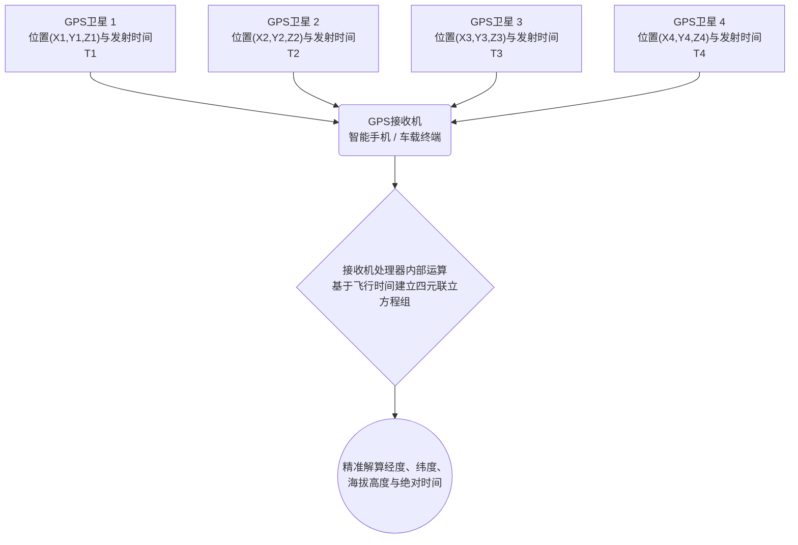

# 宇宙与技术：GPS工作原理 - 相对论与卫星定位系统

每当我们打开智能手机的地图应用、呼叫网约车或使用车载导航系统时，我们都在享受 **全球定位系统（GPS，Global Positioning System）** 带来的便利。从指引跨洋航班与远洋货轮的安全航行，到金融市场毫秒级别的高频交易时间戳同步，GPS已经悄然成为现代文明不可或缺的隐形基础设施。

然而，鲜为人知的是，这个日常工具的精确运行，在物理学底层完全依托于阿尔伯特·爱因斯坦的 **相对论** 。如果忽略相对论效应，GPS系统每天将产生大约 **11.4公里（约7英里）** 的巨大定位误差，不出数小时整个系统就将陷入瘫痪。

本文将从GPS定位的几何学基本原理（三边测量法）出发，深入探讨狭义相对论与广义相对论如何影响卫星上的原子钟，以及工程师们如何巧妙化解物理法则带来的误差挑战。

## 1. GPS的基本运作机制：三边测量法与极致精准的“时间”

GPS通过地表接收机（如智能手机或导航仪）捕捉环绕地球运行的多颗人造卫星发射的无线电信号，来解算接收机所在的三维空间坐标。其核心几何数学原理被称为 **三边测量法（Trilateration）** 。

### 1.1. 三边测量法（Trilateration）的几何学原理

要在三维空间中精确定位一个点，接收机至少需要接收来自 **4颗GPS卫星** 的信号：

1. **第1颗卫星（测距球面）** ：通过计算无线电波从卫星传播至接收机所需的时间，乘以光速，即可获得接收机与该卫星之间的距离 $R_1$。这表明接收机处于以该卫星为中心、半径为 $R_1$ 的球面上。
2. **第2颗卫星（相交圆环）** ：引入第2颗卫星后，两个相交的球面在空间中交汇成一个圆环，当前位置被限定在圆环上的任意一点。
3. **第3颗卫星（收敛至两点）** ：第3颗卫星的球面与该圆环相交，将候选位置进一步缩减至空间中的 **2个离散点** 。通常其中一点位于远离地表的外太空或地球深处，在物理上被自然排除，从而唯一确定地表的三维坐标（纬度、经度与海拔高度）。
4. **第4颗卫星（消除时钟偏差）** ：理论上3颗卫星即可确定空间坐标 $(X, Y, Z)$，但实际工程中面临一个严峻挑战： **接收机内部时钟的不精确性** 。手机中的石英晶振无法达到卫星原子钟纳秒级别的精度。第4颗卫星提供了第4个联立方程，用于同时解算空间三维坐标与接收机自身的时钟误差 $\Delta t$。

### 1.2. 距离计算：光速作为巨大的放大因子

卫星到接收机的距离通过电磁波的飞行时间（Time of Flight）计算：

$$ \text{距离} = c \times \Delta t $$

其中 $c \approx 3 \times 10^8 \text{ m/s}$ 为真空中的光速。由于光速极快，电磁波在1微秒（$10^{-6}$ 秒）内即可行进约300米。这意味着，若时间测定发生 **仅仅1微秒的偏差，距离计算就会产生300米的巨幅误差** ；哪怕1纳秒（$10^{-9}$ 秒）的误差也会导致30厘米的偏移。

因此，GPS卫星上搭载了精度极高的 **铯-133原子钟** 与 **铷-87原子钟** ，其频率稳定性高达数十万年仅误差1秒。然而，哪怕原子钟本身再完美，当它们置身于两万公里高空的轨道环境中时，也不得不面对物理学的终极法则： **时间的流逝速度本身改变了** 。

## 2. 爱因斯坦相对论：卫星时钟的快与慢

在1905年与1915年相继发表的 **狭义相对论** 与 **广义相对论** 中，爱因斯坦彻底打破了牛顿力学关于“绝对时间与绝对空间”的传统构想。相对论指出，时间在宇宙中并非均匀流淌，而是取决于参考系的运动速度以及所处的引力场强弱。

### 2.1. 狭义相对论：高速运动导致时间膨胀（变慢）

狭义相对论的核心推论之一是：相对静止观测者而言，高速运动的钟表走得更慢。这一运动学时间膨胀（Time Dilation）效应由洛伦兹因子表达：

$$ \Delta t' = \frac{\Delta t}{\sqrt{1 - \frac{v^2}{c^2}}} $$

其中 $v$ 为物体的运动速度，$c$ 为光速。

GPS卫星运行在距离地面约20,200公里的中地球轨道（MEO），公转周期约为11小时58分，其轨道飞行速度高达 **约3.874公里/秒** （时速近14,000公里）。相较于地面静止的钟表，这种高速运动使得GPS卫星上的原子钟 **每天变慢约7微秒（$-7\ \mu\text{s/天}$）** 。

### 2.2. 广义相对论：引力较弱导致时间变快

广义相对论则揭示了引力的本质——引力是质量引起时空弯曲的表现。在大质量天体附近，时空曲率大，引力势深，时间流逝变慢；相反， **距离质量中心越远、引力场越弱的地方，时间流逝越快** 。

地球表面的引力场极强，而位于20,200公里高空的GPS卫星所受到的地球重力加速度仅为地表的约四分之一。处于更平坦的时空中，卫星原子钟受到的引力时滞明显减小。因此，相对于地面时钟，卫星原子钟 **每天会变快约45微秒（$+45\ \mu\text{s/天}$）** 。

### 2.3. 两种相对论效应的净叠加结果

由于GPS卫星同时处于高速运动与弱引力场环境中，必须将狭义与广义相对论效应进行线性叠加：

- **狭义相对论效应（速度变慢）** ：$-7\ \mu\text{s/天}$
- **广义相对论效应（引力变快）** ：$+45\ \mu\text{s/天}$

$$ \text{净效应} = +45\ \mu\text{s/天} - 7\ \mu\text{s/天} = +38\ \mu\text{s/天} $$

结论非常明确：广义相对论的引力频移效应占据了压倒性主导地位。GPS卫星上的原子钟相较于地面时钟， **每天将持续快走38微秒** 。

## 3. 为什么38微秒会造成“毁灭性误差”？

对于日常生活而言，“38微秒（0.000038秒）”微不足道、无法感知。但在依赖光速测量距离的GPS架构中，这一微小时间差将引发灾难性的定位漂移：

$$ \text{每日累积误差} = (3 \times 10^8\text{ m/s}) \times (38 \times 10^{-6}\text{ s}) = 11,400\text{ 米} = 11.4\text{ 公里} $$

若不作相对论修正：
- 运行仅第1天，定位偏移将达到 **11.4公里** ；
- 第2天累积至 **22.8公里** ；
- 第3天累积至 **34.2公里** 。

在数天之内，地图上的汽车图标就会漂移到海中或邻近城市，飞机导航系统将彻底失效，整个定位网络将在实际应用中沦为废铁。

## 4. GPS系统如何化解相对论偏差

为了彻底解决这一物理学矛盾，GPS工程团队在卫星硬件设计与地面站控制算法两个层面实施了精密的综合补偿。

### 4.1. 发射前的人为频率偏移预设

最核心的补偿措施在卫星发射上天之前就已完成。

地面标准原子钟的基准震荡频率为 **10.23 MHz** 。若直接以该频率将原子钟送入太空，其在轨道上接收到的频率就会偏高。因此，工程师在地面制造时，故意将卫星原子钟的主振荡器频率下调至：

$$ f_{\text{satellite}} = 10.22999999543\text{ MHz} $$

当卫星升至两万公里高空、经历引力与速度的相对论双重影响后，频率恰好上升至标准值。地面的手机和接收设备接收到的频率恰恰是精确的 **10.23 MHz** 。

### 4.2. 地面测控站的持续跟踪与动态校正

预调频率解决了理想圆轨道下的恒定偏差，但在实际飞行中依然存在摄动：
- **轨道偏心率（Eccentricity）** ：GPS轨道并非完全圆形（偏心率约0.01）。卫星在近地点速度快、引力强，在远地点速度慢、引力弱，会引发幅度达45纳秒的周期性周期振荡。
- **地球形状非对称性** ：地球为椭球体且质量分布不均（大地水准面起伏）。
- **日月引力与太阳光压** ：外部天文引力与辐射压力会引起轨道微漂移。

为此，全球多个地面主控站（Master Control Station）对所有卫星进行24小时全天候雷达监控，实时计算轨道星历与钟差多项式参数（$a_0, a_1, a_2$），通过上行链路注入卫星。卫星在下发的 **导航电文（Navigation Message）** 中广播这些微调数据，使地面接收机能够在解算公式中实时剔除残余误差，确保米级甚至厘米级的长久稳定精度。

## 5. GPS支撑的现代社会关键基础设施

如今，GPS的价值早已超越了手机导航软件本身，构成了现代工业文明不可见的核心基石：

- **交通运输与智慧物流** ：民用航空自动驾驶系统（ADS-B）、远洋集装箱货轮航路优化、以及L4/L5级自动驾驶汽车，均高度依赖差分GPS（DGPS）和实时动态载波相位差分技术（RTK）实现厘米级高精定位。
- **金融高频交易与通信核心** ：全球证券交易所与跨境外汇市场要求每一笔撮合交易都具备符合MiFID II监管标准的微秒级时间戳。4G/5G移动通信基站也利用GPS秒脉冲（1PPS）信号进行精准的无线电相位同步。
- **精准农业与自动化工程** ：安装RTK定位系统的自动驾驶拖拉机能以2厘米级精度进行犁地与施肥；工程机械（挖掘机、推土机）在BIM数字化工地中实现无人化自动高程控制。
- **防灾减灾与地球动力学研究** ：地质科学家利用GPS阵列长期监测地壳构造板块板块微小滑动，为地震与火山监测提供关键形变数据；气象学家通过GPS信号穿过对流层的延迟量反演大气水汽含量，大幅提高了特大暴雨预报的准确率。

## 6. 结语：日常背后的宇宙物理法则

当我们从口袋中掏出手机、看着屏幕上跳动的蓝色圆点精准指引前行路线时，在两万公里的高空之上，爱因斯坦在百余年前于草稿纸上推演的相对论方程正在无声运转。

GPS堪称人类科学史上最壮丽的工程壮举之一：它将曾经被视为空想的纯理论物理学，转化为推动全球数十万亿美元经济运转的日常工具。小小的屏幕光点，正是人类理性智慧与宇宙深邃法则交汇的完美结晶。
