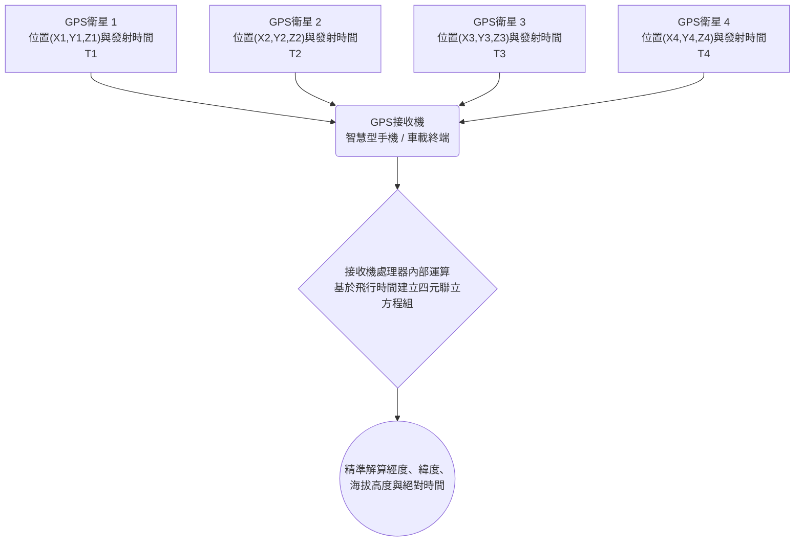

# 宇宙與技術：GPS運作原理 - 相對論與衛星定位系統

每當我們打開智慧型手機的地圖應用程式、叫車或使用車載導航系統時，我們都在享受 **全球定位系統（GPS，Global Positioning System）** 帶來的便利。從指引跨洋航班與遠洋貨輪的安全航行，到金融市場毫秒級別的高頻交易時間戳記同步，GPS已經悄然成為現代文明不可或缺的隱形基礎設施。

然而，鮮為人知的是，這個日常工具的精確運作，在物理學底層完全依託於阿爾伯特·愛因斯坦的 **相對論** 。如果忽略相對論效應，GPS系統每天將產生大約 **11.4公里（約7英里）** 的巨大定位誤差，不出數小時整個系統就將陷入癱瘓。

本文將從GPS定位的幾何學基本原理（三邊測量法）出發，深入探討狹義相對論與廣義相對論如何影響衛星上的原子鐘，以及工程師們如何巧妙化解物理法則帶來的誤差挑戰。

## 1. GPS的基本運作機制：三邊測量法與極致精準的「時間」

GPS透過地表接收機（如智慧型手機或導航儀）捕捉環繞地球運行的多顆人造衛星發射的無線電訊號，來解算接收機所在的三維空間座標。其核心幾何數學原理被稱為 **三邊測量法（Trilateration）** 。

### 1.1. 三邊測量法（Trilateration）的幾何學原理

要在三維空間中精確定位一個點，接收機至少需要接收來自 **4顆GPS衛星** 的訊號：

1. **第1顆衛星（測距球面）** ：透過計算無線電波從衛星傳播至接收機所需的時間，乘以光速，即可獲得接收機與該衛星之間的距離 $R_1$。這表明接收機處於以該衛星為中心、半徑為 $R_1$ 的球面上。
2. **第2顆衛星（相交圓環）** ：引入第2顆衛星後，兩個相交的球面在空間中交會成一個圓環，當前位置被限定在圓環上的任意一點。
3. **第3顆衛星（收斂至兩點）** ：第3顆衛星的球面與該圓環相交，將候選位置進一步縮減至空間中的 **2個離散點** 。通常其中一點位於遠離地表的外太空或地球深處，在物理上被自然排除，從而唯一確定地表的三維座標（緯度、經度與海拔高度）。
4. **第4顆衛星（消除時鐘偏差）** ：理論上3顆衛星即可確定空間座標 $(X, Y, Z)$，但實際工程中面臨一個嚴峻挑戰： **接收機內部時鐘的不精確性** 。手機中的石英晶振無法達到衛星原子鐘奈秒級別的精度。第4顆衛星提供了第4個聯立方程式，用於同時解算空間三維座標與接收機自身的時鐘誤差 $\Delta t$。

### 1.2. 距離計算：光速作為巨大的放大因子

衛星到接收機的距離透過電磁波的飛行時間（Time of Flight）計算：

$$ \text{距離} = c \times \Delta t $$

其中 $c \approx 3 \times 10^8 \text{ m/s}$ 為真空中的光速。由於光速極快，電磁波在1微秒（$10^{-6}$ 秒）內即可行進約300公尺。這意味著，若時間測定發生 **僅僅1微秒的偏差，距離計算就會產生300公尺的巨幅誤差** ；哪怕1奈秒（$10^{-9}$ 秒）的誤差也會導致30公分的偏移。

因此，GPS衛星上搭載了精度極高的 **銫-133原子鐘** 與 **銣-87原子鐘** ，其頻率穩定性高達數十萬年僅誤差1秒。然而，哪怕原子鐘本身再完美，當它們置身於兩萬公里高空的軌道環境中時，也不得不面對物理學的終極法則： **時間的流逝速度本身改變了** 。

## 2. 愛因斯坦相對論：衛星時鐘的快與慢

在1905年與1915年相繼發表的 **狹義相對論** 與 **廣義相對論** 中，愛因斯坦徹底打破了牛頓力學關於「絕對時間與絕對空間」的傳統構想。相對論指出，時間在宇宙中並非均勻流淌，而是取決於參考系的運動速度以及所處的重力場強弱。

### 2.1. 狹義相對論：高速運動導致時間膨脹（變慢）

狹義相對論的核心推論之一是：相對靜止觀測者而言，高速運動的鐘錶走得更慢。這一運動學時間膨脹（Time Dilation）效應由勞侖茲因子表達：

$$ \Delta t' = \frac{\Delta t}{\sqrt{1 - \frac{v^2}{c^2}}} $$

其中 $v$ 為物體的運動速度，$c$ 為光速。

GPS衛星運行在距離地面約20,200公里的中地球軌道（MEO），公轉週期約為11小時58分，其軌道飛行速度高達 **約3.874公里/秒** （時速近14,000公里）。相較於地面靜止的鐘錶，這種高速運動使得GPS衛星上的原子鐘 **每天變慢約7微秒（$-7\ \mu\text{s/天}$）** 。

### 2.2. 廣義相對論：重力較弱導致時間變快

廣義相對論則揭示了重力的本質——重力是質量引起時空彎曲的表現。在大質量天體附近，時空曲率大，重力位能深，時間流逝變慢；相反， **距離質量中心越遠、重力場越弱的地方，時間流逝越快** 。

地球表面的重力場極強，而位於20,200公里高空的GPS衛星所受到的地球重力加速度僅為地表的約四分之一。處於更平坦的時空中，衛星原子鐘受到的重力時滯明顯減小。因此，相對於地面時鐘，衛星原子鐘 **每天會變快約45微秒（$+45\ \mu\text{s/天}$）** 。

### 2.3. 兩種相對論效應的淨疊加結果

由於GPS衛星同時處於高速運動與弱重力場環境中，必須將狹義與廣義相對論效應進行線性疊加：

- **狹義相對論效應（速度變慢）** ：$-7\ \mu\text{s/天}$
- **廣義相對論效應（重力變快）** ：$+45\ \mu\text{s/天}$

$$ \text{淨效應} = +45\ \mu\text{s/天} - 7\ \mu\text{s/天} = +38\ \mu\text{s/天} $$

結論非常明確：廣義相對論的重力頻移效應佔據了壓倒性主導地位。GPS衛星上的原子鐘相較於地面時鐘， **每天將持續快走38微秒** 。

## 3. 為什麼38微秒會造成「毀滅性誤差」？

對於日常生活而言，「38微秒（0.000038秒）」微不足道、無法感知。但在依賴光速測量距離的GPS架構中，這一微小時間差將引發災難性的定位漂移：

$$ \text{每日累積誤差} = (3 \times 10^8\text{ m/s}) \times (38 \times 10^{-6}\text{ s}) = 11,400\text{ 公尺} = 11.4\text{ 公里} $$

若不作相對論修正：
- 運行僅第1天，定位偏移將達到 **11.4公里** ；
- 第2天累積至 **22.8公里** ；
- 第3天累積至 **34.2公里** 。

在數天之內，地圖上的汽車圖示就會漂移到海中或鄰近城市，飛機導航系統將徹底失效，整個定位網路將在實際應用中淪為廢鐵。

## 4. GPS系統如何化解相對論偏差

為了徹底解決這一物理學矛盾，GPS工程團隊在衛星硬體設計與地面站控制演算法兩個層面實施了精密的綜合補償。

### 4.1. 發射前的人為頻率偏移預設

最核心的補償措施在衛星發射上天之前就已完成。

地面標準原子鐘的基準震盪頻率為 **10.23 MHz** 。若直接以該頻率將原子鐘送入太空，其在軌道上接收到的頻率就會偏高。因此，工程師在地面製造時，故意將衛星原子鐘的主振盪器頻率下調至：

$$ f_{\text{satellite}} = 10.22999999543\text{ MHz} $$

當衛星升至兩萬公里高空、經歷重力與速度的相對論雙重影響後，頻率恰好上升至標準值。地面的手機和接收設備接收到的頻率恰恰是精確的 **10.23 MHz** 。

### 4.2. 地面測控站的持續跟蹤與動態校正

預調頻率解決了理想圓軌道下的恆定偏差，但在實際飛行中依然存在攝動：
- **軌道偏心率（Eccentricity）** ：GPS軌道並非完全圓形（偏心率約0.01）。衛星在近地點速度快、重力強，在遠地點速度慢、重力弱，會引發幅度達45奈秒的週期性週期振盪。
- **地球形狀非對稱性** ：地球為橢球體且質量分佈不均（大地水準面起伏）。
- **日月引力與太陽光壓** ：外部天文引力與輻射壓力會引起軌道微漂移。

為此，全球多個地面主控站（Master Control Station）對所有衛星進行24小時全天候雷達監控，即時計算軌道星曆與鐘差多項式參數（$a_0, a_1, a_2$），透過上行鏈路注入衛星。衛星在下發的 **導航電文（Navigation Message）** 中廣播這些微調數據，使地面接收機能夠在解算公式中即時剔除殘餘誤差，確保米級甚至公分級的長久穩定精度。

## 5. GPS支撐的現代社會關鍵基礎設施

如今，GPS的價值早已超越了手機導航軟體本身，構成了現代工業文明不可見的核心基石：

- **交通運輸與智慧物流** ：民用航空自動駕駛系統（ADS-B）、遠洋貨櫃貨輪航路最佳化、以及L4/L5級自動駕駛汽車，均高度依賴差分GPS（DGPS）和即時動態載波相位差分技術（RTK）實現公分級高精定位。
- **金融高頻交易與通訊核心** ：全球證券交易所與跨境外匯市場要求每一筆撮合交易都具備符合MiFID II監管標準的微秒級時間戳記。4G/5G行動通訊基地台也利用GPS秒脈衝（1PPS）訊號進行精準的無線電相位同步。
- **精準農業與自動化工程** ：安裝RTK定位系統的自動駕駛曳引機可以2公分級精度進行耕地與施肥；工程機械（挖土機、推土機）在BIM數位化工地中實現無人化自動高程控制。
- **防災減災與地球動力學研究** ：地質科學家利用GPS陣列長期監測地殼板塊微小滑動，為地震與火山監測提供關鍵形變數據；氣象學家透過GPS訊號穿過對流層的延遲量反演大氣水汽含量，大幅提高了特大暴雨預報的準確度。

## 6. 結語：日常背後的宇宙物理法則

當我們從口袋中掏出手機、看著螢幕上跳動的藍色圓點精準指引前行路線時，在兩萬公里的高空之上，愛因斯坦在百餘年前於草稿紙上推演的相對論方程式正在無聲運轉。

GPS堪稱人類科學史上最壯麗的工程壯舉之一：它將曾經被視為空想的純理論物理學，轉化為推動全球數十兆美元經濟運轉的日常工具。小小的螢幕光點，正是人類理性智慧與宇宙深邃法則交會的完美結晶。
