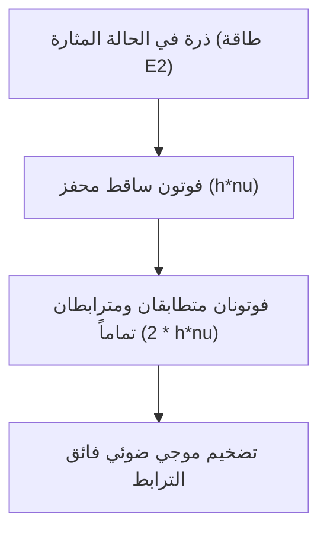

# الفيزياء: مبادئ عمل الليزر - الانبعاث المستحث وانقلاب التعداد وتضخيم الضوء

في عصر التكنولوجيا الفائقة المعاصر، يُمثّل الليزر إحدى الركائز التقنية الأساسية التي لا غنى عنها. من شبكات الألياف الضوئية التي تنقل حركة الإنترنت العالمية وقارئات الرموز الشريطية (الباركود)، إلى جراحات تصحيح النظر الدقيقة وقص المعادن بالغة الصلابة ومستشعرات الليدار (LiDAR) للسيارات ذاتية القيادة، بات الليزر عصب الصناعات المتقدمة.

ورغم حضوره الطاغي، يجهل الكثيرون المعنى العلمي الحقيقي لكلمة **ليزر (LASER)** والآليات الكمية الدقيقة التي تفسر كيفية انبعاثه. إن LASER هي اختصار لعبارة: **"Light Amplification by Stimulated Emission of Radiation"** (تضخيم الضوء بالانبعاث المستحث للإشعاع).

يقدم هذا المقال دراسة فيزيائية شاملة لأسس عمل الليزر، بالتركيز على أركانه الثلاثة الأساسية: **الانبعاث المستحث (Stimulated Emission)**، و**انقلاب التعداد (Population Inversion)**، و**المرنان البصري (Optical Resonator)**.

## 1. تفاعل الضوء مع الذرة: عمليات أينشتاين الإشعاعية الثلاث

لفهم آلية الليزر، ينبغي دراسة كيفية تفاعل الفوتونات مع الإلكترونات الذرية. في عام 1917، أرسى ألبرت أينشتاين دعائم هذا العلم حين أثبت أن تفاعل الضوء مع المادة يخضع لثلاث عمليات كمية جوهرية:

### الامتصاص (Absorption)
عندما تكون الذرة في مستوى طاقة منخفض (الحالة القاعية: $E_1$)، فإن اصطدام فوتون يحمل طاقة مطابقة لفرق المستويين $h\nu = E_2 - E_1$ ($h$ ثابت بلانك و $\nu$ تردد الضوء) يؤدي إلى امتصاص الذرة لطاقة الفوتون وانتقالها إلى مستوى طاقة أعلى (الحالة المثارة: $E_2$).

### الانبعاث التلقائي (Spontaneous Emission)
تكون الذرة في الحالة المثارة ($E_2$) غير مستقرة، فتسقط تلقائياً بعد فترة زمنية محددة نحو المستوى الأدنى ($E_1$)، مطلقة فوتوناً يحمل طاقة $E_2 - E_1$. تنبعث هذه الفوتونات باتجاهات وأطوار واستقطابات عشوائية تماماً، وهو الضوء غير المترابط المنبعث من المصابيح العادية والشمس.

### الانبعاث المستحث (Stimulated Emission)
هذه هي الآلية السحرية التي يعتمد عليها الليزر. إذا كانت الذرة موجودة بالفعل في الحالة المثارة $E_2$، ومر بالقرب منها فوتون خارجي يحمل طاقة مطابقة تماماً لـ $E_2 - E_1$، فإن المجال الكهرومغناطيسي لهذا الفوتون يحث الذرة على السقوط فوراً إلى الحالة القاعية مطلقة فوتوناً ثانياً.

الميزة الفائقة هنا هي أن الفوتون الجديد يكون **نسخة كمية متطابقة تماماً (Clone)** مع الفوتون المحفز: يمتلك **نفس الطول الموجي، ونفس الطور (Phase)، ونفس اتجاه الانتشار، ونفس الاستقطاب**. وهكذا، يدخل فوتون واحد ويخرج فوتونان مترابطان كلياً، مما يؤدي إلى تضخيم ضوئي نقي.

## 2. انقلاب التعداد (Population Inversion): الشرط الحتمي للتضخيم

إذا كان الانبعاث المستحث يضاعف الفوتونات، فلماذا لا تشع المواد المحيطة بنا أشعة الليزر تلقائياً؟

في ظروف التوازن الحراري الطبيعي، يخضع توزيع الذرات على مستويات الطاقة لـ **توزيع بولتزمان**. ويكون عدد الذرات في المستوى القاعي ($N_1$) أكبر بكثير من عدد الذرات في المستوى المثار ($N_2$)، أي $N_1 \gg N_2$.
وعندما يسقط الضوء على مادة كهذه، تكون احتمالية الامتصاص أعلى بكثير من احتمالية الانبعاث المستحث، فيتلاشى الضوء تدريجياً.

لكي يتحقق التضخيم وتوليد الليزر، يجب كسر هذا التوازن وصنع حالة غير متوازنة يكون فيها **عدد الذرات في المستوى المثار أعلى من عدد الذرات في المستوى القاعي ($N_2 > N_1$)**. تُعرف هذه الحالة بـ **انقلاب التعداد (Population Inversion)**.

### آليات الضخ (Pumping)
يتطلب الحفاظ على انقلاب التعداد حقن طاقة خارجية مستمرة لنقل الذرات قسراً إلى المستويات العليا. وتسمى هذه العملية **الضخ**:
- **الضخ البصري**: استخدام مصابيح وميض قوية أو دايودات ليزرية (كما في ليزر الياقوت و Nd:YAG).
- **الضخ الكهربائي**: تفريغ كهربائي عالي الجهد في الغازات (مثل ليزر الهيليوم-نيون أو ثاني أكسيد الكربون) أو حقن التيار في الوصلات شبه الموصلة.
- **الضخ الكيميائي**: استغلال الطاقة الناتجة عن التفاعلات الكيميائية الطاردة للحرارة.

### أنظمة الليزر ثلاثية ورباعية المستويات
لتحقيق انقلاب التعداد بكفاءة، تعتمد أوساط الليزر على تصاميم طاقية محددة:

* **النظام ثلاثي المستويات (مثل ليزر الياقوت)**:
  تُضخ الذرات من $E_1$ إلى $E_3$، ثم تهبط سريعاً دون إشعاع إلى المستوى شبه المستقر $E_2$. يحدث انبعاث الليزر بين $E_2$ والحالة القاعية $E_1$. وبما أن المستوى السفلي هو الحالة القاعية المليئة بالذرات أصلاً، يجب إثارة أكثر من 50% من جميع ذرات الوسط لبلوغ عتبة التضخيم، مما يتطلب طاقة ضخ هائلة.

* **النظام رباعي المستويات (مثل Nd:YAG و He-Ne)**:
  تُضخ الذرات من $E_0$ إلى $E_3$، وتهبط إلى $E_2$، ومنه يحدث انبعاث الليزر إلى المستوى $E_1$، ثم تتفرغ الذرات فوراً إلى $E_0$. وبما أن المستوى $E_1$ يقع فوق الحالة القاعية، فإنه يكون شبه فارغ في درجة حرارة الغرفة ($N_1 \approx 0$). لذا يكفي ضخ طفيف لتحقيق الشرط $N_2 > N_1$ بكفاءة متفوقة بمراحل.

## 3. المرنان البصري (Optical Resonator): التغذية الراجعة والتذبذب

يجعل انقلاب التعداد من المادة وسطاً مضخماً، لكن مرور الضوء مرة واحدة ينتج تضخيماً ضئيلاً. لتحويل المضخم إلى مذبذب مستمر يطلق شعاعاً عالي القوة، يلزم استخدام حلقة تغذية راجعة موجبة تُدعى **المرنان البصري (Optical Resonator)**.

يتكون المرنان من مرآتين متوازيتين عند نهايتي الوسط الفعال:
1. **مرآة عاكسة تماماً (High Reflector)**: تعكس ما يقارب 100% من الضوء.
2. **مرآة شبه منفذة (Output Coupler)**: تعكس معظم الضوء (95% إلى 99%) إلى داخل المرنان وتسمح بنفاذ نسبة ضئيلة (1% إلى 5%) لتشكل شعاع الليزر الخارج.

### دورة التذبذب
1. مع بدء الضخ، تنطلق أولى الفوتونات بالانبعاث التلقائي.
2. الفوتونات المتحركة بدقة على طول المحور البصري تفجر شلالات من الانبعاث المستحث.
3. ترتد الموجة عن المرايا لتخترق الوسط الفعال مئات المرات ذهاباً وإياباً.
4. مع كل جولة، تتضاعف الفوتونات المتفقة في الطور والتردد بشكل أسي.
5. يخرج جزء من الضوء المستقر عبر المرآة شبه المنفذة كـ **شعاع ليزر** فائق النقاء والقوة.

### عتبة الليزر ومعادلات المعدل (Rate Equations)

لا يبدأ انبعاث الليزر إلا عندما يتجاوز الكسب الضوئي في الدورة الواحدة إجمالي الخسائر في التجويف (النفاذ، الامتصاص، التشتت). وتسمى هذه النقطة الحرجة **عتبة الليزر (Laser Threshold)**.

تُحدد ديناميكيات التعداد وكثافة الفوتونات بواسطة **معادلات المعدل**:

$$ \frac{dN_2}{dt} = R_p - \frac{N_2}{\tau} - B \rho(\nu) (N_2 - N_1) $$

حيث تمثل $N_2, N_1$ كثافة الذرات في المستويين، و $R_p$ معدل الضخ، و $\tau$ عمر الانبعاث التلقائي، و $B$ معامل أينشتاين، و $\rho(\nu)$ كثافة طاقة الإشعاع في المرنان.

## 4. الخصائص الفيزيائية الاستثنائية لشعاع الليزر

بفضل الانبعاث المستحث واصطفاء الأنماط في المرنان البصري، يتميز ضوء الليزر بأربع خصائص فريدة:

1. **أحادية اللون (Monochromaticity)**:
   يحدث الانتقال بين مستويات كمية محددة بدقة بالغة، مما يجعل عرض النطاق الطيفي ($\Delta\lambda$) ضيقاً للغاية، مقدماً نقاءً لونياً مثالياً للتحليل الطيفي الدقيق.
2. **الاتجاهية الفائقة (Directivity)**:
   لا تتضخم سوى الحزم المتوازية مع المحور. لذا فإن انفراج الشعاع يكاد يقترب من الصفر؛ فالشعاع المرسل إلى القمر يقطع 400 ألف كم ليتسع قطره بضعة كيلومترات فقط.
3. **الترابط المكاني والزماني (Coherence)**:
   تهتز جميع الفوتونات بنفس الطور بدقة. يتيح **الترابط المكاني** تسجيل الصور المجسمة ثلاثية الأبعاد (الهولوغرام)، بينما يحافظ **الترابط الزماني** على ثبات الطور لمسافات شاسعة، مما يتيح رصد موجات الجاذبية في مرصد LIGO.
4. **السطوع الفائق والكثافة الطاقية (High Intensity)**:
   يتيح الترابط تركيز الحزمة بعدسات إلى نقطة ميكرومترية ($\sim 1\ \mu\text{m}$)، مولداً كثافة طاقة بمليارات الواطات لكل سنتيمتر مربع، كافية لصهر التيتانيوم أو إشعال الاندماج النووي.

## 5. آفاق وتطبيقات تقنيات الليزر الحديثة

حققت فيزياء المواد قفزات نوعية في تصنيع الليزر:

- **ليزر أشباه الموصلات (Laser Diode)**: مدمج للغاية وبكفاءة تتجاوز 50%، وهو المحرك لشبكات الاتصالات الضوئية والأجهزة الإلكترونية.
- **ليزر الألياف (Fiber Laser)**: يستخدم ألياف السيليكا المطعمة بالعناصر الأرضية النادرة كوسط فعال، ويعد المعيار المهيمن في اللحام والقطع بالصناعات الثقيلة.
- **ليزر النبضات فائقة القصر (فيزياء الفيمتوثانية والآتوثانية)**:
  بتقنية قفل النمط (Mode-locking)، تُضغط الطاقة في نبضات تدوم لفيمتوثانية ($10^{-15}\text{ ث}$) أو آتوثانية ($10^{-18}\text{ ث}$). وبما أن النبضة تنتهي قبل انتقال الحرارة إلى الذرات المجاورة ("الاستئصال البارد")، تُستخدم في جراحات العيون (SMILE) وصناعة الرقائق الإلكترونية. وقد نال رواد فيزياء الآتوثانية جائزة نوبل في الفيزياء لعام 2023 لتمكنهم من التقاط حركة الإلكترونات داخل الذرات في الزمن الفعلي.

## خاتمة

من نبوءة أينشتاين النظرية عام 1917 إلى أول ليزر ياقوتي أطلقه ثيودور ميمان عام 1960، يظل الليزر أحد أروع إنجازات فيزياء الكم التطبيقية. إن التناغم البديع بين التحكم في مستويات الذرة، وانقلاب التعداد، والمرنان البصري، وضع بين يدي البشرية أداة ضوئية لا مثيل لها لتطوير العلوم والصناعة.
