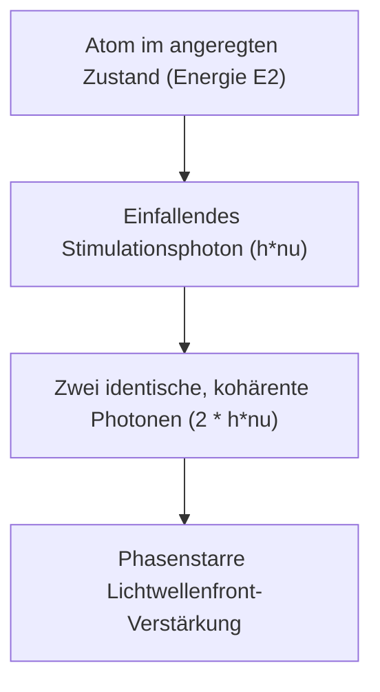

# Physik: Funktionsweise des Lasers - Stimulierte Emission, Besetzungsinversion und optische Verstärkung

In der modernen Industriegesellschaft ist der Laser eine unverzichtbare Schlüsseltechnologie. Von den transozeanischen Glasfaserleitungen des Internets und Barcode-Scannern im Einzelhandel über augenchirurgische Eingriffe und industrielle Metallschneideanlagen bis hin zu modernen LiDAR-Sensoren autonomer Fahrzeuge: Lasertechnologie prägt die Infrastruktur unseres Alltags.

Dennoch ist den wenigsten bekannt, wofür das Kunstwort **LASER** steht oder welche quantenphysikalischen Prozesse dahinterstehen. LASER ist ein Akronym für **„Light Amplification by Stimulated Emission of Radiation“** (Lichtverstärkung durch stimulierte Emission von Strahlung).

Dieser Beitrag bietet eine fundierte physikalische Analyse der Funktionsweise des Lasers anhand seiner drei Grundpfeiler: **Stimulierte Emission**, **Besetzungsinversion (Population Inversion)** und der **optische Resonator**.

## 1. Die Wechselwirkung von Licht und Materie: Einsteins drei Strahlungsprozesse

Das Verständnis des Lasers erfordert die Betrachtung der quantenmechanischen Wechselwirkung zwischen Photonen und gebundenen atomaren Elektronen. Bereits 1917 zeigte Albert Einstein, dass diese Wechselwirkung von drei elementaren Prozessen bestimmt wird:

### Absorption
Befindet sich ein Atom in einem energetisch niedrigen Zustand (Grundzustand: $E_1$) und trifft ein Photon mit der Resonanzenergie $h\nu = E_2 - E_1$ ($h$ ist das Plancksche Wirkungsquantum, $\nu$ die Frequenz) ein, absorbiert das Atom das Photon und geht in den angeregten Zustand ($E_2$) über.

### Spontane Emission
Ein Atom im angeregten Zustand ($E_2$) ist instabil. Nach einer charakteristischen Verweildauer fällt es ohne äußere Einwirkung unter Emission eines Photons mit der Energie $E_2 - E_1$ in den Grundzustand zurück. Richtung, Phase und Polarisation des emittierten Photons sind rein stochastisch. Dies ist das inkohärente Licht herkömmlicher Lichtquellen wie Glühlampen, Leuchtstoffröhren und der Sonne.

### Stimulierte Emission
Dies ist der physikalische Kernprozess jedes Lasers. Befindet sich das Atom bereits im angeregten Zustand $E_2$ und passiert ein externes Photon mit der Energie $E_2 - E_1$ das Atom, so induziert dessen elektromagnetisches Wechselfeld den sofortigen Übergang des Atoms in den Zustand $E_1$.

Dabei strahlt das Atom ein zweites Photon ab, das ein **vollkommen identischer Quantenzwilling** des auslösenden Photons ist: Es besitzt **exakt dieselbe Wellenlänge, dieselbe Phase, dieselbe Ausbreitungsrichtung und denselben Polarisationszustand**. Aus einem einzelnen Photon entstehen zwei kohärente Photonen – das Licht wird verstärkt.

## 2. Besetzungsinversion (Population Inversion): Die zwingende Voraussetzung

Wenn stimulierte Emission Photonen verdoppelt, warum emittieren gewöhnliche Gegenstände im Alltag kein Laserlicht?

Im thermischen Gleichgewicht gehorcht die Besetzung atomarer Niveaus der **Boltzmann-Verteilung**. Die Anzahl der Atome im niederenergetischen Zustand ($N_1$) ist stets weitaus größer als im angeregten Zustand ($N_2$), also $N_1 \gg N_2$.
Trifft Licht auf ein solches Medium, überwiegt die Wahrscheinlichkeit der resonanten Absorption die der stimulierten Emission bei weitem. Das Licht wird exponentiell abgeschwächt.

Um eine Netto-Lichtverstärkung zu erzielen, muss dieses thermische Gleichgewicht aufgehoben werden. Es muss ein Zustand geschaffen werden, in dem **mehr Atome im angeregten Zustand als im Grundzustand verweilen ($N_2 > N_1$)**. Dieser Zustand heißt **Besetzungsinversion (Population Inversion)**.

### Pumpmechanismen
Da die Besetzungsinversion dem thermischen Gleichgewicht widerspricht, muss dem Lasermedium kontinuierlich externe Energie zugeführt werden, um Atome in höhere Niveaus zu heben. Dieser Vorgang heißt **Pumpen**:
- **Optisches Pumpen**: Anregung mittels Xenon-Blitzlampen oder Laserdiode (typisch für Festkörperlaser wie Rubin oder Nd:YAG).
- **Elektrisches Pumpen (Gasentladung & Strominjektion)**: Gasentladung durch Hochspannung (He-Ne- oder $\text{CO}_2$-Laser) oder Ladungsträgerinjektion in Halbleiter-pn-Übergängen (Laserdioden).
- **Chemisches Pumpen**: Energiebereitstellung durch stark exotherme chemische Reaktionen.

### Drei- und Vier-Niveau-Systeme
In realen Lasersystemen werden Drei- oder Vier-Niveau-Konfigurationen genutzt:

* **Drei-Niveau-System (z. B. Rubinlaser)**:
  Atome werden vom Grundzustand $E_1$ auf ein hohes Niveau $E_3$ gepumpt und relaxieren strahlungslos auf das metastabile Laserniveau $E_2$. Der Laserübergang erfolgt von $E_2$ zurück in den Grundzustand $E_1$. Da das untere Laserniveau der vollbesetzte Grundzustand ist, müssen über 50 % aller Atome des Kristalls angeregt werden, um überhaupt Transparenz ($N_2 = N_1$) zu erreichen. Dies erfordert enorme Pumpleistungen.

* **Vier-Niveau-System (z. B. Nd:YAG, He-Ne)**:
  Atome werden von $E_0$ auf $E_3$ gepumpt, fallen auf $E_2$ und senden beim Übergang auf $E_1$ Laserstrahlung aus. Von $E_1$ relaxieren sie extrem schnell zurück in den Grundzustand $E_0$. Da das untere Laserniveau $E_1$ thermisch kaum besetzt ist ($N_1 \approx 0$), genügt bereits eine geringe Pumpleistung, um die Bedingung $N_2 > N_1$ zu erfüllen. Der Wirkungsgrad ist um ein Vielfaches höher als beim Drei-Niveau-System.

## 3. Der optische Resonator: Rückkopplung und Laser-Oszillation

Besetzungsinversion ermöglicht optische Verstärkung, doch ein einfacher Durchgang durch das Medium liefert nur einen geringen Gewinn. Um einen kontinuierlichen, hochenergetischen Strahl zu erzeugen, bedarf es einer optischen Rückkopplung: dem **optischen Resonator (Kavität)**.

Der Resonator besteht aus zwei gegenüberliegenden Spiegeln an den Stirnseiten des laseraktiven Mediums:
1. **Endspiegel (High Reflector)**: Nahezu 100 % Reflexionsgrad.
2. **Auskoppelspiegel (Output Coupler)**: Reflektiert den Hauptteil des Lichts (95 %–99 %) zurück in das Medium und transmittiert einen kleinen Anteil (1 %–5 %) als nutzbaren Laserstrahl.

### Der Oszillationszyklus
1. Beim Einsetzen des Pumpens entstehen durch spontane Emission erste Photonen.
2. Nur Photonen, die exakt parallel zur optischen Achse emittiert werden, lösen entlang des Lasermediums Lawinen stimulierter Emission aus.
3. An den Spiegeln reflektiert, durchlaufen sie das Medium hunderte Male.
4. Bei jedem Umlauf vermehren sich die phasengleichen Photonen exponentiell.
5. Ein konstanter Anteil tritt über den Auskoppelspiegel aus und bildet den **Laserstrahl**.

### Laserschwelle und Ratengleichungen

Laserstrahlung setzt erst ein, wenn der optische Gewinn pro Umlauf alle internen Verluste (Spiegeltransmission, Absorption, Streuung) übersteigt. Dies ist die **Laserschwelle (Laser Threshold)**.

Die Kinetik der atomaren Besetzungen und der Photonendichte wird durch die **Ratengleichungen (Rate Equations)** beschrieben:

$$ \frac{dN_2}{dt} = R_p - \frac{N_2}{\tau} - B \rho(\nu) (N_2 - N_1) $$

Dabei ist:
- $N_2, N_1$ die Besetzungsdichte des oberen und unteren Niveaus,
- $R_p$ die Pumprate,
- $\tau$ die spontane Lebensdauer,
- $B$ der Einsteinsche B-Koeffizient,
- $\rho(\nu)$ die spektrale Strahlungsenergiedichte im Resonator.

Die Lösung dieser Differentialgleichungen ermöglicht die Bestimmung von Schwellenpumpleistung, Ausgangsleistung und Relaxationsoszillationen.

## 4. Die vier herausragenden Eigenschaften von Laserlicht

Dank der stimulierten Emission und der Modenselektion des Resonators besitzt Laserlicht vier einzigartige Eigenschaften:

1. **Monochromasie (Monochromaticity)**:
   Aufgrund des diskreten atomaren Übergangs besitzt das Licht eine extrem schmale spektrale Bandbreite ($\Delta\lambda$) und somit höchste Farbfeinheit für Spektroskopie und optische Messtechnik.
2. **Richtwirkung (Directivity)**:
   Nur achsenparallele Moden werden verstärkt. Die Strahldivergenz ist verschwindend gering; ein zur Mondoberfläche gesendeter Strahl weitet sich über fast 400.000 km Distanz nur auf wenige Kilometer auf.
3. **Kohärenz (Räumlich und Zeitlich)**:
   Alle Photonen schwingen phasensynchron. **Räumliche Kohärenz** ermöglicht holografische 3D-Aufnahmen; **zeitliche Kohärenz** sorgt für extrem lange Phasenkohärenzlängen, unverzichtbar für Gravitationswellendetektoren (LIGO).
4. **Extreme Leistungsdichte und Fokussierbarkeit (High Intensity)**:
   Infolge der Kohärenz lässt sich der Strahl beugungsbegrenzt auf Brennflecke im Mikrometerbereich ($\sim 1\ \mu\text{m}$) fokussieren. Dies erzeugt Leistungsdichten von Gigawatt pro Quadratzentimeter, mit denen Metalle verdampft oder kontrollierte Kernfusionsprozesse gezündet werden.

## 5. Moderne Laserarchitekturen und Zukunftsperspektiven

Die Festkörper- und Halbleiterphysik hat verschiedenste Lasertypen hervorgebracht:

- **Halbleiter-Laserdioden**: Winzig klein und mit Wirkungsgraden über 50 % die Basis aller optischen Telekommunikationsnetze.
- **Faserlaser**: Dotierte Glasfasern (z. B. Ytterbium) als aktives Medium. Durch hervorragende Kühleigenschaften und Multi-Kilowatt-Leistungen sind sie Standard beim industriellen Schneiden und Schweißen.
- **Ultrakurzpulslaser (Femtosekunden- und Attosekundenphysik)**:
  Mittels Modenkopplung (Mode-locking) werden Laserpulse auf Femtosekunden ($10^{-15}\text{ s}$) oder Attosekunden ($10^{-18}\text{ s}$) komprimiert. Da die Pulsdauer kürzer ist als die thermische Wärmeleitung im Gitter („kalte Ablation“), ermöglichen sie mikrometergenaue Augenkorrekturen (SMILE) und Wafer-Strukturierungen ohne Hitzeschäden. 2023 ging der Nobelpreis für Physik an Pioniere der Attosekundenlaser, mit denen erstmals Elektronenbewegungen in Atomen in Echtzeit gefilmt werden konnten.

## Fazit

Von Einsteins theoretischer Vorhersage im Jahr 1917 bis zum ersten funktionierenden Rubinlaser von Theodore Maiman 1960 verkörpert der Laser den Triumph der angewandten Quantenphysik. Die meisterhafte Beherrschung atomarer Zustände, Besetzungsinversion und optischer Rückkopplung hat der Menschheit ein Werkzeug reinen Lichts an die Hand gegeben, das Wissenschaft und Technik unaufhörlich vorantreibt.
