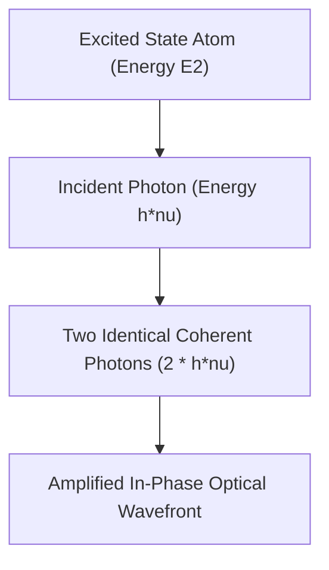

# Physics: Principles of Lasers - Stimulated Emission, Population Inversion, and Optical Amplification

In modern society, lasers have become an indispensable cornerstone of technology. From the high-speed fiber-optic cables that power the global Internet and supermarket barcode scanners to precision surgical lasers, corneal refractive surgery, industrial metal cutting, and autonomous vehicle LiDAR systems, laser technology underpins almost every sector of contemporary industry.

Yet, despite its ubiquitous presence, relatively few people understand what the word **LASER** actually means or the microscopic quantum mechanics that govern its operation. LASER is an acronym for **"Light Amplification by Stimulated Emission of Radiation."**

This article delivers a comprehensive, physically rigorous examination of the operational principles of lasers, focusing on the three essential pillars of laser physics: **Stimulated Emission**, **Population Inversion**, and the **Optical Resonator**.

## 1. Light-Atom Interactions: Einstein's Three Radiative Processes

To understand how a laser operates, one must first examine how electromagnetic radiation (photons) interacts with bound atomic electrons. In 1917, Albert Einstein published a seminal paper demonstrating that the interaction between light and matter is governed by three fundamental microscopic processes:

### Absorption
When an atom resides in a lower discrete energy level (ground state: $E_1$), an incident photon carrying energy $h\nu = E_2 - E_1$ (where $h$ is Planck's constant and $\nu$ is the optical frequency) can be absorbed. The atom absorbs the photon's energy and transitions to a higher discrete energy level (excited state: $E_2$).

### Spontaneous Emission
An atom in an excited state ($E_2$) is intrinsically unstable. Even without any external perturbation, it will decay after a characteristic lifetime to the lower energy state ($E_1$) with a certain probability. During this transition, it emits a photon of energy $E_2 - E_1$ in a random spatial direction with arbitrary polarization and random phase. This incoherent process is the light source behind everyday incandescent bulbs, fluorescent lamps, and the Sun.

### Stimulated Emission
Stimulated emission forms the quantum physical foundation of all lasers. When an atom is already in an excited state ($E_2$), and an external photon with energy exactly matching $E_2 - E_1$ arrives, the electromagnetic field of the incident photon "stimulates" the excited atom to decay to $E_1$. In doing so, the atom emits a second photon.

Remarkably, the newly emitted photon is an **exact quantum clone** of the incident photon: it possesses the **identical wavelength, identical phase, identical propagation direction, and identical polarization state**. Thus, one photon enters, and two completely coherent photons emerge, resulting in net optical amplification.

## 2. Population Inversion: The Indispensable Precondition for Amplification

While stimulated emission produces coherent light amplification, spontaneous light amplification never occurs in ordinary materials under natural thermal conditions. Why?

In thermal equilibrium, the distribution of atoms across atomic energy levels obeys the **Boltzmann distribution**. The population density $N_1$ of the lower energy ground state is vastly greater than the population density $N_2$ of the higher excited state ($N_1 \gg N_2$). 

Under these conditions, when a beam of photons enters the medium, the probability of **resonant absorption** overwhelmingly exceeds the probability of stimulated emission. The medium absorbs the optical energy, and the beam attenuates exponentially according to the Beer-Lambert law.

To achieve net optical amplification (laser oscillation), one must overturn this thermal equilibrium and create a non-equilibrium condition where **the number of atoms in the higher excited state exceeds that in the lower state ($N_2 > N_1$)**. This thermodynamic inversion is termed **Population Inversion**.

### Pumping Mechanisms
Because population inversion violates thermal equilibrium, energy must be continuously injected from an external source to force ground-state electrons into upper levels. This process is called **pumping**. Common pumping techniques include:
- **Optical Pumping**: Using intense flashlamps, arc lamps, or secondary laser diodes (widely used in solid-state lasers like Nd:YAG).
- **Electrical Pumping (Discharge / Current Injection)**: Passing an electric discharge through a gas (e.g., He-Ne or $\text{CO}_2$ lasers) or injecting forward-bias current across a p-n semiconductor junction.
- **Chemical Pumping**: Utilizing the exothermic energy of rapid chemical reactions (e.g., chemical oxygen iodine lasers).

### Three-Level vs. Four-Level Laser Systems
To maintain population inversion efficiently, real-world laser media utilize three or four atomic energy levels:

* **Three-Level System (e.g., Ruby Laser)**:
  Atoms are pumped from ground state $E_1$ to an upper pump band $E_3$. They rapidly decay via fast non-radiative transitions (phonons/heat) into a metastable intermediate state $E_2$. Laser emission occurs between $E_2$ and the ground state $E_1$. Because the lower laser level is the ground state itself—which initially holds 100% of the atoms—more than 50% of the entire atomic population must be continuously excited just to reach transparency ($N_2 = N_1$). This requires immense pumping power.

* **Four-Level System (e.g., Nd:YAG, He-Ne lasers)**:
  Atoms are pumped from ground state $E_0$ to $E_3$, decay non-radiatively to metastable level $E_2$, and emit laser light transitioning from $E_2$ to an unpopulated lower laser level $E_1$. From $E_1$, atoms rapidly decay back to the ground state $E_0$. Because $E_1$ is situated well above the thermal ground state, it remains virtually empty at room temperature ($N_1 \approx 0$). Consequently, even a modest pump power produces $N_2 > N_1$, establishing population inversion with dramatically higher efficiency.

## 3. The Optical Resonator: Feedback, Confinement, and Oscillation

Achieving population inversion creates an optical amplifier. However, a single pass through an amplifying medium yields only a slight gain. To transform an amplifier into a self-sustaining oscillator generating an intense, continuous, directional beam, positive optical feedback is required. This is provided by the **Optical Resonator (Optical Cavity)**.

An optical resonator consists of two mirrors positioned perpendicularly along the optical axis at opposite ends of the active gain medium:
1. **High Reflector (HR)**: A mirror providing nearly 100% reflection.
2. **Output Coupler (OC)**: A partially transmissive mirror that reflects the majority of light (e.g., 95%–99%) back into the cavity while transmitting a small fraction (1%–5%) as the usable output beam.

### The Feedback Cycle
1. When pumping creates population inversion, a few excited atoms undergo spontaneous emission.
2. Photons emitted strictly parallel to the resonator axis travel through the gain medium, triggering avalanches of stimulated emission.
3. Upon striking the end mirrors, the light reflects back, traversing the gain medium repeatedly.
4. With each round trip, stimulated emission multiplies the coherent photons exponentially.
5. A steady fraction leaks through the output coupler, producing the intense, continuous **laser beam**.

### Laser Threshold and Rate Equations

Laser oscillation begins only when round-trip optical gain exceeds total cavity losses (transmission, diffraction, absorption, scattering). This tipping point is the **Laser Threshold**.

The time-dependent interplay between atomic populations and photon density is described by coupled differential equations known as the **Laser Rate Equations**. For an idealized two-level approximation:

$$ \frac{dN_2}{dt} = R_p - \frac{N_2}{\tau} - B \rho(\nu) (N_2 - N_1) $$

Where:
- $N_2, N_1$ are the population densities of the upper and lower states,
- $R_p$ is the volumetric pumping rate,
- $\tau$ is the spontaneous radiative lifetime of the upper state,
- $B$ is Einstein's stimulated emission coefficient,
- $\rho(\nu)$ is the spectral radiation energy density inside the cavity (proportional to photon flux).

Solving the rate equations provides critical insights into threshold pump power, steady-state output wattage, gain saturation, and relaxation oscillations.

## 4. The Four Defining Characteristics of Laser Radiation

Because laser photons are generated via stimulated emission within an aligned optical cavity, laser radiation possesses four extraordinary properties absent in conventional thermal light sources:

1. **Monochromaticity**:
   Because stimulated emission occurs between well-defined quantum energy levels, the emitted light has an extremely narrow spectral linewidth ($\Delta\lambda$). This pure spectral color is indispensable for spectroscopy, atomic clocks, and interferometry.
2. **Directionality (Low Divergence)**:
   Only photons traveling exactly along the longitudinal resonator axis survive repeated cavity passes. Consequently, laser beams emerge with minimal beam divergence, allowing a beam to travel to the Moon and reflect back with a spot size of only a few kilometers.
3. **Coherence (Temporal and Spatial)**:
   Stimulated emission guarantees that every photon shares identical phase. **Spatial coherence** allows the wavefronts to remain uniform across the beam cross-section, enabling holographic imaging. **Temporal coherence** means the wave maintains phase predictability over long propagation distances, enabling ultra-precise optical interferometry (such as LIGO gravitational wave detection).
4. **Extreme Brightness and Focusability (High Intensity)**:
   Because spatial coherence permits diffraction-limited focusing, a laser beam can be concentrated by lenses into a spot whose diameter is on the order of a single wavelength ($\sim 1\ \mu\text{m}$). This concentrates immense electromagnetic power density (exceeding gigawatts per square centimeter), capable of vaporizing metals, cutting diamond, or driving laser-induced nuclear fusion.

## 5. Modern Laser Architectures and Frontiers

Decades of material science breakthroughs have diversified laser technology across multiple architectures:

- **Semiconductor Diode Lasers**: Highly compact, highly efficient (>50% electrical-to-optical conversion). Found inside optical communication transceivers, barcode readers, and consumer electronics.
- **Solid-State Lasers**: Neodymium-doped YAG (Nd:YAG) and Titanium-doped Sapphire (Ti:Sapphire). Deliver high peak power and pulse energies for medical surgery and industrial micromachining.
- **Fiber Lasers**: Utilize rare-earth-doped silica optical fibers (e.g., Ytterbium-doped) as the gain medium. Exceptional heat dissipation and beam quality make multi-kilowatt fiber lasers the dominant standard in heavy industrial welding and robotic cutting.
- **Ultrashort Pulse Lasers (Femtosecond and Attosecond Physics)**:
  Using passive **mode-locking** techniques, laser cavities can compress optical energy into pulses lasting femtoseconds ($10^{-15}\text{ s}$) or attoseconds ($10^{-18}\text{ s}$). Because energy is delivered faster than thermal conduction can transfer heat to neighboring atoms ("cold ablation"), femtosecond lasers perform ultra-precise non-thermal eye surgery (LASIK/SMILE) and semiconductor wafer dicing. Attosecond pulse trains allow physicists to capture real-time quantum motion of valence electrons inside atoms, recognized by the 2023 Nobel Prize in Physics.

## Conclusion

From Albert Einstein's theoretical formulation of stimulated emission in 1917 to Theodore Maiman's first working ruby laser in 1960, laser technology represents one of the greatest triumphs of quantum physics. 

The elegant interplay of quantum energy transitions, non-equilibrium population inversion, and resonant optical feedback has transformed human capability. What originated as pure curiosity into the quantum nature of light now drives our global telecommunications, precision medicine, scientific discovery, and industrial manufacturing.
