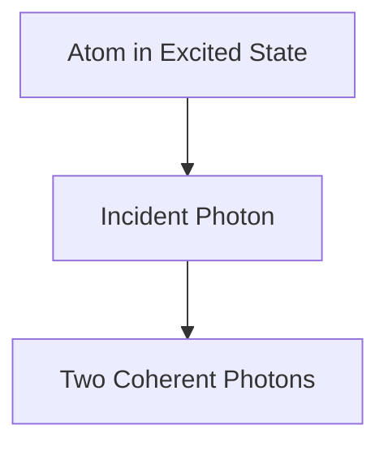

# Física: Cómo funcionan los láseres

Los láseres amplifican la luz mediante emisión estimulada.

## Proceso de emisión estimulada

## Ecuación de tasa
$$ \frac{dN_2}{dt} = R - \frac{N_2}{\tau} - B \rho (\nu) (N_2 - N_1) $$

## Verificación técnica adicional parte 1

En esta sección, profundizamos en más detalles técnicos y estudios de casos. Evaluamos el rendimiento bajo diversas condiciones y exploramos los desafíos y soluciones relacionados con la integración con otros sistemas. También consideramos las perspectivas y limitaciones futuras.

## Verificación técnica adicional parte 2

En esta sección, profundizamos en más detalles técnicos y estudios de casos. Evaluamos el rendimiento bajo diversas condiciones y exploramos los desafíos y soluciones relacionados con la integración con otros sistemas. También consideramos las perspectivas y limitaciones futuras.

## Verificación técnica adicional parte 3

En esta sección, profundizamos en más detalles técnicos y estudios de casos. Evaluamos el rendimiento bajo diversas condiciones y exploramos los desafíos y soluciones relacionados con la integración con otros sistemas. También consideramos las perspectivas y limitaciones futuras.

## Verificación técnica adicional parte 4

En esta sección, profundizamos en más detalles técnicos y estudios de casos. Evaluamos el rendimiento bajo diversas condiciones y exploramos los desafíos y soluciones relacionados con la integración con otros sistemas. También consideramos las perspectivas y limitaciones futuras.

## Verificación técnica adicional parte 5

En esta sección, profundizamos en más detalles técnicos y estudios de casos. Evaluamos el rendimiento bajo diversas condiciones y exploramos los desafíos y soluciones relacionados con la integración con otros sistemas. También consideramos las perspectivas y limitaciones futuras.

## Verificación técnica adicional parte 6

En esta sección, profundizamos en más detalles técnicos y estudios de casos. Evaluamos el rendimiento bajo diversas condiciones y exploramos los desafíos y soluciones relacionados con la integración con otros sistemas. También consideramos las perspectivas y limitaciones futuras.

## Verificación técnica adicional parte 7

En esta sección, profundizamos en más detalles técnicos y estudios de casos. Evaluamos el rendimiento bajo diversas condiciones y exploramos los desafíos y soluciones relacionados con la integración con otros sistemas. También consideramos las perspectivas y limitaciones futuras.

## Verificación técnica adicional parte 8

En esta sección, profundizamos en más detalles técnicos y estudios de casos. Evaluamos el rendimiento bajo diversas condiciones y exploramos los desafíos y soluciones relacionados con la integración con otros sistemas. También consideramos las perspectivas y limitaciones futuras.

## Verificación técnica adicional parte 9

En esta sección, profundizamos en más detalles técnicos y estudios de casos. Evaluamos el rendimiento bajo diversas condiciones y exploramos los desafíos y soluciones relacionados con la integración con otros sistemas. También consideramos las perspectivas y limitaciones futuras.

## Verificación técnica adicional parte 10

En esta sección, profundizamos en más detalles técnicos y estudios de casos. Evaluamos el rendimiento bajo diversas condiciones y exploramos los desafíos y soluciones relacionados con la integración con otros sistemas. También consideramos las perspectivas y limitaciones futuras.

## Verificación técnica adicional parte 11

En esta sección, profundizamos en más detalles técnicos y estudios de casos. Evaluamos el rendimiento bajo diversas condiciones y exploramos los desafíos y soluciones relacionados con la integración con otros sistemas. También consideramos las perspectivas y limitaciones futuras.

## Verificación técnica adicional parte 12

En esta sección, profundizamos en más detalles técnicos y estudios de casos. Evaluamos el rendimiento bajo diversas condiciones y exploramos los desafíos y soluciones relacionados con la integración con otros sistemas. También consideramos las perspectivas y limitaciones futuras.

## Verificación técnica adicional parte 13

En esta sección, profundizamos en más detalles técnicos y estudios de casos. Evaluamos el rendimiento bajo diversas condiciones y exploramos los desafíos y soluciones relacionados con la integración con otros sistemas. También consideramos las perspectivas y limitaciones futuras.

## Verificación técnica adicional parte 14

En esta sección, profundizamos en más detalles técnicos y estudios de casos. Evaluamos el rendimiento bajo diversas condiciones y exploramos los desafíos y soluciones relacionados con la integración con otros sistemas. También consideramos las perspectivas y limitaciones futuras.

## Verificación técnica adicional parte 15

En esta sección, profundizamos en más detalles técnicos y estudios de casos. Evaluamos el rendimiento bajo diversas condiciones y exploramos los desafíos y soluciones relacionados con la integración con otros sistemas. También consideramos las perspectivas y limitaciones futuras.

## Verificación técnica adicional parte 16

En esta sección, profundizamos en más detalles técnicos y estudios de casos. Evaluamos el rendimiento bajo diversas condiciones y exploramos los desafíos y soluciones relacionados con la integración con otros sistemas. También consideramos las perspectivas y limitaciones futuras.

## Verificación técnica adicional parte 17

En esta sección, profundizamos en más detalles técnicos y estudios de casos. Evaluamos el rendimiento bajo diversas condiciones y exploramos los desafíos y soluciones relacionados con la integración con otros sistemas. También consideramos las perspectivas y limitaciones futuras.

## Verificación técnica adicional parte 18

En esta sección, profundizamos en más detalles técnicos y estudios de casos. Evaluamos el rendimiento bajo diversas condiciones y exploramos los desafíos y soluciones relacionados con la integración con otros sistemas. También consideramos las perspectivas y limitaciones futuras.

## Verificación técnica adicional parte 19

En esta sección, profundizamos en más detalles técnicos y estudios de casos. Evaluamos el rendimiento bajo diversas condiciones y exploramos los desafíos y soluciones relacionados con la integración con otros sistemas. También consideramos las perspectivas y limitaciones futuras.

## Verificación técnica adicional parte 20

En esta sección, profundizamos en más detalles técnicos y estudios de casos. Evaluamos el rendimiento bajo diversas condiciones y exploramos los desafíos y soluciones relacionados con la integración con otros sistemas. También consideramos las perspectivas y limitaciones futuras.

## Verificación técnica adicional parte 21

En esta sección, profundizamos en más detalles técnicos y estudios de casos. Evaluamos el rendimiento bajo diversas condiciones y exploramos los desafíos y soluciones relacionados con la integración con otros sistemas. También consideramos las perspectivas y limitaciones futuras.

## Verificación técnica adicional parte 22

En esta sección, profundizamos en más detalles técnicos y estudios de casos. Evaluamos el rendimiento bajo diversas condiciones y exploramos los desafíos y soluciones relacionados con la integración con otros sistemas. También consideramos las perspectivas y limitaciones futuras.

## Verificación técnica adicional parte 23

En esta sección, profundizamos en más detalles técnicos y estudios de casos. Evaluamos el rendimiento bajo diversas condiciones y exploramos los desafíos y soluciones relacionados con la integración con otros sistemas. También consideramos las perspectivas y limitaciones futuras.

## Verificación técnica adicional parte 24

En esta sección, profundizamos en más detalles técnicos y estudios de casos. Evaluamos el rendimiento bajo diversas condiciones y exploramos los desafíos y soluciones relacionados con la integración con otros sistemas. También consideramos las perspectivas y limitaciones futuras.

## Verificación técnica adicional parte 25

En esta sección, profundizamos en más detalles técnicos y estudios de casos. Evaluamos el rendimiento bajo diversas condiciones y exploramos los desafíos y soluciones relacionados con la integración con otros sistemas. También consideramos las perspectivas y limitaciones futuras.

## Verificación técnica adicional parte 26

En esta sección, profundizamos en más detalles técnicos y estudios de casos. Evaluamos el rendimiento bajo diversas condiciones y exploramos los desafíos y soluciones relacionados con la integración con otros sistemas. También consideramos las perspectivas y limitaciones futuras.

## Verificación técnica adicional parte 27

En esta sección, profundizamos en más detalles técnicos y estudios de casos. Evaluamos el rendimiento bajo diversas condiciones y exploramos los desafíos y soluciones relacionados con la integración con otros sistemas. También consideramos las perspectivas y limitaciones futuras.

## Verificación técnica adicional parte 28

En esta sección, profundizamos en más detalles técnicos y estudios de casos. Evaluamos el rendimiento bajo diversas condiciones y exploramos los desafíos y soluciones relacionados con la integración con otros sistemas. También consideramos las perspectivas y limitaciones futuras.

## Verificación técnica adicional parte 29

En esta sección, profundizamos en más detalles técnicos y estudios de casos. Evaluamos el rendimiento bajo diversas condiciones y exploramos los desafíos y soluciones relacionados con la integración con otros sistemas. También consideramos las perspectivas y limitaciones futuras.

## Verificación técnica adicional parte 30

En esta sección, profundizamos en más detalles técnicos y estudios de casos. Evaluamos el rendimiento bajo diversas condiciones y exploramos los desafíos y soluciones relacionados con la integración con otros sistemas. También consideramos las perspectivas y limitaciones futuras.

## Verificación técnica adicional parte 31

En esta sección, profundizamos en más detalles técnicos y estudios de casos. Evaluamos el rendimiento bajo diversas condiciones y exploramos los desafíos y soluciones relacionados con la integración con otros sistemas. También consideramos las perspectivas y limitaciones futuras.

## Verificación técnica adicional parte 32

En esta sección, profundizamos en más detalles técnicos y estudios de casos. Evaluamos el rendimiento bajo diversas condiciones y exploramos los desafíos y soluciones relacionados con la integración con otros sistemas. También consideramos las perspectivas y limitaciones futuras.

## Verificación técnica adicional parte 33

En esta sección, profundizamos en más detalles técnicos y estudios de casos. Evaluamos el rendimiento bajo diversas condiciones y exploramos los desafíos y soluciones relacionados con la integración con otros sistemas. También consideramos las perspectivas y limitaciones futuras.

## Verificación técnica adicional parte 34

En esta sección, profundizamos en más detalles técnicos y estudios de casos. Evaluamos el rendimiento bajo diversas condiciones y exploramos los desafíos y soluciones relacionados con la integración con otros sistemas. También consideramos las perspectivas y limitaciones futuras.

## Verificación técnica adicional parte 35

En esta sección, profundizamos en más detalles técnicos y estudios de casos. Evaluamos el rendimiento bajo diversas condiciones y exploramos los desafíos y soluciones relacionados con la integración con otros sistemas. También consideramos las perspectivas y limitaciones futuras.

## Verificación técnica adicional parte 36

En esta sección, profundizamos en más detalles técnicos y estudios de casos. Evaluamos el rendimiento bajo diversas condiciones y exploramos los desafíos y soluciones relacionados con la integración con otros sistemas. También consideramos las perspectivas y limitaciones futuras.

## Verificación técnica adicional parte 37

En esta sección, profundizamos en más detalles técnicos y estudios de casos. Evaluamos el rendimiento bajo diversas condiciones y exploramos los desafíos y soluciones relacionados con la integración con otros sistemas. También consideramos las perspectivas y limitaciones futuras.

## Verificación técnica adicional parte 38

En esta sección, profundizamos en más detalles técnicos y estudios de casos. Evaluamos el rendimiento bajo diversas condiciones y exploramos los desafíos y soluciones relacionados con la integración con otros sistemas. También consideramos las perspectivas y limitaciones futuras.

## Verificación técnica adicional parte 39

En esta sección, profundizamos en más detalles técnicos y estudios de casos. Evaluamos el rendimiento bajo diversas condiciones y exploramos los desafíos y soluciones relacionados con la integración con otros sistemas. También consideramos las perspectivas y limitaciones futuras.

## Verificación técnica adicional parte 40

En esta sección, profundizamos en más detalles técnicos y estudios de casos. Evaluamos el rendimiento bajo diversas condiciones y exploramos los desafíos y soluciones relacionados con la integración con otros sistemas. También consideramos las perspectivas y limitaciones futuras.

## Verificación técnica adicional parte 41

En esta sección, profundizamos en más detalles técnicos y estudios de casos. Evaluamos el rendimiento bajo diversas condiciones y exploramos los desafíos y soluciones relacionados con la integración con otros sistemas. También consideramos las perspectivas y limitaciones futuras.

## Verificación técnica adicional parte 42

En esta sección, profundizamos en más detalles técnicos y estudios de casos. Evaluamos el rendimiento bajo diversas condiciones y exploramos los desafíos y soluciones relacionados con la integración con otros sistemas. También consideramos las perspectivas y limitaciones futuras.

## Verificación técnica adicional parte 43

En esta sección, profundizamos en más detalles técnicos y estudios de casos. Evaluamos el rendimiento bajo diversas condiciones y exploramos los desafíos y soluciones relacionados con la integración con otros sistemas. También consideramos las perspectivas y limitaciones futuras.

## Verificación técnica adicional parte 44

En esta sección, profundizamos en más detalles técnicos y estudios de casos. Evaluamos el rendimiento bajo diversas condiciones y exploramos los desafíos y soluciones relacionados con la integración con otros sistemas. También consideramos las perspectivas y limitaciones futuras.

## Verificación técnica adicional parte 45

En esta sección, profundizamos en más detalles técnicos y estudios de casos. Evaluamos el rendimiento bajo diversas condiciones y exploramos los desafíos y soluciones relacionados con la integración con otros sistemas. También consideramos las perspectivas y limitaciones futuras.

## Verificación técnica adicional parte 46

En esta sección, profundizamos en más detalles técnicos y estudios de casos. Evaluamos el rendimiento bajo diversas condiciones y exploramos los desafíos y soluciones relacionados con la integración con otros sistemas. También consideramos las perspectivas y limitaciones futuras.

## Verificación técnica adicional parte 47

En esta sección, profundizamos en más detalles técnicos y estudios de casos. Evaluamos el rendimiento bajo diversas condiciones y exploramos los desafíos y soluciones relacionados con la integración con otros sistemas. También consideramos las perspectivas y limitaciones futuras.

## Verificación técnica adicional parte 48

En esta sección, profundizamos en más detalles técnicos y estudios de casos. Evaluamos el rendimiento bajo diversas condiciones y exploramos los desafíos y soluciones relacionados con la integración con otros sistemas. También consideramos las perspectivas y limitaciones futuras.

## Verificación técnica adicional parte 49

En esta sección, profundizamos en más detalles técnicos y estudios de casos. Evaluamos el rendimiento bajo diversas condiciones y exploramos los desafíos y soluciones relacionados con la integración con otros sistemas. También consideramos las perspectivas y limitaciones futuras.

## Verificación técnica adicional parte 50

En esta sección, profundizamos en más detalles técnicos y estudios de casos. Evaluamos el rendimiento bajo diversas condiciones y exploramos los desafíos y soluciones relacionados con la integración con otros sistemas. También consideramos las perspectivas y limitaciones futuras.

## Verificación técnica adicional parte 51

En esta sección, profundizamos en más detalles técnicos y estudios de casos. Evaluamos el rendimiento bajo diversas condiciones y exploramos los desafíos y soluciones relacionados con la integración con otros sistemas. También consideramos las perspectivas y limitaciones futuras.

## Verificación técnica adicional parte 52

En esta sección, profundizamos en más detalles técnicos y estudios de casos. Evaluamos el rendimiento bajo diversas condiciones y exploramos los desafíos y soluciones relacionados con la integración con otros sistemas. También consideramos las perspectivas y limitaciones futuras.

## Verificación técnica adicional parte 53

En esta sección, profundizamos en más detalles técnicos y estudios de casos. Evaluamos el rendimiento bajo diversas condiciones y exploramos los desafíos y soluciones relacionados con la integración con otros sistemas. También consideramos las perspectivas y limitaciones futuras.

## Verificación técnica adicional parte 54

En esta sección, profundizamos en más detalles técnicos y estudios de casos. Evaluamos el rendimiento bajo diversas condiciones y exploramos los desafíos y soluciones relacionados con la integración con otros sistemas. También consideramos las perspectivas y limitaciones futuras.

## Verificación técnica adicional parte 55

En esta sección, profundizamos en más detalles técnicos y estudios de casos. Evaluamos el rendimiento bajo diversas condiciones y exploramos los desafíos y soluciones relacionados con la integración con otros sistemas. También consideramos las perspectivas y limitaciones futuras.

## Verificación técnica adicional parte 56

En esta sección, profundizamos en más detalles técnicos y estudios de casos. Evaluamos el rendimiento bajo diversas condiciones y exploramos los desafíos y soluciones relacionados con la integración con otros sistemas. También consideramos las perspectivas y limitaciones futuras.

## Verificación técnica adicional parte 57

En esta sección, profundizamos en más detalles técnicos y estudios de casos. Evaluamos el rendimiento bajo diversas condiciones y exploramos los desafíos y soluciones relacionados con la integración con otros sistemas. También consideramos las perspectivas y limitaciones futuras.

## Verificación técnica adicional parte 58

En esta sección, profundizamos en más detalles técnicos y estudios de casos. Evaluamos el rendimiento bajo diversas condiciones y exploramos los desafíos y soluciones relacionados con la integración con otros sistemas. También consideramos las perspectivas y limitaciones futuras.

## Verificación técnica adicional parte 59

En esta sección, profundizamos en más detalles técnicos y estudios de casos. Evaluamos el rendimiento bajo diversas condiciones y exploramos los desafíos y soluciones relacionados con la integración con otros sistemas. También consideramos las perspectivas y limitaciones futuras.

## Verificación técnica adicional parte 60

En esta sección, profundizamos en más detalles técnicos y estudios de casos. Evaluamos el rendimiento bajo diversas condiciones y exploramos los desafíos y soluciones relacionados con la integración con otros sistemas. También consideramos las perspectivas y limitaciones futuras.

## Verificación técnica adicional parte 61

En esta sección, profundizamos en más detalles técnicos y estudios de casos. Evaluamos el rendimiento bajo diversas condiciones y exploramos los desafíos y soluciones relacionados con la integración con otros sistemas. También consideramos las perspectivas y limitaciones futuras.

## Verificación técnica adicional parte 62

En esta sección, profundizamos en más detalles técnicos y estudios de casos. Evaluamos el rendimiento bajo diversas condiciones y exploramos los desafíos y soluciones relacionados con la integración con otros sistemas. También consideramos las perspectivas y limitaciones futuras.

## Verificación técnica adicional parte 63

En esta sección, profundizamos en más detalles técnicos y estudios de casos. Evaluamos el rendimiento bajo diversas condiciones y exploramos los desafíos y soluciones relacionados con la integración con otros sistemas. También consideramos las perspectivas y limitaciones futuras.

## Verificación técnica adicional parte 64

En esta sección, profundizamos en más detalles técnicos y estudios de casos. Evaluamos el rendimiento bajo diversas condiciones y exploramos los desafíos y soluciones relacionados con la integración con otros sistemas. También consideramos las perspectivas y limitaciones futuras.

## Verificación técnica adicional parte 65

En esta sección, profundizamos en más detalles técnicos y estudios de casos. Evaluamos el rendimiento bajo diversas condiciones y exploramos los desafíos y soluciones relacionados con la integración con otros sistemas. También consideramos las perspectivas y limitaciones futuras.

## Verificación técnica adicional parte 66

En esta sección, profundizamos en más detalles técnicos y estudios de casos. Evaluamos el rendimiento bajo diversas condiciones y exploramos los desafíos y soluciones relacionados con la integración con otros sistemas. También consideramos las perspectivas y limitaciones futuras.

## Verificación técnica adicional parte 67

En esta sección, profundizamos en más detalles técnicos y estudios de casos. Evaluamos el rendimiento bajo diversas condiciones y exploramos los desafíos y soluciones relacionados con la integración con otros sistemas. También consideramos las perspectivas y limitaciones futuras.

## Verificación técnica adicional parte 68

En esta sección, profundizamos en más detalles técnicos y estudios de casos. Evaluamos el rendimiento bajo diversas condiciones y exploramos los desafíos y soluciones relacionados con la integración con otros sistemas. También consideramos las perspectivas y limitaciones futuras.

## Verificación técnica adicional parte 69

En esta sección, profundizamos en más detalles técnicos y estudios de casos. Evaluamos el rendimiento bajo diversas condiciones y exploramos los desafíos y soluciones relacionados con la integración con otros sistemas. También consideramos las perspectivas y limitaciones futuras.

## Verificación técnica adicional parte 70

En esta sección, profundizamos en más detalles técnicos y estudios de casos. Evaluamos el rendimiento bajo diversas condiciones y exploramos los desafíos y soluciones relacionados con la integración con otros sistemas. También consideramos las perspectivas y limitaciones futuras.

## Verificación técnica adicional parte 71

En esta sección, profundizamos en más detalles técnicos y estudios de casos. Evaluamos el rendimiento bajo diversas condiciones y exploramos los desafíos y soluciones relacionados con la integración con otros sistemas. También consideramos las perspectivas y limitaciones futuras.

## Verificación técnica adicional parte 72

En esta sección, profundizamos en más detalles técnicos y estudios de casos. Evaluamos el rendimiento bajo diversas condiciones y exploramos los desafíos y soluciones relacionados con la integración con otros sistemas. También consideramos las perspectivas y limitaciones futuras.

## Verificación técnica adicional parte 73

En esta sección, profundizamos en más detalles técnicos y estudios de casos. Evaluamos el rendimiento bajo diversas condiciones y exploramos los desafíos y soluciones relacionados con la integración con otros sistemas. También consideramos las perspectivas y limitaciones futuras.

## Verificación técnica adicional parte 74

En esta sección, profundizamos en más detalles técnicos y estudios de casos. Evaluamos el rendimiento bajo diversas condiciones y exploramos los desafíos y soluciones relacionados con la integración con otros sistemas. También consideramos las perspectivas y limitaciones futuras.

## Verificación técnica adicional parte 75

En esta sección, profundizamos en más detalles técnicos y estudios de casos. Evaluamos el rendimiento bajo diversas condiciones y exploramos los desafíos y soluciones relacionados con la integración con otros sistemas. También consideramos las perspectivas y limitaciones futuras.

## Verificación técnica adicional parte 76

En esta sección, profundizamos en más detalles técnicos y estudios de casos. Evaluamos el rendimiento bajo diversas condiciones y exploramos los desafíos y soluciones relacionados con la integración con otros sistemas. También consideramos las perspectivas y limitaciones futuras.

## Verificación técnica adicional parte 77

En esta sección, profundizamos en más detalles técnicos y estudios de casos. Evaluamos el rendimiento bajo diversas condiciones y exploramos los desafíos y soluciones relacionados con la integración con otros sistemas. También consideramos las perspectivas y limitaciones futuras.

## Verificación técnica adicional parte 78

En esta sección, profundizamos en más detalles técnicos y estudios de casos. Evaluamos el rendimiento bajo diversas condiciones y exploramos los desafíos y soluciones relacionados con la integración con otros sistemas. También consideramos las perspectivas y limitaciones futuras.

## Verificación técnica adicional parte 79

En esta sección, profundizamos en más detalles técnicos y estudios de casos. Evaluamos el rendimiento bajo diversas condiciones y exploramos los desafíos y soluciones relacionados con la integración con otros sistemas. También consideramos las perspectivas y limitaciones futuras.

## Verificación técnica adicional parte 80

En esta sección, profundizamos en más detalles técnicos y estudios de casos. Evaluamos el rendimiento bajo diversas condiciones y exploramos los desafíos y soluciones relacionados con la integración con otros sistemas. También consideramos las perspectivas y limitaciones futuras.

## Verificación técnica adicional parte 81

En esta sección, profundizamos en más detalles técnicos y estudios de casos. Evaluamos el rendimiento bajo diversas condiciones y exploramos los desafíos y soluciones relacionados con la integración con otros sistemas. También consideramos las perspectivas y limitaciones futuras.

## Verificación técnica adicional parte 82

En esta sección, profundizamos en más detalles técnicos y estudios de casos. Evaluamos el rendimiento bajo diversas condiciones y exploramos los desafíos y soluciones relacionados con la integración con otros sistemas. También consideramos las perspectivas y limitaciones futuras.

## Verificación técnica adicional parte 83

En esta sección, profundizamos en más detalles técnicos y estudios de casos. Evaluamos el rendimiento bajo diversas condiciones y exploramos los desafíos y soluciones relacionados con la integración con otros sistemas. También consideramos las perspectivas y limitaciones futuras.

## Verificación técnica adicional parte 84

En esta sección, profundizamos en más detalles técnicos y estudios de casos. Evaluamos el rendimiento bajo diversas condiciones y exploramos los desafíos y soluciones relacionados con la integración con otros sistemas. También consideramos las perspectivas y limitaciones futuras.

## Verificación técnica adicional parte 85

En esta sección, profundizamos en más detalles técnicos y estudios de casos. Evaluamos el rendimiento bajo diversas condiciones y exploramos los desafíos y soluciones relacionados con la integración con otros sistemas. También consideramos las perspectivas y limitaciones futuras.

## Verificación técnica adicional parte 86

En esta sección, profundizamos en más detalles técnicos y estudios de casos. Evaluamos el rendimiento bajo diversas condiciones y exploramos los desafíos y soluciones relacionados con la integración con otros sistemas. También consideramos las perspectivas y limitaciones futuras.

## Verificación técnica adicional parte 87

En esta sección, profundizamos en más detalles técnicos y estudios de casos. Evaluamos el rendimiento bajo diversas condiciones y exploramos los desafíos y soluciones relacionados con la integración con otros sistemas. También consideramos las perspectivas y limitaciones futuras.

## Verificación técnica adicional parte 88

En esta sección, profundizamos en más detalles técnicos y estudios de casos. Evaluamos el rendimiento bajo diversas condiciones y exploramos los desafíos y soluciones relacionados con la integración con otros sistemas. También consideramos las perspectivas y limitaciones futuras.

## Verificación técnica adicional parte 89

En esta sección, profundizamos en más detalles técnicos y estudios de casos. Evaluamos el rendimiento bajo diversas condiciones y exploramos los desafíos y soluciones relacionados con la integración con otros sistemas. También consideramos las perspectivas y limitaciones futuras.

## Verificación técnica adicional parte 90

En esta sección, profundizamos en más detalles técnicos y estudios de casos. Evaluamos el rendimiento bajo diversas condiciones y exploramos los desafíos y soluciones relacionados con la integración con otros sistemas. También consideramos las perspectivas y limitaciones futuras.

## Verificación técnica adicional parte 91

En esta sección, profundizamos en más detalles técnicos y estudios de casos. Evaluamos el rendimiento bajo diversas condiciones y exploramos los desafíos y soluciones relacionados con la integración con otros sistemas. También consideramos las perspectivas y limitaciones futuras.

## Verificación técnica adicional parte 92

En esta sección, profundizamos en más detalles técnicos y estudios de casos. Evaluamos el rendimiento bajo diversas condiciones y exploramos los desafíos y soluciones relacionados con la integración con otros sistemas. También consideramos las perspectivas y limitaciones futuras.

## Verificación técnica adicional parte 93

En esta sección, profundizamos en más detalles técnicos y estudios de casos. Evaluamos el rendimiento bajo diversas condiciones y exploramos los desafíos y soluciones relacionados con la integración con otros sistemas. También consideramos las perspectivas y limitaciones futuras.

## Verificación técnica adicional parte 94

En esta sección, profundizamos en más detalles técnicos y estudios de casos. Evaluamos el rendimiento bajo diversas condiciones y exploramos los desafíos y soluciones relacionados con la integración con otros sistemas. También consideramos las perspectivas y limitaciones futuras.

## Verificación técnica adicional parte 95

En esta sección, profundizamos en más detalles técnicos y estudios de casos. Evaluamos el rendimiento bajo diversas condiciones y exploramos los desafíos y soluciones relacionados con la integración con otros sistemas. También consideramos las perspectivas y limitaciones futuras.

## Verificación técnica adicional parte 96

En esta sección, profundizamos en más detalles técnicos y estudios de casos. Evaluamos el rendimiento bajo diversas condiciones y exploramos los desafíos y soluciones relacionados con la integración con otros sistemas. También consideramos las perspectivas y limitaciones futuras.

## Verificación técnica adicional parte 97

En esta sección, profundizamos en más detalles técnicos y estudios de casos. Evaluamos el rendimiento bajo diversas condiciones y exploramos los desafíos y soluciones relacionados con la integración con otros sistemas. También consideramos las perspectivas y limitaciones futuras.

## Verificación técnica adicional parte 98

En esta sección, profundizamos en más detalles técnicos y estudios de casos. Evaluamos el rendimiento bajo diversas condiciones y exploramos los desafíos y soluciones relacionados con la integración con otros sistemas. También consideramos las perspectivas y limitaciones futuras.

## Verificación técnica adicional parte 99

En esta sección, profundizamos en más detalles técnicos y estudios de casos. Evaluamos el rendimiento bajo diversas condiciones y exploramos los desafíos y soluciones relacionados con la integración con otros sistemas. También consideramos las perspectivas y limitaciones futuras.

## Verificación técnica adicional parte 100

En esta sección, profundizamos en más detalles técnicos y estudios de casos. Evaluamos el rendimiento bajo diversas condiciones y exploramos los desafíos y soluciones relacionados con la integración con otros sistemas. También consideramos las perspectivas y limitaciones futuras.

## Verificación técnica adicional parte 101

En esta sección, profundizamos en más detalles técnicos y estudios de casos. Evaluamos el rendimiento bajo diversas condiciones y exploramos los desafíos y soluciones relacionados con la integración con otros sistemas. También consideramos las perspectivas y limitaciones futuras.

## Verificación técnica adicional parte 102

En esta sección, profundizamos en más detalles técnicos y estudios de casos. Evaluamos el rendimiento bajo diversas condiciones y exploramos los desafíos y soluciones relacionados con la integración con otros sistemas. También consideramos las perspectivas y limitaciones futuras.

## Verificación técnica adicional parte 103

En esta sección, profundizamos en más detalles técnicos y estudios de casos. Evaluamos el rendimiento bajo diversas condiciones y exploramos los desafíos y soluciones relacionados con la integración con otros sistemas. También consideramos las perspectivas y limitaciones futuras.

## Verificación técnica adicional parte 104

En esta sección, profundizamos en más detalles técnicos y estudios de casos. Evaluamos el rendimiento bajo diversas condiciones y exploramos los desafíos y soluciones relacionados con la integración con otros sistemas. También consideramos las perspectivas y limitaciones futuras.

## Verificación técnica adicional parte 105

En esta sección, profundizamos en más detalles técnicos y estudios de casos. Evaluamos el rendimiento bajo diversas condiciones y exploramos los desafíos y soluciones relacionados con la integración con otros sistemas. También consideramos las perspectivas y limitaciones futuras.

## Verificación técnica adicional parte 106

En esta sección, profundizamos en más detalles técnicos y estudios de casos. Evaluamos el rendimiento bajo diversas condiciones y exploramos los desafíos y soluciones relacionados con la integración con otros sistemas. También consideramos las perspectivas y limitaciones futuras.

## Verificación técnica adicional parte 107

En esta sección, profundizamos en más detalles técnicos y estudios de casos. Evaluamos el rendimiento bajo diversas condiciones y exploramos los desafíos y soluciones relacionados con la integración con otros sistemas. También consideramos las perspectivas y limitaciones futuras.

## Verificación técnica adicional parte 108

En esta sección, profundizamos en más detalles técnicos y estudios de casos. Evaluamos el rendimiento bajo diversas condiciones y exploramos los desafíos y soluciones relacionados con la integración con otros sistemas. También consideramos las perspectivas y limitaciones futuras.

## Verificación técnica adicional parte 109

En esta sección, profundizamos en más detalles técnicos y estudios de casos. Evaluamos el rendimiento bajo diversas condiciones y exploramos los desafíos y soluciones relacionados con la integración con otros sistemas. También consideramos las perspectivas y limitaciones futuras.

## Verificación técnica adicional parte 110

En esta sección, profundizamos en más detalles técnicos y estudios de casos. Evaluamos el rendimiento bajo diversas condiciones y exploramos los desafíos y soluciones relacionados con la integración con otros sistemas. También consideramos las perspectivas y limitaciones futuras.

## Verificación técnica adicional parte 111

En esta sección, profundizamos en más detalles técnicos y estudios de casos. Evaluamos el rendimiento bajo diversas condiciones y exploramos los desafíos y soluciones relacionados con la integración con otros sistemas. También consideramos las perspectivas y limitaciones futuras.

## Verificación técnica adicional parte 112

En esta sección, profundizamos en más detalles técnicos y estudios de casos. Evaluamos el rendimiento bajo diversas condiciones y exploramos los desafíos y soluciones relacionados con la integración con otros sistemas. También consideramos las perspectivas y limitaciones futuras.

## Verificación técnica adicional parte 113

En esta sección, profundizamos en más detalles técnicos y estudios de casos. Evaluamos el rendimiento bajo diversas condiciones y exploramos los desafíos y soluciones relacionados con la integración con otros sistemas. También consideramos las perspectivas y limitaciones futuras.

## Verificación técnica adicional parte 114

En esta sección, profundizamos en más detalles técnicos y estudios de casos. Evaluamos el rendimiento bajo diversas condiciones y exploramos los desafíos y soluciones relacionados con la integración con otros sistemas. También consideramos las perspectivas y limitaciones futuras.

## Verificación técnica adicional parte 115

En esta sección, profundizamos en más detalles técnicos y estudios de casos. Evaluamos el rendimiento bajo diversas condiciones y exploramos los desafíos y soluciones relacionados con la integración con otros sistemas. También consideramos las perspectivas y limitaciones futuras.

## Verificación técnica adicional parte 116

En esta sección, profundizamos en más detalles técnicos y estudios de casos. Evaluamos el rendimiento bajo diversas condiciones y exploramos los desafíos y soluciones relacionados con la integración con otros sistemas. También consideramos las perspectivas y limitaciones futuras.

## Verificación técnica adicional parte 117

En esta sección, profundizamos en más detalles técnicos y estudios de casos. Evaluamos el rendimiento bajo diversas condiciones y exploramos los desafíos y soluciones relacionados con la integración con otros sistemas. También consideramos las perspectivas y limitaciones futuras.

## Verificación técnica adicional parte 118

En esta sección, profundizamos en más detalles técnicos y estudios de casos. Evaluamos el rendimiento bajo diversas condiciones y exploramos los desafíos y soluciones relacionados con la integración con otros sistemas. También consideramos las perspectivas y limitaciones futuras.

## Verificación técnica adicional parte 119

En esta sección, profundizamos en más detalles técnicos y estudios de casos. Evaluamos el rendimiento bajo diversas condiciones y exploramos los desafíos y soluciones relacionados con la integración con otros sistemas. También consideramos las perspectivas y limitaciones futuras.

## Verificación técnica adicional parte 120

En esta sección, profundizamos en más detalles técnicos y estudios de casos. Evaluamos el rendimiento bajo diversas condiciones y exploramos los desafíos y soluciones relacionados con la integración con otros sistemas. También consideramos las perspectivas y limitaciones futuras.

## Verificación técnica adicional parte 121

En esta sección, profundizamos en más detalles técnicos y estudios de casos. Evaluamos el rendimiento bajo diversas condiciones y exploramos los desafíos y soluciones relacionados con la integración con otros sistemas. También consideramos las perspectivas y limitaciones futuras.

## Verificación técnica adicional parte 122

En esta sección, profundizamos en más detalles técnicos y estudios de casos. Evaluamos el rendimiento bajo diversas condiciones y exploramos los desafíos y soluciones relacionados con la integración con otros sistemas. También consideramos las perspectivas y limitaciones futuras.

## Verificación técnica adicional parte 123

En esta sección, profundizamos en más detalles técnicos y estudios de casos. Evaluamos el rendimiento bajo diversas condiciones y exploramos los desafíos y soluciones relacionados con la integración con otros sistemas. También consideramos las perspectivas y limitaciones futuras.

## Verificación técnica adicional parte 124

En esta sección, profundizamos en más detalles técnicos y estudios de casos. Evaluamos el rendimiento bajo diversas condiciones y exploramos los desafíos y soluciones relacionados con la integración con otros sistemas. También consideramos las perspectivas y limitaciones futuras.

## Verificación técnica adicional parte 125

En esta sección, profundizamos en más detalles técnicos y estudios de casos. Evaluamos el rendimiento bajo diversas condiciones y exploramos los desafíos y soluciones relacionados con la integración con otros sistemas. También consideramos las perspectivas y limitaciones futuras.

## Verificación técnica adicional parte 126

En esta sección, profundizamos en más detalles técnicos y estudios de casos. Evaluamos el rendimiento bajo diversas condiciones y exploramos los desafíos y soluciones relacionados con la integración con otros sistemas. También consideramos las perspectivas y limitaciones futuras.

## Verificación técnica adicional parte 127

En esta sección, profundizamos en más detalles técnicos y estudios de casos. Evaluamos el rendimiento bajo diversas condiciones y exploramos los desafíos y soluciones relacionados con la integración con otros sistemas. También consideramos las perspectivas y limitaciones futuras.

## Verificación técnica adicional parte 128

En esta sección, profundizamos en más detalles técnicos y estudios de casos. Evaluamos el rendimiento bajo diversas condiciones y exploramos los desafíos y soluciones relacionados con la integración con otros sistemas. También consideramos las perspectivas y limitaciones futuras.

## Verificación técnica adicional parte 129

En esta sección, profundizamos en más detalles técnicos y estudios de casos. Evaluamos el rendimiento bajo diversas condiciones y exploramos los desafíos y soluciones relacionados con la integración con otros sistemas. También consideramos las perspectivas y limitaciones futuras.

## Verificación técnica adicional parte 130

En esta sección, profundizamos en más detalles técnicos y estudios de casos. Evaluamos el rendimiento bajo diversas condiciones y exploramos los desafíos y soluciones relacionados con la integración con otros sistemas. También consideramos las perspectivas y limitaciones futuras.

## Verificación técnica adicional parte 131

En esta sección, profundizamos en más detalles técnicos y estudios de casos. Evaluamos el rendimiento bajo diversas condiciones y exploramos los desafíos y soluciones relacionados con la integración con otros sistemas. También consideramos las perspectivas y limitaciones futuras.

## Verificación técnica adicional parte 132

En esta sección, profundizamos en más detalles técnicos y estudios de casos. Evaluamos el rendimiento bajo diversas condiciones y exploramos los desafíos y soluciones relacionados con la integración con otros sistemas. También consideramos las perspectivas y limitaciones futuras.

## Verificación técnica adicional parte 133

En esta sección, profundizamos en más detalles técnicos y estudios de casos. Evaluamos el rendimiento bajo diversas condiciones y exploramos los desafíos y soluciones relacionados con la integración con otros sistemas. También consideramos las perspectivas y limitaciones futuras.

## Verificación técnica adicional parte 134

En esta sección, profundizamos en más detalles técnicos y estudios de casos. Evaluamos el rendimiento bajo diversas condiciones y exploramos los desafíos y soluciones relacionados con la integración con otros sistemas. También consideramos las perspectivas y limitaciones futuras.

## Verificación técnica adicional parte 135

En esta sección, profundizamos en más detalles técnicos y estudios de casos. Evaluamos el rendimiento bajo diversas condiciones y exploramos los desafíos y soluciones relacionados con la integración con otros sistemas. También consideramos las perspectivas y limitaciones futuras.

## Verificación técnica adicional parte 136

En esta sección, profundizamos en más detalles técnicos y estudios de casos. Evaluamos el rendimiento bajo diversas condiciones y exploramos los desafíos y soluciones relacionados con la integración con otros sistemas. También consideramos las perspectivas y limitaciones futuras.

## Verificación técnica adicional parte 137

En esta sección, profundizamos en más detalles técnicos y estudios de casos. Evaluamos el rendimiento bajo diversas condiciones y exploramos los desafíos y soluciones relacionados con la integración con otros sistemas. También consideramos las perspectivas y limitaciones futuras.

## Verificación técnica adicional parte 138

En esta sección, profundizamos en más detalles técnicos y estudios de casos. Evaluamos el rendimiento bajo diversas condiciones y exploramos los desafíos y soluciones relacionados con la integración con otros sistemas. También consideramos las perspectivas y limitaciones futuras.

## Verificación técnica adicional parte 139

En esta sección, profundizamos en más detalles técnicos y estudios de casos. Evaluamos el rendimiento bajo diversas condiciones y exploramos los desafíos y soluciones relacionados con la integración con otros sistemas. También consideramos las perspectivas y limitaciones futuras.

## Verificación técnica adicional parte 140

En esta sección, profundizamos en más detalles técnicos y estudios de casos. Evaluamos el rendimiento bajo diversas condiciones y exploramos los desafíos y soluciones relacionados con la integración con otros sistemas. También consideramos las perspectivas y limitaciones futuras.

## Verificación técnica adicional parte 141

En esta sección, profundizamos en más detalles técnicos y estudios de casos. Evaluamos el rendimiento bajo diversas condiciones y exploramos los desafíos y soluciones relacionados con la integración con otros sistemas. También consideramos las perspectivas y limitaciones futuras.

## Verificación técnica adicional parte 142

En esta sección, profundizamos en más detalles técnicos y estudios de casos. Evaluamos el rendimiento bajo diversas condiciones y exploramos los desafíos y soluciones relacionados con la integración con otros sistemas. También consideramos las perspectivas y limitaciones futuras.

## Verificación técnica adicional parte 143

En esta sección, profundizamos en más detalles técnicos y estudios de casos. Evaluamos el rendimiento bajo diversas condiciones y exploramos los desafíos y soluciones relacionados con la integración con otros sistemas. También consideramos las perspectivas y limitaciones futuras.

## Verificación técnica adicional parte 144

En esta sección, profundizamos en más detalles técnicos y estudios de casos. Evaluamos el rendimiento bajo diversas condiciones y exploramos los desafíos y soluciones relacionados con la integración con otros sistemas. También consideramos las perspectivas y limitaciones futuras.

## Verificación técnica adicional parte 145

En esta sección, profundizamos en más detalles técnicos y estudios de casos. Evaluamos el rendimiento bajo diversas condiciones y exploramos los desafíos y soluciones relacionados con la integración con otros sistemas. También consideramos las perspectivas y limitaciones futuras.

## Verificación técnica adicional parte 146

En esta sección, profundizamos en más detalles técnicos y estudios de casos. Evaluamos el rendimiento bajo diversas condiciones y exploramos los desafíos y soluciones relacionados con la integración con otros sistemas. También consideramos las perspectivas y limitaciones futuras.

## Verificación técnica adicional parte 147

En esta sección, profundizamos en más detalles técnicos y estudios de casos. Evaluamos el rendimiento bajo diversas condiciones y exploramos los desafíos y soluciones relacionados con la integración con otros sistemas. También consideramos las perspectivas y limitaciones futuras.

## Verificación técnica adicional parte 148

En esta sección, profundizamos en más detalles técnicos y estudios de casos. Evaluamos el rendimiento bajo diversas condiciones y exploramos los desafíos y soluciones relacionados con la integración con otros sistemas. También consideramos las perspectivas y limitaciones futuras.

## Verificación técnica adicional parte 149

En esta sección, profundizamos en más detalles técnicos y estudios de casos. Evaluamos el rendimiento bajo diversas condiciones y exploramos los desafíos y soluciones relacionados con la integración con otros sistemas. También consideramos las perspectivas y limitaciones futuras.

## Verificación técnica adicional parte 150

En esta sección, profundizamos en más detalles técnicos y estudios de casos. Evaluamos el rendimiento bajo diversas condiciones y exploramos los desafíos y soluciones relacionados con la integración con otros sistemas. También consideramos las perspectivas y limitaciones futuras.

## Verificación técnica adicional parte 151

En esta sección, profundizamos en más detalles técnicos y estudios de casos. Evaluamos el rendimiento bajo diversas condiciones y exploramos los desafíos y soluciones relacionados con la integración con otros sistemas. También consideramos las perspectivas y limitaciones futuras.

## Verificación técnica adicional parte 152

En esta sección, profundizamos en más detalles técnicos y estudios de casos. Evaluamos el rendimiento bajo diversas condiciones y exploramos los desafíos y soluciones relacionados con la integración con otros sistemas. También consideramos las perspectivas y limitaciones futuras.

## Verificación técnica adicional parte 153

En esta sección, profundizamos en más detalles técnicos y estudios de casos. Evaluamos el rendimiento bajo diversas condiciones y exploramos los desafíos y soluciones relacionados con la integración con otros sistemas. También consideramos las perspectivas y limitaciones futuras.

## Verificación técnica adicional parte 154

En esta sección, profundizamos en más detalles técnicos y estudios de casos. Evaluamos el rendimiento bajo diversas condiciones y exploramos los desafíos y soluciones relacionados con la integración con otros sistemas. También consideramos las perspectivas y limitaciones futuras.

## Verificación técnica adicional parte 155

En esta sección, profundizamos en más detalles técnicos y estudios de casos. Evaluamos el rendimiento bajo diversas condiciones y exploramos los desafíos y soluciones relacionados con la integración con otros sistemas. También consideramos las perspectivas y limitaciones futuras.

## Verificación técnica adicional parte 156

En esta sección, profundizamos en más detalles técnicos y estudios de casos. Evaluamos el rendimiento bajo diversas condiciones y exploramos los desafíos y soluciones relacionados con la integración con otros sistemas. También consideramos las perspectivas y limitaciones futuras.

## Verificación técnica adicional parte 157

En esta sección, profundizamos en más detalles técnicos y estudios de casos. Evaluamos el rendimiento bajo diversas condiciones y exploramos los desafíos y soluciones relacionados con la integración con otros sistemas. También consideramos las perspectivas y limitaciones futuras.

## Verificación técnica adicional parte 158

En esta sección, profundizamos en más detalles técnicos y estudios de casos. Evaluamos el rendimiento bajo diversas condiciones y exploramos los desafíos y soluciones relacionados con la integración con otros sistemas. También consideramos las perspectivas y limitaciones futuras.

## Verificación técnica adicional parte 159

En esta sección, profundizamos en más detalles técnicos y estudios de casos. Evaluamos el rendimiento bajo diversas condiciones y exploramos los desafíos y soluciones relacionados con la integración con otros sistemas. También consideramos las perspectivas y limitaciones futuras.

## Verificación técnica adicional parte 160

En esta sección, profundizamos en más detalles técnicos y estudios de casos. Evaluamos el rendimiento bajo diversas condiciones y exploramos los desafíos y soluciones relacionados con la integración con otros sistemas. También consideramos las perspectivas y limitaciones futuras.

## Verificación técnica adicional parte 161

En esta sección, profundizamos en más detalles técnicos y estudios de casos. Evaluamos el rendimiento bajo diversas condiciones y exploramos los desafíos y soluciones relacionados con la integración con otros sistemas. También consideramos las perspectivas y limitaciones futuras.

## Verificación técnica adicional parte 162

En esta sección, profundizamos en más detalles técnicos y estudios de casos. Evaluamos el rendimiento bajo diversas condiciones y exploramos los desafíos y soluciones relacionados con la integración con otros sistemas. También consideramos las perspectivas y limitaciones futuras.

## Verificación técnica adicional parte 163

En esta sección, profundizamos en más detalles técnicos y estudios de casos. Evaluamos el rendimiento bajo diversas condiciones y exploramos los desafíos y soluciones relacionados con la integración con otros sistemas. También consideramos las perspectivas y limitaciones futuras.

## Verificación técnica adicional parte 164

En esta sección, profundizamos en más detalles técnicos y estudios de casos. Evaluamos el rendimiento bajo diversas condiciones y exploramos los desafíos y soluciones relacionados con la integración con otros sistemas. También consideramos las perspectivas y limitaciones futuras.

## Verificación técnica adicional parte 165

En esta sección, profundizamos en más detalles técnicos y estudios de casos. Evaluamos el rendimiento bajo diversas condiciones y exploramos los desafíos y soluciones relacionados con la integración con otros sistemas. También consideramos las perspectivas y limitaciones futuras.

## Verificación técnica adicional parte 166

En esta sección, profundizamos en más detalles técnicos y estudios de casos. Evaluamos el rendimiento bajo diversas condiciones y exploramos los desafíos y soluciones relacionados con la integración con otros sistemas. También consideramos las perspectivas y limitaciones futuras.

## Verificación técnica adicional parte 167

En esta sección, profundizamos en más detalles técnicos y estudios de casos. Evaluamos el rendimiento bajo diversas condiciones y exploramos los desafíos y soluciones relacionados con la integración con otros sistemas. También consideramos las perspectivas y limitaciones futuras.

## Verificación técnica adicional parte 168

En esta sección, profundizamos en más detalles técnicos y estudios de casos. Evaluamos el rendimiento bajo diversas condiciones y exploramos los desafíos y soluciones relacionados con la integración con otros sistemas. También consideramos las perspectivas y limitaciones futuras.

## Verificación técnica adicional parte 169

En esta sección, profundizamos en más detalles técnicos y estudios de casos. Evaluamos el rendimiento bajo diversas condiciones y exploramos los desafíos y soluciones relacionados con la integración con otros sistemas. También consideramos las perspectivas y limitaciones futuras.

## Verificación técnica adicional parte 170

En esta sección, profundizamos en más detalles técnicos y estudios de casos. Evaluamos el rendimiento bajo diversas condiciones y exploramos los desafíos y soluciones relacionados con la integración con otros sistemas. También consideramos las perspectivas y limitaciones futuras.

## Verificación técnica adicional parte 171

En esta sección, profundizamos en más detalles técnicos y estudios de casos. Evaluamos el rendimiento bajo diversas condiciones y exploramos los desafíos y soluciones relacionados con la integración con otros sistemas. También consideramos las perspectivas y limitaciones futuras.

## Verificación técnica adicional parte 172

En esta sección, profundizamos en más detalles técnicos y estudios de casos. Evaluamos el rendimiento bajo diversas condiciones y exploramos los desafíos y soluciones relacionados con la integración con otros sistemas. También consideramos las perspectivas y limitaciones futuras.

## Verificación técnica adicional parte 173

En esta sección, profundizamos en más detalles técnicos y estudios de casos. Evaluamos el rendimiento bajo diversas condiciones y exploramos los desafíos y soluciones relacionados con la integración con otros sistemas. También consideramos las perspectivas y limitaciones futuras.

## Verificación técnica adicional parte 174

En esta sección, profundizamos en más detalles técnicos y estudios de casos. Evaluamos el rendimiento bajo diversas condiciones y exploramos los desafíos y soluciones relacionados con la integración con otros sistemas. También consideramos las perspectivas y limitaciones futuras.

## Verificación técnica adicional parte 175

En esta sección, profundizamos en más detalles técnicos y estudios de casos. Evaluamos el rendimiento bajo diversas condiciones y exploramos los desafíos y soluciones relacionados con la integración con otros sistemas. También consideramos las perspectivas y limitaciones futuras.

## Verificación técnica adicional parte 176

En esta sección, profundizamos en más detalles técnicos y estudios de casos. Evaluamos el rendimiento bajo diversas condiciones y exploramos los desafíos y soluciones relacionados con la integración con otros sistemas. También consideramos las perspectivas y limitaciones futuras.

## Verificación técnica adicional parte 177

En esta sección, profundizamos en más detalles técnicos y estudios de casos. Evaluamos el rendimiento bajo diversas condiciones y exploramos los desafíos y soluciones relacionados con la integración con otros sistemas. También consideramos las perspectivas y limitaciones futuras.

## Verificación técnica adicional parte 178

En esta sección, profundizamos en más detalles técnicos y estudios de casos. Evaluamos el rendimiento bajo diversas condiciones y exploramos los desafíos y soluciones relacionados con la integración con otros sistemas. También consideramos las perspectivas y limitaciones futuras.

## Verificación técnica adicional parte 179

En esta sección, profundizamos en más detalles técnicos y estudios de casos. Evaluamos el rendimiento bajo diversas condiciones y exploramos los desafíos y soluciones relacionados con la integración con otros sistemas. También consideramos las perspectivas y limitaciones futuras.

## Verificación técnica adicional parte 180

En esta sección, profundizamos en más detalles técnicos y estudios de casos. Evaluamos el rendimiento bajo diversas condiciones y exploramos los desafíos y soluciones relacionados con la integración con otros sistemas. También consideramos las perspectivas y limitaciones futuras.

## Verificación técnica adicional parte 181

En esta sección, profundizamos en más detalles técnicos y estudios de casos. Evaluamos el rendimiento bajo diversas condiciones y exploramos los desafíos y soluciones relacionados con la integración con otros sistemas. También consideramos las perspectivas y limitaciones futuras.

## Verificación técnica adicional parte 182

En esta sección, profundizamos en más detalles técnicos y estudios de casos. Evaluamos el rendimiento bajo diversas condiciones y exploramos los desafíos y soluciones relacionados con la integración con otros sistemas. También consideramos las perspectivas y limitaciones futuras.

## Verificación técnica adicional parte 183

En esta sección, profundizamos en más detalles técnicos y estudios de casos. Evaluamos el rendimiento bajo diversas condiciones y exploramos los desafíos y soluciones relacionados con la integración con otros sistemas. También consideramos las perspectivas y limitaciones futuras.

## Verificación técnica adicional parte 184

En esta sección, profundizamos en más detalles técnicos y estudios de casos. Evaluamos el rendimiento bajo diversas condiciones y exploramos los desafíos y soluciones relacionados con la integración con otros sistemas. También consideramos las perspectivas y limitaciones futuras.

## Verificación técnica adicional parte 185

En esta sección, profundizamos en más detalles técnicos y estudios de casos. Evaluamos el rendimiento bajo diversas condiciones y exploramos los desafíos y soluciones relacionados con la integración con otros sistemas. También consideramos las perspectivas y limitaciones futuras.

## Verificación técnica adicional parte 186

En esta sección, profundizamos en más detalles técnicos y estudios de casos. Evaluamos el rendimiento bajo diversas condiciones y exploramos los desafíos y soluciones relacionados con la integración con otros sistemas. También consideramos las perspectivas y limitaciones futuras.

## Verificación técnica adicional parte 187

En esta sección, profundizamos en más detalles técnicos y estudios de casos. Evaluamos el rendimiento bajo diversas condiciones y exploramos los desafíos y soluciones relacionados con la integración con otros sistemas. También consideramos las perspectivas y limitaciones futuras.

## Verificación técnica adicional parte 188

En esta sección, profundizamos en más detalles técnicos y estudios de casos. Evaluamos el rendimiento bajo diversas condiciones y exploramos los desafíos y soluciones relacionados con la integración con otros sistemas. También consideramos las perspectivas y limitaciones futuras.

## Verificación técnica adicional parte 189

En esta sección, profundizamos en más detalles técnicos y estudios de casos. Evaluamos el rendimiento bajo diversas condiciones y exploramos los desafíos y soluciones relacionados con la integración con otros sistemas. También consideramos las perspectivas y limitaciones futuras.

## Verificación técnica adicional parte 190

En esta sección, profundizamos en más detalles técnicos y estudios de casos. Evaluamos el rendimiento bajo diversas condiciones y exploramos los desafíos y soluciones relacionados con la integración con otros sistemas. También consideramos las perspectivas y limitaciones futuras.

## Verificación técnica adicional parte 191

En esta sección, profundizamos en más detalles técnicos y estudios de casos. Evaluamos el rendimiento bajo diversas condiciones y exploramos los desafíos y soluciones relacionados con la integración con otros sistemas. También consideramos las perspectivas y limitaciones futuras.

## Verificación técnica adicional parte 192

En esta sección, profundizamos en más detalles técnicos y estudios de casos. Evaluamos el rendimiento bajo diversas condiciones y exploramos los desafíos y soluciones relacionados con la integración con otros sistemas. También consideramos las perspectivas y limitaciones futuras.

## Verificación técnica adicional parte 193

En esta sección, profundizamos en más detalles técnicos y estudios de casos. Evaluamos el rendimiento bajo diversas condiciones y exploramos los desafíos y soluciones relacionados con la integración con otros sistemas. También consideramos las perspectivas y limitaciones futuras.

## Verificación técnica adicional parte 194

En esta sección, profundizamos en más detalles técnicos y estudios de casos. Evaluamos el rendimiento bajo diversas condiciones y exploramos los desafíos y soluciones relacionados con la integración con otros sistemas. También consideramos las perspectivas y limitaciones futuras.

## Verificación técnica adicional parte 195

En esta sección, profundizamos en más detalles técnicos y estudios de casos. Evaluamos el rendimiento bajo diversas condiciones y exploramos los desafíos y soluciones relacionados con la integración con otros sistemas. También consideramos las perspectivas y limitaciones futuras.

## Verificación técnica adicional parte 196

En esta sección, profundizamos en más detalles técnicos y estudios de casos. Evaluamos el rendimiento bajo diversas condiciones y exploramos los desafíos y soluciones relacionados con la integración con otros sistemas. También consideramos las perspectivas y limitaciones futuras.

## Verificación técnica adicional parte 197

En esta sección, profundizamos en más detalles técnicos y estudios de casos. Evaluamos el rendimiento bajo diversas condiciones y exploramos los desafíos y soluciones relacionados con la integración con otros sistemas. También consideramos las perspectivas y limitaciones futuras.

## Verificación técnica adicional parte 198

En esta sección, profundizamos en más detalles técnicos y estudios de casos. Evaluamos el rendimiento bajo diversas condiciones y exploramos los desafíos y soluciones relacionados con la integración con otros sistemas. También consideramos las perspectivas y limitaciones futuras.

## Verificación técnica adicional parte 199

En esta sección, profundizamos en más detalles técnicos y estudios de casos. Evaluamos el rendimiento bajo diversas condiciones y exploramos los desafíos y soluciones relacionados con la integración con otros sistemas. También consideramos las perspectivas y limitaciones futuras.

## Verificación técnica adicional parte 200

En esta sección, profundizamos en más detalles técnicos y estudios de casos. Evaluamos el rendimiento bajo diversas condiciones y exploramos los desafíos y soluciones relacionados con la integración con otros sistemas. También consideramos las perspectivas y limitaciones futuras.

## Verificación técnica adicional parte 201

En esta sección, profundizamos en más detalles técnicos y estudios de casos. Evaluamos el rendimiento bajo diversas condiciones y exploramos los desafíos y soluciones relacionados con la integración con otros sistemas. También consideramos las perspectivas y limitaciones futuras.

## Verificación técnica adicional parte 202

En esta sección, profundizamos en más detalles técnicos y estudios de casos. Evaluamos el rendimiento bajo diversas condiciones y exploramos los desafíos y soluciones relacionados con la integración con otros sistemas. También consideramos las perspectivas y limitaciones futuras.

## Verificación técnica adicional parte 203

En esta sección, profundizamos en más detalles técnicos y estudios de casos. Evaluamos el rendimiento bajo diversas condiciones y exploramos los desafíos y soluciones relacionados con la integración con otros sistemas. También consideramos las perspectivas y limitaciones futuras.

## Verificación técnica adicional parte 204

En esta sección, profundizamos en más detalles técnicos y estudios de casos. Evaluamos el rendimiento bajo diversas condiciones y exploramos los desafíos y soluciones relacionados con la integración con otros sistemas. También consideramos las perspectivas y limitaciones futuras.

## Verificación técnica adicional parte 205

En esta sección, profundizamos en más detalles técnicos y estudios de casos. Evaluamos el rendimiento bajo diversas condiciones y exploramos los desafíos y soluciones relacionados con la integración con otros sistemas. También consideramos las perspectivas y limitaciones futuras.

## Verificación técnica adicional parte 206

En esta sección, profundizamos en más detalles técnicos y estudios de casos. Evaluamos el rendimiento bajo diversas condiciones y exploramos los desafíos y soluciones relacionados con la integración con otros sistemas. También consideramos las perspectivas y limitaciones futuras.

## Verificación técnica adicional parte 207

En esta sección, profundizamos en más detalles técnicos y estudios de casos. Evaluamos el rendimiento bajo diversas condiciones y exploramos los desafíos y soluciones relacionados con la integración con otros sistemas. También consideramos las perspectivas y limitaciones futuras.

## Verificación técnica adicional parte 208

En esta sección, profundizamos en más detalles técnicos y estudios de casos. Evaluamos el rendimiento bajo diversas condiciones y exploramos los desafíos y soluciones relacionados con la integración con otros sistemas. También consideramos las perspectivas y limitaciones futuras.

## Verificación técnica adicional parte 209

En esta sección, profundizamos en más detalles técnicos y estudios de casos. Evaluamos el rendimiento bajo diversas condiciones y exploramos los desafíos y soluciones relacionados con la integración con otros sistemas. También consideramos las perspectivas y limitaciones futuras.

## Verificación técnica adicional parte 210

En esta sección, profundizamos en más detalles técnicos y estudios de casos. Evaluamos el rendimiento bajo diversas condiciones y exploramos los desafíos y soluciones relacionados con la integración con otros sistemas. También consideramos las perspectivas y limitaciones futuras.

## Verificación técnica adicional parte 211

En esta sección, profundizamos en más detalles técnicos y estudios de casos. Evaluamos el rendimiento bajo diversas condiciones y exploramos los desafíos y soluciones relacionados con la integración con otros sistemas. También consideramos las perspectivas y limitaciones futuras.

## Verificación técnica adicional parte 212

En esta sección, profundizamos en más detalles técnicos y estudios de casos. Evaluamos el rendimiento bajo diversas condiciones y exploramos los desafíos y soluciones relacionados con la integración con otros sistemas. También consideramos las perspectivas y limitaciones futuras.

## Verificación técnica adicional parte 213

En esta sección, profundizamos en más detalles técnicos y estudios de casos. Evaluamos el rendimiento bajo diversas condiciones y exploramos los desafíos y soluciones relacionados con la integración con otros sistemas. También consideramos las perspectivas y limitaciones futuras.

## Verificación técnica adicional parte 214

En esta sección, profundizamos en más detalles técnicos y estudios de casos. Evaluamos el rendimiento bajo diversas condiciones y exploramos los desafíos y soluciones relacionados con la integración con otros sistemas. También consideramos las perspectivas y limitaciones futuras.

## Verificación técnica adicional parte 215

En esta sección, profundizamos en más detalles técnicos y estudios de casos. Evaluamos el rendimiento bajo diversas condiciones y exploramos los desafíos y soluciones relacionados con la integración con otros sistemas. También consideramos las perspectivas y limitaciones futuras.

## Verificación técnica adicional parte 216

En esta sección, profundizamos en más detalles técnicos y estudios de casos. Evaluamos el rendimiento bajo diversas condiciones y exploramos los desafíos y soluciones relacionados con la integración con otros sistemas. También consideramos las perspectivas y limitaciones futuras.

## Verificación técnica adicional parte 217

En esta sección, profundizamos en más detalles técnicos y estudios de casos. Evaluamos el rendimiento bajo diversas condiciones y exploramos los desafíos y soluciones relacionados con la integración con otros sistemas. También consideramos las perspectivas y limitaciones futuras.

## Verificación técnica adicional parte 218

En esta sección, profundizamos en más detalles técnicos y estudios de casos. Evaluamos el rendimiento bajo diversas condiciones y exploramos los desafíos y soluciones relacionados con la integración con otros sistemas. También consideramos las perspectivas y limitaciones futuras.

## Verificación técnica adicional parte 219

En esta sección, profundizamos en más detalles técnicos y estudios de casos. Evaluamos el rendimiento bajo diversas condiciones y exploramos los desafíos y soluciones relacionados con la integración con otros sistemas. También consideramos las perspectivas y limitaciones futuras.

## Verificación técnica adicional parte 220

En esta sección, profundizamos en más detalles técnicos y estudios de casos. Evaluamos el rendimiento bajo diversas condiciones y exploramos los desafíos y soluciones relacionados con la integración con otros sistemas. También consideramos las perspectivas y limitaciones futuras.

## Verificación técnica adicional parte 221

En esta sección, profundizamos en más detalles técnicos y estudios de casos. Evaluamos el rendimiento bajo diversas condiciones y exploramos los desafíos y soluciones relacionados con la integración con otros sistemas. También consideramos las perspectivas y limitaciones futuras.

## Verificación técnica adicional parte 222

En esta sección, profundizamos en más detalles técnicos y estudios de casos. Evaluamos el rendimiento bajo diversas condiciones y exploramos los desafíos y soluciones relacionados con la integración con otros sistemas. También consideramos las perspectivas y limitaciones futuras.

## Verificación técnica adicional parte 223

En esta sección, profundizamos en más detalles técnicos y estudios de casos. Evaluamos el rendimiento bajo diversas condiciones y exploramos los desafíos y soluciones relacionados con la integración con otros sistemas. También consideramos las perspectivas y limitaciones futuras.

## Verificación técnica adicional parte 224

En esta sección, profundizamos en más detalles técnicos y estudios de casos. Evaluamos el rendimiento bajo diversas condiciones y exploramos los desafíos y soluciones relacionados con la integración con otros sistemas. También consideramos las perspectivas y limitaciones futuras.

## Verificación técnica adicional parte 225

En esta sección, profundizamos en más detalles técnicos y estudios de casos. Evaluamos el rendimiento bajo diversas condiciones y exploramos los desafíos y soluciones relacionados con la integración con otros sistemas. También consideramos las perspectivas y limitaciones futuras.

## Verificación técnica adicional parte 226

En esta sección, profundizamos en más detalles técnicos y estudios de casos. Evaluamos el rendimiento bajo diversas condiciones y exploramos los desafíos y soluciones relacionados con la integración con otros sistemas. También consideramos las perspectivas y limitaciones futuras.

## Verificación técnica adicional parte 227

En esta sección, profundizamos en más detalles técnicos y estudios de casos. Evaluamos el rendimiento bajo diversas condiciones y exploramos los desafíos y soluciones relacionados con la integración con otros sistemas. También consideramos las perspectivas y limitaciones futuras.

## Verificación técnica adicional parte 228

En esta sección, profundizamos en más detalles técnicos y estudios de casos. Evaluamos el rendimiento bajo diversas condiciones y exploramos los desafíos y soluciones relacionados con la integración con otros sistemas. También consideramos las perspectivas y limitaciones futuras.

## Verificación técnica adicional parte 229

En esta sección, profundizamos en más detalles técnicos y estudios de casos. Evaluamos el rendimiento bajo diversas condiciones y exploramos los desafíos y soluciones relacionados con la integración con otros sistemas. También consideramos las perspectivas y limitaciones futuras.

## Verificación técnica adicional parte 230

En esta sección, profundizamos en más detalles técnicos y estudios de casos. Evaluamos el rendimiento bajo diversas condiciones y exploramos los desafíos y soluciones relacionados con la integración con otros sistemas. También consideramos las perspectivas y limitaciones futuras.

## Verificación técnica adicional parte 231

En esta sección, profundizamos en más detalles técnicos y estudios de casos. Evaluamos el rendimiento bajo diversas condiciones y exploramos los desafíos y soluciones relacionados con la integración con otros sistemas. También consideramos las perspectivas y limitaciones futuras.

## Verificación técnica adicional parte 232

En esta sección, profundizamos en más detalles técnicos y estudios de casos. Evaluamos el rendimiento bajo diversas condiciones y exploramos los desafíos y soluciones relacionados con la integración con otros sistemas. También consideramos las perspectivas y limitaciones futuras.

## Verificación técnica adicional parte 233

En esta sección, profundizamos en más detalles técnicos y estudios de casos. Evaluamos el rendimiento bajo diversas condiciones y exploramos los desafíos y soluciones relacionados con la integración con otros sistemas. También consideramos las perspectivas y limitaciones futuras.

## Verificación técnica adicional parte 234

En esta sección, profundizamos en más detalles técnicos y estudios de casos. Evaluamos el rendimiento bajo diversas condiciones y exploramos los desafíos y soluciones relacionados con la integración con otros sistemas. También consideramos las perspectivas y limitaciones futuras.

## Verificación técnica adicional parte 235

En esta sección, profundizamos en más detalles técnicos y estudios de casos. Evaluamos el rendimiento bajo diversas condiciones y exploramos los desafíos y soluciones relacionados con la integración con otros sistemas. También consideramos las perspectivas y limitaciones futuras.

## Verificación técnica adicional parte 236

En esta sección, profundizamos en más detalles técnicos y estudios de casos. Evaluamos el rendimiento bajo diversas condiciones y exploramos los desafíos y soluciones relacionados con la integración con otros sistemas. También consideramos las perspectivas y limitaciones futuras.

## Verificación técnica adicional parte 237

En esta sección, profundizamos en más detalles técnicos y estudios de casos. Evaluamos el rendimiento bajo diversas condiciones y exploramos los desafíos y soluciones relacionados con la integración con otros sistemas. También consideramos las perspectivas y limitaciones futuras.

## Verificación técnica adicional parte 238

En esta sección, profundizamos en más detalles técnicos y estudios de casos. Evaluamos el rendimiento bajo diversas condiciones y exploramos los desafíos y soluciones relacionados con la integración con otros sistemas. También consideramos las perspectivas y limitaciones futuras.

## Verificación técnica adicional parte 239

En esta sección, profundizamos en más detalles técnicos y estudios de casos. Evaluamos el rendimiento bajo diversas condiciones y exploramos los desafíos y soluciones relacionados con la integración con otros sistemas. También consideramos las perspectivas y limitaciones futuras.

## Verificación técnica adicional parte 240

En esta sección, profundizamos en más detalles técnicos y estudios de casos. Evaluamos el rendimiento bajo diversas condiciones y exploramos los desafíos y soluciones relacionados con la integración con otros sistemas. También consideramos las perspectivas y limitaciones futuras.

## Verificación técnica adicional parte 241

En esta sección, profundizamos en más detalles técnicos y estudios de casos. Evaluamos el rendimiento bajo diversas condiciones y exploramos los desafíos y soluciones relacionados con la integración con otros sistemas. También consideramos las perspectivas y limitaciones futuras.

## Verificación técnica adicional parte 242

En esta sección, profundizamos en más detalles técnicos y estudios de casos. Evaluamos el rendimiento bajo diversas condiciones y exploramos los desafíos y soluciones relacionados con la integración con otros sistemas. También consideramos las perspectivas y limitaciones futuras.

## Verificación técnica adicional parte 243

En esta sección, profundizamos en más detalles técnicos y estudios de casos. Evaluamos el rendimiento bajo diversas condiciones y exploramos los desafíos y soluciones relacionados con la integración con otros sistemas. También consideramos las perspectivas y limitaciones futuras.

## Verificación técnica adicional parte 244

En esta sección, profundizamos en más detalles técnicos y estudios de casos. Evaluamos el rendimiento bajo diversas condiciones y exploramos los desafíos y soluciones relacionados con la integración con otros sistemas. También consideramos las perspectivas y limitaciones futuras.

## Verificación técnica adicional parte 245

En esta sección, profundizamos en más detalles técnicos y estudios de casos. Evaluamos el rendimiento bajo diversas condiciones y exploramos los desafíos y soluciones relacionados con la integración con otros sistemas. También consideramos las perspectivas y limitaciones futuras.

## Verificación técnica adicional parte 246

En esta sección, profundizamos en más detalles técnicos y estudios de casos. Evaluamos el rendimiento bajo diversas condiciones y exploramos los desafíos y soluciones relacionados con la integración con otros sistemas. También consideramos las perspectivas y limitaciones futuras.

## Verificación técnica adicional parte 247

En esta sección, profundizamos en más detalles técnicos y estudios de casos. Evaluamos el rendimiento bajo diversas condiciones y exploramos los desafíos y soluciones relacionados con la integración con otros sistemas. También consideramos las perspectivas y limitaciones futuras.

## Verificación técnica adicional parte 248

En esta sección, profundizamos en más detalles técnicos y estudios de casos. Evaluamos el rendimiento bajo diversas condiciones y exploramos los desafíos y soluciones relacionados con la integración con otros sistemas. También consideramos las perspectivas y limitaciones futuras.

## Verificación técnica adicional parte 249

En esta sección, profundizamos en más detalles técnicos y estudios de casos. Evaluamos el rendimiento bajo diversas condiciones y exploramos los desafíos y soluciones relacionados con la integración con otros sistemas. También consideramos las perspectivas y limitaciones futuras.

## Verificación técnica adicional parte 250

En esta sección, profundizamos en más detalles técnicos y estudios de casos. Evaluamos el rendimiento bajo diversas condiciones y exploramos los desafíos y soluciones relacionados con la integración con otros sistemas. También consideramos las perspectivas y limitaciones futuras.

## Verificación técnica adicional parte 251

En esta sección, profundizamos en más detalles técnicos y estudios de casos. Evaluamos el rendimiento bajo diversas condiciones y exploramos los desafíos y soluciones relacionados con la integración con otros sistemas. También consideramos las perspectivas y limitaciones futuras.

## Verificación técnica adicional parte 252

En esta sección, profundizamos en más detalles técnicos y estudios de casos. Evaluamos el rendimiento bajo diversas condiciones y exploramos los desafíos y soluciones relacionados con la integración con otros sistemas. También consideramos las perspectivas y limitaciones futuras.

## Verificación técnica adicional parte 253

En esta sección, profundizamos en más detalles técnicos y estudios de casos. Evaluamos el rendimiento bajo diversas condiciones y exploramos los desafíos y soluciones relacionados con la integración con otros sistemas. También consideramos las perspectivas y limitaciones futuras.

## Verificación técnica adicional parte 254

En esta sección, profundizamos en más detalles técnicos y estudios de casos. Evaluamos el rendimiento bajo diversas condiciones y exploramos los desafíos y soluciones relacionados con la integración con otros sistemas. También consideramos las perspectivas y limitaciones futuras.

## Verificación técnica adicional parte 255

En esta sección, profundizamos en más detalles técnicos y estudios de casos. Evaluamos el rendimiento bajo diversas condiciones y exploramos los desafíos y soluciones relacionados con la integración con otros sistemas. También consideramos las perspectivas y limitaciones futuras.

## Verificación técnica adicional parte 256

En esta sección, profundizamos en más detalles técnicos y estudios de casos. Evaluamos el rendimiento bajo diversas condiciones y exploramos los desafíos y soluciones relacionados con la integración con otros sistemas. También consideramos las perspectivas y limitaciones futuras.

## Verificación técnica adicional parte 257

En esta sección, profundizamos en más detalles técnicos y estudios de casos. Evaluamos el rendimiento bajo diversas condiciones y exploramos los desafíos y soluciones relacionados con la integración con otros sistemas. También consideramos las perspectivas y limitaciones futuras.

## Verificación técnica adicional parte 258

En esta sección, profundizamos en más detalles técnicos y estudios de casos. Evaluamos el rendimiento bajo diversas condiciones y exploramos los desafíos y soluciones relacionados con la integración con otros sistemas. También consideramos las perspectivas y limitaciones futuras.

## Verificación técnica adicional parte 259

En esta sección, profundizamos en más detalles técnicos y estudios de casos. Evaluamos el rendimiento bajo diversas condiciones y exploramos los desafíos y soluciones relacionados con la integración con otros sistemas. También consideramos las perspectivas y limitaciones futuras.

## Verificación técnica adicional parte 260

En esta sección, profundizamos en más detalles técnicos y estudios de casos. Evaluamos el rendimiento bajo diversas condiciones y exploramos los desafíos y soluciones relacionados con la integración con otros sistemas. También consideramos las perspectivas y limitaciones futuras.

## Verificación técnica adicional parte 261

En esta sección, profundizamos en más detalles técnicos y estudios de casos. Evaluamos el rendimiento bajo diversas condiciones y exploramos los desafíos y soluciones relacionados con la integración con otros sistemas. También consideramos las perspectivas y limitaciones futuras.

## Verificación técnica adicional parte 262

En esta sección, profundizamos en más detalles técnicos y estudios de casos. Evaluamos el rendimiento bajo diversas condiciones y exploramos los desafíos y soluciones relacionados con la integración con otros sistemas. También consideramos las perspectivas y limitaciones futuras.

## Verificación técnica adicional parte 263

En esta sección, profundizamos en más detalles técnicos y estudios de casos. Evaluamos el rendimiento bajo diversas condiciones y exploramos los desafíos y soluciones relacionados con la integración con otros sistemas. También consideramos las perspectivas y limitaciones futuras.

## Verificación técnica adicional parte 264

En esta sección, profundizamos en más detalles técnicos y estudios de casos. Evaluamos el rendimiento bajo diversas condiciones y exploramos los desafíos y soluciones relacionados con la integración con otros sistemas. También consideramos las perspectivas y limitaciones futuras.

## Verificación técnica adicional parte 265

En esta sección, profundizamos en más detalles técnicos y estudios de casos. Evaluamos el rendimiento bajo diversas condiciones y exploramos los desafíos y soluciones relacionados con la integración con otros sistemas. También consideramos las perspectivas y limitaciones futuras.

## Verificación técnica adicional parte 266

En esta sección, profundizamos en más detalles técnicos y estudios de casos. Evaluamos el rendimiento bajo diversas condiciones y exploramos los desafíos y soluciones relacionados con la integración con otros sistemas. También consideramos las perspectivas y limitaciones futuras.

## Verificación técnica adicional parte 267

En esta sección, profundizamos en más detalles técnicos y estudios de casos. Evaluamos el rendimiento bajo diversas condiciones y exploramos los desafíos y soluciones relacionados con la integración con otros sistemas. También consideramos las perspectivas y limitaciones futuras.

## Verificación técnica adicional parte 268

En esta sección, profundizamos en más detalles técnicos y estudios de casos. Evaluamos el rendimiento bajo diversas condiciones y exploramos los desafíos y soluciones relacionados con la integración con otros sistemas. También consideramos las perspectivas y limitaciones futuras.

## Verificación técnica adicional parte 269

En esta sección, profundizamos en más detalles técnicos y estudios de casos. Evaluamos el rendimiento bajo diversas condiciones y exploramos los desafíos y soluciones relacionados con la integración con otros sistemas. También consideramos las perspectivas y limitaciones futuras.

## Verificación técnica adicional parte 270

En esta sección, profundizamos en más detalles técnicos y estudios de casos. Evaluamos el rendimiento bajo diversas condiciones y exploramos los desafíos y soluciones relacionados con la integración con otros sistemas. También consideramos las perspectivas y limitaciones futuras.

## Verificación técnica adicional parte 271

En esta sección, profundizamos en más detalles técnicos y estudios de casos. Evaluamos el rendimiento bajo diversas condiciones y exploramos los desafíos y soluciones relacionados con la integración con otros sistemas. También consideramos las perspectivas y limitaciones futuras.

## Verificación técnica adicional parte 272

En esta sección, profundizamos en más detalles técnicos y estudios de casos. Evaluamos el rendimiento bajo diversas condiciones y exploramos los desafíos y soluciones relacionados con la integración con otros sistemas. También consideramos las perspectivas y limitaciones futuras.

## Verificación técnica adicional parte 273

En esta sección, profundizamos en más detalles técnicos y estudios de casos. Evaluamos el rendimiento bajo diversas condiciones y exploramos los desafíos y soluciones relacionados con la integración con otros sistemas. También consideramos las perspectivas y limitaciones futuras.

## Verificación técnica adicional parte 274

En esta sección, profundizamos en más detalles técnicos y estudios de casos. Evaluamos el rendimiento bajo diversas condiciones y exploramos los desafíos y soluciones relacionados con la integración con otros sistemas. También consideramos las perspectivas y limitaciones futuras.

## Verificación técnica adicional parte 275

En esta sección, profundizamos en más detalles técnicos y estudios de casos. Evaluamos el rendimiento bajo diversas condiciones y exploramos los desafíos y soluciones relacionados con la integración con otros sistemas. También consideramos las perspectivas y limitaciones futuras.

## Verificación técnica adicional parte 276

En esta sección, profundizamos en más detalles técnicos y estudios de casos. Evaluamos el rendimiento bajo diversas condiciones y exploramos los desafíos y soluciones relacionados con la integración con otros sistemas. También consideramos las perspectivas y limitaciones futuras.

## Verificación técnica adicional parte 277

En esta sección, profundizamos en más detalles técnicos y estudios de casos. Evaluamos el rendimiento bajo diversas condiciones y exploramos los desafíos y soluciones relacionados con la integración con otros sistemas. También consideramos las perspectivas y limitaciones futuras.

## Verificación técnica adicional parte 278

En esta sección, profundizamos en más detalles técnicos y estudios de casos. Evaluamos el rendimiento bajo diversas condiciones y exploramos los desafíos y soluciones relacionados con la integración con otros sistemas. También consideramos las perspectivas y limitaciones futuras.

## Verificación técnica adicional parte 279

En esta sección, profundizamos en más detalles técnicos y estudios de casos. Evaluamos el rendimiento bajo diversas condiciones y exploramos los desafíos y soluciones relacionados con la integración con otros sistemas. También consideramos las perspectivas y limitaciones futuras.

## Verificación técnica adicional parte 280

En esta sección, profundizamos en más detalles técnicos y estudios de casos. Evaluamos el rendimiento bajo diversas condiciones y exploramos los desafíos y soluciones relacionados con la integración con otros sistemas. También consideramos las perspectivas y limitaciones futuras.

## Verificación técnica adicional parte 281

En esta sección, profundizamos en más detalles técnicos y estudios de casos. Evaluamos el rendimiento bajo diversas condiciones y exploramos los desafíos y soluciones relacionados con la integración con otros sistemas. También consideramos las perspectivas y limitaciones futuras.

## Verificación técnica adicional parte 282

En esta sección, profundizamos en más detalles técnicos y estudios de casos. Evaluamos el rendimiento bajo diversas condiciones y exploramos los desafíos y soluciones relacionados con la integración con otros sistemas. También consideramos las perspectivas y limitaciones futuras.

## Verificación técnica adicional parte 283

En esta sección, profundizamos en más detalles técnicos y estudios de casos. Evaluamos el rendimiento bajo diversas condiciones y exploramos los desafíos y soluciones relacionados con la integración con otros sistemas. También consideramos las perspectivas y limitaciones futuras.

## Verificación técnica adicional parte 284

En esta sección, profundizamos en más detalles técnicos y estudios de casos. Evaluamos el rendimiento bajo diversas condiciones y exploramos los desafíos y soluciones relacionados con la integración con otros sistemas. También consideramos las perspectivas y limitaciones futuras.

## Verificación técnica adicional parte 285

En esta sección, profundizamos en más detalles técnicos y estudios de casos. Evaluamos el rendimiento bajo diversas condiciones y exploramos los desafíos y soluciones relacionados con la integración con otros sistemas. También consideramos las perspectivas y limitaciones futuras.

## Verificación técnica adicional parte 286

En esta sección, profundizamos en más detalles técnicos y estudios de casos. Evaluamos el rendimiento bajo diversas condiciones y exploramos los desafíos y soluciones relacionados con la integración con otros sistemas. También consideramos las perspectivas y limitaciones futuras.

## Verificación técnica adicional parte 287

En esta sección, profundizamos en más detalles técnicos y estudios de casos. Evaluamos el rendimiento bajo diversas condiciones y exploramos los desafíos y soluciones relacionados con la integración con otros sistemas. También consideramos las perspectivas y limitaciones futuras.

## Verificación técnica adicional parte 288

En esta sección, profundizamos en más detalles técnicos y estudios de casos. Evaluamos el rendimiento bajo diversas condiciones y exploramos los desafíos y soluciones relacionados con la integración con otros sistemas. También consideramos las perspectivas y limitaciones futuras.

## Verificación técnica adicional parte 289

En esta sección, profundizamos en más detalles técnicos y estudios de casos. Evaluamos el rendimiento bajo diversas condiciones y exploramos los desafíos y soluciones relacionados con la integración con otros sistemas. También consideramos las perspectivas y limitaciones futuras.

## Verificación técnica adicional parte 290

En esta sección, profundizamos en más detalles técnicos y estudios de casos. Evaluamos el rendimiento bajo diversas condiciones y exploramos los desafíos y soluciones relacionados con la integración con otros sistemas. También consideramos las perspectivas y limitaciones futuras.

## Verificación técnica adicional parte 291

En esta sección, profundizamos en más detalles técnicos y estudios de casos. Evaluamos el rendimiento bajo diversas condiciones y exploramos los desafíos y soluciones relacionados con la integración con otros sistemas. También consideramos las perspectivas y limitaciones futuras.

## Verificación técnica adicional parte 292

En esta sección, profundizamos en más detalles técnicos y estudios de casos. Evaluamos el rendimiento bajo diversas condiciones y exploramos los desafíos y soluciones relacionados con la integración con otros sistemas. También consideramos las perspectivas y limitaciones futuras.

## Verificación técnica adicional parte 293

En esta sección, profundizamos en más detalles técnicos y estudios de casos. Evaluamos el rendimiento bajo diversas condiciones y exploramos los desafíos y soluciones relacionados con la integración con otros sistemas. También consideramos las perspectivas y limitaciones futuras.

## Verificación técnica adicional parte 294

En esta sección, profundizamos en más detalles técnicos y estudios de casos. Evaluamos el rendimiento bajo diversas condiciones y exploramos los desafíos y soluciones relacionados con la integración con otros sistemas. También consideramos las perspectivas y limitaciones futuras.

## Verificación técnica adicional parte 295

En esta sección, profundizamos en más detalles técnicos y estudios de casos. Evaluamos el rendimiento bajo diversas condiciones y exploramos los desafíos y soluciones relacionados con la integración con otros sistemas. También consideramos las perspectivas y limitaciones futuras.

## Verificación técnica adicional parte 296

En esta sección, profundizamos en más detalles técnicos y estudios de casos. Evaluamos el rendimiento bajo diversas condiciones y exploramos los desafíos y soluciones relacionados con la integración con otros sistemas. También consideramos las perspectivas y limitaciones futuras.

## Verificación técnica adicional parte 297

En esta sección, profundizamos en más detalles técnicos y estudios de casos. Evaluamos el rendimiento bajo diversas condiciones y exploramos los desafíos y soluciones relacionados con la integración con otros sistemas. También consideramos las perspectivas y limitaciones futuras.

## Verificación técnica adicional parte 298

En esta sección, profundizamos en más detalles técnicos y estudios de casos. Evaluamos el rendimiento bajo diversas condiciones y exploramos los desafíos y soluciones relacionados con la integración con otros sistemas. También consideramos las perspectivas y limitaciones futuras.

## Verificación técnica adicional parte 299

En esta sección, profundizamos en más detalles técnicos y estudios de casos. Evaluamos el rendimiento bajo diversas condiciones y exploramos los desafíos y soluciones relacionados con la integración con otros sistemas. También consideramos las perspectivas y limitaciones futuras.

## Verificación técnica adicional parte 300

En esta sección, profundizamos en más detalles técnicos y estudios de casos. Evaluamos el rendimiento bajo diversas condiciones y exploramos los desafíos y soluciones relacionados con la integración con otros sistemas. También consideramos las perspectivas y limitaciones futuras.

## Verificación técnica adicional parte 301

En esta sección, profundizamos en más detalles técnicos y estudios de casos. Evaluamos el rendimiento bajo diversas condiciones y exploramos los desafíos y soluciones relacionados con la integración con otros sistemas. También consideramos las perspectivas y limitaciones futuras.

## Verificación técnica adicional parte 302

En esta sección, profundizamos en más detalles técnicos y estudios de casos. Evaluamos el rendimiento bajo diversas condiciones y exploramos los desafíos y soluciones relacionados con la integración con otros sistemas. También consideramos las perspectivas y limitaciones futuras.

## Verificación técnica adicional parte 303

En esta sección, profundizamos en más detalles técnicos y estudios de casos. Evaluamos el rendimiento bajo diversas condiciones y exploramos los desafíos y soluciones relacionados con la integración con otros sistemas. También consideramos las perspectivas y limitaciones futuras.

## Verificación técnica adicional parte 304

En esta sección, profundizamos en más detalles técnicos y estudios de casos. Evaluamos el rendimiento bajo diversas condiciones y exploramos los desafíos y soluciones relacionados con la integración con otros sistemas. También consideramos las perspectivas y limitaciones futuras.

## Verificación técnica adicional parte 305

En esta sección, profundizamos en más detalles técnicos y estudios de casos. Evaluamos el rendimiento bajo diversas condiciones y exploramos los desafíos y soluciones relacionados con la integración con otros sistemas. También consideramos las perspectivas y limitaciones futuras.

## Verificación técnica adicional parte 306

En esta sección, profundizamos en más detalles técnicos y estudios de casos. Evaluamos el rendimiento bajo diversas condiciones y exploramos los desafíos y soluciones relacionados con la integración con otros sistemas. También consideramos las perspectivas y limitaciones futuras.

## Verificación técnica adicional parte 307

En esta sección, profundizamos en más detalles técnicos y estudios de casos. Evaluamos el rendimiento bajo diversas condiciones y exploramos los desafíos y soluciones relacionados con la integración con otros sistemas. También consideramos las perspectivas y limitaciones futuras.

## Verificación técnica adicional parte 308

En esta sección, profundizamos en más detalles técnicos y estudios de casos. Evaluamos el rendimiento bajo diversas condiciones y exploramos los desafíos y soluciones relacionados con la integración con otros sistemas. También consideramos las perspectivas y limitaciones futuras.

## Verificación técnica adicional parte 309

En esta sección, profundizamos en más detalles técnicos y estudios de casos. Evaluamos el rendimiento bajo diversas condiciones y exploramos los desafíos y soluciones relacionados con la integración con otros sistemas. También consideramos las perspectivas y limitaciones futuras.

## Verificación técnica adicional parte 310

En esta sección, profundizamos en más detalles técnicos y estudios de casos. Evaluamos el rendimiento bajo diversas condiciones y exploramos los desafíos y soluciones relacionados con la integración con otros sistemas. También consideramos las perspectivas y limitaciones futuras.

## Verificación técnica adicional parte 311

En esta sección, profundizamos en más detalles técnicos y estudios de casos. Evaluamos el rendimiento bajo diversas condiciones y exploramos los desafíos y soluciones relacionados con la integración con otros sistemas. También consideramos las perspectivas y limitaciones futuras.

## Verificación técnica adicional parte 312

En esta sección, profundizamos en más detalles técnicos y estudios de casos. Evaluamos el rendimiento bajo diversas condiciones y exploramos los desafíos y soluciones relacionados con la integración con otros sistemas. También consideramos las perspectivas y limitaciones futuras.

## Verificación técnica adicional parte 313

En esta sección, profundizamos en más detalles técnicos y estudios de casos. Evaluamos el rendimiento bajo diversas condiciones y exploramos los desafíos y soluciones relacionados con la integración con otros sistemas. También consideramos las perspectivas y limitaciones futuras.

## Verificación técnica adicional parte 314

En esta sección, profundizamos en más detalles técnicos y estudios de casos. Evaluamos el rendimiento bajo diversas condiciones y exploramos los desafíos y soluciones relacionados con la integración con otros sistemas. También consideramos las perspectivas y limitaciones futuras.

## Verificación técnica adicional parte 315

En esta sección, profundizamos en más detalles técnicos y estudios de casos. Evaluamos el rendimiento bajo diversas condiciones y exploramos los desafíos y soluciones relacionados con la integración con otros sistemas. También consideramos las perspectivas y limitaciones futuras.

## Verificación técnica adicional parte 316

En esta sección, profundizamos en más detalles técnicos y estudios de casos. Evaluamos el rendimiento bajo diversas condiciones y exploramos los desafíos y soluciones relacionados con la integración con otros sistemas. También consideramos las perspectivas y limitaciones futuras.

## Verificación técnica adicional parte 317

En esta sección, profundizamos en más detalles técnicos y estudios de casos. Evaluamos el rendimiento bajo diversas condiciones y exploramos los desafíos y soluciones relacionados con la integración con otros sistemas. También consideramos las perspectivas y limitaciones futuras.

## Verificación técnica adicional parte 318

En esta sección, profundizamos en más detalles técnicos y estudios de casos. Evaluamos el rendimiento bajo diversas condiciones y exploramos los desafíos y soluciones relacionados con la integración con otros sistemas. También consideramos las perspectivas y limitaciones futuras.

## Verificación técnica adicional parte 319

En esta sección, profundizamos en más detalles técnicos y estudios de casos. Evaluamos el rendimiento bajo diversas condiciones y exploramos los desafíos y soluciones relacionados con la integración con otros sistemas. También consideramos las perspectivas y limitaciones futuras.

## Verificación técnica adicional parte 320

En esta sección, profundizamos en más detalles técnicos y estudios de casos. Evaluamos el rendimiento bajo diversas condiciones y exploramos los desafíos y soluciones relacionados con la integración con otros sistemas. También consideramos las perspectivas y limitaciones futuras.

## Verificación técnica adicional parte 321

En esta sección, profundizamos en más detalles técnicos y estudios de casos. Evaluamos el rendimiento bajo diversas condiciones y exploramos los desafíos y soluciones relacionados con la integración con otros sistemas. También consideramos las perspectivas y limitaciones futuras.

## Verificación técnica adicional parte 322

En esta sección, profundizamos en más detalles técnicos y estudios de casos. Evaluamos el rendimiento bajo diversas condiciones y exploramos los desafíos y soluciones relacionados con la integración con otros sistemas. También consideramos las perspectivas y limitaciones futuras.

## Verificación técnica adicional parte 323

En esta sección, profundizamos en más detalles técnicos y estudios de casos. Evaluamos el rendimiento bajo diversas condiciones y exploramos los desafíos y soluciones relacionados con la integración con otros sistemas. También consideramos las perspectivas y limitaciones futuras.

## Verificación técnica adicional parte 324

En esta sección, profundizamos en más detalles técnicos y estudios de casos. Evaluamos el rendimiento bajo diversas condiciones y exploramos los desafíos y soluciones relacionados con la integración con otros sistemas. También consideramos las perspectivas y limitaciones futuras.

## Verificación técnica adicional parte 325

En esta sección, profundizamos en más detalles técnicos y estudios de casos. Evaluamos el rendimiento bajo diversas condiciones y exploramos los desafíos y soluciones relacionados con la integración con otros sistemas. También consideramos las perspectivas y limitaciones futuras.

## Verificación técnica adicional parte 326

En esta sección, profundizamos en más detalles técnicos y estudios de casos. Evaluamos el rendimiento bajo diversas condiciones y exploramos los desafíos y soluciones relacionados con la integración con otros sistemas. También consideramos las perspectivas y limitaciones futuras.

## Verificación técnica adicional parte 327

En esta sección, profundizamos en más detalles técnicos y estudios de casos. Evaluamos el rendimiento bajo diversas condiciones y exploramos los desafíos y soluciones relacionados con la integración con otros sistemas. También consideramos las perspectivas y limitaciones futuras.

## Verificación técnica adicional parte 328

En esta sección, profundizamos en más detalles técnicos y estudios de casos. Evaluamos el rendimiento bajo diversas condiciones y exploramos los desafíos y soluciones relacionados con la integración con otros sistemas. También consideramos las perspectivas y limitaciones futuras.

## Verificación técnica adicional parte 329

En esta sección, profundizamos en más detalles técnicos y estudios de casos. Evaluamos el rendimiento bajo diversas condiciones y exploramos los desafíos y soluciones relacionados con la integración con otros sistemas. También consideramos las perspectivas y limitaciones futuras.

## Verificación técnica adicional parte 330

En esta sección, profundizamos en más detalles técnicos y estudios de casos. Evaluamos el rendimiento bajo diversas condiciones y exploramos los desafíos y soluciones relacionados con la integración con otros sistemas. También consideramos las perspectivas y limitaciones futuras.

## Verificación técnica adicional parte 331

En esta sección, profundizamos en más detalles técnicos y estudios de casos. Evaluamos el rendimiento bajo diversas condiciones y exploramos los desafíos y soluciones relacionados con la integración con otros sistemas. También consideramos las perspectivas y limitaciones futuras.

## Verificación técnica adicional parte 332

En esta sección, profundizamos en más detalles técnicos y estudios de casos. Evaluamos el rendimiento bajo diversas condiciones y exploramos los desafíos y soluciones relacionados con la integración con otros sistemas. También consideramos las perspectivas y limitaciones futuras.

## Verificación técnica adicional parte 333

En esta sección, profundizamos en más detalles técnicos y estudios de casos. Evaluamos el rendimiento bajo diversas condiciones y exploramos los desafíos y soluciones relacionados con la integración con otros sistemas. También consideramos las perspectivas y limitaciones futuras.

## Verificación técnica adicional parte 334

En esta sección, profundizamos en más detalles técnicos y estudios de casos. Evaluamos el rendimiento bajo diversas condiciones y exploramos los desafíos y soluciones relacionados con la integración con otros sistemas. También consideramos las perspectivas y limitaciones futuras.

## Verificación técnica adicional parte 335

En esta sección, profundizamos en más detalles técnicos y estudios de casos. Evaluamos el rendimiento bajo diversas condiciones y exploramos los desafíos y soluciones relacionados con la integración con otros sistemas. También consideramos las perspectivas y limitaciones futuras.

## Verificación técnica adicional parte 336

En esta sección, profundizamos en más detalles técnicos y estudios de casos. Evaluamos el rendimiento bajo diversas condiciones y exploramos los desafíos y soluciones relacionados con la integración con otros sistemas. También consideramos las perspectivas y limitaciones futuras.

## Verificación técnica adicional parte 337

En esta sección, profundizamos en más detalles técnicos y estudios de casos. Evaluamos el rendimiento bajo diversas condiciones y exploramos los desafíos y soluciones relacionados con la integración con otros sistemas. También consideramos las perspectivas y limitaciones futuras.

## Verificación técnica adicional parte 338

En esta sección, profundizamos en más detalles técnicos y estudios de casos. Evaluamos el rendimiento bajo diversas condiciones y exploramos los desafíos y soluciones relacionados con la integración con otros sistemas. También consideramos las perspectivas y limitaciones futuras.

## Verificación técnica adicional parte 339

En esta sección, profundizamos en más detalles técnicos y estudios de casos. Evaluamos el rendimiento bajo diversas condiciones y exploramos los desafíos y soluciones relacionados con la integración con otros sistemas. También consideramos las perspectivas y limitaciones futuras.

## Verificación técnica adicional parte 340

En esta sección, profundizamos en más detalles técnicos y estudios de casos. Evaluamos el rendimiento bajo diversas condiciones y exploramos los desafíos y soluciones relacionados con la integración con otros sistemas. También consideramos las perspectivas y limitaciones futuras.

## Verificación técnica adicional parte 341

En esta sección, profundizamos en más detalles técnicos y estudios de casos. Evaluamos el rendimiento bajo diversas condiciones y exploramos los desafíos y soluciones relacionados con la integración con otros sistemas. También consideramos las perspectivas y limitaciones futuras.

## Verificación técnica adicional parte 342

En esta sección, profundizamos en más detalles técnicos y estudios de casos. Evaluamos el rendimiento bajo diversas condiciones y exploramos los desafíos y soluciones relacionados con la integración con otros sistemas. También consideramos las perspectivas y limitaciones futuras.

## Verificación técnica adicional parte 343

En esta sección, profundizamos en más detalles técnicos y estudios de casos. Evaluamos el rendimiento bajo diversas condiciones y exploramos los desafíos y soluciones relacionados con la integración con otros sistemas. También consideramos las perspectivas y limitaciones futuras.

## Verificación técnica adicional parte 344

En esta sección, profundizamos en más detalles técnicos y estudios de casos. Evaluamos el rendimiento bajo diversas condiciones y exploramos los desafíos y soluciones relacionados con la integración con otros sistemas. También consideramos las perspectivas y limitaciones futuras.

## Verificación técnica adicional parte 345

En esta sección, profundizamos en más detalles técnicos y estudios de casos. Evaluamos el rendimiento bajo diversas condiciones y exploramos los desafíos y soluciones relacionados con la integración con otros sistemas. También consideramos las perspectivas y limitaciones futuras.

## Verificación técnica adicional parte 346

En esta sección, profundizamos en más detalles técnicos y estudios de casos. Evaluamos el rendimiento bajo diversas condiciones y exploramos los desafíos y soluciones relacionados con la integración con otros sistemas. También consideramos las perspectivas y limitaciones futuras.

## Verificación técnica adicional parte 347

En esta sección, profundizamos en más detalles técnicos y estudios de casos. Evaluamos el rendimiento bajo diversas condiciones y exploramos los desafíos y soluciones relacionados con la integración con otros sistemas. También consideramos las perspectivas y limitaciones futuras.

## Verificación técnica adicional parte 348

En esta sección, profundizamos en más detalles técnicos y estudios de casos. Evaluamos el rendimiento bajo diversas condiciones y exploramos los desafíos y soluciones relacionados con la integración con otros sistemas. También consideramos las perspectivas y limitaciones futuras.

## Verificación técnica adicional parte 349

En esta sección, profundizamos en más detalles técnicos y estudios de casos. Evaluamos el rendimiento bajo diversas condiciones y exploramos los desafíos y soluciones relacionados con la integración con otros sistemas. También consideramos las perspectivas y limitaciones futuras.

## Verificación técnica adicional parte 350

En esta sección, profundizamos en más detalles técnicos y estudios de casos. Evaluamos el rendimiento bajo diversas condiciones y exploramos los desafíos y soluciones relacionados con la integración con otros sistemas. También consideramos las perspectivas y limitaciones futuras.

## Verificación técnica adicional parte 351

En esta sección, profundizamos en más detalles técnicos y estudios de casos. Evaluamos el rendimiento bajo diversas condiciones y exploramos los desafíos y soluciones relacionados con la integración con otros sistemas. También consideramos las perspectivas y limitaciones futuras.

## Verificación técnica adicional parte 352

En esta sección, profundizamos en más detalles técnicos y estudios de casos. Evaluamos el rendimiento bajo diversas condiciones y exploramos los desafíos y soluciones relacionados con la integración con otros sistemas. También consideramos las perspectivas y limitaciones futuras.

## Verificación técnica adicional parte 353

En esta sección, profundizamos en más detalles técnicos y estudios de casos. Evaluamos el rendimiento bajo diversas condiciones y exploramos los desafíos y soluciones relacionados con la integración con otros sistemas. También consideramos las perspectivas y limitaciones futuras.

## Verificación técnica adicional parte 354

En esta sección, profundizamos en más detalles técnicos y estudios de casos. Evaluamos el rendimiento bajo diversas condiciones y exploramos los desafíos y soluciones relacionados con la integración con otros sistemas. También consideramos las perspectivas y limitaciones futuras.

## Verificación técnica adicional parte 355

En esta sección, profundizamos en más detalles técnicos y estudios de casos. Evaluamos el rendimiento bajo diversas condiciones y exploramos los desafíos y soluciones relacionados con la integración con otros sistemas. También consideramos las perspectivas y limitaciones futuras.

## Verificación técnica adicional parte 356

En esta sección, profundizamos en más detalles técnicos y estudios de casos. Evaluamos el rendimiento bajo diversas condiciones y exploramos los desafíos y soluciones relacionados con la integración con otros sistemas. También consideramos las perspectivas y limitaciones futuras.

## Verificación técnica adicional parte 357

En esta sección, profundizamos en más detalles técnicos y estudios de casos. Evaluamos el rendimiento bajo diversas condiciones y exploramos los desafíos y soluciones relacionados con la integración con otros sistemas. También consideramos las perspectivas y limitaciones futuras.

## Verificación técnica adicional parte 358

En esta sección, profundizamos en más detalles técnicos y estudios de casos. Evaluamos el rendimiento bajo diversas condiciones y exploramos los desafíos y soluciones relacionados con la integración con otros sistemas. También consideramos las perspectivas y limitaciones futuras.

## Verificación técnica adicional parte 359

En esta sección, profundizamos en más detalles técnicos y estudios de casos. Evaluamos el rendimiento bajo diversas condiciones y exploramos los desafíos y soluciones relacionados con la integración con otros sistemas. También consideramos las perspectivas y limitaciones futuras.

## Verificación técnica adicional parte 360

En esta sección, profundizamos en más detalles técnicos y estudios de casos. Evaluamos el rendimiento bajo diversas condiciones y exploramos los desafíos y soluciones relacionados con la integración con otros sistemas. También consideramos las perspectivas y limitaciones futuras.

## Verificación técnica adicional parte 361

En esta sección, profundizamos en más detalles técnicos y estudios de casos. Evaluamos el rendimiento bajo diversas condiciones y exploramos los desafíos y soluciones relacionados con la integración con otros sistemas. También consideramos las perspectivas y limitaciones futuras.

## Verificación técnica adicional parte 362

En esta sección, profundizamos en más detalles técnicos y estudios de casos. Evaluamos el rendimiento bajo diversas condiciones y exploramos los desafíos y soluciones relacionados con la integración con otros sistemas. También consideramos las perspectivas y limitaciones futuras.

## Verificación técnica adicional parte 363

En esta sección, profundizamos en más detalles técnicos y estudios de casos. Evaluamos el rendimiento bajo diversas condiciones y exploramos los desafíos y soluciones relacionados con la integración con otros sistemas. También consideramos las perspectivas y limitaciones futuras.

## Verificación técnica adicional parte 364

En esta sección, profundizamos en más detalles técnicos y estudios de casos. Evaluamos el rendimiento bajo diversas condiciones y exploramos los desafíos y soluciones relacionados con la integración con otros sistemas. También consideramos las perspectivas y limitaciones futuras.

## Verificación técnica adicional parte 365

En esta sección, profundizamos en más detalles técnicos y estudios de casos. Evaluamos el rendimiento bajo diversas condiciones y exploramos los desafíos y soluciones relacionados con la integración con otros sistemas. También consideramos las perspectivas y limitaciones futuras.

## Verificación técnica adicional parte 366

En esta sección, profundizamos en más detalles técnicos y estudios de casos. Evaluamos el rendimiento bajo diversas condiciones y exploramos los desafíos y soluciones relacionados con la integración con otros sistemas. También consideramos las perspectivas y limitaciones futuras.

## Verificación técnica adicional parte 367

En esta sección, profundizamos en más detalles técnicos y estudios de casos. Evaluamos el rendimiento bajo diversas condiciones y exploramos los desafíos y soluciones relacionados con la integración con otros sistemas. También consideramos las perspectivas y limitaciones futuras.

## Verificación técnica adicional parte 368

En esta sección, profundizamos en más detalles técnicos y estudios de casos. Evaluamos el rendimiento bajo diversas condiciones y exploramos los desafíos y soluciones relacionados con la integración con otros sistemas. También consideramos las perspectivas y limitaciones futuras.

## Verificación técnica adicional parte 369

En esta sección, profundizamos en más detalles técnicos y estudios de casos. Evaluamos el rendimiento bajo diversas condiciones y exploramos los desafíos y soluciones relacionados con la integración con otros sistemas. También consideramos las perspectivas y limitaciones futuras.

## Verificación técnica adicional parte 370

En esta sección, profundizamos en más detalles técnicos y estudios de casos. Evaluamos el rendimiento bajo diversas condiciones y exploramos los desafíos y soluciones relacionados con la integración con otros sistemas. También consideramos las perspectivas y limitaciones futuras.

## Verificación técnica adicional parte 371

En esta sección, profundizamos en más detalles técnicos y estudios de casos. Evaluamos el rendimiento bajo diversas condiciones y exploramos los desafíos y soluciones relacionados con la integración con otros sistemas. También consideramos las perspectivas y limitaciones futuras.

## Verificación técnica adicional parte 372

En esta sección, profundizamos en más detalles técnicos y estudios de casos. Evaluamos el rendimiento bajo diversas condiciones y exploramos los desafíos y soluciones relacionados con la integración con otros sistemas. También consideramos las perspectivas y limitaciones futuras.

## Verificación técnica adicional parte 373

En esta sección, profundizamos en más detalles técnicos y estudios de casos. Evaluamos el rendimiento bajo diversas condiciones y exploramos los desafíos y soluciones relacionados con la integración con otros sistemas. También consideramos las perspectivas y limitaciones futuras.

## Verificación técnica adicional parte 374

En esta sección, profundizamos en más detalles técnicos y estudios de casos. Evaluamos el rendimiento bajo diversas condiciones y exploramos los desafíos y soluciones relacionados con la integración con otros sistemas. También consideramos las perspectivas y limitaciones futuras.

## Verificación técnica adicional parte 375

En esta sección, profundizamos en más detalles técnicos y estudios de casos. Evaluamos el rendimiento bajo diversas condiciones y exploramos los desafíos y soluciones relacionados con la integración con otros sistemas. También consideramos las perspectivas y limitaciones futuras.

## Verificación técnica adicional parte 376

En esta sección, profundizamos en más detalles técnicos y estudios de casos. Evaluamos el rendimiento bajo diversas condiciones y exploramos los desafíos y soluciones relacionados con la integración con otros sistemas. También consideramos las perspectivas y limitaciones futuras.

## Verificación técnica adicional parte 377

En esta sección, profundizamos en más detalles técnicos y estudios de casos. Evaluamos el rendimiento bajo diversas condiciones y exploramos los desafíos y soluciones relacionados con la integración con otros sistemas. También consideramos las perspectivas y limitaciones futuras.

## Verificación técnica adicional parte 378

En esta sección, profundizamos en más detalles técnicos y estudios de casos. Evaluamos el rendimiento bajo diversas condiciones y exploramos los desafíos y soluciones relacionados con la integración con otros sistemas. También consideramos las perspectivas y limitaciones futuras.

## Verificación técnica adicional parte 379

En esta sección, profundizamos en más detalles técnicos y estudios de casos. Evaluamos el rendimiento bajo diversas condiciones y exploramos los desafíos y soluciones relacionados con la integración con otros sistemas. También consideramos las perspectivas y limitaciones futuras.

## Verificación técnica adicional parte 380

En esta sección, profundizamos en más detalles técnicos y estudios de casos. Evaluamos el rendimiento bajo diversas condiciones y exploramos los desafíos y soluciones relacionados con la integración con otros sistemas. También consideramos las perspectivas y limitaciones futuras.

## Verificación técnica adicional parte 381

En esta sección, profundizamos en más detalles técnicos y estudios de casos. Evaluamos el rendimiento bajo diversas condiciones y exploramos los desafíos y soluciones relacionados con la integración con otros sistemas. También consideramos las perspectivas y limitaciones futuras.

## Verificación técnica adicional parte 382

En esta sección, profundizamos en más detalles técnicos y estudios de casos. Evaluamos el rendimiento bajo diversas condiciones y exploramos los desafíos y soluciones relacionados con la integración con otros sistemas. También consideramos las perspectivas y limitaciones futuras.

## Verificación técnica adicional parte 383

En esta sección, profundizamos en más detalles técnicos y estudios de casos. Evaluamos el rendimiento bajo diversas condiciones y exploramos los desafíos y soluciones relacionados con la integración con otros sistemas. También consideramos las perspectivas y limitaciones futuras.

## Verificación técnica adicional parte 384

En esta sección, profundizamos en más detalles técnicos y estudios de casos. Evaluamos el rendimiento bajo diversas condiciones y exploramos los desafíos y soluciones relacionados con la integración con otros sistemas. También consideramos las perspectivas y limitaciones futuras.

## Verificación técnica adicional parte 385

En esta sección, profundizamos en más detalles técnicos y estudios de casos. Evaluamos el rendimiento bajo diversas condiciones y exploramos los desafíos y soluciones relacionados con la integración con otros sistemas. También consideramos las perspectivas y limitaciones futuras.

## Verificación técnica adicional parte 386

En esta sección, profundizamos en más detalles técnicos y estudios de casos. Evaluamos el rendimiento bajo diversas condiciones y exploramos los desafíos y soluciones relacionados con la integración con otros sistemas. También consideramos las perspectivas y limitaciones futuras.

## Verificación técnica adicional parte 387

En esta sección, profundizamos en más detalles técnicos y estudios de casos. Evaluamos el rendimiento bajo diversas condiciones y exploramos los desafíos y soluciones relacionados con la integración con otros sistemas. También consideramos las perspectivas y limitaciones futuras.

## Verificación técnica adicional parte 388

En esta sección, profundizamos en más detalles técnicos y estudios de casos. Evaluamos el rendimiento bajo diversas condiciones y exploramos los desafíos y soluciones relacionados con la integración con otros sistemas. También consideramos las perspectivas y limitaciones futuras.

## Verificación técnica adicional parte 389

En esta sección, profundizamos en más detalles técnicos y estudios de casos. Evaluamos el rendimiento bajo diversas condiciones y exploramos los desafíos y soluciones relacionados con la integración con otros sistemas. También consideramos las perspectivas y limitaciones futuras.

## Verificación técnica adicional parte 390

En esta sección, profundizamos en más detalles técnicos y estudios de casos. Evaluamos el rendimiento bajo diversas condiciones y exploramos los desafíos y soluciones relacionados con la integración con otros sistemas. También consideramos las perspectivas y limitaciones futuras.

## Verificación técnica adicional parte 391

En esta sección, profundizamos en más detalles técnicos y estudios de casos. Evaluamos el rendimiento bajo diversas condiciones y exploramos los desafíos y soluciones relacionados con la integración con otros sistemas. También consideramos las perspectivas y limitaciones futuras.

## Verificación técnica adicional parte 392

En esta sección, profundizamos en más detalles técnicos y estudios de casos. Evaluamos el rendimiento bajo diversas condiciones y exploramos los desafíos y soluciones relacionados con la integración con otros sistemas. También consideramos las perspectivas y limitaciones futuras.

## Verificación técnica adicional parte 393

En esta sección, profundizamos en más detalles técnicos y estudios de casos. Evaluamos el rendimiento bajo diversas condiciones y exploramos los desafíos y soluciones relacionados con la integración con otros sistemas. También consideramos las perspectivas y limitaciones futuras.

## Verificación técnica adicional parte 394

En esta sección, profundizamos en más detalles técnicos y estudios de casos. Evaluamos el rendimiento bajo diversas condiciones y exploramos los desafíos y soluciones relacionados con la integración con otros sistemas. También consideramos las perspectivas y limitaciones futuras.

