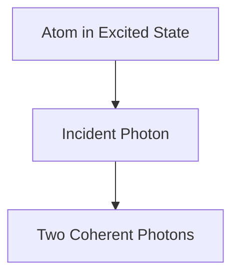

# Física: Cómo funcionan los láseres

Los láseres amplifican la luz mediante emisión estimulada.

## Proceso de emisión estimulada

## Ecuación de tasa
$$ \frac{dN_2}{dt} = R - \frac{N_2}{\tau} - B \rho (\nu) (N_2 - N_1) $$

## Verificación técnica adicional parte 1

En esta sección, profundizamos en más detalles técnicos y estudios de casos. Evaluamos el rendimiento bajo diversas condiciones y exploramos los desafíos y soluciones relacionados con la integración con otros sistemas. También consideramos las perspectivas y limitaciones futuras.

