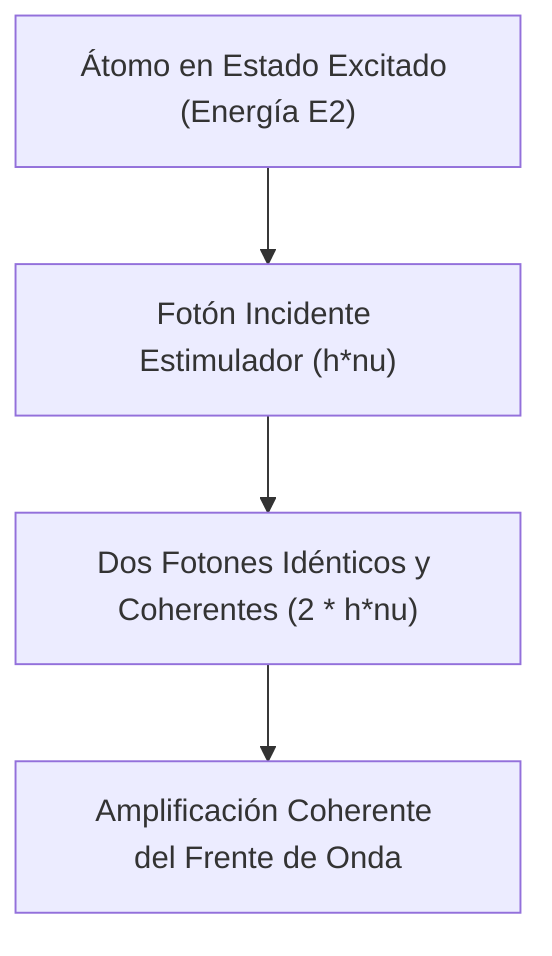

# Física: Cómo Funciona el Láser - Emisión Estimulada, Inversión de Población y Amplificación Óptica

En la sociedad contemporánea, el láser se ha convertido en una tecnología angular e imprescindible. Desde las redes de fibra óptica submarinas que canalizan el tráfico global de Internet y los lectores de códigos de barras, hasta las intervenciones quirúrgicas de corrección visual, el corte industrial de alta precisión y los sensores LiDAR de los vehículos autónomos, la tecnología láser sustenta los sectores productivos más avanzados.

A pesar de su ubicuidad, pocas personas conocen con precisión el origen del término **LÁSER** o los procesos cuánticos que rigen su funcionamiento. LÁSER es un acrónimo de **"Light Amplification by Stimulated Emission of Radiation"** (Amplificación de Luz por Emisión Estimulada de Radiación).

En este artículo abordamos los principios físicos del láser a través de sus tres pilares fundamentales: la **Emisión Estimulada (Stimulated Emission)**, la **Inversión de Población (Population Inversion)** y el **Resonador Óptico (Optical Resonator)**.

## 1. Interacción entre Luz y Materia: Los Tres Procesos de Einstein

Para entender la generación del haz láser, es necesario examinar cómo interactúan los fotones con los átomos. En 1917, Albert Einstein demostró que dicha interacción se rige por tres procesos cuánticos fundamentales:

### Absorción (Absorption)
Cuando un átomo se encuentra en su nivel de menor energía (estado fundamental: $E_1$), la llegada de un fotón con energía exacta $h\nu = E_2 - E_1$ (donde $h$ es la constante de Planck y $\nu$ la frecuencia de la onda) provoca que el electrón absorba la energía del fotón y salte al nivel superior excitado ($E_2$).

### Emisión Espontánea (Spontaneous Emission)
Un átomo en estado excitado ($E_2$) es inestable. Transcurrido un tiempo de vida característico, el átomo decae espontáneamente al estado inferior ($E_1$), liberando un fotón de energía $E_2 - E_1$. Los fotones emitidos espontáneamente poseen direcciones espaciales, fases iniciales y estados de polarización completamente aleatorios. Esta es la luz incoherente que emiten las bombillas incandescentes, los tubos fluorescentes y el Sol.

### Emisión Estimulada (Stimulated Emission)
Este es el proceso nuclear que hace posible el láser. Si un átomo se encuentra ya en el estado excitado $E_2$ y un fotón incidente con energía idéntica a $E_2 - E_1$ pasa en su proximidad, el campo electromagnético del fotón estimula al átomo para que decaiga inmediatamente al estado fundamental emitiendo un segundo fotón.

Lo extraordinario de la emisión estimulada es que el fotón generado es un **clon cuántico perfecto** del fotón estimulador: posee **la misma longitud de onda, la misma fase, la misma dirección de propagación y la misma polarización**. De este modo, un solo fotón incidente da lugar a dos fotones idénticos y perfectamente coherentes, produciendo la amplificación neta de la luz.

```mermaid
flowchart TD
    A["Átomo en Estado Excitado (Energía E2)"] --> B["Fotón Incidente Estimulador (h*nu)"]
    B --> C["Dos Fotones Idénticos y Coherentes (2 * h*nu)"]
    C --> D["Amplificación Coherente del Frente de Onda"]
```

## 2. Inversión de Población (Population Inversion): Condición Vital para la Amplificación

Si la emisión estimulada multiplica fotones, ¿por qué los objetos comunes en reposo no emiten rayos láser espontáneamente?

En condiciones ordinarias de equilibrio térmico, la distribución de los átomos en los diferentes niveles de energía sigue la **distribución de Boltzmann**. El número de átomos en el estado fundamental de baja energía ($N_1$) es inmensamente superior al número de átomos en el estado excitado ($N_2$), es decir, $N_1 \gg N_2$.
Bajo este régimen, la probabilidad de que un fotón sea reabsorbido por un átomo en estado fundamental supera con creces la probabilidad de emisión estimulada, haciendo que la luz se atenúe exponencialmente al atravesar la materia.

Para obtener una amplificación neta de luz (oscilación láser), es obligatorio revertir este equilibrio y lograr un estado fuera del equilibrio térmico donde **la población en el nivel superior excitado supere a la del nivel inferior ($N_2 > N_1$)**. Esta condición se denomina **Inversión de Población (Population Inversion)**.

### Mecanismos de Bombeo (Pumping)
Dado que la inversión de población viola el equilibrio térmico natural, se debe inyectar energía externa continua para forzar a los electrones hacia los niveles energéticos superiores. Este aporte energético se denomina **bombeo**. Entre los métodos más habituales se encuentran:
- **Bombeo Óptico**: Empleo de lámparas de destello de xenón o diodos láser auxiliares (habitual en láseres de estado sólido como el Nd:YAG o rubí).
- **Bombeo Eléctrico (Descarga y Corriente)**: Aplicación de una descarga de alto voltaje en tubos de gas (como en láseres de He-Ne o $\text{CO}_2$) o inyección de corriente eléctrica directa en uniones p-n de semiconductores.
- **Bombeo Químico**: Explotación de la energía desprendida en reacciones químicas fuertemente exotérmicas.

### Sistemas de Tres y Cuatro Niveles
Para sostener la inversión de población de manera eficiente, los medios de ganancia se articulan en configuraciones de tres o cuatro niveles energéticos:

* **Sistema de Tres Niveles (ej. Láser de Rubí)**:
  Los átomos son bombeados desde el estado fundamental $E_1$ al nivel superior $E_3$, decayendo rápidamente sin emisión de radiación térmica al nivel intermedio metaestable $E_2$. La emisión láser ocurre entre $E_2$ y el estado fundamental $E_1$. Dado que el nivel inferior del láser es el estado fundamental donde reside la mayoría de los átomos, se necesita excitar a más del 50% de todos los átomos del cristal solo para alcanzar el umbral de transparencia ($N_2 = N_1$), lo que exige potencias de bombeo colosales.

* **Sistema de Cuatro Niveles (ej. Nd:YAG, He-Ne)**:
  Los átomos se bombean de $E_0$ a $E_3$, decaen al nivel metaestable superior $E_2$, realizan la transición estimulada hacia el nivel inferior $E_1$, y desde allí decaen de forma ultrarrápida al estado base $E_0$. Como el nivel $E_1$ está situado muy por encima del nivel fundamental, se encuentra prácticamente desierto a temperatura ambiente ($N_1 \approx 0$). De este modo, basta excitar una pequeña fracción de átomos hacia $E_2$ para generar de inmediato la condición $N_2 > N_1$, logrando una eficiencia energética incomparablemente superior.

## 3. El Resonador Óptico: Confinamiento, Retroalimentación y Oscilación

La inversión de población crea un medio amplificador, pero un único paso de la luz a través de él produce una ganancia reducida. Para convertir el amplificador en un oscilador continuo que emita un haz colimado de alta potencia, se requiere un bucle de retroalimentación óptica positiva: el **Resonador Óptico (Cavidad Óptica)**.

El resonador consta de dos espejos enfrentados en los extremos del medio activo alineados con el eje óptico:
1. **Espejo Total (High Reflector)**: Presenta una reflectividad cercana al 100%.
2. **Espejo de Salida o Acoplador de Salida (Output Coupler)**: Refleja la mayor parte de la luz hacia el interior (95%〜99%) para retroalimentar la amplificación y transmite una pequeña fracción (1%〜5%), que constituye el haz láser útil.

### El Ciclo de Oscilación
1. Al activarse el bombeo y lograrse la inversión de población, se originan fotones iniciales por emisión espontánea.
2. Aquellos fotones que viajan exactamente paralelos al eje óptico estimulan la emisión de nuevos fotones idénticos a su paso por el medio.
3. Al alcanzar los extremos, los espejos reflejan el haz, haciéndolo transitar una y otra vez por el cristal o gas activo.
4. En cada trayecto de ida y vuelta, la emisión estimulada multiplica exponencialmente los fotones de idéntica fase y frecuencia.
5. El haz coherente emerge a través del espejo semitransparente, formando el **haz láser continuo y monocromático**.

### Umbral de Oscilación y Ecuaciones de Tasa

Para que se inicie y mantenga la oscilación láser, la ganancia óptica por ciclo debe superar la totalidad de las pérdidas de la cavidad (transmisión, absorción, dispersión). Este punto crítico se denomina **Umbral Láser (Laser Threshold)**.

La dinámica cuántica entre la densidad de población atómica y la densidad de fotones se describe mediante las **Ecuaciones de Tasa (Rate Equations)**:

$$ \frac{dN_2}{dt} = R_p - \frac{N_2}{\tau} - B \rho(\nu) (N_2 - N_1) $$

Donde:
- $N_2, N_1$ son las densidades poblacionales de los niveles superior e inferior,
- $R_p$ es la tasa de bombeo externo,
- $\tau$ es la vida media de emisión espontánea del nivel superior,
- $B$ es el coeficiente de Einstein para la emisión estimulada,
- $\rho(\nu)$ es la densidad de energía de radiación en la cavidad.

La resolución de estas ecuaciones permite determinar con exactitud la potencia de umbral, la potencia óptica de salida en régimen continuo y las oscilaciones de relajación.

## 4. Las Cuatro Propiedades Singulares de la Radiación Láser

Gracias a la clonación cuántica de fotones y a la selectividad espacial de la cavidad óptica, la luz láser exhibe cuatro propiedades incomparables:

1. **Monocromaticidad (Monochromaticity)**:
   Al originarse entre transiciones cuánticas discretas muy definidas, el ancho de banda espectral ($\Delta\lambda$) es extraordinariamente estrecho, produciendo un color de pureza espectral inalcanzable para fuentes térmicas.
2. **Direccionalidad (Directivity)**:
   Solo los fotones que viajan en rigurosa trayectoria axial se amplifican repetidamente. La divergencia del haz es prácticamente nula; un haz dirigido a la Luna tras recorrer casi 400.000 km apenas se expande unos pocos kilómetros.
3. **Coherencia Espacial y Temporal (Coherence)**:
   Todos los fotones avanzan sincronizados en fase. La **coherencia espacial** permite que el frente de onda conserve uniformidad en toda su sección transversal (base de la holografía tridimensional); la **coherencia temporal** mantiene la correlación de fase en grandes distancias, permitiendo la detección de ondas gravitacionales en observatorios como LIGO.
4. **Elevada Brillo y Densidad de Energía (High Intensity)**:
   Su coherencia permite enfocar el haz con lentes hasta alcanzar el límite de difracción (un punto del tamaño de una longitud de onda, $\sim 1\ \mu\text{m}$). Concentrando densidades de gigavatios por centímetro cuadrado, corta titanio con facilidad o desencadena reacciones de fusión nuclear controlada.

## 5. Tecnologías Láser de Vanguardia y Perspectivas Futuras

La investigación en ciencia de materiales ha diversificado los emisores láser en múltiples arquitecturas:

- **Láseres de Diodo Semiconductor**: Extremadamente compactos y con rendimientos de conversión eléctrica superiores al 50%. Se emplean de forma masiva en telecomunicaciones y electrónica de consumo.
- **Láseres de Fibra**: Utilizan fibras de sílice dopadas con tierras raras (itrio, iterbio) como medio de ganancia. Su refrigeración óptima y potencias continuas multimercado los han consolidado como el estándar hegemónico en el corte y soldadura industrial.
- **Láseres de Pulsos Ultracortos (Física de Femtosegundos y Atosegundos)**:
  Mediante el bloqueo de modos (Mode-locking), la energía luminosa se comprime en pulsos de femtosegundos ($10^{-15}\text{ s}$) o atosegundos ($10^{-18}\text{ s}$). Dado que el pulso finaliza antes de que el calor pueda transmitirse a la red cristalina contigua ("ablación en frío"), se emplean en cirugía ocular (SMILE) y en el corte de microchips sin daño térmico. En 2023, el Premio Nobel de Física reconoció los avances en pulsos de atosegundos por permitir filmar el movimiento de electrones en átomos en tiempo real.

## Conclusión

Desde la predicción teórica de Einstein en 1917 hasta el primer láser de rubí encendido por Theodore Maiman en 1960, el láser simboliza uno de los mayores hitos de la física moderna. La armonía entre los estados cuánticos del átomo, la inversión de población y la retroalimentación resonante dota a la humanidad de una herramienta de luz sin igual para transformar la ciencia y la industria.
