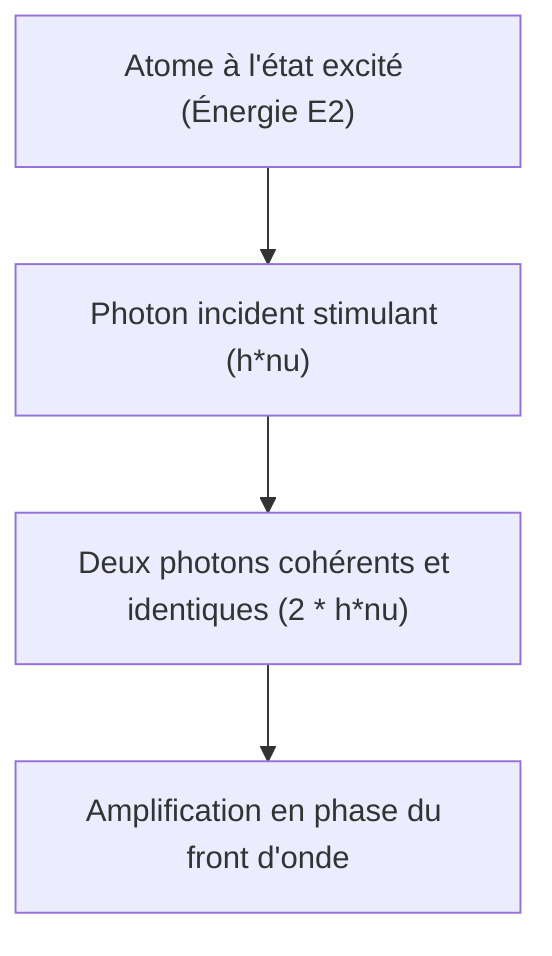

# Physique : Principes du Laser - Émission Stimulée, Inversion de Population et Amplification Optique

Dans notre société moderne, le laser est devenu une technologie indispensable et omniprésente. Qu'il s'agisse des autoroutes de fibres optiques qui irriguent l'Internet mondial, des scanners de codes-barres, des bistouris chirurgicaux, des opérations de correction de la vision au laser, de la découpe industrielle des métaux ou des capteurs LiDAR indispensables aux véhicules autonomes, la technologie laser irrigue l'ensemble de l'appareil productif contemporain.

Pourtant, peu de personnes connaissent la signification exacte de l'acronyme **LASER** ou les mécanismes microscopiques de physique quantique qui le sous-tendent. LASER signifie **« Light Amplification by Stimulated Emission of Radiation »** (Amplification de la lumière par émission stimulée de rayonnement).

Cet article présente une analyse approfondie des principes physiques du laser, articulée autour de ses trois piliers fondateurs : **l'Émission Stimulée**, **l'Inversion de Population** et **la Cavité Résonnante Optique**.

## 1. Interaction Lumière-Matière : Les Trois Processus Fondamentaux d'Einstein

Pour comprendre le fonctionnement d'un laser, il convient d'analyser la façon dont les photons interagissent avec les électrons atomiques. Dès 1917, Albert Einstein a démontré dans sa théorie quantique du rayonnement que l'interaction entre lumière et matière est régie par trois processus microscopiques majeurs :

### Absorption
Lorsqu'un atome se trouve sur un niveau d'énergie fondamental ($E_1$), un photon incident possédant une énergie rigoureusement égale à $h\nu = E_2 - E_1$ ($h$ étant la constante de Planck et $\nu$ la fréquence de l'onde) peut être absorbé. L'atome capte cette énergie et franchit le saut quantique vers l'état excité ($E_2$).

### Émission Spontanée (Spontaneous Emission)
Un atome situé dans un état excité ($E_2$) est intrinsèquement instable. Même en l'absence de toute perturbation extérieure, il retombe spontanément après une durée de vie moyenne vers l'état inférieur ($E_1$) en émettant un photon d'énergie $E_2 - E_1$. Ce photon est émis dans une direction spatiale imprévisible, avec une phase et une polarisation aléatoires. C'est cette émission incohérente qui engendre la lumière des ampoules classiques, des tubes néon et du Soleil.

### Émission Stimulée (Stimulated Emission)
Ce processus constitue le cœur battant du laser. Si un atome se trouve déjà dans l'état excité $E_2$ et qu'un photon incident possédant l'énergie exacte $E_2 - E_1$ passe à proximité, le champ électromagnétique de ce photon va stimuler l'atome excité, provoquant sa désexcitation immédiate vers $E_1$.

L'atome libère alors un second photon qui s'avère être un **clone quantique parfait** du photon incident : il possède **la même longueur d'onde, la même phase, la même direction de propagation et le même état de polarisation**. Un photon incident donne ainsi naissance à deux photons identiques et parfaitement cohérents, réalisant une amplification optique nette.

## 2. L'Inversion de Population : Condition Préalable à l'Amplification

Puisque l'émission stimulée permet de cloner les photons, pourquoi la matière ordinaire n'émet-elle pas spontanément des rayons laser ?

À l'équilibre thermodynamique standard, la répartition des atomes sur les différents niveaux d'énergie obéit rigoureusement à la **loi de distribution de Boltzmann**. La population atomique sur le niveau fondamental de basse énergie ($N_1$) est toujours immensément supérieure à la population sur le niveau excité ($N_2$), soit $N_1 \gg N_2$.
Dans ces conditions, lorsqu'un faisceau lumineux traverse un milieu, la probabilité d'absorption résonnante l'emporte massivement sur celle d'émission stimulée, provoquant une atténuation exponentielle de la lumière.

Pour obtenir une amplification optique nette (oscillation laser), il faut obligatoirement briser cet équilibre thermique et créer une situation hors équilibre dans laquelle **le nombre d'atomes à l'état excité dépasse le nombre d'atomes à l'état fondamental ($N_2 > N_1$)**. Cet état s'appelle **l'Inversion de Population (Population Inversion)**.

### Mécanismes de Pompage (Pumping)
Pour créer et maintenir l'inversion de population, un apport continu d'énergie externe est indispensable : c'est le « pompage ». Plusieurs méthodes sont couramment employées :
- **Pompage Optique** : Utilisation de lampes flash puissantes ou de diodes laser (fréquent pour les lasers solides comme le rubis ou le Nd:YAG).
- **Pompage Électrique (Décharge ou Injection)** : Application d'une décharge haute tension dans un gaz (He-Ne, $\text{CO}_2$) ou injection d'un courant de polarisation directe à travers une jonction p-n semi-conductrice.
- **Pompage Chimique** : Exploitation de l'énergie thermique et radiative dégagée lors de réactions chimiques violentes.

### Systèmes à Trois et Quatre Niveaux
Pour optimiser l'inversion de population, les milieux à gain mettent en œuvre des configurations d'énergie à 3 ou 4 niveaux :

* **Système à Trois Niveaux (ex. Laser à Rubis)** :
  Les atomes sont pompés du niveau fondamental $E_1$ vers le niveau supérieur $E_3$, puis retombent très rapidement par transition non radiative (chaleur) sur un état métastable intermédiaire $E_2$. L'émission laser a lieu entre $E_2$ et l'état fondamental $E_1$. Comme le niveau bas est le niveau fondamental où réside la totalité des atomes au repos, il est nécessaire d'exciter plus de la moitié de l'ensemble des atomes du cristal pour atteindre le seuil de transparence ($N_2 = N_1$), ce qui requiert des puissances de pompage considérables.

* **Système à Quatre Niveaux (ex. Nd:YAG, He-Ne)** :
  Les atomes sont pompés de $E_0$ vers $E_3$, retombent sur le niveau métastable $E_2$, effectuent la transition laser vers le niveau $E_1$, puis se désexcitent très vite vers le niveau fondamental $E_0$. Comme le niveau bas $E_1$ est situé au-dessus du niveau fondamental thermique, il est pratiquement vide à température ambiante ($N_1 \approx 0$). Dès lors, un pompage modéré suffit à instaurer la condition $N_2 > N_1$, offrant un rendement énergétique nettement supérieur.

## 3. La Cavité Résonnante Optique : Rétroaction et Oscillation

L'inversion de population confère au milieu des propriétés d'amplificateur optique. Cependant, lors d'un passage unique dans le milieu, l'amplification reste modeste. Pour convertir cet amplificateur en un oscillateur produisant un faisceau continu puissant et directif, il faut confiner la lumière dans une boucle de rétroaction positive : la **Cavité Résonnante Optique (Optical Resonator)**.

Cette cavité est formée de deux miroirs positionnés de part et d'autre du milieu actif selon l'axe optique :
1. **Miroir à Réflectivité Maximale (High Reflector)** : Réflectivité proche de 100 %.
2. **Miroir Semi-Réfléchissant / Coupleur de Sortie (Output Coupler)** : Réfléchit l'essentiel de la lumière vers la cavité (95 % à 99 %) et laisse échapper une petite fraction (1 % à 5 %), qui constitue le faisceau laser émis vers l'extérieur.

### Cycle d'Oscillation
1. Dès l'amorçage du pompage, l'inversion de population génère les premiers photons par émission spontanée.
2. Les photons émis parallèlement à l'axe optique traversent le milieu et déclenchent des cascades d'émission stimulée.
3. Arrivée aux extrémités, la lumière est renvoyée par les miroirs pour retraverser le milieu actif.
4. À chaque aller-retour, l'émission stimulée multiplie exponentiellement le nombre de photons partageant la même fréquence et la même phase.
5. Une fraction constante s'échappe par le miroir semi-transparent sous forme de **faisceau laser** puissant et cohérent.

### Seuil Laser et Équations de Taux

L'émission laser ne s'établit que si le gain optique par aller-retour compense l'ensemble des pertes de la cavité (transmission, diffusion, absorption). Ce seuil s'appelle le **Seuil d'Oscillation Laser (Laser Threshold)**.

L'évolution couplée des populations atomiques et de la densité de photons est modélisée par les **Équations de Taux (Rate Equations)** :

$$ \frac{dN_2}{dt} = R_p - \frac{N_2}{\tau} - B \rho(\nu) (N_2 - N_1) $$

Où :
- $N_2, N_1$ sont les densités de population des niveaux concernés,
- $R_p$ est le taux volumique de pompage,
- $\tau$ est la durée de vie radiative d'émission spontanée,
- $B$ est le coefficient d'Einstein pour l'émission stimulée,
- $\rho(\nu)$ est la densité volumique d'énergie du rayonnement dans la cavité.

La résolution de ces équations différentielles détermine la puissance de seuil, la puissance d'émission stable et les régimes d'oscillations de relaxation.

## 4. Les Quatre Propriétés Remarquables du Faisceau Laser

Grâce à la cohérence de l'émission stimulée et à la géométrie de la cavité résonnante, le faisceau laser possède quatre caractéristiques physiques hors du commun :

1. **Monochromaticité (Monochromaticity)** :
   La transition quantique intervenant entre deux niveaux très précis, la largeur spectrale ($\Delta\lambda$) est extrêmement étroite, conférant à la lumière une pureté de couleur inégalable.
2. **Directivité (Directivity)** :
   Seuls les modes optiques se propageant selon l'axe longitudinal survivent aux réflexions multiples. Le faisceau présente ainsi une divergence angulaire minime, lui permettant d'atteindre la Lune après 384 000 km avec une tache de quelques kilomètres seulement.
3. **Cohérence Temporelle et Spatiale (Coherence)** :
   Tous les photons oscillent rigoureusement en phase. La **cohérence spatiale** assure un front d'onde uniforme sur toute la section du faisceau (fondement de l'holographie) ; la **coherénce temporelle** maintient la stabilité de phase sur de très longues distances, permettant la mesure d'ondes gravitationnelles par interférométrie (LIGO/Virgo).
4. **Focalisation et Densité d'Énergie Élevée (High Intensity)** :
   La cohérence permet de focaliser le faisceau en un point de dimension micrométrique ($\sim 1\ \mu\text{m}$), atteignant des densités de puissance de l'ordre du gigawatt par centimètre carré, capables de sublimer les métaux ou d'initier la fusion nucléaire par confinement inertiel.

## 5. Frontières Technologiques et Perspectives d'Avenir

Les progrès de la physique de la matière condensée ont permis l'éclosion de nombreuses familles de lasers :

- **Lasers à Semi-Conducteurs (Diodes Laser)** : Extrêmement compacts, avec un rendement supérieur à 50 %, ils sont au cœur des télécommunications optiques et de l'électronique grand public.
- **Lasers à Fibre** : Utilisent des fibres dopées aux terres rares (ytterbium, erbium) comme milieu à gain. Leur excellente dissipation thermique et leurs puissances continues de plusieurs dizaines de kilowatts en font la référence absolue pour le soudage et la découpe industrielle.
- **Lasers à Impulsions Ultracourtes (Femtoseconde et Attoseconde)** :
  Grâce aux techniques de verrouillage de modes (Mode-locking), l'énergie est compressée dans des impulsions de quelques femtosecondes ($10^{-15}\text{ s}$) ou attosecondes ($10^{-18}\text{ s}$). La durée d'interaction étant plus courte que le temps de diffusion thermique, l'usinage s'effectue sans dommage thermique (« ablation à froid »), trouvant une application majeure en chirurgie oculaire (SMILE) et dans la gravure de circuits intégrés. Le prix Nobel de physique 2023 a récompensé les pionniers de la physique attoseconde pour avoir rendu possible l'observation directe du mouvement des électrons au sein des atomes.

## Conclusion

De la prédiction théorique formulée par Albert Einstein en 1917 jusqu'au premier faisceau allumé par Theodore Maiman en 1960, le laser illustre le triomphe de la physique quantique appliquée. La maîtrise des états énergétiques atomiques, l'inversion de population et le confinement résonnant continuent de repousser les frontières de la science moderne et de l'ingénierie.
