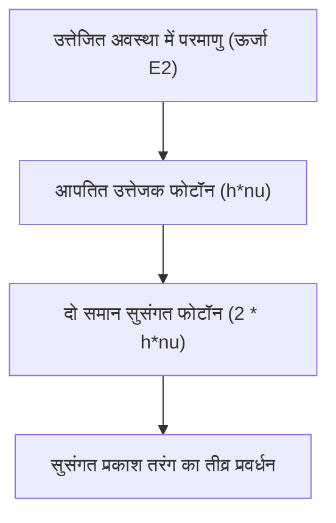

# भौतिकी: लेजर कैसे काम करता है - उद्दीप्त उत्सर्जन, जनसंख्या व्युत्क्रमण और प्रकाश प्रवर्धन

आधुनिक तकनीकी सभ्यता में लेजर एक अनिवार्य आधारशिला बन चुका है। वैश्विक इंटरनेट डेटा को ले जाने वाले ऑप्टिकल फाइबर नेटवर्क और सुपरमार्केट बारकोड स्कैनर से लेकर आंखों की लेसिक सर्जरी, धातु काटने की सटीक मशीनें और स्वायत्त वाहनों के LiDAR सेंसर तक, लेजर तकनीक आधुनिक उद्योग के केंद्र में स्थित है।

इसके व्यापक उपयोग के बावजूद, बहुत कम लोग जानते हैं कि **LASER** शब्द का वास्तव में क्या अर्थ है और इसके पीछे कौन से क्वांटम सिद्धांत काम करते हैं। LASER वास्तव में **"Light Amplification by Stimulated Emission of Radiation"** (विकिरण के उद्दीप्त उत्सर्जन द्वारा प्रकाश का प्रवर्धन) का संक्षिप्त रूप है।

इस लेख में, हम लेजर भौतिकी के तीन प्रमुख आधार स्तंभों—**उद्दीप्त उत्सर्जन (Stimulated Emission)**, **जनसंख्या व्युत्क्रमण (Population Inversion)**, और **ऑप्टिकल गुहा (Optical Resonator)**—का विस्तृत और वैज्ञानिक विश्लेषण करेंगे।

## 1. प्रकाश और परमाणु की परस्पर क्रिया: आइंस्टीन की तीन प्रक्रियाएं

लेजर की कार्यप्रणाली को समझने के लिए, हमें यह देखना होगा कि फोटॉन परमाणुओं के साथ कैसे क्रिया करते हैं। 1917 में अल्बर्ट आइंस्टीन ने स्पष्ट किया कि प्रकाश और पदार्थ के बीच परस्पर क्रिया तीन बुनियादी प्रक्रियाओं द्वारा नियंत्रित होती है:

### अवशोषण (Absorption)
जब कोई परमाणु अपनी निम्न ऊर्जा अवस्था (मूल अवस्था: $E_1$) में होता है, और उस पर ठीक $h\nu = E_2 - E_1$ ऊर्जा वाला फोटॉन गिरता है ($h$ प्लांक नियतांक है और $\nu$ आवृत्ति है), तो परमाणु फोटॉन को अवशोषित करके उच्च ऊर्जा स्तर (उत्तेजित अवस्था: $E_2$) में चला जाता है।

### स्वतःस्फूर्त उत्सर्जन (Spontaneous Emission)
उत्तेजित अवस्था ($E_2$) में स्थित परमाणु अस्थिर होता है। बिना किसी बाहरी प्रभाव के, वह एक निश्चित समय (आयु) के बाद स्वतः ही निम्न ऊर्जा स्तर ($E_1$) में लौट आता है और $E_2 - E_1$ ऊर्जा का फोटॉन उत्सर्जित करता है। यह फोटॉन यादृच्छिक दिशा, यादृच्छिक चरण (फेज) और यादृच्छिक ध्रुवीकरण के साथ निकलता है। सामान्य बल्ब और सूर्य का प्रकाश इसी प्रक्रिया से उत्पन्न होता है।

### उद्दीप्त उत्सर्जन (Stimulated Emission)
यह लेजर का सबसे महत्वपूर्ण भौतिक सिद्धांत है। जब कोई परमाणु पहले से ही उत्तेजित अवस्था $E_2$ में हो, और ठीक $E_2 - E_1$ ऊर्जा का एक बाहरी फोटॉन उसके पास से गुजरे, तो वह बाहरी फोटॉन उत्तेजित परमाणु को उत्तेजित अवस्था से नीचे गिरने के लिए 'उद्दीप्त' (प्रेरित) करता है।

इस प्रक्रिया में निकलने वाला नया फोटॉन मूल फोटॉन की **सटीक क्वांटम प्रतिलिपि (Clone)** होता है: उसकी **तरंग दैर्ध्य, चरण (Phase), दिशा और ध्रुवीकरण बिल्कुल समान** होते हैं। इस प्रकार, एक फोटॉन प्रवेश करता है और दो पूरी तरह से सुसंगत (Coherent) फोटॉन बाहर निकलते हैं, जिससे प्रकाश का शुद्ध प्रवर्धन होता है।

## 2. जनसंख्या व्युत्क्रमण (Population Inversion): प्रवर्धन की अनिवार्य शर्त

यदि उद्दीप्त उत्सर्जन से प्रकाश का प्रवर्धन हो सकता है, तो सामान्य वस्तुएं स्वतः ही लेजर प्रकाश क्यों नहीं उत्सर्जित करतीं?

सामान्य तापीय संतुलन की स्थिति में, विभिन्न ऊर्जा स्तरों में परमाणुओं की संख्या **बोल्ट्जमैन वितरण** के अनुसार होती है। निम्न ऊर्जा अवस्था ($N_1$) में परमाणुओं की संख्या उच्च उत्तेजित अवस्था ($N_2$) की तुलना में अत्यधिक अधिक होती है ($N_1 \gg N_2$)।
इस अवस्था में, जब प्रकाश माध्यम से गुजरता है, तो अवशोषण की संभावना उद्दीप्त उत्सर्जन की तुलना में बहुत अधिक होती है, जिससे प्रकाश धीरे-धीरे समाप्त हो जाता है।

प्रकाश का शुद्ध प्रवर्धन (लेजर दोलन) प्राप्त करने के लिए, इस संतुलन को तोड़ना होगा और एक ऐसी गैर-संतुलन स्थिति बनानी होगी जहाँ **उत्तेजित अवस्था में परमाणुओं की संख्या मूल अवस्था से अधिक हो जाए ($N_2 > N_1$)**। इस स्थिति को **जनसंख्या व्युत्क्रमण (Population Inversion)** कहा जाता है।

### पंपिंग (Pumping) विधियाँ
जनसंख्या व्युत्क्रमण को बनाए रखने के लिए बाहर से निरंतर ऊर्जा प्रदान करनी होती है, जिसे 'पंपिंग' कहा जाता है:
- **ऑप्टिकल पंपिंग**: फ्लैश लैंप या सहायक लेजर डायोड द्वारा ऊर्जा देना (रूबी या Nd:YAG जैसे ठोस लेजर में)।
- **इलेक्ट्रिकल पंपिंग**: गैसों में उच्च वोल्टेज डिस्चार्ज करना (जैसे He-Ne या $\text{CO}_2$ लेजर) या अर्धचालक डायोड में धारा प्रवाहित करना।
- **रासायनिक पंपिंग**: तीव्र रासायनिक अभिक्रियाओं से मुक्त ऊर्जा का उपयोग करना।

### तीन-स्तरीय और चार-स्तरीय लेजर प्रणालियाँ
जनसंख्या व्युत्क्रमण को कुशलतापूर्वक प्राप्त करने के लिए लेजर माध्यम में 3 या 4 ऊर्जा स्तरों का उपयोग किया जाता है:

* **तीन-स्तरीय प्रणाली (उदा. रूबी लेजर)**:
  परमाणुओं को $E_1$ से $E_3$ में पंप किया जाता है, जहाँ से वे तेजी से मध्यवर्ती मेटास्टेबल अवस्था $E_2$ में आ जाते हैं। लेजर उत्सर्जन $E_2$ और मूल स्तर $E_1$ के बीच होता है। चूंकि निचला स्तर मूल अवस्था ही है, जहाँ सामान्यतः सभी परमाणु होते हैं, इसलिए पारदर्शिता प्राप्त करने के लिए भी 50% से अधिक परमाणुओं को उत्तेजित करना पड़ता है, जिसके लिए बहुत अधिक ऊर्जा की आवश्यकता होती है।

* **चार-स्तरीय प्रणाली (उदा. Nd:YAG, He-Ne लेजर)**:
  परमाणुओं को $E_0$ से $E_3$ में पंप किया जाता है, वे $E_2$ पर आते हैं, लेजर उत्सर्जन द्वारा $E_1$ पर गिरते हैं, और फिर तेजी से $E_0$ पर लौट आते हैं। चूंकि निचला स्तर $E_1$ कमरे के तापमान पर लगभग खाली रहता है ($N_1 \approx 0$), इसलिए थोड़ी सी पंपिंग से ही $N_2 > N_1$ प्राप्त हो जाता है, जिससे यह प्रणाली कहीं अधिक कुशल बन जाती है।

## 3. ऑप्टिकल गुहा (Resonator): प्रकाश का संचयन और दोलन

जनसंख्या व्युत्क्रमण के माध्यम से प्रकाश प्रवर्धित हो सकता है, लेकिन माध्यम से एक बार गुजरने पर प्रवर्धन बहुत कम होता है। एक शक्तिशाली और निरंतर लेजर बीम प्राप्त करने के लिए, प्रकाश को माध्यम में बार-बार परावर्तित करने की व्यवस्था चाहिए, जिसे **ऑप्टिकल गुहा (Optical Resonator)** कहते हैं।

ऑप्टिकल गुहा माध्यम के दोनों सिरों पर संरेखित दो दर्पणों से बनी होती है:
1. **पूर्ण परावर्तक दर्पण (High Reflector)**: लगभग 100% प्रकाश परावर्तित करता है।
2. **आंशिक परावर्तक दर्पण (Output Coupler)**: अधिकांश प्रकाश (95% से 99%) को वापस माध्यम में भेजता है और एक छोटा हिस्सा (1% से 5%) लेजर बीम के रूप में बाहर निकालता है।

### दोलन चक्र
1. पंपिंग से जनसंख्या व्युत्क्रमण बनते ही कुछ परमाणु स्वतःस्फूर्त उत्सर्जन से फोटॉन छोड़ते हैं।
2. जो फोटॉन अक्ष के समानांतर चलते हैं, वे माध्यम से गुजरते हुए उद्दीप्त उत्सर्जन की झड़ी लगा देते हैं।
3. दर्पणों से टकराकर प्रकाश सैकड़ों बार आगे-पीछे दौड़ता है।
4. प्रत्येक चक्कर में समान फेज और तरंग दैर्ध्य के फोटॉन तेजी से बढ़ते हैं।
5. अंततः आंशिक परावर्तक से एक शक्तिशाली, सुसंगत **लेजर बीम** बाहर निकलती है।

### लेजर थ्रेसहोल्ड और दर समीकरण (Rate Equations)

लेजर तभी प्रारंभ होता है जब माध्यम का लाभ (Gain) गुहा के सभी नुकसानों (हानि) से अधिक हो जाता है। इस बिंदु को **लेजर थ्रेसहोल्ड (Laser Threshold)** कहते हैं।

परमाणु जनसंख्या और फोटॉन घनत्व के समय-निर्भर व्यवहार को **दर समीकरणों** द्वारा व्यक्त किया जाता है:

$$ \frac{dN_2}{dt} = R_p - \frac{N_2}{\tau} - B \rho(\nu) (N_2 - N_1) $$

जहाँ $N_2, N_1$ जनसंख्या घनत्व हैं, $R_p$ पंपिंग दर है, $\tau$ स्वतःस्फूर्त जीवनकाल है, $B$ आइंस्टीन गुणांक है, और $\rho(\nu)$ ऊर्जा घनत्व है।

## 4. लेजर प्रकाश की चार अनूठी विशेषताएं

उद्दीप्त उत्सर्जन और ऑप्टिकल गुहा के संयोजन से उत्पन्न लेजर प्रकाश में चार असाधारण गुण होते हैं:

1. **एकवर्णी प्रकृति (Monochromaticity)**:
   निश्चित क्वांटम स्तरों के बीच संक्रमण के कारण स्पेक्ट्रम की चौड़ाई ($\Delta\lambda$) अत्यंत संकीर्ण होती है, जो इसे अत्यंत शुद्ध रंग प्रदान करती है।
2. **दिशात्मकता (Directivity)**:
   केवल अक्षीय प्रकाश ही प्रवर्धित होता है, जिससे बीम का फैलाव लगभग शून्य होता है। चंद्रमा तक जाने पर भी यह बीम केवल कुछ किलोमीटर ही फैलती है।
3. **सुसंगतता (Coherence)**:
   सभी फोटॉन एक ही चरण में कंपन करते हैं। **स्थानिक सुसंगतता** से होलोग्राफी संभव होती है, और **कालिक सुसंगतता** से गुरुत्वाकर्षण तरंगों (LIGO) का सटीक मापन किया जाता है।
4. **अत्यधिक तीव्रता और फोकस करने की क्षमता (High Intensity)**:
   सुसंगतता के कारण इसे प्रकाश की तरंग दैर्ध्य के बराबर छोटे बिंदु ($\sim 1\ \mu\text{m}$) पर केंद्रित किया जा सकता है। यह भारी धातुओं को पिघलाने या परमाणु संलयन शुरू करने जितनी ऊर्जा उत्पन्न कर सकता है।

## 5. उन्नत लेजर तकनीक और भविष्य

पदार्थ विज्ञान की प्रगति ने विभिन्न प्रकार के लेजर विकसित किए हैं:

- **सेमीकंडक्टर लेजर डायोड**: अत्यधिक छोटे और 50% से अधिक दक्षता वाले, ऑप्टिकल संचार की रीढ़ हैं।
- **फाइबर लेजर**: दुर्लभ-पृथ्वी तत्वों से युक्त ऑप्टिकल फाइबर का उपयोग करते हैं। बेहतर शीतलन और भारी शक्ति के कारण औद्योगिक वेल्डिंग और कटिंग में अग्रणी हैं।
- **अल्ट्राशॉर्ट पल्स लेजर (फेमटोसेकंड और एटोसेकंड भौतिकी)**:
  मोड-लॉकिंग द्वारा प्रकाश को फेमटोसेकंड ($10^{-15}\text{ s}$) या एटोसेकंड ($10^{-18}\text{ s}$) के पल्स में संकुचित किया जाता है। ऊष्मा फैलाव के बिना 'कोल्ड एब्लेशन' करने के कारण ये लेसिक सर्जरी और माइक्रोचिप कटिंग के लिए आदर्श हैं। 2023 का नोबेल पुरस्कार एटोसेकंड लेजर अग्रदूतों को दिया गया था, जिन्होंने परमाणुओं के भीतर इलेक्ट्रॉनों की वास्तविक समय की गति को रिकॉर्ड किया।

## निष्कर्ष

1917 में आइंस्टीन की सैद्धांतिक भविष्यवाणी से लेकर 1960 में थियोडोर मेमन द्वारा निर्मित पहले रूबी लेजर तक, लेजर क्वांटम भौतिकी की व्यावहारिक सफलता का सबसे बड़ा उदाहरण है। परमाणु ऊर्जा स्तरों का नियंत्रण, जनसंख्या व्युत्क्रमण और ऑप्टिकल फीडबैक का यह अद्भुत संयोजन आधुनिक विज्ञान और उद्योग को लगातार नई ऊंचाइयों पर ले जा रहा है।
