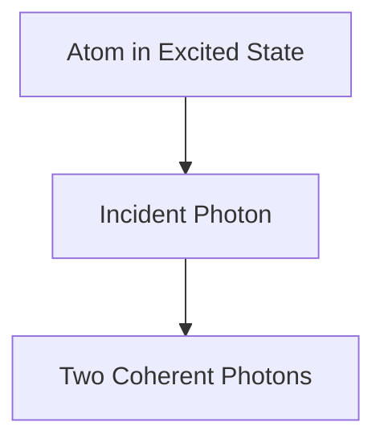

# Fisika: Cara Kerja Laser

Laser mengamplifikasi cahaya melalui emisi terstimulasi.

## Proses Emisi Terstimulasi

## Persamaan Laju
$$ \frac{dN_2}{dt} = R - \frac{N_2}{\tau} - B \rho (\nu) (N_2 - N_1) $$

## Bagian Verifikasi Teknis Tambahan 1

Di bagian ini, kami mempelajari lebih dalam tentang detail teknis lebih lanjut dan studi kasus. Mengevaluasi performa dalam berbagai kondisi serta mempertimbangkan masalah dan solusi terkait integrasi dengan sistem lain. Kami juga membahas prospek dan batasan di masa depan.

