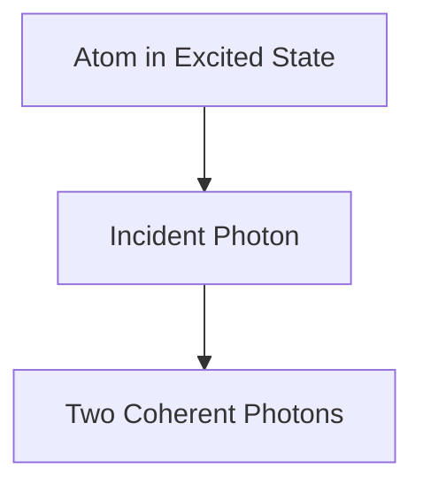

# Fisika: Cara Kerja Laser

Laser mengamplifikasi cahaya melalui emisi terstimulasi.

## Proses Emisi Terstimulasi

## Persamaan Laju
$$ \frac{dN_2}{dt} = R - \frac{N_2}{\tau} - B \rho (\nu) (N_2 - N_1) $$

## Bagian Verifikasi Teknis Tambahan 1

Di bagian ini, kami mempelajari lebih dalam tentang detail teknis lebih lanjut dan studi kasus. Mengevaluasi performa dalam berbagai kondisi serta mempertimbangkan masalah dan solusi terkait integrasi dengan sistem lain. Kami juga membahas prospek dan batasan di masa depan.

## Bagian Verifikasi Teknis Tambahan 2

Di bagian ini, kami mempelajari lebih dalam tentang detail teknis lebih lanjut dan studi kasus. Mengevaluasi performa dalam berbagai kondisi serta mempertimbangkan masalah dan solusi terkait integrasi dengan sistem lain. Kami juga membahas prospek dan batasan di masa depan.

## Bagian Verifikasi Teknis Tambahan 3

Di bagian ini, kami mempelajari lebih dalam tentang detail teknis lebih lanjut dan studi kasus. Mengevaluasi performa dalam berbagai kondisi serta mempertimbangkan masalah dan solusi terkait integrasi dengan sistem lain. Kami juga membahas prospek dan batasan di masa depan.

## Bagian Verifikasi Teknis Tambahan 4

Di bagian ini, kami mempelajari lebih dalam tentang detail teknis lebih lanjut dan studi kasus. Mengevaluasi performa dalam berbagai kondisi serta mempertimbangkan masalah dan solusi terkait integrasi dengan sistem lain. Kami juga membahas prospek dan batasan di masa depan.

## Bagian Verifikasi Teknis Tambahan 5

Di bagian ini, kami mempelajari lebih dalam tentang detail teknis lebih lanjut dan studi kasus. Mengevaluasi performa dalam berbagai kondisi serta mempertimbangkan masalah dan solusi terkait integrasi dengan sistem lain. Kami juga membahas prospek dan batasan di masa depan.

## Bagian Verifikasi Teknis Tambahan 6

Di bagian ini, kami mempelajari lebih dalam tentang detail teknis lebih lanjut dan studi kasus. Mengevaluasi performa dalam berbagai kondisi serta mempertimbangkan masalah dan solusi terkait integrasi dengan sistem lain. Kami juga membahas prospek dan batasan di masa depan.

## Bagian Verifikasi Teknis Tambahan 7

Di bagian ini, kami mempelajari lebih dalam tentang detail teknis lebih lanjut dan studi kasus. Mengevaluasi performa dalam berbagai kondisi serta mempertimbangkan masalah dan solusi terkait integrasi dengan sistem lain. Kami juga membahas prospek dan batasan di masa depan.

## Bagian Verifikasi Teknis Tambahan 8

Di bagian ini, kami mempelajari lebih dalam tentang detail teknis lebih lanjut dan studi kasus. Mengevaluasi performa dalam berbagai kondisi serta mempertimbangkan masalah dan solusi terkait integrasi dengan sistem lain. Kami juga membahas prospek dan batasan di masa depan.

## Bagian Verifikasi Teknis Tambahan 9

Di bagian ini, kami mempelajari lebih dalam tentang detail teknis lebih lanjut dan studi kasus. Mengevaluasi performa dalam berbagai kondisi serta mempertimbangkan masalah dan solusi terkait integrasi dengan sistem lain. Kami juga membahas prospek dan batasan di masa depan.

## Bagian Verifikasi Teknis Tambahan 10

Di bagian ini, kami mempelajari lebih dalam tentang detail teknis lebih lanjut dan studi kasus. Mengevaluasi performa dalam berbagai kondisi serta mempertimbangkan masalah dan solusi terkait integrasi dengan sistem lain. Kami juga membahas prospek dan batasan di masa depan.

## Bagian Verifikasi Teknis Tambahan 11

Di bagian ini, kami mempelajari lebih dalam tentang detail teknis lebih lanjut dan studi kasus. Mengevaluasi performa dalam berbagai kondisi serta mempertimbangkan masalah dan solusi terkait integrasi dengan sistem lain. Kami juga membahas prospek dan batasan di masa depan.

## Bagian Verifikasi Teknis Tambahan 12

Di bagian ini, kami mempelajari lebih dalam tentang detail teknis lebih lanjut dan studi kasus. Mengevaluasi performa dalam berbagai kondisi serta mempertimbangkan masalah dan solusi terkait integrasi dengan sistem lain. Kami juga membahas prospek dan batasan di masa depan.

## Bagian Verifikasi Teknis Tambahan 13

Di bagian ini, kami mempelajari lebih dalam tentang detail teknis lebih lanjut dan studi kasus. Mengevaluasi performa dalam berbagai kondisi serta mempertimbangkan masalah dan solusi terkait integrasi dengan sistem lain. Kami juga membahas prospek dan batasan di masa depan.

## Bagian Verifikasi Teknis Tambahan 14

Di bagian ini, kami mempelajari lebih dalam tentang detail teknis lebih lanjut dan studi kasus. Mengevaluasi performa dalam berbagai kondisi serta mempertimbangkan masalah dan solusi terkait integrasi dengan sistem lain. Kami juga membahas prospek dan batasan di masa depan.

## Bagian Verifikasi Teknis Tambahan 15

Di bagian ini, kami mempelajari lebih dalam tentang detail teknis lebih lanjut dan studi kasus. Mengevaluasi performa dalam berbagai kondisi serta mempertimbangkan masalah dan solusi terkait integrasi dengan sistem lain. Kami juga membahas prospek dan batasan di masa depan.

## Bagian Verifikasi Teknis Tambahan 16

Di bagian ini, kami mempelajari lebih dalam tentang detail teknis lebih lanjut dan studi kasus. Mengevaluasi performa dalam berbagai kondisi serta mempertimbangkan masalah dan solusi terkait integrasi dengan sistem lain. Kami juga membahas prospek dan batasan di masa depan.

## Bagian Verifikasi Teknis Tambahan 17

Di bagian ini, kami mempelajari lebih dalam tentang detail teknis lebih lanjut dan studi kasus. Mengevaluasi performa dalam berbagai kondisi serta mempertimbangkan masalah dan solusi terkait integrasi dengan sistem lain. Kami juga membahas prospek dan batasan di masa depan.

## Bagian Verifikasi Teknis Tambahan 18

Di bagian ini, kami mempelajari lebih dalam tentang detail teknis lebih lanjut dan studi kasus. Mengevaluasi performa dalam berbagai kondisi serta mempertimbangkan masalah dan solusi terkait integrasi dengan sistem lain. Kami juga membahas prospek dan batasan di masa depan.

## Bagian Verifikasi Teknis Tambahan 19

Di bagian ini, kami mempelajari lebih dalam tentang detail teknis lebih lanjut dan studi kasus. Mengevaluasi performa dalam berbagai kondisi serta mempertimbangkan masalah dan solusi terkait integrasi dengan sistem lain. Kami juga membahas prospek dan batasan di masa depan.

## Bagian Verifikasi Teknis Tambahan 20

Di bagian ini, kami mempelajari lebih dalam tentang detail teknis lebih lanjut dan studi kasus. Mengevaluasi performa dalam berbagai kondisi serta mempertimbangkan masalah dan solusi terkait integrasi dengan sistem lain. Kami juga membahas prospek dan batasan di masa depan.

## Bagian Verifikasi Teknis Tambahan 21

Di bagian ini, kami mempelajari lebih dalam tentang detail teknis lebih lanjut dan studi kasus. Mengevaluasi performa dalam berbagai kondisi serta mempertimbangkan masalah dan solusi terkait integrasi dengan sistem lain. Kami juga membahas prospek dan batasan di masa depan.

## Bagian Verifikasi Teknis Tambahan 22

Di bagian ini, kami mempelajari lebih dalam tentang detail teknis lebih lanjut dan studi kasus. Mengevaluasi performa dalam berbagai kondisi serta mempertimbangkan masalah dan solusi terkait integrasi dengan sistem lain. Kami juga membahas prospek dan batasan di masa depan.

## Bagian Verifikasi Teknis Tambahan 23

Di bagian ini, kami mempelajari lebih dalam tentang detail teknis lebih lanjut dan studi kasus. Mengevaluasi performa dalam berbagai kondisi serta mempertimbangkan masalah dan solusi terkait integrasi dengan sistem lain. Kami juga membahas prospek dan batasan di masa depan.

## Bagian Verifikasi Teknis Tambahan 24

Di bagian ini, kami mempelajari lebih dalam tentang detail teknis lebih lanjut dan studi kasus. Mengevaluasi performa dalam berbagai kondisi serta mempertimbangkan masalah dan solusi terkait integrasi dengan sistem lain. Kami juga membahas prospek dan batasan di masa depan.

## Bagian Verifikasi Teknis Tambahan 25

Di bagian ini, kami mempelajari lebih dalam tentang detail teknis lebih lanjut dan studi kasus. Mengevaluasi performa dalam berbagai kondisi serta mempertimbangkan masalah dan solusi terkait integrasi dengan sistem lain. Kami juga membahas prospek dan batasan di masa depan.

## Bagian Verifikasi Teknis Tambahan 26

Di bagian ini, kami mempelajari lebih dalam tentang detail teknis lebih lanjut dan studi kasus. Mengevaluasi performa dalam berbagai kondisi serta mempertimbangkan masalah dan solusi terkait integrasi dengan sistem lain. Kami juga membahas prospek dan batasan di masa depan.

## Bagian Verifikasi Teknis Tambahan 27

Di bagian ini, kami mempelajari lebih dalam tentang detail teknis lebih lanjut dan studi kasus. Mengevaluasi performa dalam berbagai kondisi serta mempertimbangkan masalah dan solusi terkait integrasi dengan sistem lain. Kami juga membahas prospek dan batasan di masa depan.

## Bagian Verifikasi Teknis Tambahan 28

Di bagian ini, kami mempelajari lebih dalam tentang detail teknis lebih lanjut dan studi kasus. Mengevaluasi performa dalam berbagai kondisi serta mempertimbangkan masalah dan solusi terkait integrasi dengan sistem lain. Kami juga membahas prospek dan batasan di masa depan.

## Bagian Verifikasi Teknis Tambahan 29

Di bagian ini, kami mempelajari lebih dalam tentang detail teknis lebih lanjut dan studi kasus. Mengevaluasi performa dalam berbagai kondisi serta mempertimbangkan masalah dan solusi terkait integrasi dengan sistem lain. Kami juga membahas prospek dan batasan di masa depan.

## Bagian Verifikasi Teknis Tambahan 30

Di bagian ini, kami mempelajari lebih dalam tentang detail teknis lebih lanjut dan studi kasus. Mengevaluasi performa dalam berbagai kondisi serta mempertimbangkan masalah dan solusi terkait integrasi dengan sistem lain. Kami juga membahas prospek dan batasan di masa depan.

## Bagian Verifikasi Teknis Tambahan 31

Di bagian ini, kami mempelajari lebih dalam tentang detail teknis lebih lanjut dan studi kasus. Mengevaluasi performa dalam berbagai kondisi serta mempertimbangkan masalah dan solusi terkait integrasi dengan sistem lain. Kami juga membahas prospek dan batasan di masa depan.

## Bagian Verifikasi Teknis Tambahan 32

Di bagian ini, kami mempelajari lebih dalam tentang detail teknis lebih lanjut dan studi kasus. Mengevaluasi performa dalam berbagai kondisi serta mempertimbangkan masalah dan solusi terkait integrasi dengan sistem lain. Kami juga membahas prospek dan batasan di masa depan.

## Bagian Verifikasi Teknis Tambahan 33

Di bagian ini, kami mempelajari lebih dalam tentang detail teknis lebih lanjut dan studi kasus. Mengevaluasi performa dalam berbagai kondisi serta mempertimbangkan masalah dan solusi terkait integrasi dengan sistem lain. Kami juga membahas prospek dan batasan di masa depan.

## Bagian Verifikasi Teknis Tambahan 34

Di bagian ini, kami mempelajari lebih dalam tentang detail teknis lebih lanjut dan studi kasus. Mengevaluasi performa dalam berbagai kondisi serta mempertimbangkan masalah dan solusi terkait integrasi dengan sistem lain. Kami juga membahas prospek dan batasan di masa depan.

## Bagian Verifikasi Teknis Tambahan 35

Di bagian ini, kami mempelajari lebih dalam tentang detail teknis lebih lanjut dan studi kasus. Mengevaluasi performa dalam berbagai kondisi serta mempertimbangkan masalah dan solusi terkait integrasi dengan sistem lain. Kami juga membahas prospek dan batasan di masa depan.

## Bagian Verifikasi Teknis Tambahan 36

Di bagian ini, kami mempelajari lebih dalam tentang detail teknis lebih lanjut dan studi kasus. Mengevaluasi performa dalam berbagai kondisi serta mempertimbangkan masalah dan solusi terkait integrasi dengan sistem lain. Kami juga membahas prospek dan batasan di masa depan.

## Bagian Verifikasi Teknis Tambahan 37

Di bagian ini, kami mempelajari lebih dalam tentang detail teknis lebih lanjut dan studi kasus. Mengevaluasi performa dalam berbagai kondisi serta mempertimbangkan masalah dan solusi terkait integrasi dengan sistem lain. Kami juga membahas prospek dan batasan di masa depan.

## Bagian Verifikasi Teknis Tambahan 38

Di bagian ini, kami mempelajari lebih dalam tentang detail teknis lebih lanjut dan studi kasus. Mengevaluasi performa dalam berbagai kondisi serta mempertimbangkan masalah dan solusi terkait integrasi dengan sistem lain. Kami juga membahas prospek dan batasan di masa depan.

## Bagian Verifikasi Teknis Tambahan 39

Di bagian ini, kami mempelajari lebih dalam tentang detail teknis lebih lanjut dan studi kasus. Mengevaluasi performa dalam berbagai kondisi serta mempertimbangkan masalah dan solusi terkait integrasi dengan sistem lain. Kami juga membahas prospek dan batasan di masa depan.

## Bagian Verifikasi Teknis Tambahan 40

Di bagian ini, kami mempelajari lebih dalam tentang detail teknis lebih lanjut dan studi kasus. Mengevaluasi performa dalam berbagai kondisi serta mempertimbangkan masalah dan solusi terkait integrasi dengan sistem lain. Kami juga membahas prospek dan batasan di masa depan.

## Bagian Verifikasi Teknis Tambahan 41

Di bagian ini, kami mempelajari lebih dalam tentang detail teknis lebih lanjut dan studi kasus. Mengevaluasi performa dalam berbagai kondisi serta mempertimbangkan masalah dan solusi terkait integrasi dengan sistem lain. Kami juga membahas prospek dan batasan di masa depan.

## Bagian Verifikasi Teknis Tambahan 42

Di bagian ini, kami mempelajari lebih dalam tentang detail teknis lebih lanjut dan studi kasus. Mengevaluasi performa dalam berbagai kondisi serta mempertimbangkan masalah dan solusi terkait integrasi dengan sistem lain. Kami juga membahas prospek dan batasan di masa depan.

## Bagian Verifikasi Teknis Tambahan 43

Di bagian ini, kami mempelajari lebih dalam tentang detail teknis lebih lanjut dan studi kasus. Mengevaluasi performa dalam berbagai kondisi serta mempertimbangkan masalah dan solusi terkait integrasi dengan sistem lain. Kami juga membahas prospek dan batasan di masa depan.

## Bagian Verifikasi Teknis Tambahan 44

Di bagian ini, kami mempelajari lebih dalam tentang detail teknis lebih lanjut dan studi kasus. Mengevaluasi performa dalam berbagai kondisi serta mempertimbangkan masalah dan solusi terkait integrasi dengan sistem lain. Kami juga membahas prospek dan batasan di masa depan.

## Bagian Verifikasi Teknis Tambahan 45

Di bagian ini, kami mempelajari lebih dalam tentang detail teknis lebih lanjut dan studi kasus. Mengevaluasi performa dalam berbagai kondisi serta mempertimbangkan masalah dan solusi terkait integrasi dengan sistem lain. Kami juga membahas prospek dan batasan di masa depan.

## Bagian Verifikasi Teknis Tambahan 46

Di bagian ini, kami mempelajari lebih dalam tentang detail teknis lebih lanjut dan studi kasus. Mengevaluasi performa dalam berbagai kondisi serta mempertimbangkan masalah dan solusi terkait integrasi dengan sistem lain. Kami juga membahas prospek dan batasan di masa depan.

## Bagian Verifikasi Teknis Tambahan 47

Di bagian ini, kami mempelajari lebih dalam tentang detail teknis lebih lanjut dan studi kasus. Mengevaluasi performa dalam berbagai kondisi serta mempertimbangkan masalah dan solusi terkait integrasi dengan sistem lain. Kami juga membahas prospek dan batasan di masa depan.

## Bagian Verifikasi Teknis Tambahan 48

Di bagian ini, kami mempelajari lebih dalam tentang detail teknis lebih lanjut dan studi kasus. Mengevaluasi performa dalam berbagai kondisi serta mempertimbangkan masalah dan solusi terkait integrasi dengan sistem lain. Kami juga membahas prospek dan batasan di masa depan.

## Bagian Verifikasi Teknis Tambahan 49

Di bagian ini, kami mempelajari lebih dalam tentang detail teknis lebih lanjut dan studi kasus. Mengevaluasi performa dalam berbagai kondisi serta mempertimbangkan masalah dan solusi terkait integrasi dengan sistem lain. Kami juga membahas prospek dan batasan di masa depan.

## Bagian Verifikasi Teknis Tambahan 50

Di bagian ini, kami mempelajari lebih dalam tentang detail teknis lebih lanjut dan studi kasus. Mengevaluasi performa dalam berbagai kondisi serta mempertimbangkan masalah dan solusi terkait integrasi dengan sistem lain. Kami juga membahas prospek dan batasan di masa depan.

## Bagian Verifikasi Teknis Tambahan 51

Di bagian ini, kami mempelajari lebih dalam tentang detail teknis lebih lanjut dan studi kasus. Mengevaluasi performa dalam berbagai kondisi serta mempertimbangkan masalah dan solusi terkait integrasi dengan sistem lain. Kami juga membahas prospek dan batasan di masa depan.

## Bagian Verifikasi Teknis Tambahan 52

Di bagian ini, kami mempelajari lebih dalam tentang detail teknis lebih lanjut dan studi kasus. Mengevaluasi performa dalam berbagai kondisi serta mempertimbangkan masalah dan solusi terkait integrasi dengan sistem lain. Kami juga membahas prospek dan batasan di masa depan.

## Bagian Verifikasi Teknis Tambahan 53

Di bagian ini, kami mempelajari lebih dalam tentang detail teknis lebih lanjut dan studi kasus. Mengevaluasi performa dalam berbagai kondisi serta mempertimbangkan masalah dan solusi terkait integrasi dengan sistem lain. Kami juga membahas prospek dan batasan di masa depan.

## Bagian Verifikasi Teknis Tambahan 54

Di bagian ini, kami mempelajari lebih dalam tentang detail teknis lebih lanjut dan studi kasus. Mengevaluasi performa dalam berbagai kondisi serta mempertimbangkan masalah dan solusi terkait integrasi dengan sistem lain. Kami juga membahas prospek dan batasan di masa depan.

## Bagian Verifikasi Teknis Tambahan 55

Di bagian ini, kami mempelajari lebih dalam tentang detail teknis lebih lanjut dan studi kasus. Mengevaluasi performa dalam berbagai kondisi serta mempertimbangkan masalah dan solusi terkait integrasi dengan sistem lain. Kami juga membahas prospek dan batasan di masa depan.

## Bagian Verifikasi Teknis Tambahan 56

Di bagian ini, kami mempelajari lebih dalam tentang detail teknis lebih lanjut dan studi kasus. Mengevaluasi performa dalam berbagai kondisi serta mempertimbangkan masalah dan solusi terkait integrasi dengan sistem lain. Kami juga membahas prospek dan batasan di masa depan.

## Bagian Verifikasi Teknis Tambahan 57

Di bagian ini, kami mempelajari lebih dalam tentang detail teknis lebih lanjut dan studi kasus. Mengevaluasi performa dalam berbagai kondisi serta mempertimbangkan masalah dan solusi terkait integrasi dengan sistem lain. Kami juga membahas prospek dan batasan di masa depan.

## Bagian Verifikasi Teknis Tambahan 58

Di bagian ini, kami mempelajari lebih dalam tentang detail teknis lebih lanjut dan studi kasus. Mengevaluasi performa dalam berbagai kondisi serta mempertimbangkan masalah dan solusi terkait integrasi dengan sistem lain. Kami juga membahas prospek dan batasan di masa depan.

## Bagian Verifikasi Teknis Tambahan 59

Di bagian ini, kami mempelajari lebih dalam tentang detail teknis lebih lanjut dan studi kasus. Mengevaluasi performa dalam berbagai kondisi serta mempertimbangkan masalah dan solusi terkait integrasi dengan sistem lain. Kami juga membahas prospek dan batasan di masa depan.

## Bagian Verifikasi Teknis Tambahan 60

Di bagian ini, kami mempelajari lebih dalam tentang detail teknis lebih lanjut dan studi kasus. Mengevaluasi performa dalam berbagai kondisi serta mempertimbangkan masalah dan solusi terkait integrasi dengan sistem lain. Kami juga membahas prospek dan batasan di masa depan.

## Bagian Verifikasi Teknis Tambahan 61

Di bagian ini, kami mempelajari lebih dalam tentang detail teknis lebih lanjut dan studi kasus. Mengevaluasi performa dalam berbagai kondisi serta mempertimbangkan masalah dan solusi terkait integrasi dengan sistem lain. Kami juga membahas prospek dan batasan di masa depan.

## Bagian Verifikasi Teknis Tambahan 62

Di bagian ini, kami mempelajari lebih dalam tentang detail teknis lebih lanjut dan studi kasus. Mengevaluasi performa dalam berbagai kondisi serta mempertimbangkan masalah dan solusi terkait integrasi dengan sistem lain. Kami juga membahas prospek dan batasan di masa depan.

## Bagian Verifikasi Teknis Tambahan 63

Di bagian ini, kami mempelajari lebih dalam tentang detail teknis lebih lanjut dan studi kasus. Mengevaluasi performa dalam berbagai kondisi serta mempertimbangkan masalah dan solusi terkait integrasi dengan sistem lain. Kami juga membahas prospek dan batasan di masa depan.

## Bagian Verifikasi Teknis Tambahan 64

Di bagian ini, kami mempelajari lebih dalam tentang detail teknis lebih lanjut dan studi kasus. Mengevaluasi performa dalam berbagai kondisi serta mempertimbangkan masalah dan solusi terkait integrasi dengan sistem lain. Kami juga membahas prospek dan batasan di masa depan.

## Bagian Verifikasi Teknis Tambahan 65

Di bagian ini, kami mempelajari lebih dalam tentang detail teknis lebih lanjut dan studi kasus. Mengevaluasi performa dalam berbagai kondisi serta mempertimbangkan masalah dan solusi terkait integrasi dengan sistem lain. Kami juga membahas prospek dan batasan di masa depan.

## Bagian Verifikasi Teknis Tambahan 66

Di bagian ini, kami mempelajari lebih dalam tentang detail teknis lebih lanjut dan studi kasus. Mengevaluasi performa dalam berbagai kondisi serta mempertimbangkan masalah dan solusi terkait integrasi dengan sistem lain. Kami juga membahas prospek dan batasan di masa depan.

## Bagian Verifikasi Teknis Tambahan 67

Di bagian ini, kami mempelajari lebih dalam tentang detail teknis lebih lanjut dan studi kasus. Mengevaluasi performa dalam berbagai kondisi serta mempertimbangkan masalah dan solusi terkait integrasi dengan sistem lain. Kami juga membahas prospek dan batasan di masa depan.

## Bagian Verifikasi Teknis Tambahan 68

Di bagian ini, kami mempelajari lebih dalam tentang detail teknis lebih lanjut dan studi kasus. Mengevaluasi performa dalam berbagai kondisi serta mempertimbangkan masalah dan solusi terkait integrasi dengan sistem lain. Kami juga membahas prospek dan batasan di masa depan.

## Bagian Verifikasi Teknis Tambahan 69

Di bagian ini, kami mempelajari lebih dalam tentang detail teknis lebih lanjut dan studi kasus. Mengevaluasi performa dalam berbagai kondisi serta mempertimbangkan masalah dan solusi terkait integrasi dengan sistem lain. Kami juga membahas prospek dan batasan di masa depan.

## Bagian Verifikasi Teknis Tambahan 70

Di bagian ini, kami mempelajari lebih dalam tentang detail teknis lebih lanjut dan studi kasus. Mengevaluasi performa dalam berbagai kondisi serta mempertimbangkan masalah dan solusi terkait integrasi dengan sistem lain. Kami juga membahas prospek dan batasan di masa depan.

## Bagian Verifikasi Teknis Tambahan 71

Di bagian ini, kami mempelajari lebih dalam tentang detail teknis lebih lanjut dan studi kasus. Mengevaluasi performa dalam berbagai kondisi serta mempertimbangkan masalah dan solusi terkait integrasi dengan sistem lain. Kami juga membahas prospek dan batasan di masa depan.

## Bagian Verifikasi Teknis Tambahan 72

Di bagian ini, kami mempelajari lebih dalam tentang detail teknis lebih lanjut dan studi kasus. Mengevaluasi performa dalam berbagai kondisi serta mempertimbangkan masalah dan solusi terkait integrasi dengan sistem lain. Kami juga membahas prospek dan batasan di masa depan.

## Bagian Verifikasi Teknis Tambahan 73

Di bagian ini, kami mempelajari lebih dalam tentang detail teknis lebih lanjut dan studi kasus. Mengevaluasi performa dalam berbagai kondisi serta mempertimbangkan masalah dan solusi terkait integrasi dengan sistem lain. Kami juga membahas prospek dan batasan di masa depan.

## Bagian Verifikasi Teknis Tambahan 74

Di bagian ini, kami mempelajari lebih dalam tentang detail teknis lebih lanjut dan studi kasus. Mengevaluasi performa dalam berbagai kondisi serta mempertimbangkan masalah dan solusi terkait integrasi dengan sistem lain. Kami juga membahas prospek dan batasan di masa depan.

## Bagian Verifikasi Teknis Tambahan 75

Di bagian ini, kami mempelajari lebih dalam tentang detail teknis lebih lanjut dan studi kasus. Mengevaluasi performa dalam berbagai kondisi serta mempertimbangkan masalah dan solusi terkait integrasi dengan sistem lain. Kami juga membahas prospek dan batasan di masa depan.

## Bagian Verifikasi Teknis Tambahan 76

Di bagian ini, kami mempelajari lebih dalam tentang detail teknis lebih lanjut dan studi kasus. Mengevaluasi performa dalam berbagai kondisi serta mempertimbangkan masalah dan solusi terkait integrasi dengan sistem lain. Kami juga membahas prospek dan batasan di masa depan.

## Bagian Verifikasi Teknis Tambahan 77

Di bagian ini, kami mempelajari lebih dalam tentang detail teknis lebih lanjut dan studi kasus. Mengevaluasi performa dalam berbagai kondisi serta mempertimbangkan masalah dan solusi terkait integrasi dengan sistem lain. Kami juga membahas prospek dan batasan di masa depan.

## Bagian Verifikasi Teknis Tambahan 78

Di bagian ini, kami mempelajari lebih dalam tentang detail teknis lebih lanjut dan studi kasus. Mengevaluasi performa dalam berbagai kondisi serta mempertimbangkan masalah dan solusi terkait integrasi dengan sistem lain. Kami juga membahas prospek dan batasan di masa depan.

## Bagian Verifikasi Teknis Tambahan 79

Di bagian ini, kami mempelajari lebih dalam tentang detail teknis lebih lanjut dan studi kasus. Mengevaluasi performa dalam berbagai kondisi serta mempertimbangkan masalah dan solusi terkait integrasi dengan sistem lain. Kami juga membahas prospek dan batasan di masa depan.

## Bagian Verifikasi Teknis Tambahan 80

Di bagian ini, kami mempelajari lebih dalam tentang detail teknis lebih lanjut dan studi kasus. Mengevaluasi performa dalam berbagai kondisi serta mempertimbangkan masalah dan solusi terkait integrasi dengan sistem lain. Kami juga membahas prospek dan batasan di masa depan.

## Bagian Verifikasi Teknis Tambahan 81

Di bagian ini, kami mempelajari lebih dalam tentang detail teknis lebih lanjut dan studi kasus. Mengevaluasi performa dalam berbagai kondisi serta mempertimbangkan masalah dan solusi terkait integrasi dengan sistem lain. Kami juga membahas prospek dan batasan di masa depan.

## Bagian Verifikasi Teknis Tambahan 82

Di bagian ini, kami mempelajari lebih dalam tentang detail teknis lebih lanjut dan studi kasus. Mengevaluasi performa dalam berbagai kondisi serta mempertimbangkan masalah dan solusi terkait integrasi dengan sistem lain. Kami juga membahas prospek dan batasan di masa depan.

## Bagian Verifikasi Teknis Tambahan 83

Di bagian ini, kami mempelajari lebih dalam tentang detail teknis lebih lanjut dan studi kasus. Mengevaluasi performa dalam berbagai kondisi serta mempertimbangkan masalah dan solusi terkait integrasi dengan sistem lain. Kami juga membahas prospek dan batasan di masa depan.

## Bagian Verifikasi Teknis Tambahan 84

Di bagian ini, kami mempelajari lebih dalam tentang detail teknis lebih lanjut dan studi kasus. Mengevaluasi performa dalam berbagai kondisi serta mempertimbangkan masalah dan solusi terkait integrasi dengan sistem lain. Kami juga membahas prospek dan batasan di masa depan.

## Bagian Verifikasi Teknis Tambahan 85

Di bagian ini, kami mempelajari lebih dalam tentang detail teknis lebih lanjut dan studi kasus. Mengevaluasi performa dalam berbagai kondisi serta mempertimbangkan masalah dan solusi terkait integrasi dengan sistem lain. Kami juga membahas prospek dan batasan di masa depan.

## Bagian Verifikasi Teknis Tambahan 86

Di bagian ini, kami mempelajari lebih dalam tentang detail teknis lebih lanjut dan studi kasus. Mengevaluasi performa dalam berbagai kondisi serta mempertimbangkan masalah dan solusi terkait integrasi dengan sistem lain. Kami juga membahas prospek dan batasan di masa depan.

## Bagian Verifikasi Teknis Tambahan 87

Di bagian ini, kami mempelajari lebih dalam tentang detail teknis lebih lanjut dan studi kasus. Mengevaluasi performa dalam berbagai kondisi serta mempertimbangkan masalah dan solusi terkait integrasi dengan sistem lain. Kami juga membahas prospek dan batasan di masa depan.

## Bagian Verifikasi Teknis Tambahan 88

Di bagian ini, kami mempelajari lebih dalam tentang detail teknis lebih lanjut dan studi kasus. Mengevaluasi performa dalam berbagai kondisi serta mempertimbangkan masalah dan solusi terkait integrasi dengan sistem lain. Kami juga membahas prospek dan batasan di masa depan.

## Bagian Verifikasi Teknis Tambahan 89

Di bagian ini, kami mempelajari lebih dalam tentang detail teknis lebih lanjut dan studi kasus. Mengevaluasi performa dalam berbagai kondisi serta mempertimbangkan masalah dan solusi terkait integrasi dengan sistem lain. Kami juga membahas prospek dan batasan di masa depan.

## Bagian Verifikasi Teknis Tambahan 90

Di bagian ini, kami mempelajari lebih dalam tentang detail teknis lebih lanjut dan studi kasus. Mengevaluasi performa dalam berbagai kondisi serta mempertimbangkan masalah dan solusi terkait integrasi dengan sistem lain. Kami juga membahas prospek dan batasan di masa depan.

## Bagian Verifikasi Teknis Tambahan 91

Di bagian ini, kami mempelajari lebih dalam tentang detail teknis lebih lanjut dan studi kasus. Mengevaluasi performa dalam berbagai kondisi serta mempertimbangkan masalah dan solusi terkait integrasi dengan sistem lain. Kami juga membahas prospek dan batasan di masa depan.

## Bagian Verifikasi Teknis Tambahan 92

Di bagian ini, kami mempelajari lebih dalam tentang detail teknis lebih lanjut dan studi kasus. Mengevaluasi performa dalam berbagai kondisi serta mempertimbangkan masalah dan solusi terkait integrasi dengan sistem lain. Kami juga membahas prospek dan batasan di masa depan.

## Bagian Verifikasi Teknis Tambahan 93

Di bagian ini, kami mempelajari lebih dalam tentang detail teknis lebih lanjut dan studi kasus. Mengevaluasi performa dalam berbagai kondisi serta mempertimbangkan masalah dan solusi terkait integrasi dengan sistem lain. Kami juga membahas prospek dan batasan di masa depan.

## Bagian Verifikasi Teknis Tambahan 94

Di bagian ini, kami mempelajari lebih dalam tentang detail teknis lebih lanjut dan studi kasus. Mengevaluasi performa dalam berbagai kondisi serta mempertimbangkan masalah dan solusi terkait integrasi dengan sistem lain. Kami juga membahas prospek dan batasan di masa depan.

## Bagian Verifikasi Teknis Tambahan 95

Di bagian ini, kami mempelajari lebih dalam tentang detail teknis lebih lanjut dan studi kasus. Mengevaluasi performa dalam berbagai kondisi serta mempertimbangkan masalah dan solusi terkait integrasi dengan sistem lain. Kami juga membahas prospek dan batasan di masa depan.

## Bagian Verifikasi Teknis Tambahan 96

Di bagian ini, kami mempelajari lebih dalam tentang detail teknis lebih lanjut dan studi kasus. Mengevaluasi performa dalam berbagai kondisi serta mempertimbangkan masalah dan solusi terkait integrasi dengan sistem lain. Kami juga membahas prospek dan batasan di masa depan.

## Bagian Verifikasi Teknis Tambahan 97

Di bagian ini, kami mempelajari lebih dalam tentang detail teknis lebih lanjut dan studi kasus. Mengevaluasi performa dalam berbagai kondisi serta mempertimbangkan masalah dan solusi terkait integrasi dengan sistem lain. Kami juga membahas prospek dan batasan di masa depan.

## Bagian Verifikasi Teknis Tambahan 98

Di bagian ini, kami mempelajari lebih dalam tentang detail teknis lebih lanjut dan studi kasus. Mengevaluasi performa dalam berbagai kondisi serta mempertimbangkan masalah dan solusi terkait integrasi dengan sistem lain. Kami juga membahas prospek dan batasan di masa depan.

## Bagian Verifikasi Teknis Tambahan 99

Di bagian ini, kami mempelajari lebih dalam tentang detail teknis lebih lanjut dan studi kasus. Mengevaluasi performa dalam berbagai kondisi serta mempertimbangkan masalah dan solusi terkait integrasi dengan sistem lain. Kami juga membahas prospek dan batasan di masa depan.

## Bagian Verifikasi Teknis Tambahan 100

Di bagian ini, kami mempelajari lebih dalam tentang detail teknis lebih lanjut dan studi kasus. Mengevaluasi performa dalam berbagai kondisi serta mempertimbangkan masalah dan solusi terkait integrasi dengan sistem lain. Kami juga membahas prospek dan batasan di masa depan.

## Bagian Verifikasi Teknis Tambahan 101

Di bagian ini, kami mempelajari lebih dalam tentang detail teknis lebih lanjut dan studi kasus. Mengevaluasi performa dalam berbagai kondisi serta mempertimbangkan masalah dan solusi terkait integrasi dengan sistem lain. Kami juga membahas prospek dan batasan di masa depan.

## Bagian Verifikasi Teknis Tambahan 102

Di bagian ini, kami mempelajari lebih dalam tentang detail teknis lebih lanjut dan studi kasus. Mengevaluasi performa dalam berbagai kondisi serta mempertimbangkan masalah dan solusi terkait integrasi dengan sistem lain. Kami juga membahas prospek dan batasan di masa depan.

## Bagian Verifikasi Teknis Tambahan 103

Di bagian ini, kami mempelajari lebih dalam tentang detail teknis lebih lanjut dan studi kasus. Mengevaluasi performa dalam berbagai kondisi serta mempertimbangkan masalah dan solusi terkait integrasi dengan sistem lain. Kami juga membahas prospek dan batasan di masa depan.

## Bagian Verifikasi Teknis Tambahan 104

Di bagian ini, kami mempelajari lebih dalam tentang detail teknis lebih lanjut dan studi kasus. Mengevaluasi performa dalam berbagai kondisi serta mempertimbangkan masalah dan solusi terkait integrasi dengan sistem lain. Kami juga membahas prospek dan batasan di masa depan.

## Bagian Verifikasi Teknis Tambahan 105

Di bagian ini, kami mempelajari lebih dalam tentang detail teknis lebih lanjut dan studi kasus. Mengevaluasi performa dalam berbagai kondisi serta mempertimbangkan masalah dan solusi terkait integrasi dengan sistem lain. Kami juga membahas prospek dan batasan di masa depan.

## Bagian Verifikasi Teknis Tambahan 106

Di bagian ini, kami mempelajari lebih dalam tentang detail teknis lebih lanjut dan studi kasus. Mengevaluasi performa dalam berbagai kondisi serta mempertimbangkan masalah dan solusi terkait integrasi dengan sistem lain. Kami juga membahas prospek dan batasan di masa depan.

## Bagian Verifikasi Teknis Tambahan 107

Di bagian ini, kami mempelajari lebih dalam tentang detail teknis lebih lanjut dan studi kasus. Mengevaluasi performa dalam berbagai kondisi serta mempertimbangkan masalah dan solusi terkait integrasi dengan sistem lain. Kami juga membahas prospek dan batasan di masa depan.

## Bagian Verifikasi Teknis Tambahan 108

Di bagian ini, kami mempelajari lebih dalam tentang detail teknis lebih lanjut dan studi kasus. Mengevaluasi performa dalam berbagai kondisi serta mempertimbangkan masalah dan solusi terkait integrasi dengan sistem lain. Kami juga membahas prospek dan batasan di masa depan.

## Bagian Verifikasi Teknis Tambahan 109

Di bagian ini, kami mempelajari lebih dalam tentang detail teknis lebih lanjut dan studi kasus. Mengevaluasi performa dalam berbagai kondisi serta mempertimbangkan masalah dan solusi terkait integrasi dengan sistem lain. Kami juga membahas prospek dan batasan di masa depan.

## Bagian Verifikasi Teknis Tambahan 110

Di bagian ini, kami mempelajari lebih dalam tentang detail teknis lebih lanjut dan studi kasus. Mengevaluasi performa dalam berbagai kondisi serta mempertimbangkan masalah dan solusi terkait integrasi dengan sistem lain. Kami juga membahas prospek dan batasan di masa depan.

## Bagian Verifikasi Teknis Tambahan 111

Di bagian ini, kami mempelajari lebih dalam tentang detail teknis lebih lanjut dan studi kasus. Mengevaluasi performa dalam berbagai kondisi serta mempertimbangkan masalah dan solusi terkait integrasi dengan sistem lain. Kami juga membahas prospek dan batasan di masa depan.

## Bagian Verifikasi Teknis Tambahan 112

Di bagian ini, kami mempelajari lebih dalam tentang detail teknis lebih lanjut dan studi kasus. Mengevaluasi performa dalam berbagai kondisi serta mempertimbangkan masalah dan solusi terkait integrasi dengan sistem lain. Kami juga membahas prospek dan batasan di masa depan.

## Bagian Verifikasi Teknis Tambahan 113

Di bagian ini, kami mempelajari lebih dalam tentang detail teknis lebih lanjut dan studi kasus. Mengevaluasi performa dalam berbagai kondisi serta mempertimbangkan masalah dan solusi terkait integrasi dengan sistem lain. Kami juga membahas prospek dan batasan di masa depan.

## Bagian Verifikasi Teknis Tambahan 114

Di bagian ini, kami mempelajari lebih dalam tentang detail teknis lebih lanjut dan studi kasus. Mengevaluasi performa dalam berbagai kondisi serta mempertimbangkan masalah dan solusi terkait integrasi dengan sistem lain. Kami juga membahas prospek dan batasan di masa depan.

## Bagian Verifikasi Teknis Tambahan 115

Di bagian ini, kami mempelajari lebih dalam tentang detail teknis lebih lanjut dan studi kasus. Mengevaluasi performa dalam berbagai kondisi serta mempertimbangkan masalah dan solusi terkait integrasi dengan sistem lain. Kami juga membahas prospek dan batasan di masa depan.

## Bagian Verifikasi Teknis Tambahan 116

Di bagian ini, kami mempelajari lebih dalam tentang detail teknis lebih lanjut dan studi kasus. Mengevaluasi performa dalam berbagai kondisi serta mempertimbangkan masalah dan solusi terkait integrasi dengan sistem lain. Kami juga membahas prospek dan batasan di masa depan.

## Bagian Verifikasi Teknis Tambahan 117

Di bagian ini, kami mempelajari lebih dalam tentang detail teknis lebih lanjut dan studi kasus. Mengevaluasi performa dalam berbagai kondisi serta mempertimbangkan masalah dan solusi terkait integrasi dengan sistem lain. Kami juga membahas prospek dan batasan di masa depan.

## Bagian Verifikasi Teknis Tambahan 118

Di bagian ini, kami mempelajari lebih dalam tentang detail teknis lebih lanjut dan studi kasus. Mengevaluasi performa dalam berbagai kondisi serta mempertimbangkan masalah dan solusi terkait integrasi dengan sistem lain. Kami juga membahas prospek dan batasan di masa depan.

## Bagian Verifikasi Teknis Tambahan 119

Di bagian ini, kami mempelajari lebih dalam tentang detail teknis lebih lanjut dan studi kasus. Mengevaluasi performa dalam berbagai kondisi serta mempertimbangkan masalah dan solusi terkait integrasi dengan sistem lain. Kami juga membahas prospek dan batasan di masa depan.

## Bagian Verifikasi Teknis Tambahan 120

Di bagian ini, kami mempelajari lebih dalam tentang detail teknis lebih lanjut dan studi kasus. Mengevaluasi performa dalam berbagai kondisi serta mempertimbangkan masalah dan solusi terkait integrasi dengan sistem lain. Kami juga membahas prospek dan batasan di masa depan.

## Bagian Verifikasi Teknis Tambahan 121

Di bagian ini, kami mempelajari lebih dalam tentang detail teknis lebih lanjut dan studi kasus. Mengevaluasi performa dalam berbagai kondisi serta mempertimbangkan masalah dan solusi terkait integrasi dengan sistem lain. Kami juga membahas prospek dan batasan di masa depan.

## Bagian Verifikasi Teknis Tambahan 122

Di bagian ini, kami mempelajari lebih dalam tentang detail teknis lebih lanjut dan studi kasus. Mengevaluasi performa dalam berbagai kondisi serta mempertimbangkan masalah dan solusi terkait integrasi dengan sistem lain. Kami juga membahas prospek dan batasan di masa depan.

## Bagian Verifikasi Teknis Tambahan 123

Di bagian ini, kami mempelajari lebih dalam tentang detail teknis lebih lanjut dan studi kasus. Mengevaluasi performa dalam berbagai kondisi serta mempertimbangkan masalah dan solusi terkait integrasi dengan sistem lain. Kami juga membahas prospek dan batasan di masa depan.

## Bagian Verifikasi Teknis Tambahan 124

Di bagian ini, kami mempelajari lebih dalam tentang detail teknis lebih lanjut dan studi kasus. Mengevaluasi performa dalam berbagai kondisi serta mempertimbangkan masalah dan solusi terkait integrasi dengan sistem lain. Kami juga membahas prospek dan batasan di masa depan.

## Bagian Verifikasi Teknis Tambahan 125

Di bagian ini, kami mempelajari lebih dalam tentang detail teknis lebih lanjut dan studi kasus. Mengevaluasi performa dalam berbagai kondisi serta mempertimbangkan masalah dan solusi terkait integrasi dengan sistem lain. Kami juga membahas prospek dan batasan di masa depan.

## Bagian Verifikasi Teknis Tambahan 126

Di bagian ini, kami mempelajari lebih dalam tentang detail teknis lebih lanjut dan studi kasus. Mengevaluasi performa dalam berbagai kondisi serta mempertimbangkan masalah dan solusi terkait integrasi dengan sistem lain. Kami juga membahas prospek dan batasan di masa depan.

## Bagian Verifikasi Teknis Tambahan 127

Di bagian ini, kami mempelajari lebih dalam tentang detail teknis lebih lanjut dan studi kasus. Mengevaluasi performa dalam berbagai kondisi serta mempertimbangkan masalah dan solusi terkait integrasi dengan sistem lain. Kami juga membahas prospek dan batasan di masa depan.

## Bagian Verifikasi Teknis Tambahan 128

Di bagian ini, kami mempelajari lebih dalam tentang detail teknis lebih lanjut dan studi kasus. Mengevaluasi performa dalam berbagai kondisi serta mempertimbangkan masalah dan solusi terkait integrasi dengan sistem lain. Kami juga membahas prospek dan batasan di masa depan.

## Bagian Verifikasi Teknis Tambahan 129

Di bagian ini, kami mempelajari lebih dalam tentang detail teknis lebih lanjut dan studi kasus. Mengevaluasi performa dalam berbagai kondisi serta mempertimbangkan masalah dan solusi terkait integrasi dengan sistem lain. Kami juga membahas prospek dan batasan di masa depan.

## Bagian Verifikasi Teknis Tambahan 130

Di bagian ini, kami mempelajari lebih dalam tentang detail teknis lebih lanjut dan studi kasus. Mengevaluasi performa dalam berbagai kondisi serta mempertimbangkan masalah dan solusi terkait integrasi dengan sistem lain. Kami juga membahas prospek dan batasan di masa depan.

## Bagian Verifikasi Teknis Tambahan 131

Di bagian ini, kami mempelajari lebih dalam tentang detail teknis lebih lanjut dan studi kasus. Mengevaluasi performa dalam berbagai kondisi serta mempertimbangkan masalah dan solusi terkait integrasi dengan sistem lain. Kami juga membahas prospek dan batasan di masa depan.

## Bagian Verifikasi Teknis Tambahan 132

Di bagian ini, kami mempelajari lebih dalam tentang detail teknis lebih lanjut dan studi kasus. Mengevaluasi performa dalam berbagai kondisi serta mempertimbangkan masalah dan solusi terkait integrasi dengan sistem lain. Kami juga membahas prospek dan batasan di masa depan.

## Bagian Verifikasi Teknis Tambahan 133

Di bagian ini, kami mempelajari lebih dalam tentang detail teknis lebih lanjut dan studi kasus. Mengevaluasi performa dalam berbagai kondisi serta mempertimbangkan masalah dan solusi terkait integrasi dengan sistem lain. Kami juga membahas prospek dan batasan di masa depan.

## Bagian Verifikasi Teknis Tambahan 134

Di bagian ini, kami mempelajari lebih dalam tentang detail teknis lebih lanjut dan studi kasus. Mengevaluasi performa dalam berbagai kondisi serta mempertimbangkan masalah dan solusi terkait integrasi dengan sistem lain. Kami juga membahas prospek dan batasan di masa depan.

## Bagian Verifikasi Teknis Tambahan 135

Di bagian ini, kami mempelajari lebih dalam tentang detail teknis lebih lanjut dan studi kasus. Mengevaluasi performa dalam berbagai kondisi serta mempertimbangkan masalah dan solusi terkait integrasi dengan sistem lain. Kami juga membahas prospek dan batasan di masa depan.

## Bagian Verifikasi Teknis Tambahan 136

Di bagian ini, kami mempelajari lebih dalam tentang detail teknis lebih lanjut dan studi kasus. Mengevaluasi performa dalam berbagai kondisi serta mempertimbangkan masalah dan solusi terkait integrasi dengan sistem lain. Kami juga membahas prospek dan batasan di masa depan.

## Bagian Verifikasi Teknis Tambahan 137

Di bagian ini, kami mempelajari lebih dalam tentang detail teknis lebih lanjut dan studi kasus. Mengevaluasi performa dalam berbagai kondisi serta mempertimbangkan masalah dan solusi terkait integrasi dengan sistem lain. Kami juga membahas prospek dan batasan di masa depan.

## Bagian Verifikasi Teknis Tambahan 138

Di bagian ini, kami mempelajari lebih dalam tentang detail teknis lebih lanjut dan studi kasus. Mengevaluasi performa dalam berbagai kondisi serta mempertimbangkan masalah dan solusi terkait integrasi dengan sistem lain. Kami juga membahas prospek dan batasan di masa depan.

## Bagian Verifikasi Teknis Tambahan 139

Di bagian ini, kami mempelajari lebih dalam tentang detail teknis lebih lanjut dan studi kasus. Mengevaluasi performa dalam berbagai kondisi serta mempertimbangkan masalah dan solusi terkait integrasi dengan sistem lain. Kami juga membahas prospek dan batasan di masa depan.

## Bagian Verifikasi Teknis Tambahan 140

Di bagian ini, kami mempelajari lebih dalam tentang detail teknis lebih lanjut dan studi kasus. Mengevaluasi performa dalam berbagai kondisi serta mempertimbangkan masalah dan solusi terkait integrasi dengan sistem lain. Kami juga membahas prospek dan batasan di masa depan.

## Bagian Verifikasi Teknis Tambahan 141

Di bagian ini, kami mempelajari lebih dalam tentang detail teknis lebih lanjut dan studi kasus. Mengevaluasi performa dalam berbagai kondisi serta mempertimbangkan masalah dan solusi terkait integrasi dengan sistem lain. Kami juga membahas prospek dan batasan di masa depan.

## Bagian Verifikasi Teknis Tambahan 142

Di bagian ini, kami mempelajari lebih dalam tentang detail teknis lebih lanjut dan studi kasus. Mengevaluasi performa dalam berbagai kondisi serta mempertimbangkan masalah dan solusi terkait integrasi dengan sistem lain. Kami juga membahas prospek dan batasan di masa depan.

## Bagian Verifikasi Teknis Tambahan 143

Di bagian ini, kami mempelajari lebih dalam tentang detail teknis lebih lanjut dan studi kasus. Mengevaluasi performa dalam berbagai kondisi serta mempertimbangkan masalah dan solusi terkait integrasi dengan sistem lain. Kami juga membahas prospek dan batasan di masa depan.

## Bagian Verifikasi Teknis Tambahan 144

Di bagian ini, kami mempelajari lebih dalam tentang detail teknis lebih lanjut dan studi kasus. Mengevaluasi performa dalam berbagai kondisi serta mempertimbangkan masalah dan solusi terkait integrasi dengan sistem lain. Kami juga membahas prospek dan batasan di masa depan.

## Bagian Verifikasi Teknis Tambahan 145

Di bagian ini, kami mempelajari lebih dalam tentang detail teknis lebih lanjut dan studi kasus. Mengevaluasi performa dalam berbagai kondisi serta mempertimbangkan masalah dan solusi terkait integrasi dengan sistem lain. Kami juga membahas prospek dan batasan di masa depan.

## Bagian Verifikasi Teknis Tambahan 146

Di bagian ini, kami mempelajari lebih dalam tentang detail teknis lebih lanjut dan studi kasus. Mengevaluasi performa dalam berbagai kondisi serta mempertimbangkan masalah dan solusi terkait integrasi dengan sistem lain. Kami juga membahas prospek dan batasan di masa depan.

## Bagian Verifikasi Teknis Tambahan 147

Di bagian ini, kami mempelajari lebih dalam tentang detail teknis lebih lanjut dan studi kasus. Mengevaluasi performa dalam berbagai kondisi serta mempertimbangkan masalah dan solusi terkait integrasi dengan sistem lain. Kami juga membahas prospek dan batasan di masa depan.

## Bagian Verifikasi Teknis Tambahan 148

Di bagian ini, kami mempelajari lebih dalam tentang detail teknis lebih lanjut dan studi kasus. Mengevaluasi performa dalam berbagai kondisi serta mempertimbangkan masalah dan solusi terkait integrasi dengan sistem lain. Kami juga membahas prospek dan batasan di masa depan.

## Bagian Verifikasi Teknis Tambahan 149

Di bagian ini, kami mempelajari lebih dalam tentang detail teknis lebih lanjut dan studi kasus. Mengevaluasi performa dalam berbagai kondisi serta mempertimbangkan masalah dan solusi terkait integrasi dengan sistem lain. Kami juga membahas prospek dan batasan di masa depan.

## Bagian Verifikasi Teknis Tambahan 150

Di bagian ini, kami mempelajari lebih dalam tentang detail teknis lebih lanjut dan studi kasus. Mengevaluasi performa dalam berbagai kondisi serta mempertimbangkan masalah dan solusi terkait integrasi dengan sistem lain. Kami juga membahas prospek dan batasan di masa depan.

## Bagian Verifikasi Teknis Tambahan 151

Di bagian ini, kami mempelajari lebih dalam tentang detail teknis lebih lanjut dan studi kasus. Mengevaluasi performa dalam berbagai kondisi serta mempertimbangkan masalah dan solusi terkait integrasi dengan sistem lain. Kami juga membahas prospek dan batasan di masa depan.

## Bagian Verifikasi Teknis Tambahan 152

Di bagian ini, kami mempelajari lebih dalam tentang detail teknis lebih lanjut dan studi kasus. Mengevaluasi performa dalam berbagai kondisi serta mempertimbangkan masalah dan solusi terkait integrasi dengan sistem lain. Kami juga membahas prospek dan batasan di masa depan.

## Bagian Verifikasi Teknis Tambahan 153

Di bagian ini, kami mempelajari lebih dalam tentang detail teknis lebih lanjut dan studi kasus. Mengevaluasi performa dalam berbagai kondisi serta mempertimbangkan masalah dan solusi terkait integrasi dengan sistem lain. Kami juga membahas prospek dan batasan di masa depan.

## Bagian Verifikasi Teknis Tambahan 154

Di bagian ini, kami mempelajari lebih dalam tentang detail teknis lebih lanjut dan studi kasus. Mengevaluasi performa dalam berbagai kondisi serta mempertimbangkan masalah dan solusi terkait integrasi dengan sistem lain. Kami juga membahas prospek dan batasan di masa depan.

## Bagian Verifikasi Teknis Tambahan 155

Di bagian ini, kami mempelajari lebih dalam tentang detail teknis lebih lanjut dan studi kasus. Mengevaluasi performa dalam berbagai kondisi serta mempertimbangkan masalah dan solusi terkait integrasi dengan sistem lain. Kami juga membahas prospek dan batasan di masa depan.

## Bagian Verifikasi Teknis Tambahan 156

Di bagian ini, kami mempelajari lebih dalam tentang detail teknis lebih lanjut dan studi kasus. Mengevaluasi performa dalam berbagai kondisi serta mempertimbangkan masalah dan solusi terkait integrasi dengan sistem lain. Kami juga membahas prospek dan batasan di masa depan.

## Bagian Verifikasi Teknis Tambahan 157

Di bagian ini, kami mempelajari lebih dalam tentang detail teknis lebih lanjut dan studi kasus. Mengevaluasi performa dalam berbagai kondisi serta mempertimbangkan masalah dan solusi terkait integrasi dengan sistem lain. Kami juga membahas prospek dan batasan di masa depan.

## Bagian Verifikasi Teknis Tambahan 158

Di bagian ini, kami mempelajari lebih dalam tentang detail teknis lebih lanjut dan studi kasus. Mengevaluasi performa dalam berbagai kondisi serta mempertimbangkan masalah dan solusi terkait integrasi dengan sistem lain. Kami juga membahas prospek dan batasan di masa depan.

## Bagian Verifikasi Teknis Tambahan 159

Di bagian ini, kami mempelajari lebih dalam tentang detail teknis lebih lanjut dan studi kasus. Mengevaluasi performa dalam berbagai kondisi serta mempertimbangkan masalah dan solusi terkait integrasi dengan sistem lain. Kami juga membahas prospek dan batasan di masa depan.

## Bagian Verifikasi Teknis Tambahan 160

Di bagian ini, kami mempelajari lebih dalam tentang detail teknis lebih lanjut dan studi kasus. Mengevaluasi performa dalam berbagai kondisi serta mempertimbangkan masalah dan solusi terkait integrasi dengan sistem lain. Kami juga membahas prospek dan batasan di masa depan.

## Bagian Verifikasi Teknis Tambahan 161

Di bagian ini, kami mempelajari lebih dalam tentang detail teknis lebih lanjut dan studi kasus. Mengevaluasi performa dalam berbagai kondisi serta mempertimbangkan masalah dan solusi terkait integrasi dengan sistem lain. Kami juga membahas prospek dan batasan di masa depan.

## Bagian Verifikasi Teknis Tambahan 162

Di bagian ini, kami mempelajari lebih dalam tentang detail teknis lebih lanjut dan studi kasus. Mengevaluasi performa dalam berbagai kondisi serta mempertimbangkan masalah dan solusi terkait integrasi dengan sistem lain. Kami juga membahas prospek dan batasan di masa depan.

## Bagian Verifikasi Teknis Tambahan 163

Di bagian ini, kami mempelajari lebih dalam tentang detail teknis lebih lanjut dan studi kasus. Mengevaluasi performa dalam berbagai kondisi serta mempertimbangkan masalah dan solusi terkait integrasi dengan sistem lain. Kami juga membahas prospek dan batasan di masa depan.

## Bagian Verifikasi Teknis Tambahan 164

Di bagian ini, kami mempelajari lebih dalam tentang detail teknis lebih lanjut dan studi kasus. Mengevaluasi performa dalam berbagai kondisi serta mempertimbangkan masalah dan solusi terkait integrasi dengan sistem lain. Kami juga membahas prospek dan batasan di masa depan.

## Bagian Verifikasi Teknis Tambahan 165

Di bagian ini, kami mempelajari lebih dalam tentang detail teknis lebih lanjut dan studi kasus. Mengevaluasi performa dalam berbagai kondisi serta mempertimbangkan masalah dan solusi terkait integrasi dengan sistem lain. Kami juga membahas prospek dan batasan di masa depan.

## Bagian Verifikasi Teknis Tambahan 166

Di bagian ini, kami mempelajari lebih dalam tentang detail teknis lebih lanjut dan studi kasus. Mengevaluasi performa dalam berbagai kondisi serta mempertimbangkan masalah dan solusi terkait integrasi dengan sistem lain. Kami juga membahas prospek dan batasan di masa depan.

## Bagian Verifikasi Teknis Tambahan 167

Di bagian ini, kami mempelajari lebih dalam tentang detail teknis lebih lanjut dan studi kasus. Mengevaluasi performa dalam berbagai kondisi serta mempertimbangkan masalah dan solusi terkait integrasi dengan sistem lain. Kami juga membahas prospek dan batasan di masa depan.

## Bagian Verifikasi Teknis Tambahan 168

Di bagian ini, kami mempelajari lebih dalam tentang detail teknis lebih lanjut dan studi kasus. Mengevaluasi performa dalam berbagai kondisi serta mempertimbangkan masalah dan solusi terkait integrasi dengan sistem lain. Kami juga membahas prospek dan batasan di masa depan.

## Bagian Verifikasi Teknis Tambahan 169

Di bagian ini, kami mempelajari lebih dalam tentang detail teknis lebih lanjut dan studi kasus. Mengevaluasi performa dalam berbagai kondisi serta mempertimbangkan masalah dan solusi terkait integrasi dengan sistem lain. Kami juga membahas prospek dan batasan di masa depan.

## Bagian Verifikasi Teknis Tambahan 170

Di bagian ini, kami mempelajari lebih dalam tentang detail teknis lebih lanjut dan studi kasus. Mengevaluasi performa dalam berbagai kondisi serta mempertimbangkan masalah dan solusi terkait integrasi dengan sistem lain. Kami juga membahas prospek dan batasan di masa depan.

## Bagian Verifikasi Teknis Tambahan 171

Di bagian ini, kami mempelajari lebih dalam tentang detail teknis lebih lanjut dan studi kasus. Mengevaluasi performa dalam berbagai kondisi serta mempertimbangkan masalah dan solusi terkait integrasi dengan sistem lain. Kami juga membahas prospek dan batasan di masa depan.

## Bagian Verifikasi Teknis Tambahan 172

Di bagian ini, kami mempelajari lebih dalam tentang detail teknis lebih lanjut dan studi kasus. Mengevaluasi performa dalam berbagai kondisi serta mempertimbangkan masalah dan solusi terkait integrasi dengan sistem lain. Kami juga membahas prospek dan batasan di masa depan.

## Bagian Verifikasi Teknis Tambahan 173

Di bagian ini, kami mempelajari lebih dalam tentang detail teknis lebih lanjut dan studi kasus. Mengevaluasi performa dalam berbagai kondisi serta mempertimbangkan masalah dan solusi terkait integrasi dengan sistem lain. Kami juga membahas prospek dan batasan di masa depan.

## Bagian Verifikasi Teknis Tambahan 174

Di bagian ini, kami mempelajari lebih dalam tentang detail teknis lebih lanjut dan studi kasus. Mengevaluasi performa dalam berbagai kondisi serta mempertimbangkan masalah dan solusi terkait integrasi dengan sistem lain. Kami juga membahas prospek dan batasan di masa depan.

## Bagian Verifikasi Teknis Tambahan 175

Di bagian ini, kami mempelajari lebih dalam tentang detail teknis lebih lanjut dan studi kasus. Mengevaluasi performa dalam berbagai kondisi serta mempertimbangkan masalah dan solusi terkait integrasi dengan sistem lain. Kami juga membahas prospek dan batasan di masa depan.

## Bagian Verifikasi Teknis Tambahan 176

Di bagian ini, kami mempelajari lebih dalam tentang detail teknis lebih lanjut dan studi kasus. Mengevaluasi performa dalam berbagai kondisi serta mempertimbangkan masalah dan solusi terkait integrasi dengan sistem lain. Kami juga membahas prospek dan batasan di masa depan.

## Bagian Verifikasi Teknis Tambahan 177

Di bagian ini, kami mempelajari lebih dalam tentang detail teknis lebih lanjut dan studi kasus. Mengevaluasi performa dalam berbagai kondisi serta mempertimbangkan masalah dan solusi terkait integrasi dengan sistem lain. Kami juga membahas prospek dan batasan di masa depan.

## Bagian Verifikasi Teknis Tambahan 178

Di bagian ini, kami mempelajari lebih dalam tentang detail teknis lebih lanjut dan studi kasus. Mengevaluasi performa dalam berbagai kondisi serta mempertimbangkan masalah dan solusi terkait integrasi dengan sistem lain. Kami juga membahas prospek dan batasan di masa depan.

## Bagian Verifikasi Teknis Tambahan 179

Di bagian ini, kami mempelajari lebih dalam tentang detail teknis lebih lanjut dan studi kasus. Mengevaluasi performa dalam berbagai kondisi serta mempertimbangkan masalah dan solusi terkait integrasi dengan sistem lain. Kami juga membahas prospek dan batasan di masa depan.

## Bagian Verifikasi Teknis Tambahan 180

Di bagian ini, kami mempelajari lebih dalam tentang detail teknis lebih lanjut dan studi kasus. Mengevaluasi performa dalam berbagai kondisi serta mempertimbangkan masalah dan solusi terkait integrasi dengan sistem lain. Kami juga membahas prospek dan batasan di masa depan.

## Bagian Verifikasi Teknis Tambahan 181

Di bagian ini, kami mempelajari lebih dalam tentang detail teknis lebih lanjut dan studi kasus. Mengevaluasi performa dalam berbagai kondisi serta mempertimbangkan masalah dan solusi terkait integrasi dengan sistem lain. Kami juga membahas prospek dan batasan di masa depan.

## Bagian Verifikasi Teknis Tambahan 182

Di bagian ini, kami mempelajari lebih dalam tentang detail teknis lebih lanjut dan studi kasus. Mengevaluasi performa dalam berbagai kondisi serta mempertimbangkan masalah dan solusi terkait integrasi dengan sistem lain. Kami juga membahas prospek dan batasan di masa depan.

## Bagian Verifikasi Teknis Tambahan 183

Di bagian ini, kami mempelajari lebih dalam tentang detail teknis lebih lanjut dan studi kasus. Mengevaluasi performa dalam berbagai kondisi serta mempertimbangkan masalah dan solusi terkait integrasi dengan sistem lain. Kami juga membahas prospek dan batasan di masa depan.

## Bagian Verifikasi Teknis Tambahan 184

Di bagian ini, kami mempelajari lebih dalam tentang detail teknis lebih lanjut dan studi kasus. Mengevaluasi performa dalam berbagai kondisi serta mempertimbangkan masalah dan solusi terkait integrasi dengan sistem lain. Kami juga membahas prospek dan batasan di masa depan.

## Bagian Verifikasi Teknis Tambahan 185

Di bagian ini, kami mempelajari lebih dalam tentang detail teknis lebih lanjut dan studi kasus. Mengevaluasi performa dalam berbagai kondisi serta mempertimbangkan masalah dan solusi terkait integrasi dengan sistem lain. Kami juga membahas prospek dan batasan di masa depan.

## Bagian Verifikasi Teknis Tambahan 186

Di bagian ini, kami mempelajari lebih dalam tentang detail teknis lebih lanjut dan studi kasus. Mengevaluasi performa dalam berbagai kondisi serta mempertimbangkan masalah dan solusi terkait integrasi dengan sistem lain. Kami juga membahas prospek dan batasan di masa depan.

## Bagian Verifikasi Teknis Tambahan 187

Di bagian ini, kami mempelajari lebih dalam tentang detail teknis lebih lanjut dan studi kasus. Mengevaluasi performa dalam berbagai kondisi serta mempertimbangkan masalah dan solusi terkait integrasi dengan sistem lain. Kami juga membahas prospek dan batasan di masa depan.

## Bagian Verifikasi Teknis Tambahan 188

Di bagian ini, kami mempelajari lebih dalam tentang detail teknis lebih lanjut dan studi kasus. Mengevaluasi performa dalam berbagai kondisi serta mempertimbangkan masalah dan solusi terkait integrasi dengan sistem lain. Kami juga membahas prospek dan batasan di masa depan.

## Bagian Verifikasi Teknis Tambahan 189

Di bagian ini, kami mempelajari lebih dalam tentang detail teknis lebih lanjut dan studi kasus. Mengevaluasi performa dalam berbagai kondisi serta mempertimbangkan masalah dan solusi terkait integrasi dengan sistem lain. Kami juga membahas prospek dan batasan di masa depan.

## Bagian Verifikasi Teknis Tambahan 190

Di bagian ini, kami mempelajari lebih dalam tentang detail teknis lebih lanjut dan studi kasus. Mengevaluasi performa dalam berbagai kondisi serta mempertimbangkan masalah dan solusi terkait integrasi dengan sistem lain. Kami juga membahas prospek dan batasan di masa depan.

## Bagian Verifikasi Teknis Tambahan 191

Di bagian ini, kami mempelajari lebih dalam tentang detail teknis lebih lanjut dan studi kasus. Mengevaluasi performa dalam berbagai kondisi serta mempertimbangkan masalah dan solusi terkait integrasi dengan sistem lain. Kami juga membahas prospek dan batasan di masa depan.

## Bagian Verifikasi Teknis Tambahan 192

Di bagian ini, kami mempelajari lebih dalam tentang detail teknis lebih lanjut dan studi kasus. Mengevaluasi performa dalam berbagai kondisi serta mempertimbangkan masalah dan solusi terkait integrasi dengan sistem lain. Kami juga membahas prospek dan batasan di masa depan.

## Bagian Verifikasi Teknis Tambahan 193

Di bagian ini, kami mempelajari lebih dalam tentang detail teknis lebih lanjut dan studi kasus. Mengevaluasi performa dalam berbagai kondisi serta mempertimbangkan masalah dan solusi terkait integrasi dengan sistem lain. Kami juga membahas prospek dan batasan di masa depan.

## Bagian Verifikasi Teknis Tambahan 194

Di bagian ini, kami mempelajari lebih dalam tentang detail teknis lebih lanjut dan studi kasus. Mengevaluasi performa dalam berbagai kondisi serta mempertimbangkan masalah dan solusi terkait integrasi dengan sistem lain. Kami juga membahas prospek dan batasan di masa depan.

## Bagian Verifikasi Teknis Tambahan 195

Di bagian ini, kami mempelajari lebih dalam tentang detail teknis lebih lanjut dan studi kasus. Mengevaluasi performa dalam berbagai kondisi serta mempertimbangkan masalah dan solusi terkait integrasi dengan sistem lain. Kami juga membahas prospek dan batasan di masa depan.

## Bagian Verifikasi Teknis Tambahan 196

Di bagian ini, kami mempelajari lebih dalam tentang detail teknis lebih lanjut dan studi kasus. Mengevaluasi performa dalam berbagai kondisi serta mempertimbangkan masalah dan solusi terkait integrasi dengan sistem lain. Kami juga membahas prospek dan batasan di masa depan.

## Bagian Verifikasi Teknis Tambahan 197

Di bagian ini, kami mempelajari lebih dalam tentang detail teknis lebih lanjut dan studi kasus. Mengevaluasi performa dalam berbagai kondisi serta mempertimbangkan masalah dan solusi terkait integrasi dengan sistem lain. Kami juga membahas prospek dan batasan di masa depan.

## Bagian Verifikasi Teknis Tambahan 198

Di bagian ini, kami mempelajari lebih dalam tentang detail teknis lebih lanjut dan studi kasus. Mengevaluasi performa dalam berbagai kondisi serta mempertimbangkan masalah dan solusi terkait integrasi dengan sistem lain. Kami juga membahas prospek dan batasan di masa depan.

## Bagian Verifikasi Teknis Tambahan 199

Di bagian ini, kami mempelajari lebih dalam tentang detail teknis lebih lanjut dan studi kasus. Mengevaluasi performa dalam berbagai kondisi serta mempertimbangkan masalah dan solusi terkait integrasi dengan sistem lain. Kami juga membahas prospek dan batasan di masa depan.

## Bagian Verifikasi Teknis Tambahan 200

Di bagian ini, kami mempelajari lebih dalam tentang detail teknis lebih lanjut dan studi kasus. Mengevaluasi performa dalam berbagai kondisi serta mempertimbangkan masalah dan solusi terkait integrasi dengan sistem lain. Kami juga membahas prospek dan batasan di masa depan.

## Bagian Verifikasi Teknis Tambahan 201

Di bagian ini, kami mempelajari lebih dalam tentang detail teknis lebih lanjut dan studi kasus. Mengevaluasi performa dalam berbagai kondisi serta mempertimbangkan masalah dan solusi terkait integrasi dengan sistem lain. Kami juga membahas prospek dan batasan di masa depan.

## Bagian Verifikasi Teknis Tambahan 202

Di bagian ini, kami mempelajari lebih dalam tentang detail teknis lebih lanjut dan studi kasus. Mengevaluasi performa dalam berbagai kondisi serta mempertimbangkan masalah dan solusi terkait integrasi dengan sistem lain. Kami juga membahas prospek dan batasan di masa depan.

## Bagian Verifikasi Teknis Tambahan 203

Di bagian ini, kami mempelajari lebih dalam tentang detail teknis lebih lanjut dan studi kasus. Mengevaluasi performa dalam berbagai kondisi serta mempertimbangkan masalah dan solusi terkait integrasi dengan sistem lain. Kami juga membahas prospek dan batasan di masa depan.

## Bagian Verifikasi Teknis Tambahan 204

Di bagian ini, kami mempelajari lebih dalam tentang detail teknis lebih lanjut dan studi kasus. Mengevaluasi performa dalam berbagai kondisi serta mempertimbangkan masalah dan solusi terkait integrasi dengan sistem lain. Kami juga membahas prospek dan batasan di masa depan.

## Bagian Verifikasi Teknis Tambahan 205

Di bagian ini, kami mempelajari lebih dalam tentang detail teknis lebih lanjut dan studi kasus. Mengevaluasi performa dalam berbagai kondisi serta mempertimbangkan masalah dan solusi terkait integrasi dengan sistem lain. Kami juga membahas prospek dan batasan di masa depan.

## Bagian Verifikasi Teknis Tambahan 206

Di bagian ini, kami mempelajari lebih dalam tentang detail teknis lebih lanjut dan studi kasus. Mengevaluasi performa dalam berbagai kondisi serta mempertimbangkan masalah dan solusi terkait integrasi dengan sistem lain. Kami juga membahas prospek dan batasan di masa depan.

## Bagian Verifikasi Teknis Tambahan 207

Di bagian ini, kami mempelajari lebih dalam tentang detail teknis lebih lanjut dan studi kasus. Mengevaluasi performa dalam berbagai kondisi serta mempertimbangkan masalah dan solusi terkait integrasi dengan sistem lain. Kami juga membahas prospek dan batasan di masa depan.

## Bagian Verifikasi Teknis Tambahan 208

Di bagian ini, kami mempelajari lebih dalam tentang detail teknis lebih lanjut dan studi kasus. Mengevaluasi performa dalam berbagai kondisi serta mempertimbangkan masalah dan solusi terkait integrasi dengan sistem lain. Kami juga membahas prospek dan batasan di masa depan.

## Bagian Verifikasi Teknis Tambahan 209

Di bagian ini, kami mempelajari lebih dalam tentang detail teknis lebih lanjut dan studi kasus. Mengevaluasi performa dalam berbagai kondisi serta mempertimbangkan masalah dan solusi terkait integrasi dengan sistem lain. Kami juga membahas prospek dan batasan di masa depan.

## Bagian Verifikasi Teknis Tambahan 210

Di bagian ini, kami mempelajari lebih dalam tentang detail teknis lebih lanjut dan studi kasus. Mengevaluasi performa dalam berbagai kondisi serta mempertimbangkan masalah dan solusi terkait integrasi dengan sistem lain. Kami juga membahas prospek dan batasan di masa depan.

## Bagian Verifikasi Teknis Tambahan 211

Di bagian ini, kami mempelajari lebih dalam tentang detail teknis lebih lanjut dan studi kasus. Mengevaluasi performa dalam berbagai kondisi serta mempertimbangkan masalah dan solusi terkait integrasi dengan sistem lain. Kami juga membahas prospek dan batasan di masa depan.

## Bagian Verifikasi Teknis Tambahan 212

Di bagian ini, kami mempelajari lebih dalam tentang detail teknis lebih lanjut dan studi kasus. Mengevaluasi performa dalam berbagai kondisi serta mempertimbangkan masalah dan solusi terkait integrasi dengan sistem lain. Kami juga membahas prospek dan batasan di masa depan.

## Bagian Verifikasi Teknis Tambahan 213

Di bagian ini, kami mempelajari lebih dalam tentang detail teknis lebih lanjut dan studi kasus. Mengevaluasi performa dalam berbagai kondisi serta mempertimbangkan masalah dan solusi terkait integrasi dengan sistem lain. Kami juga membahas prospek dan batasan di masa depan.

## Bagian Verifikasi Teknis Tambahan 214

Di bagian ini, kami mempelajari lebih dalam tentang detail teknis lebih lanjut dan studi kasus. Mengevaluasi performa dalam berbagai kondisi serta mempertimbangkan masalah dan solusi terkait integrasi dengan sistem lain. Kami juga membahas prospek dan batasan di masa depan.

## Bagian Verifikasi Teknis Tambahan 215

Di bagian ini, kami mempelajari lebih dalam tentang detail teknis lebih lanjut dan studi kasus. Mengevaluasi performa dalam berbagai kondisi serta mempertimbangkan masalah dan solusi terkait integrasi dengan sistem lain. Kami juga membahas prospek dan batasan di masa depan.

## Bagian Verifikasi Teknis Tambahan 216

Di bagian ini, kami mempelajari lebih dalam tentang detail teknis lebih lanjut dan studi kasus. Mengevaluasi performa dalam berbagai kondisi serta mempertimbangkan masalah dan solusi terkait integrasi dengan sistem lain. Kami juga membahas prospek dan batasan di masa depan.

## Bagian Verifikasi Teknis Tambahan 217

Di bagian ini, kami mempelajari lebih dalam tentang detail teknis lebih lanjut dan studi kasus. Mengevaluasi performa dalam berbagai kondisi serta mempertimbangkan masalah dan solusi terkait integrasi dengan sistem lain. Kami juga membahas prospek dan batasan di masa depan.

## Bagian Verifikasi Teknis Tambahan 218

Di bagian ini, kami mempelajari lebih dalam tentang detail teknis lebih lanjut dan studi kasus. Mengevaluasi performa dalam berbagai kondisi serta mempertimbangkan masalah dan solusi terkait integrasi dengan sistem lain. Kami juga membahas prospek dan batasan di masa depan.

## Bagian Verifikasi Teknis Tambahan 219

Di bagian ini, kami mempelajari lebih dalam tentang detail teknis lebih lanjut dan studi kasus. Mengevaluasi performa dalam berbagai kondisi serta mempertimbangkan masalah dan solusi terkait integrasi dengan sistem lain. Kami juga membahas prospek dan batasan di masa depan.

## Bagian Verifikasi Teknis Tambahan 220

Di bagian ini, kami mempelajari lebih dalam tentang detail teknis lebih lanjut dan studi kasus. Mengevaluasi performa dalam berbagai kondisi serta mempertimbangkan masalah dan solusi terkait integrasi dengan sistem lain. Kami juga membahas prospek dan batasan di masa depan.

## Bagian Verifikasi Teknis Tambahan 221

Di bagian ini, kami mempelajari lebih dalam tentang detail teknis lebih lanjut dan studi kasus. Mengevaluasi performa dalam berbagai kondisi serta mempertimbangkan masalah dan solusi terkait integrasi dengan sistem lain. Kami juga membahas prospek dan batasan di masa depan.

## Bagian Verifikasi Teknis Tambahan 222

Di bagian ini, kami mempelajari lebih dalam tentang detail teknis lebih lanjut dan studi kasus. Mengevaluasi performa dalam berbagai kondisi serta mempertimbangkan masalah dan solusi terkait integrasi dengan sistem lain. Kami juga membahas prospek dan batasan di masa depan.

## Bagian Verifikasi Teknis Tambahan 223

Di bagian ini, kami mempelajari lebih dalam tentang detail teknis lebih lanjut dan studi kasus. Mengevaluasi performa dalam berbagai kondisi serta mempertimbangkan masalah dan solusi terkait integrasi dengan sistem lain. Kami juga membahas prospek dan batasan di masa depan.

## Bagian Verifikasi Teknis Tambahan 224

Di bagian ini, kami mempelajari lebih dalam tentang detail teknis lebih lanjut dan studi kasus. Mengevaluasi performa dalam berbagai kondisi serta mempertimbangkan masalah dan solusi terkait integrasi dengan sistem lain. Kami juga membahas prospek dan batasan di masa depan.

## Bagian Verifikasi Teknis Tambahan 225

Di bagian ini, kami mempelajari lebih dalam tentang detail teknis lebih lanjut dan studi kasus. Mengevaluasi performa dalam berbagai kondisi serta mempertimbangkan masalah dan solusi terkait integrasi dengan sistem lain. Kami juga membahas prospek dan batasan di masa depan.

## Bagian Verifikasi Teknis Tambahan 226

Di bagian ini, kami mempelajari lebih dalam tentang detail teknis lebih lanjut dan studi kasus. Mengevaluasi performa dalam berbagai kondisi serta mempertimbangkan masalah dan solusi terkait integrasi dengan sistem lain. Kami juga membahas prospek dan batasan di masa depan.

## Bagian Verifikasi Teknis Tambahan 227

Di bagian ini, kami mempelajari lebih dalam tentang detail teknis lebih lanjut dan studi kasus. Mengevaluasi performa dalam berbagai kondisi serta mempertimbangkan masalah dan solusi terkait integrasi dengan sistem lain. Kami juga membahas prospek dan batasan di masa depan.

## Bagian Verifikasi Teknis Tambahan 228

Di bagian ini, kami mempelajari lebih dalam tentang detail teknis lebih lanjut dan studi kasus. Mengevaluasi performa dalam berbagai kondisi serta mempertimbangkan masalah dan solusi terkait integrasi dengan sistem lain. Kami juga membahas prospek dan batasan di masa depan.

## Bagian Verifikasi Teknis Tambahan 229

Di bagian ini, kami mempelajari lebih dalam tentang detail teknis lebih lanjut dan studi kasus. Mengevaluasi performa dalam berbagai kondisi serta mempertimbangkan masalah dan solusi terkait integrasi dengan sistem lain. Kami juga membahas prospek dan batasan di masa depan.

## Bagian Verifikasi Teknis Tambahan 230

Di bagian ini, kami mempelajari lebih dalam tentang detail teknis lebih lanjut dan studi kasus. Mengevaluasi performa dalam berbagai kondisi serta mempertimbangkan masalah dan solusi terkait integrasi dengan sistem lain. Kami juga membahas prospek dan batasan di masa depan.

## Bagian Verifikasi Teknis Tambahan 231

Di bagian ini, kami mempelajari lebih dalam tentang detail teknis lebih lanjut dan studi kasus. Mengevaluasi performa dalam berbagai kondisi serta mempertimbangkan masalah dan solusi terkait integrasi dengan sistem lain. Kami juga membahas prospek dan batasan di masa depan.

## Bagian Verifikasi Teknis Tambahan 232

Di bagian ini, kami mempelajari lebih dalam tentang detail teknis lebih lanjut dan studi kasus. Mengevaluasi performa dalam berbagai kondisi serta mempertimbangkan masalah dan solusi terkait integrasi dengan sistem lain. Kami juga membahas prospek dan batasan di masa depan.

## Bagian Verifikasi Teknis Tambahan 233

Di bagian ini, kami mempelajari lebih dalam tentang detail teknis lebih lanjut dan studi kasus. Mengevaluasi performa dalam berbagai kondisi serta mempertimbangkan masalah dan solusi terkait integrasi dengan sistem lain. Kami juga membahas prospek dan batasan di masa depan.

## Bagian Verifikasi Teknis Tambahan 234

Di bagian ini, kami mempelajari lebih dalam tentang detail teknis lebih lanjut dan studi kasus. Mengevaluasi performa dalam berbagai kondisi serta mempertimbangkan masalah dan solusi terkait integrasi dengan sistem lain. Kami juga membahas prospek dan batasan di masa depan.

## Bagian Verifikasi Teknis Tambahan 235

Di bagian ini, kami mempelajari lebih dalam tentang detail teknis lebih lanjut dan studi kasus. Mengevaluasi performa dalam berbagai kondisi serta mempertimbangkan masalah dan solusi terkait integrasi dengan sistem lain. Kami juga membahas prospek dan batasan di masa depan.

## Bagian Verifikasi Teknis Tambahan 236

Di bagian ini, kami mempelajari lebih dalam tentang detail teknis lebih lanjut dan studi kasus. Mengevaluasi performa dalam berbagai kondisi serta mempertimbangkan masalah dan solusi terkait integrasi dengan sistem lain. Kami juga membahas prospek dan batasan di masa depan.

## Bagian Verifikasi Teknis Tambahan 237

Di bagian ini, kami mempelajari lebih dalam tentang detail teknis lebih lanjut dan studi kasus. Mengevaluasi performa dalam berbagai kondisi serta mempertimbangkan masalah dan solusi terkait integrasi dengan sistem lain. Kami juga membahas prospek dan batasan di masa depan.

## Bagian Verifikasi Teknis Tambahan 238

Di bagian ini, kami mempelajari lebih dalam tentang detail teknis lebih lanjut dan studi kasus. Mengevaluasi performa dalam berbagai kondisi serta mempertimbangkan masalah dan solusi terkait integrasi dengan sistem lain. Kami juga membahas prospek dan batasan di masa depan.

## Bagian Verifikasi Teknis Tambahan 239

Di bagian ini, kami mempelajari lebih dalam tentang detail teknis lebih lanjut dan studi kasus. Mengevaluasi performa dalam berbagai kondisi serta mempertimbangkan masalah dan solusi terkait integrasi dengan sistem lain. Kami juga membahas prospek dan batasan di masa depan.

## Bagian Verifikasi Teknis Tambahan 240

Di bagian ini, kami mempelajari lebih dalam tentang detail teknis lebih lanjut dan studi kasus. Mengevaluasi performa dalam berbagai kondisi serta mempertimbangkan masalah dan solusi terkait integrasi dengan sistem lain. Kami juga membahas prospek dan batasan di masa depan.

## Bagian Verifikasi Teknis Tambahan 241

Di bagian ini, kami mempelajari lebih dalam tentang detail teknis lebih lanjut dan studi kasus. Mengevaluasi performa dalam berbagai kondisi serta mempertimbangkan masalah dan solusi terkait integrasi dengan sistem lain. Kami juga membahas prospek dan batasan di masa depan.

## Bagian Verifikasi Teknis Tambahan 242

Di bagian ini, kami mempelajari lebih dalam tentang detail teknis lebih lanjut dan studi kasus. Mengevaluasi performa dalam berbagai kondisi serta mempertimbangkan masalah dan solusi terkait integrasi dengan sistem lain. Kami juga membahas prospek dan batasan di masa depan.

## Bagian Verifikasi Teknis Tambahan 243

Di bagian ini, kami mempelajari lebih dalam tentang detail teknis lebih lanjut dan studi kasus. Mengevaluasi performa dalam berbagai kondisi serta mempertimbangkan masalah dan solusi terkait integrasi dengan sistem lain. Kami juga membahas prospek dan batasan di masa depan.

## Bagian Verifikasi Teknis Tambahan 244

Di bagian ini, kami mempelajari lebih dalam tentang detail teknis lebih lanjut dan studi kasus. Mengevaluasi performa dalam berbagai kondisi serta mempertimbangkan masalah dan solusi terkait integrasi dengan sistem lain. Kami juga membahas prospek dan batasan di masa depan.

## Bagian Verifikasi Teknis Tambahan 245

Di bagian ini, kami mempelajari lebih dalam tentang detail teknis lebih lanjut dan studi kasus. Mengevaluasi performa dalam berbagai kondisi serta mempertimbangkan masalah dan solusi terkait integrasi dengan sistem lain. Kami juga membahas prospek dan batasan di masa depan.

## Bagian Verifikasi Teknis Tambahan 246

Di bagian ini, kami mempelajari lebih dalam tentang detail teknis lebih lanjut dan studi kasus. Mengevaluasi performa dalam berbagai kondisi serta mempertimbangkan masalah dan solusi terkait integrasi dengan sistem lain. Kami juga membahas prospek dan batasan di masa depan.

## Bagian Verifikasi Teknis Tambahan 247

Di bagian ini, kami mempelajari lebih dalam tentang detail teknis lebih lanjut dan studi kasus. Mengevaluasi performa dalam berbagai kondisi serta mempertimbangkan masalah dan solusi terkait integrasi dengan sistem lain. Kami juga membahas prospek dan batasan di masa depan.

## Bagian Verifikasi Teknis Tambahan 248

Di bagian ini, kami mempelajari lebih dalam tentang detail teknis lebih lanjut dan studi kasus. Mengevaluasi performa dalam berbagai kondisi serta mempertimbangkan masalah dan solusi terkait integrasi dengan sistem lain. Kami juga membahas prospek dan batasan di masa depan.

## Bagian Verifikasi Teknis Tambahan 249

Di bagian ini, kami mempelajari lebih dalam tentang detail teknis lebih lanjut dan studi kasus. Mengevaluasi performa dalam berbagai kondisi serta mempertimbangkan masalah dan solusi terkait integrasi dengan sistem lain. Kami juga membahas prospek dan batasan di masa depan.

## Bagian Verifikasi Teknis Tambahan 250

Di bagian ini, kami mempelajari lebih dalam tentang detail teknis lebih lanjut dan studi kasus. Mengevaluasi performa dalam berbagai kondisi serta mempertimbangkan masalah dan solusi terkait integrasi dengan sistem lain. Kami juga membahas prospek dan batasan di masa depan.

## Bagian Verifikasi Teknis Tambahan 251

Di bagian ini, kami mempelajari lebih dalam tentang detail teknis lebih lanjut dan studi kasus. Mengevaluasi performa dalam berbagai kondisi serta mempertimbangkan masalah dan solusi terkait integrasi dengan sistem lain. Kami juga membahas prospek dan batasan di masa depan.

## Bagian Verifikasi Teknis Tambahan 252

Di bagian ini, kami mempelajari lebih dalam tentang detail teknis lebih lanjut dan studi kasus. Mengevaluasi performa dalam berbagai kondisi serta mempertimbangkan masalah dan solusi terkait integrasi dengan sistem lain. Kami juga membahas prospek dan batasan di masa depan.

## Bagian Verifikasi Teknis Tambahan 253

Di bagian ini, kami mempelajari lebih dalam tentang detail teknis lebih lanjut dan studi kasus. Mengevaluasi performa dalam berbagai kondisi serta mempertimbangkan masalah dan solusi terkait integrasi dengan sistem lain. Kami juga membahas prospek dan batasan di masa depan.

## Bagian Verifikasi Teknis Tambahan 254

Di bagian ini, kami mempelajari lebih dalam tentang detail teknis lebih lanjut dan studi kasus. Mengevaluasi performa dalam berbagai kondisi serta mempertimbangkan masalah dan solusi terkait integrasi dengan sistem lain. Kami juga membahas prospek dan batasan di masa depan.

## Bagian Verifikasi Teknis Tambahan 255

Di bagian ini, kami mempelajari lebih dalam tentang detail teknis lebih lanjut dan studi kasus. Mengevaluasi performa dalam berbagai kondisi serta mempertimbangkan masalah dan solusi terkait integrasi dengan sistem lain. Kami juga membahas prospek dan batasan di masa depan.

## Bagian Verifikasi Teknis Tambahan 256

Di bagian ini, kami mempelajari lebih dalam tentang detail teknis lebih lanjut dan studi kasus. Mengevaluasi performa dalam berbagai kondisi serta mempertimbangkan masalah dan solusi terkait integrasi dengan sistem lain. Kami juga membahas prospek dan batasan di masa depan.

## Bagian Verifikasi Teknis Tambahan 257

Di bagian ini, kami mempelajari lebih dalam tentang detail teknis lebih lanjut dan studi kasus. Mengevaluasi performa dalam berbagai kondisi serta mempertimbangkan masalah dan solusi terkait integrasi dengan sistem lain. Kami juga membahas prospek dan batasan di masa depan.

## Bagian Verifikasi Teknis Tambahan 258

Di bagian ini, kami mempelajari lebih dalam tentang detail teknis lebih lanjut dan studi kasus. Mengevaluasi performa dalam berbagai kondisi serta mempertimbangkan masalah dan solusi terkait integrasi dengan sistem lain. Kami juga membahas prospek dan batasan di masa depan.

## Bagian Verifikasi Teknis Tambahan 259

Di bagian ini, kami mempelajari lebih dalam tentang detail teknis lebih lanjut dan studi kasus. Mengevaluasi performa dalam berbagai kondisi serta mempertimbangkan masalah dan solusi terkait integrasi dengan sistem lain. Kami juga membahas prospek dan batasan di masa depan.

## Bagian Verifikasi Teknis Tambahan 260

Di bagian ini, kami mempelajari lebih dalam tentang detail teknis lebih lanjut dan studi kasus. Mengevaluasi performa dalam berbagai kondisi serta mempertimbangkan masalah dan solusi terkait integrasi dengan sistem lain. Kami juga membahas prospek dan batasan di masa depan.

## Bagian Verifikasi Teknis Tambahan 261

Di bagian ini, kami mempelajari lebih dalam tentang detail teknis lebih lanjut dan studi kasus. Mengevaluasi performa dalam berbagai kondisi serta mempertimbangkan masalah dan solusi terkait integrasi dengan sistem lain. Kami juga membahas prospek dan batasan di masa depan.

## Bagian Verifikasi Teknis Tambahan 262

Di bagian ini, kami mempelajari lebih dalam tentang detail teknis lebih lanjut dan studi kasus. Mengevaluasi performa dalam berbagai kondisi serta mempertimbangkan masalah dan solusi terkait integrasi dengan sistem lain. Kami juga membahas prospek dan batasan di masa depan.

## Bagian Verifikasi Teknis Tambahan 263

Di bagian ini, kami mempelajari lebih dalam tentang detail teknis lebih lanjut dan studi kasus. Mengevaluasi performa dalam berbagai kondisi serta mempertimbangkan masalah dan solusi terkait integrasi dengan sistem lain. Kami juga membahas prospek dan batasan di masa depan.

## Bagian Verifikasi Teknis Tambahan 264

Di bagian ini, kami mempelajari lebih dalam tentang detail teknis lebih lanjut dan studi kasus. Mengevaluasi performa dalam berbagai kondisi serta mempertimbangkan masalah dan solusi terkait integrasi dengan sistem lain. Kami juga membahas prospek dan batasan di masa depan.

## Bagian Verifikasi Teknis Tambahan 265

Di bagian ini, kami mempelajari lebih dalam tentang detail teknis lebih lanjut dan studi kasus. Mengevaluasi performa dalam berbagai kondisi serta mempertimbangkan masalah dan solusi terkait integrasi dengan sistem lain. Kami juga membahas prospek dan batasan di masa depan.

## Bagian Verifikasi Teknis Tambahan 266

Di bagian ini, kami mempelajari lebih dalam tentang detail teknis lebih lanjut dan studi kasus. Mengevaluasi performa dalam berbagai kondisi serta mempertimbangkan masalah dan solusi terkait integrasi dengan sistem lain. Kami juga membahas prospek dan batasan di masa depan.

## Bagian Verifikasi Teknis Tambahan 267

Di bagian ini, kami mempelajari lebih dalam tentang detail teknis lebih lanjut dan studi kasus. Mengevaluasi performa dalam berbagai kondisi serta mempertimbangkan masalah dan solusi terkait integrasi dengan sistem lain. Kami juga membahas prospek dan batasan di masa depan.

## Bagian Verifikasi Teknis Tambahan 268

Di bagian ini, kami mempelajari lebih dalam tentang detail teknis lebih lanjut dan studi kasus. Mengevaluasi performa dalam berbagai kondisi serta mempertimbangkan masalah dan solusi terkait integrasi dengan sistem lain. Kami juga membahas prospek dan batasan di masa depan.

## Bagian Verifikasi Teknis Tambahan 269

Di bagian ini, kami mempelajari lebih dalam tentang detail teknis lebih lanjut dan studi kasus. Mengevaluasi performa dalam berbagai kondisi serta mempertimbangkan masalah dan solusi terkait integrasi dengan sistem lain. Kami juga membahas prospek dan batasan di masa depan.

## Bagian Verifikasi Teknis Tambahan 270

Di bagian ini, kami mempelajari lebih dalam tentang detail teknis lebih lanjut dan studi kasus. Mengevaluasi performa dalam berbagai kondisi serta mempertimbangkan masalah dan solusi terkait integrasi dengan sistem lain. Kami juga membahas prospek dan batasan di masa depan.

## Bagian Verifikasi Teknis Tambahan 271

Di bagian ini, kami mempelajari lebih dalam tentang detail teknis lebih lanjut dan studi kasus. Mengevaluasi performa dalam berbagai kondisi serta mempertimbangkan masalah dan solusi terkait integrasi dengan sistem lain. Kami juga membahas prospek dan batasan di masa depan.

## Bagian Verifikasi Teknis Tambahan 272

Di bagian ini, kami mempelajari lebih dalam tentang detail teknis lebih lanjut dan studi kasus. Mengevaluasi performa dalam berbagai kondisi serta mempertimbangkan masalah dan solusi terkait integrasi dengan sistem lain. Kami juga membahas prospek dan batasan di masa depan.

## Bagian Verifikasi Teknis Tambahan 273

Di bagian ini, kami mempelajari lebih dalam tentang detail teknis lebih lanjut dan studi kasus. Mengevaluasi performa dalam berbagai kondisi serta mempertimbangkan masalah dan solusi terkait integrasi dengan sistem lain. Kami juga membahas prospek dan batasan di masa depan.

## Bagian Verifikasi Teknis Tambahan 274

Di bagian ini, kami mempelajari lebih dalam tentang detail teknis lebih lanjut dan studi kasus. Mengevaluasi performa dalam berbagai kondisi serta mempertimbangkan masalah dan solusi terkait integrasi dengan sistem lain. Kami juga membahas prospek dan batasan di masa depan.

## Bagian Verifikasi Teknis Tambahan 275

Di bagian ini, kami mempelajari lebih dalam tentang detail teknis lebih lanjut dan studi kasus. Mengevaluasi performa dalam berbagai kondisi serta mempertimbangkan masalah dan solusi terkait integrasi dengan sistem lain. Kami juga membahas prospek dan batasan di masa depan.

## Bagian Verifikasi Teknis Tambahan 276

Di bagian ini, kami mempelajari lebih dalam tentang detail teknis lebih lanjut dan studi kasus. Mengevaluasi performa dalam berbagai kondisi serta mempertimbangkan masalah dan solusi terkait integrasi dengan sistem lain. Kami juga membahas prospek dan batasan di masa depan.

## Bagian Verifikasi Teknis Tambahan 277

Di bagian ini, kami mempelajari lebih dalam tentang detail teknis lebih lanjut dan studi kasus. Mengevaluasi performa dalam berbagai kondisi serta mempertimbangkan masalah dan solusi terkait integrasi dengan sistem lain. Kami juga membahas prospek dan batasan di masa depan.

## Bagian Verifikasi Teknis Tambahan 278

Di bagian ini, kami mempelajari lebih dalam tentang detail teknis lebih lanjut dan studi kasus. Mengevaluasi performa dalam berbagai kondisi serta mempertimbangkan masalah dan solusi terkait integrasi dengan sistem lain. Kami juga membahas prospek dan batasan di masa depan.

## Bagian Verifikasi Teknis Tambahan 279

Di bagian ini, kami mempelajari lebih dalam tentang detail teknis lebih lanjut dan studi kasus. Mengevaluasi performa dalam berbagai kondisi serta mempertimbangkan masalah dan solusi terkait integrasi dengan sistem lain. Kami juga membahas prospek dan batasan di masa depan.

## Bagian Verifikasi Teknis Tambahan 280

Di bagian ini, kami mempelajari lebih dalam tentang detail teknis lebih lanjut dan studi kasus. Mengevaluasi performa dalam berbagai kondisi serta mempertimbangkan masalah dan solusi terkait integrasi dengan sistem lain. Kami juga membahas prospek dan batasan di masa depan.

## Bagian Verifikasi Teknis Tambahan 281

Di bagian ini, kami mempelajari lebih dalam tentang detail teknis lebih lanjut dan studi kasus. Mengevaluasi performa dalam berbagai kondisi serta mempertimbangkan masalah dan solusi terkait integrasi dengan sistem lain. Kami juga membahas prospek dan batasan di masa depan.

## Bagian Verifikasi Teknis Tambahan 282

Di bagian ini, kami mempelajari lebih dalam tentang detail teknis lebih lanjut dan studi kasus. Mengevaluasi performa dalam berbagai kondisi serta mempertimbangkan masalah dan solusi terkait integrasi dengan sistem lain. Kami juga membahas prospek dan batasan di masa depan.

## Bagian Verifikasi Teknis Tambahan 283

Di bagian ini, kami mempelajari lebih dalam tentang detail teknis lebih lanjut dan studi kasus. Mengevaluasi performa dalam berbagai kondisi serta mempertimbangkan masalah dan solusi terkait integrasi dengan sistem lain. Kami juga membahas prospek dan batasan di masa depan.

## Bagian Verifikasi Teknis Tambahan 284

Di bagian ini, kami mempelajari lebih dalam tentang detail teknis lebih lanjut dan studi kasus. Mengevaluasi performa dalam berbagai kondisi serta mempertimbangkan masalah dan solusi terkait integrasi dengan sistem lain. Kami juga membahas prospek dan batasan di masa depan.

## Bagian Verifikasi Teknis Tambahan 285

Di bagian ini, kami mempelajari lebih dalam tentang detail teknis lebih lanjut dan studi kasus. Mengevaluasi performa dalam berbagai kondisi serta mempertimbangkan masalah dan solusi terkait integrasi dengan sistem lain. Kami juga membahas prospek dan batasan di masa depan.

## Bagian Verifikasi Teknis Tambahan 286

Di bagian ini, kami mempelajari lebih dalam tentang detail teknis lebih lanjut dan studi kasus. Mengevaluasi performa dalam berbagai kondisi serta mempertimbangkan masalah dan solusi terkait integrasi dengan sistem lain. Kami juga membahas prospek dan batasan di masa depan.

## Bagian Verifikasi Teknis Tambahan 287

Di bagian ini, kami mempelajari lebih dalam tentang detail teknis lebih lanjut dan studi kasus. Mengevaluasi performa dalam berbagai kondisi serta mempertimbangkan masalah dan solusi terkait integrasi dengan sistem lain. Kami juga membahas prospek dan batasan di masa depan.

## Bagian Verifikasi Teknis Tambahan 288

Di bagian ini, kami mempelajari lebih dalam tentang detail teknis lebih lanjut dan studi kasus. Mengevaluasi performa dalam berbagai kondisi serta mempertimbangkan masalah dan solusi terkait integrasi dengan sistem lain. Kami juga membahas prospek dan batasan di masa depan.

## Bagian Verifikasi Teknis Tambahan 289

Di bagian ini, kami mempelajari lebih dalam tentang detail teknis lebih lanjut dan studi kasus. Mengevaluasi performa dalam berbagai kondisi serta mempertimbangkan masalah dan solusi terkait integrasi dengan sistem lain. Kami juga membahas prospek dan batasan di masa depan.

## Bagian Verifikasi Teknis Tambahan 290

Di bagian ini, kami mempelajari lebih dalam tentang detail teknis lebih lanjut dan studi kasus. Mengevaluasi performa dalam berbagai kondisi serta mempertimbangkan masalah dan solusi terkait integrasi dengan sistem lain. Kami juga membahas prospek dan batasan di masa depan.

## Bagian Verifikasi Teknis Tambahan 291

Di bagian ini, kami mempelajari lebih dalam tentang detail teknis lebih lanjut dan studi kasus. Mengevaluasi performa dalam berbagai kondisi serta mempertimbangkan masalah dan solusi terkait integrasi dengan sistem lain. Kami juga membahas prospek dan batasan di masa depan.

## Bagian Verifikasi Teknis Tambahan 292

Di bagian ini, kami mempelajari lebih dalam tentang detail teknis lebih lanjut dan studi kasus. Mengevaluasi performa dalam berbagai kondisi serta mempertimbangkan masalah dan solusi terkait integrasi dengan sistem lain. Kami juga membahas prospek dan batasan di masa depan.

## Bagian Verifikasi Teknis Tambahan 293

Di bagian ini, kami mempelajari lebih dalam tentang detail teknis lebih lanjut dan studi kasus. Mengevaluasi performa dalam berbagai kondisi serta mempertimbangkan masalah dan solusi terkait integrasi dengan sistem lain. Kami juga membahas prospek dan batasan di masa depan.

## Bagian Verifikasi Teknis Tambahan 294

Di bagian ini, kami mempelajari lebih dalam tentang detail teknis lebih lanjut dan studi kasus. Mengevaluasi performa dalam berbagai kondisi serta mempertimbangkan masalah dan solusi terkait integrasi dengan sistem lain. Kami juga membahas prospek dan batasan di masa depan.

## Bagian Verifikasi Teknis Tambahan 295

Di bagian ini, kami mempelajari lebih dalam tentang detail teknis lebih lanjut dan studi kasus. Mengevaluasi performa dalam berbagai kondisi serta mempertimbangkan masalah dan solusi terkait integrasi dengan sistem lain. Kami juga membahas prospek dan batasan di masa depan.

## Bagian Verifikasi Teknis Tambahan 296

Di bagian ini, kami mempelajari lebih dalam tentang detail teknis lebih lanjut dan studi kasus. Mengevaluasi performa dalam berbagai kondisi serta mempertimbangkan masalah dan solusi terkait integrasi dengan sistem lain. Kami juga membahas prospek dan batasan di masa depan.

## Bagian Verifikasi Teknis Tambahan 297

Di bagian ini, kami mempelajari lebih dalam tentang detail teknis lebih lanjut dan studi kasus. Mengevaluasi performa dalam berbagai kondisi serta mempertimbangkan masalah dan solusi terkait integrasi dengan sistem lain. Kami juga membahas prospek dan batasan di masa depan.

## Bagian Verifikasi Teknis Tambahan 298

Di bagian ini, kami mempelajari lebih dalam tentang detail teknis lebih lanjut dan studi kasus. Mengevaluasi performa dalam berbagai kondisi serta mempertimbangkan masalah dan solusi terkait integrasi dengan sistem lain. Kami juga membahas prospek dan batasan di masa depan.

## Bagian Verifikasi Teknis Tambahan 299

Di bagian ini, kami mempelajari lebih dalam tentang detail teknis lebih lanjut dan studi kasus. Mengevaluasi performa dalam berbagai kondisi serta mempertimbangkan masalah dan solusi terkait integrasi dengan sistem lain. Kami juga membahas prospek dan batasan di masa depan.

## Bagian Verifikasi Teknis Tambahan 300

Di bagian ini, kami mempelajari lebih dalam tentang detail teknis lebih lanjut dan studi kasus. Mengevaluasi performa dalam berbagai kondisi serta mempertimbangkan masalah dan solusi terkait integrasi dengan sistem lain. Kami juga membahas prospek dan batasan di masa depan.

## Bagian Verifikasi Teknis Tambahan 301

Di bagian ini, kami mempelajari lebih dalam tentang detail teknis lebih lanjut dan studi kasus. Mengevaluasi performa dalam berbagai kondisi serta mempertimbangkan masalah dan solusi terkait integrasi dengan sistem lain. Kami juga membahas prospek dan batasan di masa depan.

## Bagian Verifikasi Teknis Tambahan 302

Di bagian ini, kami mempelajari lebih dalam tentang detail teknis lebih lanjut dan studi kasus. Mengevaluasi performa dalam berbagai kondisi serta mempertimbangkan masalah dan solusi terkait integrasi dengan sistem lain. Kami juga membahas prospek dan batasan di masa depan.

## Bagian Verifikasi Teknis Tambahan 303

Di bagian ini, kami mempelajari lebih dalam tentang detail teknis lebih lanjut dan studi kasus. Mengevaluasi performa dalam berbagai kondisi serta mempertimbangkan masalah dan solusi terkait integrasi dengan sistem lain. Kami juga membahas prospek dan batasan di masa depan.

## Bagian Verifikasi Teknis Tambahan 304

Di bagian ini, kami mempelajari lebih dalam tentang detail teknis lebih lanjut dan studi kasus. Mengevaluasi performa dalam berbagai kondisi serta mempertimbangkan masalah dan solusi terkait integrasi dengan sistem lain. Kami juga membahas prospek dan batasan di masa depan.

## Bagian Verifikasi Teknis Tambahan 305

Di bagian ini, kami mempelajari lebih dalam tentang detail teknis lebih lanjut dan studi kasus. Mengevaluasi performa dalam berbagai kondisi serta mempertimbangkan masalah dan solusi terkait integrasi dengan sistem lain. Kami juga membahas prospek dan batasan di masa depan.

## Bagian Verifikasi Teknis Tambahan 306

Di bagian ini, kami mempelajari lebih dalam tentang detail teknis lebih lanjut dan studi kasus. Mengevaluasi performa dalam berbagai kondisi serta mempertimbangkan masalah dan solusi terkait integrasi dengan sistem lain. Kami juga membahas prospek dan batasan di masa depan.

## Bagian Verifikasi Teknis Tambahan 307

Di bagian ini, kami mempelajari lebih dalam tentang detail teknis lebih lanjut dan studi kasus. Mengevaluasi performa dalam berbagai kondisi serta mempertimbangkan masalah dan solusi terkait integrasi dengan sistem lain. Kami juga membahas prospek dan batasan di masa depan.

## Bagian Verifikasi Teknis Tambahan 308

Di bagian ini, kami mempelajari lebih dalam tentang detail teknis lebih lanjut dan studi kasus. Mengevaluasi performa dalam berbagai kondisi serta mempertimbangkan masalah dan solusi terkait integrasi dengan sistem lain. Kami juga membahas prospek dan batasan di masa depan.

## Bagian Verifikasi Teknis Tambahan 309

Di bagian ini, kami mempelajari lebih dalam tentang detail teknis lebih lanjut dan studi kasus. Mengevaluasi performa dalam berbagai kondisi serta mempertimbangkan masalah dan solusi terkait integrasi dengan sistem lain. Kami juga membahas prospek dan batasan di masa depan.

## Bagian Verifikasi Teknis Tambahan 310

Di bagian ini, kami mempelajari lebih dalam tentang detail teknis lebih lanjut dan studi kasus. Mengevaluasi performa dalam berbagai kondisi serta mempertimbangkan masalah dan solusi terkait integrasi dengan sistem lain. Kami juga membahas prospek dan batasan di masa depan.

## Bagian Verifikasi Teknis Tambahan 311

Di bagian ini, kami mempelajari lebih dalam tentang detail teknis lebih lanjut dan studi kasus. Mengevaluasi performa dalam berbagai kondisi serta mempertimbangkan masalah dan solusi terkait integrasi dengan sistem lain. Kami juga membahas prospek dan batasan di masa depan.

## Bagian Verifikasi Teknis Tambahan 312

Di bagian ini, kami mempelajari lebih dalam tentang detail teknis lebih lanjut dan studi kasus. Mengevaluasi performa dalam berbagai kondisi serta mempertimbangkan masalah dan solusi terkait integrasi dengan sistem lain. Kami juga membahas prospek dan batasan di masa depan.

## Bagian Verifikasi Teknis Tambahan 313

Di bagian ini, kami mempelajari lebih dalam tentang detail teknis lebih lanjut dan studi kasus. Mengevaluasi performa dalam berbagai kondisi serta mempertimbangkan masalah dan solusi terkait integrasi dengan sistem lain. Kami juga membahas prospek dan batasan di masa depan.

## Bagian Verifikasi Teknis Tambahan 314

Di bagian ini, kami mempelajari lebih dalam tentang detail teknis lebih lanjut dan studi kasus. Mengevaluasi performa dalam berbagai kondisi serta mempertimbangkan masalah dan solusi terkait integrasi dengan sistem lain. Kami juga membahas prospek dan batasan di masa depan.

## Bagian Verifikasi Teknis Tambahan 315

Di bagian ini, kami mempelajari lebih dalam tentang detail teknis lebih lanjut dan studi kasus. Mengevaluasi performa dalam berbagai kondisi serta mempertimbangkan masalah dan solusi terkait integrasi dengan sistem lain. Kami juga membahas prospek dan batasan di masa depan.

## Bagian Verifikasi Teknis Tambahan 316

Di bagian ini, kami mempelajari lebih dalam tentang detail teknis lebih lanjut dan studi kasus. Mengevaluasi performa dalam berbagai kondisi serta mempertimbangkan masalah dan solusi terkait integrasi dengan sistem lain. Kami juga membahas prospek dan batasan di masa depan.

## Bagian Verifikasi Teknis Tambahan 317

Di bagian ini, kami mempelajari lebih dalam tentang detail teknis lebih lanjut dan studi kasus. Mengevaluasi performa dalam berbagai kondisi serta mempertimbangkan masalah dan solusi terkait integrasi dengan sistem lain. Kami juga membahas prospek dan batasan di masa depan.

## Bagian Verifikasi Teknis Tambahan 318

Di bagian ini, kami mempelajari lebih dalam tentang detail teknis lebih lanjut dan studi kasus. Mengevaluasi performa dalam berbagai kondisi serta mempertimbangkan masalah dan solusi terkait integrasi dengan sistem lain. Kami juga membahas prospek dan batasan di masa depan.

## Bagian Verifikasi Teknis Tambahan 319

Di bagian ini, kami mempelajari lebih dalam tentang detail teknis lebih lanjut dan studi kasus. Mengevaluasi performa dalam berbagai kondisi serta mempertimbangkan masalah dan solusi terkait integrasi dengan sistem lain. Kami juga membahas prospek dan batasan di masa depan.

## Bagian Verifikasi Teknis Tambahan 320

Di bagian ini, kami mempelajari lebih dalam tentang detail teknis lebih lanjut dan studi kasus. Mengevaluasi performa dalam berbagai kondisi serta mempertimbangkan masalah dan solusi terkait integrasi dengan sistem lain. Kami juga membahas prospek dan batasan di masa depan.

## Bagian Verifikasi Teknis Tambahan 321

Di bagian ini, kami mempelajari lebih dalam tentang detail teknis lebih lanjut dan studi kasus. Mengevaluasi performa dalam berbagai kondisi serta mempertimbangkan masalah dan solusi terkait integrasi dengan sistem lain. Kami juga membahas prospek dan batasan di masa depan.

## Bagian Verifikasi Teknis Tambahan 322

Di bagian ini, kami mempelajari lebih dalam tentang detail teknis lebih lanjut dan studi kasus. Mengevaluasi performa dalam berbagai kondisi serta mempertimbangkan masalah dan solusi terkait integrasi dengan sistem lain. Kami juga membahas prospek dan batasan di masa depan.

## Bagian Verifikasi Teknis Tambahan 323

Di bagian ini, kami mempelajari lebih dalam tentang detail teknis lebih lanjut dan studi kasus. Mengevaluasi performa dalam berbagai kondisi serta mempertimbangkan masalah dan solusi terkait integrasi dengan sistem lain. Kami juga membahas prospek dan batasan di masa depan.

## Bagian Verifikasi Teknis Tambahan 324

Di bagian ini, kami mempelajari lebih dalam tentang detail teknis lebih lanjut dan studi kasus. Mengevaluasi performa dalam berbagai kondisi serta mempertimbangkan masalah dan solusi terkait integrasi dengan sistem lain. Kami juga membahas prospek dan batasan di masa depan.

## Bagian Verifikasi Teknis Tambahan 325

Di bagian ini, kami mempelajari lebih dalam tentang detail teknis lebih lanjut dan studi kasus. Mengevaluasi performa dalam berbagai kondisi serta mempertimbangkan masalah dan solusi terkait integrasi dengan sistem lain. Kami juga membahas prospek dan batasan di masa depan.

## Bagian Verifikasi Teknis Tambahan 326

Di bagian ini, kami mempelajari lebih dalam tentang detail teknis lebih lanjut dan studi kasus. Mengevaluasi performa dalam berbagai kondisi serta mempertimbangkan masalah dan solusi terkait integrasi dengan sistem lain. Kami juga membahas prospek dan batasan di masa depan.

## Bagian Verifikasi Teknis Tambahan 327

Di bagian ini, kami mempelajari lebih dalam tentang detail teknis lebih lanjut dan studi kasus. Mengevaluasi performa dalam berbagai kondisi serta mempertimbangkan masalah dan solusi terkait integrasi dengan sistem lain. Kami juga membahas prospek dan batasan di masa depan.

## Bagian Verifikasi Teknis Tambahan 328

Di bagian ini, kami mempelajari lebih dalam tentang detail teknis lebih lanjut dan studi kasus. Mengevaluasi performa dalam berbagai kondisi serta mempertimbangkan masalah dan solusi terkait integrasi dengan sistem lain. Kami juga membahas prospek dan batasan di masa depan.

## Bagian Verifikasi Teknis Tambahan 329

Di bagian ini, kami mempelajari lebih dalam tentang detail teknis lebih lanjut dan studi kasus. Mengevaluasi performa dalam berbagai kondisi serta mempertimbangkan masalah dan solusi terkait integrasi dengan sistem lain. Kami juga membahas prospek dan batasan di masa depan.

## Bagian Verifikasi Teknis Tambahan 330

Di bagian ini, kami mempelajari lebih dalam tentang detail teknis lebih lanjut dan studi kasus. Mengevaluasi performa dalam berbagai kondisi serta mempertimbangkan masalah dan solusi terkait integrasi dengan sistem lain. Kami juga membahas prospek dan batasan di masa depan.

## Bagian Verifikasi Teknis Tambahan 331

Di bagian ini, kami mempelajari lebih dalam tentang detail teknis lebih lanjut dan studi kasus. Mengevaluasi performa dalam berbagai kondisi serta mempertimbangkan masalah dan solusi terkait integrasi dengan sistem lain. Kami juga membahas prospek dan batasan di masa depan.

## Bagian Verifikasi Teknis Tambahan 332

Di bagian ini, kami mempelajari lebih dalam tentang detail teknis lebih lanjut dan studi kasus. Mengevaluasi performa dalam berbagai kondisi serta mempertimbangkan masalah dan solusi terkait integrasi dengan sistem lain. Kami juga membahas prospek dan batasan di masa depan.

## Bagian Verifikasi Teknis Tambahan 333

Di bagian ini, kami mempelajari lebih dalam tentang detail teknis lebih lanjut dan studi kasus. Mengevaluasi performa dalam berbagai kondisi serta mempertimbangkan masalah dan solusi terkait integrasi dengan sistem lain. Kami juga membahas prospek dan batasan di masa depan.

## Bagian Verifikasi Teknis Tambahan 334

Di bagian ini, kami mempelajari lebih dalam tentang detail teknis lebih lanjut dan studi kasus. Mengevaluasi performa dalam berbagai kondisi serta mempertimbangkan masalah dan solusi terkait integrasi dengan sistem lain. Kami juga membahas prospek dan batasan di masa depan.

## Bagian Verifikasi Teknis Tambahan 335

Di bagian ini, kami mempelajari lebih dalam tentang detail teknis lebih lanjut dan studi kasus. Mengevaluasi performa dalam berbagai kondisi serta mempertimbangkan masalah dan solusi terkait integrasi dengan sistem lain. Kami juga membahas prospek dan batasan di masa depan.

## Bagian Verifikasi Teknis Tambahan 336

Di bagian ini, kami mempelajari lebih dalam tentang detail teknis lebih lanjut dan studi kasus. Mengevaluasi performa dalam berbagai kondisi serta mempertimbangkan masalah dan solusi terkait integrasi dengan sistem lain. Kami juga membahas prospek dan batasan di masa depan.

## Bagian Verifikasi Teknis Tambahan 337

Di bagian ini, kami mempelajari lebih dalam tentang detail teknis lebih lanjut dan studi kasus. Mengevaluasi performa dalam berbagai kondisi serta mempertimbangkan masalah dan solusi terkait integrasi dengan sistem lain. Kami juga membahas prospek dan batasan di masa depan.

## Bagian Verifikasi Teknis Tambahan 338

Di bagian ini, kami mempelajari lebih dalam tentang detail teknis lebih lanjut dan studi kasus. Mengevaluasi performa dalam berbagai kondisi serta mempertimbangkan masalah dan solusi terkait integrasi dengan sistem lain. Kami juga membahas prospek dan batasan di masa depan.

## Bagian Verifikasi Teknis Tambahan 339

Di bagian ini, kami mempelajari lebih dalam tentang detail teknis lebih lanjut dan studi kasus. Mengevaluasi performa dalam berbagai kondisi serta mempertimbangkan masalah dan solusi terkait integrasi dengan sistem lain. Kami juga membahas prospek dan batasan di masa depan.

## Bagian Verifikasi Teknis Tambahan 340

Di bagian ini, kami mempelajari lebih dalam tentang detail teknis lebih lanjut dan studi kasus. Mengevaluasi performa dalam berbagai kondisi serta mempertimbangkan masalah dan solusi terkait integrasi dengan sistem lain. Kami juga membahas prospek dan batasan di masa depan.

## Bagian Verifikasi Teknis Tambahan 341

Di bagian ini, kami mempelajari lebih dalam tentang detail teknis lebih lanjut dan studi kasus. Mengevaluasi performa dalam berbagai kondisi serta mempertimbangkan masalah dan solusi terkait integrasi dengan sistem lain. Kami juga membahas prospek dan batasan di masa depan.

## Bagian Verifikasi Teknis Tambahan 342

Di bagian ini, kami mempelajari lebih dalam tentang detail teknis lebih lanjut dan studi kasus. Mengevaluasi performa dalam berbagai kondisi serta mempertimbangkan masalah dan solusi terkait integrasi dengan sistem lain. Kami juga membahas prospek dan batasan di masa depan.

## Bagian Verifikasi Teknis Tambahan 343

Di bagian ini, kami mempelajari lebih dalam tentang detail teknis lebih lanjut dan studi kasus. Mengevaluasi performa dalam berbagai kondisi serta mempertimbangkan masalah dan solusi terkait integrasi dengan sistem lain. Kami juga membahas prospek dan batasan di masa depan.

## Bagian Verifikasi Teknis Tambahan 344

Di bagian ini, kami mempelajari lebih dalam tentang detail teknis lebih lanjut dan studi kasus. Mengevaluasi performa dalam berbagai kondisi serta mempertimbangkan masalah dan solusi terkait integrasi dengan sistem lain. Kami juga membahas prospek dan batasan di masa depan.

## Bagian Verifikasi Teknis Tambahan 345

Di bagian ini, kami mempelajari lebih dalam tentang detail teknis lebih lanjut dan studi kasus. Mengevaluasi performa dalam berbagai kondisi serta mempertimbangkan masalah dan solusi terkait integrasi dengan sistem lain. Kami juga membahas prospek dan batasan di masa depan.

## Bagian Verifikasi Teknis Tambahan 346

Di bagian ini, kami mempelajari lebih dalam tentang detail teknis lebih lanjut dan studi kasus. Mengevaluasi performa dalam berbagai kondisi serta mempertimbangkan masalah dan solusi terkait integrasi dengan sistem lain. Kami juga membahas prospek dan batasan di masa depan.

## Bagian Verifikasi Teknis Tambahan 347

Di bagian ini, kami mempelajari lebih dalam tentang detail teknis lebih lanjut dan studi kasus. Mengevaluasi performa dalam berbagai kondisi serta mempertimbangkan masalah dan solusi terkait integrasi dengan sistem lain. Kami juga membahas prospek dan batasan di masa depan.

## Bagian Verifikasi Teknis Tambahan 348

Di bagian ini, kami mempelajari lebih dalam tentang detail teknis lebih lanjut dan studi kasus. Mengevaluasi performa dalam berbagai kondisi serta mempertimbangkan masalah dan solusi terkait integrasi dengan sistem lain. Kami juga membahas prospek dan batasan di masa depan.

## Bagian Verifikasi Teknis Tambahan 349

Di bagian ini, kami mempelajari lebih dalam tentang detail teknis lebih lanjut dan studi kasus. Mengevaluasi performa dalam berbagai kondisi serta mempertimbangkan masalah dan solusi terkait integrasi dengan sistem lain. Kami juga membahas prospek dan batasan di masa depan.

## Bagian Verifikasi Teknis Tambahan 350

Di bagian ini, kami mempelajari lebih dalam tentang detail teknis lebih lanjut dan studi kasus. Mengevaluasi performa dalam berbagai kondisi serta mempertimbangkan masalah dan solusi terkait integrasi dengan sistem lain. Kami juga membahas prospek dan batasan di masa depan.

## Bagian Verifikasi Teknis Tambahan 351

Di bagian ini, kami mempelajari lebih dalam tentang detail teknis lebih lanjut dan studi kasus. Mengevaluasi performa dalam berbagai kondisi serta mempertimbangkan masalah dan solusi terkait integrasi dengan sistem lain. Kami juga membahas prospek dan batasan di masa depan.

## Bagian Verifikasi Teknis Tambahan 352

Di bagian ini, kami mempelajari lebih dalam tentang detail teknis lebih lanjut dan studi kasus. Mengevaluasi performa dalam berbagai kondisi serta mempertimbangkan masalah dan solusi terkait integrasi dengan sistem lain. Kami juga membahas prospek dan batasan di masa depan.

## Bagian Verifikasi Teknis Tambahan 353

Di bagian ini, kami mempelajari lebih dalam tentang detail teknis lebih lanjut dan studi kasus. Mengevaluasi performa dalam berbagai kondisi serta mempertimbangkan masalah dan solusi terkait integrasi dengan sistem lain. Kami juga membahas prospek dan batasan di masa depan.

## Bagian Verifikasi Teknis Tambahan 354

Di bagian ini, kami mempelajari lebih dalam tentang detail teknis lebih lanjut dan studi kasus. Mengevaluasi performa dalam berbagai kondisi serta mempertimbangkan masalah dan solusi terkait integrasi dengan sistem lain. Kami juga membahas prospek dan batasan di masa depan.

## Bagian Verifikasi Teknis Tambahan 355

Di bagian ini, kami mempelajari lebih dalam tentang detail teknis lebih lanjut dan studi kasus. Mengevaluasi performa dalam berbagai kondisi serta mempertimbangkan masalah dan solusi terkait integrasi dengan sistem lain. Kami juga membahas prospek dan batasan di masa depan.

## Bagian Verifikasi Teknis Tambahan 356

Di bagian ini, kami mempelajari lebih dalam tentang detail teknis lebih lanjut dan studi kasus. Mengevaluasi performa dalam berbagai kondisi serta mempertimbangkan masalah dan solusi terkait integrasi dengan sistem lain. Kami juga membahas prospek dan batasan di masa depan.

## Bagian Verifikasi Teknis Tambahan 357

Di bagian ini, kami mempelajari lebih dalam tentang detail teknis lebih lanjut dan studi kasus. Mengevaluasi performa dalam berbagai kondisi serta mempertimbangkan masalah dan solusi terkait integrasi dengan sistem lain. Kami juga membahas prospek dan batasan di masa depan.

## Bagian Verifikasi Teknis Tambahan 358

Di bagian ini, kami mempelajari lebih dalam tentang detail teknis lebih lanjut dan studi kasus. Mengevaluasi performa dalam berbagai kondisi serta mempertimbangkan masalah dan solusi terkait integrasi dengan sistem lain. Kami juga membahas prospek dan batasan di masa depan.

## Bagian Verifikasi Teknis Tambahan 359

Di bagian ini, kami mempelajari lebih dalam tentang detail teknis lebih lanjut dan studi kasus. Mengevaluasi performa dalam berbagai kondisi serta mempertimbangkan masalah dan solusi terkait integrasi dengan sistem lain. Kami juga membahas prospek dan batasan di masa depan.

## Bagian Verifikasi Teknis Tambahan 360

Di bagian ini, kami mempelajari lebih dalam tentang detail teknis lebih lanjut dan studi kasus. Mengevaluasi performa dalam berbagai kondisi serta mempertimbangkan masalah dan solusi terkait integrasi dengan sistem lain. Kami juga membahas prospek dan batasan di masa depan.

## Bagian Verifikasi Teknis Tambahan 361

Di bagian ini, kami mempelajari lebih dalam tentang detail teknis lebih lanjut dan studi kasus. Mengevaluasi performa dalam berbagai kondisi serta mempertimbangkan masalah dan solusi terkait integrasi dengan sistem lain. Kami juga membahas prospek dan batasan di masa depan.

## Bagian Verifikasi Teknis Tambahan 362

Di bagian ini, kami mempelajari lebih dalam tentang detail teknis lebih lanjut dan studi kasus. Mengevaluasi performa dalam berbagai kondisi serta mempertimbangkan masalah dan solusi terkait integrasi dengan sistem lain. Kami juga membahas prospek dan batasan di masa depan.

## Bagian Verifikasi Teknis Tambahan 363

Di bagian ini, kami mempelajari lebih dalam tentang detail teknis lebih lanjut dan studi kasus. Mengevaluasi performa dalam berbagai kondisi serta mempertimbangkan masalah dan solusi terkait integrasi dengan sistem lain. Kami juga membahas prospek dan batasan di masa depan.

## Bagian Verifikasi Teknis Tambahan 364

Di bagian ini, kami mempelajari lebih dalam tentang detail teknis lebih lanjut dan studi kasus. Mengevaluasi performa dalam berbagai kondisi serta mempertimbangkan masalah dan solusi terkait integrasi dengan sistem lain. Kami juga membahas prospek dan batasan di masa depan.

## Bagian Verifikasi Teknis Tambahan 365

Di bagian ini, kami mempelajari lebih dalam tentang detail teknis lebih lanjut dan studi kasus. Mengevaluasi performa dalam berbagai kondisi serta mempertimbangkan masalah dan solusi terkait integrasi dengan sistem lain. Kami juga membahas prospek dan batasan di masa depan.

## Bagian Verifikasi Teknis Tambahan 366

Di bagian ini, kami mempelajari lebih dalam tentang detail teknis lebih lanjut dan studi kasus. Mengevaluasi performa dalam berbagai kondisi serta mempertimbangkan masalah dan solusi terkait integrasi dengan sistem lain. Kami juga membahas prospek dan batasan di masa depan.

## Bagian Verifikasi Teknis Tambahan 367

Di bagian ini, kami mempelajari lebih dalam tentang detail teknis lebih lanjut dan studi kasus. Mengevaluasi performa dalam berbagai kondisi serta mempertimbangkan masalah dan solusi terkait integrasi dengan sistem lain. Kami juga membahas prospek dan batasan di masa depan.

## Bagian Verifikasi Teknis Tambahan 368

Di bagian ini, kami mempelajari lebih dalam tentang detail teknis lebih lanjut dan studi kasus. Mengevaluasi performa dalam berbagai kondisi serta mempertimbangkan masalah dan solusi terkait integrasi dengan sistem lain. Kami juga membahas prospek dan batasan di masa depan.

## Bagian Verifikasi Teknis Tambahan 369

Di bagian ini, kami mempelajari lebih dalam tentang detail teknis lebih lanjut dan studi kasus. Mengevaluasi performa dalam berbagai kondisi serta mempertimbangkan masalah dan solusi terkait integrasi dengan sistem lain. Kami juga membahas prospek dan batasan di masa depan.

## Bagian Verifikasi Teknis Tambahan 370

Di bagian ini, kami mempelajari lebih dalam tentang detail teknis lebih lanjut dan studi kasus. Mengevaluasi performa dalam berbagai kondisi serta mempertimbangkan masalah dan solusi terkait integrasi dengan sistem lain. Kami juga membahas prospek dan batasan di masa depan.

## Bagian Verifikasi Teknis Tambahan 371

Di bagian ini, kami mempelajari lebih dalam tentang detail teknis lebih lanjut dan studi kasus. Mengevaluasi performa dalam berbagai kondisi serta mempertimbangkan masalah dan solusi terkait integrasi dengan sistem lain. Kami juga membahas prospek dan batasan di masa depan.

## Bagian Verifikasi Teknis Tambahan 372

Di bagian ini, kami mempelajari lebih dalam tentang detail teknis lebih lanjut dan studi kasus. Mengevaluasi performa dalam berbagai kondisi serta mempertimbangkan masalah dan solusi terkait integrasi dengan sistem lain. Kami juga membahas prospek dan batasan di masa depan.

## Bagian Verifikasi Teknis Tambahan 373

Di bagian ini, kami mempelajari lebih dalam tentang detail teknis lebih lanjut dan studi kasus. Mengevaluasi performa dalam berbagai kondisi serta mempertimbangkan masalah dan solusi terkait integrasi dengan sistem lain. Kami juga membahas prospek dan batasan di masa depan.

## Bagian Verifikasi Teknis Tambahan 374

Di bagian ini, kami mempelajari lebih dalam tentang detail teknis lebih lanjut dan studi kasus. Mengevaluasi performa dalam berbagai kondisi serta mempertimbangkan masalah dan solusi terkait integrasi dengan sistem lain. Kami juga membahas prospek dan batasan di masa depan.

## Bagian Verifikasi Teknis Tambahan 375

Di bagian ini, kami mempelajari lebih dalam tentang detail teknis lebih lanjut dan studi kasus. Mengevaluasi performa dalam berbagai kondisi serta mempertimbangkan masalah dan solusi terkait integrasi dengan sistem lain. Kami juga membahas prospek dan batasan di masa depan.

## Bagian Verifikasi Teknis Tambahan 376

Di bagian ini, kami mempelajari lebih dalam tentang detail teknis lebih lanjut dan studi kasus. Mengevaluasi performa dalam berbagai kondisi serta mempertimbangkan masalah dan solusi terkait integrasi dengan sistem lain. Kami juga membahas prospek dan batasan di masa depan.

## Bagian Verifikasi Teknis Tambahan 377

Di bagian ini, kami mempelajari lebih dalam tentang detail teknis lebih lanjut dan studi kasus. Mengevaluasi performa dalam berbagai kondisi serta mempertimbangkan masalah dan solusi terkait integrasi dengan sistem lain. Kami juga membahas prospek dan batasan di masa depan.

## Bagian Verifikasi Teknis Tambahan 378

Di bagian ini, kami mempelajari lebih dalam tentang detail teknis lebih lanjut dan studi kasus. Mengevaluasi performa dalam berbagai kondisi serta mempertimbangkan masalah dan solusi terkait integrasi dengan sistem lain. Kami juga membahas prospek dan batasan di masa depan.

## Bagian Verifikasi Teknis Tambahan 379

Di bagian ini, kami mempelajari lebih dalam tentang detail teknis lebih lanjut dan studi kasus. Mengevaluasi performa dalam berbagai kondisi serta mempertimbangkan masalah dan solusi terkait integrasi dengan sistem lain. Kami juga membahas prospek dan batasan di masa depan.

## Bagian Verifikasi Teknis Tambahan 380

Di bagian ini, kami mempelajari lebih dalam tentang detail teknis lebih lanjut dan studi kasus. Mengevaluasi performa dalam berbagai kondisi serta mempertimbangkan masalah dan solusi terkait integrasi dengan sistem lain. Kami juga membahas prospek dan batasan di masa depan.

## Bagian Verifikasi Teknis Tambahan 381

Di bagian ini, kami mempelajari lebih dalam tentang detail teknis lebih lanjut dan studi kasus. Mengevaluasi performa dalam berbagai kondisi serta mempertimbangkan masalah dan solusi terkait integrasi dengan sistem lain. Kami juga membahas prospek dan batasan di masa depan.

## Bagian Verifikasi Teknis Tambahan 382

Di bagian ini, kami mempelajari lebih dalam tentang detail teknis lebih lanjut dan studi kasus. Mengevaluasi performa dalam berbagai kondisi serta mempertimbangkan masalah dan solusi terkait integrasi dengan sistem lain. Kami juga membahas prospek dan batasan di masa depan.

## Bagian Verifikasi Teknis Tambahan 383

Di bagian ini, kami mempelajari lebih dalam tentang detail teknis lebih lanjut dan studi kasus. Mengevaluasi performa dalam berbagai kondisi serta mempertimbangkan masalah dan solusi terkait integrasi dengan sistem lain. Kami juga membahas prospek dan batasan di masa depan.

## Bagian Verifikasi Teknis Tambahan 384

Di bagian ini, kami mempelajari lebih dalam tentang detail teknis lebih lanjut dan studi kasus. Mengevaluasi performa dalam berbagai kondisi serta mempertimbangkan masalah dan solusi terkait integrasi dengan sistem lain. Kami juga membahas prospek dan batasan di masa depan.

## Bagian Verifikasi Teknis Tambahan 385

Di bagian ini, kami mempelajari lebih dalam tentang detail teknis lebih lanjut dan studi kasus. Mengevaluasi performa dalam berbagai kondisi serta mempertimbangkan masalah dan solusi terkait integrasi dengan sistem lain. Kami juga membahas prospek dan batasan di masa depan.

## Bagian Verifikasi Teknis Tambahan 386

Di bagian ini, kami mempelajari lebih dalam tentang detail teknis lebih lanjut dan studi kasus. Mengevaluasi performa dalam berbagai kondisi serta mempertimbangkan masalah dan solusi terkait integrasi dengan sistem lain. Kami juga membahas prospek dan batasan di masa depan.

## Bagian Verifikasi Teknis Tambahan 387

Di bagian ini, kami mempelajari lebih dalam tentang detail teknis lebih lanjut dan studi kasus. Mengevaluasi performa dalam berbagai kondisi serta mempertimbangkan masalah dan solusi terkait integrasi dengan sistem lain. Kami juga membahas prospek dan batasan di masa depan.

## Bagian Verifikasi Teknis Tambahan 388

Di bagian ini, kami mempelajari lebih dalam tentang detail teknis lebih lanjut dan studi kasus. Mengevaluasi performa dalam berbagai kondisi serta mempertimbangkan masalah dan solusi terkait integrasi dengan sistem lain. Kami juga membahas prospek dan batasan di masa depan.

## Bagian Verifikasi Teknis Tambahan 389

Di bagian ini, kami mempelajari lebih dalam tentang detail teknis lebih lanjut dan studi kasus. Mengevaluasi performa dalam berbagai kondisi serta mempertimbangkan masalah dan solusi terkait integrasi dengan sistem lain. Kami juga membahas prospek dan batasan di masa depan.

## Bagian Verifikasi Teknis Tambahan 390

Di bagian ini, kami mempelajari lebih dalam tentang detail teknis lebih lanjut dan studi kasus. Mengevaluasi performa dalam berbagai kondisi serta mempertimbangkan masalah dan solusi terkait integrasi dengan sistem lain. Kami juga membahas prospek dan batasan di masa depan.

## Bagian Verifikasi Teknis Tambahan 391

Di bagian ini, kami mempelajari lebih dalam tentang detail teknis lebih lanjut dan studi kasus. Mengevaluasi performa dalam berbagai kondisi serta mempertimbangkan masalah dan solusi terkait integrasi dengan sistem lain. Kami juga membahas prospek dan batasan di masa depan.

## Bagian Verifikasi Teknis Tambahan 392

Di bagian ini, kami mempelajari lebih dalam tentang detail teknis lebih lanjut dan studi kasus. Mengevaluasi performa dalam berbagai kondisi serta mempertimbangkan masalah dan solusi terkait integrasi dengan sistem lain. Kami juga membahas prospek dan batasan di masa depan.

## Bagian Verifikasi Teknis Tambahan 393

Di bagian ini, kami mempelajari lebih dalam tentang detail teknis lebih lanjut dan studi kasus. Mengevaluasi performa dalam berbagai kondisi serta mempertimbangkan masalah dan solusi terkait integrasi dengan sistem lain. Kami juga membahas prospek dan batasan di masa depan.

## Bagian Verifikasi Teknis Tambahan 394

Di bagian ini, kami mempelajari lebih dalam tentang detail teknis lebih lanjut dan studi kasus. Mengevaluasi performa dalam berbagai kondisi serta mempertimbangkan masalah dan solusi terkait integrasi dengan sistem lain. Kami juga membahas prospek dan batasan di masa depan.
