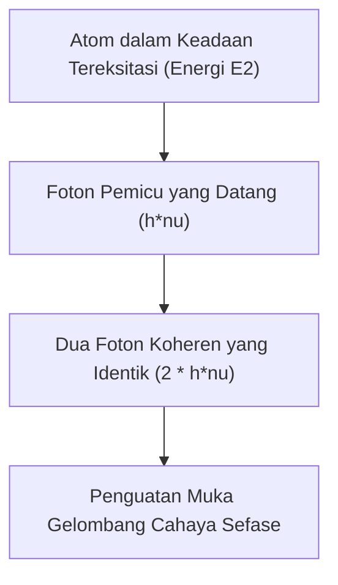

# Fisika: Cara Kerja Laser - Emisi Terstimulasi, Inversi Populasi, dan Penguatan Cahaya

Dalam peradaban modern saat ini, teknologi laser telah menjadi pilar penting yang menopang kehidupan sehari-hari. Mulai dari kabel serat optik bawah laut yang mengalirkan data internet global dan pemindai kode batang di pusat perbelanjaan, hingga bedah refraksi mata, pemotongan presisi baja industri, dan sensor LiDAR pada mobil otonom, teknologi laser hadir di berbagai sektor industri mutakhir.

Meskipun sangat populer, tidak banyak orang yang memahami arti sebenarnya dari kata **LASER** atau mekanisme fisika kuantum yang mendasarinya. LASER merupakan singkatan dari **"Light Amplification by Stimulated Emission of Radiation"** (Penguatan Cahaya melalui Emisi Radiasi Terstimulasi).

Artikel ini mengulas secara mendalam prinsip operasional laser berdasarkan tiga pilar utamanya: **Emisi Terstimulasi (Stimulated Emission)**, **Inversi Populasi (Population Inversion)**, dan **Resonator Optik (Optical Resonator)**.

## 1. Interaksi Cahaya dan Atom: Tiga Proses Radiasi Einstein

Untuk memahami cara kerja laser, kita harus meninjau interaksi kuantum antara foton dan elektron dalam atom. Pada tahun 1917, Albert Einstein membuktikan bahwa interaksi antara cahaya dan materi dikendalikan oleh tiga proses mikroskopis utama:

### Penyerapan (Absorption)
Ketika atom berada pada tingkat energi rendah (keadaan dasar: $E_1$), kedatangan foton dengan energi tepat $h\nu = E_2 - E_1$ ($h$ adalah konstanta Planck, $\nu$ adalah frekuensi cahaya) akan diserap oleh elektron, menyebabkannya bertransisi ke tingkat energi yang lebih tinggi (keadaan tereksitasi: $E_2$).

### Emisi Spontan (Spontaneous Emission)
Atom pada keadaan tereksitasi ($E_2$) bersifat tidak stabil. Tanpa rangsangan eksternal, atom tersebut akan meluruh kembali ke tingkat energi rendah ($E_1$) dengan melepaskan foton berenergi $E_2 - E_1$. Foton yang dipancarkan secara spontan ini memiliki arah, fase, dan polarisasi yang sepenuhnya acak. Inilah cahaya tidak koheren yang dihasilkan lampu pijar, lampu neon, dan Matahari.

### Emisi Terstimulasi (Stimulated Emission)
Inilah proses kunci yang memungkinkan terciptanya laser. Ketika sebuah atom telah berada dalam keadaan tereksitasi $E_2$, dan sebutir foton eksternal berenergi tepat $E_2 - E_1$ melintas di dekatnya, medan elektromagnetik foton tersebut akan "menstimulasi" atom untuk meluruh ke keadaan dasar sambil memancarkan foton kedua.

Hal yang luar biasa adalah foton baru yang dihasilkan merupakan **klon kuantum sempurna** dari foton yang memicunya: foton tersebut memiliki **panjang gelombang yang sama, fase yang sama, arah rambat yang sama, dan polarisasi yang sama persis**. Dengan demikian, satu foton yang masuk menghasilkan dua foton yang identik dan koheren sempurna, menghasilkan penguatan cahaya.

```mermaid
flowchart TD
    A["Atom dalam Keadaan Tereksitasi (Energi E2)"] --> B["Foton Pemicu yang Datang (h*nu)"]
    B --> C["Dua Foton Koheren yang Identik (2 * h*nu)"]
    C --> D["Penguatan Muka Gelombang Cahaya Sefase"]
```

## 2. Inversi Populasi (Population Inversion): Syarat Mutlak Penguatan Cahaya

Jika emisi terstimulasi dapat menggandakan foton, mengapa benda-benda biasa di sekitar kita tidak memancarkan sinar laser secara alami?

Dalam kondisi kesetimbangan termal standar, distribusi atom pada tingkat-tingkat energi mematuhi **distribusi Boltzmann**. Jumlah atom pada keadaan dasar berenergi rendah ($N_1$) jauh lebih banyak daripada jumlah atom pada keadaan tereksitasi ($N_2$), yaitu $N_1 \gg N_2$.
Ketika seberkas cahaya melewati medium tersebut, probabilitas penyerapan resonan jauh lebih tinggi daripada probabilitas emisi terstimulasi. Cahaya akan teredam secara eksponensial.

Agar terjadi penguatan cahaya bersih (osilasi laser), kesetimbangan termal harus diubah menjadi kondisi non-ekuilibrium di mana **jumlah atom pada keadaan tereksitasi melebihi jumlah atom pada keadaan dasar ($N_2 > N_1$)**. Kondisi anomali termodinamika ini disebut **Inversi Populasi (Population Inversion)**.

### Mekanisme Pemompaan (Pumping)
Karena inversi populasi menyalahi kesetimbangan alami, energi eksternal harus dipompakan terus-menerus ke dalam medium untuk memaksa elektron naik ke tingkat energi atas. Proses ini disebut **pemompaan (pumping)**:
- **Pemompaan Optik**: Menggunakan lampu kilat busur xenon berdaya tinggi atau dioda laser pembantu (umum pada laser zat padat seperti kristal rubi dan Nd:YAG).
- **Pemompaan Elektrik (Pelepasan Gas & Injeksi Arus)**: Melalui pelepasan muatan listrik tegangan tinggi pada tabung gas (seperti laser He-Ne atau $\text{CO}_2$) atau injeksi arus maju pada sambungan p-n semikonduktor.
- **Pemompaan Kimia**: Memanfaatkan energi eksotermik dari reaksi kimia berkecepatan tinggi.

### Sistem Tiga Tingkat vs Empat Tingkat
Untuk membentuk inversi populasi secara efisien, media penguat laser memanfaatkan konfigurasi energi tiga atau empat tingkat:

* **Sistem Tiga Tingkat (contoh: Laser Rubi)**:
  Atom dipompa dari $E_1$ ke $E_3$, lalu meluruh cepat tanpa radiasi ke tingkat metastabil $E_2$. Emisi laser terjadi antara $E_2$ dan tingkat dasar $E_1$. Karena tingkat laser bawah adalah tingkat dasar tempat berkumpulnya sebagian besar atom, lebih dari 50% atom dalam medium harus dipompa ke atas hanya untuk mencapai ambang transparansi ($N_2 = N_1$), yang membutuhkan daya pompa sangat masif.

* **Sistem Empat Tingkat (contoh: Nd:YAG, He-Ne)**:
  Atom dipompa dari $E_0$ ke $E_3$, meluruh ke $E_2$, bertransisi laser ke $E_1$, lalu meluruh sangat cepat kembali ke $E_0$. Karena tingkat bawah $E_1$ berada jauh di atas tingkat dasar termal, tingkat ini hampir kosong pada suhu kamar ($N_1 \approx 0$). Oleh karena itu, sedikit daya pompa sudah mampu menciptakan kondisi $N_2 > N_1$, memberikan efisiensi yang berkali-kali lipat lebih unggul.

## 3. Resonator Optik: Umpan Balik dan Terjadinya Osilasi

Inversi populasi menciptakan medium penguat cahaya. Namun, sekali lintasan cahaya melalui medium hanya menghasilkan penguatan yang sangat kecil. Untuk mengubah penguat tersebut menjadi osilator mandiri yang memancarkan berkas terarah berdaya tinggi, diperlukan lingkaran umpan balik optik positif berupa **Resonator Optik (Kavitas Optik)**.

Resonator optik terdiri dari dua cermin yang dipasang sejajar pada kedua ujung medium aktif:
1. **Cermin Pemantul Total (High Reflector)**: Memiliki reflektivitas mendekati 100%.
2. **Cermin Pemantul Sebagian / Penggandeng Keluaran (Output Coupler)**: Memantulkan sebagian besar cahaya (95% hingga 99%) kembali ke dalam kavitas dan meneruskan sebagian kecil (1% hingga 5%) ke luar sebagai berkas sinar laser yang dapat dimanfaatkan.

### Siklus Osilasi
1. Saat pemompaan dimulai dan inversi populasi terbentuk, beberapa atom mengalami emisi spontan dan memancarkan foton awal.
2. Foton yang bergerak sejajar dengan sumbu optik kavitas akan merangsang emisi terstimulasi secara berantai.
3. Saat mencapai ujung kavitas, cermin memantulkan cahaya untuk melintasi medium berkali-kali.
4. Pada setiap lintasan bolak-balik, emisi terstimulasi melipatgandakan jumlah foton yang sefase dan sefrekuensi secara eksponensial.
5. Sebagian cahaya berdaya tinggi keluar menembus cermin semi-transparan membentuk **berkas sinar laser** yang stabil dan koheren.

### Ambang Batas Laser dan Persamaan Laju

Osilasi laser hanya akan terjadi jika penguatan optik dalam satu putaran melampaui total kehilangan daya di dalam kavitas (transmisi cermin, penyerapan, penghamburan). Titik kritis ini disebut **Ambang Batas Laser (Laser Threshold)**.

Dinamika populasi atom dan kerapatan foton dimodelkan melalui **Persamaan Laju (Rate Equations)**:

$$ \frac{dN_2}{dt} = R_p - \frac{N_2}{\tau} - B \rho(\nu) (N_2 - N_1) $$

Di mana:
- $N_2, N_1$ adalah kerapatan populasi tingkat atas dan bawah,
- $R_p$ adalah laju pemompaan volume,
- $\tau$ adalah waktu paruh emisi spontan tingkat atas,
- $B$ adalah koefisien Einstein untuk emisi terstimulasi,
- $\rho(\nu)$ adalah kerapatan energi radiasi dalam kavitas.

Penyelesaian persamaan ini digunakan untuk menghitung daya pompa ambang batas, daya keluaran stabil, dan karakteristik osilasi relaksasi.

## 4. Empat Karakteristik Unggul Sinar Laser

Melalui perpaduan emisi terstimulasi dan seleksi mode oleh resonator optik, sinar laser memiliki empat karakteristik istimewa yang tidak dimiliki oleh sumber cahaya biasa:

1. **Monokromatisitas (Monochromaticity)**:
   Transisi terjadi di antara tingkat kuantum yang sangat spesifik, menghasilkan lebar pita spektrum ($\Delta\lambda$) yang sangat sempit dan warna spektral yang luar biasa murni.
2. **Direksionalitas (Directivity)**:
   Hanya mode cahaya yang sejajar sumbu optik yang diperkuat berulang kali. Divergensi berkas sangat kecil; sinar laser yang ditembakkan ke permukaan Bulan sejauh hampir 400.000 km hanya melebar beberapa kilometer saja.
3. **Koherensi (Spasial dan Temporal)**:
   Semua foton bergerak sefase secara sempurna. **Koherensi spasial** memungkinkan pembuatan gambar holografi 3D; **koherensi temporal** menjaga keteraturan fase pada jarak rambat yang sangat jauh, memungkinkan deteksi gelombang gravitasi pada observatorium LIGO.
4. **Intensitas dan Kerapatan Energi Tinggi (High Intensity)**:
   Koherensi yang sempurna memungkinkan berkas difokuskan hingga batas difraksi pada titik berukuran mikrometer ($\sim 1\ \mu\text{m}$). Titik fokus ini menghasilkan kerapatan daya hingga tingkat gigawatt per sentimeter persegi yang sanggup menguapkan logam titanium atau memicu fusi nuklir terkurung inersial.

## 5. Teknologi Terkini dan Prospek Masa Depan

Kemajuan rekayasa material telah melahirkan berbagai jenis arsitektur laser:

- **Dioda Laser Semikonduktor**: Berukuran mikroskopis dengan efisiensi konversi daya di atas 50%, menjadi penggerak utama komunikasi serat optik dan gawai elektronik.
- **Laser Serat (Fiber Laser)**: Menggunakan serat silika terdoping unsur tanah jarang (seperti iterbium) sebagai media penguat. Disipasi panas yang prima dan daya multikilowatt menjadikannya standar utama dalam pemotongan dan pengelasan logam industri berat.
- **Laser Pulsa Sangat Singkat (Fisika Femtodetik dan Attodetik)**:
  Teknologi penguncian mode (Mode-locking) mampu memampatkan energi optik ke dalam pulsa femtodetik ($10^{-15}\text{ detik}$) atau attodetik ($10^{-18}\text{ detik}$). Karena pulsa berakhir sebelum panas merambat ke atom sekitar ("ablasi dingin"), laser ini digunakan dalam bedah refraksi mata presisi (SMILE) dan pemotongan wafer mikroprosesor. Hadiah Nobel Fisika tahun 2023 diberikan kepada pelopor laser attodetik yang berhasil merekam dinamika elektron di dalam atom secara langsung.

## Kesimpulan

Mulai dari prediksi teoretis Einstein pada tahun 1917 hingga laser rubi pertama yang dinyalakan oleh Theodore Maiman pada tahun 1960, laser merupakan salah satu pencapaian terbesar dalam fisika kuantum terapan. Pengendalian tingkat energi atomik, inversi populasi, dan resonator optik telah memberikan umat manusia instrumen cahaya paling presisi dan berdaya guna tinggi sepanjang sejarah.
