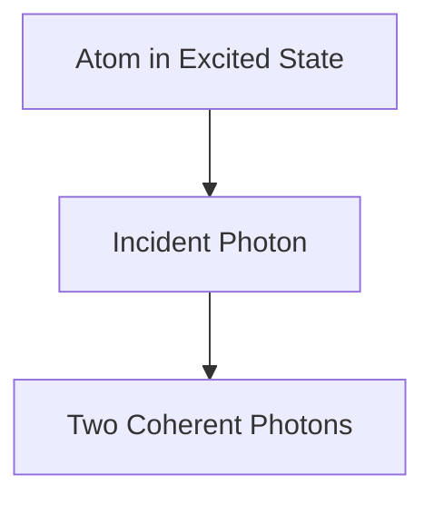

# 물리학: 레이저의 원리

레이저는 유도 방출에 의해 빛을 증폭합니다.

## 유도 방출 과정

## 속도 방정식
$$ \frac{dN_2}{dt} = R - \frac{N_2}{\tau} - B \rho (\nu) (N_2 - N_1) $$

## 추가 기술 검증 파트 1

이 섹션에서는 더 깊은 기술적 세부 사항과 사례 연구에 대해 자세히 살펴봅니다. 다양한 조건에서의 성능 평가 및 다른 시스템과의 통합과 관련된 과제와 해결책을 검토합니다. 향후 전망 및 한계에 대해서도 고찰합니다.

