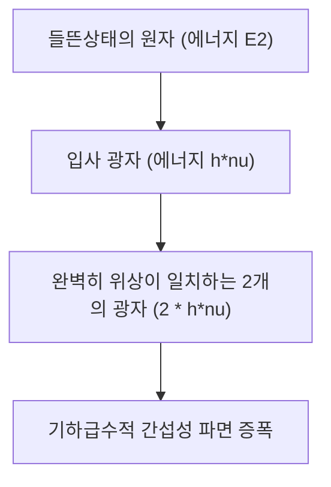

# 물리학: 레이저의 원리와 메커니즘 - 유도방출, 밀도반전과 빛의 증폭

현대 사회에서 레이저는 문명을 지탱하는 기술의 핵심 주춧돌입니다. 대륙 간 인터넷 트래픽을 빛의 속도로 실어 나르는 광섬유 통신부터 마트의 바코드 리더기, 정밀 라식 시력 교정 수술과 레이저 메스, 초정밀 금속 절단 공정, 나아가 자율주행 자동차의 핵심 센서인 라이다(LiDAR)에 이르기까지, 레이저 기술은 현대 첨단 산업 전반의 심장에 자리 잡고 있습니다.

그러나 '레이저(LASER)'라는 단어가 구체적으로 무엇을 뜻하며, 어떤 미시적 양자물리학 원리에 의해 동작하는지 깊이 이해하는 사람은 많지 않습니다. LASER는 **'Light Amplification by Stimulated Emission of Radiation'** 의 머리글자를 딴 것으로, 우리말로 풀면 **'복사의 유도방출에 의한 빛의 증폭'** 을 의미합니다.

본 글에서는 원자와 빛의 미시적 상호작용에서 출발하여, 레이저 물리학의 3대 핵심 기둥인 **유도방출(Stimulated Emission)**, **밀도반전(Population Inversion)**, **광학 공진기(Optical Resonator)** 의 원리를 수학적 수식과 함께 체계적으로 해설합니다.

## 1. 빛과 원자의 상호작용: 아인슈타인의 3대 복사 과정

레이저의 증폭 메커니즘을 이해하려면 먼저 전자기 복사(광자)가 원자 내부의 구속 전자와 어떻게 상호작용하는지 알아야 합니다. 1917년 알베르트 아인슈타인은 빛과 물질의 상호작용이 다음과 같은 3가지 기본 양자 과정에 의해 지배된다는 사실을 밝혔습니다:

### 흡수 (Absorption)
원자가 에너지가 낮은 기저상태($E_1$)에 있을 때, 에너지 차이에 해당하는 $h\nu = E_2 - E_1$($h$ 는 플랑크 상수, $\nu$ 는 빛의 진동수)의 광자가 입사하면 원자는 광자를 흡수하고 에너지가 높은 들뜬상태($E_2$)로 천이합니다.

### 자발방출 (Spontaneous Emission)
들뜬상태($E_2$)에 있는 원자는 본질적으로 불안정합니다. 외부의 어떠한 자극이 없더라도 일정 시간(자연수명)이 지나면 자발적으로 에너지를 방출하며 하위 에너지 준위($E_1$)로 떨어집니다. 이때 방출되는 광자는 $E_2 - E_1$ 의 에너지를 가지지만, 방출 방향, 위상, 편광이 완전히 무작위(Random)입니다. 우리가 일상에서 접하는 백열전구, 형광등, 태양광이 바로 이 간섭성 없는 자발방출 광입니다.

### 유도방출 (Stimulated Emission)
레이저 현상의 가장 핵심적인 물리 과정입니다. 원자가 이미 들뜬상태($E_2$)에 머물고 있을 때, 정확히 $E_2 - E_1$ 의 에너지를 가진 외부 광자가 원자 근처를 지나가면, 그 입사 광자의 전자기장이 들뜬 원자를 '자극(유도)'하여 기저상태로 떨어뜨리면서 새로운 광자를 방출하게 만듭니다.

놀랍게도 유도방출에 의해 생성된 새로운 광자는 자극을 가한 입사 광자와 **완벽히 동일한 파장(진동수), 동일한 위상, 동일한 진행 방향, 동일한 편광 상태** 를 갖습니다. 즉, 1개의 광자가 진입하여 완전히 동일한 2개의 '복제' 광자가 되어 나오는 양자역학적 빛의 증폭이 일어납니다.

```mermaid
flowchart TD
    A["들뜬상태의 원자 (에너지 E2)"] --> B["입사 광자 (에너지 h*nu)"]
    B --> C["완벽히 위상이 일치하는 2개의 광자 (2 * h*nu)"]
    C --> D["기하급수적 간섭성 파면 증폭"]
```

## 2. 밀도반전 (Population Inversion): 빛 증폭을 위한 절대적 조건

유도방출이 빛을 복제 증폭한다는 사실은 확인되었습니다. 그렇다면 자연계의 일반적인 물질에서는 왜 레이저 증폭이 일어나지 않을까요?

일반적인 열평형 상태의 물질에서는 각 에너지 준위에 존재하는 원자의 수(밀도)가 **볼츠만 분포(Boltzmann distribution)** 를 따릅니다. 즉, 낮은 에너지 준위(기저상태)에 머무는 원자 수($N_1$)가 높은 에너지 준위(들뜬상태)에 존재하는 원자 수($N_2$)보다 압도적으로 많습니다($N_1 \gg N_2$).
이 상태에서 빛을 쪼이면, 유도방출 확률보다 기저상태 원자에 의한 '공명 흡수' 확률이 압도적으로 우세하여 빛은 매질을 통과하며 기하급수적으로 감쇠합니다.

빛의 순증폭(레이저 발진)을 일으키기 위해서는 이 열역학적 평형을 깨고, **높은 들뜬상태의 원자 수가 낮은 기저상태의 원자 수를 압도하는 역전 상태($N_2 > N_1$)** 를 인위적으로 형성해야 합니다. 이 비평형 열역학 상태를 **밀도반전(Population Inversion)** 이라고 부릅니다.

### 펌핑(Pumping) 메커니즘
밀도반전을 만들기 위해서는 외부에서 끊임없이 에너지를 투입하여 원자들을 상위 준위로 강제로 끌어올려야 합니다. 이를 '펌핑'이라고 합니다:
- **광 펌핑(Optical Pumping)**: 크세논 섬광 램프나 반도체 레이저를 조사하여 여기 (루비 레이저, Nd:YAG 고체 레이저 등).
- **전기 펌핑(방전 및 전류 주입)**: 가스 방전을 일으키거나 반도체 p-n 접합에 순방향 전류를 주입 (He-Ne 가스 레이저, $\text{CO}_2$ 레이저, 반도체 레이저 다이오드).
- **화학 펌핑(Chemical Pumping)**: 발열 화학 반응에서 방출되는 에너지로 여기 (화학 산소 요오드 레이저 등).

### 3준위계와 4준위계 레이저 시스템
원자 내부에서 효율적인 밀도반전을 형성하기 위해 레이저 매질은 3개 또는 4개의 에너지 준위 구조를 활용합니다:

* **3준위계 (예: 루비 레이저)**:
  원자를 기저상태 $E_1$ 에서 높은 펌프 준위 $E_3$ 로 여기시키면, 원자는 매우 빠른 비복사 천이(열 방출)를 통해 수명이 긴 준안정 상태 $E_2$ 로 떨어집니다. 레이저 방출은 $E_2$ 와 기저상태 $E_1$ 사이에서 일어납니다. 그러나 레이저 하위 준위가 전체 원자의 100%가 모여 있는 기저상태이기 때문에, 밀도반전($N_2 > N_1$)을 달성하려면 전체 원자의 절반 이상을 들뜨게 해야 하므로 막대한 펌핑 에너지가 요구됩니다.

* **4준위계 (예: Nd:YAG, He-Ne 레이저)**:
  원자를 기저상태 $E_0$ 에서 $E_3$ 로 펌핑한 후 비복사 천이로 $E_2$ 에 모읍니다. 레이저 발진은 $E_2$ 에서 $E_1$ 로 떨어지며 일어나고, $E_1$ 에 도달한 원자는 다시 비복사 천이로 순식간에 기저상태 $E_0$ 로 복귀합니다. 하위 준위 $E_1$ 은 기저상태보다 훨씬 높은 에너지에 위치하여 상온에서 열평형 상태 원자가 거의 비어 있습니다($N_1 \approx 0$). 따라서 약간의 원자만 $E_2$ 로 펌핑해도 쉽게 $N_2 > N_1$ 밀도반전이 형성되어 매우 높은 효율을 발휘합니다.

## 3. 광학 공진기 (Optical Resonator): 빛의 되먹임과 발진

밀도반전을 통해 매질이 빛을 증폭할 준비가 되었더라도, 빛이 매질을 단 한 번 통과해서는 미세한 증폭에 그칩니다. 강력하고 연속적인 레이저 빔을 만들기 위해서는 빛을 매질 안에 가두고 수백 번 왕복시키며 양의 되먹임(Positive Feedback)을 거는 구조가 필요합니다. 이것이 바로 **광학 공진기(Optical Resonator)** 입니다.

광학 공진기는 레이저 매질의 양 끝에 마주 보게 설치된 두 장의 반사경으로 구성됩니다:
1. **전반사경 (High Reflector)**: 빛을 거의 100% 반사.
2. **부분반사경/출력경 (Output Coupler)**: 대부분의 빛(95%〜99%)은 반사하여 캐비티 내부로 되돌리고, 극히 일부(1%〜5%)만을 투과시켜 우리가 사용하는 레이저 빔으로 출력.

### 발진의 순환 과정
1. 펌핑으로 밀도반전이 형성되면 일부 원자가 자발방출로 초기 광자를 냅니다.
2. 공진기 축에 완벽히 정렬된 광자만이 매질을 지나며 수직 유도방출을 촉발합니다.
3. 양 끝 거울에서 반사된 빛은 매질 속을 왕복하며 기하급수적으로 광자 수를 불립니다.
4. 왕복할 때마다 동일한 위상과 파장의 광자가 눈덩이처럼 증폭됩니다.
5. 마침내 증폭된 일관된 빛의 일부가 부분반사경을 뚫고 나와 강력한 **레이저 빔** 이 됩니다.

### 발진 임계값과 속도 방정식

공진기 내부에서 1회 왕복 시 얻는 광학 이득이 공진기 내부의 손실(거울 투과, 흡수, 산란)을 넘어서야만 레이저가 발진하기 시작합니다. 이 분기점을 **발진 임계값(Laser Threshold)** 이라고 합니다.

원자 밀도와 광자 밀도의 시간적 변화는 **레이저 속도 방정식(Laser Rate Equations)** 으로 정밀히 기술됩니다. 단순화된 준위계에서 속도 방정식은 다음과 같습니다:

$$ \frac{dN_2}{dt} = R_p - \frac{N_2}{\tau} - B \rho(\nu) (N_2 - N_1) $$

여기서:
- $N_2, N_1$ 은 상위 및 하위 준위의 원자 밀도,
- $R_p$ 는 단위 부피당 외부 펌핑율,
- $\tau$ 는 상위 준위의 자발방출 수명,
- $B$ 는 아인슈타인 유도방출 계수,
- $\rho(\nu)$ 는 공진기 내부의 전자기 복사 에너지 밀도(광자 수에 비례)입니다.

이 방정식을 풀면 레이저 발진 개시 임계 파워, 정상상태 출력 파워, 이득 포화 및 과도 완화 진동 특성을 이론적으로 도출할 수 있습니다.

## 4. 레이저 광의 4대 탁월한 물리적 특성

유도방출의 양자 복제성과 광학 공진기의 기하학적 정렬 덕분에 레이저는 자연계의 일반 빛과는 완전히 차별화되는 4가지 탁월한 특성을 지닙니다:

1. **단색성 (Monochromaticity)**:
   특정 양자 에너지 준위 간 천이로만 발생하므로 파장의 폭($\Delta\lambda$)이 극도로 좁아 단 하나의 순수한 색상을 띱니다. 고정밀 분광 분석과 원자시계의 기준 광원으로 필수적입니다.
2. **지향성 (Directivity)**:
   공진기 축과 평행한 빛만이 살아남아 왕복 증폭되므로 빔의 퍼짐각(발산각)이 거의 0에 가깝습니다. 달 표면에 레이저를 발사해도 지구에서 달까지 38만 km를 날아가는 동안 빔의 직경은 수 km 수준에 불과합니다.
3. **간섭성 (Coherence)**:
 유도방출에 의해 모든 광자의 위상(마루와 골의 타이밍)이 완벽히 정렬됩니다. **공간 간섭성** 은 홀로그래피 3D 입체 영상 구현을 가능케 하고, **시간 간섭성** 은 수만 킬로미터 이상의 광 경로 차이에서도 위상을 보존하여 중력파 검출기(LIGO)의 핵심 원리가 됩니다.
4. **고휘도 및 극초점성 (High Intensity)**:
   완벽한 간섭성 덕분에 렌즈를 통해 빛의 파장 수준인 마이크로미터($\sim 1\ \mu\text{m}$) 단위의 극미세 스폿으로 집속할 수 있습니다. 촛점에 태양 표면의 수백만 배에 달하는 기가와트급 에너지 밀도를 집중시켜 티타늄 금속을 순식간에 절단하거나 레이저 핵융합을 유도합니다.

## 5. 최신 레이저 기술과 미래 전망

오늘날 레이저는 소재와 펄스 제어 기술의 눈부신 혁신을 거듭하고 있습니다:

- **반도체 레이저 다이오드(Laser Diode)**: 쌀알보다 작고 50% 이상의 뛰어난 전력 변환 효율을 자랑하며, 광통신과 가전 기기의 핵심을 담당합니다.
- **파이버 레이저(Fiber Laser)**: 희토류 원소가 첨가된 광섬유 자체를 증폭 매질로 사용하여 냉각 효율이 뛰어나고 수만 와트급 출력을 발휘해 중공업 용접과 절단의 주류로 군림하고 있습니다.
- **초단펄스 레이저 (펨토초 및 아토초 물리학)**:
  모드 로킹(Mode-locking) 기술을 이용해 펄스 폭을 펨토초($10^{-15}$초)나 아토초($10^{-18}$초) 수준으로 극한 압축한 레이저입니다. 열이 주변으로 전달될 틈도 없이 분자 결합을 직접 끊어버리는 '비열 가공(Cold Ablation)'이 가능하여 정밀 라식 수술과 반도체 웨이퍼 초정밀 다이싱에 활용됩니다. 2023년 노벨 물리학상은 원자 내부에서 전자가 움직이는 궤적을 실시간으로 포착한 아토초 레이저 개척자들에게 수여되었습니다.

## 맺음말

1917년 아인슈타인의 순수 이론적 유도방출 예측에서 시작하여 1960년 시어도어 메이먼이 세계 최초의 루비 레이저를 발진시킨 이래, 레이저는 양자물리학과 광학 공학이 인류에게 선사한 최고의 걸작 중 하나입니다. 미시적 원자 준위의 정밀 제어, 밀도반전, 그리고 공진기의 아름다운 결합은 인류가 빛을 자유자재로 다루며 문명을 발전시키는 강력한 힘이 되어주고 있습니다.
