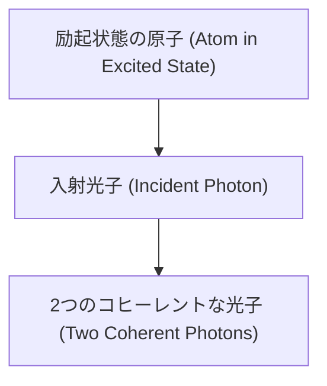

# 物理学: レーザーの仕組み - 誘導放出と光の増幅

現代社会において、レーザーは私たちの生活に欠かせない技術となっています。インターネットを支える光ファイバー通信、バーコードリーダー、医療分野でのレーザーメスや視力矯正手術、工業分野での精密加工、さらには自動運転におけるLiDAR（ライダー）技術まで、レーザー技術はあらゆる産業の根幹を支えています。

しかし、「レーザー（LASER）」という言葉が具体的に何を意味し、どのような物理的メカニズムで機能しているのかを深く理解している人はそれほど多くありません。LASERとは「Light Amplification by Stimulated Emission of Radiation」の頭文字をとったものであり、日本語に訳すと「放射の誘導放出による光の増幅」となります。

本記事では、このレーザーの背後にある物理学的な原理、特に「誘導放出（Stimulated Emission）」、「反転分布（Population Inversion）」、「共振器（Optical Resonator）」という3つの重要な要素について、詳細かつ包括的に解説していきます。

## 1. 光と原子の相互作用：アインシュタインの3つのプロセス

レーザーのメカニズムを理解するためには、まず光（光子）と物質（原子や分子）がどのように相互作用するのかを知る必要があります。1917年、アルベルト・アインシュタインは、光と物質の相互作用には以下の3つの基本プロセスが存在することを示しました。

### 吸収（Absorption）
原子が低いエネルギー状態（基底状態: $E_1$）にあるとき、外部からエネルギー $h\nu = E_2 - E_1$（$h$ はプランク定数、$\nu$ は光の振動数）を持つ光子が入射すると、原子はその光子のエネルギーを吸収し、高いエネルギー状態（励起状態: $E_2$）へと遷移します。

### 自然放出（Spontaneous Emission）
励起状態にある原子は不安定であるため、外部からの刺激がなくとも、ある一定の確率で自然により低いエネルギー状態へと戻ります。このとき、余分なエネルギー $E_2 - E_1$ に等しいエネルギーを持つ光子を四方八方へランダムな位相・方向で放出します。これが日常的に目にする蛍光灯や太陽の光の源です。

### 誘導放出（Stimulated Emission）
これがレーザーの中核を成すプロセスです。原子がすでに励起状態 $E_2$ にあるとき、ちょうど $E_2 - E_1$ のエネルギーを持つ光子が外部から入射すると、その入射光子に「刺激（誘導）」されて、原子は基底状態 $E_1$ に戻り、同じエネルギーを持つ別の光子を放出します。驚くべきことに、この誘導放出によって生成された光子は、入射した光子と**完全に同じ波長（周波数）、同じ位相、同じ進行方向、同じ偏波状態**を持ちます。つまり、1つの光子が入射すると、全く同じ性質を持つ2つの光子が出現し、光が増幅されたことになります。

## 2. 反転分布（Population Inversion）：光の増幅への絶対条件

誘導放出によって光が増幅されることは分かりました。しかし、通常の物質中では光の増幅は起こりません。なぜでしょうか。

熱平衡状態にある物質では、各エネルギー準位に存在する原子の数（ポピュレーション）はボルツマン分布に従います。つまり、エネルギーが低い基底状態の原子数（$N_1$）が、エネルギーが高い励起状態の原子数（$N_2$）よりも圧倒的に多くなっています（$N_1 > N_2$）。
この状態に光を入射させると、誘導放出よりも「吸収」の確率の方がはるかに高くなり、光は物質を通過するにつれて減衰してしまいます。

光を増幅させる（レーザー発振を起こす）ためには、この自然な状態を逆転させ、**励起状態の原子数が基底状態の原子数を上回る状態（$N_2 > N_1$）**を作り出さなければなりません。この非熱平衡状態のことを**「反転分布（Population Inversion）」**と呼びます。

### 励起（ポンピング）メカニズム
反転分布を作り出すためには、外部からエネルギーを供給して原子を強制的に上のエネルギー準位へ押し上げる必要があります。これを「ポンピング」と呼びます。ポンピングの手段としては、強力な閃光ランプや他のレーザーを用いた「光ポンピング」、気体レーザーや半導体レーザーで用いられる「放電・電流注入（電気的ポンピング）」、化学反応によるエネルギーを用いる「化学的ポンピング」などがあります。

### 3準位系と4準位系レーザー
反転分布を効率よく形成するため、レーザー媒質には3つまたは4つのエネルギー準位を持つ原子が利用されます。

*   **3準位系（例：ルビーレーザー）**：
    基底状態の原子を、高いエネルギー準位（第3準位）へ励起します。第3準位にある原子は、非常に短い時間で少し低いエネルギーの第2準位（準安定状態）へ非輻射遷移（熱などを出して落ちる）します。ここで第2準位と第1準位（基底状態）の間で反転分布を形成します。しかし、基底状態の原子数は元々非常に多いため、半分以上の原子を励起しなければならず、極めて強いポンピングエネルギーが必要です。

*   **4準位系（例：Nd:YAGレーザー、He-Neレーザー）**：
    第0準位（基底状態）から第3準位へ励起し、第3準位から第2準位へ非輻射遷移します。レーザー発振は第2準位から第1準位への遷移で起こり、第1準位から第0準位へも速やかに遷移します。レーザー下位準位である第1準位は熱平衡状態ではほぼ空っぽであるため、少数の原子を第2準位へ励起するだけで容易に反転分布が形成されます。そのため、4準位系の方が圧倒的に効率よくレーザー発振を持続させることができます。

## 3. 共振器（Optical Resonator）：光のフィードバックと発振

反転分布を作り出せば、誘導放出によって光は増幅されますが、それだけでは一瞬光が強くなって終わるだけです。持続的で強力なレーザービームを生成するためには、「光を閉じ込めて繰り返し増幅させる」仕組みが必要です。それが**「光共振器（Optical Resonator または Optical Cavity）」**です。

光共振器は、通常レーザー媒質（レーザーダイオード、結晶、ガス管など）の両端に配置された2枚の鏡で構成されます。一方の鏡は光をほぼ100%反射する「全反射鏡」、もう一方は光の数パーセント（例えば1〜5%程度）を透過させる「半透過鏡（出力鏡）」です。

1.  ポンピングによって反転分布が形成されると、一部の原子が自然放出により光子を放出します。
2.  共振器の軸に沿って進む光子だけが、誘導放出を引き起こしながら媒質中を進みます。
3.  両端の鏡に到達した光は反射され、再び媒質中を往復します。
4.  往復するたびに誘導放出が雪だるま式に連鎖し、特定の方向へ進む同じ波長・同じ位相の光子が爆発的に増加します（光増幅）。
5.  増幅された光の一部が、半透過鏡から外部に漏れ出します。これが我々が利用する**「レーザービーム」**です。

### レーザー発振の閾値とレート方程式

レーザーが発振するためには、共振器内部での光の増幅率が、共振器の損失（鏡の透過、吸収、散乱など）を上回る必要があります。この限界点を**発振閾値（Threshold）**と呼びます。

レーザー内部の原子のポピュレーションや光子数の時間変化は、**レート方程式（Rate Equations）**と呼ばれる連立微分方程式で記述されます。単純化された2準位系のレート方程式の例を以下に示します。

$$ \frac{dN_2}{dt} = R - \frac{N_2}{\tau} - B \rho (\nu) (N_2 - N_1) $$

ここで：
*   $N_2, N_1$ は各準位のポピュレーション密度
*   $R$ はポンピングによる励起レート
*   $\tau$ は自然放出寿命
*   $B$ はアインシュタインのB係数（誘導放出・吸収の確率）
*   $\rho(\nu)$ は放射のエネルギー密度（光子数に比例）

この方程式を解析することで、レーザーの立ち上がり特性、定常状態での出力、緩和振動などの動的振る舞いを計算することができます。

## 4. レーザー光の優れた特性

誘導放出と共振器という組み合わせにより生み出されるレーザー光は、自然界の光や白熱電球・LEDの光にはない、以下の4つの卓越した特性を持っています。

1.  **単色性（Monochromaticity）**：
    原子の特定のエネルギー準位間の遷移を利用するため、波長の幅が極めて狭く、純粋な単一の色の光となります。スペクトル幅が非常に狭いため、分光分析や精密な干渉測定に不可欠です。
2.  **指向性（Directivity）**：
    共振器の軸に沿って往復した光のみが増幅されるため、光がほとんど広がらずに真っ直ぐ進みます。これにより、月までの距離を数センチメートルの精度で測るようなことも可能になります。
3.  **コヒーレンス（Coherence：干渉性）**：
    誘導放出により、全ての光子の「位相（波の山と谷のタイミング）」が完全に揃っています。時間的・空間的に位相が揃っているため、美しい干渉縞を作ることができ、ホログラフィ技術などの基礎となっています。
4.  **高輝度・高エネルギー密度（High Intensity）**：
    位相が揃った光をレンズで集光すると、光の波長程度の極めて小さな点（スポット）に絞り込むことができます。これにより、太陽光の何百万倍もの莫大なエネルギー密度を局所的に実現でき、金属の切断や溶接、核融合研究にも利用されています。

## 5. 発展的なレーザー技術と今後の展望

現在では、多様な媒質を用いたレーザーが開発されています。
*   **半導体レーザー（Laser Diode）**：非常に小型で高効率。光通信やブルーレイ、レーザーポインターなどに使用。
*   **固体レーザー（Solid-state Laser）**：Nd:YAGレーザーやチタンサファイアレーザーなど。高出力が得られ、加工や医療に広く使われます。
*   **ファイバーレーザー（Fiber Laser）**：希土類元素を添加した光ファイバー自体を媒質とするレーザー。冷却効率が良く、超高出力が可能で、産業用加工機の主流となっています。

また、時間を極限まで短く切り詰めた**超短パルスレーザー（フェムト秒レーザーやアト秒レーザー）**の技術も劇的な進歩を遂げています。モード同期（Mode-locking）と呼ばれる技術を用いて、光のパルス幅をフェムト秒（$10^{-15}$秒）の領域にすると、物質の熱損傷を抑えながら精密に加工する「非熱加工」が可能になり、さらには電子の動きそのものを実時間で捉えるといった最先端の物理学研究を切り拓いています。2023年のノーベル物理学賞は、このアト秒（$10^{-18}$秒）物理学に貢献した研究者たちに授与されました。

## おわりに

アインシュタインが理論的に予言した「誘導放出」から始まり、1960年にセオドア・メイマンが世界初のルビーレーザーを発振させて以来、レーザー技術は物理学、光学、材料科学の叡智を結集して発展し続けてきました。
エネルギー準位の制御、反転分布の形成、そして共振器によるフィードバック——これらの物理学的な原理の美しい組み合わせが、現代の高度な情報化社会と産業技術を根底から支えています。レーザーは、基礎物理学が人類の歴史をいかに大きく変え得るかを示す、最も成功した実例の一つと言えるでしょう。
