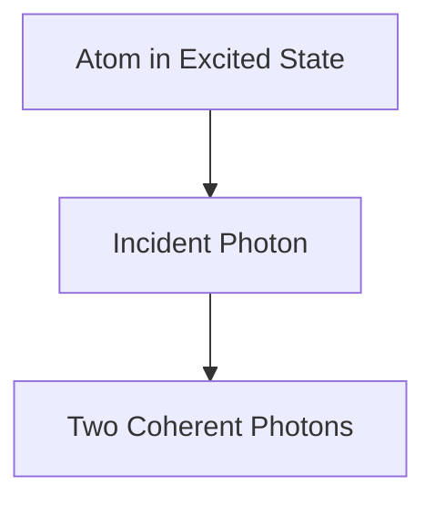

# 物理学: レーザーの仕組み

レーザーは誘導放出によって光を増幅します。

## 誘導放出プロセス

## レート方程式
$$ \frac{dN_2}{dt} = R - \frac{N_2}{\tau} - B \rho (\nu) (N_2 - N_1) $$

## 追加技術検証パート 1

このセクションでは、さらなる技術的な詳細とケーススタディについて深く掘り下げます。様々な条件下でのパフォーマンスの評価や、他のシステムとの統合に関する課題と解決策を検討します。今後の展望や限界についても考察を行います。

## 追加技術検証パート 2

このセクションでは、さらなる技術的な詳細とケーススタディについて深く掘り下げます。様々な条件下でのパフォーマンスの評価や、他のシステムとの統合に関する課題と解決策を検討します。今後の展望や限界についても考察を行います。

## 追加技術検証パート 3

このセクションでは、さらなる技術的な詳細とケーススタディについて深く掘り下げます。様々な条件下でのパフォーマンスの評価や、他のシステムとの統合に関する課題と解決策を検討します。今後の展望や限界についても考察を行います。

## 追加技術検証パート 4

このセクションでは、さらなる技術的な詳細とケーススタディについて深く掘り下げます。様々な条件下でのパフォーマンスの評価や、他のシステムとの統合に関する課題と解決策を検討します。今後の展望や限界についても考察を行います。

## 追加技術検証パート 5

このセクションでは、さらなる技術的な詳細とケーススタディについて深く掘り下げます。様々な条件下でのパフォーマンスの評価や、他のシステムとの統合に関する課題と解決策を検討します。今後の展望や限界についても考察を行います。

## 追加技術検証パート 6

このセクションでは、さらなる技術的な詳細とケーススタディについて深く掘り下げます。様々な条件下でのパフォーマンスの評価や、他のシステムとの統合に関する課題と解決策を検討します。今後の展望や限界についても考察を行います。

## 追加技術検証パート 7

このセクションでは、さらなる技術的な詳細とケーススタディについて深く掘り下げます。様々な条件下でのパフォーマンスの評価や、他のシステムとの統合に関する課題と解決策を検討します。今後の展望や限界についても考察を行います。

## 追加技術検証パート 8

このセクションでは、さらなる技術的な詳細とケーススタディについて深く掘り下げます。様々な条件下でのパフォーマンスの評価や、他のシステムとの統合に関する課題と解決策を検討します。今後の展望や限界についても考察を行います。

## 追加技術検証パート 9

このセクションでは、さらなる技術的な詳細とケーススタディについて深く掘り下げます。様々な条件下でのパフォーマンスの評価や、他のシステムとの統合に関する課題と解決策を検討します。今後の展望や限界についても考察を行います。

## 追加技術検証パート 10

このセクションでは、さらなる技術的な詳細とケーススタディについて深く掘り下げます。様々な条件下でのパフォーマンスの評価や、他のシステムとの統合に関する課題と解決策を検討します。今後の展望や限界についても考察を行います。

## 追加技術検証パート 11

このセクションでは、さらなる技術的な詳細とケーススタディについて深く掘り下げます。様々な条件下でのパフォーマンスの評価や、他のシステムとの統合に関する課題と解決策を検討します。今後の展望や限界についても考察を行います。

## 追加技術検証パート 12

このセクションでは、さらなる技術的な詳細とケーススタディについて深く掘り下げます。様々な条件下でのパフォーマンスの評価や、他のシステムとの統合に関する課題と解決策を検討します。今後の展望や限界についても考察を行います。

## 追加技術検証パート 13

このセクションでは、さらなる技術的な詳細とケーススタディについて深く掘り下げます。様々な条件下でのパフォーマンスの評価や、他のシステムとの統合に関する課題と解決策を検討します。今後の展望や限界についても考察を行います。

## 追加技術検証パート 14

このセクションでは、さらなる技術的な詳細とケーススタディについて深く掘り下げます。様々な条件下でのパフォーマンスの評価や、他のシステムとの統合に関する課題と解決策を検討します。今後の展望や限界についても考察を行います。

## 追加技術検証パート 15

このセクションでは、さらなる技術的な詳細とケーススタディについて深く掘り下げます。様々な条件下でのパフォーマンスの評価や、他のシステムとの統合に関する課題と解決策を検討します。今後の展望や限界についても考察を行います。

## 追加技術検証パート 16

このセクションでは、さらなる技術的な詳細とケーススタディについて深く掘り下げます。様々な条件下でのパフォーマンスの評価や、他のシステムとの統合に関する課題と解決策を検討します。今後の展望や限界についても考察を行います。

## 追加技術検証パート 17

このセクションでは、さらなる技術的な詳細とケーススタディについて深く掘り下げます。様々な条件下でのパフォーマンスの評価や、他のシステムとの統合に関する課題と解決策を検討します。今後の展望や限界についても考察を行います。

## 追加技術検証パート 18

このセクションでは、さらなる技術的な詳細とケーススタディについて深く掘り下げます。様々な条件下でのパフォーマンスの評価や、他のシステムとの統合に関する課題と解決策を検討します。今後の展望や限界についても考察を行います。

## 追加技術検証パート 19

このセクションでは、さらなる技術的な詳細とケーススタディについて深く掘り下げます。様々な条件下でのパフォーマンスの評価や、他のシステムとの統合に関する課題と解決策を検討します。今後の展望や限界についても考察を行います。

## 追加技術検証パート 20

このセクションでは、さらなる技術的な詳細とケーススタディについて深く掘り下げます。様々な条件下でのパフォーマンスの評価や、他のシステムとの統合に関する課題と解決策を検討します。今後の展望や限界についても考察を行います。

## 追加技術検証パート 21

このセクションでは、さらなる技術的な詳細とケーススタディについて深く掘り下げます。様々な条件下でのパフォーマンスの評価や、他のシステムとの統合に関する課題と解決策を検討します。今後の展望や限界についても考察を行います。

## 追加技術検証パート 22

このセクションでは、さらなる技術的な詳細とケーススタディについて深く掘り下げます。様々な条件下でのパフォーマンスの評価や、他のシステムとの統合に関する課題と解決策を検討します。今後の展望や限界についても考察を行います。

## 追加技術検証パート 23

このセクションでは、さらなる技術的な詳細とケーススタディについて深く掘り下げます。様々な条件下でのパフォーマンスの評価や、他のシステムとの統合に関する課題と解決策を検討します。今後の展望や限界についても考察を行います。

## 追加技術検証パート 24

このセクションでは、さらなる技術的な詳細とケーススタディについて深く掘り下げます。様々な条件下でのパフォーマンスの評価や、他のシステムとの統合に関する課題と解決策を検討します。今後の展望や限界についても考察を行います。

## 追加技術検証パート 25

このセクションでは、さらなる技術的な詳細とケーススタディについて深く掘り下げます。様々な条件下でのパフォーマンスの評価や、他のシステムとの統合に関する課題と解決策を検討します。今後の展望や限界についても考察を行います。

## 追加技術検証パート 26

このセクションでは、さらなる技術的な詳細とケーススタディについて深く掘り下げます。様々な条件下でのパフォーマンスの評価や、他のシステムとの統合に関する課題と解決策を検討します。今後の展望や限界についても考察を行います。

## 追加技術検証パート 27

このセクションでは、さらなる技術的な詳細とケーススタディについて深く掘り下げます。様々な条件下でのパフォーマンスの評価や、他のシステムとの統合に関する課題と解決策を検討します。今後の展望や限界についても考察を行います。

## 追加技術検証パート 28

このセクションでは、さらなる技術的な詳細とケーススタディについて深く掘り下げます。様々な条件下でのパフォーマンスの評価や、他のシステムとの統合に関する課題と解決策を検討します。今後の展望や限界についても考察を行います。

## 追加技術検証パート 29

このセクションでは、さらなる技術的な詳細とケーススタディについて深く掘り下げます。様々な条件下でのパフォーマンスの評価や、他のシステムとの統合に関する課題と解決策を検討します。今後の展望や限界についても考察を行います。

## 追加技術検証パート 30

このセクションでは、さらなる技術的な詳細とケーススタディについて深く掘り下げます。様々な条件下でのパフォーマンスの評価や、他のシステムとの統合に関する課題と解決策を検討します。今後の展望や限界についても考察を行います。

## 追加技術検証パート 31

このセクションでは、さらなる技術的な詳細とケーススタディについて深く掘り下げます。様々な条件下でのパフォーマンスの評価や、他のシステムとの統合に関する課題と解決策を検討します。今後の展望や限界についても考察を行います。

## 追加技術検証パート 32

このセクションでは、さらなる技術的な詳細とケーススタディについて深く掘り下げます。様々な条件下でのパフォーマンスの評価や、他のシステムとの統合に関する課題と解決策を検討します。今後の展望や限界についても考察を行います。

## 追加技術検証パート 33

このセクションでは、さらなる技術的な詳細とケーススタディについて深く掘り下げます。様々な条件下でのパフォーマンスの評価や、他のシステムとの統合に関する課題と解決策を検討します。今後の展望や限界についても考察を行います。

## 追加技術検証パート 34

このセクションでは、さらなる技術的な詳細とケーススタディについて深く掘り下げます。様々な条件下でのパフォーマンスの評価や、他のシステムとの統合に関する課題と解決策を検討します。今後の展望や限界についても考察を行います。

## 追加技術検証パート 35

このセクションでは、さらなる技術的な詳細とケーススタディについて深く掘り下げます。様々な条件下でのパフォーマンスの評価や、他のシステムとの統合に関する課題と解決策を検討します。今後の展望や限界についても考察を行います。

## 追加技術検証パート 36

このセクションでは、さらなる技術的な詳細とケーススタディについて深く掘り下げます。様々な条件下でのパフォーマンスの評価や、他のシステムとの統合に関する課題と解決策を検討します。今後の展望や限界についても考察を行います。

## 追加技術検証パート 37

このセクションでは、さらなる技術的な詳細とケーススタディについて深く掘り下げます。様々な条件下でのパフォーマンスの評価や、他のシステムとの統合に関する課題と解決策を検討します。今後の展望や限界についても考察を行います。

## 追加技術検証パート 38

このセクションでは、さらなる技術的な詳細とケーススタディについて深く掘り下げます。様々な条件下でのパフォーマンスの評価や、他のシステムとの統合に関する課題と解決策を検討します。今後の展望や限界についても考察を行います。

## 追加技術検証パート 39

このセクションでは、さらなる技術的な詳細とケーススタディについて深く掘り下げます。様々な条件下でのパフォーマンスの評価や、他のシステムとの統合に関する課題と解決策を検討します。今後の展望や限界についても考察を行います。

## 追加技術検証パート 40

このセクションでは、さらなる技術的な詳細とケーススタディについて深く掘り下げます。様々な条件下でのパフォーマンスの評価や、他のシステムとの統合に関する課題と解決策を検討します。今後の展望や限界についても考察を行います。

## 追加技術検証パート 41

このセクションでは、さらなる技術的な詳細とケーススタディについて深く掘り下げます。様々な条件下でのパフォーマンスの評価や、他のシステムとの統合に関する課題と解決策を検討します。今後の展望や限界についても考察を行います。

## 追加技術検証パート 42

このセクションでは、さらなる技術的な詳細とケーススタディについて深く掘り下げます。様々な条件下でのパフォーマンスの評価や、他のシステムとの統合に関する課題と解決策を検討します。今後の展望や限界についても考察を行います。

## 追加技術検証パート 43

このセクションでは、さらなる技術的な詳細とケーススタディについて深く掘り下げます。様々な条件下でのパフォーマンスの評価や、他のシステムとの統合に関する課題と解決策を検討します。今後の展望や限界についても考察を行います。

## 追加技術検証パート 44

このセクションでは、さらなる技術的な詳細とケーススタディについて深く掘り下げます。様々な条件下でのパフォーマンスの評価や、他のシステムとの統合に関する課題と解決策を検討します。今後の展望や限界についても考察を行います。

## 追加技術検証パート 45

このセクションでは、さらなる技術的な詳細とケーススタディについて深く掘り下げます。様々な条件下でのパフォーマンスの評価や、他のシステムとの統合に関する課題と解決策を検討します。今後の展望や限界についても考察を行います。

## 追加技術検証パート 46

このセクションでは、さらなる技術的な詳細とケーススタディについて深く掘り下げます。様々な条件下でのパフォーマンスの評価や、他のシステムとの統合に関する課題と解決策を検討します。今後の展望や限界についても考察を行います。

## 追加技術検証パート 47

このセクションでは、さらなる技術的な詳細とケーススタディについて深く掘り下げます。様々な条件下でのパフォーマンスの評価や、他のシステムとの統合に関する課題と解決策を検討します。今後の展望や限界についても考察を行います。

## 追加技術検証パート 48

このセクションでは、さらなる技術的な詳細とケーススタディについて深く掘り下げます。様々な条件下でのパフォーマンスの評価や、他のシステムとの統合に関する課題と解決策を検討します。今後の展望や限界についても考察を行います。

## 追加技術検証パート 49

このセクションでは、さらなる技術的な詳細とケーススタディについて深く掘り下げます。様々な条件下でのパフォーマンスの評価や、他のシステムとの統合に関する課題と解決策を検討します。今後の展望や限界についても考察を行います。

## 追加技術検証パート 50

このセクションでは、さらなる技術的な詳細とケーススタディについて深く掘り下げます。様々な条件下でのパフォーマンスの評価や、他のシステムとの統合に関する課題と解決策を検討します。今後の展望や限界についても考察を行います。

## 追加技術検証パート 51

このセクションでは、さらなる技術的な詳細とケーススタディについて深く掘り下げます。様々な条件下でのパフォーマンスの評価や、他のシステムとの統合に関する課題と解決策を検討します。今後の展望や限界についても考察を行います。

## 追加技術検証パート 52

このセクションでは、さらなる技術的な詳細とケーススタディについて深く掘り下げます。様々な条件下でのパフォーマンスの評価や、他のシステムとの統合に関する課題と解決策を検討します。今後の展望や限界についても考察を行います。

## 追加技術検証パート 53

このセクションでは、さらなる技術的な詳細とケーススタディについて深く掘り下げます。様々な条件下でのパフォーマンスの評価や、他のシステムとの統合に関する課題と解決策を検討します。今後の展望や限界についても考察を行います。

## 追加技術検証パート 54

このセクションでは、さらなる技術的な詳細とケーススタディについて深く掘り下げます。様々な条件下でのパフォーマンスの評価や、他のシステムとの統合に関する課題と解決策を検討します。今後の展望や限界についても考察を行います。

## 追加技術検証パート 55

このセクションでは、さらなる技術的な詳細とケーススタディについて深く掘り下げます。様々な条件下でのパフォーマンスの評価や、他のシステムとの統合に関する課題と解決策を検討します。今後の展望や限界についても考察を行います。

## 追加技術検証パート 56

このセクションでは、さらなる技術的な詳細とケーススタディについて深く掘り下げます。様々な条件下でのパフォーマンスの評価や、他のシステムとの統合に関する課題と解決策を検討します。今後の展望や限界についても考察を行います。

## 追加技術検証パート 57

このセクションでは、さらなる技術的な詳細とケーススタディについて深く掘り下げます。様々な条件下でのパフォーマンスの評価や、他のシステムとの統合に関する課題と解決策を検討します。今後の展望や限界についても考察を行います。

## 追加技術検証パート 58

このセクションでは、さらなる技術的な詳細とケーススタディについて深く掘り下げます。様々な条件下でのパフォーマンスの評価や、他のシステムとの統合に関する課題と解決策を検討します。今後の展望や限界についても考察を行います。

## 追加技術検証パート 59

このセクションでは、さらなる技術的な詳細とケーススタディについて深く掘り下げます。様々な条件下でのパフォーマンスの評価や、他のシステムとの統合に関する課題と解決策を検討します。今後の展望や限界についても考察を行います。

## 追加技術検証パート 60

このセクションでは、さらなる技術的な詳細とケーススタディについて深く掘り下げます。様々な条件下でのパフォーマンスの評価や、他のシステムとの統合に関する課題と解決策を検討します。今後の展望や限界についても考察を行います。

## 追加技術検証パート 61

このセクションでは、さらなる技術的な詳細とケーススタディについて深く掘り下げます。様々な条件下でのパフォーマンスの評価や、他のシステムとの統合に関する課題と解決策を検討します。今後の展望や限界についても考察を行います。

## 追加技術検証パート 62

このセクションでは、さらなる技術的な詳細とケーススタディについて深く掘り下げます。様々な条件下でのパフォーマンスの評価や、他のシステムとの統合に関する課題と解決策を検討します。今後の展望や限界についても考察を行います。

## 追加技術検証パート 63

このセクションでは、さらなる技術的な詳細とケーススタディについて深く掘り下げます。様々な条件下でのパフォーマンスの評価や、他のシステムとの統合に関する課題と解決策を検討します。今後の展望や限界についても考察を行います。

## 追加技術検証パート 64

このセクションでは、さらなる技術的な詳細とケーススタディについて深く掘り下げます。様々な条件下でのパフォーマンスの評価や、他のシステムとの統合に関する課題と解決策を検討します。今後の展望や限界についても考察を行います。

## 追加技術検証パート 65

このセクションでは、さらなる技術的な詳細とケーススタディについて深く掘り下げます。様々な条件下でのパフォーマンスの評価や、他のシステムとの統合に関する課題と解決策を検討します。今後の展望や限界についても考察を行います。

## 追加技術検証パート 66

このセクションでは、さらなる技術的な詳細とケーススタディについて深く掘り下げます。様々な条件下でのパフォーマンスの評価や、他のシステムとの統合に関する課題と解決策を検討します。今後の展望や限界についても考察を行います。

## 追加技術検証パート 67

このセクションでは、さらなる技術的な詳細とケーススタディについて深く掘り下げます。様々な条件下でのパフォーマンスの評価や、他のシステムとの統合に関する課題と解決策を検討します。今後の展望や限界についても考察を行います。

## 追加技術検証パート 68

このセクションでは、さらなる技術的な詳細とケーススタディについて深く掘り下げます。様々な条件下でのパフォーマンスの評価や、他のシステムとの統合に関する課題と解決策を検討します。今後の展望や限界についても考察を行います。

## 追加技術検証パート 69

このセクションでは、さらなる技術的な詳細とケーススタディについて深く掘り下げます。様々な条件下でのパフォーマンスの評価や、他のシステムとの統合に関する課題と解決策を検討します。今後の展望や限界についても考察を行います。

## 追加技術検証パート 70

このセクションでは、さらなる技術的な詳細とケーススタディについて深く掘り下げます。様々な条件下でのパフォーマンスの評価や、他のシステムとの統合に関する課題と解決策を検討します。今後の展望や限界についても考察を行います。

## 追加技術検証パート 71

このセクションでは、さらなる技術的な詳細とケーススタディについて深く掘り下げます。様々な条件下でのパフォーマンスの評価や、他のシステムとの統合に関する課題と解決策を検討します。今後の展望や限界についても考察を行います。

## 追加技術検証パート 72

このセクションでは、さらなる技術的な詳細とケーススタディについて深く掘り下げます。様々な条件下でのパフォーマンスの評価や、他のシステムとの統合に関する課題と解決策を検討します。今後の展望や限界についても考察を行います。

## 追加技術検証パート 73

このセクションでは、さらなる技術的な詳細とケーススタディについて深く掘り下げます。様々な条件下でのパフォーマンスの評価や、他のシステムとの統合に関する課題と解決策を検討します。今後の展望や限界についても考察を行います。

## 追加技術検証パート 74

このセクションでは、さらなる技術的な詳細とケーススタディについて深く掘り下げます。様々な条件下でのパフォーマンスの評価や、他のシステムとの統合に関する課題と解決策を検討します。今後の展望や限界についても考察を行います。

## 追加技術検証パート 75

このセクションでは、さらなる技術的な詳細とケーススタディについて深く掘り下げます。様々な条件下でのパフォーマンスの評価や、他のシステムとの統合に関する課題と解決策を検討します。今後の展望や限界についても考察を行います。

## 追加技術検証パート 76

このセクションでは、さらなる技術的な詳細とケーススタディについて深く掘り下げます。様々な条件下でのパフォーマンスの評価や、他のシステムとの統合に関する課題と解決策を検討します。今後の展望や限界についても考察を行います。

## 追加技術検証パート 77

このセクションでは、さらなる技術的な詳細とケーススタディについて深く掘り下げます。様々な条件下でのパフォーマンスの評価や、他のシステムとの統合に関する課題と解決策を検討します。今後の展望や限界についても考察を行います。

## 追加技術検証パート 78

このセクションでは、さらなる技術的な詳細とケーススタディについて深く掘り下げます。様々な条件下でのパフォーマンスの評価や、他のシステムとの統合に関する課題と解決策を検討します。今後の展望や限界についても考察を行います。

## 追加技術検証パート 79

このセクションでは、さらなる技術的な詳細とケーススタディについて深く掘り下げます。様々な条件下でのパフォーマンスの評価や、他のシステムとの統合に関する課題と解決策を検討します。今後の展望や限界についても考察を行います。

## 追加技術検証パート 80

このセクションでは、さらなる技術的な詳細とケーススタディについて深く掘り下げます。様々な条件下でのパフォーマンスの評価や、他のシステムとの統合に関する課題と解決策を検討します。今後の展望や限界についても考察を行います。

## 追加技術検証パート 81

このセクションでは、さらなる技術的な詳細とケーススタディについて深く掘り下げます。様々な条件下でのパフォーマンスの評価や、他のシステムとの統合に関する課題と解決策を検討します。今後の展望や限界についても考察を行います。

## 追加技術検証パート 82

このセクションでは、さらなる技術的な詳細とケーススタディについて深く掘り下げます。様々な条件下でのパフォーマンスの評価や、他のシステムとの統合に関する課題と解決策を検討します。今後の展望や限界についても考察を行います。

## 追加技術検証パート 83

このセクションでは、さらなる技術的な詳細とケーススタディについて深く掘り下げます。様々な条件下でのパフォーマンスの評価や、他のシステムとの統合に関する課題と解決策を検討します。今後の展望や限界についても考察を行います。

## 追加技術検証パート 84

このセクションでは、さらなる技術的な詳細とケーススタディについて深く掘り下げます。様々な条件下でのパフォーマンスの評価や、他のシステムとの統合に関する課題と解決策を検討します。今後の展望や限界についても考察を行います。

## 追加技術検証パート 85

このセクションでは、さらなる技術的な詳細とケーススタディについて深く掘り下げます。様々な条件下でのパフォーマンスの評価や、他のシステムとの統合に関する課題と解決策を検討します。今後の展望や限界についても考察を行います。

## 追加技術検証パート 86

このセクションでは、さらなる技術的な詳細とケーススタディについて深く掘り下げます。様々な条件下でのパフォーマンスの評価や、他のシステムとの統合に関する課題と解決策を検討します。今後の展望や限界についても考察を行います。

## 追加技術検証パート 87

このセクションでは、さらなる技術的な詳細とケーススタディについて深く掘り下げます。様々な条件下でのパフォーマンスの評価や、他のシステムとの統合に関する課題と解決策を検討します。今後の展望や限界についても考察を行います。

## 追加技術検証パート 88

このセクションでは、さらなる技術的な詳細とケーススタディについて深く掘り下げます。様々な条件下でのパフォーマンスの評価や、他のシステムとの統合に関する課題と解決策を検討します。今後の展望や限界についても考察を行います。

## 追加技術検証パート 89

このセクションでは、さらなる技術的な詳細とケーススタディについて深く掘り下げます。様々な条件下でのパフォーマンスの評価や、他のシステムとの統合に関する課題と解決策を検討します。今後の展望や限界についても考察を行います。

## 追加技術検証パート 90

このセクションでは、さらなる技術的な詳細とケーススタディについて深く掘り下げます。様々な条件下でのパフォーマンスの評価や、他のシステムとの統合に関する課題と解決策を検討します。今後の展望や限界についても考察を行います。

## 追加技術検証パート 91

このセクションでは、さらなる技術的な詳細とケーススタディについて深く掘り下げます。様々な条件下でのパフォーマンスの評価や、他のシステムとの統合に関する課題と解決策を検討します。今後の展望や限界についても考察を行います。

## 追加技術検証パート 92

このセクションでは、さらなる技術的な詳細とケーススタディについて深く掘り下げます。様々な条件下でのパフォーマンスの評価や、他のシステムとの統合に関する課題と解決策を検討します。今後の展望や限界についても考察を行います。

## 追加技術検証パート 93

このセクションでは、さらなる技術的な詳細とケーススタディについて深く掘り下げます。様々な条件下でのパフォーマンスの評価や、他のシステムとの統合に関する課題と解決策を検討します。今後の展望や限界についても考察を行います。

## 追加技術検証パート 94

このセクションでは、さらなる技術的な詳細とケーススタディについて深く掘り下げます。様々な条件下でのパフォーマンスの評価や、他のシステムとの統合に関する課題と解決策を検討します。今後の展望や限界についても考察を行います。

## 追加技術検証パート 95

このセクションでは、さらなる技術的な詳細とケーススタディについて深く掘り下げます。様々な条件下でのパフォーマンスの評価や、他のシステムとの統合に関する課題と解決策を検討します。今後の展望や限界についても考察を行います。

## 追加技術検証パート 96

このセクションでは、さらなる技術的な詳細とケーススタディについて深く掘り下げます。様々な条件下でのパフォーマンスの評価や、他のシステムとの統合に関する課題と解決策を検討します。今後の展望や限界についても考察を行います。

## 追加技術検証パート 97

このセクションでは、さらなる技術的な詳細とケーススタディについて深く掘り下げます。様々な条件下でのパフォーマンスの評価や、他のシステムとの統合に関する課題と解決策を検討します。今後の展望や限界についても考察を行います。

## 追加技術検証パート 98

このセクションでは、さらなる技術的な詳細とケーススタディについて深く掘り下げます。様々な条件下でのパフォーマンスの評価や、他のシステムとの統合に関する課題と解決策を検討します。今後の展望や限界についても考察を行います。

## 追加技術検証パート 99

このセクションでは、さらなる技術的な詳細とケーススタディについて深く掘り下げます。様々な条件下でのパフォーマンスの評価や、他のシステムとの統合に関する課題と解決策を検討します。今後の展望や限界についても考察を行います。

## 追加技術検証パート 100

このセクションでは、さらなる技術的な詳細とケーススタディについて深く掘り下げます。様々な条件下でのパフォーマンスの評価や、他のシステムとの統合に関する課題と解決策を検討します。今後の展望や限界についても考察を行います。

## 追加技術検証パート 101

このセクションでは、さらなる技術的な詳細とケーススタディについて深く掘り下げます。様々な条件下でのパフォーマンスの評価や、他のシステムとの統合に関する課題と解決策を検討します。今後の展望や限界についても考察を行います。

## 追加技術検証パート 102

このセクションでは、さらなる技術的な詳細とケーススタディについて深く掘り下げます。様々な条件下でのパフォーマンスの評価や、他のシステムとの統合に関する課題と解決策を検討します。今後の展望や限界についても考察を行います。

## 追加技術検証パート 103

このセクションでは、さらなる技術的な詳細とケーススタディについて深く掘り下げます。様々な条件下でのパフォーマンスの評価や、他のシステムとの統合に関する課題と解決策を検討します。今後の展望や限界についても考察を行います。

## 追加技術検証パート 104

このセクションでは、さらなる技術的な詳細とケーススタディについて深く掘り下げます。様々な条件下でのパフォーマンスの評価や、他のシステムとの統合に関する課題と解決策を検討します。今後の展望や限界についても考察を行います。

## 追加技術検証パート 105

このセクションでは、さらなる技術的な詳細とケーススタディについて深く掘り下げます。様々な条件下でのパフォーマンスの評価や、他のシステムとの統合に関する課題と解決策を検討します。今後の展望や限界についても考察を行います。

## 追加技術検証パート 106

このセクションでは、さらなる技術的な詳細とケーススタディについて深く掘り下げます。様々な条件下でのパフォーマンスの評価や、他のシステムとの統合に関する課題と解決策を検討します。今後の展望や限界についても考察を行います。

## 追加技術検証パート 107

このセクションでは、さらなる技術的な詳細とケーススタディについて深く掘り下げます。様々な条件下でのパフォーマンスの評価や、他のシステムとの統合に関する課題と解決策を検討します。今後の展望や限界についても考察を行います。

## 追加技術検証パート 108

このセクションでは、さらなる技術的な詳細とケーススタディについて深く掘り下げます。様々な条件下でのパフォーマンスの評価や、他のシステムとの統合に関する課題と解決策を検討します。今後の展望や限界についても考察を行います。

## 追加技術検証パート 109

このセクションでは、さらなる技術的な詳細とケーススタディについて深く掘り下げます。様々な条件下でのパフォーマンスの評価や、他のシステムとの統合に関する課題と解決策を検討します。今後の展望や限界についても考察を行います。

## 追加技術検証パート 110

このセクションでは、さらなる技術的な詳細とケーススタディについて深く掘り下げます。様々な条件下でのパフォーマンスの評価や、他のシステムとの統合に関する課題と解決策を検討します。今後の展望や限界についても考察を行います。

## 追加技術検証パート 111

このセクションでは、さらなる技術的な詳細とケーススタディについて深く掘り下げます。様々な条件下でのパフォーマンスの評価や、他のシステムとの統合に関する課題と解決策を検討します。今後の展望や限界についても考察を行います。

## 追加技術検証パート 112

このセクションでは、さらなる技術的な詳細とケーススタディについて深く掘り下げます。様々な条件下でのパフォーマンスの評価や、他のシステムとの統合に関する課題と解決策を検討します。今後の展望や限界についても考察を行います。

## 追加技術検証パート 113

このセクションでは、さらなる技術的な詳細とケーススタディについて深く掘り下げます。様々な条件下でのパフォーマンスの評価や、他のシステムとの統合に関する課題と解決策を検討します。今後の展望や限界についても考察を行います。

## 追加技術検証パート 114

このセクションでは、さらなる技術的な詳細とケーススタディについて深く掘り下げます。様々な条件下でのパフォーマンスの評価や、他のシステムとの統合に関する課題と解決策を検討します。今後の展望や限界についても考察を行います。

## 追加技術検証パート 115

このセクションでは、さらなる技術的な詳細とケーススタディについて深く掘り下げます。様々な条件下でのパフォーマンスの評価や、他のシステムとの統合に関する課題と解決策を検討します。今後の展望や限界についても考察を行います。

## 追加技術検証パート 116

このセクションでは、さらなる技術的な詳細とケーススタディについて深く掘り下げます。様々な条件下でのパフォーマンスの評価や、他のシステムとの統合に関する課題と解決策を検討します。今後の展望や限界についても考察を行います。

## 追加技術検証パート 117

このセクションでは、さらなる技術的な詳細とケーススタディについて深く掘り下げます。様々な条件下でのパフォーマンスの評価や、他のシステムとの統合に関する課題と解決策を検討します。今後の展望や限界についても考察を行います。

## 追加技術検証パート 118

このセクションでは、さらなる技術的な詳細とケーススタディについて深く掘り下げます。様々な条件下でのパフォーマンスの評価や、他のシステムとの統合に関する課題と解決策を検討します。今後の展望や限界についても考察を行います。

## 追加技術検証パート 119

このセクションでは、さらなる技術的な詳細とケーススタディについて深く掘り下げます。様々な条件下でのパフォーマンスの評価や、他のシステムとの統合に関する課題と解決策を検討します。今後の展望や限界についても考察を行います。

## 追加技術検証パート 120

このセクションでは、さらなる技術的な詳細とケーススタディについて深く掘り下げます。様々な条件下でのパフォーマンスの評価や、他のシステムとの統合に関する課題と解決策を検討します。今後の展望や限界についても考察を行います。

## 追加技術検証パート 121

このセクションでは、さらなる技術的な詳細とケーススタディについて深く掘り下げます。様々な条件下でのパフォーマンスの評価や、他のシステムとの統合に関する課題と解決策を検討します。今後の展望や限界についても考察を行います。

## 追加技術検証パート 122

このセクションでは、さらなる技術的な詳細とケーススタディについて深く掘り下げます。様々な条件下でのパフォーマンスの評価や、他のシステムとの統合に関する課題と解決策を検討します。今後の展望や限界についても考察を行います。

## 追加技術検証パート 123

このセクションでは、さらなる技術的な詳細とケーススタディについて深く掘り下げます。様々な条件下でのパフォーマンスの評価や、他のシステムとの統合に関する課題と解決策を検討します。今後の展望や限界についても考察を行います。

## 追加技術検証パート 124

このセクションでは、さらなる技術的な詳細とケーススタディについて深く掘り下げます。様々な条件下でのパフォーマンスの評価や、他のシステムとの統合に関する課題と解決策を検討します。今後の展望や限界についても考察を行います。

## 追加技術検証パート 125

このセクションでは、さらなる技術的な詳細とケーススタディについて深く掘り下げます。様々な条件下でのパフォーマンスの評価や、他のシステムとの統合に関する課題と解決策を検討します。今後の展望や限界についても考察を行います。

## 追加技術検証パート 126

このセクションでは、さらなる技術的な詳細とケーススタディについて深く掘り下げます。様々な条件下でのパフォーマンスの評価や、他のシステムとの統合に関する課題と解決策を検討します。今後の展望や限界についても考察を行います。

## 追加技術検証パート 127

このセクションでは、さらなる技術的な詳細とケーススタディについて深く掘り下げます。様々な条件下でのパフォーマンスの評価や、他のシステムとの統合に関する課題と解決策を検討します。今後の展望や限界についても考察を行います。

## 追加技術検証パート 128

このセクションでは、さらなる技術的な詳細とケーススタディについて深く掘り下げます。様々な条件下でのパフォーマンスの評価や、他のシステムとの統合に関する課題と解決策を検討します。今後の展望や限界についても考察を行います。

## 追加技術検証パート 129

このセクションでは、さらなる技術的な詳細とケーススタディについて深く掘り下げます。様々な条件下でのパフォーマンスの評価や、他のシステムとの統合に関する課題と解決策を検討します。今後の展望や限界についても考察を行います。

## 追加技術検証パート 130

このセクションでは、さらなる技術的な詳細とケーススタディについて深く掘り下げます。様々な条件下でのパフォーマンスの評価や、他のシステムとの統合に関する課題と解決策を検討します。今後の展望や限界についても考察を行います。

## 追加技術検証パート 131

このセクションでは、さらなる技術的な詳細とケーススタディについて深く掘り下げます。様々な条件下でのパフォーマンスの評価や、他のシステムとの統合に関する課題と解決策を検討します。今後の展望や限界についても考察を行います。

## 追加技術検証パート 132

このセクションでは、さらなる技術的な詳細とケーススタディについて深く掘り下げます。様々な条件下でのパフォーマンスの評価や、他のシステムとの統合に関する課題と解決策を検討します。今後の展望や限界についても考察を行います。

## 追加技術検証パート 133

このセクションでは、さらなる技術的な詳細とケーススタディについて深く掘り下げます。様々な条件下でのパフォーマンスの評価や、他のシステムとの統合に関する課題と解決策を検討します。今後の展望や限界についても考察を行います。

## 追加技術検証パート 134

このセクションでは、さらなる技術的な詳細とケーススタディについて深く掘り下げます。様々な条件下でのパフォーマンスの評価や、他のシステムとの統合に関する課題と解決策を検討します。今後の展望や限界についても考察を行います。

## 追加技術検証パート 135

このセクションでは、さらなる技術的な詳細とケーススタディについて深く掘り下げます。様々な条件下でのパフォーマンスの評価や、他のシステムとの統合に関する課題と解決策を検討します。今後の展望や限界についても考察を行います。

## 追加技術検証パート 136

このセクションでは、さらなる技術的な詳細とケーススタディについて深く掘り下げます。様々な条件下でのパフォーマンスの評価や、他のシステムとの統合に関する課題と解決策を検討します。今後の展望や限界についても考察を行います。

## 追加技術検証パート 137

このセクションでは、さらなる技術的な詳細とケーススタディについて深く掘り下げます。様々な条件下でのパフォーマンスの評価や、他のシステムとの統合に関する課題と解決策を検討します。今後の展望や限界についても考察を行います。

## 追加技術検証パート 138

このセクションでは、さらなる技術的な詳細とケーススタディについて深く掘り下げます。様々な条件下でのパフォーマンスの評価や、他のシステムとの統合に関する課題と解決策を検討します。今後の展望や限界についても考察を行います。

## 追加技術検証パート 139

このセクションでは、さらなる技術的な詳細とケーススタディについて深く掘り下げます。様々な条件下でのパフォーマンスの評価や、他のシステムとの統合に関する課題と解決策を検討します。今後の展望や限界についても考察を行います。

## 追加技術検証パート 140

このセクションでは、さらなる技術的な詳細とケーススタディについて深く掘り下げます。様々な条件下でのパフォーマンスの評価や、他のシステムとの統合に関する課題と解決策を検討します。今後の展望や限界についても考察を行います。

## 追加技術検証パート 141

このセクションでは、さらなる技術的な詳細とケーススタディについて深く掘り下げます。様々な条件下でのパフォーマンスの評価や、他のシステムとの統合に関する課題と解決策を検討します。今後の展望や限界についても考察を行います。

## 追加技術検証パート 142

このセクションでは、さらなる技術的な詳細とケーススタディについて深く掘り下げます。様々な条件下でのパフォーマンスの評価や、他のシステムとの統合に関する課題と解決策を検討します。今後の展望や限界についても考察を行います。

## 追加技術検証パート 143

このセクションでは、さらなる技術的な詳細とケーススタディについて深く掘り下げます。様々な条件下でのパフォーマンスの評価や、他のシステムとの統合に関する課題と解決策を検討します。今後の展望や限界についても考察を行います。

## 追加技術検証パート 144

このセクションでは、さらなる技術的な詳細とケーススタディについて深く掘り下げます。様々な条件下でのパフォーマンスの評価や、他のシステムとの統合に関する課題と解決策を検討します。今後の展望や限界についても考察を行います。

## 追加技術検証パート 145

このセクションでは、さらなる技術的な詳細とケーススタディについて深く掘り下げます。様々な条件下でのパフォーマンスの評価や、他のシステムとの統合に関する課題と解決策を検討します。今後の展望や限界についても考察を行います。

## 追加技術検証パート 146

このセクションでは、さらなる技術的な詳細とケーススタディについて深く掘り下げます。様々な条件下でのパフォーマンスの評価や、他のシステムとの統合に関する課題と解決策を検討します。今後の展望や限界についても考察を行います。

## 追加技術検証パート 147

このセクションでは、さらなる技術的な詳細とケーススタディについて深く掘り下げます。様々な条件下でのパフォーマンスの評価や、他のシステムとの統合に関する課題と解決策を検討します。今後の展望や限界についても考察を行います。

## 追加技術検証パート 148

このセクションでは、さらなる技術的な詳細とケーススタディについて深く掘り下げます。様々な条件下でのパフォーマンスの評価や、他のシステムとの統合に関する課題と解決策を検討します。今後の展望や限界についても考察を行います。

## 追加技術検証パート 149

このセクションでは、さらなる技術的な詳細とケーススタディについて深く掘り下げます。様々な条件下でのパフォーマンスの評価や、他のシステムとの統合に関する課題と解決策を検討します。今後の展望や限界についても考察を行います。

## 追加技術検証パート 150

このセクションでは、さらなる技術的な詳細とケーススタディについて深く掘り下げます。様々な条件下でのパフォーマンスの評価や、他のシステムとの統合に関する課題と解決策を検討します。今後の展望や限界についても考察を行います。

## 追加技術検証パート 151

このセクションでは、さらなる技術的な詳細とケーススタディについて深く掘り下げます。様々な条件下でのパフォーマンスの評価や、他のシステムとの統合に関する課題と解決策を検討します。今後の展望や限界についても考察を行います。

## 追加技術検証パート 152

このセクションでは、さらなる技術的な詳細とケーススタディについて深く掘り下げます。様々な条件下でのパフォーマンスの評価や、他のシステムとの統合に関する課題と解決策を検討します。今後の展望や限界についても考察を行います。

## 追加技術検証パート 153

このセクションでは、さらなる技術的な詳細とケーススタディについて深く掘り下げます。様々な条件下でのパフォーマンスの評価や、他のシステムとの統合に関する課題と解決策を検討します。今後の展望や限界についても考察を行います。

## 追加技術検証パート 154

このセクションでは、さらなる技術的な詳細とケーススタディについて深く掘り下げます。様々な条件下でのパフォーマンスの評価や、他のシステムとの統合に関する課題と解決策を検討します。今後の展望や限界についても考察を行います。

## 追加技術検証パート 155

このセクションでは、さらなる技術的な詳細とケーススタディについて深く掘り下げます。様々な条件下でのパフォーマンスの評価や、他のシステムとの統合に関する課題と解決策を検討します。今後の展望や限界についても考察を行います。

## 追加技術検証パート 156

このセクションでは、さらなる技術的な詳細とケーススタディについて深く掘り下げます。様々な条件下でのパフォーマンスの評価や、他のシステムとの統合に関する課題と解決策を検討します。今後の展望や限界についても考察を行います。

## 追加技術検証パート 157

このセクションでは、さらなる技術的な詳細とケーススタディについて深く掘り下げます。様々な条件下でのパフォーマンスの評価や、他のシステムとの統合に関する課題と解決策を検討します。今後の展望や限界についても考察を行います。

## 追加技術検証パート 158

このセクションでは、さらなる技術的な詳細とケーススタディについて深く掘り下げます。様々な条件下でのパフォーマンスの評価や、他のシステムとの統合に関する課題と解決策を検討します。今後の展望や限界についても考察を行います。

## 追加技術検証パート 159

このセクションでは、さらなる技術的な詳細とケーススタディについて深く掘り下げます。様々な条件下でのパフォーマンスの評価や、他のシステムとの統合に関する課題と解決策を検討します。今後の展望や限界についても考察を行います。

## 追加技術検証パート 160

このセクションでは、さらなる技術的な詳細とケーススタディについて深く掘り下げます。様々な条件下でのパフォーマンスの評価や、他のシステムとの統合に関する課題と解決策を検討します。今後の展望や限界についても考察を行います。

## 追加技術検証パート 161

このセクションでは、さらなる技術的な詳細とケーススタディについて深く掘り下げます。様々な条件下でのパフォーマンスの評価や、他のシステムとの統合に関する課題と解決策を検討します。今後の展望や限界についても考察を行います。

## 追加技術検証パート 162

このセクションでは、さらなる技術的な詳細とケーススタディについて深く掘り下げます。様々な条件下でのパフォーマンスの評価や、他のシステムとの統合に関する課題と解決策を検討します。今後の展望や限界についても考察を行います。

## 追加技術検証パート 163

このセクションでは、さらなる技術的な詳細とケーススタディについて深く掘り下げます。様々な条件下でのパフォーマンスの評価や、他のシステムとの統合に関する課題と解決策を検討します。今後の展望や限界についても考察を行います。

## 追加技術検証パート 164

このセクションでは、さらなる技術的な詳細とケーススタディについて深く掘り下げます。様々な条件下でのパフォーマンスの評価や、他のシステムとの統合に関する課題と解決策を検討します。今後の展望や限界についても考察を行います。

## 追加技術検証パート 165

このセクションでは、さらなる技術的な詳細とケーススタディについて深く掘り下げます。様々な条件下でのパフォーマンスの評価や、他のシステムとの統合に関する課題と解決策を検討します。今後の展望や限界についても考察を行います。

## 追加技術検証パート 166

このセクションでは、さらなる技術的な詳細とケーススタディについて深く掘り下げます。様々な条件下でのパフォーマンスの評価や、他のシステムとの統合に関する課題と解決策を検討します。今後の展望や限界についても考察を行います。

## 追加技術検証パート 167

このセクションでは、さらなる技術的な詳細とケーススタディについて深く掘り下げます。様々な条件下でのパフォーマンスの評価や、他のシステムとの統合に関する課題と解決策を検討します。今後の展望や限界についても考察を行います。

## 追加技術検証パート 168

このセクションでは、さらなる技術的な詳細とケーススタディについて深く掘り下げます。様々な条件下でのパフォーマンスの評価や、他のシステムとの統合に関する課題と解決策を検討します。今後の展望や限界についても考察を行います。

## 追加技術検証パート 169

このセクションでは、さらなる技術的な詳細とケーススタディについて深く掘り下げます。様々な条件下でのパフォーマンスの評価や、他のシステムとの統合に関する課題と解決策を検討します。今後の展望や限界についても考察を行います。

## 追加技術検証パート 170

このセクションでは、さらなる技術的な詳細とケーススタディについて深く掘り下げます。様々な条件下でのパフォーマンスの評価や、他のシステムとの統合に関する課題と解決策を検討します。今後の展望や限界についても考察を行います。

## 追加技術検証パート 171

このセクションでは、さらなる技術的な詳細とケーススタディについて深く掘り下げます。様々な条件下でのパフォーマンスの評価や、他のシステムとの統合に関する課題と解決策を検討します。今後の展望や限界についても考察を行います。

## 追加技術検証パート 172

このセクションでは、さらなる技術的な詳細とケーススタディについて深く掘り下げます。様々な条件下でのパフォーマンスの評価や、他のシステムとの統合に関する課題と解決策を検討します。今後の展望や限界についても考察を行います。

## 追加技術検証パート 173

このセクションでは、さらなる技術的な詳細とケーススタディについて深く掘り下げます。様々な条件下でのパフォーマンスの評価や、他のシステムとの統合に関する課題と解決策を検討します。今後の展望や限界についても考察を行います。

## 追加技術検証パート 174

このセクションでは、さらなる技術的な詳細とケーススタディについて深く掘り下げます。様々な条件下でのパフォーマンスの評価や、他のシステムとの統合に関する課題と解決策を検討します。今後の展望や限界についても考察を行います。

## 追加技術検証パート 175

このセクションでは、さらなる技術的な詳細とケーススタディについて深く掘り下げます。様々な条件下でのパフォーマンスの評価や、他のシステムとの統合に関する課題と解決策を検討します。今後の展望や限界についても考察を行います。

## 追加技術検証パート 176

このセクションでは、さらなる技術的な詳細とケーススタディについて深く掘り下げます。様々な条件下でのパフォーマンスの評価や、他のシステムとの統合に関する課題と解決策を検討します。今後の展望や限界についても考察を行います。

## 追加技術検証パート 177

このセクションでは、さらなる技術的な詳細とケーススタディについて深く掘り下げます。様々な条件下でのパフォーマンスの評価や、他のシステムとの統合に関する課題と解決策を検討します。今後の展望や限界についても考察を行います。

## 追加技術検証パート 178

このセクションでは、さらなる技術的な詳細とケーススタディについて深く掘り下げます。様々な条件下でのパフォーマンスの評価や、他のシステムとの統合に関する課題と解決策を検討します。今後の展望や限界についても考察を行います。

## 追加技術検証パート 179

このセクションでは、さらなる技術的な詳細とケーススタディについて深く掘り下げます。様々な条件下でのパフォーマンスの評価や、他のシステムとの統合に関する課題と解決策を検討します。今後の展望や限界についても考察を行います。

## 追加技術検証パート 180

このセクションでは、さらなる技術的な詳細とケーススタディについて深く掘り下げます。様々な条件下でのパフォーマンスの評価や、他のシステムとの統合に関する課題と解決策を検討します。今後の展望や限界についても考察を行います。

## 追加技術検証パート 181

このセクションでは、さらなる技術的な詳細とケーススタディについて深く掘り下げます。様々な条件下でのパフォーマンスの評価や、他のシステムとの統合に関する課題と解決策を検討します。今後の展望や限界についても考察を行います。

## 追加技術検証パート 182

このセクションでは、さらなる技術的な詳細とケーススタディについて深く掘り下げます。様々な条件下でのパフォーマンスの評価や、他のシステムとの統合に関する課題と解決策を検討します。今後の展望や限界についても考察を行います。

## 追加技術検証パート 183

このセクションでは、さらなる技術的な詳細とケーススタディについて深く掘り下げます。様々な条件下でのパフォーマンスの評価や、他のシステムとの統合に関する課題と解決策を検討します。今後の展望や限界についても考察を行います。

## 追加技術検証パート 184

このセクションでは、さらなる技術的な詳細とケーススタディについて深く掘り下げます。様々な条件下でのパフォーマンスの評価や、他のシステムとの統合に関する課題と解決策を検討します。今後の展望や限界についても考察を行います。

## 追加技術検証パート 185

このセクションでは、さらなる技術的な詳細とケーススタディについて深く掘り下げます。様々な条件下でのパフォーマンスの評価や、他のシステムとの統合に関する課題と解決策を検討します。今後の展望や限界についても考察を行います。

## 追加技術検証パート 186

このセクションでは、さらなる技術的な詳細とケーススタディについて深く掘り下げます。様々な条件下でのパフォーマンスの評価や、他のシステムとの統合に関する課題と解決策を検討します。今後の展望や限界についても考察を行います。

## 追加技術検証パート 187

このセクションでは、さらなる技術的な詳細とケーススタディについて深く掘り下げます。様々な条件下でのパフォーマンスの評価や、他のシステムとの統合に関する課題と解決策を検討します。今後の展望や限界についても考察を行います。

## 追加技術検証パート 188

このセクションでは、さらなる技術的な詳細とケーススタディについて深く掘り下げます。様々な条件下でのパフォーマンスの評価や、他のシステムとの統合に関する課題と解決策を検討します。今後の展望や限界についても考察を行います。

## 追加技術検証パート 189

このセクションでは、さらなる技術的な詳細とケーススタディについて深く掘り下げます。様々な条件下でのパフォーマンスの評価や、他のシステムとの統合に関する課題と解決策を検討します。今後の展望や限界についても考察を行います。

## 追加技術検証パート 190

このセクションでは、さらなる技術的な詳細とケーススタディについて深く掘り下げます。様々な条件下でのパフォーマンスの評価や、他のシステムとの統合に関する課題と解決策を検討します。今後の展望や限界についても考察を行います。

## 追加技術検証パート 191

このセクションでは、さらなる技術的な詳細とケーススタディについて深く掘り下げます。様々な条件下でのパフォーマンスの評価や、他のシステムとの統合に関する課題と解決策を検討します。今後の展望や限界についても考察を行います。

## 追加技術検証パート 192

このセクションでは、さらなる技術的な詳細とケーススタディについて深く掘り下げます。様々な条件下でのパフォーマンスの評価や、他のシステムとの統合に関する課題と解決策を検討します。今後の展望や限界についても考察を行います。

## 追加技術検証パート 193

このセクションでは、さらなる技術的な詳細とケーススタディについて深く掘り下げます。様々な条件下でのパフォーマンスの評価や、他のシステムとの統合に関する課題と解決策を検討します。今後の展望や限界についても考察を行います。

## 追加技術検証パート 194

このセクションでは、さらなる技術的な詳細とケーススタディについて深く掘り下げます。様々な条件下でのパフォーマンスの評価や、他のシステムとの統合に関する課題と解決策を検討します。今後の展望や限界についても考察を行います。

## 追加技術検証パート 195

このセクションでは、さらなる技術的な詳細とケーススタディについて深く掘り下げます。様々な条件下でのパフォーマンスの評価や、他のシステムとの統合に関する課題と解決策を検討します。今後の展望や限界についても考察を行います。

## 追加技術検証パート 196

このセクションでは、さらなる技術的な詳細とケーススタディについて深く掘り下げます。様々な条件下でのパフォーマンスの評価や、他のシステムとの統合に関する課題と解決策を検討します。今後の展望や限界についても考察を行います。

## 追加技術検証パート 197

このセクションでは、さらなる技術的な詳細とケーススタディについて深く掘り下げます。様々な条件下でのパフォーマンスの評価や、他のシステムとの統合に関する課題と解決策を検討します。今後の展望や限界についても考察を行います。

## 追加技術検証パート 198

このセクションでは、さらなる技術的な詳細とケーススタディについて深く掘り下げます。様々な条件下でのパフォーマンスの評価や、他のシステムとの統合に関する課題と解決策を検討します。今後の展望や限界についても考察を行います。

## 追加技術検証パート 199

このセクションでは、さらなる技術的な詳細とケーススタディについて深く掘り下げます。様々な条件下でのパフォーマンスの評価や、他のシステムとの統合に関する課題と解決策を検討します。今後の展望や限界についても考察を行います。

## 追加技術検証パート 200

このセクションでは、さらなる技術的な詳細とケーススタディについて深く掘り下げます。様々な条件下でのパフォーマンスの評価や、他のシステムとの統合に関する課題と解決策を検討します。今後の展望や限界についても考察を行います。

## 追加技術検証パート 201

このセクションでは、さらなる技術的な詳細とケーススタディについて深く掘り下げます。様々な条件下でのパフォーマンスの評価や、他のシステムとの統合に関する課題と解決策を検討します。今後の展望や限界についても考察を行います。

## 追加技術検証パート 202

このセクションでは、さらなる技術的な詳細とケーススタディについて深く掘り下げます。様々な条件下でのパフォーマンスの評価や、他のシステムとの統合に関する課題と解決策を検討します。今後の展望や限界についても考察を行います。

## 追加技術検証パート 203

このセクションでは、さらなる技術的な詳細とケーススタディについて深く掘り下げます。様々な条件下でのパフォーマンスの評価や、他のシステムとの統合に関する課題と解決策を検討します。今後の展望や限界についても考察を行います。

## 追加技術検証パート 204

このセクションでは、さらなる技術的な詳細とケーススタディについて深く掘り下げます。様々な条件下でのパフォーマンスの評価や、他のシステムとの統合に関する課題と解決策を検討します。今後の展望や限界についても考察を行います。

## 追加技術検証パート 205

このセクションでは、さらなる技術的な詳細とケーススタディについて深く掘り下げます。様々な条件下でのパフォーマンスの評価や、他のシステムとの統合に関する課題と解決策を検討します。今後の展望や限界についても考察を行います。

## 追加技術検証パート 206

このセクションでは、さらなる技術的な詳細とケーススタディについて深く掘り下げます。様々な条件下でのパフォーマンスの評価や、他のシステムとの統合に関する課題と解決策を検討します。今後の展望や限界についても考察を行います。

## 追加技術検証パート 207

このセクションでは、さらなる技術的な詳細とケーススタディについて深く掘り下げます。様々な条件下でのパフォーマンスの評価や、他のシステムとの統合に関する課題と解決策を検討します。今後の展望や限界についても考察を行います。

## 追加技術検証パート 208

このセクションでは、さらなる技術的な詳細とケーススタディについて深く掘り下げます。様々な条件下でのパフォーマンスの評価や、他のシステムとの統合に関する課題と解決策を検討します。今後の展望や限界についても考察を行います。

## 追加技術検証パート 209

このセクションでは、さらなる技術的な詳細とケーススタディについて深く掘り下げます。様々な条件下でのパフォーマンスの評価や、他のシステムとの統合に関する課題と解決策を検討します。今後の展望や限界についても考察を行います。

## 追加技術検証パート 210

このセクションでは、さらなる技術的な詳細とケーススタディについて深く掘り下げます。様々な条件下でのパフォーマンスの評価や、他のシステムとの統合に関する課題と解決策を検討します。今後の展望や限界についても考察を行います。

## 追加技術検証パート 211

このセクションでは、さらなる技術的な詳細とケーススタディについて深く掘り下げます。様々な条件下でのパフォーマンスの評価や、他のシステムとの統合に関する課題と解決策を検討します。今後の展望や限界についても考察を行います。

## 追加技術検証パート 212

このセクションでは、さらなる技術的な詳細とケーススタディについて深く掘り下げます。様々な条件下でのパフォーマンスの評価や、他のシステムとの統合に関する課題と解決策を検討します。今後の展望や限界についても考察を行います。

## 追加技術検証パート 213

このセクションでは、さらなる技術的な詳細とケーススタディについて深く掘り下げます。様々な条件下でのパフォーマンスの評価や、他のシステムとの統合に関する課題と解決策を検討します。今後の展望や限界についても考察を行います。

## 追加技術検証パート 214

このセクションでは、さらなる技術的な詳細とケーススタディについて深く掘り下げます。様々な条件下でのパフォーマンスの評価や、他のシステムとの統合に関する課題と解決策を検討します。今後の展望や限界についても考察を行います。

## 追加技術検証パート 215

このセクションでは、さらなる技術的な詳細とケーススタディについて深く掘り下げます。様々な条件下でのパフォーマンスの評価や、他のシステムとの統合に関する課題と解決策を検討します。今後の展望や限界についても考察を行います。

## 追加技術検証パート 216

このセクションでは、さらなる技術的な詳細とケーススタディについて深く掘り下げます。様々な条件下でのパフォーマンスの評価や、他のシステムとの統合に関する課題と解決策を検討します。今後の展望や限界についても考察を行います。

## 追加技術検証パート 217

このセクションでは、さらなる技術的な詳細とケーススタディについて深く掘り下げます。様々な条件下でのパフォーマンスの評価や、他のシステムとの統合に関する課題と解決策を検討します。今後の展望や限界についても考察を行います。

## 追加技術検証パート 218

このセクションでは、さらなる技術的な詳細とケーススタディについて深く掘り下げます。様々な条件下でのパフォーマンスの評価や、他のシステムとの統合に関する課題と解決策を検討します。今後の展望や限界についても考察を行います。

## 追加技術検証パート 219

このセクションでは、さらなる技術的な詳細とケーススタディについて深く掘り下げます。様々な条件下でのパフォーマンスの評価や、他のシステムとの統合に関する課題と解決策を検討します。今後の展望や限界についても考察を行います。

## 追加技術検証パート 220

このセクションでは、さらなる技術的な詳細とケーススタディについて深く掘り下げます。様々な条件下でのパフォーマンスの評価や、他のシステムとの統合に関する課題と解決策を検討します。今後の展望や限界についても考察を行います。

## 追加技術検証パート 221

このセクションでは、さらなる技術的な詳細とケーススタディについて深く掘り下げます。様々な条件下でのパフォーマンスの評価や、他のシステムとの統合に関する課題と解決策を検討します。今後の展望や限界についても考察を行います。

## 追加技術検証パート 222

このセクションでは、さらなる技術的な詳細とケーススタディについて深く掘り下げます。様々な条件下でのパフォーマンスの評価や、他のシステムとの統合に関する課題と解決策を検討します。今後の展望や限界についても考察を行います。

## 追加技術検証パート 223

このセクションでは、さらなる技術的な詳細とケーススタディについて深く掘り下げます。様々な条件下でのパフォーマンスの評価や、他のシステムとの統合に関する課題と解決策を検討します。今後の展望や限界についても考察を行います。

## 追加技術検証パート 224

このセクションでは、さらなる技術的な詳細とケーススタディについて深く掘り下げます。様々な条件下でのパフォーマンスの評価や、他のシステムとの統合に関する課題と解決策を検討します。今後の展望や限界についても考察を行います。

## 追加技術検証パート 225

このセクションでは、さらなる技術的な詳細とケーススタディについて深く掘り下げます。様々な条件下でのパフォーマンスの評価や、他のシステムとの統合に関する課題と解決策を検討します。今後の展望や限界についても考察を行います。

## 追加技術検証パート 226

このセクションでは、さらなる技術的な詳細とケーススタディについて深く掘り下げます。様々な条件下でのパフォーマンスの評価や、他のシステムとの統合に関する課題と解決策を検討します。今後の展望や限界についても考察を行います。

## 追加技術検証パート 227

このセクションでは、さらなる技術的な詳細とケーススタディについて深く掘り下げます。様々な条件下でのパフォーマンスの評価や、他のシステムとの統合に関する課題と解決策を検討します。今後の展望や限界についても考察を行います。

## 追加技術検証パート 228

このセクションでは、さらなる技術的な詳細とケーススタディについて深く掘り下げます。様々な条件下でのパフォーマンスの評価や、他のシステムとの統合に関する課題と解決策を検討します。今後の展望や限界についても考察を行います。

## 追加技術検証パート 229

このセクションでは、さらなる技術的な詳細とケーススタディについて深く掘り下げます。様々な条件下でのパフォーマンスの評価や、他のシステムとの統合に関する課題と解決策を検討します。今後の展望や限界についても考察を行います。

## 追加技術検証パート 230

このセクションでは、さらなる技術的な詳細とケーススタディについて深く掘り下げます。様々な条件下でのパフォーマンスの評価や、他のシステムとの統合に関する課題と解決策を検討します。今後の展望や限界についても考察を行います。

## 追加技術検証パート 231

このセクションでは、さらなる技術的な詳細とケーススタディについて深く掘り下げます。様々な条件下でのパフォーマンスの評価や、他のシステムとの統合に関する課題と解決策を検討します。今後の展望や限界についても考察を行います。

## 追加技術検証パート 232

このセクションでは、さらなる技術的な詳細とケーススタディについて深く掘り下げます。様々な条件下でのパフォーマンスの評価や、他のシステムとの統合に関する課題と解決策を検討します。今後の展望や限界についても考察を行います。

## 追加技術検証パート 233

このセクションでは、さらなる技術的な詳細とケーススタディについて深く掘り下げます。様々な条件下でのパフォーマンスの評価や、他のシステムとの統合に関する課題と解決策を検討します。今後の展望や限界についても考察を行います。

## 追加技術検証パート 234

このセクションでは、さらなる技術的な詳細とケーススタディについて深く掘り下げます。様々な条件下でのパフォーマンスの評価や、他のシステムとの統合に関する課題と解決策を検討します。今後の展望や限界についても考察を行います。

## 追加技術検証パート 235

このセクションでは、さらなる技術的な詳細とケーススタディについて深く掘り下げます。様々な条件下でのパフォーマンスの評価や、他のシステムとの統合に関する課題と解決策を検討します。今後の展望や限界についても考察を行います。

## 追加技術検証パート 236

このセクションでは、さらなる技術的な詳細とケーススタディについて深く掘り下げます。様々な条件下でのパフォーマンスの評価や、他のシステムとの統合に関する課題と解決策を検討します。今後の展望や限界についても考察を行います。

## 追加技術検証パート 237

このセクションでは、さらなる技術的な詳細とケーススタディについて深く掘り下げます。様々な条件下でのパフォーマンスの評価や、他のシステムとの統合に関する課題と解決策を検討します。今後の展望や限界についても考察を行います。

## 追加技術検証パート 238

このセクションでは、さらなる技術的な詳細とケーススタディについて深く掘り下げます。様々な条件下でのパフォーマンスの評価や、他のシステムとの統合に関する課題と解決策を検討します。今後の展望や限界についても考察を行います。

## 追加技術検証パート 239

このセクションでは、さらなる技術的な詳細とケーススタディについて深く掘り下げます。様々な条件下でのパフォーマンスの評価や、他のシステムとの統合に関する課題と解決策を検討します。今後の展望や限界についても考察を行います。

## 追加技術検証パート 240

このセクションでは、さらなる技術的な詳細とケーススタディについて深く掘り下げます。様々な条件下でのパフォーマンスの評価や、他のシステムとの統合に関する課題と解決策を検討します。今後の展望や限界についても考察を行います。

## 追加技術検証パート 241

このセクションでは、さらなる技術的な詳細とケーススタディについて深く掘り下げます。様々な条件下でのパフォーマンスの評価や、他のシステムとの統合に関する課題と解決策を検討します。今後の展望や限界についても考察を行います。

## 追加技術検証パート 242

このセクションでは、さらなる技術的な詳細とケーススタディについて深く掘り下げます。様々な条件下でのパフォーマンスの評価や、他のシステムとの統合に関する課題と解決策を検討します。今後の展望や限界についても考察を行います。

## 追加技術検証パート 243

このセクションでは、さらなる技術的な詳細とケーススタディについて深く掘り下げます。様々な条件下でのパフォーマンスの評価や、他のシステムとの統合に関する課題と解決策を検討します。今後の展望や限界についても考察を行います。

## 追加技術検証パート 244

このセクションでは、さらなる技術的な詳細とケーススタディについて深く掘り下げます。様々な条件下でのパフォーマンスの評価や、他のシステムとの統合に関する課題と解決策を検討します。今後の展望や限界についても考察を行います。

## 追加技術検証パート 245

このセクションでは、さらなる技術的な詳細とケーススタディについて深く掘り下げます。様々な条件下でのパフォーマンスの評価や、他のシステムとの統合に関する課題と解決策を検討します。今後の展望や限界についても考察を行います。

## 追加技術検証パート 246

このセクションでは、さらなる技術的な詳細とケーススタディについて深く掘り下げます。様々な条件下でのパフォーマンスの評価や、他のシステムとの統合に関する課題と解決策を検討します。今後の展望や限界についても考察を行います。

## 追加技術検証パート 247

このセクションでは、さらなる技術的な詳細とケーススタディについて深く掘り下げます。様々な条件下でのパフォーマンスの評価や、他のシステムとの統合に関する課題と解決策を検討します。今後の展望や限界についても考察を行います。

## 追加技術検証パート 248

このセクションでは、さらなる技術的な詳細とケーススタディについて深く掘り下げます。様々な条件下でのパフォーマンスの評価や、他のシステムとの統合に関する課題と解決策を検討します。今後の展望や限界についても考察を行います。

## 追加技術検証パート 249

このセクションでは、さらなる技術的な詳細とケーススタディについて深く掘り下げます。様々な条件下でのパフォーマンスの評価や、他のシステムとの統合に関する課題と解決策を検討します。今後の展望や限界についても考察を行います。

## 追加技術検証パート 250

このセクションでは、さらなる技術的な詳細とケーススタディについて深く掘り下げます。様々な条件下でのパフォーマンスの評価や、他のシステムとの統合に関する課題と解決策を検討します。今後の展望や限界についても考察を行います。

## 追加技術検証パート 251

このセクションでは、さらなる技術的な詳細とケーススタディについて深く掘り下げます。様々な条件下でのパフォーマンスの評価や、他のシステムとの統合に関する課題と解決策を検討します。今後の展望や限界についても考察を行います。

## 追加技術検証パート 252

このセクションでは、さらなる技術的な詳細とケーススタディについて深く掘り下げます。様々な条件下でのパフォーマンスの評価や、他のシステムとの統合に関する課題と解決策を検討します。今後の展望や限界についても考察を行います。

## 追加技術検証パート 253

このセクションでは、さらなる技術的な詳細とケーススタディについて深く掘り下げます。様々な条件下でのパフォーマンスの評価や、他のシステムとの統合に関する課題と解決策を検討します。今後の展望や限界についても考察を行います。

## 追加技術検証パート 254

このセクションでは、さらなる技術的な詳細とケーススタディについて深く掘り下げます。様々な条件下でのパフォーマンスの評価や、他のシステムとの統合に関する課題と解決策を検討します。今後の展望や限界についても考察を行います。

## 追加技術検証パート 255

このセクションでは、さらなる技術的な詳細とケーススタディについて深く掘り下げます。様々な条件下でのパフォーマンスの評価や、他のシステムとの統合に関する課題と解決策を検討します。今後の展望や限界についても考察を行います。

## 追加技術検証パート 256

このセクションでは、さらなる技術的な詳細とケーススタディについて深く掘り下げます。様々な条件下でのパフォーマンスの評価や、他のシステムとの統合に関する課題と解決策を検討します。今後の展望や限界についても考察を行います。

## 追加技術検証パート 257

このセクションでは、さらなる技術的な詳細とケーススタディについて深く掘り下げます。様々な条件下でのパフォーマンスの評価や、他のシステムとの統合に関する課題と解決策を検討します。今後の展望や限界についても考察を行います。

## 追加技術検証パート 258

このセクションでは、さらなる技術的な詳細とケーススタディについて深く掘り下げます。様々な条件下でのパフォーマンスの評価や、他のシステムとの統合に関する課題と解決策を検討します。今後の展望や限界についても考察を行います。

## 追加技術検証パート 259

このセクションでは、さらなる技術的な詳細とケーススタディについて深く掘り下げます。様々な条件下でのパフォーマンスの評価や、他のシステムとの統合に関する課題と解決策を検討します。今後の展望や限界についても考察を行います。

## 追加技術検証パート 260

このセクションでは、さらなる技術的な詳細とケーススタディについて深く掘り下げます。様々な条件下でのパフォーマンスの評価や、他のシステムとの統合に関する課題と解決策を検討します。今後の展望や限界についても考察を行います。

## 追加技術検証パート 261

このセクションでは、さらなる技術的な詳細とケーススタディについて深く掘り下げます。様々な条件下でのパフォーマンスの評価や、他のシステムとの統合に関する課題と解決策を検討します。今後の展望や限界についても考察を行います。

## 追加技術検証パート 262

このセクションでは、さらなる技術的な詳細とケーススタディについて深く掘り下げます。様々な条件下でのパフォーマンスの評価や、他のシステムとの統合に関する課題と解決策を検討します。今後の展望や限界についても考察を行います。

## 追加技術検証パート 263

このセクションでは、さらなる技術的な詳細とケーススタディについて深く掘り下げます。様々な条件下でのパフォーマンスの評価や、他のシステムとの統合に関する課題と解決策を検討します。今後の展望や限界についても考察を行います。

## 追加技術検証パート 264

このセクションでは、さらなる技術的な詳細とケーススタディについて深く掘り下げます。様々な条件下でのパフォーマンスの評価や、他のシステムとの統合に関する課題と解決策を検討します。今後の展望や限界についても考察を行います。

## 追加技術検証パート 265

このセクションでは、さらなる技術的な詳細とケーススタディについて深く掘り下げます。様々な条件下でのパフォーマンスの評価や、他のシステムとの統合に関する課題と解決策を検討します。今後の展望や限界についても考察を行います。

## 追加技術検証パート 266

このセクションでは、さらなる技術的な詳細とケーススタディについて深く掘り下げます。様々な条件下でのパフォーマンスの評価や、他のシステムとの統合に関する課題と解決策を検討します。今後の展望や限界についても考察を行います。

## 追加技術検証パート 267

このセクションでは、さらなる技術的な詳細とケーススタディについて深く掘り下げます。様々な条件下でのパフォーマンスの評価や、他のシステムとの統合に関する課題と解決策を検討します。今後の展望や限界についても考察を行います。

## 追加技術検証パート 268

このセクションでは、さらなる技術的な詳細とケーススタディについて深く掘り下げます。様々な条件下でのパフォーマンスの評価や、他のシステムとの統合に関する課題と解決策を検討します。今後の展望や限界についても考察を行います。

## 追加技術検証パート 269

このセクションでは、さらなる技術的な詳細とケーススタディについて深く掘り下げます。様々な条件下でのパフォーマンスの評価や、他のシステムとの統合に関する課題と解決策を検討します。今後の展望や限界についても考察を行います。

## 追加技術検証パート 270

このセクションでは、さらなる技術的な詳細とケーススタディについて深く掘り下げます。様々な条件下でのパフォーマンスの評価や、他のシステムとの統合に関する課題と解決策を検討します。今後の展望や限界についても考察を行います。

## 追加技術検証パート 271

このセクションでは、さらなる技術的な詳細とケーススタディについて深く掘り下げます。様々な条件下でのパフォーマンスの評価や、他のシステムとの統合に関する課題と解決策を検討します。今後の展望や限界についても考察を行います。

## 追加技術検証パート 272

このセクションでは、さらなる技術的な詳細とケーススタディについて深く掘り下げます。様々な条件下でのパフォーマンスの評価や、他のシステムとの統合に関する課題と解決策を検討します。今後の展望や限界についても考察を行います。

## 追加技術検証パート 273

このセクションでは、さらなる技術的な詳細とケーススタディについて深く掘り下げます。様々な条件下でのパフォーマンスの評価や、他のシステムとの統合に関する課題と解決策を検討します。今後の展望や限界についても考察を行います。

## 追加技術検証パート 274

このセクションでは、さらなる技術的な詳細とケーススタディについて深く掘り下げます。様々な条件下でのパフォーマンスの評価や、他のシステムとの統合に関する課題と解決策を検討します。今後の展望や限界についても考察を行います。

## 追加技術検証パート 275

このセクションでは、さらなる技術的な詳細とケーススタディについて深く掘り下げます。様々な条件下でのパフォーマンスの評価や、他のシステムとの統合に関する課題と解決策を検討します。今後の展望や限界についても考察を行います。

## 追加技術検証パート 276

このセクションでは、さらなる技術的な詳細とケーススタディについて深く掘り下げます。様々な条件下でのパフォーマンスの評価や、他のシステムとの統合に関する課題と解決策を検討します。今後の展望や限界についても考察を行います。

## 追加技術検証パート 277

このセクションでは、さらなる技術的な詳細とケーススタディについて深く掘り下げます。様々な条件下でのパフォーマンスの評価や、他のシステムとの統合に関する課題と解決策を検討します。今後の展望や限界についても考察を行います。

## 追加技術検証パート 278

このセクションでは、さらなる技術的な詳細とケーススタディについて深く掘り下げます。様々な条件下でのパフォーマンスの評価や、他のシステムとの統合に関する課題と解決策を検討します。今後の展望や限界についても考察を行います。

## 追加技術検証パート 279

このセクションでは、さらなる技術的な詳細とケーススタディについて深く掘り下げます。様々な条件下でのパフォーマンスの評価や、他のシステムとの統合に関する課題と解決策を検討します。今後の展望や限界についても考察を行います。

## 追加技術検証パート 280

このセクションでは、さらなる技術的な詳細とケーススタディについて深く掘り下げます。様々な条件下でのパフォーマンスの評価や、他のシステムとの統合に関する課題と解決策を検討します。今後の展望や限界についても考察を行います。

## 追加技術検証パート 281

このセクションでは、さらなる技術的な詳細とケーススタディについて深く掘り下げます。様々な条件下でのパフォーマンスの評価や、他のシステムとの統合に関する課題と解決策を検討します。今後の展望や限界についても考察を行います。

## 追加技術検証パート 282

このセクションでは、さらなる技術的な詳細とケーススタディについて深く掘り下げます。様々な条件下でのパフォーマンスの評価や、他のシステムとの統合に関する課題と解決策を検討します。今後の展望や限界についても考察を行います。

## 追加技術検証パート 283

このセクションでは、さらなる技術的な詳細とケーススタディについて深く掘り下げます。様々な条件下でのパフォーマンスの評価や、他のシステムとの統合に関する課題と解決策を検討します。今後の展望や限界についても考察を行います。

## 追加技術検証パート 284

このセクションでは、さらなる技術的な詳細とケーススタディについて深く掘り下げます。様々な条件下でのパフォーマンスの評価や、他のシステムとの統合に関する課題と解決策を検討します。今後の展望や限界についても考察を行います。

## 追加技術検証パート 285

このセクションでは、さらなる技術的な詳細とケーススタディについて深く掘り下げます。様々な条件下でのパフォーマンスの評価や、他のシステムとの統合に関する課題と解決策を検討します。今後の展望や限界についても考察を行います。

## 追加技術検証パート 286

このセクションでは、さらなる技術的な詳細とケーススタディについて深く掘り下げます。様々な条件下でのパフォーマンスの評価や、他のシステムとの統合に関する課題と解決策を検討します。今後の展望や限界についても考察を行います。

## 追加技術検証パート 287

このセクションでは、さらなる技術的な詳細とケーススタディについて深く掘り下げます。様々な条件下でのパフォーマンスの評価や、他のシステムとの統合に関する課題と解決策を検討します。今後の展望や限界についても考察を行います。

## 追加技術検証パート 288

このセクションでは、さらなる技術的な詳細とケーススタディについて深く掘り下げます。様々な条件下でのパフォーマンスの評価や、他のシステムとの統合に関する課題と解決策を検討します。今後の展望や限界についても考察を行います。

## 追加技術検証パート 289

このセクションでは、さらなる技術的な詳細とケーススタディについて深く掘り下げます。様々な条件下でのパフォーマンスの評価や、他のシステムとの統合に関する課題と解決策を検討します。今後の展望や限界についても考察を行います。

## 追加技術検証パート 290

このセクションでは、さらなる技術的な詳細とケーススタディについて深く掘り下げます。様々な条件下でのパフォーマンスの評価や、他のシステムとの統合に関する課題と解決策を検討します。今後の展望や限界についても考察を行います。

## 追加技術検証パート 291

このセクションでは、さらなる技術的な詳細とケーススタディについて深く掘り下げます。様々な条件下でのパフォーマンスの評価や、他のシステムとの統合に関する課題と解決策を検討します。今後の展望や限界についても考察を行います。

## 追加技術検証パート 292

このセクションでは、さらなる技術的な詳細とケーススタディについて深く掘り下げます。様々な条件下でのパフォーマンスの評価や、他のシステムとの統合に関する課題と解決策を検討します。今後の展望や限界についても考察を行います。

## 追加技術検証パート 293

このセクションでは、さらなる技術的な詳細とケーススタディについて深く掘り下げます。様々な条件下でのパフォーマンスの評価や、他のシステムとの統合に関する課題と解決策を検討します。今後の展望や限界についても考察を行います。

## 追加技術検証パート 294

このセクションでは、さらなる技術的な詳細とケーススタディについて深く掘り下げます。様々な条件下でのパフォーマンスの評価や、他のシステムとの統合に関する課題と解決策を検討します。今後の展望や限界についても考察を行います。

## 追加技術検証パート 295

このセクションでは、さらなる技術的な詳細とケーススタディについて深く掘り下げます。様々な条件下でのパフォーマンスの評価や、他のシステムとの統合に関する課題と解決策を検討します。今後の展望や限界についても考察を行います。

## 追加技術検証パート 296

このセクションでは、さらなる技術的な詳細とケーススタディについて深く掘り下げます。様々な条件下でのパフォーマンスの評価や、他のシステムとの統合に関する課題と解決策を検討します。今後の展望や限界についても考察を行います。

## 追加技術検証パート 297

このセクションでは、さらなる技術的な詳細とケーススタディについて深く掘り下げます。様々な条件下でのパフォーマンスの評価や、他のシステムとの統合に関する課題と解決策を検討します。今後の展望や限界についても考察を行います。

## 追加技術検証パート 298

このセクションでは、さらなる技術的な詳細とケーススタディについて深く掘り下げます。様々な条件下でのパフォーマンスの評価や、他のシステムとの統合に関する課題と解決策を検討します。今後の展望や限界についても考察を行います。

## 追加技術検証パート 299

このセクションでは、さらなる技術的な詳細とケーススタディについて深く掘り下げます。様々な条件下でのパフォーマンスの評価や、他のシステムとの統合に関する課題と解決策を検討します。今後の展望や限界についても考察を行います。

## 追加技術検証パート 300

このセクションでは、さらなる技術的な詳細とケーススタディについて深く掘り下げます。様々な条件下でのパフォーマンスの評価や、他のシステムとの統合に関する課題と解決策を検討します。今後の展望や限界についても考察を行います。

## 追加技術検証パート 301

このセクションでは、さらなる技術的な詳細とケーススタディについて深く掘り下げます。様々な条件下でのパフォーマンスの評価や、他のシステムとの統合に関する課題と解決策を検討します。今後の展望や限界についても考察を行います。

## 追加技術検証パート 302

このセクションでは、さらなる技術的な詳細とケーススタディについて深く掘り下げます。様々な条件下でのパフォーマンスの評価や、他のシステムとの統合に関する課題と解決策を検討します。今後の展望や限界についても考察を行います。

## 追加技術検証パート 303

このセクションでは、さらなる技術的な詳細とケーススタディについて深く掘り下げます。様々な条件下でのパフォーマンスの評価や、他のシステムとの統合に関する課題と解決策を検討します。今後の展望や限界についても考察を行います。

## 追加技術検証パート 304

このセクションでは、さらなる技術的な詳細とケーススタディについて深く掘り下げます。様々な条件下でのパフォーマンスの評価や、他のシステムとの統合に関する課題と解決策を検討します。今後の展望や限界についても考察を行います。

## 追加技術検証パート 305

このセクションでは、さらなる技術的な詳細とケーススタディについて深く掘り下げます。様々な条件下でのパフォーマンスの評価や、他のシステムとの統合に関する課題と解決策を検討します。今後の展望や限界についても考察を行います。

## 追加技術検証パート 306

このセクションでは、さらなる技術的な詳細とケーススタディについて深く掘り下げます。様々な条件下でのパフォーマンスの評価や、他のシステムとの統合に関する課題と解決策を検討します。今後の展望や限界についても考察を行います。

## 追加技術検証パート 307

このセクションでは、さらなる技術的な詳細とケーススタディについて深く掘り下げます。様々な条件下でのパフォーマンスの評価や、他のシステムとの統合に関する課題と解決策を検討します。今後の展望や限界についても考察を行います。

## 追加技術検証パート 308

このセクションでは、さらなる技術的な詳細とケーススタディについて深く掘り下げます。様々な条件下でのパフォーマンスの評価や、他のシステムとの統合に関する課題と解決策を検討します。今後の展望や限界についても考察を行います。

## 追加技術検証パート 309

このセクションでは、さらなる技術的な詳細とケーススタディについて深く掘り下げます。様々な条件下でのパフォーマンスの評価や、他のシステムとの統合に関する課題と解決策を検討します。今後の展望や限界についても考察を行います。

## 追加技術検証パート 310

このセクションでは、さらなる技術的な詳細とケーススタディについて深く掘り下げます。様々な条件下でのパフォーマンスの評価や、他のシステムとの統合に関する課題と解決策を検討します。今後の展望や限界についても考察を行います。

## 追加技術検証パート 311

このセクションでは、さらなる技術的な詳細とケーススタディについて深く掘り下げます。様々な条件下でのパフォーマンスの評価や、他のシステムとの統合に関する課題と解決策を検討します。今後の展望や限界についても考察を行います。

## 追加技術検証パート 312

このセクションでは、さらなる技術的な詳細とケーススタディについて深く掘り下げます。様々な条件下でのパフォーマンスの評価や、他のシステムとの統合に関する課題と解決策を検討します。今後の展望や限界についても考察を行います。

## 追加技術検証パート 313

このセクションでは、さらなる技術的な詳細とケーススタディについて深く掘り下げます。様々な条件下でのパフォーマンスの評価や、他のシステムとの統合に関する課題と解決策を検討します。今後の展望や限界についても考察を行います。

## 追加技術検証パート 314

このセクションでは、さらなる技術的な詳細とケーススタディについて深く掘り下げます。様々な条件下でのパフォーマンスの評価や、他のシステムとの統合に関する課題と解決策を検討します。今後の展望や限界についても考察を行います。

## 追加技術検証パート 315

このセクションでは、さらなる技術的な詳細とケーススタディについて深く掘り下げます。様々な条件下でのパフォーマンスの評価や、他のシステムとの統合に関する課題と解決策を検討します。今後の展望や限界についても考察を行います。

## 追加技術検証パート 316

このセクションでは、さらなる技術的な詳細とケーススタディについて深く掘り下げます。様々な条件下でのパフォーマンスの評価や、他のシステムとの統合に関する課題と解決策を検討します。今後の展望や限界についても考察を行います。

## 追加技術検証パート 317

このセクションでは、さらなる技術的な詳細とケーススタディについて深く掘り下げます。様々な条件下でのパフォーマンスの評価や、他のシステムとの統合に関する課題と解決策を検討します。今後の展望や限界についても考察を行います。

## 追加技術検証パート 318

このセクションでは、さらなる技術的な詳細とケーススタディについて深く掘り下げます。様々な条件下でのパフォーマンスの評価や、他のシステムとの統合に関する課題と解決策を検討します。今後の展望や限界についても考察を行います。

## 追加技術検証パート 319

このセクションでは、さらなる技術的な詳細とケーススタディについて深く掘り下げます。様々な条件下でのパフォーマンスの評価や、他のシステムとの統合に関する課題と解決策を検討します。今後の展望や限界についても考察を行います。

## 追加技術検証パート 320

このセクションでは、さらなる技術的な詳細とケーススタディについて深く掘り下げます。様々な条件下でのパフォーマンスの評価や、他のシステムとの統合に関する課題と解決策を検討します。今後の展望や限界についても考察を行います。

## 追加技術検証パート 321

このセクションでは、さらなる技術的な詳細とケーススタディについて深く掘り下げます。様々な条件下でのパフォーマンスの評価や、他のシステムとの統合に関する課題と解決策を検討します。今後の展望や限界についても考察を行います。

## 追加技術検証パート 322

このセクションでは、さらなる技術的な詳細とケーススタディについて深く掘り下げます。様々な条件下でのパフォーマンスの評価や、他のシステムとの統合に関する課題と解決策を検討します。今後の展望や限界についても考察を行います。

## 追加技術検証パート 323

このセクションでは、さらなる技術的な詳細とケーススタディについて深く掘り下げます。様々な条件下でのパフォーマンスの評価や、他のシステムとの統合に関する課題と解決策を検討します。今後の展望や限界についても考察を行います。

## 追加技術検証パート 324

このセクションでは、さらなる技術的な詳細とケーススタディについて深く掘り下げます。様々な条件下でのパフォーマンスの評価や、他のシステムとの統合に関する課題と解決策を検討します。今後の展望や限界についても考察を行います。

## 追加技術検証パート 325

このセクションでは、さらなる技術的な詳細とケーススタディについて深く掘り下げます。様々な条件下でのパフォーマンスの評価や、他のシステムとの統合に関する課題と解決策を検討します。今後の展望や限界についても考察を行います。

## 追加技術検証パート 326

このセクションでは、さらなる技術的な詳細とケーススタディについて深く掘り下げます。様々な条件下でのパフォーマンスの評価や、他のシステムとの統合に関する課題と解決策を検討します。今後の展望や限界についても考察を行います。

## 追加技術検証パート 327

このセクションでは、さらなる技術的な詳細とケーススタディについて深く掘り下げます。様々な条件下でのパフォーマンスの評価や、他のシステムとの統合に関する課題と解決策を検討します。今後の展望や限界についても考察を行います。

## 追加技術検証パート 328

このセクションでは、さらなる技術的な詳細とケーススタディについて深く掘り下げます。様々な条件下でのパフォーマンスの評価や、他のシステムとの統合に関する課題と解決策を検討します。今後の展望や限界についても考察を行います。

## 追加技術検証パート 329

このセクションでは、さらなる技術的な詳細とケーススタディについて深く掘り下げます。様々な条件下でのパフォーマンスの評価や、他のシステムとの統合に関する課題と解決策を検討します。今後の展望や限界についても考察を行います。

## 追加技術検証パート 330

このセクションでは、さらなる技術的な詳細とケーススタディについて深く掘り下げます。様々な条件下でのパフォーマンスの評価や、他のシステムとの統合に関する課題と解決策を検討します。今後の展望や限界についても考察を行います。

## 追加技術検証パート 331

このセクションでは、さらなる技術的な詳細とケーススタディについて深く掘り下げます。様々な条件下でのパフォーマンスの評価や、他のシステムとの統合に関する課題と解決策を検討します。今後の展望や限界についても考察を行います。

## 追加技術検証パート 332

このセクションでは、さらなる技術的な詳細とケーススタディについて深く掘り下げます。様々な条件下でのパフォーマンスの評価や、他のシステムとの統合に関する課題と解決策を検討します。今後の展望や限界についても考察を行います。

## 追加技術検証パート 333

このセクションでは、さらなる技術的な詳細とケーススタディについて深く掘り下げます。様々な条件下でのパフォーマンスの評価や、他のシステムとの統合に関する課題と解決策を検討します。今後の展望や限界についても考察を行います。

## 追加技術検証パート 334

このセクションでは、さらなる技術的な詳細とケーススタディについて深く掘り下げます。様々な条件下でのパフォーマンスの評価や、他のシステムとの統合に関する課題と解決策を検討します。今後の展望や限界についても考察を行います。

## 追加技術検証パート 335

このセクションでは、さらなる技術的な詳細とケーススタディについて深く掘り下げます。様々な条件下でのパフォーマンスの評価や、他のシステムとの統合に関する課題と解決策を検討します。今後の展望や限界についても考察を行います。

## 追加技術検証パート 336

このセクションでは、さらなる技術的な詳細とケーススタディについて深く掘り下げます。様々な条件下でのパフォーマンスの評価や、他のシステムとの統合に関する課題と解決策を検討します。今後の展望や限界についても考察を行います。

## 追加技術検証パート 337

このセクションでは、さらなる技術的な詳細とケーススタディについて深く掘り下げます。様々な条件下でのパフォーマンスの評価や、他のシステムとの統合に関する課題と解決策を検討します。今後の展望や限界についても考察を行います。

## 追加技術検証パート 338

このセクションでは、さらなる技術的な詳細とケーススタディについて深く掘り下げます。様々な条件下でのパフォーマンスの評価や、他のシステムとの統合に関する課題と解決策を検討します。今後の展望や限界についても考察を行います。

## 追加技術検証パート 339

このセクションでは、さらなる技術的な詳細とケーススタディについて深く掘り下げます。様々な条件下でのパフォーマンスの評価や、他のシステムとの統合に関する課題と解決策を検討します。今後の展望や限界についても考察を行います。

## 追加技術検証パート 340

このセクションでは、さらなる技術的な詳細とケーススタディについて深く掘り下げます。様々な条件下でのパフォーマンスの評価や、他のシステムとの統合に関する課題と解決策を検討します。今後の展望や限界についても考察を行います。

## 追加技術検証パート 341

このセクションでは、さらなる技術的な詳細とケーススタディについて深く掘り下げます。様々な条件下でのパフォーマンスの評価や、他のシステムとの統合に関する課題と解決策を検討します。今後の展望や限界についても考察を行います。

## 追加技術検証パート 342

このセクションでは、さらなる技術的な詳細とケーススタディについて深く掘り下げます。様々な条件下でのパフォーマンスの評価や、他のシステムとの統合に関する課題と解決策を検討します。今後の展望や限界についても考察を行います。

## 追加技術検証パート 343

このセクションでは、さらなる技術的な詳細とケーススタディについて深く掘り下げます。様々な条件下でのパフォーマンスの評価や、他のシステムとの統合に関する課題と解決策を検討します。今後の展望や限界についても考察を行います。

## 追加技術検証パート 344

このセクションでは、さらなる技術的な詳細とケーススタディについて深く掘り下げます。様々な条件下でのパフォーマンスの評価や、他のシステムとの統合に関する課題と解決策を検討します。今後の展望や限界についても考察を行います。

## 追加技術検証パート 345

このセクションでは、さらなる技術的な詳細とケーススタディについて深く掘り下げます。様々な条件下でのパフォーマンスの評価や、他のシステムとの統合に関する課題と解決策を検討します。今後の展望や限界についても考察を行います。

## 追加技術検証パート 346

このセクションでは、さらなる技術的な詳細とケーススタディについて深く掘り下げます。様々な条件下でのパフォーマンスの評価や、他のシステムとの統合に関する課題と解決策を検討します。今後の展望や限界についても考察を行います。

## 追加技術検証パート 347

このセクションでは、さらなる技術的な詳細とケーススタディについて深く掘り下げます。様々な条件下でのパフォーマンスの評価や、他のシステムとの統合に関する課題と解決策を検討します。今後の展望や限界についても考察を行います。

## 追加技術検証パート 348

このセクションでは、さらなる技術的な詳細とケーススタディについて深く掘り下げます。様々な条件下でのパフォーマンスの評価や、他のシステムとの統合に関する課題と解決策を検討します。今後の展望や限界についても考察を行います。

## 追加技術検証パート 349

このセクションでは、さらなる技術的な詳細とケーススタディについて深く掘り下げます。様々な条件下でのパフォーマンスの評価や、他のシステムとの統合に関する課題と解決策を検討します。今後の展望や限界についても考察を行います。

## 追加技術検証パート 350

このセクションでは、さらなる技術的な詳細とケーススタディについて深く掘り下げます。様々な条件下でのパフォーマンスの評価や、他のシステムとの統合に関する課題と解決策を検討します。今後の展望や限界についても考察を行います。

## 追加技術検証パート 351

このセクションでは、さらなる技術的な詳細とケーススタディについて深く掘り下げます。様々な条件下でのパフォーマンスの評価や、他のシステムとの統合に関する課題と解決策を検討します。今後の展望や限界についても考察を行います。

## 追加技術検証パート 352

このセクションでは、さらなる技術的な詳細とケーススタディについて深く掘り下げます。様々な条件下でのパフォーマンスの評価や、他のシステムとの統合に関する課題と解決策を検討します。今後の展望や限界についても考察を行います。

## 追加技術検証パート 353

このセクションでは、さらなる技術的な詳細とケーススタディについて深く掘り下げます。様々な条件下でのパフォーマンスの評価や、他のシステムとの統合に関する課題と解決策を検討します。今後の展望や限界についても考察を行います。

## 追加技術検証パート 354

このセクションでは、さらなる技術的な詳細とケーススタディについて深く掘り下げます。様々な条件下でのパフォーマンスの評価や、他のシステムとの統合に関する課題と解決策を検討します。今後の展望や限界についても考察を行います。

## 追加技術検証パート 355

このセクションでは、さらなる技術的な詳細とケーススタディについて深く掘り下げます。様々な条件下でのパフォーマンスの評価や、他のシステムとの統合に関する課題と解決策を検討します。今後の展望や限界についても考察を行います。

## 追加技術検証パート 356

このセクションでは、さらなる技術的な詳細とケーススタディについて深く掘り下げます。様々な条件下でのパフォーマンスの評価や、他のシステムとの統合に関する課題と解決策を検討します。今後の展望や限界についても考察を行います。

## 追加技術検証パート 357

このセクションでは、さらなる技術的な詳細とケーススタディについて深く掘り下げます。様々な条件下でのパフォーマンスの評価や、他のシステムとの統合に関する課題と解決策を検討します。今後の展望や限界についても考察を行います。

## 追加技術検証パート 358

このセクションでは、さらなる技術的な詳細とケーススタディについて深く掘り下げます。様々な条件下でのパフォーマンスの評価や、他のシステムとの統合に関する課題と解決策を検討します。今後の展望や限界についても考察を行います。

## 追加技術検証パート 359

このセクションでは、さらなる技術的な詳細とケーススタディについて深く掘り下げます。様々な条件下でのパフォーマンスの評価や、他のシステムとの統合に関する課題と解決策を検討します。今後の展望や限界についても考察を行います。

## 追加技術検証パート 360

このセクションでは、さらなる技術的な詳細とケーススタディについて深く掘り下げます。様々な条件下でのパフォーマンスの評価や、他のシステムとの統合に関する課題と解決策を検討します。今後の展望や限界についても考察を行います。

## 追加技術検証パート 361

このセクションでは、さらなる技術的な詳細とケーススタディについて深く掘り下げます。様々な条件下でのパフォーマンスの評価や、他のシステムとの統合に関する課題と解決策を検討します。今後の展望や限界についても考察を行います。

## 追加技術検証パート 362

このセクションでは、さらなる技術的な詳細とケーススタディについて深く掘り下げます。様々な条件下でのパフォーマンスの評価や、他のシステムとの統合に関する課題と解決策を検討します。今後の展望や限界についても考察を行います。

## 追加技術検証パート 363

このセクションでは、さらなる技術的な詳細とケーススタディについて深く掘り下げます。様々な条件下でのパフォーマンスの評価や、他のシステムとの統合に関する課題と解決策を検討します。今後の展望や限界についても考察を行います。

## 追加技術検証パート 364

このセクションでは、さらなる技術的な詳細とケーススタディについて深く掘り下げます。様々な条件下でのパフォーマンスの評価や、他のシステムとの統合に関する課題と解決策を検討します。今後の展望や限界についても考察を行います。

## 追加技術検証パート 365

このセクションでは、さらなる技術的な詳細とケーススタディについて深く掘り下げます。様々な条件下でのパフォーマンスの評価や、他のシステムとの統合に関する課題と解決策を検討します。今後の展望や限界についても考察を行います。

## 追加技術検証パート 366

このセクションでは、さらなる技術的な詳細とケーススタディについて深く掘り下げます。様々な条件下でのパフォーマンスの評価や、他のシステムとの統合に関する課題と解決策を検討します。今後の展望や限界についても考察を行います。

## 追加技術検証パート 367

このセクションでは、さらなる技術的な詳細とケーススタディについて深く掘り下げます。様々な条件下でのパフォーマンスの評価や、他のシステムとの統合に関する課題と解決策を検討します。今後の展望や限界についても考察を行います。

## 追加技術検証パート 368

このセクションでは、さらなる技術的な詳細とケーススタディについて深く掘り下げます。様々な条件下でのパフォーマンスの評価や、他のシステムとの統合に関する課題と解決策を検討します。今後の展望や限界についても考察を行います。

## 追加技術検証パート 369

このセクションでは、さらなる技術的な詳細とケーススタディについて深く掘り下げます。様々な条件下でのパフォーマンスの評価や、他のシステムとの統合に関する課題と解決策を検討します。今後の展望や限界についても考察を行います。

## 追加技術検証パート 370

このセクションでは、さらなる技術的な詳細とケーススタディについて深く掘り下げます。様々な条件下でのパフォーマンスの評価や、他のシステムとの統合に関する課題と解決策を検討します。今後の展望や限界についても考察を行います。

## 追加技術検証パート 371

このセクションでは、さらなる技術的な詳細とケーススタディについて深く掘り下げます。様々な条件下でのパフォーマンスの評価や、他のシステムとの統合に関する課題と解決策を検討します。今後の展望や限界についても考察を行います。

## 追加技術検証パート 372

このセクションでは、さらなる技術的な詳細とケーススタディについて深く掘り下げます。様々な条件下でのパフォーマンスの評価や、他のシステムとの統合に関する課題と解決策を検討します。今後の展望や限界についても考察を行います。

## 追加技術検証パート 373

このセクションでは、さらなる技術的な詳細とケーススタディについて深く掘り下げます。様々な条件下でのパフォーマンスの評価や、他のシステムとの統合に関する課題と解決策を検討します。今後の展望や限界についても考察を行います。

## 追加技術検証パート 374

このセクションでは、さらなる技術的な詳細とケーススタディについて深く掘り下げます。様々な条件下でのパフォーマンスの評価や、他のシステムとの統合に関する課題と解決策を検討します。今後の展望や限界についても考察を行います。

## 追加技術検証パート 375

このセクションでは、さらなる技術的な詳細とケーススタディについて深く掘り下げます。様々な条件下でのパフォーマンスの評価や、他のシステムとの統合に関する課題と解決策を検討します。今後の展望や限界についても考察を行います。

## 追加技術検証パート 376

このセクションでは、さらなる技術的な詳細とケーススタディについて深く掘り下げます。様々な条件下でのパフォーマンスの評価や、他のシステムとの統合に関する課題と解決策を検討します。今後の展望や限界についても考察を行います。

## 追加技術検証パート 377

このセクションでは、さらなる技術的な詳細とケーススタディについて深く掘り下げます。様々な条件下でのパフォーマンスの評価や、他のシステムとの統合に関する課題と解決策を検討します。今後の展望や限界についても考察を行います。

## 追加技術検証パート 378

このセクションでは、さらなる技術的な詳細とケーススタディについて深く掘り下げます。様々な条件下でのパフォーマンスの評価や、他のシステムとの統合に関する課題と解決策を検討します。今後の展望や限界についても考察を行います。

## 追加技術検証パート 379

このセクションでは、さらなる技術的な詳細とケーススタディについて深く掘り下げます。様々な条件下でのパフォーマンスの評価や、他のシステムとの統合に関する課題と解決策を検討します。今後の展望や限界についても考察を行います。

## 追加技術検証パート 380

このセクションでは、さらなる技術的な詳細とケーススタディについて深く掘り下げます。様々な条件下でのパフォーマンスの評価や、他のシステムとの統合に関する課題と解決策を検討します。今後の展望や限界についても考察を行います。

## 追加技術検証パート 381

このセクションでは、さらなる技術的な詳細とケーススタディについて深く掘り下げます。様々な条件下でのパフォーマンスの評価や、他のシステムとの統合に関する課題と解決策を検討します。今後の展望や限界についても考察を行います。

## 追加技術検証パート 382

このセクションでは、さらなる技術的な詳細とケーススタディについて深く掘り下げます。様々な条件下でのパフォーマンスの評価や、他のシステムとの統合に関する課題と解決策を検討します。今後の展望や限界についても考察を行います。

## 追加技術検証パート 383

このセクションでは、さらなる技術的な詳細とケーススタディについて深く掘り下げます。様々な条件下でのパフォーマンスの評価や、他のシステムとの統合に関する課題と解決策を検討します。今後の展望や限界についても考察を行います。

## 追加技術検証パート 384

このセクションでは、さらなる技術的な詳細とケーススタディについて深く掘り下げます。様々な条件下でのパフォーマンスの評価や、他のシステムとの統合に関する課題と解決策を検討します。今後の展望や限界についても考察を行います。

## 追加技術検証パート 385

このセクションでは、さらなる技術的な詳細とケーススタディについて深く掘り下げます。様々な条件下でのパフォーマンスの評価や、他のシステムとの統合に関する課題と解決策を検討します。今後の展望や限界についても考察を行います。

## 追加技術検証パート 386

このセクションでは、さらなる技術的な詳細とケーススタディについて深く掘り下げます。様々な条件下でのパフォーマンスの評価や、他のシステムとの統合に関する課題と解決策を検討します。今後の展望や限界についても考察を行います。

## 追加技術検証パート 387

このセクションでは、さらなる技術的な詳細とケーススタディについて深く掘り下げます。様々な条件下でのパフォーマンスの評価や、他のシステムとの統合に関する課題と解決策を検討します。今後の展望や限界についても考察を行います。

## 追加技術検証パート 388

このセクションでは、さらなる技術的な詳細とケーススタディについて深く掘り下げます。様々な条件下でのパフォーマンスの評価や、他のシステムとの統合に関する課題と解決策を検討します。今後の展望や限界についても考察を行います。

## 追加技術検証パート 389

このセクションでは、さらなる技術的な詳細とケーススタディについて深く掘り下げます。様々な条件下でのパフォーマンスの評価や、他のシステムとの統合に関する課題と解決策を検討します。今後の展望や限界についても考察を行います。

## 追加技術検証パート 390

このセクションでは、さらなる技術的な詳細とケーススタディについて深く掘り下げます。様々な条件下でのパフォーマンスの評価や、他のシステムとの統合に関する課題と解決策を検討します。今後の展望や限界についても考察を行います。

## 追加技術検証パート 391

このセクションでは、さらなる技術的な詳細とケーススタディについて深く掘り下げます。様々な条件下でのパフォーマンスの評価や、他のシステムとの統合に関する課題と解決策を検討します。今後の展望や限界についても考察を行います。

## 追加技術検証パート 392

このセクションでは、さらなる技術的な詳細とケーススタディについて深く掘り下げます。様々な条件下でのパフォーマンスの評価や、他のシステムとの統合に関する課題と解決策を検討します。今後の展望や限界についても考察を行います。

## 追加技術検証パート 393

このセクションでは、さらなる技術的な詳細とケーススタディについて深く掘り下げます。様々な条件下でのパフォーマンスの評価や、他のシステムとの統合に関する課題と解決策を検討します。今後の展望や限界についても考察を行います。

## 追加技術検証パート 394

このセクションでは、さらなる技術的な詳細とケーススタディについて深く掘り下げます。様々な条件下でのパフォーマンスの評価や、他のシステムとの統合に関する課題と解決策を検討します。今後の展望や限界についても考察を行います。

