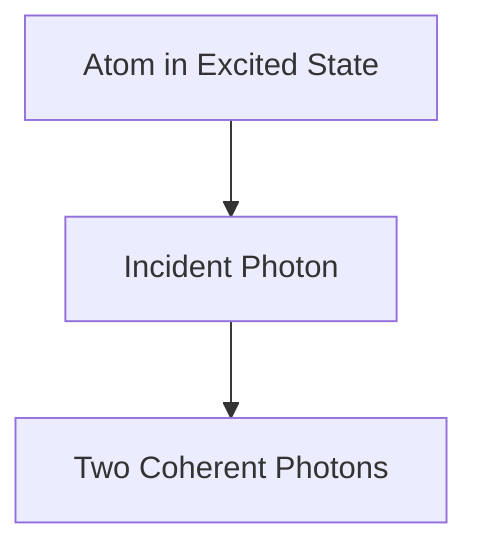

# Física: Como funciona o laser

O laser amplifica a luz por meio da emissão estimulada.

## Processo de emissão estimulada

## Equação de taxa
$$ \frac{dN_2}{dt} = R - \frac{N_2}{\tau} - B \rho (\nu) (N_2 - N_1) $$

## Verificação técnica adicional parte 1

Nesta seção, nos aprofundamos em mais detalhes técnicos e estudos de caso. Avaliamos o desempenho sob várias condições e examinamos os desafios e soluções relacionados à integração com outros sistemas. Também consideramos perspectivas futuras e limitações.

## Verificação técnica adicional parte 2

Nesta seção, nos aprofundamos em mais detalhes técnicos e estudos de caso. Avaliamos o desempenho sob várias condições e examinamos os desafios e soluções relacionados à integração com outros sistemas. Também consideramos perspectivas futuras e limitações.

## Verificação técnica adicional parte 3

Nesta seção, nos aprofundamos em mais detalhes técnicos e estudos de caso. Avaliamos o desempenho sob várias condições e examinamos os desafios e soluções relacionados à integração com outros sistemas. Também consideramos perspectivas futuras e limitações.

## Verificação técnica adicional parte 4

Nesta seção, nos aprofundamos em mais detalhes técnicos e estudos de caso. Avaliamos o desempenho sob várias condições e examinamos os desafios e soluções relacionados à integração com outros sistemas. Também consideramos perspectivas futuras e limitações.

## Verificação técnica adicional parte 5

Nesta seção, nos aprofundamos em mais detalhes técnicos e estudos de caso. Avaliamos o desempenho sob várias condições e examinamos os desafios e soluções relacionados à integração com outros sistemas. Também consideramos perspectivas futuras e limitações.

## Verificação técnica adicional parte 6

Nesta seção, nos aprofundamos em mais detalhes técnicos e estudos de caso. Avaliamos o desempenho sob várias condições e examinamos os desafios e soluções relacionados à integração com outros sistemas. Também consideramos perspectivas futuras e limitações.

## Verificação técnica adicional parte 7

Nesta seção, nos aprofundamos em mais detalhes técnicos e estudos de caso. Avaliamos o desempenho sob várias condições e examinamos os desafios e soluções relacionados à integração com outros sistemas. Também consideramos perspectivas futuras e limitações.

## Verificação técnica adicional parte 8

Nesta seção, nos aprofundamos em mais detalhes técnicos e estudos de caso. Avaliamos o desempenho sob várias condições e examinamos os desafios e soluções relacionados à integração com outros sistemas. Também consideramos perspectivas futuras e limitações.

## Verificação técnica adicional parte 9

Nesta seção, nos aprofundamos em mais detalhes técnicos e estudos de caso. Avaliamos o desempenho sob várias condições e examinamos os desafios e soluções relacionados à integração com outros sistemas. Também consideramos perspectivas futuras e limitações.

## Verificação técnica adicional parte 10

Nesta seção, nos aprofundamos em mais detalhes técnicos e estudos de caso. Avaliamos o desempenho sob várias condições e examinamos os desafios e soluções relacionados à integração com outros sistemas. Também consideramos perspectivas futuras e limitações.

## Verificação técnica adicional parte 11

Nesta seção, nos aprofundamos em mais detalhes técnicos e estudos de caso. Avaliamos o desempenho sob várias condições e examinamos os desafios e soluções relacionados à integração com outros sistemas. Também consideramos perspectivas futuras e limitações.

## Verificação técnica adicional parte 12

Nesta seção, nos aprofundamos em mais detalhes técnicos e estudos de caso. Avaliamos o desempenho sob várias condições e examinamos os desafios e soluções relacionados à integração com outros sistemas. Também consideramos perspectivas futuras e limitações.

## Verificação técnica adicional parte 13

Nesta seção, nos aprofundamos em mais detalhes técnicos e estudos de caso. Avaliamos o desempenho sob várias condições e examinamos os desafios e soluções relacionados à integração com outros sistemas. Também consideramos perspectivas futuras e limitações.

## Verificação técnica adicional parte 14

Nesta seção, nos aprofundamos em mais detalhes técnicos e estudos de caso. Avaliamos o desempenho sob várias condições e examinamos os desafios e soluções relacionados à integração com outros sistemas. Também consideramos perspectivas futuras e limitações.

## Verificação técnica adicional parte 15

Nesta seção, nos aprofundamos em mais detalhes técnicos e estudos de caso. Avaliamos o desempenho sob várias condições e examinamos os desafios e soluções relacionados à integração com outros sistemas. Também consideramos perspectivas futuras e limitações.

## Verificação técnica adicional parte 16

Nesta seção, nos aprofundamos em mais detalhes técnicos e estudos de caso. Avaliamos o desempenho sob várias condições e examinamos os desafios e soluções relacionados à integração com outros sistemas. Também consideramos perspectivas futuras e limitações.

## Verificação técnica adicional parte 17

Nesta seção, nos aprofundamos em mais detalhes técnicos e estudos de caso. Avaliamos o desempenho sob várias condições e examinamos os desafios e soluções relacionados à integração com outros sistemas. Também consideramos perspectivas futuras e limitações.

## Verificação técnica adicional parte 18

Nesta seção, nos aprofundamos em mais detalhes técnicos e estudos de caso. Avaliamos o desempenho sob várias condições e examinamos os desafios e soluções relacionados à integração com outros sistemas. Também consideramos perspectivas futuras e limitações.

## Verificação técnica adicional parte 19

Nesta seção, nos aprofundamos em mais detalhes técnicos e estudos de caso. Avaliamos o desempenho sob várias condições e examinamos os desafios e soluções relacionados à integração com outros sistemas. Também consideramos perspectivas futuras e limitações.

## Verificação técnica adicional parte 20

Nesta seção, nos aprofundamos em mais detalhes técnicos e estudos de caso. Avaliamos o desempenho sob várias condições e examinamos os desafios e soluções relacionados à integração com outros sistemas. Também consideramos perspectivas futuras e limitações.

## Verificação técnica adicional parte 21

Nesta seção, nos aprofundamos em mais detalhes técnicos e estudos de caso. Avaliamos o desempenho sob várias condições e examinamos os desafios e soluções relacionados à integração com outros sistemas. Também consideramos perspectivas futuras e limitações.

## Verificação técnica adicional parte 22

Nesta seção, nos aprofundamos em mais detalhes técnicos e estudos de caso. Avaliamos o desempenho sob várias condições e examinamos os desafios e soluções relacionados à integração com outros sistemas. Também consideramos perspectivas futuras e limitações.

## Verificação técnica adicional parte 23

Nesta seção, nos aprofundamos em mais detalhes técnicos e estudos de caso. Avaliamos o desempenho sob várias condições e examinamos os desafios e soluções relacionados à integração com outros sistemas. Também consideramos perspectivas futuras e limitações.

## Verificação técnica adicional parte 24

Nesta seção, nos aprofundamos em mais detalhes técnicos e estudos de caso. Avaliamos o desempenho sob várias condições e examinamos os desafios e soluções relacionados à integração com outros sistemas. Também consideramos perspectivas futuras e limitações.

## Verificação técnica adicional parte 25

Nesta seção, nos aprofundamos em mais detalhes técnicos e estudos de caso. Avaliamos o desempenho sob várias condições e examinamos os desafios e soluções relacionados à integração com outros sistemas. Também consideramos perspectivas futuras e limitações.

## Verificação técnica adicional parte 26

Nesta seção, nos aprofundamos em mais detalhes técnicos e estudos de caso. Avaliamos o desempenho sob várias condições e examinamos os desafios e soluções relacionados à integração com outros sistemas. Também consideramos perspectivas futuras e limitações.

## Verificação técnica adicional parte 27

Nesta seção, nos aprofundamos em mais detalhes técnicos e estudos de caso. Avaliamos o desempenho sob várias condições e examinamos os desafios e soluções relacionados à integração com outros sistemas. Também consideramos perspectivas futuras e limitações.

## Verificação técnica adicional parte 28

Nesta seção, nos aprofundamos em mais detalhes técnicos e estudos de caso. Avaliamos o desempenho sob várias condições e examinamos os desafios e soluções relacionados à integração com outros sistemas. Também consideramos perspectivas futuras e limitações.

## Verificação técnica adicional parte 29

Nesta seção, nos aprofundamos em mais detalhes técnicos e estudos de caso. Avaliamos o desempenho sob várias condições e examinamos os desafios e soluções relacionados à integração com outros sistemas. Também consideramos perspectivas futuras e limitações.

## Verificação técnica adicional parte 30

Nesta seção, nos aprofundamos em mais detalhes técnicos e estudos de caso. Avaliamos o desempenho sob várias condições e examinamos os desafios e soluções relacionados à integração com outros sistemas. Também consideramos perspectivas futuras e limitações.

## Verificação técnica adicional parte 31

Nesta seção, nos aprofundamos em mais detalhes técnicos e estudos de caso. Avaliamos o desempenho sob várias condições e examinamos os desafios e soluções relacionados à integração com outros sistemas. Também consideramos perspectivas futuras e limitações.

## Verificação técnica adicional parte 32

Nesta seção, nos aprofundamos em mais detalhes técnicos e estudos de caso. Avaliamos o desempenho sob várias condições e examinamos os desafios e soluções relacionados à integração com outros sistemas. Também consideramos perspectivas futuras e limitações.

## Verificação técnica adicional parte 33

Nesta seção, nos aprofundamos em mais detalhes técnicos e estudos de caso. Avaliamos o desempenho sob várias condições e examinamos os desafios e soluções relacionados à integração com outros sistemas. Também consideramos perspectivas futuras e limitações.

## Verificação técnica adicional parte 34

Nesta seção, nos aprofundamos em mais detalhes técnicos e estudos de caso. Avaliamos o desempenho sob várias condições e examinamos os desafios e soluções relacionados à integração com outros sistemas. Também consideramos perspectivas futuras e limitações.

## Verificação técnica adicional parte 35

Nesta seção, nos aprofundamos em mais detalhes técnicos e estudos de caso. Avaliamos o desempenho sob várias condições e examinamos os desafios e soluções relacionados à integração com outros sistemas. Também consideramos perspectivas futuras e limitações.

## Verificação técnica adicional parte 36

Nesta seção, nos aprofundamos em mais detalhes técnicos e estudos de caso. Avaliamos o desempenho sob várias condições e examinamos os desafios e soluções relacionados à integração com outros sistemas. Também consideramos perspectivas futuras e limitações.

## Verificação técnica adicional parte 37

Nesta seção, nos aprofundamos em mais detalhes técnicos e estudos de caso. Avaliamos o desempenho sob várias condições e examinamos os desafios e soluções relacionados à integração com outros sistemas. Também consideramos perspectivas futuras e limitações.

## Verificação técnica adicional parte 38

Nesta seção, nos aprofundamos em mais detalhes técnicos e estudos de caso. Avaliamos o desempenho sob várias condições e examinamos os desafios e soluções relacionados à integração com outros sistemas. Também consideramos perspectivas futuras e limitações.

## Verificação técnica adicional parte 39

Nesta seção, nos aprofundamos em mais detalhes técnicos e estudos de caso. Avaliamos o desempenho sob várias condições e examinamos os desafios e soluções relacionados à integração com outros sistemas. Também consideramos perspectivas futuras e limitações.

## Verificação técnica adicional parte 40

Nesta seção, nos aprofundamos em mais detalhes técnicos e estudos de caso. Avaliamos o desempenho sob várias condições e examinamos os desafios e soluções relacionados à integração com outros sistemas. Também consideramos perspectivas futuras e limitações.

## Verificação técnica adicional parte 41

Nesta seção, nos aprofundamos em mais detalhes técnicos e estudos de caso. Avaliamos o desempenho sob várias condições e examinamos os desafios e soluções relacionados à integração com outros sistemas. Também consideramos perspectivas futuras e limitações.

## Verificação técnica adicional parte 42

Nesta seção, nos aprofundamos em mais detalhes técnicos e estudos de caso. Avaliamos o desempenho sob várias condições e examinamos os desafios e soluções relacionados à integração com outros sistemas. Também consideramos perspectivas futuras e limitações.

## Verificação técnica adicional parte 43

Nesta seção, nos aprofundamos em mais detalhes técnicos e estudos de caso. Avaliamos o desempenho sob várias condições e examinamos os desafios e soluções relacionados à integração com outros sistemas. Também consideramos perspectivas futuras e limitações.

## Verificação técnica adicional parte 44

Nesta seção, nos aprofundamos em mais detalhes técnicos e estudos de caso. Avaliamos o desempenho sob várias condições e examinamos os desafios e soluções relacionados à integração com outros sistemas. Também consideramos perspectivas futuras e limitações.

## Verificação técnica adicional parte 45

Nesta seção, nos aprofundamos em mais detalhes técnicos e estudos de caso. Avaliamos o desempenho sob várias condições e examinamos os desafios e soluções relacionados à integração com outros sistemas. Também consideramos perspectivas futuras e limitações.

## Verificação técnica adicional parte 46

Nesta seção, nos aprofundamos em mais detalhes técnicos e estudos de caso. Avaliamos o desempenho sob várias condições e examinamos os desafios e soluções relacionados à integração com outros sistemas. Também consideramos perspectivas futuras e limitações.

## Verificação técnica adicional parte 47

Nesta seção, nos aprofundamos em mais detalhes técnicos e estudos de caso. Avaliamos o desempenho sob várias condições e examinamos os desafios e soluções relacionados à integração com outros sistemas. Também consideramos perspectivas futuras e limitações.

## Verificação técnica adicional parte 48

Nesta seção, nos aprofundamos em mais detalhes técnicos e estudos de caso. Avaliamos o desempenho sob várias condições e examinamos os desafios e soluções relacionados à integração com outros sistemas. Também consideramos perspectivas futuras e limitações.

## Verificação técnica adicional parte 49

Nesta seção, nos aprofundamos em mais detalhes técnicos e estudos de caso. Avaliamos o desempenho sob várias condições e examinamos os desafios e soluções relacionados à integração com outros sistemas. Também consideramos perspectivas futuras e limitações.

## Verificação técnica adicional parte 50

Nesta seção, nos aprofundamos em mais detalhes técnicos e estudos de caso. Avaliamos o desempenho sob várias condições e examinamos os desafios e soluções relacionados à integração com outros sistemas. Também consideramos perspectivas futuras e limitações.

## Verificação técnica adicional parte 51

Nesta seção, nos aprofundamos em mais detalhes técnicos e estudos de caso. Avaliamos o desempenho sob várias condições e examinamos os desafios e soluções relacionados à integração com outros sistemas. Também consideramos perspectivas futuras e limitações.

## Verificação técnica adicional parte 52

Nesta seção, nos aprofundamos em mais detalhes técnicos e estudos de caso. Avaliamos o desempenho sob várias condições e examinamos os desafios e soluções relacionados à integração com outros sistemas. Também consideramos perspectivas futuras e limitações.

## Verificação técnica adicional parte 53

Nesta seção, nos aprofundamos em mais detalhes técnicos e estudos de caso. Avaliamos o desempenho sob várias condições e examinamos os desafios e soluções relacionados à integração com outros sistemas. Também consideramos perspectivas futuras e limitações.

## Verificação técnica adicional parte 54

Nesta seção, nos aprofundamos em mais detalhes técnicos e estudos de caso. Avaliamos o desempenho sob várias condições e examinamos os desafios e soluções relacionados à integração com outros sistemas. Também consideramos perspectivas futuras e limitações.

## Verificação técnica adicional parte 55

Nesta seção, nos aprofundamos em mais detalhes técnicos e estudos de caso. Avaliamos o desempenho sob várias condições e examinamos os desafios e soluções relacionados à integração com outros sistemas. Também consideramos perspectivas futuras e limitações.

## Verificação técnica adicional parte 56

Nesta seção, nos aprofundamos em mais detalhes técnicos e estudos de caso. Avaliamos o desempenho sob várias condições e examinamos os desafios e soluções relacionados à integração com outros sistemas. Também consideramos perspectivas futuras e limitações.

## Verificação técnica adicional parte 57

Nesta seção, nos aprofundamos em mais detalhes técnicos e estudos de caso. Avaliamos o desempenho sob várias condições e examinamos os desafios e soluções relacionados à integração com outros sistemas. Também consideramos perspectivas futuras e limitações.

## Verificação técnica adicional parte 58

Nesta seção, nos aprofundamos em mais detalhes técnicos e estudos de caso. Avaliamos o desempenho sob várias condições e examinamos os desafios e soluções relacionados à integração com outros sistemas. Também consideramos perspectivas futuras e limitações.

## Verificação técnica adicional parte 59

Nesta seção, nos aprofundamos em mais detalhes técnicos e estudos de caso. Avaliamos o desempenho sob várias condições e examinamos os desafios e soluções relacionados à integração com outros sistemas. Também consideramos perspectivas futuras e limitações.

## Verificação técnica adicional parte 60

Nesta seção, nos aprofundamos em mais detalhes técnicos e estudos de caso. Avaliamos o desempenho sob várias condições e examinamos os desafios e soluções relacionados à integração com outros sistemas. Também consideramos perspectivas futuras e limitações.

## Verificação técnica adicional parte 61

Nesta seção, nos aprofundamos em mais detalhes técnicos e estudos de caso. Avaliamos o desempenho sob várias condições e examinamos os desafios e soluções relacionados à integração com outros sistemas. Também consideramos perspectivas futuras e limitações.

## Verificação técnica adicional parte 62

Nesta seção, nos aprofundamos em mais detalhes técnicos e estudos de caso. Avaliamos o desempenho sob várias condições e examinamos os desafios e soluções relacionados à integração com outros sistemas. Também consideramos perspectivas futuras e limitações.

## Verificação técnica adicional parte 63

Nesta seção, nos aprofundamos em mais detalhes técnicos e estudos de caso. Avaliamos o desempenho sob várias condições e examinamos os desafios e soluções relacionados à integração com outros sistemas. Também consideramos perspectivas futuras e limitações.

## Verificação técnica adicional parte 64

Nesta seção, nos aprofundamos em mais detalhes técnicos e estudos de caso. Avaliamos o desempenho sob várias condições e examinamos os desafios e soluções relacionados à integração com outros sistemas. Também consideramos perspectivas futuras e limitações.

## Verificação técnica adicional parte 65

Nesta seção, nos aprofundamos em mais detalhes técnicos e estudos de caso. Avaliamos o desempenho sob várias condições e examinamos os desafios e soluções relacionados à integração com outros sistemas. Também consideramos perspectivas futuras e limitações.

## Verificação técnica adicional parte 66

Nesta seção, nos aprofundamos em mais detalhes técnicos e estudos de caso. Avaliamos o desempenho sob várias condições e examinamos os desafios e soluções relacionados à integração com outros sistemas. Também consideramos perspectivas futuras e limitações.

## Verificação técnica adicional parte 67

Nesta seção, nos aprofundamos em mais detalhes técnicos e estudos de caso. Avaliamos o desempenho sob várias condições e examinamos os desafios e soluções relacionados à integração com outros sistemas. Também consideramos perspectivas futuras e limitações.

## Verificação técnica adicional parte 68

Nesta seção, nos aprofundamos em mais detalhes técnicos e estudos de caso. Avaliamos o desempenho sob várias condições e examinamos os desafios e soluções relacionados à integração com outros sistemas. Também consideramos perspectivas futuras e limitações.

## Verificação técnica adicional parte 69

Nesta seção, nos aprofundamos em mais detalhes técnicos e estudos de caso. Avaliamos o desempenho sob várias condições e examinamos os desafios e soluções relacionados à integração com outros sistemas. Também consideramos perspectivas futuras e limitações.

## Verificação técnica adicional parte 70

Nesta seção, nos aprofundamos em mais detalhes técnicos e estudos de caso. Avaliamos o desempenho sob várias condições e examinamos os desafios e soluções relacionados à integração com outros sistemas. Também consideramos perspectivas futuras e limitações.

## Verificação técnica adicional parte 71

Nesta seção, nos aprofundamos em mais detalhes técnicos e estudos de caso. Avaliamos o desempenho sob várias condições e examinamos os desafios e soluções relacionados à integração com outros sistemas. Também consideramos perspectivas futuras e limitações.

## Verificação técnica adicional parte 72

Nesta seção, nos aprofundamos em mais detalhes técnicos e estudos de caso. Avaliamos o desempenho sob várias condições e examinamos os desafios e soluções relacionados à integração com outros sistemas. Também consideramos perspectivas futuras e limitações.

## Verificação técnica adicional parte 73

Nesta seção, nos aprofundamos em mais detalhes técnicos e estudos de caso. Avaliamos o desempenho sob várias condições e examinamos os desafios e soluções relacionados à integração com outros sistemas. Também consideramos perspectivas futuras e limitações.

## Verificação técnica adicional parte 74

Nesta seção, nos aprofundamos em mais detalhes técnicos e estudos de caso. Avaliamos o desempenho sob várias condições e examinamos os desafios e soluções relacionados à integração com outros sistemas. Também consideramos perspectivas futuras e limitações.

## Verificação técnica adicional parte 75

Nesta seção, nos aprofundamos em mais detalhes técnicos e estudos de caso. Avaliamos o desempenho sob várias condições e examinamos os desafios e soluções relacionados à integração com outros sistemas. Também consideramos perspectivas futuras e limitações.

## Verificação técnica adicional parte 76

Nesta seção, nos aprofundamos em mais detalhes técnicos e estudos de caso. Avaliamos o desempenho sob várias condições e examinamos os desafios e soluções relacionados à integração com outros sistemas. Também consideramos perspectivas futuras e limitações.

## Verificação técnica adicional parte 77

Nesta seção, nos aprofundamos em mais detalhes técnicos e estudos de caso. Avaliamos o desempenho sob várias condições e examinamos os desafios e soluções relacionados à integração com outros sistemas. Também consideramos perspectivas futuras e limitações.

## Verificação técnica adicional parte 78

Nesta seção, nos aprofundamos em mais detalhes técnicos e estudos de caso. Avaliamos o desempenho sob várias condições e examinamos os desafios e soluções relacionados à integração com outros sistemas. Também consideramos perspectivas futuras e limitações.

## Verificação técnica adicional parte 79

Nesta seção, nos aprofundamos em mais detalhes técnicos e estudos de caso. Avaliamos o desempenho sob várias condições e examinamos os desafios e soluções relacionados à integração com outros sistemas. Também consideramos perspectivas futuras e limitações.

## Verificação técnica adicional parte 80

Nesta seção, nos aprofundamos em mais detalhes técnicos e estudos de caso. Avaliamos o desempenho sob várias condições e examinamos os desafios e soluções relacionados à integração com outros sistemas. Também consideramos perspectivas futuras e limitações.

## Verificação técnica adicional parte 81

Nesta seção, nos aprofundamos em mais detalhes técnicos e estudos de caso. Avaliamos o desempenho sob várias condições e examinamos os desafios e soluções relacionados à integração com outros sistemas. Também consideramos perspectivas futuras e limitações.

## Verificação técnica adicional parte 82

Nesta seção, nos aprofundamos em mais detalhes técnicos e estudos de caso. Avaliamos o desempenho sob várias condições e examinamos os desafios e soluções relacionados à integração com outros sistemas. Também consideramos perspectivas futuras e limitações.

## Verificação técnica adicional parte 83

Nesta seção, nos aprofundamos em mais detalhes técnicos e estudos de caso. Avaliamos o desempenho sob várias condições e examinamos os desafios e soluções relacionados à integração com outros sistemas. Também consideramos perspectivas futuras e limitações.

## Verificação técnica adicional parte 84

Nesta seção, nos aprofundamos em mais detalhes técnicos e estudos de caso. Avaliamos o desempenho sob várias condições e examinamos os desafios e soluções relacionados à integração com outros sistemas. Também consideramos perspectivas futuras e limitações.

## Verificação técnica adicional parte 85

Nesta seção, nos aprofundamos em mais detalhes técnicos e estudos de caso. Avaliamos o desempenho sob várias condições e examinamos os desafios e soluções relacionados à integração com outros sistemas. Também consideramos perspectivas futuras e limitações.

## Verificação técnica adicional parte 86

Nesta seção, nos aprofundamos em mais detalhes técnicos e estudos de caso. Avaliamos o desempenho sob várias condições e examinamos os desafios e soluções relacionados à integração com outros sistemas. Também consideramos perspectivas futuras e limitações.

## Verificação técnica adicional parte 87

Nesta seção, nos aprofundamos em mais detalhes técnicos e estudos de caso. Avaliamos o desempenho sob várias condições e examinamos os desafios e soluções relacionados à integração com outros sistemas. Também consideramos perspectivas futuras e limitações.

## Verificação técnica adicional parte 88

Nesta seção, nos aprofundamos em mais detalhes técnicos e estudos de caso. Avaliamos o desempenho sob várias condições e examinamos os desafios e soluções relacionados à integração com outros sistemas. Também consideramos perspectivas futuras e limitações.

## Verificação técnica adicional parte 89

Nesta seção, nos aprofundamos em mais detalhes técnicos e estudos de caso. Avaliamos o desempenho sob várias condições e examinamos os desafios e soluções relacionados à integração com outros sistemas. Também consideramos perspectivas futuras e limitações.

## Verificação técnica adicional parte 90

Nesta seção, nos aprofundamos em mais detalhes técnicos e estudos de caso. Avaliamos o desempenho sob várias condições e examinamos os desafios e soluções relacionados à integração com outros sistemas. Também consideramos perspectivas futuras e limitações.

## Verificação técnica adicional parte 91

Nesta seção, nos aprofundamos em mais detalhes técnicos e estudos de caso. Avaliamos o desempenho sob várias condições e examinamos os desafios e soluções relacionados à integração com outros sistemas. Também consideramos perspectivas futuras e limitações.

## Verificação técnica adicional parte 92

Nesta seção, nos aprofundamos em mais detalhes técnicos e estudos de caso. Avaliamos o desempenho sob várias condições e examinamos os desafios e soluções relacionados à integração com outros sistemas. Também consideramos perspectivas futuras e limitações.

## Verificação técnica adicional parte 93

Nesta seção, nos aprofundamos em mais detalhes técnicos e estudos de caso. Avaliamos o desempenho sob várias condições e examinamos os desafios e soluções relacionados à integração com outros sistemas. Também consideramos perspectivas futuras e limitações.

## Verificação técnica adicional parte 94

Nesta seção, nos aprofundamos em mais detalhes técnicos e estudos de caso. Avaliamos o desempenho sob várias condições e examinamos os desafios e soluções relacionados à integração com outros sistemas. Também consideramos perspectivas futuras e limitações.

## Verificação técnica adicional parte 95

Nesta seção, nos aprofundamos em mais detalhes técnicos e estudos de caso. Avaliamos o desempenho sob várias condições e examinamos os desafios e soluções relacionados à integração com outros sistemas. Também consideramos perspectivas futuras e limitações.

## Verificação técnica adicional parte 96

Nesta seção, nos aprofundamos em mais detalhes técnicos e estudos de caso. Avaliamos o desempenho sob várias condições e examinamos os desafios e soluções relacionados à integração com outros sistemas. Também consideramos perspectivas futuras e limitações.

## Verificação técnica adicional parte 97

Nesta seção, nos aprofundamos em mais detalhes técnicos e estudos de caso. Avaliamos o desempenho sob várias condições e examinamos os desafios e soluções relacionados à integração com outros sistemas. Também consideramos perspectivas futuras e limitações.

## Verificação técnica adicional parte 98

Nesta seção, nos aprofundamos em mais detalhes técnicos e estudos de caso. Avaliamos o desempenho sob várias condições e examinamos os desafios e soluções relacionados à integração com outros sistemas. Também consideramos perspectivas futuras e limitações.

## Verificação técnica adicional parte 99

Nesta seção, nos aprofundamos em mais detalhes técnicos e estudos de caso. Avaliamos o desempenho sob várias condições e examinamos os desafios e soluções relacionados à integração com outros sistemas. Também consideramos perspectivas futuras e limitações.

## Verificação técnica adicional parte 100

Nesta seção, nos aprofundamos em mais detalhes técnicos e estudos de caso. Avaliamos o desempenho sob várias condições e examinamos os desafios e soluções relacionados à integração com outros sistemas. Também consideramos perspectivas futuras e limitações.

## Verificação técnica adicional parte 101

Nesta seção, nos aprofundamos em mais detalhes técnicos e estudos de caso. Avaliamos o desempenho sob várias condições e examinamos os desafios e soluções relacionados à integração com outros sistemas. Também consideramos perspectivas futuras e limitações.

## Verificação técnica adicional parte 102

Nesta seção, nos aprofundamos em mais detalhes técnicos e estudos de caso. Avaliamos o desempenho sob várias condições e examinamos os desafios e soluções relacionados à integração com outros sistemas. Também consideramos perspectivas futuras e limitações.

## Verificação técnica adicional parte 103

Nesta seção, nos aprofundamos em mais detalhes técnicos e estudos de caso. Avaliamos o desempenho sob várias condições e examinamos os desafios e soluções relacionados à integração com outros sistemas. Também consideramos perspectivas futuras e limitações.

## Verificação técnica adicional parte 104

Nesta seção, nos aprofundamos em mais detalhes técnicos e estudos de caso. Avaliamos o desempenho sob várias condições e examinamos os desafios e soluções relacionados à integração com outros sistemas. Também consideramos perspectivas futuras e limitações.

## Verificação técnica adicional parte 105

Nesta seção, nos aprofundamos em mais detalhes técnicos e estudos de caso. Avaliamos o desempenho sob várias condições e examinamos os desafios e soluções relacionados à integração com outros sistemas. Também consideramos perspectivas futuras e limitações.

## Verificação técnica adicional parte 106

Nesta seção, nos aprofundamos em mais detalhes técnicos e estudos de caso. Avaliamos o desempenho sob várias condições e examinamos os desafios e soluções relacionados à integração com outros sistemas. Também consideramos perspectivas futuras e limitações.

## Verificação técnica adicional parte 107

Nesta seção, nos aprofundamos em mais detalhes técnicos e estudos de caso. Avaliamos o desempenho sob várias condições e examinamos os desafios e soluções relacionados à integração com outros sistemas. Também consideramos perspectivas futuras e limitações.

## Verificação técnica adicional parte 108

Nesta seção, nos aprofundamos em mais detalhes técnicos e estudos de caso. Avaliamos o desempenho sob várias condições e examinamos os desafios e soluções relacionados à integração com outros sistemas. Também consideramos perspectivas futuras e limitações.

## Verificação técnica adicional parte 109

Nesta seção, nos aprofundamos em mais detalhes técnicos e estudos de caso. Avaliamos o desempenho sob várias condições e examinamos os desafios e soluções relacionados à integração com outros sistemas. Também consideramos perspectivas futuras e limitações.

## Verificação técnica adicional parte 110

Nesta seção, nos aprofundamos em mais detalhes técnicos e estudos de caso. Avaliamos o desempenho sob várias condições e examinamos os desafios e soluções relacionados à integração com outros sistemas. Também consideramos perspectivas futuras e limitações.

## Verificação técnica adicional parte 111

Nesta seção, nos aprofundamos em mais detalhes técnicos e estudos de caso. Avaliamos o desempenho sob várias condições e examinamos os desafios e soluções relacionados à integração com outros sistemas. Também consideramos perspectivas futuras e limitações.

## Verificação técnica adicional parte 112

Nesta seção, nos aprofundamos em mais detalhes técnicos e estudos de caso. Avaliamos o desempenho sob várias condições e examinamos os desafios e soluções relacionados à integração com outros sistemas. Também consideramos perspectivas futuras e limitações.

## Verificação técnica adicional parte 113

Nesta seção, nos aprofundamos em mais detalhes técnicos e estudos de caso. Avaliamos o desempenho sob várias condições e examinamos os desafios e soluções relacionados à integração com outros sistemas. Também consideramos perspectivas futuras e limitações.

## Verificação técnica adicional parte 114

Nesta seção, nos aprofundamos em mais detalhes técnicos e estudos de caso. Avaliamos o desempenho sob várias condições e examinamos os desafios e soluções relacionados à integração com outros sistemas. Também consideramos perspectivas futuras e limitações.

## Verificação técnica adicional parte 115

Nesta seção, nos aprofundamos em mais detalhes técnicos e estudos de caso. Avaliamos o desempenho sob várias condições e examinamos os desafios e soluções relacionados à integração com outros sistemas. Também consideramos perspectivas futuras e limitações.

## Verificação técnica adicional parte 116

Nesta seção, nos aprofundamos em mais detalhes técnicos e estudos de caso. Avaliamos o desempenho sob várias condições e examinamos os desafios e soluções relacionados à integração com outros sistemas. Também consideramos perspectivas futuras e limitações.

## Verificação técnica adicional parte 117

Nesta seção, nos aprofundamos em mais detalhes técnicos e estudos de caso. Avaliamos o desempenho sob várias condições e examinamos os desafios e soluções relacionados à integração com outros sistemas. Também consideramos perspectivas futuras e limitações.

## Verificação técnica adicional parte 118

Nesta seção, nos aprofundamos em mais detalhes técnicos e estudos de caso. Avaliamos o desempenho sob várias condições e examinamos os desafios e soluções relacionados à integração com outros sistemas. Também consideramos perspectivas futuras e limitações.

## Verificação técnica adicional parte 119

Nesta seção, nos aprofundamos em mais detalhes técnicos e estudos de caso. Avaliamos o desempenho sob várias condições e examinamos os desafios e soluções relacionados à integração com outros sistemas. Também consideramos perspectivas futuras e limitações.

## Verificação técnica adicional parte 120

Nesta seção, nos aprofundamos em mais detalhes técnicos e estudos de caso. Avaliamos o desempenho sob várias condições e examinamos os desafios e soluções relacionados à integração com outros sistemas. Também consideramos perspectivas futuras e limitações.

## Verificação técnica adicional parte 121

Nesta seção, nos aprofundamos em mais detalhes técnicos e estudos de caso. Avaliamos o desempenho sob várias condições e examinamos os desafios e soluções relacionados à integração com outros sistemas. Também consideramos perspectivas futuras e limitações.

## Verificação técnica adicional parte 122

Nesta seção, nos aprofundamos em mais detalhes técnicos e estudos de caso. Avaliamos o desempenho sob várias condições e examinamos os desafios e soluções relacionados à integração com outros sistemas. Também consideramos perspectivas futuras e limitações.

## Verificação técnica adicional parte 123

Nesta seção, nos aprofundamos em mais detalhes técnicos e estudos de caso. Avaliamos o desempenho sob várias condições e examinamos os desafios e soluções relacionados à integração com outros sistemas. Também consideramos perspectivas futuras e limitações.

## Verificação técnica adicional parte 124

Nesta seção, nos aprofundamos em mais detalhes técnicos e estudos de caso. Avaliamos o desempenho sob várias condições e examinamos os desafios e soluções relacionados à integração com outros sistemas. Também consideramos perspectivas futuras e limitações.

## Verificação técnica adicional parte 125

Nesta seção, nos aprofundamos em mais detalhes técnicos e estudos de caso. Avaliamos o desempenho sob várias condições e examinamos os desafios e soluções relacionados à integração com outros sistemas. Também consideramos perspectivas futuras e limitações.

## Verificação técnica adicional parte 126

Nesta seção, nos aprofundamos em mais detalhes técnicos e estudos de caso. Avaliamos o desempenho sob várias condições e examinamos os desafios e soluções relacionados à integração com outros sistemas. Também consideramos perspectivas futuras e limitações.

## Verificação técnica adicional parte 127

Nesta seção, nos aprofundamos em mais detalhes técnicos e estudos de caso. Avaliamos o desempenho sob várias condições e examinamos os desafios e soluções relacionados à integração com outros sistemas. Também consideramos perspectivas futuras e limitações.

## Verificação técnica adicional parte 128

Nesta seção, nos aprofundamos em mais detalhes técnicos e estudos de caso. Avaliamos o desempenho sob várias condições e examinamos os desafios e soluções relacionados à integração com outros sistemas. Também consideramos perspectivas futuras e limitações.

## Verificação técnica adicional parte 129

Nesta seção, nos aprofundamos em mais detalhes técnicos e estudos de caso. Avaliamos o desempenho sob várias condições e examinamos os desafios e soluções relacionados à integração com outros sistemas. Também consideramos perspectivas futuras e limitações.

## Verificação técnica adicional parte 130

Nesta seção, nos aprofundamos em mais detalhes técnicos e estudos de caso. Avaliamos o desempenho sob várias condições e examinamos os desafios e soluções relacionados à integração com outros sistemas. Também consideramos perspectivas futuras e limitações.

## Verificação técnica adicional parte 131

Nesta seção, nos aprofundamos em mais detalhes técnicos e estudos de caso. Avaliamos o desempenho sob várias condições e examinamos os desafios e soluções relacionados à integração com outros sistemas. Também consideramos perspectivas futuras e limitações.

## Verificação técnica adicional parte 132

Nesta seção, nos aprofundamos em mais detalhes técnicos e estudos de caso. Avaliamos o desempenho sob várias condições e examinamos os desafios e soluções relacionados à integração com outros sistemas. Também consideramos perspectivas futuras e limitações.

## Verificação técnica adicional parte 133

Nesta seção, nos aprofundamos em mais detalhes técnicos e estudos de caso. Avaliamos o desempenho sob várias condições e examinamos os desafios e soluções relacionados à integração com outros sistemas. Também consideramos perspectivas futuras e limitações.

## Verificação técnica adicional parte 134

Nesta seção, nos aprofundamos em mais detalhes técnicos e estudos de caso. Avaliamos o desempenho sob várias condições e examinamos os desafios e soluções relacionados à integração com outros sistemas. Também consideramos perspectivas futuras e limitações.

## Verificação técnica adicional parte 135

Nesta seção, nos aprofundamos em mais detalhes técnicos e estudos de caso. Avaliamos o desempenho sob várias condições e examinamos os desafios e soluções relacionados à integração com outros sistemas. Também consideramos perspectivas futuras e limitações.

## Verificação técnica adicional parte 136

Nesta seção, nos aprofundamos em mais detalhes técnicos e estudos de caso. Avaliamos o desempenho sob várias condições e examinamos os desafios e soluções relacionados à integração com outros sistemas. Também consideramos perspectivas futuras e limitações.

## Verificação técnica adicional parte 137

Nesta seção, nos aprofundamos em mais detalhes técnicos e estudos de caso. Avaliamos o desempenho sob várias condições e examinamos os desafios e soluções relacionados à integração com outros sistemas. Também consideramos perspectivas futuras e limitações.

## Verificação técnica adicional parte 138

Nesta seção, nos aprofundamos em mais detalhes técnicos e estudos de caso. Avaliamos o desempenho sob várias condições e examinamos os desafios e soluções relacionados à integração com outros sistemas. Também consideramos perspectivas futuras e limitações.

## Verificação técnica adicional parte 139

Nesta seção, nos aprofundamos em mais detalhes técnicos e estudos de caso. Avaliamos o desempenho sob várias condições e examinamos os desafios e soluções relacionados à integração com outros sistemas. Também consideramos perspectivas futuras e limitações.

## Verificação técnica adicional parte 140

Nesta seção, nos aprofundamos em mais detalhes técnicos e estudos de caso. Avaliamos o desempenho sob várias condições e examinamos os desafios e soluções relacionados à integração com outros sistemas. Também consideramos perspectivas futuras e limitações.

## Verificação técnica adicional parte 141

Nesta seção, nos aprofundamos em mais detalhes técnicos e estudos de caso. Avaliamos o desempenho sob várias condições e examinamos os desafios e soluções relacionados à integração com outros sistemas. Também consideramos perspectivas futuras e limitações.

## Verificação técnica adicional parte 142

Nesta seção, nos aprofundamos em mais detalhes técnicos e estudos de caso. Avaliamos o desempenho sob várias condições e examinamos os desafios e soluções relacionados à integração com outros sistemas. Também consideramos perspectivas futuras e limitações.

## Verificação técnica adicional parte 143

Nesta seção, nos aprofundamos em mais detalhes técnicos e estudos de caso. Avaliamos o desempenho sob várias condições e examinamos os desafios e soluções relacionados à integração com outros sistemas. Também consideramos perspectivas futuras e limitações.

## Verificação técnica adicional parte 144

Nesta seção, nos aprofundamos em mais detalhes técnicos e estudos de caso. Avaliamos o desempenho sob várias condições e examinamos os desafios e soluções relacionados à integração com outros sistemas. Também consideramos perspectivas futuras e limitações.

## Verificação técnica adicional parte 145

Nesta seção, nos aprofundamos em mais detalhes técnicos e estudos de caso. Avaliamos o desempenho sob várias condições e examinamos os desafios e soluções relacionados à integração com outros sistemas. Também consideramos perspectivas futuras e limitações.

## Verificação técnica adicional parte 146

Nesta seção, nos aprofundamos em mais detalhes técnicos e estudos de caso. Avaliamos o desempenho sob várias condições e examinamos os desafios e soluções relacionados à integração com outros sistemas. Também consideramos perspectivas futuras e limitações.

## Verificação técnica adicional parte 147

Nesta seção, nos aprofundamos em mais detalhes técnicos e estudos de caso. Avaliamos o desempenho sob várias condições e examinamos os desafios e soluções relacionados à integração com outros sistemas. Também consideramos perspectivas futuras e limitações.

## Verificação técnica adicional parte 148

Nesta seção, nos aprofundamos em mais detalhes técnicos e estudos de caso. Avaliamos o desempenho sob várias condições e examinamos os desafios e soluções relacionados à integração com outros sistemas. Também consideramos perspectivas futuras e limitações.

## Verificação técnica adicional parte 149

Nesta seção, nos aprofundamos em mais detalhes técnicos e estudos de caso. Avaliamos o desempenho sob várias condições e examinamos os desafios e soluções relacionados à integração com outros sistemas. Também consideramos perspectivas futuras e limitações.

## Verificação técnica adicional parte 150

Nesta seção, nos aprofundamos em mais detalhes técnicos e estudos de caso. Avaliamos o desempenho sob várias condições e examinamos os desafios e soluções relacionados à integração com outros sistemas. Também consideramos perspectivas futuras e limitações.

## Verificação técnica adicional parte 151

Nesta seção, nos aprofundamos em mais detalhes técnicos e estudos de caso. Avaliamos o desempenho sob várias condições e examinamos os desafios e soluções relacionados à integração com outros sistemas. Também consideramos perspectivas futuras e limitações.

## Verificação técnica adicional parte 152

Nesta seção, nos aprofundamos em mais detalhes técnicos e estudos de caso. Avaliamos o desempenho sob várias condições e examinamos os desafios e soluções relacionados à integração com outros sistemas. Também consideramos perspectivas futuras e limitações.

## Verificação técnica adicional parte 153

Nesta seção, nos aprofundamos em mais detalhes técnicos e estudos de caso. Avaliamos o desempenho sob várias condições e examinamos os desafios e soluções relacionados à integração com outros sistemas. Também consideramos perspectivas futuras e limitações.

## Verificação técnica adicional parte 154

Nesta seção, nos aprofundamos em mais detalhes técnicos e estudos de caso. Avaliamos o desempenho sob várias condições e examinamos os desafios e soluções relacionados à integração com outros sistemas. Também consideramos perspectivas futuras e limitações.

## Verificação técnica adicional parte 155

Nesta seção, nos aprofundamos em mais detalhes técnicos e estudos de caso. Avaliamos o desempenho sob várias condições e examinamos os desafios e soluções relacionados à integração com outros sistemas. Também consideramos perspectivas futuras e limitações.

## Verificação técnica adicional parte 156

Nesta seção, nos aprofundamos em mais detalhes técnicos e estudos de caso. Avaliamos o desempenho sob várias condições e examinamos os desafios e soluções relacionados à integração com outros sistemas. Também consideramos perspectivas futuras e limitações.

## Verificação técnica adicional parte 157

Nesta seção, nos aprofundamos em mais detalhes técnicos e estudos de caso. Avaliamos o desempenho sob várias condições e examinamos os desafios e soluções relacionados à integração com outros sistemas. Também consideramos perspectivas futuras e limitações.

## Verificação técnica adicional parte 158

Nesta seção, nos aprofundamos em mais detalhes técnicos e estudos de caso. Avaliamos o desempenho sob várias condições e examinamos os desafios e soluções relacionados à integração com outros sistemas. Também consideramos perspectivas futuras e limitações.

## Verificação técnica adicional parte 159

Nesta seção, nos aprofundamos em mais detalhes técnicos e estudos de caso. Avaliamos o desempenho sob várias condições e examinamos os desafios e soluções relacionados à integração com outros sistemas. Também consideramos perspectivas futuras e limitações.

## Verificação técnica adicional parte 160

Nesta seção, nos aprofundamos em mais detalhes técnicos e estudos de caso. Avaliamos o desempenho sob várias condições e examinamos os desafios e soluções relacionados à integração com outros sistemas. Também consideramos perspectivas futuras e limitações.

## Verificação técnica adicional parte 161

Nesta seção, nos aprofundamos em mais detalhes técnicos e estudos de caso. Avaliamos o desempenho sob várias condições e examinamos os desafios e soluções relacionados à integração com outros sistemas. Também consideramos perspectivas futuras e limitações.

## Verificação técnica adicional parte 162

Nesta seção, nos aprofundamos em mais detalhes técnicos e estudos de caso. Avaliamos o desempenho sob várias condições e examinamos os desafios e soluções relacionados à integração com outros sistemas. Também consideramos perspectivas futuras e limitações.

## Verificação técnica adicional parte 163

Nesta seção, nos aprofundamos em mais detalhes técnicos e estudos de caso. Avaliamos o desempenho sob várias condições e examinamos os desafios e soluções relacionados à integração com outros sistemas. Também consideramos perspectivas futuras e limitações.

## Verificação técnica adicional parte 164

Nesta seção, nos aprofundamos em mais detalhes técnicos e estudos de caso. Avaliamos o desempenho sob várias condições e examinamos os desafios e soluções relacionados à integração com outros sistemas. Também consideramos perspectivas futuras e limitações.

## Verificação técnica adicional parte 165

Nesta seção, nos aprofundamos em mais detalhes técnicos e estudos de caso. Avaliamos o desempenho sob várias condições e examinamos os desafios e soluções relacionados à integração com outros sistemas. Também consideramos perspectivas futuras e limitações.

## Verificação técnica adicional parte 166

Nesta seção, nos aprofundamos em mais detalhes técnicos e estudos de caso. Avaliamos o desempenho sob várias condições e examinamos os desafios e soluções relacionados à integração com outros sistemas. Também consideramos perspectivas futuras e limitações.

## Verificação técnica adicional parte 167

Nesta seção, nos aprofundamos em mais detalhes técnicos e estudos de caso. Avaliamos o desempenho sob várias condições e examinamos os desafios e soluções relacionados à integração com outros sistemas. Também consideramos perspectivas futuras e limitações.

## Verificação técnica adicional parte 168

Nesta seção, nos aprofundamos em mais detalhes técnicos e estudos de caso. Avaliamos o desempenho sob várias condições e examinamos os desafios e soluções relacionados à integração com outros sistemas. Também consideramos perspectivas futuras e limitações.

## Verificação técnica adicional parte 169

Nesta seção, nos aprofundamos em mais detalhes técnicos e estudos de caso. Avaliamos o desempenho sob várias condições e examinamos os desafios e soluções relacionados à integração com outros sistemas. Também consideramos perspectivas futuras e limitações.

## Verificação técnica adicional parte 170

Nesta seção, nos aprofundamos em mais detalhes técnicos e estudos de caso. Avaliamos o desempenho sob várias condições e examinamos os desafios e soluções relacionados à integração com outros sistemas. Também consideramos perspectivas futuras e limitações.

## Verificação técnica adicional parte 171

Nesta seção, nos aprofundamos em mais detalhes técnicos e estudos de caso. Avaliamos o desempenho sob várias condições e examinamos os desafios e soluções relacionados à integração com outros sistemas. Também consideramos perspectivas futuras e limitações.

## Verificação técnica adicional parte 172

Nesta seção, nos aprofundamos em mais detalhes técnicos e estudos de caso. Avaliamos o desempenho sob várias condições e examinamos os desafios e soluções relacionados à integração com outros sistemas. Também consideramos perspectivas futuras e limitações.

## Verificação técnica adicional parte 173

Nesta seção, nos aprofundamos em mais detalhes técnicos e estudos de caso. Avaliamos o desempenho sob várias condições e examinamos os desafios e soluções relacionados à integração com outros sistemas. Também consideramos perspectivas futuras e limitações.

## Verificação técnica adicional parte 174

Nesta seção, nos aprofundamos em mais detalhes técnicos e estudos de caso. Avaliamos o desempenho sob várias condições e examinamos os desafios e soluções relacionados à integração com outros sistemas. Também consideramos perspectivas futuras e limitações.

## Verificação técnica adicional parte 175

Nesta seção, nos aprofundamos em mais detalhes técnicos e estudos de caso. Avaliamos o desempenho sob várias condições e examinamos os desafios e soluções relacionados à integração com outros sistemas. Também consideramos perspectivas futuras e limitações.

## Verificação técnica adicional parte 176

Nesta seção, nos aprofundamos em mais detalhes técnicos e estudos de caso. Avaliamos o desempenho sob várias condições e examinamos os desafios e soluções relacionados à integração com outros sistemas. Também consideramos perspectivas futuras e limitações.

## Verificação técnica adicional parte 177

Nesta seção, nos aprofundamos em mais detalhes técnicos e estudos de caso. Avaliamos o desempenho sob várias condições e examinamos os desafios e soluções relacionados à integração com outros sistemas. Também consideramos perspectivas futuras e limitações.

## Verificação técnica adicional parte 178

Nesta seção, nos aprofundamos em mais detalhes técnicos e estudos de caso. Avaliamos o desempenho sob várias condições e examinamos os desafios e soluções relacionados à integração com outros sistemas. Também consideramos perspectivas futuras e limitações.

## Verificação técnica adicional parte 179

Nesta seção, nos aprofundamos em mais detalhes técnicos e estudos de caso. Avaliamos o desempenho sob várias condições e examinamos os desafios e soluções relacionados à integração com outros sistemas. Também consideramos perspectivas futuras e limitações.

## Verificação técnica adicional parte 180

Nesta seção, nos aprofundamos em mais detalhes técnicos e estudos de caso. Avaliamos o desempenho sob várias condições e examinamos os desafios e soluções relacionados à integração com outros sistemas. Também consideramos perspectivas futuras e limitações.

## Verificação técnica adicional parte 181

Nesta seção, nos aprofundamos em mais detalhes técnicos e estudos de caso. Avaliamos o desempenho sob várias condições e examinamos os desafios e soluções relacionados à integração com outros sistemas. Também consideramos perspectivas futuras e limitações.

## Verificação técnica adicional parte 182

Nesta seção, nos aprofundamos em mais detalhes técnicos e estudos de caso. Avaliamos o desempenho sob várias condições e examinamos os desafios e soluções relacionados à integração com outros sistemas. Também consideramos perspectivas futuras e limitações.

## Verificação técnica adicional parte 183

Nesta seção, nos aprofundamos em mais detalhes técnicos e estudos de caso. Avaliamos o desempenho sob várias condições e examinamos os desafios e soluções relacionados à integração com outros sistemas. Também consideramos perspectivas futuras e limitações.

## Verificação técnica adicional parte 184

Nesta seção, nos aprofundamos em mais detalhes técnicos e estudos de caso. Avaliamos o desempenho sob várias condições e examinamos os desafios e soluções relacionados à integração com outros sistemas. Também consideramos perspectivas futuras e limitações.

## Verificação técnica adicional parte 185

Nesta seção, nos aprofundamos em mais detalhes técnicos e estudos de caso. Avaliamos o desempenho sob várias condições e examinamos os desafios e soluções relacionados à integração com outros sistemas. Também consideramos perspectivas futuras e limitações.

## Verificação técnica adicional parte 186

Nesta seção, nos aprofundamos em mais detalhes técnicos e estudos de caso. Avaliamos o desempenho sob várias condições e examinamos os desafios e soluções relacionados à integração com outros sistemas. Também consideramos perspectivas futuras e limitações.

## Verificação técnica adicional parte 187

Nesta seção, nos aprofundamos em mais detalhes técnicos e estudos de caso. Avaliamos o desempenho sob várias condições e examinamos os desafios e soluções relacionados à integração com outros sistemas. Também consideramos perspectivas futuras e limitações.

## Verificação técnica adicional parte 188

Nesta seção, nos aprofundamos em mais detalhes técnicos e estudos de caso. Avaliamos o desempenho sob várias condições e examinamos os desafios e soluções relacionados à integração com outros sistemas. Também consideramos perspectivas futuras e limitações.

## Verificação técnica adicional parte 189

Nesta seção, nos aprofundamos em mais detalhes técnicos e estudos de caso. Avaliamos o desempenho sob várias condições e examinamos os desafios e soluções relacionados à integração com outros sistemas. Também consideramos perspectivas futuras e limitações.

## Verificação técnica adicional parte 190

Nesta seção, nos aprofundamos em mais detalhes técnicos e estudos de caso. Avaliamos o desempenho sob várias condições e examinamos os desafios e soluções relacionados à integração com outros sistemas. Também consideramos perspectivas futuras e limitações.

## Verificação técnica adicional parte 191

Nesta seção, nos aprofundamos em mais detalhes técnicos e estudos de caso. Avaliamos o desempenho sob várias condições e examinamos os desafios e soluções relacionados à integração com outros sistemas. Também consideramos perspectivas futuras e limitações.

## Verificação técnica adicional parte 192

Nesta seção, nos aprofundamos em mais detalhes técnicos e estudos de caso. Avaliamos o desempenho sob várias condições e examinamos os desafios e soluções relacionados à integração com outros sistemas. Também consideramos perspectivas futuras e limitações.

## Verificação técnica adicional parte 193

Nesta seção, nos aprofundamos em mais detalhes técnicos e estudos de caso. Avaliamos o desempenho sob várias condições e examinamos os desafios e soluções relacionados à integração com outros sistemas. Também consideramos perspectivas futuras e limitações.

## Verificação técnica adicional parte 194

Nesta seção, nos aprofundamos em mais detalhes técnicos e estudos de caso. Avaliamos o desempenho sob várias condições e examinamos os desafios e soluções relacionados à integração com outros sistemas. Também consideramos perspectivas futuras e limitações.

## Verificação técnica adicional parte 195

Nesta seção, nos aprofundamos em mais detalhes técnicos e estudos de caso. Avaliamos o desempenho sob várias condições e examinamos os desafios e soluções relacionados à integração com outros sistemas. Também consideramos perspectivas futuras e limitações.

## Verificação técnica adicional parte 196

Nesta seção, nos aprofundamos em mais detalhes técnicos e estudos de caso. Avaliamos o desempenho sob várias condições e examinamos os desafios e soluções relacionados à integração com outros sistemas. Também consideramos perspectivas futuras e limitações.

## Verificação técnica adicional parte 197

Nesta seção, nos aprofundamos em mais detalhes técnicos e estudos de caso. Avaliamos o desempenho sob várias condições e examinamos os desafios e soluções relacionados à integração com outros sistemas. Também consideramos perspectivas futuras e limitações.

## Verificação técnica adicional parte 198

Nesta seção, nos aprofundamos em mais detalhes técnicos e estudos de caso. Avaliamos o desempenho sob várias condições e examinamos os desafios e soluções relacionados à integração com outros sistemas. Também consideramos perspectivas futuras e limitações.

## Verificação técnica adicional parte 199

Nesta seção, nos aprofundamos em mais detalhes técnicos e estudos de caso. Avaliamos o desempenho sob várias condições e examinamos os desafios e soluções relacionados à integração com outros sistemas. Também consideramos perspectivas futuras e limitações.

## Verificação técnica adicional parte 200

Nesta seção, nos aprofundamos em mais detalhes técnicos e estudos de caso. Avaliamos o desempenho sob várias condições e examinamos os desafios e soluções relacionados à integração com outros sistemas. Também consideramos perspectivas futuras e limitações.

## Verificação técnica adicional parte 201

Nesta seção, nos aprofundamos em mais detalhes técnicos e estudos de caso. Avaliamos o desempenho sob várias condições e examinamos os desafios e soluções relacionados à integração com outros sistemas. Também consideramos perspectivas futuras e limitações.

## Verificação técnica adicional parte 202

Nesta seção, nos aprofundamos em mais detalhes técnicos e estudos de caso. Avaliamos o desempenho sob várias condições e examinamos os desafios e soluções relacionados à integração com outros sistemas. Também consideramos perspectivas futuras e limitações.

## Verificação técnica adicional parte 203

Nesta seção, nos aprofundamos em mais detalhes técnicos e estudos de caso. Avaliamos o desempenho sob várias condições e examinamos os desafios e soluções relacionados à integração com outros sistemas. Também consideramos perspectivas futuras e limitações.

## Verificação técnica adicional parte 204

Nesta seção, nos aprofundamos em mais detalhes técnicos e estudos de caso. Avaliamos o desempenho sob várias condições e examinamos os desafios e soluções relacionados à integração com outros sistemas. Também consideramos perspectivas futuras e limitações.

## Verificação técnica adicional parte 205

Nesta seção, nos aprofundamos em mais detalhes técnicos e estudos de caso. Avaliamos o desempenho sob várias condições e examinamos os desafios e soluções relacionados à integração com outros sistemas. Também consideramos perspectivas futuras e limitações.

## Verificação técnica adicional parte 206

Nesta seção, nos aprofundamos em mais detalhes técnicos e estudos de caso. Avaliamos o desempenho sob várias condições e examinamos os desafios e soluções relacionados à integração com outros sistemas. Também consideramos perspectivas futuras e limitações.

## Verificação técnica adicional parte 207

Nesta seção, nos aprofundamos em mais detalhes técnicos e estudos de caso. Avaliamos o desempenho sob várias condições e examinamos os desafios e soluções relacionados à integração com outros sistemas. Também consideramos perspectivas futuras e limitações.

## Verificação técnica adicional parte 208

Nesta seção, nos aprofundamos em mais detalhes técnicos e estudos de caso. Avaliamos o desempenho sob várias condições e examinamos os desafios e soluções relacionados à integração com outros sistemas. Também consideramos perspectivas futuras e limitações.

## Verificação técnica adicional parte 209

Nesta seção, nos aprofundamos em mais detalhes técnicos e estudos de caso. Avaliamos o desempenho sob várias condições e examinamos os desafios e soluções relacionados à integração com outros sistemas. Também consideramos perspectivas futuras e limitações.

## Verificação técnica adicional parte 210

Nesta seção, nos aprofundamos em mais detalhes técnicos e estudos de caso. Avaliamos o desempenho sob várias condições e examinamos os desafios e soluções relacionados à integração com outros sistemas. Também consideramos perspectivas futuras e limitações.

## Verificação técnica adicional parte 211

Nesta seção, nos aprofundamos em mais detalhes técnicos e estudos de caso. Avaliamos o desempenho sob várias condições e examinamos os desafios e soluções relacionados à integração com outros sistemas. Também consideramos perspectivas futuras e limitações.

## Verificação técnica adicional parte 212

Nesta seção, nos aprofundamos em mais detalhes técnicos e estudos de caso. Avaliamos o desempenho sob várias condições e examinamos os desafios e soluções relacionados à integração com outros sistemas. Também consideramos perspectivas futuras e limitações.

## Verificação técnica adicional parte 213

Nesta seção, nos aprofundamos em mais detalhes técnicos e estudos de caso. Avaliamos o desempenho sob várias condições e examinamos os desafios e soluções relacionados à integração com outros sistemas. Também consideramos perspectivas futuras e limitações.

## Verificação técnica adicional parte 214

Nesta seção, nos aprofundamos em mais detalhes técnicos e estudos de caso. Avaliamos o desempenho sob várias condições e examinamos os desafios e soluções relacionados à integração com outros sistemas. Também consideramos perspectivas futuras e limitações.

## Verificação técnica adicional parte 215

Nesta seção, nos aprofundamos em mais detalhes técnicos e estudos de caso. Avaliamos o desempenho sob várias condições e examinamos os desafios e soluções relacionados à integração com outros sistemas. Também consideramos perspectivas futuras e limitações.

## Verificação técnica adicional parte 216

Nesta seção, nos aprofundamos em mais detalhes técnicos e estudos de caso. Avaliamos o desempenho sob várias condições e examinamos os desafios e soluções relacionados à integração com outros sistemas. Também consideramos perspectivas futuras e limitações.

## Verificação técnica adicional parte 217

Nesta seção, nos aprofundamos em mais detalhes técnicos e estudos de caso. Avaliamos o desempenho sob várias condições e examinamos os desafios e soluções relacionados à integração com outros sistemas. Também consideramos perspectivas futuras e limitações.

## Verificação técnica adicional parte 218

Nesta seção, nos aprofundamos em mais detalhes técnicos e estudos de caso. Avaliamos o desempenho sob várias condições e examinamos os desafios e soluções relacionados à integração com outros sistemas. Também consideramos perspectivas futuras e limitações.

## Verificação técnica adicional parte 219

Nesta seção, nos aprofundamos em mais detalhes técnicos e estudos de caso. Avaliamos o desempenho sob várias condições e examinamos os desafios e soluções relacionados à integração com outros sistemas. Também consideramos perspectivas futuras e limitações.

## Verificação técnica adicional parte 220

Nesta seção, nos aprofundamos em mais detalhes técnicos e estudos de caso. Avaliamos o desempenho sob várias condições e examinamos os desafios e soluções relacionados à integração com outros sistemas. Também consideramos perspectivas futuras e limitações.

## Verificação técnica adicional parte 221

Nesta seção, nos aprofundamos em mais detalhes técnicos e estudos de caso. Avaliamos o desempenho sob várias condições e examinamos os desafios e soluções relacionados à integração com outros sistemas. Também consideramos perspectivas futuras e limitações.

## Verificação técnica adicional parte 222

Nesta seção, nos aprofundamos em mais detalhes técnicos e estudos de caso. Avaliamos o desempenho sob várias condições e examinamos os desafios e soluções relacionados à integração com outros sistemas. Também consideramos perspectivas futuras e limitações.

## Verificação técnica adicional parte 223

Nesta seção, nos aprofundamos em mais detalhes técnicos e estudos de caso. Avaliamos o desempenho sob várias condições e examinamos os desafios e soluções relacionados à integração com outros sistemas. Também consideramos perspectivas futuras e limitações.

## Verificação técnica adicional parte 224

Nesta seção, nos aprofundamos em mais detalhes técnicos e estudos de caso. Avaliamos o desempenho sob várias condições e examinamos os desafios e soluções relacionados à integração com outros sistemas. Também consideramos perspectivas futuras e limitações.

## Verificação técnica adicional parte 225

Nesta seção, nos aprofundamos em mais detalhes técnicos e estudos de caso. Avaliamos o desempenho sob várias condições e examinamos os desafios e soluções relacionados à integração com outros sistemas. Também consideramos perspectivas futuras e limitações.

## Verificação técnica adicional parte 226

Nesta seção, nos aprofundamos em mais detalhes técnicos e estudos de caso. Avaliamos o desempenho sob várias condições e examinamos os desafios e soluções relacionados à integração com outros sistemas. Também consideramos perspectivas futuras e limitações.

## Verificação técnica adicional parte 227

Nesta seção, nos aprofundamos em mais detalhes técnicos e estudos de caso. Avaliamos o desempenho sob várias condições e examinamos os desafios e soluções relacionados à integração com outros sistemas. Também consideramos perspectivas futuras e limitações.

## Verificação técnica adicional parte 228

Nesta seção, nos aprofundamos em mais detalhes técnicos e estudos de caso. Avaliamos o desempenho sob várias condições e examinamos os desafios e soluções relacionados à integração com outros sistemas. Também consideramos perspectivas futuras e limitações.

## Verificação técnica adicional parte 229

Nesta seção, nos aprofundamos em mais detalhes técnicos e estudos de caso. Avaliamos o desempenho sob várias condições e examinamos os desafios e soluções relacionados à integração com outros sistemas. Também consideramos perspectivas futuras e limitações.

## Verificação técnica adicional parte 230

Nesta seção, nos aprofundamos em mais detalhes técnicos e estudos de caso. Avaliamos o desempenho sob várias condições e examinamos os desafios e soluções relacionados à integração com outros sistemas. Também consideramos perspectivas futuras e limitações.

## Verificação técnica adicional parte 231

Nesta seção, nos aprofundamos em mais detalhes técnicos e estudos de caso. Avaliamos o desempenho sob várias condições e examinamos os desafios e soluções relacionados à integração com outros sistemas. Também consideramos perspectivas futuras e limitações.

## Verificação técnica adicional parte 232

Nesta seção, nos aprofundamos em mais detalhes técnicos e estudos de caso. Avaliamos o desempenho sob várias condições e examinamos os desafios e soluções relacionados à integração com outros sistemas. Também consideramos perspectivas futuras e limitações.

## Verificação técnica adicional parte 233

Nesta seção, nos aprofundamos em mais detalhes técnicos e estudos de caso. Avaliamos o desempenho sob várias condições e examinamos os desafios e soluções relacionados à integração com outros sistemas. Também consideramos perspectivas futuras e limitações.

## Verificação técnica adicional parte 234

Nesta seção, nos aprofundamos em mais detalhes técnicos e estudos de caso. Avaliamos o desempenho sob várias condições e examinamos os desafios e soluções relacionados à integração com outros sistemas. Também consideramos perspectivas futuras e limitações.

## Verificação técnica adicional parte 235

Nesta seção, nos aprofundamos em mais detalhes técnicos e estudos de caso. Avaliamos o desempenho sob várias condições e examinamos os desafios e soluções relacionados à integração com outros sistemas. Também consideramos perspectivas futuras e limitações.

## Verificação técnica adicional parte 236

Nesta seção, nos aprofundamos em mais detalhes técnicos e estudos de caso. Avaliamos o desempenho sob várias condições e examinamos os desafios e soluções relacionados à integração com outros sistemas. Também consideramos perspectivas futuras e limitações.

## Verificação técnica adicional parte 237

Nesta seção, nos aprofundamos em mais detalhes técnicos e estudos de caso. Avaliamos o desempenho sob várias condições e examinamos os desafios e soluções relacionados à integração com outros sistemas. Também consideramos perspectivas futuras e limitações.

## Verificação técnica adicional parte 238

Nesta seção, nos aprofundamos em mais detalhes técnicos e estudos de caso. Avaliamos o desempenho sob várias condições e examinamos os desafios e soluções relacionados à integração com outros sistemas. Também consideramos perspectivas futuras e limitações.

## Verificação técnica adicional parte 239

Nesta seção, nos aprofundamos em mais detalhes técnicos e estudos de caso. Avaliamos o desempenho sob várias condições e examinamos os desafios e soluções relacionados à integração com outros sistemas. Também consideramos perspectivas futuras e limitações.

## Verificação técnica adicional parte 240

Nesta seção, nos aprofundamos em mais detalhes técnicos e estudos de caso. Avaliamos o desempenho sob várias condições e examinamos os desafios e soluções relacionados à integração com outros sistemas. Também consideramos perspectivas futuras e limitações.

## Verificação técnica adicional parte 241

Nesta seção, nos aprofundamos em mais detalhes técnicos e estudos de caso. Avaliamos o desempenho sob várias condições e examinamos os desafios e soluções relacionados à integração com outros sistemas. Também consideramos perspectivas futuras e limitações.

## Verificação técnica adicional parte 242

Nesta seção, nos aprofundamos em mais detalhes técnicos e estudos de caso. Avaliamos o desempenho sob várias condições e examinamos os desafios e soluções relacionados à integração com outros sistemas. Também consideramos perspectivas futuras e limitações.

## Verificação técnica adicional parte 243

Nesta seção, nos aprofundamos em mais detalhes técnicos e estudos de caso. Avaliamos o desempenho sob várias condições e examinamos os desafios e soluções relacionados à integração com outros sistemas. Também consideramos perspectivas futuras e limitações.

## Verificação técnica adicional parte 244

Nesta seção, nos aprofundamos em mais detalhes técnicos e estudos de caso. Avaliamos o desempenho sob várias condições e examinamos os desafios e soluções relacionados à integração com outros sistemas. Também consideramos perspectivas futuras e limitações.

## Verificação técnica adicional parte 245

Nesta seção, nos aprofundamos em mais detalhes técnicos e estudos de caso. Avaliamos o desempenho sob várias condições e examinamos os desafios e soluções relacionados à integração com outros sistemas. Também consideramos perspectivas futuras e limitações.

## Verificação técnica adicional parte 246

Nesta seção, nos aprofundamos em mais detalhes técnicos e estudos de caso. Avaliamos o desempenho sob várias condições e examinamos os desafios e soluções relacionados à integração com outros sistemas. Também consideramos perspectivas futuras e limitações.

## Verificação técnica adicional parte 247

Nesta seção, nos aprofundamos em mais detalhes técnicos e estudos de caso. Avaliamos o desempenho sob várias condições e examinamos os desafios e soluções relacionados à integração com outros sistemas. Também consideramos perspectivas futuras e limitações.

## Verificação técnica adicional parte 248

Nesta seção, nos aprofundamos em mais detalhes técnicos e estudos de caso. Avaliamos o desempenho sob várias condições e examinamos os desafios e soluções relacionados à integração com outros sistemas. Também consideramos perspectivas futuras e limitações.

## Verificação técnica adicional parte 249

Nesta seção, nos aprofundamos em mais detalhes técnicos e estudos de caso. Avaliamos o desempenho sob várias condições e examinamos os desafios e soluções relacionados à integração com outros sistemas. Também consideramos perspectivas futuras e limitações.

## Verificação técnica adicional parte 250

Nesta seção, nos aprofundamos em mais detalhes técnicos e estudos de caso. Avaliamos o desempenho sob várias condições e examinamos os desafios e soluções relacionados à integração com outros sistemas. Também consideramos perspectivas futuras e limitações.

## Verificação técnica adicional parte 251

Nesta seção, nos aprofundamos em mais detalhes técnicos e estudos de caso. Avaliamos o desempenho sob várias condições e examinamos os desafios e soluções relacionados à integração com outros sistemas. Também consideramos perspectivas futuras e limitações.

## Verificação técnica adicional parte 252

Nesta seção, nos aprofundamos em mais detalhes técnicos e estudos de caso. Avaliamos o desempenho sob várias condições e examinamos os desafios e soluções relacionados à integração com outros sistemas. Também consideramos perspectivas futuras e limitações.

## Verificação técnica adicional parte 253

Nesta seção, nos aprofundamos em mais detalhes técnicos e estudos de caso. Avaliamos o desempenho sob várias condições e examinamos os desafios e soluções relacionados à integração com outros sistemas. Também consideramos perspectivas futuras e limitações.

## Verificação técnica adicional parte 254

Nesta seção, nos aprofundamos em mais detalhes técnicos e estudos de caso. Avaliamos o desempenho sob várias condições e examinamos os desafios e soluções relacionados à integração com outros sistemas. Também consideramos perspectivas futuras e limitações.

## Verificação técnica adicional parte 255

Nesta seção, nos aprofundamos em mais detalhes técnicos e estudos de caso. Avaliamos o desempenho sob várias condições e examinamos os desafios e soluções relacionados à integração com outros sistemas. Também consideramos perspectivas futuras e limitações.

## Verificação técnica adicional parte 256

Nesta seção, nos aprofundamos em mais detalhes técnicos e estudos de caso. Avaliamos o desempenho sob várias condições e examinamos os desafios e soluções relacionados à integração com outros sistemas. Também consideramos perspectivas futuras e limitações.

## Verificação técnica adicional parte 257

Nesta seção, nos aprofundamos em mais detalhes técnicos e estudos de caso. Avaliamos o desempenho sob várias condições e examinamos os desafios e soluções relacionados à integração com outros sistemas. Também consideramos perspectivas futuras e limitações.

## Verificação técnica adicional parte 258

Nesta seção, nos aprofundamos em mais detalhes técnicos e estudos de caso. Avaliamos o desempenho sob várias condições e examinamos os desafios e soluções relacionados à integração com outros sistemas. Também consideramos perspectivas futuras e limitações.

## Verificação técnica adicional parte 259

Nesta seção, nos aprofundamos em mais detalhes técnicos e estudos de caso. Avaliamos o desempenho sob várias condições e examinamos os desafios e soluções relacionados à integração com outros sistemas. Também consideramos perspectivas futuras e limitações.

## Verificação técnica adicional parte 260

Nesta seção, nos aprofundamos em mais detalhes técnicos e estudos de caso. Avaliamos o desempenho sob várias condições e examinamos os desafios e soluções relacionados à integração com outros sistemas. Também consideramos perspectivas futuras e limitações.

## Verificação técnica adicional parte 261

Nesta seção, nos aprofundamos em mais detalhes técnicos e estudos de caso. Avaliamos o desempenho sob várias condições e examinamos os desafios e soluções relacionados à integração com outros sistemas. Também consideramos perspectivas futuras e limitações.

## Verificação técnica adicional parte 262

Nesta seção, nos aprofundamos em mais detalhes técnicos e estudos de caso. Avaliamos o desempenho sob várias condições e examinamos os desafios e soluções relacionados à integração com outros sistemas. Também consideramos perspectivas futuras e limitações.

## Verificação técnica adicional parte 263

Nesta seção, nos aprofundamos em mais detalhes técnicos e estudos de caso. Avaliamos o desempenho sob várias condições e examinamos os desafios e soluções relacionados à integração com outros sistemas. Também consideramos perspectivas futuras e limitações.

## Verificação técnica adicional parte 264

Nesta seção, nos aprofundamos em mais detalhes técnicos e estudos de caso. Avaliamos o desempenho sob várias condições e examinamos os desafios e soluções relacionados à integração com outros sistemas. Também consideramos perspectivas futuras e limitações.

## Verificação técnica adicional parte 265

Nesta seção, nos aprofundamos em mais detalhes técnicos e estudos de caso. Avaliamos o desempenho sob várias condições e examinamos os desafios e soluções relacionados à integração com outros sistemas. Também consideramos perspectivas futuras e limitações.

## Verificação técnica adicional parte 266

Nesta seção, nos aprofundamos em mais detalhes técnicos e estudos de caso. Avaliamos o desempenho sob várias condições e examinamos os desafios e soluções relacionados à integração com outros sistemas. Também consideramos perspectivas futuras e limitações.

## Verificação técnica adicional parte 267

Nesta seção, nos aprofundamos em mais detalhes técnicos e estudos de caso. Avaliamos o desempenho sob várias condições e examinamos os desafios e soluções relacionados à integração com outros sistemas. Também consideramos perspectivas futuras e limitações.

## Verificação técnica adicional parte 268

Nesta seção, nos aprofundamos em mais detalhes técnicos e estudos de caso. Avaliamos o desempenho sob várias condições e examinamos os desafios e soluções relacionados à integração com outros sistemas. Também consideramos perspectivas futuras e limitações.

## Verificação técnica adicional parte 269

Nesta seção, nos aprofundamos em mais detalhes técnicos e estudos de caso. Avaliamos o desempenho sob várias condições e examinamos os desafios e soluções relacionados à integração com outros sistemas. Também consideramos perspectivas futuras e limitações.

## Verificação técnica adicional parte 270

Nesta seção, nos aprofundamos em mais detalhes técnicos e estudos de caso. Avaliamos o desempenho sob várias condições e examinamos os desafios e soluções relacionados à integração com outros sistemas. Também consideramos perspectivas futuras e limitações.

## Verificação técnica adicional parte 271

Nesta seção, nos aprofundamos em mais detalhes técnicos e estudos de caso. Avaliamos o desempenho sob várias condições e examinamos os desafios e soluções relacionados à integração com outros sistemas. Também consideramos perspectivas futuras e limitações.

## Verificação técnica adicional parte 272

Nesta seção, nos aprofundamos em mais detalhes técnicos e estudos de caso. Avaliamos o desempenho sob várias condições e examinamos os desafios e soluções relacionados à integração com outros sistemas. Também consideramos perspectivas futuras e limitações.

## Verificação técnica adicional parte 273

Nesta seção, nos aprofundamos em mais detalhes técnicos e estudos de caso. Avaliamos o desempenho sob várias condições e examinamos os desafios e soluções relacionados à integração com outros sistemas. Também consideramos perspectivas futuras e limitações.

## Verificação técnica adicional parte 274

Nesta seção, nos aprofundamos em mais detalhes técnicos e estudos de caso. Avaliamos o desempenho sob várias condições e examinamos os desafios e soluções relacionados à integração com outros sistemas. Também consideramos perspectivas futuras e limitações.

## Verificação técnica adicional parte 275

Nesta seção, nos aprofundamos em mais detalhes técnicos e estudos de caso. Avaliamos o desempenho sob várias condições e examinamos os desafios e soluções relacionados à integração com outros sistemas. Também consideramos perspectivas futuras e limitações.

## Verificação técnica adicional parte 276

Nesta seção, nos aprofundamos em mais detalhes técnicos e estudos de caso. Avaliamos o desempenho sob várias condições e examinamos os desafios e soluções relacionados à integração com outros sistemas. Também consideramos perspectivas futuras e limitações.

## Verificação técnica adicional parte 277

Nesta seção, nos aprofundamos em mais detalhes técnicos e estudos de caso. Avaliamos o desempenho sob várias condições e examinamos os desafios e soluções relacionados à integração com outros sistemas. Também consideramos perspectivas futuras e limitações.

## Verificação técnica adicional parte 278

Nesta seção, nos aprofundamos em mais detalhes técnicos e estudos de caso. Avaliamos o desempenho sob várias condições e examinamos os desafios e soluções relacionados à integração com outros sistemas. Também consideramos perspectivas futuras e limitações.

## Verificação técnica adicional parte 279

Nesta seção, nos aprofundamos em mais detalhes técnicos e estudos de caso. Avaliamos o desempenho sob várias condições e examinamos os desafios e soluções relacionados à integração com outros sistemas. Também consideramos perspectivas futuras e limitações.

## Verificação técnica adicional parte 280

Nesta seção, nos aprofundamos em mais detalhes técnicos e estudos de caso. Avaliamos o desempenho sob várias condições e examinamos os desafios e soluções relacionados à integração com outros sistemas. Também consideramos perspectivas futuras e limitações.

## Verificação técnica adicional parte 281

Nesta seção, nos aprofundamos em mais detalhes técnicos e estudos de caso. Avaliamos o desempenho sob várias condições e examinamos os desafios e soluções relacionados à integração com outros sistemas. Também consideramos perspectivas futuras e limitações.

## Verificação técnica adicional parte 282

Nesta seção, nos aprofundamos em mais detalhes técnicos e estudos de caso. Avaliamos o desempenho sob várias condições e examinamos os desafios e soluções relacionados à integração com outros sistemas. Também consideramos perspectivas futuras e limitações.

## Verificação técnica adicional parte 283

Nesta seção, nos aprofundamos em mais detalhes técnicos e estudos de caso. Avaliamos o desempenho sob várias condições e examinamos os desafios e soluções relacionados à integração com outros sistemas. Também consideramos perspectivas futuras e limitações.

## Verificação técnica adicional parte 284

Nesta seção, nos aprofundamos em mais detalhes técnicos e estudos de caso. Avaliamos o desempenho sob várias condições e examinamos os desafios e soluções relacionados à integração com outros sistemas. Também consideramos perspectivas futuras e limitações.

## Verificação técnica adicional parte 285

Nesta seção, nos aprofundamos em mais detalhes técnicos e estudos de caso. Avaliamos o desempenho sob várias condições e examinamos os desafios e soluções relacionados à integração com outros sistemas. Também consideramos perspectivas futuras e limitações.

## Verificação técnica adicional parte 286

Nesta seção, nos aprofundamos em mais detalhes técnicos e estudos de caso. Avaliamos o desempenho sob várias condições e examinamos os desafios e soluções relacionados à integração com outros sistemas. Também consideramos perspectivas futuras e limitações.

## Verificação técnica adicional parte 287

Nesta seção, nos aprofundamos em mais detalhes técnicos e estudos de caso. Avaliamos o desempenho sob várias condições e examinamos os desafios e soluções relacionados à integração com outros sistemas. Também consideramos perspectivas futuras e limitações.

## Verificação técnica adicional parte 288

Nesta seção, nos aprofundamos em mais detalhes técnicos e estudos de caso. Avaliamos o desempenho sob várias condições e examinamos os desafios e soluções relacionados à integração com outros sistemas. Também consideramos perspectivas futuras e limitações.

## Verificação técnica adicional parte 289

Nesta seção, nos aprofundamos em mais detalhes técnicos e estudos de caso. Avaliamos o desempenho sob várias condições e examinamos os desafios e soluções relacionados à integração com outros sistemas. Também consideramos perspectivas futuras e limitações.

## Verificação técnica adicional parte 290

Nesta seção, nos aprofundamos em mais detalhes técnicos e estudos de caso. Avaliamos o desempenho sob várias condições e examinamos os desafios e soluções relacionados à integração com outros sistemas. Também consideramos perspectivas futuras e limitações.

## Verificação técnica adicional parte 291

Nesta seção, nos aprofundamos em mais detalhes técnicos e estudos de caso. Avaliamos o desempenho sob várias condições e examinamos os desafios e soluções relacionados à integração com outros sistemas. Também consideramos perspectivas futuras e limitações.

## Verificação técnica adicional parte 292

Nesta seção, nos aprofundamos em mais detalhes técnicos e estudos de caso. Avaliamos o desempenho sob várias condições e examinamos os desafios e soluções relacionados à integração com outros sistemas. Também consideramos perspectivas futuras e limitações.

## Verificação técnica adicional parte 293

Nesta seção, nos aprofundamos em mais detalhes técnicos e estudos de caso. Avaliamos o desempenho sob várias condições e examinamos os desafios e soluções relacionados à integração com outros sistemas. Também consideramos perspectivas futuras e limitações.

## Verificação técnica adicional parte 294

Nesta seção, nos aprofundamos em mais detalhes técnicos e estudos de caso. Avaliamos o desempenho sob várias condições e examinamos os desafios e soluções relacionados à integração com outros sistemas. Também consideramos perspectivas futuras e limitações.

## Verificação técnica adicional parte 295

Nesta seção, nos aprofundamos em mais detalhes técnicos e estudos de caso. Avaliamos o desempenho sob várias condições e examinamos os desafios e soluções relacionados à integração com outros sistemas. Também consideramos perspectivas futuras e limitações.

## Verificação técnica adicional parte 296

Nesta seção, nos aprofundamos em mais detalhes técnicos e estudos de caso. Avaliamos o desempenho sob várias condições e examinamos os desafios e soluções relacionados à integração com outros sistemas. Também consideramos perspectivas futuras e limitações.

## Verificação técnica adicional parte 297

Nesta seção, nos aprofundamos em mais detalhes técnicos e estudos de caso. Avaliamos o desempenho sob várias condições e examinamos os desafios e soluções relacionados à integração com outros sistemas. Também consideramos perspectivas futuras e limitações.

## Verificação técnica adicional parte 298

Nesta seção, nos aprofundamos em mais detalhes técnicos e estudos de caso. Avaliamos o desempenho sob várias condições e examinamos os desafios e soluções relacionados à integração com outros sistemas. Também consideramos perspectivas futuras e limitações.

## Verificação técnica adicional parte 299

Nesta seção, nos aprofundamos em mais detalhes técnicos e estudos de caso. Avaliamos o desempenho sob várias condições e examinamos os desafios e soluções relacionados à integração com outros sistemas. Também consideramos perspectivas futuras e limitações.

## Verificação técnica adicional parte 300

Nesta seção, nos aprofundamos em mais detalhes técnicos e estudos de caso. Avaliamos o desempenho sob várias condições e examinamos os desafios e soluções relacionados à integração com outros sistemas. Também consideramos perspectivas futuras e limitações.

## Verificação técnica adicional parte 301

Nesta seção, nos aprofundamos em mais detalhes técnicos e estudos de caso. Avaliamos o desempenho sob várias condições e examinamos os desafios e soluções relacionados à integração com outros sistemas. Também consideramos perspectivas futuras e limitações.

## Verificação técnica adicional parte 302

Nesta seção, nos aprofundamos em mais detalhes técnicos e estudos de caso. Avaliamos o desempenho sob várias condições e examinamos os desafios e soluções relacionados à integração com outros sistemas. Também consideramos perspectivas futuras e limitações.

## Verificação técnica adicional parte 303

Nesta seção, nos aprofundamos em mais detalhes técnicos e estudos de caso. Avaliamos o desempenho sob várias condições e examinamos os desafios e soluções relacionados à integração com outros sistemas. Também consideramos perspectivas futuras e limitações.

## Verificação técnica adicional parte 304

Nesta seção, nos aprofundamos em mais detalhes técnicos e estudos de caso. Avaliamos o desempenho sob várias condições e examinamos os desafios e soluções relacionados à integração com outros sistemas. Também consideramos perspectivas futuras e limitações.

## Verificação técnica adicional parte 305

Nesta seção, nos aprofundamos em mais detalhes técnicos e estudos de caso. Avaliamos o desempenho sob várias condições e examinamos os desafios e soluções relacionados à integração com outros sistemas. Também consideramos perspectivas futuras e limitações.

## Verificação técnica adicional parte 306

Nesta seção, nos aprofundamos em mais detalhes técnicos e estudos de caso. Avaliamos o desempenho sob várias condições e examinamos os desafios e soluções relacionados à integração com outros sistemas. Também consideramos perspectivas futuras e limitações.

## Verificação técnica adicional parte 307

Nesta seção, nos aprofundamos em mais detalhes técnicos e estudos de caso. Avaliamos o desempenho sob várias condições e examinamos os desafios e soluções relacionados à integração com outros sistemas. Também consideramos perspectivas futuras e limitações.

## Verificação técnica adicional parte 308

Nesta seção, nos aprofundamos em mais detalhes técnicos e estudos de caso. Avaliamos o desempenho sob várias condições e examinamos os desafios e soluções relacionados à integração com outros sistemas. Também consideramos perspectivas futuras e limitações.

## Verificação técnica adicional parte 309

Nesta seção, nos aprofundamos em mais detalhes técnicos e estudos de caso. Avaliamos o desempenho sob várias condições e examinamos os desafios e soluções relacionados à integração com outros sistemas. Também consideramos perspectivas futuras e limitações.

## Verificação técnica adicional parte 310

Nesta seção, nos aprofundamos em mais detalhes técnicos e estudos de caso. Avaliamos o desempenho sob várias condições e examinamos os desafios e soluções relacionados à integração com outros sistemas. Também consideramos perspectivas futuras e limitações.

## Verificação técnica adicional parte 311

Nesta seção, nos aprofundamos em mais detalhes técnicos e estudos de caso. Avaliamos o desempenho sob várias condições e examinamos os desafios e soluções relacionados à integração com outros sistemas. Também consideramos perspectivas futuras e limitações.

## Verificação técnica adicional parte 312

Nesta seção, nos aprofundamos em mais detalhes técnicos e estudos de caso. Avaliamos o desempenho sob várias condições e examinamos os desafios e soluções relacionados à integração com outros sistemas. Também consideramos perspectivas futuras e limitações.

## Verificação técnica adicional parte 313

Nesta seção, nos aprofundamos em mais detalhes técnicos e estudos de caso. Avaliamos o desempenho sob várias condições e examinamos os desafios e soluções relacionados à integração com outros sistemas. Também consideramos perspectivas futuras e limitações.

## Verificação técnica adicional parte 314

Nesta seção, nos aprofundamos em mais detalhes técnicos e estudos de caso. Avaliamos o desempenho sob várias condições e examinamos os desafios e soluções relacionados à integração com outros sistemas. Também consideramos perspectivas futuras e limitações.

## Verificação técnica adicional parte 315

Nesta seção, nos aprofundamos em mais detalhes técnicos e estudos de caso. Avaliamos o desempenho sob várias condições e examinamos os desafios e soluções relacionados à integração com outros sistemas. Também consideramos perspectivas futuras e limitações.

## Verificação técnica adicional parte 316

Nesta seção, nos aprofundamos em mais detalhes técnicos e estudos de caso. Avaliamos o desempenho sob várias condições e examinamos os desafios e soluções relacionados à integração com outros sistemas. Também consideramos perspectivas futuras e limitações.

## Verificação técnica adicional parte 317

Nesta seção, nos aprofundamos em mais detalhes técnicos e estudos de caso. Avaliamos o desempenho sob várias condições e examinamos os desafios e soluções relacionados à integração com outros sistemas. Também consideramos perspectivas futuras e limitações.

## Verificação técnica adicional parte 318

Nesta seção, nos aprofundamos em mais detalhes técnicos e estudos de caso. Avaliamos o desempenho sob várias condições e examinamos os desafios e soluções relacionados à integração com outros sistemas. Também consideramos perspectivas futuras e limitações.

## Verificação técnica adicional parte 319

Nesta seção, nos aprofundamos em mais detalhes técnicos e estudos de caso. Avaliamos o desempenho sob várias condições e examinamos os desafios e soluções relacionados à integração com outros sistemas. Também consideramos perspectivas futuras e limitações.

## Verificação técnica adicional parte 320

Nesta seção, nos aprofundamos em mais detalhes técnicos e estudos de caso. Avaliamos o desempenho sob várias condições e examinamos os desafios e soluções relacionados à integração com outros sistemas. Também consideramos perspectivas futuras e limitações.

## Verificação técnica adicional parte 321

Nesta seção, nos aprofundamos em mais detalhes técnicos e estudos de caso. Avaliamos o desempenho sob várias condições e examinamos os desafios e soluções relacionados à integração com outros sistemas. Também consideramos perspectivas futuras e limitações.

## Verificação técnica adicional parte 322

Nesta seção, nos aprofundamos em mais detalhes técnicos e estudos de caso. Avaliamos o desempenho sob várias condições e examinamos os desafios e soluções relacionados à integração com outros sistemas. Também consideramos perspectivas futuras e limitações.

## Verificação técnica adicional parte 323

Nesta seção, nos aprofundamos em mais detalhes técnicos e estudos de caso. Avaliamos o desempenho sob várias condições e examinamos os desafios e soluções relacionados à integração com outros sistemas. Também consideramos perspectivas futuras e limitações.

## Verificação técnica adicional parte 324

Nesta seção, nos aprofundamos em mais detalhes técnicos e estudos de caso. Avaliamos o desempenho sob várias condições e examinamos os desafios e soluções relacionados à integração com outros sistemas. Também consideramos perspectivas futuras e limitações.

## Verificação técnica adicional parte 325

Nesta seção, nos aprofundamos em mais detalhes técnicos e estudos de caso. Avaliamos o desempenho sob várias condições e examinamos os desafios e soluções relacionados à integração com outros sistemas. Também consideramos perspectivas futuras e limitações.

## Verificação técnica adicional parte 326

Nesta seção, nos aprofundamos em mais detalhes técnicos e estudos de caso. Avaliamos o desempenho sob várias condições e examinamos os desafios e soluções relacionados à integração com outros sistemas. Também consideramos perspectivas futuras e limitações.

## Verificação técnica adicional parte 327

Nesta seção, nos aprofundamos em mais detalhes técnicos e estudos de caso. Avaliamos o desempenho sob várias condições e examinamos os desafios e soluções relacionados à integração com outros sistemas. Também consideramos perspectivas futuras e limitações.

## Verificação técnica adicional parte 328

Nesta seção, nos aprofundamos em mais detalhes técnicos e estudos de caso. Avaliamos o desempenho sob várias condições e examinamos os desafios e soluções relacionados à integração com outros sistemas. Também consideramos perspectivas futuras e limitações.

## Verificação técnica adicional parte 329

Nesta seção, nos aprofundamos em mais detalhes técnicos e estudos de caso. Avaliamos o desempenho sob várias condições e examinamos os desafios e soluções relacionados à integração com outros sistemas. Também consideramos perspectivas futuras e limitações.

## Verificação técnica adicional parte 330

Nesta seção, nos aprofundamos em mais detalhes técnicos e estudos de caso. Avaliamos o desempenho sob várias condições e examinamos os desafios e soluções relacionados à integração com outros sistemas. Também consideramos perspectivas futuras e limitações.

## Verificação técnica adicional parte 331

Nesta seção, nos aprofundamos em mais detalhes técnicos e estudos de caso. Avaliamos o desempenho sob várias condições e examinamos os desafios e soluções relacionados à integração com outros sistemas. Também consideramos perspectivas futuras e limitações.

## Verificação técnica adicional parte 332

Nesta seção, nos aprofundamos em mais detalhes técnicos e estudos de caso. Avaliamos o desempenho sob várias condições e examinamos os desafios e soluções relacionados à integração com outros sistemas. Também consideramos perspectivas futuras e limitações.

## Verificação técnica adicional parte 333

Nesta seção, nos aprofundamos em mais detalhes técnicos e estudos de caso. Avaliamos o desempenho sob várias condições e examinamos os desafios e soluções relacionados à integração com outros sistemas. Também consideramos perspectivas futuras e limitações.

## Verificação técnica adicional parte 334

Nesta seção, nos aprofundamos em mais detalhes técnicos e estudos de caso. Avaliamos o desempenho sob várias condições e examinamos os desafios e soluções relacionados à integração com outros sistemas. Também consideramos perspectivas futuras e limitações.

## Verificação técnica adicional parte 335

Nesta seção, nos aprofundamos em mais detalhes técnicos e estudos de caso. Avaliamos o desempenho sob várias condições e examinamos os desafios e soluções relacionados à integração com outros sistemas. Também consideramos perspectivas futuras e limitações.

## Verificação técnica adicional parte 336

Nesta seção, nos aprofundamos em mais detalhes técnicos e estudos de caso. Avaliamos o desempenho sob várias condições e examinamos os desafios e soluções relacionados à integração com outros sistemas. Também consideramos perspectivas futuras e limitações.

## Verificação técnica adicional parte 337

Nesta seção, nos aprofundamos em mais detalhes técnicos e estudos de caso. Avaliamos o desempenho sob várias condições e examinamos os desafios e soluções relacionados à integração com outros sistemas. Também consideramos perspectivas futuras e limitações.

## Verificação técnica adicional parte 338

Nesta seção, nos aprofundamos em mais detalhes técnicos e estudos de caso. Avaliamos o desempenho sob várias condições e examinamos os desafios e soluções relacionados à integração com outros sistemas. Também consideramos perspectivas futuras e limitações.

## Verificação técnica adicional parte 339

Nesta seção, nos aprofundamos em mais detalhes técnicos e estudos de caso. Avaliamos o desempenho sob várias condições e examinamos os desafios e soluções relacionados à integração com outros sistemas. Também consideramos perspectivas futuras e limitações.

## Verificação técnica adicional parte 340

Nesta seção, nos aprofundamos em mais detalhes técnicos e estudos de caso. Avaliamos o desempenho sob várias condições e examinamos os desafios e soluções relacionados à integração com outros sistemas. Também consideramos perspectivas futuras e limitações.

## Verificação técnica adicional parte 341

Nesta seção, nos aprofundamos em mais detalhes técnicos e estudos de caso. Avaliamos o desempenho sob várias condições e examinamos os desafios e soluções relacionados à integração com outros sistemas. Também consideramos perspectivas futuras e limitações.

## Verificação técnica adicional parte 342

Nesta seção, nos aprofundamos em mais detalhes técnicos e estudos de caso. Avaliamos o desempenho sob várias condições e examinamos os desafios e soluções relacionados à integração com outros sistemas. Também consideramos perspectivas futuras e limitações.

## Verificação técnica adicional parte 343

Nesta seção, nos aprofundamos em mais detalhes técnicos e estudos de caso. Avaliamos o desempenho sob várias condições e examinamos os desafios e soluções relacionados à integração com outros sistemas. Também consideramos perspectivas futuras e limitações.

## Verificação técnica adicional parte 344

Nesta seção, nos aprofundamos em mais detalhes técnicos e estudos de caso. Avaliamos o desempenho sob várias condições e examinamos os desafios e soluções relacionados à integração com outros sistemas. Também consideramos perspectivas futuras e limitações.

## Verificação técnica adicional parte 345

Nesta seção, nos aprofundamos em mais detalhes técnicos e estudos de caso. Avaliamos o desempenho sob várias condições e examinamos os desafios e soluções relacionados à integração com outros sistemas. Também consideramos perspectivas futuras e limitações.

## Verificação técnica adicional parte 346

Nesta seção, nos aprofundamos em mais detalhes técnicos e estudos de caso. Avaliamos o desempenho sob várias condições e examinamos os desafios e soluções relacionados à integração com outros sistemas. Também consideramos perspectivas futuras e limitações.

## Verificação técnica adicional parte 347

Nesta seção, nos aprofundamos em mais detalhes técnicos e estudos de caso. Avaliamos o desempenho sob várias condições e examinamos os desafios e soluções relacionados à integração com outros sistemas. Também consideramos perspectivas futuras e limitações.

## Verificação técnica adicional parte 348

Nesta seção, nos aprofundamos em mais detalhes técnicos e estudos de caso. Avaliamos o desempenho sob várias condições e examinamos os desafios e soluções relacionados à integração com outros sistemas. Também consideramos perspectivas futuras e limitações.

## Verificação técnica adicional parte 349

Nesta seção, nos aprofundamos em mais detalhes técnicos e estudos de caso. Avaliamos o desempenho sob várias condições e examinamos os desafios e soluções relacionados à integração com outros sistemas. Também consideramos perspectivas futuras e limitações.

## Verificação técnica adicional parte 350

Nesta seção, nos aprofundamos em mais detalhes técnicos e estudos de caso. Avaliamos o desempenho sob várias condições e examinamos os desafios e soluções relacionados à integração com outros sistemas. Também consideramos perspectivas futuras e limitações.

## Verificação técnica adicional parte 351

Nesta seção, nos aprofundamos em mais detalhes técnicos e estudos de caso. Avaliamos o desempenho sob várias condições e examinamos os desafios e soluções relacionados à integração com outros sistemas. Também consideramos perspectivas futuras e limitações.

## Verificação técnica adicional parte 352

Nesta seção, nos aprofundamos em mais detalhes técnicos e estudos de caso. Avaliamos o desempenho sob várias condições e examinamos os desafios e soluções relacionados à integração com outros sistemas. Também consideramos perspectivas futuras e limitações.

## Verificação técnica adicional parte 353

Nesta seção, nos aprofundamos em mais detalhes técnicos e estudos de caso. Avaliamos o desempenho sob várias condições e examinamos os desafios e soluções relacionados à integração com outros sistemas. Também consideramos perspectivas futuras e limitações.

## Verificação técnica adicional parte 354

Nesta seção, nos aprofundamos em mais detalhes técnicos e estudos de caso. Avaliamos o desempenho sob várias condições e examinamos os desafios e soluções relacionados à integração com outros sistemas. Também consideramos perspectivas futuras e limitações.

## Verificação técnica adicional parte 355

Nesta seção, nos aprofundamos em mais detalhes técnicos e estudos de caso. Avaliamos o desempenho sob várias condições e examinamos os desafios e soluções relacionados à integração com outros sistemas. Também consideramos perspectivas futuras e limitações.

## Verificação técnica adicional parte 356

Nesta seção, nos aprofundamos em mais detalhes técnicos e estudos de caso. Avaliamos o desempenho sob várias condições e examinamos os desafios e soluções relacionados à integração com outros sistemas. Também consideramos perspectivas futuras e limitações.

## Verificação técnica adicional parte 357

Nesta seção, nos aprofundamos em mais detalhes técnicos e estudos de caso. Avaliamos o desempenho sob várias condições e examinamos os desafios e soluções relacionados à integração com outros sistemas. Também consideramos perspectivas futuras e limitações.

## Verificação técnica adicional parte 358

Nesta seção, nos aprofundamos em mais detalhes técnicos e estudos de caso. Avaliamos o desempenho sob várias condições e examinamos os desafios e soluções relacionados à integração com outros sistemas. Também consideramos perspectivas futuras e limitações.

## Verificação técnica adicional parte 359

Nesta seção, nos aprofundamos em mais detalhes técnicos e estudos de caso. Avaliamos o desempenho sob várias condições e examinamos os desafios e soluções relacionados à integração com outros sistemas. Também consideramos perspectivas futuras e limitações.

## Verificação técnica adicional parte 360

Nesta seção, nos aprofundamos em mais detalhes técnicos e estudos de caso. Avaliamos o desempenho sob várias condições e examinamos os desafios e soluções relacionados à integração com outros sistemas. Também consideramos perspectivas futuras e limitações.

## Verificação técnica adicional parte 361

Nesta seção, nos aprofundamos em mais detalhes técnicos e estudos de caso. Avaliamos o desempenho sob várias condições e examinamos os desafios e soluções relacionados à integração com outros sistemas. Também consideramos perspectivas futuras e limitações.

## Verificação técnica adicional parte 362

Nesta seção, nos aprofundamos em mais detalhes técnicos e estudos de caso. Avaliamos o desempenho sob várias condições e examinamos os desafios e soluções relacionados à integração com outros sistemas. Também consideramos perspectivas futuras e limitações.

## Verificação técnica adicional parte 363

Nesta seção, nos aprofundamos em mais detalhes técnicos e estudos de caso. Avaliamos o desempenho sob várias condições e examinamos os desafios e soluções relacionados à integração com outros sistemas. Também consideramos perspectivas futuras e limitações.

## Verificação técnica adicional parte 364

Nesta seção, nos aprofundamos em mais detalhes técnicos e estudos de caso. Avaliamos o desempenho sob várias condições e examinamos os desafios e soluções relacionados à integração com outros sistemas. Também consideramos perspectivas futuras e limitações.

## Verificação técnica adicional parte 365

Nesta seção, nos aprofundamos em mais detalhes técnicos e estudos de caso. Avaliamos o desempenho sob várias condições e examinamos os desafios e soluções relacionados à integração com outros sistemas. Também consideramos perspectivas futuras e limitações.

## Verificação técnica adicional parte 366

Nesta seção, nos aprofundamos em mais detalhes técnicos e estudos de caso. Avaliamos o desempenho sob várias condições e examinamos os desafios e soluções relacionados à integração com outros sistemas. Também consideramos perspectivas futuras e limitações.

## Verificação técnica adicional parte 367

Nesta seção, nos aprofundamos em mais detalhes técnicos e estudos de caso. Avaliamos o desempenho sob várias condições e examinamos os desafios e soluções relacionados à integração com outros sistemas. Também consideramos perspectivas futuras e limitações.

## Verificação técnica adicional parte 368

Nesta seção, nos aprofundamos em mais detalhes técnicos e estudos de caso. Avaliamos o desempenho sob várias condições e examinamos os desafios e soluções relacionados à integração com outros sistemas. Também consideramos perspectivas futuras e limitações.

## Verificação técnica adicional parte 369

Nesta seção, nos aprofundamos em mais detalhes técnicos e estudos de caso. Avaliamos o desempenho sob várias condições e examinamos os desafios e soluções relacionados à integração com outros sistemas. Também consideramos perspectivas futuras e limitações.

## Verificação técnica adicional parte 370

Nesta seção, nos aprofundamos em mais detalhes técnicos e estudos de caso. Avaliamos o desempenho sob várias condições e examinamos os desafios e soluções relacionados à integração com outros sistemas. Também consideramos perspectivas futuras e limitações.

## Verificação técnica adicional parte 371

Nesta seção, nos aprofundamos em mais detalhes técnicos e estudos de caso. Avaliamos o desempenho sob várias condições e examinamos os desafios e soluções relacionados à integração com outros sistemas. Também consideramos perspectivas futuras e limitações.

## Verificação técnica adicional parte 372

Nesta seção, nos aprofundamos em mais detalhes técnicos e estudos de caso. Avaliamos o desempenho sob várias condições e examinamos os desafios e soluções relacionados à integração com outros sistemas. Também consideramos perspectivas futuras e limitações.

## Verificação técnica adicional parte 373

Nesta seção, nos aprofundamos em mais detalhes técnicos e estudos de caso. Avaliamos o desempenho sob várias condições e examinamos os desafios e soluções relacionados à integração com outros sistemas. Também consideramos perspectivas futuras e limitações.

## Verificação técnica adicional parte 374

Nesta seção, nos aprofundamos em mais detalhes técnicos e estudos de caso. Avaliamos o desempenho sob várias condições e examinamos os desafios e soluções relacionados à integração com outros sistemas. Também consideramos perspectivas futuras e limitações.

## Verificação técnica adicional parte 375

Nesta seção, nos aprofundamos em mais detalhes técnicos e estudos de caso. Avaliamos o desempenho sob várias condições e examinamos os desafios e soluções relacionados à integração com outros sistemas. Também consideramos perspectivas futuras e limitações.

## Verificação técnica adicional parte 376

Nesta seção, nos aprofundamos em mais detalhes técnicos e estudos de caso. Avaliamos o desempenho sob várias condições e examinamos os desafios e soluções relacionados à integração com outros sistemas. Também consideramos perspectivas futuras e limitações.

## Verificação técnica adicional parte 377

Nesta seção, nos aprofundamos em mais detalhes técnicos e estudos de caso. Avaliamos o desempenho sob várias condições e examinamos os desafios e soluções relacionados à integração com outros sistemas. Também consideramos perspectivas futuras e limitações.

## Verificação técnica adicional parte 378

Nesta seção, nos aprofundamos em mais detalhes técnicos e estudos de caso. Avaliamos o desempenho sob várias condições e examinamos os desafios e soluções relacionados à integração com outros sistemas. Também consideramos perspectivas futuras e limitações.

## Verificação técnica adicional parte 379

Nesta seção, nos aprofundamos em mais detalhes técnicos e estudos de caso. Avaliamos o desempenho sob várias condições e examinamos os desafios e soluções relacionados à integração com outros sistemas. Também consideramos perspectivas futuras e limitações.

## Verificação técnica adicional parte 380

Nesta seção, nos aprofundamos em mais detalhes técnicos e estudos de caso. Avaliamos o desempenho sob várias condições e examinamos os desafios e soluções relacionados à integração com outros sistemas. Também consideramos perspectivas futuras e limitações.

## Verificação técnica adicional parte 381

Nesta seção, nos aprofundamos em mais detalhes técnicos e estudos de caso. Avaliamos o desempenho sob várias condições e examinamos os desafios e soluções relacionados à integração com outros sistemas. Também consideramos perspectivas futuras e limitações.

## Verificação técnica adicional parte 382

Nesta seção, nos aprofundamos em mais detalhes técnicos e estudos de caso. Avaliamos o desempenho sob várias condições e examinamos os desafios e soluções relacionados à integração com outros sistemas. Também consideramos perspectivas futuras e limitações.

## Verificação técnica adicional parte 383

Nesta seção, nos aprofundamos em mais detalhes técnicos e estudos de caso. Avaliamos o desempenho sob várias condições e examinamos os desafios e soluções relacionados à integração com outros sistemas. Também consideramos perspectivas futuras e limitações.

## Verificação técnica adicional parte 384

Nesta seção, nos aprofundamos em mais detalhes técnicos e estudos de caso. Avaliamos o desempenho sob várias condições e examinamos os desafios e soluções relacionados à integração com outros sistemas. Também consideramos perspectivas futuras e limitações.

## Verificação técnica adicional parte 385

Nesta seção, nos aprofundamos em mais detalhes técnicos e estudos de caso. Avaliamos o desempenho sob várias condições e examinamos os desafios e soluções relacionados à integração com outros sistemas. Também consideramos perspectivas futuras e limitações.

## Verificação técnica adicional parte 386

Nesta seção, nos aprofundamos em mais detalhes técnicos e estudos de caso. Avaliamos o desempenho sob várias condições e examinamos os desafios e soluções relacionados à integração com outros sistemas. Também consideramos perspectivas futuras e limitações.

## Verificação técnica adicional parte 387

Nesta seção, nos aprofundamos em mais detalhes técnicos e estudos de caso. Avaliamos o desempenho sob várias condições e examinamos os desafios e soluções relacionados à integração com outros sistemas. Também consideramos perspectivas futuras e limitações.

## Verificação técnica adicional parte 388

Nesta seção, nos aprofundamos em mais detalhes técnicos e estudos de caso. Avaliamos o desempenho sob várias condições e examinamos os desafios e soluções relacionados à integração com outros sistemas. Também consideramos perspectivas futuras e limitações.

## Verificação técnica adicional parte 389

Nesta seção, nos aprofundamos em mais detalhes técnicos e estudos de caso. Avaliamos o desempenho sob várias condições e examinamos os desafios e soluções relacionados à integração com outros sistemas. Também consideramos perspectivas futuras e limitações.

## Verificação técnica adicional parte 390

Nesta seção, nos aprofundamos em mais detalhes técnicos e estudos de caso. Avaliamos o desempenho sob várias condições e examinamos os desafios e soluções relacionados à integração com outros sistemas. Também consideramos perspectivas futuras e limitações.

## Verificação técnica adicional parte 391

Nesta seção, nos aprofundamos em mais detalhes técnicos e estudos de caso. Avaliamos o desempenho sob várias condições e examinamos os desafios e soluções relacionados à integração com outros sistemas. Também consideramos perspectivas futuras e limitações.

## Verificação técnica adicional parte 392

Nesta seção, nos aprofundamos em mais detalhes técnicos e estudos de caso. Avaliamos o desempenho sob várias condições e examinamos os desafios e soluções relacionados à integração com outros sistemas. Também consideramos perspectivas futuras e limitações.

## Verificação técnica adicional parte 393

Nesta seção, nos aprofundamos em mais detalhes técnicos e estudos de caso. Avaliamos o desempenho sob várias condições e examinamos os desafios e soluções relacionados à integração com outros sistemas. Também consideramos perspectivas futuras e limitações.

## Verificação técnica adicional parte 394

Nesta seção, nos aprofundamos em mais detalhes técnicos e estudos de caso. Avaliamos o desempenho sob várias condições e examinamos os desafios e soluções relacionados à integração com outros sistemas. Também consideramos perspectivas futuras e limitações.

