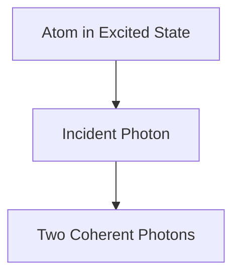

# Física: Como funciona o laser

O laser amplifica a luz por meio da emissão estimulada.

## Processo de emissão estimulada

## Equação de taxa
$$ \frac{dN_2}{dt} = R - \frac{N_2}{\tau} - B \rho (\nu) (N_2 - N_1) $$

## Verificação técnica adicional parte 1

Nesta seção, nos aprofundamos em mais detalhes técnicos e estudos de caso. Avaliamos o desempenho sob várias condições e examinamos os desafios e soluções relacionados à integração com outros sistemas. Também consideramos perspectivas futuras e limitações.

