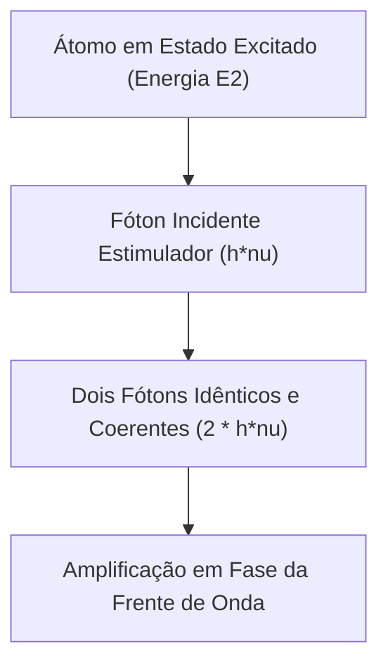

# Física: Como Funciona o Laser - Emissão Estimulada, Inversão de População e Amplificação Óptica

Na sociedade tecnológica moderna, o laser é um pilar indispensável. Das transmissões em fibra óptica que transportam o tráfego global da Internet e leitores de código de barras nos caixas aos procedimentos cirúrgicos refrativos de visão, corte robotizado de chapas de aço e sensores LiDAR de veículos autônomos, o laser sustenta grande parte da infraestrutura contemporânea.

Apesar de seu uso massivo, poucos conhecem o real significado da palavra **LASER** ou os princípios de física quântica que o regem. Trata-se de um acrônimo para **"Light Amplification by Stimulated Emission of Radiation"** (Amplificação da Luz por Emissão Estimulada de Radiação).

Neste artigo, apresentamos uma abordagem técnica e compreensível sobre os fundamentos físicos do laser, com foco em seus três pilares: a **Emissão Estimulada**, a **Inversão de População** e o **Ressonador Óptico**.

## 1. Interação Luz-Matéria: Os Três Processos Quânticos de Einstein

Para entender o funcionamento de um laser, é essencial compreender como fótons interagem com elétrons em orbitais atômicos. Em 1917, Albert Einstein demonstrou que essa interação é governada por três processos microscópicos:

### Absorção (Absorption)
Quando um átomo está em seu estado de menor energia (estado fundamental: $E_1$) e recebe um fóton incidente com energia $h\nu = E_2 - E_1$ (onde $h$ é a constante de Planck e $\nu$ a frequência), o elétron absorve a energia do fóton e salta para o nível excitado superior ($E_2$).

### Emissão Espontânea (Spontaneous Emission)
O átomo no estado excitado ($E_2$) é instável. Sem qualquer influência externa, ele decai espontaneamente para o estado fundamental ($E_1$), liberando um fóton de energia $E_2 - E_1$. Os fótons gerados por emissão espontânea possuem direções, fases e polarizações completamente aleatórias. É essa luz incoerente que compõe a radiação de lâmpadas incandescentes, fluorescentes e da luz solar.

### Emissão Estimulada (Stimulated Emission)
Este é o mecanismo central do laser. Quando o átomo já está no estado excitado $E_2$ e um fóton externo com energia igual a $E_2 - E_1$ cruza sua órbita, o campo eletromagnético do fóton incidente força o átomo a decair para o estado fundamental emitindo um novo fóton.

O ponto crucial da emissão estimulada é que o novo fóton emitido é um **clone quântico exato** do fóton incidente: possui **a mesma frequência, a mesma fase, a mesma direção de propagação e a mesma polarização**. Dessa forma, um fóton que entra resulta em dois fótons coerentes saindo, gerando uma amplificação de intensidade óptica.

```mermaid
flowchart TD
    A["Átomo em Estado Excitado (Energia E2)"] --> B["Fóton Incidente Estimulador (h*nu)"]
    B --> C["Dois Fótons Idênticos e Coerentes (2 * h*nu)"]
    C --> D["Amplificação em Fase da Frente de Onda"]
```

## 2. Inversão de População (Population Inversion): Condição Indispensável

Se a emissão estimulada é capaz de clonar fótons, por que os materiais comuns no dia a dia não emitem feixes laser espontaneamente?

Em equilíbrio térmico convencional, a densidade atômica nos níveis energéticos segue a **distribuição de Boltzmann**. A quantidade de átomos no estado fundamental ($N_1$) é ordens de grandeza maior que no estado excitado ($N_2$), de modo que $N_1 \gg N_2$.
Ao incidir luz nesse meio, a probabilidade de absorção ressonante supera largamente a de emissão estimulada. O feixe de luz atenua-se exponencialmente.

Para obter amplificação líquida (oscilação laser), é imprescindível quebrar esse equilíbrio e produzir uma condição onde **a quantidade de átomos no estado excitado seja superior à do estado fundamental ($N_2 > N_1$)**. Esse estado termodinâmico fora do equilíbrio chama-se **Inversão de População (Population Inversion)**.

### Métodos de Bombeamento (Pumping)
Para criar e manter a inversão de população contra o decaimento natural, deve-se fornecer energia externa ao sistema atômico continuamente. Esse aporte energético é denominado **bombeamento**:
- **Bombeamento Óptico**: Utilização de lâmpadas flash ou diodos laser para irradiar o meio de ganho (comum em cristais como rubi ou Nd:YAG).
- **Bombeamento Elétrico (Descarga e Injeção)**: Aplicação de tensão elétrica para gerar descarga em gases (como He-Ne ou $\text{CO}_2$) ou injeção de corrente elétrica contínua em junções p-n semicondutoras.
- **Bombeamento Químico**: Liberação de energia exotérmica através de reações químicas rápidas.

### Sistemas de Três e Quatro Níveis
Para estabelecer a inversão de população com alto rendimento, os lasers recorrem a configurações atômicas de três ou quatro níveis:

* **Sistema de Três Níveis (ex. Laser de Rubi)**:
  Os átomos são bombeados de $E_1$ para $E_3$, decaindo rapidamente sem radiação para o nível intermediário metaestável $E_2$. A transição laser ocorre entre $E_2$ e o estado fundamental $E_1$. Como o nível inferior do laser é o próprio estado fundamental, é necessário excitar mais de 50% de todos os átomos da amostra apenas para atingir a transparência óptica ($N_2 = N_1$), demandando imensas potências de bombeamento.

* **Sistema de Quatro Níveis (ex. Nd:YAG, He-Ne)**:
  Os átomos sobem de $E_0$ para $E_3$, decaem para $E_2$, realizam a transição laser para $E_1$ e, em seguida, desocupam rapidamente $E_1$ retornando a $E_0$. Como $E_1$ está termicamente desocupado à temperatura ambiente ($N_1 \approx 0$), mesmo uma modesta injeção de energia coloca átomos em $E_2$ suficientes para cumprir a condição $N_2 > N_1$, tornando o laser de 4 níveis exponencialmente mais eficiente.

## 3. O Ressonador Óptico: Confinamento e Realimentação

Com a inversão de população, o meio torna-se um amplificador. Entretanto, uma única travessia da luz pela cavidade gera uma amplificação insuficiente. Para transformar esse amplificador em um oscilador autossustentado capaz de projetar um feixe colimado e potente, utiliza-se a realimentação positiva proporcionada pelo **Ressonador Óptico (Cavidade Óptica)**.

O ressonador é constituído por dois espelhos alinhados no eixo óptico nas extremidades do meio ativo:
1. **Espelho Total (High Reflector)**: Refletividade de aproximadamente 100%.
2. **Espelho Semitransparente / Acoplador de Saída (Output Coupler)**: Reflete a maior parte da luz (95% a 99%) para dentro do ressonador e transmite uma pequena fração (1% a 5%), que compõe o feixe laser útil.

### O Ciclo de Oscilação
1. Com o bombeamento ativo, alguns átomos liberam fótons iniciais por emissão espontânea.
2. Fótons alinhados com o eixo óptico viajam pelo cristal disparando cascatas de emissão estimulada.
3. Ao atingir as bordas, os espelhos refletem os fótons, fazendo-os percorrer o meio de ganho centenas de vezes.
4. A cada viagem de ida e volta, a emissão estimulada multiplica os fótons de idêntica fase e frequência.
5. Uma porcentagem contínua escapa pelo acoplador de saída, produzindo o **feixe laser de alta intensidade**.

### Limiar do Laser e Equações de Taxa

O laser só atinge oscilação sustentada quando o ganho óptico da viagem supera a totalidade das perdas do sistema (transmissão dos espelhos, absorção e espalhamento). Esse ponto crítico é denominado **Limiar de Oscilação (Laser Threshold)**.

A dinâmica entre as populações atômicas e a densidade de fótons é modelada pelas **Equações de Taxa (Rate Equations)**:

$$ \frac{dN_2}{dt} = R_p - \frac{N_2}{\tau} - B \rho(\nu) (N_2 - N_1) $$

Onde:
- $N_2, N_1$ são as densidades atômicas nos níveis superior e inferior,
- $R_p$ é a taxa de bombeamento,
- $\tau$ é o tempo de vida de emissão espontânea,
- $B$ é o coeficiente B de Einstein para emissão estimulada,
- $\rho(\nu)$ é a densidade de energia de radiação na cavidade.

A resolução dessas equações fornece dados analíticos sobre a potência de limiar, a potência contínua em regime estável e as oscilações de relaxação.

## 4. As Quatro Propriedades Distintivas da Luz Laser

A emissão estimulada combinada com o confinamento na cavidade ressonante confere ao feixe laser quatro características exclusivas:

1. **Monocromaticidade (Monochromaticity)**:
   Como a emissão envolve transições quânticas estreitas, o espectro ($\Delta\lambda$) possui largura ínfima, conferindo uma pureza de cor impossível em fontes incandescentes.
2. **Direcionalidade (Directivity)**:
   Apenas os modos alinhados com o eixo óptico são amplificados. A divergência do feixe é mínima; apontado para a Lua, um feixe percorre quase 400.000 km abrindo apenas alguns quilômetros.
3. **Coerência Espacial e Temporal (Coherence)**:
   Todos os fótons mantêm rigorosa sintonia de fase. A **coerência espacial** possibilita a holografia 3D; a **coerência temporal** mantém a estabilidade de fase por grandes distâncias, permitindo detectar ondas gravitacionais com o interferômetro LIGO.
4. **Alta Intensidade e Focalização (High Intensity)**:
   A coerência perfeita permite focar o feixe em uma área microscópica da ordem do comprimento de onda ($\sim 1\ \mu\text{m}$). Isso atinge densidades de gigawatts por centímetro quadrado, cortando ligas de titânio ou acionando fusão nuclear inercial.

## 5. Arquiteturas Modernas e Fronteiras Tecnológicas

A engenharia de materiais expandiu a família dos emissores laser:

- **Lasers de Diodo Semicondutor**: Minúsculos e com rendimento elétrico superior a 50%, operam nas telecomunicações e na eletrônica portátil.
- **Lasers de Fibra**: Utilizam fibras de sílica dopadas com íons de terras raras (itérbio, érbio). Sua eficiente refrigeração e potências de vários quilowatts tornaram-nos o padrão moderno para usinagem pesada.
- **Lasers de Pulsos Ultracurtos (Física de Femtossegundos e Atossegundos)**:
  Por meio do travamento de modos (Mode-locking), a luz é comprimida em pulsos de femtossegundos ($10^{-15}\text{ s}$) ou atossegundos ($10^{-18}\text{ s}$). Como o pulso é mais rápido que a condução de calor na rede atômica ("ablação a frio"), permite cirurgias oculares (SMILE) e corte de semicondutores sem danos térmicos. O Prêmio Nobel de Física de 2023 celebrou o desenvolvimento de pulsos de atossegundos para filmar elétrons orbitando em tempo real.

## Conclusão

Da teoria de Einstein em 1917 ao primeiro laser construído por Theodore Maiman em 1960, o laser é a maior demonstração prática da física quântica. O controle das transições atômicas, a inversão de população e a cavidade ressonante criaram uma ferramenta óptica que continua transformando a ciência e a sociedade.
