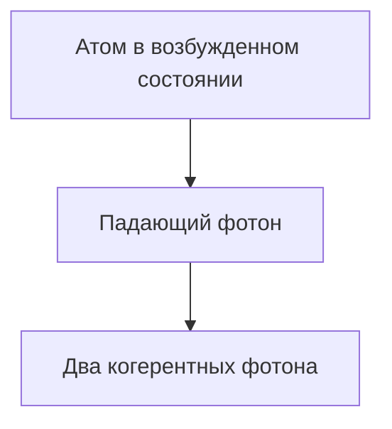

# Физика: Как работают лазеры

Лазеры усиливают свет за счет вынужденного излучения.

## Процесс вынужденного излучения

## Скоростные уравнения
$$ \frac{dN_2}{dt} = R - \frac{N_2}{\tau} - B \rho (\nu) (N_2 - N_1) $$

## Дополнительная техническая проверка, часть 1

В этом разделе мы углубимся в дальнейшие технические детали и тематические исследования. Мы оценим производительность в различных условиях и рассмотрим проблемы и решения для интеграции с другими системами. Мы также обсудим будущие перспективы и ограничения.

