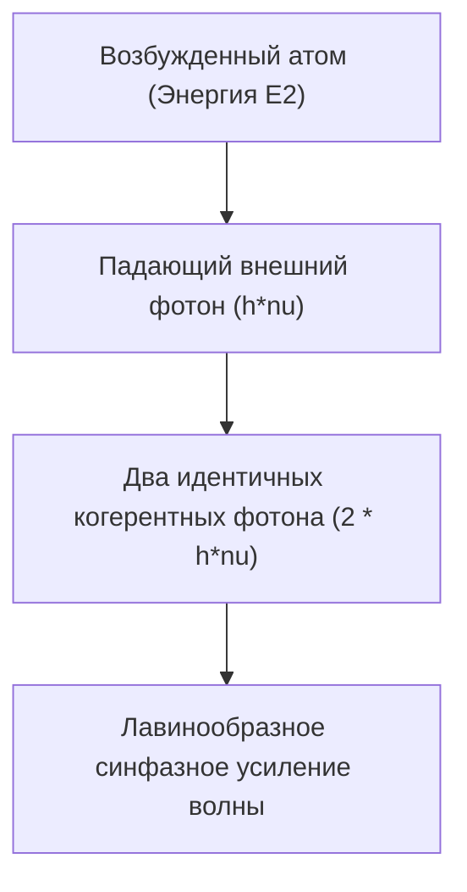

# Физика: принципы работы лазера - индуцированное излучение, инверсия населенностей и усиление света

В современном мире лазеры превратились в одну из базовых технологий технологической цивилизации. От магистральных оптоволоконных линий глобального интернета и сканеров штрихкодов в супермаркетах до лазерной офтальмологической хирургии, высокоточной резки металлов и лидаров (LiDAR) беспилотных автомобилей — лазерные технологии лежат в основе передовой индустрии.

Однако мало кто задумывается о том, что означает само слово **ЛАЗЕР (LASER)** и какие квантовомеханические процессы лежат в основе его работы. LASER — это аббревиатура от **«Light Amplification by Stimulated Emission of Radiation»** (усиление света посредством индуцированного испускания излучения).

В этой статье мы подробно и строго разберем физические основы работы лазера, сосредоточившись на трех фундаментальных принципах: **индуцированном (вынужденном) излучении**, **инверсии населенностей** и **оптическом резонаторе**.

## 1. Взаимодействие света с веществом: три процесса Эйнштейна

Чтобы понять принцип лазерного усиления, необходимо обратиться к взаимодействию фотонов с атомными электронами. В 1917 году Альберт Эйнштейн опубликовал фундаментальную работу, доказав, что квантовое взаимодействие излучения с атомами сводится к трем базовым процессам:

### Поглощение (Absorption)
Если атом находится на нижнем энергетическом уровне (в основном состоянии: $E_1$), внешний фотон с резонансной энергией $h\nu = E_2 - E_1$ ($h$ — постоянная Планка, $\nu$ — частота света) может быть поглощен. Электрон переходит на верхний дискретный энергетический уровень (возбужденное состояние: $E_2$).

### Спонтанное излучение (Spontaneous Emission)
Возбужденный атом ($E_2$) нестабилен. Спустя определенное среднее время жизни он самопроизвольно переходит обратно на нижний уровень ($E_1$), испуская фотон с энергией $E_2 - E_1$. Направление полета, поляризация и фаза спонтанного фотона абсолютно случайны. Это некогерентное свечение обычных ламп накаливания, люминесцентных трубок и Солнца.

### Индуцированное (вынужденное) излучение (Stimulated Emission)
Это фундаментальный квантовый механизм лазера. Если атом уже находится в возбужденном состоянии $E_2$, а мимо него пролетает внешний фотон с энергией в точности $E_2 - E_1$, электромагнитное поле этого фотона заставляет («стимулирует») атом немедленно совершить переход в состояние $E_1$.

При этом атом испускает второй фотон, который является **абсолютным квантовым клоном** исходного фотона: он обладает **в точности той же длиной волны, той же фазой, тем же направлением распространения и тем же состоянием поляризации**. Один входящий фотон порождает два абсолютно когерентных фотона — происходит чистое квантовое усиление света.

```mermaid
flowchart TD
    A["Возбужденный атом (Энергия E2)"] --> B["Падающий внешний фотон (h*nu)"]
    B --> C["Два идентичных когерентных фотона (2 * h*nu)"]
    C --> D["Лавинообразное синфазное усиление волны"]
```

## 2. Инверсия населенностей: непременное условие усиления

Если вынужденное излучение клонирует фотоны, почему обычные предметы вокруг нас не генерируют лазерные лучи?

В условиях обычного термодинамического равновесия распределение атомов по энергетическим состояниям описывается **законом распределения Больцмана**. Число атомов на нижнем уровне ($N_1$) несоизмеримо больше числа атомов на возбужденном уровне ($N_2$), то есть $N_1 \gg N_2$.
При прохождении светового луча через такое вещество вероятность резонансного поглощения фотонов многократно превышает вероятность вынужденного излучения. Световая волна экспоненциально затухает.

Чтобы свет усиливался (возникла лазерная генерация), термодинамическое равновесие должно быть нарушено: необходимо создать неравновесное состояние, при котором **число атомов на верхнем уровне превосходит число атомов на нижнем уровне ($N_2 > N_1$)**. Такое состояние называется **инверсией населенностей (Population Inversion)**.

### Механизмы накачки (Pumping)
Для создания инверсии населенностей в среду необходимо непрерывно закачивать внешнюю энергию. Этот процесс называется **накачкой**:
- **Оптическая накачка**: Освещение среды импульсными ксеноновыми лампами или лазерными диодами (характерно для твердотельных лазеров, таких как рубиновый или Nd:YAG).
- **Электрическая накачка (газовый разряд и инжекция тока)**: Тлеющий электрический разряд в газах (He-Ne, $\text{CO}_2$) или протекание прямого тока через p-n переход полупроводникового лазера.
- **Химическая накачка**: Использование энергии экзотермических химических реакций.

### Трехуровневые и четырехуровневые системы
Для эффективного удержания инверсии населенностей применяются трехуровневые и четырехуровневые квантовые схемы:

* **Трехуровневая система (например, рубиновый лазер)**:
  Атомы накачиваются с основного уровня $E_1$ на верхний уровень $E_3$, откуда быстро безызлучательно (в виде тепла) релаксируют на метастабильный уровень $E_2$. Лазерный переход совершается между $E_2$ и основным уровнем $E_1$. Поскольку нижним уровнем служит само основное состояние, для достижения порога инверсии ($N_2 > N_1$) требуется перевести наверх более 50% всех атомов кристалла, что требует колоссальной мощности накачки.

* **Четырехуровневая система (например, Nd:YAG, He-Ne)**:
  Атомы переводятся с уровня $E_0$ на $E_3$, переходят на метастабильный уровень $E_2$, совершают лазерный переход на уровень $E_1$ и затем мгновенно релаксируют обратно на $E_0$. Поскольку уровень $E_1$ расположен существенно выше теплового порога, при комнатной температуре он практически пуст ($N_1 \approx 0$). Поэтому даже умеренная накачка сразу же обеспечивает условие $N_2 > N_1$, обеспечивая в десятки раз более высокий КПД.

## 3. Оптический резонатор: обратная связь и генерация

Инверсия населенностей превращает вещество в оптический усилитель, но при однократном проходе усиление слишком мало. Чтобы преобразовать усилитель в генератор мощного непрерывного пучка, требуется положительная оптическая обратная связь — **оптический резонатор**.

Резонатор образован двумя соосными зеркалами, установленными по торцам активной среды:
1. **Глухое зеркало (High Reflector)**: Отражает почти 100% падающего света.
2. **Полупрозрачное (выходное) зеркало (Output Coupler)**: Возвращает большую часть света (95%〜99%) обратно в среду и выпускает малую часть (1%〜5%) наружу в виде полезного лазерного луча.

### Цикл генерации
1. При включении накачки спонтанное излучение рождает первые фотоны.
2. Только фотоны, летящие строго вдоль оси резонатора, многократно проходят сквозь среду и порождают лавины вынужденного излучения.
3. Отражаясь от зеркал, волна совершает сотни циклов прохода.
4. На каждом витке число синфазных фотонов лавинообразно нарастает.
5. Часть излучения стабильно выходит через полупрозрачное зеркало, формируя узконаправленный **лазерный луч**.

### Порог генерации и уравнения баланса (Rate Equations)

Генерация начинается только тогда, когда оптическое усиление за один обход резонатора превышает суммарные потери (пропускание зеркал, поглощение, рассеяние). Это условие называется **порогом генерации (Laser Threshold)**.

Динамика заселенностей энергетических уровней и плотности фотонов описывается **уравнениями баланса (скоростными уравнениями)**:

$$ \frac{dN_2}{dt} = R_p - \frac{N_2}{\tau} - B \rho(\nu) (N_2 - N_1) $$

Где:
- $N_2, N_1$ — плотности населенностей верхнего и нижнего уровней,
- $R_p$ — скорость накачки,
- $\tau$ — время жизни спонтанного распада верхнего уровня,
- $B$ — коэффициент Эйнштейна для индуцированного излучения,
- $\rho(\nu)$ — спектральная плотность энергии излучения в резонаторе.

Анализ этих дифференциальных уравнений позволяет рассчитать пороговую мощность, мощность стационарного режима и динамику релаксационных колебаний.

## 4. Четыре уникальных свойства лазерного излучения

Благодаря квантовому клонированию фотонов и селекции мод резонатора лазерный луч обладает четырьмя фундаментальными характеристиками:

1. **Монохроматичность (Monochromaticity)**:
   Переход происходит между фиксированными квантовыми уровнями, поэтому спектральная ширина ($\Delta\lambda$) исчезающе мала, обеспечивая предельную чистоту цвета для спектроскопии и интерферометрии.
2. **Направленность (Directivity)**:
   Усиливаются только приосевые моды. Расходимость луча близка к нулю; лазерный импульс, посланный на Луну (около 400 000 км), образует на ее поверхности пятно диаметром всего в несколько километров.
3. **Когерентность (Coherence)**:
   Все фотоны строго согласованы по фазе. **Пространственная когерентность** позволяет строить объемные голограммы; **временная когерентность** обеспечивает устойчивость фазы на огромных дистанциях, что используется в детекторах гравитационных волн (LIGO).
4. **Высокая яркость и фокусируемость (High Intensity)**:
   Когерентность позволяет сфокусировать луч линзой в дифракционное пятно микронного размера ($\sim 1\ \mu\text{м}$). Достигаемая плотность мощности в гигаватты на квадратный сантиметр позволяет резать алмазы и титан или зажигать лазерный термоядерный синтез.

## 5. Современные лазерные технологии и рубежи науки

За десятилетия физика лазеров породила множество направлений:

- **Полупроводниковые лазерные диоды**: Микроскопические чипы с КПД свыше 50%, основа глобальной оптоволоконной связи.
- **Волоконные лазеры**: Активной средой служит оптоволокно, легированное редкоземельными элементами (иттербием). Высокое качество охлаждения и мегаваттные мощности вывели их в лидеры промышленной металлообработки.
- **Ультракороткие импульсы (фемто- и аттосекундная физика)**:
  Метод синхронизации мод (Mode-locking) сжимает излучение в импульсы длительностью фемтосекунды ($10^{-15}\text{ с}$) и аттосекунды ($10^{-18}\text{ с}$). Поскольку тепло не успевает распространиться по материалу («холодная абляция»), такие лазеры незаменимы в микрохирургии глаза (SMILE) и нанолитографии. В 2023 году Нобелевская премия по физике была присуждена за создание аттосекундных импульсов, позволивших впервые «заснять» движение электронов внутри атомов в реальном времени.

## Заключение

От теоретического предвидения Эйнштейна в 1917 году до создания Теодором Мейманом первого рубинового лазера в 1960 году — лазер стал величайшим триумфом квантовой физики. Управление атомными уровнями, создание инверсии населенностей и оптическая обратная связь открыли перед человечеством неисчерпаемые возможности управления светом на благо цивилизации.
