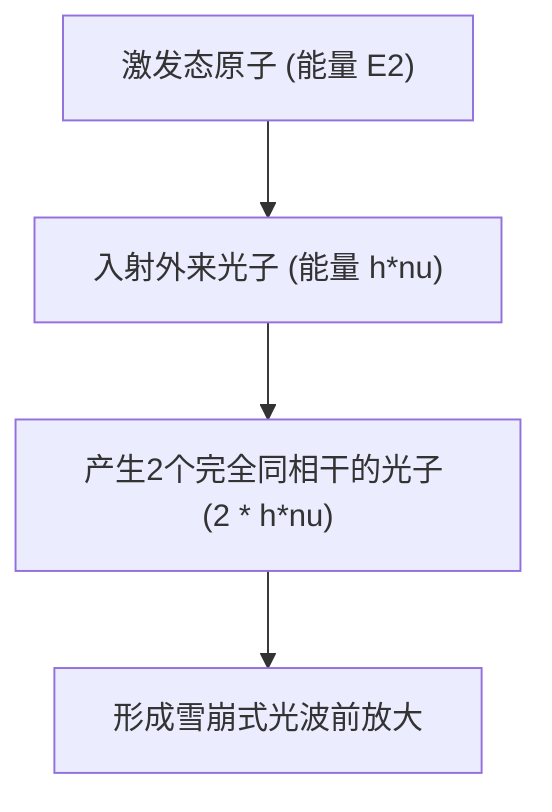

# 物理学：激光的工作原理 - 受激辐射、粒子数反转与光放大

在当今现代社会中，激光已经成为支撑人类高科技文明不可或缺的基石。从承载全球互联网流量的高速光纤通信、商超条形码扫描枪，到眼科屈光矫正手术与激光手术刀，再到现代工业精密加工以及自动驾驶汽车的核心传感器LiDAR（激光雷达），激光技术的足迹渗透进了每一个工业领域。

然而，尽管“激光（LASER）”一词家喻户晓，深入理解其微观物理机制的人却并不多。LASER实际上是 **“Light Amplification by Stimulated Emission of Radiation”** 的首字母缩写，直译为“通过受激辐射产生的光放大”。

本文将从光与原子的微观相互作用出发，系统剖析激光物理学的三大核心支柱——**受激辐射（Stimulated Emission）** 、 **粒子数反转（Population Inversion）** 与 **光学谐振腔（Optical Resonator）** ，并展望超短脉冲激光的前沿发展。

## 1. 光与原子的相互作用：爱因斯坦的三大辐射过程

理解激光的前提是搞清楚光子与原子（或分子）的量子交互规律。早在1917年，阿尔伯特·爱因斯坦就在其关于辐射量子理论的经典论文中指出，光与物质的相互作用由以下三大基本微观过程所主导：

### 吸收（Absorption）
当原子处于低能级（基态：$E_1$）时，如果外部射入一个能量恰好等于能级差 $h\nu = E_2 - E_1$（$h$ 为普朗克常数，$\nu$ 为光波频率）的光子，原子就会吸收该光子的全部能量，跃迁至高能级（激发态：$E_2$）。

### 自发辐射（Spontaneous Emission）
处于高激发态（$E_2$）的原子是不稳定的，即使没有任何外界扰动，它也会在有限寿命内自发地跌落回低能级（$E_1$）。在此过程中，多余的能量以光子的形式释放出来。自发辐射产生的光子在传播方向、偏振态以及初相位上都是完全随机混乱的。日常生活中见到的日光灯、白炽灯以及太阳光，本质上都是不相干的自发辐射光。

### 受激辐射（Stimulated Emission）
这正是激光技术赖以建立的物理核心。如果原子已经处于激发态 $E_2$，此时恰好有一个能量等于 $E_2 - E_1$ 的外来光子从旁掠过，这个外来光子的电磁场就会“诱发（刺激）”激发态原子向基态跃迁。

在此跃迁过程中，原子释放出的新光子与诱发它的外来光子具有 **完全相同的波长（频率）、完全相同的相位、完全一致的行进方向以及完全一致的偏振方向** 。换言之，射入一个光子，产生出两个性质完全相同的“克隆”相干光子，从而实现了光强度的量子级受激放大。

## 2. 粒子数反转（Population Inversion）：光放大的绝对前提

既然受激辐射能够克隆光子并放大光强，为什么大自然中普通的物体不会自行发出激光呢？

在常规的热平衡状态下，物质内部各个能级上的原子数分布严格服从 **玻尔兹曼分布律** 。处于低能级（基态）的原子数 $N_1$ 总是远大于处于高能级（激发态）的原子数 $N_2$（即 $N_1 \gg N_2$）。
此时，光束穿过物质时，光子被基态原子“共振吸收”的几率远远压倒了“受激辐射”的几率。光束在穿透介质时只会呈指数衰减。

要使光束获得净增益放大（产生激光振荡），必须打破这种热平衡，制造出一种非平衡状态： **使得处于高激发态的原子数反过来压倒处于低能态的原子数（$N_2 > N_1$）** 。这种反常的热力学非平衡状态就称为 **粒子数反转（Population Inversion）** 。

### 激励（泵浦）机制
要打破热平衡建立粒子数反转，必须从外界持续输入能量，将基态原子强制泵入高能态，这个过程称为“泵浦（Pumping）”。常见的泵浦方式包括：
- **光泵浦** ：利用高能闪光灯或半导体激光二极管照射增益介质（多用于红宝石和Nd:YAG等固体激光器）。
- **电泵浦（气体放电与电流注入）** ：通过高压辉光放电或对半导体PN结施加正向偏置电流（广泛用于He-Ne激光器、$\text{CO}_2$激光器及激光二极管）。
- **化学泵浦** ：利用剧烈放热化学反应释放的能量激发粒子（如化学氧碘激光器）。

### 三能级系统与四能级系统
在工程实践中，为了高效构建粒子数反转，增益介质通常采用具有三个或四个能级的原子系统：

* **三能级系统（如红宝石激光器）** ：
  粒子被泵浦从基态 $E_1$ 抽运至高能态 $E_3$，随后通过极快的无辐射跃迁（晶格热损耗）迅速跌落至具有较长寿命的亚稳态 $E_2$。激光跃迁发生在 $E_2$ 与基态 $E_1$ 之间。由于激光下能级就是原本拥有全量原子的基态，必须将全系统50%以上的原子都泵浦上去才能越过反转门槛，因此需要极其巨大的泵浦功率。

* **四能级系统（如Nd:YAG激光器、氦氖激光器）** ：
  粒子由基态 $E_0$ 泵浦到 $E_3$，跌落到亚稳态 $E_2$（激光上能级），然后受激跃迁到 $E_1$（激光下能级），最后再由 $E_1$ 极快地回到基态 $E_0$。因为下能级 $E_1$ 处于热激发几乎无法企及的位置，常温下基本完全排空（$N_1 \approx 0$）。因此只需微弱的泵浦能量将少量原子抽运至 $E_2$，即可轻而易举建立 $N_2 > N_1$ 的粒子数反转，效率相比三能级系统呈数量级提升。

## 3. 光学谐振腔（Optical Resonator）：光的正反馈与振荡

粒子数反转建立了光放大通道，但光束若仅仅穿过一次介质，放大倍数依然微不足道。要产生高度定向、极其明亮的连续激光束，必须让光被约束并往复穿越增益介质，形成自激振荡正反馈。这个核心组件就是 **光学谐振腔（Optical Resonator）** 。

光学谐振腔通常由平行安置在工作介质两端的一对高精度光学反射镜组成：
1. **全反射镜（High Reflector）** ：反射率接近 100%。
2. **部分反射镜/输出耦合镜（Output Coupler）** ：反射绝大部分光（如 95%〜99%），同时允许微小比例（1%〜5%）透射出来，作为我们日常使用的激光束输出。

### 谐振放大循环过程
1. 泵浦启动后建立粒子数反转，部分原子发生自发辐射释放初始光子。
2. 只有严格沿着谐振腔光轴行进的光子，才会在穿过增益介质时引发雪崩式的受激辐射。
3. 行进到镜面时光被反射，掉头再次穿过介质，受激辐射进一步呈几何级数暴增。
4. 随着数以百万计的往返振荡，同一模式、同一相位、同一波长的光子占据绝对主导。
5. 汇聚成束的相干光通过输出镜稳定透射，形成高纯度的 **激光束** 。

### 激光阈值与速率方程

只有当谐振腔内的单程光放大增益大于所有腔内损耗（反射镜透射、介质散射与吸收）时，激光才能起振。这个临界条件被称为 **起振阈值（Threshold）** 。

激光器内部原子能级粒子数密度与光子密度的动态演化由 **激光速率方程（Rate Equations）** 严格描述。在简化的双能级近似下，速率方程表述为：

$$ \frac{dN_2}{dt} = R_p - \frac{N_2}{\tau} - B \rho(\nu) (N_2 - N_1) $$

其中：
- $N_2, N_1$ 为上下能级的粒子数密度，
- $R_p$ 为外部泵浦激发速率，
- $\tau$ 为上能级自发辐射寿命，
- $B$ 为爱因斯坦受激跃迁B系数，
- $\rho(\nu)$ 为腔内电磁辐射能量密度（正比于光子通量）。

求解速率方程可解析激光的阈值泵浦功率、稳态输出功率、增益饱和曲线以及瞬态弛豫振荡特性。

## 4. 激光束的四大卓越物理特质

借助受激辐射的量子克隆机制与光学谐振腔的空间选模效应，激光具备了自然界光热光源所绝不具备的四大卓越物理属性：

1. **单色性（Monochromaticity）** ：
   受激跃迁局限于极其特定的原子量子能级之间，波长纯度极高，光谱线宽 $\Delta\lambda$ 极窄，是高分辨光谱分析与精密光学测量的理想光源。
2. **方向性（Directivity）** ：
   只有极度贴合光轴的光波才能在谐振腔内生存，发散角微乎其微。发射至月球表面的激光束历经数十万公里传播，其光斑展开直径也仅有数公里。
3. **相干性（Coherence）** ：
 受激辐射保证了所有光子在空间与时间上步调一致。 **空间相干性** 使全息摄影三维成像成为可能； **时间相干性** 则赋予光波长距离保持相位恒定的能力，成为引力波天文台（LIGO）探知时空微澜的核心工具。
4. **高能量密度与高亮度（High Intensity）** ：
   由于卓越的相干性，激光束可被透镜聚焦为衍射极限级别的微米级光斑（$\sim 1\ \mu\text{m}$），在焦点处瞬间汇聚数兆瓦乃至吉瓦每平方厘米的能量密度，轻松融化切割钛合金、金刚石，甚至点燃激光受控核聚变。

## 5. 激光前沿技术与未来应用

半个多世纪以来，激光器在材料体系与脉冲调控上实现了突飞猛进的发展：

- **半导体激光器（Laser Diode）** ：尺寸微小至毫米级，电光转换效率超50%，是现代光纤通信、光存储及消费电子的绝对支柱。
- **固体激光器与光纤激光器** ：掺钕YAG激光器及以掺镱光纤为增益介质的光纤激光器，具有极高的散热效能与万瓦级连续功率，彻底主导了现代重工激光焊接与切割。
- **超短脉冲激光（飞秒与阿秒物理学）** ：
  采用被动锁模（Mode-locking）技术，谐振腔可将激光能量压缩进飞秒（$10^{-15}$秒）乃至阿秒（$10^{-18}$秒）时域。由于脉冲持续时间远短于热传导至周围晶格的时间，飞秒激光可实现“无热熔冷加工”，被广泛应用于近视矫正手术（全飞秒SMILE）与芯片纳米晶圆切割。2023年诺贝尔物理学奖授予阿秒激光领域的先驱，表彰其首次实现了在原子内部实时抓拍电子运动轨迹的物理奇迹。

## 结语

从1917年爱因斯坦从纯理论推导受激辐射假说，到1960年西奥多·梅曼成功点亮人类历史上第一台红宝石激光器，激光的发展是理论物理学与精湛工程学完美结合的典范。微观能级跃迁、粒子数反转与光学谐振反馈的巧妙交融，为人类铸造了一把探索微观世界与塑造宏观工业的最锋利的光学之剑。
