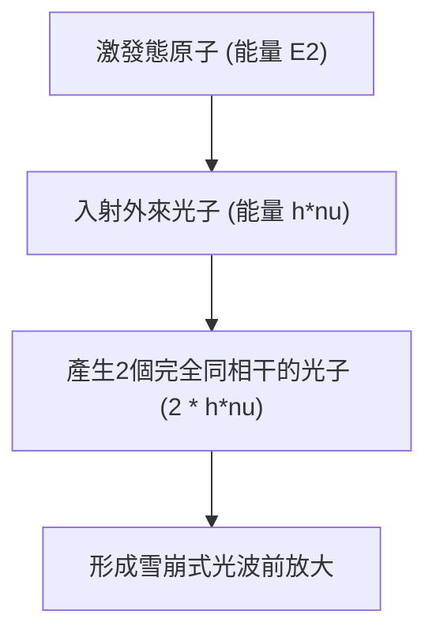

# 物理學：雷射的運作原理 - 受激輻射、居量反轉與光放大

在當今現代社會中，雷射已經成為支撐人類高科技文明不可或缺的基石。從承載全球網際網路流量的高速光纖通訊、超商條碼掃描機，到眼科屈光矯正手術與雷射手術刀，再到現代工業精密加工以及自動駕駛汽車的核心感測器LiDAR（光達），雷射技術的足跡滲透進了每一個工業領域。

然而，儘管「雷射（LASER）」一詞家喻戶曉，深入理解其微觀物理機制的人卻並不多。LASER實際上是 **「Light Amplification by Stimulated Emission of Radiation」** 的首字母縮寫，直譯為「透過受激輻射產生的光放大」。

本文將從光與原子的微觀交互作用出發，系統剖析雷射物理學的三大核心支柱——**受激輻射（Stimulated Emission）** 、 **居量反轉（Population Inversion）** 與 **光學諧振腔（Optical Resonator）** ，並展望超短脈衝雷射的前沿發展。

## 1. 光與原子的交互作用：愛因斯坦的三大輻射過程

理解雷射的前提是搞清楚光子與原子（或分子）的量子交互規律。早在1917年，阿爾伯特·愛因斯坦就在其關於輻射量子理論的經典論文中指出，光與物質的交互作用由以下三大基本微觀過程所主導：

### 吸收（Absorption）
當原子處於低能階（基態：$E_1$）時，如果外部射入一個能量恰好等於能階差 $h\nu = E_2 - E_1$（$h$ 為普朗克常數，$\nu$ 為光波頻率）的光子，原子就會吸收該光子的全部能量，躍遷至高能階（激發態：$E_2$）。

### 自發輻射（Spontaneous Emission）
處於高激發態（$E_2$）的原子是不穩定的，即使沒有任何外界擾動，它也會在有限壽命內自發地跌落回低能階（$E_1$）。在此過程中，多餘的能量以光子的形式釋放出來。自發輻射產生的光子在傳播方向、偏振態以及初相位上都是完全隨機混亂的。日常生活中見到的日光燈、白熾燈以及太陽光，本質上都是不相干的自發輻射光。

### 受激輻射（Stimulated Emission）
這正是雷射技術賴以建立的物理核心。如果原子已經處於激發態 $E_2$，此時恰好有一個能量等於 $E_2 - E_1$ 的外來光子從旁掠過，這個外來光子的電磁場就會「誘發（刺激）」激發態原子向基態躍遷。

在此躍遷過程中，原子釋放出的新光子與誘發它的外來光子具有 **完全相同的波長（頻率）、完全相同的相位、完全一致的行進方向以及完全一致的偏振方向** 。換言之，射入一個光子，產生出兩個性質完全相同的「複製」同調光子，從而實現了光強度的量子級受激放大。

## 2. 居量反轉（Population Inversion）：光放大的絕對前提

既然受激輻射能夠複製光子並放大光強，為什麼大自然中普通的物體不會自行發出雷射呢？

在常規的熱平衡狀態下，物質內部各個能階上的原子數分布嚴格服從 **波茲曼分布律** 。處於低能階（基態）的原子數 $N_1$ 總是遠大於處於高能階（激發態）的原子數 $N_2$（即 $N_1 \gg N_2$）。
此時，光束穿過物質時，光子被基態原子「共振吸收」的機率遠遠壓倒了「受激輻射」的機率。光束在穿透介質時只會呈指數衰減。

要使光束獲得淨增益放大（產生雷射振盪），必須打破這種熱平衡，製造出一種非平衡狀態： **使得處於高激發態的原子數反過來壓倒處於低能態的原子數（$N_2 > N_1$）** 。這種反常的熱力學非平衡狀態就稱為 **居量反轉（Population Inversion）** 。

### 激勵（泵浦）機制
要打破熱平衡建立居量反轉，必須從外界持續輸入能量，將基態原子強制泵入高能態，這個過程稱為「泵浦（Pumping）」。常見的泵浦方式包括：
- **光泵浦** ：利用高能閃光燈或半導體雷射二極體照射增益介質（多用於紅寶石和Nd:YAG等固體雷射）。
- **電泵浦（氣體放電與電流注入）** ：透過高壓輝光放電或對半導體PN接面施加順向偏壓電流（廣泛用於He-Ne雷射、$\text{CO}_2$雷射及雷射二極體）。
- **化學泵浦** ：利用劇烈放熱化學反應釋放的能量激發粒子（如化學氧碘雷射）。

### 三能階系統與四能階系統
在工程實踐中，為了高效構建居量反轉，增益介質通常採用具有三個或四個能階的原子系統：

* **三能階系統（如紅寶石雷射）** ：
  粒子被泵浦從基態 $E_1$ 抽運至高能態 $E_3$，隨後透過極快的無輻射躍遷（晶格熱損耗）迅速跌落至具有較長壽命的介穩態 $E_2$。雷射躍遷發生在 $E_2$ 與基態 $E_1$ 之間。由於雷射下能階就是原本擁有全量原子的基態，必須將全系統50%以上的原子都泵浦上去才能越過反轉門檻，因此需要極其巨大的泵浦功率。

* **四能階系統（如Nd:YAG雷射、氦氖雷射）** ：
  粒子由基態 $E_0$ 泵浦到 $E_3$，跌落到介穩態 $E_2$（雷射上能階），然後受激躍遷到 $E_1$（雷射下能階），最後再由 $E_1$ 極快地回到基態 $E_0$。因為下能階 $E_1$ 處於熱激發幾乎無法企及的位置，常溫下基本完全排空（$N_1 \approx 0$）。因此只需微弱的泵浦能量將少量原子抽運至 $E_2$，即可輕而易舉建立 $N_2 > N_1$ 的居量反轉，效率相比三能階系統呈數量級提升。

## 3. 光學諧振腔（Optical Resonator）：長足的正回授與振盪

居量反轉建立了光放大通道，但光束若僅僅穿過一次介質，放大倍數依然微不足道。要產生高度定向、極其明亮的連續雷射束，必須讓光被約束並往復穿越增益介質，形成自激振盪正回授。這個核心組件就是 **光學諧振腔（Optical Resonator）** 。

光學諧振腔通常由平行安置在工作介質兩端的一對高精度光學反射鏡組成：
1. **全反射鏡（High Reflector）** ：反射率接近 100%。
2. **部分反射鏡/輸出耦合鏡（Output Coupler）** ：反射絕大部分光（如 95%〜99%），同時允許微小比例（1%〜5%）透射出來，作為我們日常使用的雷射光束輸出。

### 諧振放大循環過程
1. 泵浦啟動後建立居量反轉，部分原子發生自發輻射釋放初始光子。
2. 只有嚴格沿著諧振腔光軸行進的光子，才會在穿過增益介質時引發雪崩式的受激輻射。
3. 行進到鏡面時光被反射，掉頭再次穿過介質，受激輻射進一步呈幾何級數暴增。
4. 隨著數以百萬計的往返振盪，同一模式、同一相位、同一波長的光子佔據絕對主導。
5. 匯聚成束的同調光透過輸出鏡穩定透射，形成高純度的 **雷射光束** 。

### 雷射閾值與速率方程式

只有當諧振腔內的單程光放大增益大於所有腔內損耗（反射鏡透射、介質散射與吸收）時，雷射才能起振。這個臨界條件被稱為 **起振閾值（Threshold）** 。

雷射內部原子能階粒子數密度與光子密度的動態演化由 **雷射速率方程式（Rate Equations）** 嚴格描述。在簡化的雙能階近似下，速率方程式表述為：

$$ \frac{dN_2}{dt} = R_p - \frac{N_2}{\tau} - B \rho(\nu) (N_2 - N_1) $$

其中：
- $N_2, N_1$ 為上下能階的粒子數密度，
- $R_p$ 為外部泵浦激發速率，
- $\tau$ 為上能階自發輻射壽命，
- $B$ 為愛因斯坦受激躍遷B係數，
- $\rho(\nu)$ 為腔內電磁輻射能量密度（正比於光子通量）。

求解速率方程式可解析雷射的閾值泵浦功率、穩態輸出功率、增益飽和曲線以及暫態弛豫振盪特性。

## 4. 雷射光束的四大卓越物理特質

借助受激輻射的量子複製機制與光學諧振腔的空間選模效應，雷射具備了自然界光熱光源所絕不具備的四大卓越物理屬性：

1. **單色性（Monochromaticity）** ：
   受激躍遷侷限於極其特定的原子量子能階之間，波長純度極高，光譜線寬 $\Delta\lambda$ 極窄，是高解析光譜分析與精密光學測量的理想光源。
2. **方向性（Directivity）** ：
   只有極度貼合光軸的光波才能在諧振腔內生存，發散角微乎其微。發射至月球表面的雷射束歷經數十萬公里傳播，其光斑展開直徑也僅有數公里。
3. **同調性（Coherence）** ：
 受激輻射保證了所有光子在空間與時間上步調一致。 **空間同調性** 使全息攝影三維成像成為可能； **時間同調性** 則賦予光波長距離保持相位恆定的能力，成為重力波天文台（LIGO）探知時空微瀾的核心工具。
4. **高能量密度與高亮度（High Intensity）** ：
   由於卓越的同調性，雷射束可被透鏡聚焦為繞射極限級別的微米級光斑（$\sim 1\ \mu\text{m}$），在焦點處瞬間匯聚數百萬瓦乃至十億瓦每平方公分的能量密度，輕鬆熔化切割鈦合金、鑽石，甚至點燃雷射受控核融合。

## 5. 雷射前沿技術與未來應用

半個多世紀以來，雷射在材料體系與脈衝調控上實現了突飛猛進的發展：

- **半導體雷射（Laser Diode）** ：尺寸微小至毫米級，電光轉換效率超50%，是現代光纖通訊、光學儲存及消費電子的絕對支柱。
- **固體雷射與光纖雷射** ：摻釹YAG雷射及以摻鐿光纖為增益介質的光纖雷射，具有極高的散熱效能與萬瓦級連續功率，徹底主導了現代重工雷射焊接與切割。
- **超短脈衝雷射（飛秒與阿秒物理學）** ：
  採用被動鎖模（Mode-locking）技術，諧振腔可將雷射能量壓縮進飛秒（$10^{-15}$秒）乃至阿秒（$10^{-18}$秒）時域。由於脈衝持續時間遠短於熱傳導至周圍晶格的時間，飛秒雷射可實現「無熱熔冷加工」，被廣泛應用於近視矯正手術（全飛秒SMILE）與晶片奈米晶圓切割。2023年諾貝爾物理學獎授予阿秒雷射領域的先驅，表彰其首次實現了在原子內部即時抓拍電子運動軌跡的物理奇蹟。

## 結語

從1917年愛因斯坦從純理論推導受激輻射假說，到1960年西奧多·梅曼成功點亮人類歷史上第一台紅寶石雷射，雷射的發展是理論物理學與精湛工程學完美結合的典範。微觀能階躍遷、居量反轉與光學諧振回授的巧妙交融，為人類鑄造了一把探索微觀世界與塑造巨觀工業的最鋒利的光學之劍。
