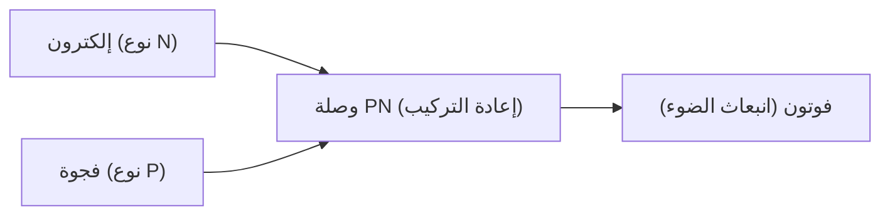

## 1. الفرق بين المصابيح المتوهجة ومصابيح LED
تصدر المصابيح المتوهجة الضوء عن طريق تسخين الفتيل إلى درجات حرارة عالية، بينما تحول مصابيح LED (الثنائي الباعث للضوء) الطاقة الكهربائية مباشرة إلى طاقة ضوئية دون توليد حرارة. لذلك فهي موفرة للطاقة بشكل هائل.

## 2. آلية انبعاث الضوء (أشباه الموصلات)
مصباح LED عبارة عن وصلة بين "شبه موصل من النوع N" يحتوي على فائض من الإلكترونات، و"شبه موصل من النوع P" يفتقر إلى الإلكترونات (يحتوي على فجوات). عند مرور تيار كهربائي، تتصادم الإلكترونات والفجوات وتتحد، ويتم إطلاق فرق الطاقة الناتج كـ "ضوء (فوتون)".

$$
E = h \nu = \frac{hc}{\lambda}
$$

## 3. عقبة LED الأزرق
تم اختراع مصابيح LED الحمراء والخضراء في الستينيات من القرن العشرين، ولكن كان من الصعب للغاية بلورة المادة (نيتريد الغاليوم) لإنتاج اللون "الأزرق"، وقيل إنه من المستحيل تحقيقه خلال القرن العشرين.

## 4. اختراق من قبل باحثين يابانيين
بفضل الأبحاث الرائدة التي قام بها إيسامو أكاساكي، وهيروشي أمانو، وشوجي ناكامورا، تم الانتهاء من تطوير مصباح LED أزرق عالي السطوع في التسعينيات. مع توفر الألوان الأساسية الثلاثة للضوء (الأحمر، الأخضر، الأزرق)، أصبحت إضاءة LED البيضاء والشاشات كاملة الألوان حقيقة واقعة، وحصل الباحثون الثلاثة على جائزة نوبل في الفيزياء.

## جزء التحقق الفني الإضافي 1

## جزء التحقق الفني الإضافي 2

## جزء التحقق الفني الإضافي 3

## جزء التحقق الفني الإضافي 4

## جزء التحقق الفني الإضافي 5

## جزء التحقق الفني الإضافي 6

## جزء التحقق الفني الإضافي 7

## جزء التحقق الفني الإضافي 8

## جزء التحقق الفني الإضافي 9

## جزء التحقق الفني الإضافي 10

## جزء التحقق الفني الإضافي 11

## جزء التحقق الفني الإضافي 12

## جزء التحقق الفني الإضافي 13

## جزء التحقق الفني الإضافي 14

