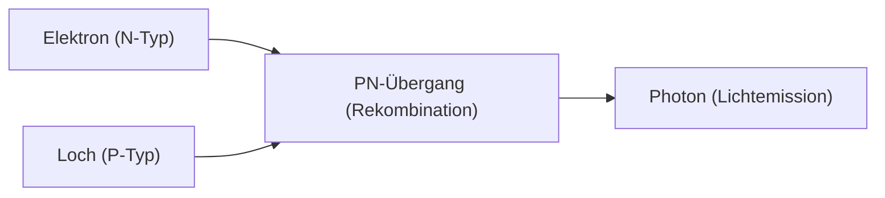

## 1. Der Unterschied zwischen Glühbirnen und LEDs
Glühbirnen erzeugen Licht, indem sie einen Glühfaden auf hohe Temperaturen erhitzen, aber LEDs (Light Emitting Diodes: Leuchtdioden) wandeln elektrische Energie direkt in Lichtenergie um, ohne Wärme abzugeben. Daher sind sie enorm energiesparend.

## 2. Der Leuchtmechanismus (Halbleiter)
Eine LED besteht aus einem Übergang zwischen einem „N-Typ-Halbleiter“ mit überschüssigen Elektronen und einem „P-Typ-Halbleiter“ mit Elektronenmangel (der Löcher besitzt). Wenn ein Strom fließt, kollidieren Elektronen und Löcher und rekombinieren, und die dabei entstehende Energiedifferenz wird als „Licht (Photonen)“ emittiert.

$$
E = h \nu = \frac{hc}{\lambda}
$$

## 3. Die Hürde der blauen LED
Rote und grüne LEDs wurden in den 1960er Jahren erfunden, aber die Kristallisation des Materials (Galliumnitrid) zur Erzeugung der „blauen“ Farbe war äußerst schwierig, sodass eine Umsetzung noch im 20. Jahrhundert als unmöglich galt.

## 4. Der Durchbruch durch japanische Forscher
Durch die bahnbrechende Forschung der drei Wissenschaftler Isamu Akasaki, Hiroshi Amano und Shuji Nakamura wurde in den 1990er Jahren die hochhelle blaue LED fertiggestellt. Da nun die drei Primärfarben des Lichts (Rot, Grün, Blau) verfügbar waren, wurden weiße LED-Beleuchtung und Vollfarbdisplays Realität, und die drei erhielten den Nobelpreis für Physik.

## Zusätzlicher technischer Verifizierungsteil 1

### 1. Der Unterschied zwischen Glühbirnen und LEDs
Glühbirnen erzeugen Licht, indem sie einen Glühfaden auf hohe Temperaturen erhitzen, aber LEDs (Light Emitting Diodes: Leuchtdioden) wandeln elektrische Energie direkt in Lichtenergie um, ohne Wärme abzugeben. Daher sind sie enorm energiesparend.

### 2. Der Leuchtmechanismus (Halbleiter)
Eine LED besteht aus einem Übergang zwischen einem „N-Typ-Halbleiter“ mit überschüssigen Elektronen und einem „P-Typ-Halbleiter“ mit Elektronenmangel (der Löcher besitzt). Wenn ein Strom fließt, kollidieren Elektronen und Löcher und rekombinieren, und die dabei entstehende Energiedifferenz wird als „Licht (Photonen)“ emittiert.

$$
E = h \nu = \frac{hc}{\lambda}
$$

### 3. Die Hürde der blauen LED
Rote und grüne LEDs wurden in den 1960er Jahren erfunden, aber die Kristallisation des Materials (Galliumnitrid) zur Erzeugung der „blauen“ Farbe war äußerst schwierig, sodass eine Umsetzung noch im 20. Jahrhundert als unmöglich galt.

### 4. Der Durchbruch durch japanische Forscher
Durch die bahnbrechende Forschung der drei Wissenschaftler Isamu Akasaki, Hiroshi Amano und Shuji Nakamura wurde in den 1990er Jahren die hochhelle blaue LED fertiggestellt. Da nun die drei Primärfarben des Lichts (Rot, Grün, Blau) verfügbar waren, wurden weiße LED-Beleuchtung und Vollfarbdisplays Realität, und die drei erhielten den Nobelpreis für Physik.

## Zusätzlicher technischer Verifizierungsteil 2

### 1. Der Unterschied zwischen Glühbirnen und LEDs
Glühbirnen erzeugen Licht, indem sie einen Glühfaden auf hohe Temperaturen erhitzen, aber LEDs (Light Emitting Diodes: Leuchtdioden) wandeln elektrische Energie direkt in Lichtenergie um, ohne Wärme abzugeben. Daher sind sie enorm energiesparend.

### 2. Der Leuchtmechanismus (Halbleiter)
Eine LED besteht aus einem Übergang zwischen einem „N-Typ-Halbleiter“ mit überschüssigen Elektronen und einem „P-Typ-Halbleiter“ mit Elektronenmangel (der Löcher besitzt). Wenn ein Strom fließt, kollidieren Elektronen und Löcher und rekombinieren, und die dabei entstehende Energiedifferenz wird als „Licht (Photonen)“ emittiert.

$$
E = h \nu = \frac{hc}{\lambda}
$$

### 3. Die Hürde der blauen LED
Rote und grüne LEDs wurden in den 1960er Jahren erfunden, aber die Kristallisation des Materials (Galliumnitrid) zur Erzeugung der „blauen“ Farbe war äußerst schwierig, sodass eine Umsetzung noch im 20. Jahrhundert als unmöglich galt.

### 4. Der Durchbruch durch japanische Forscher
Durch die bahnbrechende Forschung der drei Wissenschaftler Isamu Akasaki, Hiroshi Amano und Shuji Nakamura wurde in den 1990er Jahren die hochhelle blaue LED fertiggestellt. Da nun die drei Primärfarben des Lichts (Rot, Grün, Blau) verfügbar waren, wurden weiße LED-Beleuchtung und Vollfarbdisplays Realität, und die drei erhielten den Nobelpreis für Physik.

## Zusätzlicher technischer Verifizierungsteil 3

### 1. Der Unterschied zwischen Glühbirnen und LEDs
Glühbirnen erzeugen Licht, indem sie einen Glühfaden auf hohe Temperaturen erhitzen, aber LEDs (Light Emitting Diodes: Leuchtdioden) wandeln elektrische Energie direkt in Lichtenergie um, ohne Wärme abzugeben. Daher sind sie enorm energiesparend.

### 2. Der Leuchtmechanismus (Halbleiter)
Eine LED besteht aus einem Übergang zwischen einem „N-Typ-Halbleiter“ mit überschüssigen Elektronen und einem „P-Typ-Halbleiter“ mit Elektronenmangel (der Löcher besitzt). Wenn ein Strom fließt, kollidieren Elektronen und Löcher und rekombinieren, und die dabei entstehende Energiedifferenz wird als „Licht (Photonen)“ emittiert.

$$
E = h \nu = \frac{hc}{\lambda}
$$

### 3. Die Hürde der blauen LED
Rote und grüne LEDs wurden in den 1960er Jahren erfunden, aber die Kristallisation des Materials (Galliumnitrid) zur Erzeugung der „blauen“ Farbe war äußerst schwierig, sodass eine Umsetzung noch im 20. Jahrhundert als unmöglich galt.

### 4. Der Durchbruch durch japanische Forscher
Durch die bahnbrechende Forschung der drei Wissenschaftler Isamu Akasaki, Hiroshi Amano und Shuji Nakamura wurde in den 1990er Jahren die hochhelle blaue LED fertiggestellt. Da nun die drei Primärfarben des Lichts (Rot, Grün, Blau) verfügbar waren, wurden weiße LED-Beleuchtung und Vollfarbdisplays Realität, und die drei erhielten den Nobelpreis für Physik.

## Zusätzlicher technischer Verifizierungsteil 4

### 1. Der Unterschied zwischen Glühbirnen und LEDs
Glühbirnen erzeugen Licht, indem sie einen Glühfaden auf hohe Temperaturen erhitzen, aber LEDs (Light Emitting Diodes: Leuchtdioden) wandeln elektrische Energie direkt in Lichtenergie um, ohne Wärme abzugeben. Daher sind sie enorm energiesparend.

### 2. Der Leuchtmechanismus (Halbleiter)
Eine LED besteht aus einem Übergang zwischen einem „N-Typ-Halbleiter“ mit überschüssigen Elektronen und einem „P-Typ-Halbleiter“ mit Elektronenmangel (der Löcher besitzt). Wenn ein Strom fließt, kollidieren Elektronen und Löcher und rekombinieren, und die dabei entstehende Energiedifferenz wird als „Licht (Photonen)“ emittiert.

$$
E = h \nu = \frac{hc}{\lambda}
$$

### 3. Die Hürde der blauen LED
Rote und grüne LEDs wurden in den 1960er Jahren erfunden, aber die Kristallisation des Materials (Galliumnitrid) zur Erzeugung der „blauen“ Farbe war äußerst schwierig, sodass eine Umsetzung noch im 20. Jahrhundert als unmöglich galt.

### 4. Der Durchbruch durch japanische Forscher
Durch die bahnbrechende Forschung der drei Wissenschaftler Isamu Akasaki, Hiroshi Amano und Shuji Nakamura wurde in den 1990er Jahren die hochhelle blaue LED fertiggestellt. Da nun die drei Primärfarben des Lichts (Rot, Grün, Blau) verfügbar waren, wurden weiße LED-Beleuchtung und Vollfarbdisplays Realität, und die drei erhielten den Nobelpreis für Physik.

## Zusätzlicher technischer Verifizierungsteil 5

### 1. Der Unterschied zwischen Glühbirnen und LEDs
Glühbirnen erzeugen Licht, indem sie einen Glühfaden auf hohe Temperaturen erhitzen, aber LEDs (Light Emitting Diodes: Leuchtdioden) wandeln elektrische Energie direkt in Lichtenergie um, ohne Wärme abzugeben. Daher sind sie enorm energiesparend.

### 2. Der Leuchtmechanismus (Halbleiter)
Eine LED besteht aus einem Übergang zwischen einem „N-Typ-Halbleiter“ mit überschüssigen Elektronen und einem „P-Typ-Halbleiter“ mit Elektronenmangel (der Löcher besitzt). Wenn ein Strom fließt, kollidieren Elektronen und Löcher und rekombinieren, und die dabei entstehende Energiedifferenz wird als „Licht (Photonen)“ emittiert.

$$
E = h \nu = \frac{hc}{\lambda}
$$

### 3. Die Hürde der blauen LED
Rote und grüne LEDs wurden in den 1960er Jahren erfunden, aber die Kristallisation des Materials (Galliumnitrid) zur Erzeugung der „blauen“ Farbe war äußerst schwierig, sodass eine Umsetzung noch im 20. Jahrhundert als unmöglich galt.

### 4. Der Durchbruch durch japanische Forscher
Durch die bahnbrechende Forschung der drei Wissenschaftler Isamu Akasaki, Hiroshi Amano und Shuji Nakamura wurde in den 1990er Jahren die hochhelle blaue LED fertiggestellt. Da nun die drei Primärfarben des Lichts (Rot, Grün, Blau) verfügbar waren, wurden weiße LED-Beleuchtung und Vollfarbdisplays Realität, und die drei erhielten den Nobelpreis für Physik.

## Zusätzlicher technischer Verifizierungsteil 6

### 1. Der Unterschied zwischen Glühbirnen und LEDs
Glühbirnen erzeugen Licht, indem sie einen Glühfaden auf hohe Temperaturen erhitzen, aber LEDs (Light Emitting Diodes: Leuchtdioden) wandeln elektrische Energie direkt in Lichtenergie um, ohne Wärme abzugeben. Daher sind sie enorm energiesparend.

### 2. Der Leuchtmechanismus (Halbleiter)
Eine LED besteht aus einem Übergang zwischen einem „N-Typ-Halbleiter“ mit überschüssigen Elektronen und einem „P-Typ-Halbleiter“ mit Elektronenmangel (der Löcher besitzt). Wenn ein Strom fließt, kollidieren Elektronen und Löcher und rekombinieren, und die dabei entstehende Energiedifferenz wird als „Licht (Photonen)“ emittiert.

$$
E = h \nu = \frac{hc}{\lambda}
$$

### 3. Die Hürde der blauen LED
Rote und grüne LEDs wurden in den 1960er Jahren erfunden, aber die Kristallisation des Materials (Galliumnitrid) zur Erzeugung der „blauen“ Farbe war äußerst schwierig, sodass eine Umsetzung noch im 20. Jahrhundert als unmöglich galt.

### 4. Der Durchbruch durch japanische Forscher
Durch die bahnbrechende Forschung der drei Wissenschaftler Isamu Akasaki, Hiroshi Amano und Shuji Nakamura wurde in den 1990er Jahren die hochhelle blaue LED fertiggestellt. Da nun die drei Primärfarben des Lichts (Rot, Grün, Blau) verfügbar waren, wurden weiße LED-Beleuchtung und Vollfarbdisplays Realität, und die drei erhielten den Nobelpreis für Physik.

## Zusätzlicher technischer Verifizierungsteil 7

### 1. Der Unterschied zwischen Glühbirnen und LEDs
Glühbirnen erzeugen Licht, indem sie einen Glühfaden auf hohe Temperaturen erhitzen, aber LEDs (Light Emitting Diodes: Leuchtdioden) wandeln elektrische Energie direkt in Lichtenergie um, ohne Wärme abzugeben. Daher sind sie enorm energiesparend.

### 2. Der Leuchtmechanismus (Halbleiter)
Eine LED besteht aus einem Übergang zwischen einem „N-Typ-Halbleiter“ mit überschüssigen Elektronen und einem „P-Typ-Halbleiter“ mit Elektronenmangel (der Löcher besitzt). Wenn ein Strom fließt, kollidieren Elektronen und Löcher und rekombinieren, und die dabei entstehende Energiedifferenz wird als „Licht (Photonen)“ emittiert.

$$
E = h \nu = \frac{hc}{\lambda}
$$

### 3. Die Hürde der blauen LED
Rote und grüne LEDs wurden in den 1960er Jahren erfunden, aber die Kristallisation des Materials (Galliumnitrid) zur Erzeugung der „blauen“ Farbe war äußerst schwierig, sodass eine Umsetzung noch im 20. Jahrhundert als unmöglich galt.

### 4. Der Durchbruch durch japanische Forscher
Durch die bahnbrechende Forschung der drei Wissenschaftler Isamu Akasaki, Hiroshi Amano und Shuji Nakamura wurde in den 1990er Jahren die hochhelle blaue LED fertiggestellt. Da nun die drei Primärfarben des Lichts (Rot, Grün, Blau) verfügbar waren, wurden weiße LED-Beleuchtung und Vollfarbdisplays Realität, und die drei erhielten den Nobelpreis für Physik.

## Zusätzlicher technischer Verifizierungsteil 8

### 1. Der Unterschied zwischen Glühbirnen und LEDs
Glühbirnen erzeugen Licht, indem sie einen Glühfaden auf hohe Temperaturen erhitzen, aber LEDs (Light Emitting Diodes: Leuchtdioden) wandeln elektrische Energie direkt in Lichtenergie um, ohne Wärme abzugeben. Daher sind sie enorm energiesparend.

### 2. Der Leuchtmechanismus (Halbleiter)
Eine LED besteht aus einem Übergang zwischen einem „N-Typ-Halbleiter“ mit überschüssigen Elektronen und einem „P-Typ-Halbleiter“ mit Elektronenmangel (der Löcher besitzt). Wenn ein Strom fließt, kollidieren Elektronen und Löcher und rekombinieren, und die dabei entstehende Energiedifferenz wird als „Licht (Photonen)“ emittiert.

$$
E = h \nu = \frac{hc}{\lambda}
$$

### 3. Die Hürde der blauen LED
Rote und grüne LEDs wurden in den 1960er Jahren erfunden, aber die Kristallisation des Materials (Galliumnitrid) zur Erzeugung der „blauen“ Farbe war äußerst schwierig, sodass eine Umsetzung noch im 20. Jahrhundert als unmöglich galt.

### 4. Der Durchbruch durch japanische Forscher
Durch die bahnbrechende Forschung der drei Wissenschaftler Isamu Akasaki, Hiroshi Amano und Shuji Nakamura wurde in den 1990er Jahren die hochhelle blaue LED fertiggestellt. Da nun die drei Primärfarben des Lichts (Rot, Grün, Blau) verfügbar waren, wurden weiße LED-Beleuchtung und Vollfarbdisplays Realität, und die drei erhielten den Nobelpreis für Physik.

## Zusätzlicher technischer Verifizierungsteil 9

### 1. Der Unterschied zwischen Glühbirnen und LEDs
Glühbirnen erzeugen Licht, indem sie einen Glühfaden auf hohe Temperaturen erhitzen, aber LEDs (Light Emitting Diodes: Leuchtdioden) wandeln elektrische Energie direkt in Lichtenergie um, ohne Wärme abzugeben. Daher sind sie enorm energiesparend.

### 2. Der Leuchtmechanismus (Halbleiter)
Eine LED besteht aus einem Übergang zwischen einem „N-Typ-Halbleiter“ mit überschüssigen Elektronen und einem „P-Typ-Halbleiter“ mit Elektronenmangel (der Löcher besitzt). Wenn ein Strom fließt, kollidieren Elektronen und Löcher und rekombinieren, und die dabei entstehende Energiedifferenz wird als „Licht (Photonen)“ emittiert.

$$
E = h \nu = \frac{hc}{\lambda}
$$

### 3. Die Hürde der blauen LED
Rote und grüne LEDs wurden in den 1960er Jahren erfunden, aber die Kristallisation des Materials (Galliumnitrid) zur Erzeugung der „blauen“ Farbe war äußerst schwierig, sodass eine Umsetzung noch im 20. Jahrhundert als unmöglich galt.

### 4. Der Durchbruch durch japanische Forscher
Durch die bahnbrechende Forschung der drei Wissenschaftler Isamu Akasaki, Hiroshi Amano und Shuji Nakamura wurde in den 1990er Jahren die hochhelle blaue LED fertiggestellt. Da nun die drei Primärfarben des Lichts (Rot, Grün, Blau) verfügbar waren, wurden weiße LED-Beleuchtung und Vollfarbdisplays Realität, und die drei erhielten den Nobelpreis für Physik.

## Zusätzlicher technischer Verifizierungsteil 10

### 1. Der Unterschied zwischen Glühbirnen und LEDs
Glühbirnen erzeugen Licht, indem sie einen Glühfaden auf hohe Temperaturen erhitzen, aber LEDs (Light Emitting Diodes: Leuchtdioden) wandeln elektrische Energie direkt in Lichtenergie um, ohne Wärme abzugeben. Daher sind sie enorm energiesparend.

### 2. Der Leuchtmechanismus (Halbleiter)
Eine LED besteht aus einem Übergang zwischen einem „N-Typ-Halbleiter“ mit überschüssigen Elektronen und einem „P-Typ-Halbleiter“ mit Elektronenmangel (der Löcher besitzt). Wenn ein Strom fließt, kollidieren Elektronen und Löcher und rekombinieren, und die dabei entstehende Energiedifferenz wird als „Licht (Photonen)“ emittiert.

$$
E = h \nu = \frac{hc}{\lambda}
$$

### 3. Die Hürde der blauen LED
Rote und grüne LEDs wurden in den 1960er Jahren erfunden, aber die Kristallisation des Materials (Galliumnitrid) zur Erzeugung der „blauen“ Farbe war äußerst schwierig, sodass eine Umsetzung noch im 20. Jahrhundert als unmöglich galt.

### 4. Der Durchbruch durch japanische Forscher
Durch die bahnbrechende Forschung der drei Wissenschaftler Isamu Akasaki, Hiroshi Amano und Shuji Nakamura wurde in den 1990er Jahren die hochhelle blaue LED fertiggestellt. Da nun die drei Primärfarben des Lichts (Rot, Grün, Blau) verfügbar waren, wurden weiße LED-Beleuchtung und Vollfarbdisplays Realität, und die drei erhielten den Nobelpreis für Physik.

## Zusätzlicher technischer Verifizierungsteil 11

### 1. Der Unterschied zwischen Glühbirnen und LEDs
Glühbirnen erzeugen Licht, indem sie einen Glühfaden auf hohe Temperaturen erhitzen, aber LEDs (Light Emitting Diodes: Leuchtdioden) wandeln elektrische Energie direkt in Lichtenergie um, ohne Wärme abzugeben. Daher sind sie enorm energiesparend.

### 2. Der Leuchtmechanismus (Halbleiter)
Eine LED besteht aus einem Übergang zwischen einem „N-Typ-Halbleiter“ mit überschüssigen Elektronen und einem „P-Typ-Halbleiter“ mit Elektronenmangel (der Löcher besitzt). Wenn ein Strom fließt, kollidieren Elektronen und Löcher und rekombinieren, und die dabei entstehende Energiedifferenz wird als „Licht (Photonen)“ emittiert.

$$
E = h \nu = \frac{hc}{\lambda}
$$

### 3. Die Hürde der blauen LED
Rote und grüne LEDs wurden in den 1960er Jahren erfunden, aber die Kristallisation des Materials (Galliumnitrid) zur Erzeugung der „blauen“ Farbe war äußerst schwierig, sodass eine Umsetzung noch im 20. Jahrhundert als unmöglich galt.

### 4. Der Durchbruch durch japanische Forscher
Durch die bahnbrechende Forschung der drei Wissenschaftler Isamu Akasaki, Hiroshi Amano und Shuji Nakamura wurde in den 1990er Jahren die hochhelle blaue LED fertiggestellt. Da nun die drei Primärfarben des Lichts (Rot, Grün, Blau) verfügbar waren, wurden weiße LED-Beleuchtung und Vollfarbdisplays Realität, und die drei erhielten den Nobelpreis für Physik.

## Zusätzlicher technischer Verifizierungsteil 12

### 1. Der Unterschied zwischen Glühbirnen und LEDs
Glühbirnen erzeugen Licht, indem sie einen Glühfaden auf hohe Temperaturen erhitzen, aber LEDs (Light Emitting Diodes: Leuchtdioden) wandeln elektrische Energie direkt in Lichtenergie um, ohne Wärme abzugeben. Daher sind sie enorm energiesparend.

### 2. Der Leuchtmechanismus (Halbleiter)
Eine LED besteht aus einem Übergang zwischen einem „N-Typ-Halbleiter“ mit überschüssigen Elektronen und einem „P-Typ-Halbleiter“ mit Elektronenmangel (der Löcher besitzt). Wenn ein Strom fließt, kollidieren Elektronen und Löcher und rekombinieren, und die dabei entstehende Energiedifferenz wird als „Licht (Photonen)“ emittiert.

$$
E = h \nu = \frac{hc}{\lambda}
$$

### 3. Die Hürde der blauen LED
Rote und grüne LEDs wurden in den 1960er Jahren erfunden, aber die Kristallisation des Materials (Galliumnitrid) zur Erzeugung der „blauen“ Farbe war äußerst schwierig, sodass eine Umsetzung noch im 20. Jahrhundert als unmöglich galt.

### 4. Der Durchbruch durch japanische Forscher
Durch die bahnbrechende Forschung der drei Wissenschaftler Isamu Akasaki, Hiroshi Amano und Shuji Nakamura wurde in den 1990er Jahren die hochhelle blaue LED fertiggestellt. Da nun die drei Primärfarben des Lichts (Rot, Grün, Blau) verfügbar waren, wurden weiße LED-Beleuchtung und Vollfarbdisplays Realität, und die drei erhielten den Nobelpreis für Physik.

## Zusätzlicher technischer Verifizierungsteil 13

### 1. Der Unterschied zwischen Glühbirnen und LEDs
Glühbirnen erzeugen Licht, indem sie einen Glühfaden auf hohe Temperaturen erhitzen, aber LEDs (Light Emitting Diodes: Leuchtdioden) wandeln elektrische Energie direkt in Lichtenergie um, ohne Wärme abzugeben. Daher sind sie enorm energiesparend.

### 2. Der Leuchtmechanismus (Halbleiter)
Eine LED besteht aus einem Übergang zwischen einem „N-Typ-Halbleiter“ mit überschüssigen Elektronen und einem „P-Typ-Halbleiter“ mit Elektronenmangel (der Löcher besitzt). Wenn ein Strom fließt, kollidieren Elektronen und Löcher und rekombinieren, und die dabei entstehende Energiedifferenz wird als „Licht (Photonen)“ emittiert.

$$
E = h \nu = \frac{hc}{\lambda}
$$

### 3. Die Hürde der blauen LED
Rote und grüne LEDs wurden in den 1960er Jahren erfunden, aber die Kristallisation des Materials (Galliumnitrid) zur Erzeugung der „blauen“ Farbe war äußerst schwierig, sodass eine Umsetzung noch im 20. Jahrhundert als unmöglich galt.

### 4. Der Durchbruch durch japanische Forscher
Durch die bahnbrechende Forschung der drei Wissenschaftler Isamu Akasaki, Hiroshi Amano und Shuji Nakamura wurde in den 1990er Jahren die hochhelle blaue LED fertiggestellt. Da nun die drei Primärfarben des Lichts (Rot, Grün, Blau) verfügbar waren, wurden weiße LED-Beleuchtung und Vollfarbdisplays Realität, und die drei erhielten den Nobelpreis für Physik.

## Zusätzlicher technischer Verifizierungsteil 14

### 1. Der Unterschied zwischen Glühbirnen und LEDs
Glühbirnen erzeugen Licht, indem sie einen Glühfaden auf hohe Temperaturen erhitzen, aber LEDs (Light Emitting Diodes: Leuchtdioden) wandeln elektrische Energie direkt in Lichtenergie um, ohne Wärme abzugeben. Daher sind sie enorm energiesparend.

### 2. Der Leuchtmechanismus (Halbleiter)
Eine LED besteht aus einem Übergang zwischen einem „N-Typ-Halbleiter“ mit überschüssigen Elektronen und einem „P-Typ-Halbleiter“ mit Elektronenmangel (der Löcher besitzt). Wenn ein Strom fließt, kollidieren Elektronen und Löcher und rekombinieren, und die dabei entstehende Energiedifferenz wird als „Licht (Photonen)“ emittiert.

$$
E = h \nu = \frac{hc}{\lambda}
$$

### 3. Die Hürde der blauen LED
Rote und grüne LEDs wurden in den 1960er Jahren erfunden, aber die Kristallisation des Materials (Galliumnitrid) zur Erzeugung der „blauen“ Farbe war äußerst schwierig, sodass eine Umsetzung noch im 20. Jahrhundert als unmöglich galt.

### 4. Der Durchbruch durch japanische Forscher
Durch die bahnbrechende Forschung der drei Wissenschaftler Isamu Akasaki, Hiroshi Amano und Shuji Nakamura wurde in den 1990er Jahren die hochhelle blaue LED fertiggestellt. Da nun die drei Primärfarben des Lichts (Rot, Grün, Blau) verfügbar waren, wurden weiße LED-Beleuchtung und Vollfarbdisplays Realität, und die drei erhielten den Nobelpreis für Physik.
