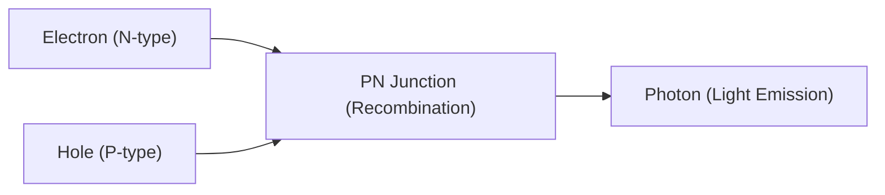

## 1. Difference Between Light Bulbs and LEDs
Incandescent light bulbs emit light by heating a filament to a high temperature, but LEDs (Light Emitting Diodes) convert electrical energy directly into light energy without emitting heat. Therefore, they are overwhelmingly energy-efficient.

## 2. Mechanism of Light Emission (Semiconductor)
An LED is formed by joining an "N-type semiconductor" which has an excess of electrons, and a "P-type semiconductor" which lacks electrons (has holes). When a current is applied, electrons and holes collide and combine, and the energy difference during this process is released as "light (photons)".

$$
E = h \nu = \frac{hc}{\lambda}
$$

## 3. The Wall of Blue LEDs
Red and green LEDs were invented in the 1960s, but the crystallization of the material (gallium nitride) needed to emit "blue" light was extremely difficult, and it was said to be impossible to realize in the 20th century.

## 4. Breakthrough by Japanese Researchers
Through the groundbreaking research of three scientists, Isamu Akasaki, Hiroshi Amano, and Shuji Nakamura, high-brightness blue LEDs were perfected in the 1990s. With the completion of the three primary colors of light (red, green, and blue), white LED lighting and full-color displays became a reality, and the three won the Nobel Prize in Physics.

