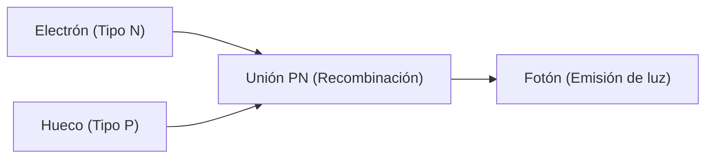

## 1. Diferencia entre bombillas y LED
Las bombillas incandescentes emiten luz calentando un filamento a altas temperaturas, pero los LED (Light Emitting Diode: Diodo Emisor de Luz) convierten la energía eléctrica directamente en energía luminosa sin emitir calor. Por lo tanto, son abrumadoramente más eficientes energéticamente.

## 2. Mecanismo de emisión de luz (Semiconductores)
Un LED es una unión entre un "semiconductor tipo N", que tiene exceso de electrones, y un "semiconductor tipo P", que tiene escasez de electrones (tiene huecos). Al aplicar una corriente eléctrica, los electrones y los huecos chocan y se combinan, y la diferencia de energía en ese momento se emite como "luz (fotones)".

$$
E = h \nu = \frac{hc}{\lambda}
$$

## 3. La barrera del LED azul
Los LED rojo y verde se inventaron en la década de 1960, pero la cristalización del material (nitruro de galio) para producir el color "azul" era extremadamente difícil, y se decía que sería imposible lograrlo en el siglo XX.

## 4. El gran avance de los investigadores japoneses
Gracias a la investigación innovadora de Isamu Akasaki, Hiroshi Amano y Shuji Nakamura, se completó el LED azul de alto brillo en la década de 1990. Al tener los tres colores primarios de la luz (rojo, verde, azul), se hizo realidad la iluminación LED blanca y las pantallas a todo color, y los tres investigadores recibieron el Premio Nobel de Física.

## Parte de verificación técnica adicional 1

## Parte de verificación técnica adicional 2

## Parte de verificación técnica adicional 3

## Parte de verificación técnica adicional 4

## Parte de verificación técnica adicional 5

## Parte de verificación técnica adicional 6

## Parte de verificación técnica adicional 7

## Parte de verificación técnica adicional 8

## Parte de verificación técnica adicional 9

## Parte de verificación técnica adicional 10

## Parte de verificación técnica adicional 11

## Parte de verificación técnica adicional 12

## Parte de verificación técnica adicional 13

## Parte de verificación técnica adicional 14

