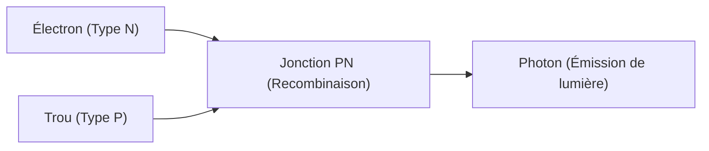

## 1. Différence entre ampoule et LED
Les ampoules à incandescence émettent de la lumière en chauffant un filament à haute température, tandis que les LED (Light Emitting Diode : Diode électroluminescente) convertissent directement l'énergie électrique en énergie lumineuse sans émettre de chaleur. Elles sont donc extrêmement économes en énergie.

## 2. Mécanisme d'émission de lumière (Semi-conducteur)
Une LED est la jonction d'un "semi-conducteur de type N" ayant un excès d'électrons et d'un "semi-conducteur de type P" manquant d'électrons (ayant des trous). Lorsqu'un courant circule, les électrons et les trous se heurtent et se combinent, et la différence d'énergie à ce moment-là est émise sous forme de "lumière (photon)".

$$
E = h \nu = \frac{hc}{\lambda}
$$

## 3. Le mur des LED bleues
Les LED rouges et vertes ont été inventées dans les années 1960, mais la cristallisation du matériau (nitrure de gallium) pour produire la couleur "bleue" était extrêmement difficile, et on disait que sa réalisation au XXe siècle était impossible.

## 4. La percée par des chercheurs japonais
Grâce aux recherches révolutionnaires d'Isamu Akasaki, Hiroshi Amano et Shuji Nakamura, des LED bleues à haute luminosité ont été achevées dans les années 1990. Les trois couleurs primaires de la lumière (rouge, vert, bleu) étant réunies, l'éclairage LED blanc et les écrans couleur ont été réalisés, et les trois chercheurs ont reçu le prix Nobel de physique.

## Partie de vérification technique supplémentaire 1

## Partie de vérification technique supplémentaire 2

## Partie de vérification technique supplémentaire 3

## Partie de vérification technique supplémentaire 4

## Partie de vérification technique supplémentaire 5

## Partie de vérification technique supplémentaire 6

## Partie de vérification technique supplémentaire 7

## Partie de vérification technique supplémentaire 8

## Partie de vérification technique supplémentaire 9

## Partie de vérification technique supplémentaire 10

## Partie de vérification technique supplémentaire 11

## Partie de vérification technique supplémentaire 12

## Partie de vérification technique supplémentaire 13

## Partie de vérification technique supplémentaire 14

