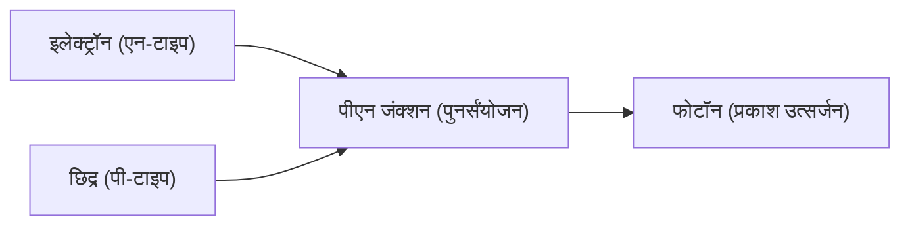

## 1. लाइटबल्ब और एलईडी में अंतर
तापदीप्त प्रकाश बल्ब फिलामेंट को उच्च तापमान पर गर्म करके प्रकाश उत्पन्न करते हैं, लेकिन एलईडी (Light Emitting Diode: प्रकाश उत्सर्जक डायोड) बिना ऊष्मा उत्पन्न किए विद्युत ऊर्जा को सीधे प्रकाश ऊर्जा में परिवर्तित करते हैं। इसलिए यह अत्यधिक ऊर्जा-कुशल है।

## 2. प्रकाश उत्सर्जन का तंत्र (अर्धचालक)
एलईडी एक "एन-टाइप अर्धचालक" (जिसमें अतिरिक्त इलेक्ट्रॉन होते हैं) और एक "पी-टाइप अर्धचालक" (जिसमें इलेक्ट्रॉनों की कमी होती है, यानी छिद्र होते हैं) को जोड़कर बनाया जाता है। जब विद्युत धारा प्रवाहित की जाती है, तो इलेक्ट्रॉन और छिद्र आपस में टकराकर जुड़ जाते हैं, और उस समय की ऊर्जा का अंतर "प्रकाश (फोटॉन)" के रूप में उत्सर्जित होता है।

$$
E = h \nu = \frac{hc}{\lambda}
$$

## 3. नीले एलईडी की बाधा
लाल और हरे रंग के एलईडी का आविष्कार 1960 के दशक में हुआ था, लेकिन "नीले" रंग के उत्पादन के लिए सामग्री (गैलियम नाइट्राइड) का क्रिस्टलीकरण बेहद मुश्किल था, और यह कहा जाता था कि 20वीं सदी में इसे प्राप्त करना असंभव होगा।

## 4. जापानी शोधकर्ताओं द्वारा सफलता
इसामु अकासाकी, हिरोशी अमानो और शुजी नाकामुरा के अभूतपूर्व शोध ने 1990 के दशक में उच्च चमक वाले नीले एलईडी के निर्माण को जन्म दिया। प्रकाश के तीन प्राथमिक रंगों (लाल, हरा, और नीला) के उपलब्ध होने से सफेद एलईडी प्रकाश व्यवस्था और पूर्ण-रंगीन डिस्प्ले संभव हो गए, और इन तीनों ने भौतिकी में नोबेल पुरस्कार जीता।

## अतिरिक्त तकनीकी सत्यापन भाग 1

## अतिरिक्त तकनीकी सत्यापन भाग 2

## अतिरिक्त तकनीकी सत्यापन भाग 3

## अतिरिक्त तकनीकी सत्यापन भाग 4

## अतिरिक्त तकनीकी सत्यापन भाग 5

## अतिरिक्त तकनीकी सत्यापन भाग 6

## अतिरिक्त तकनीकी सत्यापन भाग 7

## अतिरिक्त तकनीकी सत्यापन भाग 8

## अतिरिक्त तकनीकी सत्यापन भाग 9

## अतिरिक्त तकनीकी सत्यापन भाग 10

## अतिरिक्त तकनीकी सत्यापन भाग 11

## अतिरिक्त तकनीकी सत्यापन भाग 12

## अतिरिक्त तकनीकी सत्यापन भाग 13

## अतिरिक्त तकनीकी सत्यापन भाग 14

