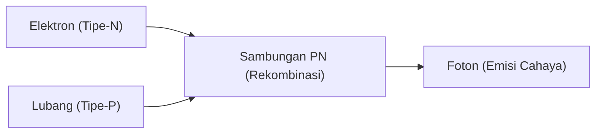

---
title: "Keajaiban Fisika: Mekanisme LED - Mengapa Bisa Menyala? Keajaiban Pengembangan LED Biru"
description: "Prinsip emisi cahaya LED yang sangat penting untuk pencahayaan dan layar modern, serta sejarah pengembangan LED biru yang memenangkan Hadiah Nobel."
slug: "physics-led-mechanism"
date: "2026-09-24T16:08:36+09:00"
image: "eyecatch.jpg"
categories:
    - "science"
    - "physics"
tags:
    - "physics"
    - "led"
    - "semiconductor"
    - "nobel-prize"
---\n## 1. Perbedaan antara Bola Lampu dan LED
Bola lampu pijar memancarkan cahaya dengan memanaskan filamen pada suhu tinggi, sedangkan LED (Light Emitting Diode: Dioda Pancaran Cahaya) mengubah energi listrik secara langsung menjadi energi cahaya tanpa menghasilkan panas. Oleh karena itu, LED jauh lebih hemat energi.

## 2. Mekanisme Emisi Cahaya (Semikonduktor)
LED adalah hasil penggabungan antara "Semikonduktor Tipe-N" yang memiliki kelebihan elektron dan "Semikonduktor Tipe-P" yang kekurangan elektron (memiliki lubang). Saat arus listrik dialirkan, elektron dan lubang bertumbukan lalu bergabung, dan perbedaan energi pada saat itu dilepaskan sebagai "cahaya (foton)".

$$
E = h \nu = \frac{hc}{\lambda}
$$

## 3. Hambatan LED Biru
LED merah dan hijau ditemukan pada tahun 1960-an, tetapi kristalisasi bahan (gallium nitrida) untuk menghasilkan "warna biru" sangatlah sulit, dan dikatakan bahwa pewujudannya tidak mungkin terjadi pada abad ke-20.

## 4. Terobosan oleh Peneliti Jepang
Berkat penelitian inovatif oleh tiga orang yaitu Isamu Akasaki, Hiroshi Amano, dan Shuji Nakamura, LED biru dengan kecerahan tinggi berhasil diselesaikan pada tahun 1990-an. Dengan lengkapnya tiga warna primer cahaya (merah, hijau, biru), pencahayaan LED putih dan layar penuh warna pun terwujud, dan ketiga orang tersebut menerima Penghargaan Nobel Fisika.\n\n\n## Bagian Verifikasi Teknologi Tambahan 1\n\n\n### 1. Perbedaan antara Bola Lampu dan LED
Bola lampu pijar memancarkan cahaya dengan memanaskan filamen pada suhu tinggi, sedangkan LED (Light Emitting Diode: Dioda Pancaran Cahaya) mengubah energi listrik secara langsung menjadi energi cahaya tanpa menghasilkan panas. Oleh karena itu, LED jauh lebih hemat energi.

### 4. Terobosan oleh Peneliti Jepang
Berkat penelitian inovatif oleh tiga orang yaitu Isamu Akasaki, Hiroshi Amano, dan Shuji Nakamura, LED biru dengan kecerahan tinggi berhasil diselesaikan pada tahun 1990-an. Dengan lengkapnya tiga warna primer cahaya (merah, hijau, biru), pencahayaan LED putih dan layar penuh warna pun terwujud, dan ketiga orang tersebut menerima Penghargaan Nobel Fisika.\n\n\n## Bagian Verifikasi Teknologi Tambahan 2\n\n\n### 1. Perbedaan antara Bola Lampu dan LED
Bola lampu pijar memancarkan cahaya dengan memanaskan filamen pada suhu tinggi, sedangkan LED (Light Emitting Diode: Dioda Pancaran Cahaya) mengubah energi listrik secara langsung menjadi energi cahaya tanpa menghasilkan panas. Oleh karena itu, LED jauh lebih hemat energi.

### 4. Terobosan oleh Peneliti Jepang
Berkat penelitian inovatif oleh tiga orang yaitu Isamu Akasaki, Hiroshi Amano, dan Shuji Nakamura, LED biru dengan kecerahan tinggi berhasil diselesaikan pada tahun 1990-an. Dengan lengkapnya tiga warna primer cahaya (merah, hijau, biru), pencahayaan LED putih dan layar penuh warna pun terwujud, dan ketiga orang tersebut menerima Penghargaan Nobel Fisika.\n\n\n## Bagian Verifikasi Teknologi Tambahan 3\n\n\n### 1. Perbedaan antara Bola Lampu dan LED
Bola lampu pijar memancarkan cahaya dengan memanaskan filamen pada suhu tinggi, sedangkan LED (Light Emitting Diode: Dioda Pancaran Cahaya) mengubah energi listrik secara langsung menjadi energi cahaya tanpa menghasilkan panas. Oleh karena itu, LED jauh lebih hemat energi.

### 4. Terobosan oleh Peneliti Jepang
Berkat penelitian inovatif oleh tiga orang yaitu Isamu Akasaki, Hiroshi Amano, dan Shuji Nakamura, LED biru dengan kecerahan tinggi berhasil diselesaikan pada tahun 1990-an. Dengan lengkapnya tiga warna primer cahaya (merah, hijau, biru), pencahayaan LED putih dan layar penuh warna pun terwujud, dan ketiga orang tersebut menerima Penghargaan Nobel Fisika.\n\n\n## Bagian Verifikasi Teknologi Tambahan 4\n\n\n### 1. Perbedaan antara Bola Lampu dan LED
Bola lampu pijar memancarkan cahaya dengan memanaskan filamen pada suhu tinggi, sedangkan LED (Light Emitting Diode: Dioda Pancaran Cahaya) mengubah energi listrik secara langsung menjadi energi cahaya tanpa menghasilkan panas. Oleh karena itu, LED jauh lebih hemat energi.

### 4. Terobosan oleh Peneliti Jepang
Berkat penelitian inovatif oleh tiga orang yaitu Isamu Akasaki, Hiroshi Amano, dan Shuji Nakamura, LED biru dengan kecerahan tinggi berhasil diselesaikan pada tahun 1990-an. Dengan lengkapnya tiga warna primer cahaya (merah, hijau, biru), pencahayaan LED putih dan layar penuh warna pun terwujud, dan ketiga orang tersebut menerima Penghargaan Nobel Fisika.\n\n\n## Bagian Verifikasi Teknologi Tambahan 5\n\n\n### 1. Perbedaan antara Bola Lampu dan LED
Bola lampu pijar memancarkan cahaya dengan memanaskan filamen pada suhu tinggi, sedangkan LED (Light Emitting Diode: Dioda Pancaran Cahaya) mengubah energi listrik secara langsung menjadi energi cahaya tanpa menghasilkan panas. Oleh karena itu, LED jauh lebih hemat energi.

### 4. Terobosan oleh Peneliti Jepang
Berkat penelitian inovatif oleh tiga orang yaitu Isamu Akasaki, Hiroshi Amano, dan Shuji Nakamura, LED biru dengan kecerahan tinggi berhasil diselesaikan pada tahun 1990-an. Dengan lengkapnya tiga warna primer cahaya (merah, hijau, biru), pencahayaan LED putih dan layar penuh warna pun terwujud, dan ketiga orang tersebut menerima Penghargaan Nobel Fisika.\n\n\n## Bagian Verifikasi Teknologi Tambahan 6\n\n\n### 1. Perbedaan antara Bola Lampu dan LED
Bola lampu pijar memancarkan cahaya dengan memanaskan filamen pada suhu tinggi, sedangkan LED (Light Emitting Diode: Dioda Pancaran Cahaya) mengubah energi listrik secara langsung menjadi energi cahaya tanpa menghasilkan panas. Oleh karena itu, LED jauh lebih hemat energi.

### 4. Terobosan oleh Peneliti Jepang
Berkat penelitian inovatif oleh tiga orang yaitu Isamu Akasaki, Hiroshi Amano, dan Shuji Nakamura, LED biru dengan kecerahan tinggi berhasil diselesaikan pada tahun 1990-an. Dengan lengkapnya tiga warna primer cahaya (merah, hijau, biru), pencahayaan LED putih dan layar penuh warna pun terwujud, dan ketiga orang tersebut menerima Penghargaan Nobel Fisika.\n\n\n## Bagian Verifikasi Teknologi Tambahan 7\n\n\n### 1. Perbedaan antara Bola Lampu dan LED
Bola lampu pijar memancarkan cahaya dengan memanaskan filamen pada suhu tinggi, sedangkan LED (Light Emitting Diode: Dioda Pancaran Cahaya) mengubah energi listrik secara langsung menjadi energi cahaya tanpa menghasilkan panas. Oleh karena itu, LED jauh lebih hemat energi.

### 4. Terobosan oleh Peneliti Jepang
Berkat penelitian inovatif oleh tiga orang yaitu Isamu Akasaki, Hiroshi Amano, dan Shuji Nakamura, LED biru dengan kecerahan tinggi berhasil diselesaikan pada tahun 1990-an. Dengan lengkapnya tiga warna primer cahaya (merah, hijau, biru), pencahayaan LED putih dan layar penuh warna pun terwujud, dan ketiga orang tersebut menerima Penghargaan Nobel Fisika.\n\n\n## Bagian Verifikasi Teknologi Tambahan 8\n\n\n### 1. Perbedaan antara Bola Lampu dan LED
Bola lampu pijar memancarkan cahaya dengan memanaskan filamen pada suhu tinggi, sedangkan LED (Light Emitting Diode: Dioda Pancaran Cahaya) mengubah energi listrik secara langsung menjadi energi cahaya tanpa menghasilkan panas. Oleh karena itu, LED jauh lebih hemat energi.

### 4. Terobosan oleh Peneliti Jepang
Berkat penelitian inovatif oleh tiga orang yaitu Isamu Akasaki, Hiroshi Amano, dan Shuji Nakamura, LED biru dengan kecerahan tinggi berhasil diselesaikan pada tahun 1990-an. Dengan lengkapnya tiga warna primer cahaya (merah, hijau, biru), pencahayaan LED putih dan layar penuh warna pun terwujud, dan ketiga orang tersebut menerima Penghargaan Nobel Fisika.\n\n\n## Bagian Verifikasi Teknologi Tambahan 9\n\n\n### 1. Perbedaan antara Bola Lampu dan LED
Bola lampu pijar memancarkan cahaya dengan memanaskan filamen pada suhu tinggi, sedangkan LED (Light Emitting Diode: Dioda Pancaran Cahaya) mengubah energi listrik secara langsung menjadi energi cahaya tanpa menghasilkan panas. Oleh karena itu, LED jauh lebih hemat energi.

### 4. Terobosan oleh Peneliti Jepang
Berkat penelitian inovatif oleh tiga orang yaitu Isamu Akasaki, Hiroshi Amano, dan Shuji Nakamura, LED biru dengan kecerahan tinggi berhasil diselesaikan pada tahun 1990-an. Dengan lengkapnya tiga warna primer cahaya (merah, hijau, biru), pencahayaan LED putih dan layar penuh warna pun terwujud, dan ketiga orang tersebut menerima Penghargaan Nobel Fisika.\n\n\n## Bagian Verifikasi Teknologi Tambahan 10\n\n\n### 1. Perbedaan antara Bola Lampu dan LED
Bola lampu pijar memancarkan cahaya dengan memanaskan filamen pada suhu tinggi, sedangkan LED (Light Emitting Diode: Dioda Pancaran Cahaya) mengubah energi listrik secara langsung menjadi energi cahaya tanpa menghasilkan panas. Oleh karena itu, LED jauh lebih hemat energi.

### 4. Terobosan oleh Peneliti Jepang
Berkat penelitian inovatif oleh tiga orang yaitu Isamu Akasaki, Hiroshi Amano, dan Shuji Nakamura, LED biru dengan kecerahan tinggi berhasil diselesaikan pada tahun 1990-an. Dengan lengkapnya tiga warna primer cahaya (merah, hijau, biru), pencahayaan LED putih dan layar penuh warna pun terwujud, dan ketiga orang tersebut menerima Penghargaan Nobel Fisika.\n\n\n## Bagian Verifikasi Teknologi Tambahan 11\n\n\n### 1. Perbedaan antara Bola Lampu dan LED
Bola lampu pijar memancarkan cahaya dengan memanaskan filamen pada suhu tinggi, sedangkan LED (Light Emitting Diode: Dioda Pancaran Cahaya) mengubah energi listrik secara langsung menjadi energi cahaya tanpa menghasilkan panas. Oleh karena itu, LED jauh lebih hemat energi.

### 4. Terobosan oleh Peneliti Jepang
Berkat penelitian inovatif oleh tiga orang yaitu Isamu Akasaki, Hiroshi Amano, dan Shuji Nakamura, LED biru dengan kecerahan tinggi berhasil diselesaikan pada tahun 1990-an. Dengan lengkapnya tiga warna primer cahaya (merah, hijau, biru), pencahayaan LED putih dan layar penuh warna pun terwujud, dan ketiga orang tersebut menerima Penghargaan Nobel Fisika.\n\n\n## Bagian Verifikasi Teknologi Tambahan 12\n\n\n### 1. Perbedaan antara Bola Lampu dan LED
Bola lampu pijar memancarkan cahaya dengan memanaskan filamen pada suhu tinggi, sedangkan LED (Light Emitting Diode: Dioda Pancaran Cahaya) mengubah energi listrik secara langsung menjadi energi cahaya tanpa menghasilkan panas. Oleh karena itu, LED jauh lebih hemat energi.

### 4. Terobosan oleh Peneliti Jepang
Berkat penelitian inovatif oleh tiga orang yaitu Isamu Akasaki, Hiroshi Amano, dan Shuji Nakamura, LED biru dengan kecerahan tinggi berhasil diselesaikan pada tahun 1990-an. Dengan lengkapnya tiga warna primer cahaya (merah, hijau, biru), pencahayaan LED putih dan layar penuh warna pun terwujud, dan ketiga orang tersebut menerima Penghargaan Nobel Fisika.\n\n\n## Bagian Verifikasi Teknologi Tambahan 13\n\n\n### 1. Perbedaan antara Bola Lampu dan LED
Bola lampu pijar memancarkan cahaya dengan memanaskan filamen pada suhu tinggi, sedangkan LED (Light Emitting Diode: Dioda Pancaran Cahaya) mengubah energi listrik secara langsung menjadi energi cahaya tanpa menghasilkan panas. Oleh karena itu, LED jauh lebih hemat energi.

### 4. Terobosan oleh Peneliti Jepang
Berkat penelitian inovatif oleh tiga orang yaitu Isamu Akasaki, Hiroshi Amano, dan Shuji Nakamura, LED biru dengan kecerahan tinggi berhasil diselesaikan pada tahun 1990-an. Dengan lengkapnya tiga warna primer cahaya (merah, hijau, biru), pencahayaan LED putih dan layar penuh warna pun terwujud, dan ketiga orang tersebut menerima Penghargaan Nobel Fisika.\n\n\n## Bagian Verifikasi Teknologi Tambahan 14\n\n\n### 1. Perbedaan antara Bola Lampu dan LED
Bola lampu pijar memancarkan cahaya dengan memanaskan filamen pada suhu tinggi, sedangkan LED (Light Emitting Diode: Dioda Pancaran Cahaya) mengubah energi listrik secara langsung menjadi energi cahaya tanpa menghasilkan panas. Oleh karena itu, LED jauh lebih hemat energi.

### 4. Terobosan oleh Peneliti Jepang
Berkat penelitian inovatif oleh tiga orang yaitu Isamu Akasaki, Hiroshi Amano, dan Shuji Nakamura, LED biru dengan kecerahan tinggi berhasil diselesaikan pada tahun 1990-an. Dengan lengkapnya tiga warna primer cahaya (merah, hijau, biru), pencahayaan LED putih dan layar penuh warna pun terwujud, dan ketiga orang tersebut menerima Penghargaan Nobel Fisika.\n