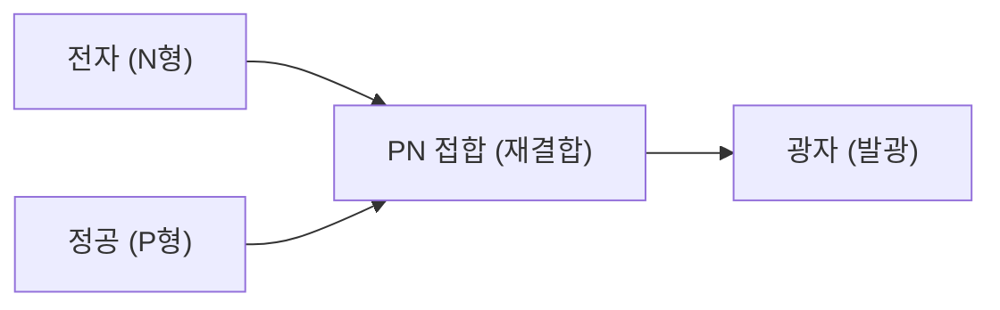

## 1. 전구와 LED의 차이
백열전구는 필라멘트를 고온으로 가열하여 빛을 내지만, LED(Light Emitting Diode: 발광 다이오드)는 열을 내지 않고 전기 에너지를 직접 빛 에너지로 변환합니다. 따라서 압도적으로 에너지가 절약됩니다.

## 2. 발광 메커니즘(반도체)
LED는 전자가 남아도는 'N형 반도체'와 전자가 부족한(정공이 있는) 'P형 반도체'를 접합한 것입니다. 전류를 흘려보내면 전자와 정공이 부딪혀 결합하고, 그 시점의 에너지 차이가 '빛(광자)'으로 방출됩니다.

$$
E = h \nu = \frac{hc}{\lambda}
$$

## 3. 청색 LED의 장벽
적색과 녹색 LED는 1960년대에 발명되었지만, '청색'을 내기 위한 재료(질화갈륨)의 결정화가 극히 어려워 20세기 내 실현은 불가능하다고 여겨졌습니다.

## 4. 일본인 연구자에 의한 돌파구
아카사키 이사무, 아마노 히로시, 나카무라 슈지 3인의 획기적인 연구로 1990년대에 고휘도 청색 LED가 완성되었습니다. 빛의 삼원색(적·녹·청)이 갖춰짐으로써 백색 LED 조명과 풀 컬러 디스플레이가 실현되었고, 3인은 노벨 물리학상을 수상했습니다.

## 추가 기술 검증 파트 1

## 추가 기술 검증 파트 2

## 추가 기술 검증 파트 3

## 추가 기술 검증 파트 4

## 추가 기술 검증 파트 5

## 추가 기술 검증 파트 6

## 추가 기술 검증 파트 7

## 추가 기술 검증 파트 8

## 추가 기술 검증 파트 9

## 추가 기술 검증 파트 10

## 추가 기술 검증 파트 11

## 추가 기술 검증 파트 12

## 추가 기술 검증 파트 13

## 추가 기술 검증 파트 14

