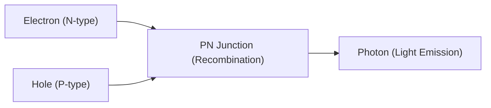

## 1. 電球とLEDの違い
白熱電球はフィラメントを高温に熱して光を出しますが、LED（Light Emitting Diode：発光ダイオード）は熱を出さずに、電気エネルギーを直接光エネルギーに変換します。そのため圧倒的に省エネです。

## 2. 発光のメカニズム（半導体）
LEDは、電子が余っている「N型半導体」と、電子が不足している（正孔がある）「P型半導体」を接合したものです。電流を流すと、電子と正孔がぶつかって結合し、その際のエネルギーの差が「光（光子）」として放出されます。

$$
E = h \nu = \frac{hc}{\lambda}
$$

## 3. 青色LEDの壁
赤と緑のLEDは1960年代に発明されましたが、「青色」を出すための材料（窒化ガリウム）の結晶化が極めて困難で、20世紀中の実現は不可能と言われていました。

## 4. 日本人研究者によるブレイクスルー
赤崎勇、天野浩、中村修二の3氏による画期的な研究により、1990年代に高輝度青色LEDが完成。光の三原色（赤・緑・青）が揃ったことで、白色LED照明やフルカラーディスプレイが実現し、3氏はノーベル物理学賞を受賞しました。

## 追加技術検証パート 1

### 1. 電球とLEDの違い
白熱電球はフィラメントを高温に熱して光を出しますが、LED（Light Emitting Diode：発光ダイオード）は熱を出さずに、電気エネルギーを直接光エネルギーに変換します。そのため圧倒的に省エネです。

### 2. 発光のメカニズム（半導体）
LEDは、電子が余っている「N型半導体」と、電子が不足している（正孔がある）「P型半導体」を接合したものです。電流を流すと、電子と正孔がぶつかって結合し、その際のエネルギーの差が「光（光子）」として放出されます。

$$
E = h \nu = \frac{hc}{\lambda}
$$

### 3. 青色LEDの壁
赤と緑のLEDは1960年代に発明されましたが、「青色」を出すための材料（窒化ガリウム）の結晶化が極めて困難で、20世紀中の実現は不可能と言われていました。

### 4. 日本人研究者によるブレイクスルー
赤崎勇、天野浩、中村修二の3氏による画期的な研究により、1990年代に高輝度青色LEDが完成。光の三原色（赤・緑・青）が揃ったことで、白色LED照明やフルカラーディスプレイが実現し、3氏はノーベル物理学賞を受賞しました。

## 追加技術検証パート 2

### 1. 電球とLEDの違い
白熱電球はフィラメントを高温に熱して光を出しますが、LED（Light Emitting Diode：発光ダイオード）は熱を出さずに、電気エネルギーを直接光エネルギーに変換します。そのため圧倒的に省エネです。

### 2. 発光のメカニズム（半導体）
LEDは、電子が余っている「N型半導体」と、電子が不足している（正孔がある）「P型半導体」を接合したものです。電流を流すと、電子と正孔がぶつかって結合し、その際のエネルギーの差が「光（光子）」として放出されます。

$$
E = h \nu = \frac{hc}{\lambda}
$$

### 3. 青色LEDの壁
赤と緑のLEDは1960年代に発明されましたが、「青色」を出すための材料（窒化ガリウム）の結晶化が極めて困難で、20世紀中の実現は不可能と言われていました。

### 4. 日本人研究者によるブレイクスルー
赤崎勇、天野浩、中村修二の3氏による画期的な研究により、1990年代に高輝度青色LEDが完成。光の三原色（赤・緑・青）が揃ったことで、白色LED照明やフルカラーディスプレイが実現し、3氏はノーベル物理学賞を受賞しました。

## 追加技術検証パート 3

### 1. 電球とLEDの違い
白熱電球はフィラメントを高温に熱して光を出しますが、LED（Light Emitting Diode：発光ダイオード）は熱を出さずに、電気エネルギーを直接光エネルギーに変換します。そのため圧倒的に省エネです。

### 2. 発光のメカニズム（半導体）
LEDは、電子が余っている「N型半導体」と、電子が不足している（正孔がある）「P型半導体」を接合したものです。電流を流すと、電子と正孔がぶつかって結合し、その際のエネルギーの差が「光（光子）」として放出されます。

$$
E = h \nu = \frac{hc}{\lambda}
$$

### 3. 青色LEDの壁
赤と緑のLEDは1960年代に発明されましたが、「青色」を出すための材料（窒化ガリウム）の結晶化が極めて困難で、20世紀中の実現は不可能と言われていました。

### 4. 日本人研究者によるブレイクスルー
赤崎勇、天野浩、中村修二の3氏による画期的な研究により、1990年代に高輝度青色LEDが完成。光の三原色（赤・緑・青）が揃ったことで、白色LED照明やフルカラーディスプレイが実現し、3氏はノーベル物理学賞を受賞しました。

## 追加技術検証パート 4

### 1. 電球とLEDの違い
白熱電球はフィラメントを高温に熱して光を出しますが、LED（Light Emitting Diode：発光ダイオード）は熱を出さずに、電気エネルギーを直接光エネルギーに変換します。そのため圧倒的に省エネです。

### 2. 発光のメカニズム（半導体）
LEDは、電子が余っている「N型半導体」と、電子が不足している（正孔がある）「P型半導体」を接合したものです。電流を流すと、電子と正孔がぶつかって結合し、その際のエネルギーの差が「光（光子）」として放出されます。

$$
E = h \nu = \frac{hc}{\lambda}
$$

### 3. 青色LEDの壁
赤と緑のLEDは1960年代に発明されましたが、「青色」を出すための材料（窒化ガリウム）の結晶化が極めて困難で、20世紀中の実現は不可能と言われていました。

### 4. 日本人研究者によるブレイクスルー
赤崎勇、天野浩、中村修二の3氏による画期的な研究により、1990年代に高輝度青色LEDが完成。光の三原色（赤・緑・青）が揃ったことで、白色LED照明やフルカラーディスプレイが実現し、3氏はノーベル物理学賞を受賞しました。

## 追加技術検証パート 5

### 1. 電球とLEDの違い
白熱電球はフィラメントを高温に熱して光を出しますが、LED（Light Emitting Diode：発光ダイオード）は熱を出さずに、電気エネルギーを直接光エネルギーに変換します。そのため圧倒的に省エネです。

### 2. 発光のメカニズム（半導体）
LEDは、電子が余っている「N型半導体」と、電子が不足している（正孔がある）「P型半導体」を接合したものです。電流を流すと、電子と正孔がぶつかって結合し、その際のエネルギーの差が「光（光子）」として放出されます。

$$
E = h \nu = \frac{hc}{\lambda}
$$

### 3. 青色LEDの壁
赤と緑のLEDは1960年代に発明されましたが、「青色」を出すための材料（窒化ガリウム）の結晶化が極めて困難で、20世紀中の実現は不可能と言われていました。

### 4. 日本人研究者によるブレイクスルー
赤崎勇、天野浩、中村修二の3氏による画期的な研究により、1990年代に高輝度青色LEDが完成。光の三原色（赤・緑・青）が揃ったことで、白色LED照明やフルカラーディスプレイが実現し、3氏はノーベル物理学賞を受賞しました。

## 追加技術検証パート 6

### 1. 電球とLEDの違い
白熱電球はフィラメントを高温に熱して光を出しますが、LED（Light Emitting Diode：発光ダイオード）は熱を出さずに、電気エネルギーを直接光エネルギーに変換します。そのため圧倒的に省エネです。

### 2. 発光のメカニズム（半導体）
LEDは、電子が余っている「N型半導体」と、電子が不足している（正孔がある）「P型半導体」を接合したものです。電流を流すと、電子と正孔がぶつかって結合し、その際のエネルギーの差が「光（光子）」として放出されます。

$$
E = h \nu = \frac{hc}{\lambda}
$$

### 3. 青色LEDの壁
赤と緑のLEDは1960年代に発明されましたが、「青色」を出すための材料（窒化ガリウム）の結晶化が極めて困難で、20世紀中の実現は不可能と言われていました。

### 4. 日本人研究者によるブレイクスルー
赤崎勇、天野浩、中村修二の3氏による画期的な研究により、1990年代に高輝度青色LEDが完成。光の三原色（赤・緑・青）が揃ったことで、白色LED照明やフルカラーディスプレイが実現し、3氏はノーベル物理学賞を受賞しました。

## 追加技術検証パート 7

### 1. 電球とLEDの違い
白熱電球はフィラメントを高温に熱して光を出しますが、LED（Light Emitting Diode：発光ダイオード）は熱を出さずに、電気エネルギーを直接光エネルギーに変換します。そのため圧倒的に省エネです。

### 2. 発光のメカニズム（半導体）
LEDは、電子が余っている「N型半導体」と、電子が不足している（正孔がある）「P型半導体」を接合したものです。電流を流すと、電子と正孔がぶつかって結合し、その際のエネルギーの差が「光（光子）」として放出されます。

$$
E = h \nu = \frac{hc}{\lambda}
$$

### 3. 青色LEDの壁
赤と緑のLEDは1960年代に発明されましたが、「青色」を出すための材料（窒化ガリウム）の結晶化が極めて困難で、20世紀中の実現は不可能と言われていました。

### 4. 日本人研究者によるブレイクスルー
赤崎勇、天野浩、中村修二の3氏による画期的な研究により、1990年代に高輝度青色LEDが完成。光の三原色（赤・緑・青）が揃ったことで、白色LED照明やフルカラーディスプレイが実現し、3氏はノーベル物理学賞を受賞しました。

## 追加技術検証パート 8

### 1. 電球とLEDの違い
白熱電球はフィラメントを高温に熱して光を出しますが、LED（Light Emitting Diode：発光ダイオード）は熱を出さずに、電気エネルギーを直接光エネルギーに変換します。そのため圧倒的に省エネです。

### 2. 発光のメカニズム（半導体）
LEDは、電子が余っている「N型半導体」と、電子が不足している（正孔がある）「P型半導体」を接合したものです。電流を流すと、電子と正孔がぶつかって結合し、その際のエネルギーの差が「光（光子）」として放出されます。

$$
E = h \nu = \frac{hc}{\lambda}
$$

### 3. 青色LEDの壁
赤と緑のLEDは1960年代に発明されましたが、「青色」を出すための材料（窒化ガリウム）の結晶化が極めて困難で、20世紀中の実現は不可能と言われていました。

### 4. 日本人研究者によるブレイクスルー
赤崎勇、天野浩、中村修二の3氏による画期的な研究により、1990年代に高輝度青色LEDが完成。光の三原色（赤・緑・青）が揃ったことで、白色LED照明やフルカラーディスプレイが実現し、3氏はノーベル物理学賞を受賞しました。

## 追加技術検証パート 9

### 1. 電球とLEDの違い
白熱電球はフィラメントを高温に熱して光を出しますが、LED（Light Emitting Diode：発光ダイオード）は熱を出さずに、電気エネルギーを直接光エネルギーに変換します。そのため圧倒的に省エネです。

### 2. 発光のメカニズム（半導体）
LEDは、電子が余っている「N型半導体」と、電子が不足している（正孔がある）「P型半導体」を接合したものです。電流を流すと、電子と正孔がぶつかって結合し、その際のエネルギーの差が「光（光子）」として放出されます。

$$
E = h \nu = \frac{hc}{\lambda}
$$

### 3. 青色LEDの壁
赤と緑のLEDは1960年代に発明されましたが、「青色」を出すための材料（窒化ガリウム）の結晶化が極めて困難で、20世紀中の実現は不可能と言われていました。

### 4. 日本人研究者によるブレイクスルー
赤崎勇、天野浩、中村修二の3氏による画期的な研究により、1990年代に高輝度青色LEDが完成。光の三原色（赤・緑・青）が揃ったことで、白色LED照明やフルカラーディスプレイが実現し、3氏はノーベル物理学賞を受賞しました。

## 追加技術検証パート 10

### 1. 電球とLEDの違い
白熱電球はフィラメントを高温に熱して光を出しますが、LED（Light Emitting Diode：発光ダイオード）は熱を出さずに、電気エネルギーを直接光エネルギーに変換します。そのため圧倒的に省エネです。

### 2. 発光のメカニズム（半導体）
LEDは、電子が余っている「N型半導体」と、電子が不足している（正孔がある）「P型半導体」を接合したものです。電流を流すと、電子と正孔がぶつかって結合し、その際のエネルギーの差が「光（光子）」として放出されます。

$$
E = h \nu = \frac{hc}{\lambda}
$$

### 3. 青色LEDの壁
赤と緑のLEDは1960年代に発明されましたが、「青色」を出すための材料（窒化ガリウム）の結晶化が極めて困難で、20世紀中の実現は不可能と言われていました。

### 4. 日本人研究者によるブレイクスルー
赤崎勇、天野浩、中村修二の3氏による画期的な研究により、1990年代に高輝度青色LEDが完成。光の三原色（赤・緑・青）が揃ったことで、白色LED照明やフルカラーディスプレイが実現し、3氏はノーベル物理学賞を受賞しました。

## 追加技術検証パート 11

### 1. 電球とLEDの違い
白熱電球はフィラメントを高温に熱して光を出しますが、LED（Light Emitting Diode：発光ダイオード）は熱を出さずに、電気エネルギーを直接光エネルギーに変換します。そのため圧倒的に省エネです。

### 2. 発光のメカニズム（半導体）
LEDは、電子が余っている「N型半導体」と、電子が不足している（正孔がある）「P型半導体」を接合したものです。電流を流すと、電子と正孔がぶつかって結合し、その際のエネルギーの差が「光（光子）」として放出されます。

$$
E = h \nu = \frac{hc}{\lambda}
$$

### 3. 青色LEDの壁
赤と緑のLEDは1960年代に発明されましたが、「青色」を出すための材料（窒化ガリウム）の結晶化が極めて困難で、20世紀中の実現は不可能と言われていました。

### 4. 日本人研究者によるブレイクスルー
赤崎勇、天野浩、中村修二の3氏による画期的な研究により、1990年代に高輝度青色LEDが完成。光の三原色（赤・緑・青）が揃ったことで、白色LED照明やフルカラーディスプレイが実現し、3氏はノーベル物理学賞を受賞しました。

## 追加技術検証パート 12

### 1. 電球とLEDの違い
白熱電球はフィラメントを高温に熱して光を出しますが、LED（Light Emitting Diode：発光ダイオード）は熱を出さずに、電気エネルギーを直接光エネルギーに変換します。そのため圧倒的に省エネです。

### 2. 発光のメカニズム（半導体）
LEDは、電子が余っている「N型半導体」と、電子が不足している（正孔がある）「P型半導体」を接合したものです。電流を流すと、電子と正孔がぶつかって結合し、その際のエネルギーの差が「光（光子）」として放出されます。

$$
E = h \nu = \frac{hc}{\lambda}
$$

### 3. 青色LEDの壁
赤と緑のLEDは1960年代に発明されましたが、「青色」を出すための材料（窒化ガリウム）の結晶化が極めて困難で、20世紀中の実現は不可能と言われていました。

### 4. 日本人研究者によるブレイクスルー
赤崎勇、天野浩、中村修二の3氏による画期的な研究により、1990年代に高輝度青色LEDが完成。光の三原色（赤・緑・青）が揃ったことで、白色LED照明やフルカラーディスプレイが実現し、3氏はノーベル物理学賞を受賞しました。

## 追加技術検証パート 13

### 1. 電球とLEDの違い
白熱電球はフィラメントを高温に熱して光を出しますが、LED（Light Emitting Diode：発光ダイオード）は熱を出さずに、電気エネルギーを直接光エネルギーに変換します。そのため圧倒的に省エネです。

### 2. 発光のメカニズム（半導体）
LEDは、電子が余っている「N型半導体」と、電子が不足している（正孔がある）「P型半導体」を接合したものです。電流を流すと、電子と正孔がぶつかって結合し、その際のエネルギーの差が「光（光子）」として放出されます。

$$
E = h \nu = \frac{hc}{\lambda}
$$

### 3. 青色LEDの壁
赤と緑のLEDは1960年代に発明されましたが、「青色」を出すための材料（窒化ガリウム）の結晶化が極めて困難で、20世紀中の実現は不可能と言われていました。

### 4. 日本人研究者によるブレイクスルー
赤崎勇、天野浩、中村修二の3氏による画期的な研究により、1990年代に高輝度青色LEDが完成。光の三原色（赤・緑・青）が揃ったことで、白色LED照明やフルカラーディスプレイが実現し、3氏はノーベル物理学賞を受賞しました。

## 追加技術検証パート 14

### 1. 電球とLEDの違い
白熱電球はフィラメントを高温に熱して光を出しますが、LED（Light Emitting Diode：発光ダイオード）は熱を出さずに、電気エネルギーを直接光エネルギーに変換します。そのため圧倒的に省エネです。

### 2. 発光のメカニズム（半導体）
LEDは、電子が余っている「N型半導体」と、電子が不足している（正孔がある）「P型半導体」を接合したものです。電流を流すと、電子と正孔がぶつかって結合し、その際のエネルギーの差が「光（光子）」として放出されます。

$$
E = h \nu = \frac{hc}{\lambda}
$$

### 3. 青色LEDの壁
赤と緑のLEDは1960年代に発明されましたが、「青色」を出すための材料（窒化ガリウム）の結晶化が極めて困難で、20世紀中の実現は不可能と言われていました。

### 4. 日本人研究者によるブレイクスルー
赤崎勇、天野浩、中村修二の3氏による画期的な研究により、1990年代に高輝度青色LEDが完成。光の三原色（赤・緑・青）が揃ったことで、白色LED照明やフルカラーディスプレイが実現し、3氏はノーベル物理学賞を受賞しました。
