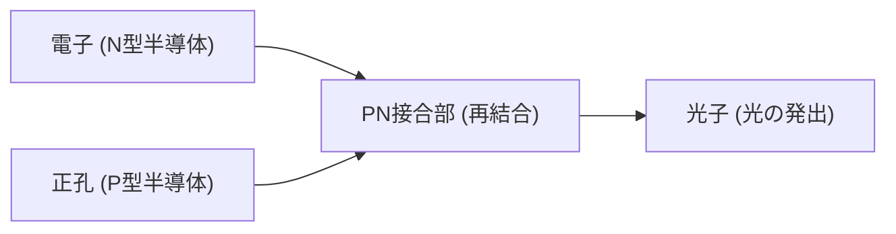

## イントロダクション（はじめに）

現代社会において、LED（発光ダイオード）は私たちの生活に欠かせない存在となっています。街中の信号機や照明器具、スマートフォンやテレビのディスプレイまで、至る所でLEDが光を放っています。ほんの数十年前まで、白熱電球や蛍光灯が主流だった照明の世界は、LEDの登場によって劇的なパラダイムシフトを迎えました。しかし、この小さな半導体チップがなぜこれほどまでに明るく、そして効率的に光るのでしょうか？

本記事では、物理学の視点からLEDの発光メカニズムを詳細に解説するとともに、20世紀中の実現は不可能とまで言われた「青色LED」開発の奇跡と、それに貢献した日本人研究者たちの軌跡に迫ります。

## 1. そもそもLEDとは何か？〜白熱電球・蛍光灯との決定的な違い〜

まず、LED（Light Emitting Diode）が従来の発光デバイスとどのように異なるのかを理解しましょう。

### 白熱電球の仕組み：熱放射

エジソンが実用化した白熱電球は、タングステンなどのフィラメントに電流を流し、ジュール熱によって約3000度という高温に熱することで光を放ちます。これは「熱放射（黒体放射）」と呼ばれる物理現象です。暖かみのある光が特徴ですが、投入した電気エネルギーの大部分（90%以上）が熱として逃げてしまうため、エネルギー効率は非常に悪いという欠点がありました。

### 蛍光灯の仕組み：放電と蛍光

蛍光灯は、ガラス管の中に水銀ガスを封入し、電極間に高電圧をかけることで放電を起こします。この放電によって水銀原子が励起され、紫外線が放出されます。管の内部に塗布された蛍光物質がこの紫外線を吸収し、可視光線に変換して光るという2段階のプロセスを経ています。白熱電球よりも効率は良いですが、水銀という有害物質を使用している点や、点灯までに時間がかかる、寿命が比較的短いなどの課題がありました。

### LEDの仕組み：エレクトロルミネッセンス

一方、LEDは「エレクトロルミネッセンス（EL）」と呼ばれる現象を利用しています。LEDは熱をほとんど出さず、電気エネルギーを直接「光エネルギー」に変換します。フィラメントが切れることもなく、水銀も使用していません。そのため、極めて高いエネルギー効率（省エネ）と長寿命（一般的に約4万時間）を実現できるのです。

## 2. LEDの心臓部：半導体の物理学

LEDの発光メカニズムを理解するためには、量子力学や固体物理学における「半導体」の知識が不可欠です。

### 半導体とは何か？

物質は電気の流れやすさによって、金属などの「導体」、ガラスやゴムなどの「絶縁体」、そしてその中間の性質を持つ「半導体」に分けられます。半導体の代表的な材料には、シリコン（Si）やゲルマニウム（Ge）などがあります。これらの物質は、絶対零度（-273.15℃）では電気を全く通しませんが、室温になったり光を当てたりすると、少しだけ電気を通すようになります。

### バンド理論とエネルギーギャップ

量子力学の「バンド理論」によれば、結晶中の電子がとり得るエネルギー状態は「エネルギーバンド（帯）」を形成します。電子がぎっしり詰まっている帯を「価電子帯」、電子が自由に動き回れる（電流となる）帯を「伝導帯」と呼びます。

半導体において重要なのは、価電子帯と伝導帯の間にある「バンドギャップ（禁制帯幅）」と呼ばれる、電子が存在できないエネルギーのすき間です。電子が価電子帯から伝導帯にジャンプするためには、このバンドギャップ以上のエネルギーを外部から与える必要があります。

### P型半導体とN型半導体

純粋な真性半導体は電気が流れにくいため、不純物を微量に添加（ドーピング）して電気的特性を変化させます。

- **N型半導体（Negative）**: シリコン（14族）にリンやヒ素（15族）を添加すると、電子が1つ余ります。この余った電子（自由電子）がマイナスの電荷の運び手（キャリア）となります。
- **P型半導体（Positive）**: シリコンにホウ素やガリウム（13族）を添加すると、電子が1つ不足し、「正孔（ホール）」と呼ばれる空席ができます。この正孔は、まるでプラスの電荷を持った粒子のように振る舞い、キャリアとなります。

## 3. 光が生まれる瞬間：PN接合と再結合

LEDは、この「P型半導体」と「N型半導体」をくっつけた「PN接合」と呼ばれる構造を持っています。これが発光の舞台となります。

### 電流を流すと何が起きるか（順方向バイアス）

PN接合に対して、P型側にプラス、N型側にマイナスの電圧をかけます（順方向バイアス）。すると、N型半導体の中の電子はマイナス極から反発されて接合面（PとNの境界）に向かって移動し、P型半導体の中の正孔もプラス極から反発されて接合面に向かって移動します。

### 再結合とエネルギーの放出

接合部において、伝導帯を移動してきた高いエネルギーを持つ「電子」と、価電子帯を移動してきた低いエネルギー状態の「正孔」が出会います。ここで電子が正孔という空席に落ち込む現象が起きます。これを「再結合」と呼びます。

高いエネルギー状態から低いエネルギー状態へ遷移する際、余分なエネルギーが発生します。このエネルギーの差分が、「光（光子）」となって物質の外へ放出されるのです。これがLEDが光る根本的なメカニズムです。

### 光の色を決める数式

LEDから放出される光の色（波長）は、半導体の「バンドギャップエネルギー（Eg）」の大きさによって完全に決まります。アインシュタインの光量子仮説やプランクの法則に基づく以下の重要な公式で表されます。

$$
E = h \nu = \frac{hc}{\lambda}
$$

ここで、
- $E$：バンドギャップエネルギー（単位：eVまたはJ）
- $h$：プランク定数（$6.626 \times 10^{-34} \text{ J}\cdot\text{s}$）
- $\nu$：光の振動数
- $c$：光の速度（$3 \times 10^8 \text{ m/s}$）
- $\lambda$：光の波長（これが光の色を決定します）

この式から、$\lambda = \frac{hc}{E}$ となります。つまり、バンドギャップが大きい（$E$ が大きい）半導体材料を使えば波長が短い光（青や紫）が、バンドギャップが小さい（$E$ が小さい）材料を使えば波長が長い光（赤や赤外線）が出ることになります。

## 4. 20世紀の壁：なぜ青色LEDは難しかったのか？

LEDの歴史は意外と古く、1960年代には赤色LEDと緑色LEDが相次いで発明されました。これらはGaAsP（ヒ化ガリウムリン）などの材料を用いて比較的スムーズに開発されました。

しかし、光の三原色（赤・緑・青）を揃えて「白色」を作り出すため、あるいはフルカラーのディスプレイを作るためには「青色LED」が絶対に必要でした。青色は波長が短く、エネルギーが高いため、バンドギャップが非常に大きい（約2.6 eV以上）半導体材料を見つける必要がありました。

### 候補となった3つの材料

当時、青色発光の可能性を秘めた材料として、以下の3つが候補に挙がっていました。
1. セレン化亜鉛（ZnSe）
2. 炭化ケイ素（SiC）
3. **窒化ガリウム（GaN）**

多くの大企業や研究機関は、比較的結晶が作りやすいセレン化亜鉛の研究に巨額の資金を投じました。一方、窒化ガリウム（GaN）は、理想的なバンドギャップ（3.4 eV）を持つものの、きれいな結晶を作ることがあまりにも難しく、「20世紀中の青色LED開発は不可能」と言われるほどの絶望的な困難さを抱えていました。GaNは融点が高すぎ、さらにGaNを成長させるための適切な土台（基板）が存在しなかったため、表面がヒビだらけの粗悪な結晶しか作れなかったのです。

## 5. 日本人研究者たちの執念とブレイクスルー

この不可能と思われた窒化ガリウムの結晶成長に果敢に挑んだのが、日本の研究者たちでした。彼らの独自のアプローチと不屈の精神が、歴史を変えることになります。

### 赤崎勇氏と天野浩氏の「低温バッファ層」技術

名古屋大学の赤崎勇教授と、当時大学院生だった天野浩氏は、窒化ガリウムの研究を泥臭く続けていました。1986年、サファイア基板の上に直接GaNを成長させるのではなく、間に「窒化アルミニウム（AlN）の薄いクッション（低温バッファ層）」を挟むという画期的なアイデアを考案します。これにより、格子不整合による歪みが緩和され、世界で初めて高品質なGaN結晶の作製に成功しました。

さらに1989年には、GaNにマグネシウムを添加し、電子線を照射することで、世界初の「P型GaN」を実現し、青色に光るPN接合LEDの基礎を完成させました。

### 中村修二氏の「ツーフローMOCVD法」と「InGaN」

一方、日亜化学工業の研究員であった中村修二氏は、独自にGaNの研究を開始しました。彼は1990年、原料ガスを基板に対して上からと横からの2方向から吹き付ける「ツーフローMOCVD法（有機金属気相成長法）」という画期的な装置を自作で開発し、極めて高品質なGaN結晶を大量生産する技術を確立しました。

さらに中村氏は、発光層としてインジウム（In）を混ぜた「InGaN（インジウム窒化ガリウム）」のダブルヘテロ構造を開発し、ついに1993年、実用レベルで圧倒的な明るさを誇る「高輝度青色LED」の製品化に成功し、世界を驚愕させました。

### 2014年 ノーベル物理学賞受賞

「明るく省エネルギーの白色光を可能にした、効率的な青色発光ダイオードの発明」。この多大なる功績により、赤崎勇氏、天野浩氏、中村修二氏の3名は、2014年のノーベル物理学賞を共同受賞しました。基礎研究から実用化まで、日本発の技術が世界を照らした瞬間でした。

## 6. LEDが切り拓く未来

青色LEDが誕生したことで、赤・緑・青の光の三原色がすべて揃いました。これらを組み合わせることで、ついにLEDによる「白色光」を作ることが可能になり、人類は数千年ぶりに全く新しい光源を手に入れました。

現在では、青色LEDを黄色い蛍光体に当てて白色光を作り出す手法が主流となっており、家庭用のシーリングライトからスマートフォンのバックライトまで広く普及しています。白熱電球の約10分の1の電力で同じ明るさを得られるため、地球規模での二酸化炭素排出量の削減とエネルギー問題の解決に多大な貢献を果たしています。

さらに、紫外線を出すUV-LEDは殺菌や医療分野で、赤外線LEDは自動運転のセンサー（LiDAR）などで応用が進んでいます。

## まとめ

LEDが光るメカニズムは、電子と正孔が再結合し、エネルギーの差分が光子として放出されるという、量子力学の極めて美しい現象の産物です。そして、その物理法則を巧みに操り、不可能と言われた青色LEDを実現させた日本人研究者たちの情熱と技術力は、まさに現代の奇跡と呼ぶにふさわしいものです。

私たちが毎晩スイッチを入れ、部屋を明るく照らすその光の裏側には、広大な宇宙の法則（物理学）と、人類の果てしない探求の歴史が詰まっているのです。次にLEDの眩しい光を目にしたときは、ぜひそのミクロな世界で飛び交う電子と光子のダンスに思いを馳せてみてください。
