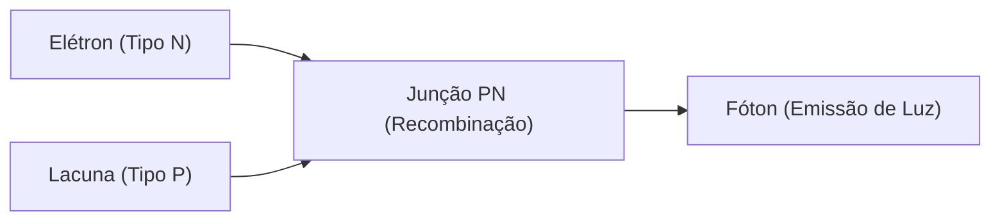

## 1. Diferença entre Lâmpada e LED
A lâmpada incandescente emite luz aquecendo um filamento a altas temperaturas, mas o LED (Light Emitting Diode: Diodo Emissor de Luz) converte energia elétrica diretamente em energia luminosa sem gerar calor. Portanto, é extremamente econômico em termos de energia.

## 2. Mecanismo de Emissão de Luz (Semicondutor)
O LED é uma junção de um "semicondutor tipo N" com excesso de elétrons e um "semicondutor tipo P" com falta de elétrons (que possui lacunas). Quando uma corrente elétrica é aplicada, os elétrons e as lacunas colidem e se combinam, e a diferença de energia nesse processo é liberada como "luz (fóton)".

$$
E = h \nu = \frac{hc}{\lambda}
$$

## 3. A Barreira do LED Azul
Os LEDs vermelho e verde foram inventados na década de 1960, mas a cristalização do material (nitreto de gálio) para produzir a cor "azul" era extremamente difícil, e dizia-se que era impossível realizá-la no século XX.

## 4. Avanço por Pesquisadores Japoneses
Graças à pesquisa inovadora de três cientistas, Isamu Akasaki, Hiroshi Amano e Shuji Nakamura, o LED azul de alto brilho foi concluído na década de 1990. Com as três cores primárias da luz (vermelho, verde e azul) disponíveis, a iluminação LED branca e as telas em cores reais tornaram-se realidade, e os três receberam o Prêmio Nobel de Física.

## Parte 1 de Verificação de Tecnologia Adicional

### 1. Diferença entre Lâmpada e LED
A lâmpada incandescente emite luz aquecendo um filamento a altas temperaturas, mas o LED (Light Emitting Diode: Diodo Emissor de Luz) converte energia elétrica diretamente em energia luminosa sem gerar calor. Portanto, é extremamente econômico em termos de energia.

### 2. Mecanismo de Emissão de Luz (Semicondutor)
O LED é uma junção de um "semicondutor tipo N" com excesso de elétrons e um "semicondutor tipo P" com falta de elétrons (que possui lacunas). Quando uma corrente elétrica é aplicada, os elétrons e as lacunas colidem e se combinam, e a diferença de energia nesse processo é liberada como "luz (fóton)".

$$
E = h \nu = \frac{hc}{\lambda}
$$

### 3. A Barreira do LED Azul
Os LEDs vermelho e verde foram inventados na década de 1960, mas a cristalização do material (nitreto de gálio) para produzir a cor "azul" era extremamente difícil, e dizia-se que era impossível realizá-la no século XX.

### 4. Avanço por Pesquisadores Japoneses
Graças à pesquisa inovadora de três cientistas, Isamu Akasaki, Hiroshi Amano e Shuji Nakamura, o LED azul de alto brilho foi concluído na década de 1990. Com as três cores primárias da luz (vermelho, verde e azul) disponíveis, a iluminação LED branca e as telas em cores reais tornaram-se realidade, e os três receberam o Prêmio Nobel de Física.

## Parte 2 de Verificação de Tecnologia Adicional

### 1. Diferença entre Lâmpada e LED
A lâmpada incandescente emite luz aquecendo um filamento a altas temperaturas, mas o LED (Light Emitting Diode: Diodo Emissor de Luz) converte energia elétrica diretamente em energia luminosa sem gerar calor. Portanto, é extremamente econômico em termos de energia.

### 2. Mecanismo de Emissão de Luz (Semicondutor)
O LED é uma junção de um "semicondutor tipo N" com excesso de elétrons e um "semicondutor tipo P" com falta de elétrons (que possui lacunas). Quando uma corrente elétrica é aplicada, os elétrons e as lacunas colidem e se combinam, e a diferença de energia nesse processo é liberada como "luz (fóton)".

$$
E = h \nu = \frac{hc}{\lambda}
$$

### 3. A Barreira do LED Azul
Os LEDs vermelho e verde foram inventados na década de 1960, mas a cristalização do material (nitreto de gálio) para produzir a cor "azul" era extremamente difícil, e dizia-se que era impossível realizá-la no século XX.

### 4. Avanço por Pesquisadores Japoneses
Graças à pesquisa inovadora de três cientistas, Isamu Akasaki, Hiroshi Amano e Shuji Nakamura, o LED azul de alto brilho foi concluído na década de 1990. Com as três cores primárias da luz (vermelho, verde e azul) disponíveis, a iluminação LED branca e as telas em cores reais tornaram-se realidade, e os três receberam o Prêmio Nobel de Física.

## Parte 3 de Verificação de Tecnologia Adicional

### 1. Diferença entre Lâmpada e LED
A lâmpada incandescente emite luz aquecendo um filamento a altas temperaturas, mas o LED (Light Emitting Diode: Diodo Emissor de Luz) converte energia elétrica diretamente em energia luminosa sem gerar calor. Portanto, é extremamente econômico em termos de energia.

### 2. Mecanismo de Emissão de Luz (Semicondutor)
O LED é uma junção de um "semicondutor tipo N" com excesso de elétrons e um "semicondutor tipo P" com falta de elétrons (que possui lacunas). Quando uma corrente elétrica é aplicada, os elétrons e as lacunas colidem e se combinam, e a diferença de energia nesse processo é liberada como "luz (fóton)".

$$
E = h \nu = \frac{hc}{\lambda}
$$

### 3. A Barreira do LED Azul
Os LEDs vermelho e verde foram inventados na década de 1960, mas a cristalização do material (nitreto de gálio) para produzir a cor "azul" era extremamente difícil, e dizia-se que era impossível realizá-la no século XX.

### 4. Avanço por Pesquisadores Japoneses
Graças à pesquisa inovadora de três cientistas, Isamu Akasaki, Hiroshi Amano e Shuji Nakamura, o LED azul de alto brilho foi concluído na década de 1990. Com as três cores primárias da luz (vermelho, verde e azul) disponíveis, a iluminação LED branca e as telas em cores reais tornaram-se realidade, e os três receberam o Prêmio Nobel de Física.

## Parte 4 de Verificação de Tecnologia Adicional

### 1. Diferença entre Lâmpada e LED
A lâmpada incandescente emite luz aquecendo um filamento a altas temperaturas, mas o LED (Light Emitting Diode: Diodo Emissor de Luz) converte energia elétrica diretamente em energia luminosa sem gerar calor. Portanto, é extremamente econômico em termos de energia.

### 2. Mecanismo de Emissão de Luz (Semicondutor)
O LED é uma junção de um "semicondutor tipo N" com excesso de elétrons e um "semicondutor tipo P" com falta de elétrons (que possui lacunas). Quando uma corrente elétrica é aplicada, os elétrons e as lacunas colidem e se combinam, e a diferença de energia nesse processo é liberada como "luz (fóton)".

$$
E = h \nu = \frac{hc}{\lambda}
$$

### 3. A Barreira do LED Azul
Os LEDs vermelho e verde foram inventados na década de 1960, mas a cristalização do material (nitreto de gálio) para produzir a cor "azul" era extremamente difícil, e dizia-se que era impossível realizá-la no século XX.

### 4. Avanço por Pesquisadores Japoneses
Graças à pesquisa inovadora de três cientistas, Isamu Akasaki, Hiroshi Amano e Shuji Nakamura, o LED azul de alto brilho foi concluído na década de 1990. Com as três cores primárias da luz (vermelho, verde e azul) disponíveis, a iluminação LED branca e as telas em cores reais tornaram-se realidade, e os três receberam o Prêmio Nobel de Física.

## Parte 5 de Verificação de Tecnologia Adicional

### 1. Diferença entre Lâmpada e LED
A lâmpada incandescente emite luz aquecendo um filamento a altas temperaturas, mas o LED (Light Emitting Diode: Diodo Emissor de Luz) converte energia elétrica diretamente em energia luminosa sem gerar calor. Portanto, é extremamente econômico em termos de energia.

### 2. Mecanismo de Emissão de Luz (Semicondutor)
O LED é uma junção de um "semicondutor tipo N" com excesso de elétrons e um "semicondutor tipo P" com falta de elétrons (que possui lacunas). Quando uma corrente elétrica é aplicada, os elétrons e as lacunas colidem e se combinam, e a diferença de energia nesse processo é liberada como "luz (fóton)".

$$
E = h \nu = \frac{hc}{\lambda}
$$

### 3. A Barreira do LED Azul
Os LEDs vermelho e verde foram inventados na década de 1960, mas a cristalização do material (nitreto de gálio) para produzir a cor "azul" era extremamente difícil, e dizia-se que era impossível realizá-la no século XX.

### 4. Avanço por Pesquisadores Japoneses
Graças à pesquisa inovadora de três cientistas, Isamu Akasaki, Hiroshi Amano e Shuji Nakamura, o LED azul de alto brilho foi concluído na década de 1990. Com as três cores primárias da luz (vermelho, verde e azul) disponíveis, a iluminação LED branca e as telas em cores reais tornaram-se realidade, e os três receberam o Prêmio Nobel de Física.

## Parte 6 de Verificação de Tecnologia Adicional

### 1. Diferença entre Lâmpada e LED
A lâmpada incandescente emite luz aquecendo um filamento a altas temperaturas, mas o LED (Light Emitting Diode: Diodo Emissor de Luz) converte energia elétrica diretamente em energia luminosa sem gerar calor. Portanto, é extremamente econômico em termos de energia.

### 2. Mecanismo de Emissão de Luz (Semicondutor)
O LED é uma junção de um "semicondutor tipo N" com excesso de elétrons e um "semicondutor tipo P" com falta de elétrons (que possui lacunas). Quando uma corrente elétrica é aplicada, os elétrons e as lacunas colidem e se combinam, e a diferença de energia nesse processo é liberada como "luz (fóton)".

$$
E = h \nu = \frac{hc}{\lambda}
$$

### 3. A Barreira do LED Azul
Os LEDs vermelho e verde foram inventados na década de 1960, mas a cristalização do material (nitreto de gálio) para produzir a cor "azul" era extremamente difícil, e dizia-se que era impossível realizá-la no século XX.

### 4. Avanço por Pesquisadores Japoneses
Graças à pesquisa inovadora de três cientistas, Isamu Akasaki, Hiroshi Amano e Shuji Nakamura, o LED azul de alto brilho foi concluído na década de 1990. Com as três cores primárias da luz (vermelho, verde e azul) disponíveis, a iluminação LED branca e as telas em cores reais tornaram-se realidade, e os três receberam o Prêmio Nobel de Física.

## Parte 7 de Verificação de Tecnologia Adicional

### 1. Diferença entre Lâmpada e LED
A lâmpada incandescente emite luz aquecendo um filamento a altas temperaturas, mas o LED (Light Emitting Diode: Diodo Emissor de Luz) converte energia elétrica diretamente em energia luminosa sem gerar calor. Portanto, é extremamente econômico em termos de energia.

### 2. Mecanismo de Emissão de Luz (Semicondutor)
O LED é uma junção de um "semicondutor tipo N" com excesso de elétrons e um "semicondutor tipo P" com falta de elétrons (que possui lacunas). Quando uma corrente elétrica é aplicada, os elétrons e as lacunas colidem e se combinam, e a diferença de energia nesse processo é liberada como "luz (fóton)".

$$
E = h \nu = \frac{hc}{\lambda}
$$

### 3. A Barreira do LED Azul
Os LEDs vermelho e verde foram inventados na década de 1960, mas a cristalização do material (nitreto de gálio) para produzir a cor "azul" era extremamente difícil, e dizia-se que era impossível realizá-la no século XX.

### 4. Avanço por Pesquisadores Japoneses
Graças à pesquisa inovadora de três cientistas, Isamu Akasaki, Hiroshi Amano e Shuji Nakamura, o LED azul de alto brilho foi concluído na década de 1990. Com as três cores primárias da luz (vermelho, verde e azul) disponíveis, a iluminação LED branca e as telas em cores reais tornaram-se realidade, e os três receberam o Prêmio Nobel de Física.

## Parte 8 de Verificação de Tecnologia Adicional

### 1. Diferença entre Lâmpada e LED
A lâmpada incandescente emite luz aquecendo um filamento a altas temperaturas, mas o LED (Light Emitting Diode: Diodo Emissor de Luz) converte energia elétrica diretamente em energia luminosa sem gerar calor. Portanto, é extremamente econômico em termos de energia.

### 2. Mecanismo de Emissão de Luz (Semicondutor)
O LED é uma junção de um "semicondutor tipo N" com excesso de elétrons e um "semicondutor tipo P" com falta de elétrons (que possui lacunas). Quando uma corrente elétrica é aplicada, os elétrons e as lacunas colidem e se combinam, e a diferença de energia nesse processo é liberada como "luz (fóton)".

$$
E = h \nu = \frac{hc}{\lambda}
$$

### 3. A Barreira do LED Azul
Os LEDs vermelho e verde foram inventados na década de 1960, mas a cristalização do material (nitreto de gálio) para produzir a cor "azul" era extremamente difícil, e dizia-se que era impossível realizá-la no século XX.

### 4. Avanço por Pesquisadores Japoneses
Graças à pesquisa inovadora de três cientistas, Isamu Akasaki, Hiroshi Amano e Shuji Nakamura, o LED azul de alto brilho foi concluído na década de 1990. Com as três cores primárias da luz (vermelho, verde e azul) disponíveis, a iluminação LED branca e as telas em cores reais tornaram-se realidade, e os três receberam o Prêmio Nobel de Física.

## Parte 9 de Verificação de Tecnologia Adicional

### 1. Diferença entre Lâmpada e LED
A lâmpada incandescente emite luz aquecendo um filamento a altas temperaturas, mas o LED (Light Emitting Diode: Diodo Emissor de Luz) converte energia elétrica diretamente em energia luminosa sem gerar calor. Portanto, é extremamente econômico em termos de energia.

### 2. Mecanismo de Emissão de Luz (Semicondutor)
O LED é uma junção de um "semicondutor tipo N" com excesso de elétrons e um "semicondutor tipo P" com falta de elétrons (que possui lacunas). Quando uma corrente elétrica é aplicada, os elétrons e as lacunas colidem e se combinam, e a diferença de energia nesse processo é liberada como "luz (fóton)".

$$
E = h \nu = \frac{hc}{\lambda}
$$

### 3. A Barreira do LED Azul
Os LEDs vermelho e verde foram inventados na década de 1960, mas a cristalização do material (nitreto de gálio) para produzir a cor "azul" era extremamente difícil, e dizia-se que era impossível realizá-la no século XX.

### 4. Avanço por Pesquisadores Japoneses
Graças à pesquisa inovadora de três cientistas, Isamu Akasaki, Hiroshi Amano e Shuji Nakamura, o LED azul de alto brilho foi concluído na década de 1990. Com as três cores primárias da luz (vermelho, verde e azul) disponíveis, a iluminação LED branca e as telas em cores reais tornaram-se realidade, e os três receberam o Prêmio Nobel de Física.

## Parte 10 de Verificação de Tecnologia Adicional

### 1. Diferença entre Lâmpada e LED
A lâmpada incandescente emite luz aquecendo um filamento a altas temperaturas, mas o LED (Light Emitting Diode: Diodo Emissor de Luz) converte energia elétrica diretamente em energia luminosa sem gerar calor. Portanto, é extremamente econômico em termos de energia.

### 2. Mecanismo de Emissão de Luz (Semicondutor)
O LED é uma junção de um "semicondutor tipo N" com excesso de elétrons e um "semicondutor tipo P" com falta de elétrons (que possui lacunas). Quando uma corrente elétrica é aplicada, os elétrons e as lacunas colidem e se combinam, e a diferença de energia nesse processo é liberada como "luz (fóton)".

$$
E = h \nu = \frac{hc}{\lambda}
$$

### 3. A Barreira do LED Azul
Os LEDs vermelho e verde foram inventados na década de 1960, mas a cristalização do material (nitreto de gálio) para produzir a cor "azul" era extremamente difícil, e dizia-se que era impossível realizá-la no século XX.

### 4. Avanço por Pesquisadores Japoneses
Graças à pesquisa inovadora de três cientistas, Isamu Akasaki, Hiroshi Amano e Shuji Nakamura, o LED azul de alto brilho foi concluído na década de 1990. Com as três cores primárias da luz (vermelho, verde e azul) disponíveis, a iluminação LED branca e as telas em cores reais tornaram-se realidade, e os três receberam o Prêmio Nobel de Física.

## Parte 11 de Verificação de Tecnologia Adicional

### 1. Diferença entre Lâmpada e LED
A lâmpada incandescente emite luz aquecendo um filamento a altas temperaturas, mas o LED (Light Emitting Diode: Diodo Emissor de Luz) converte energia elétrica diretamente em energia luminosa sem gerar calor. Portanto, é extremamente econômico em termos de energia.

### 2. Mecanismo de Emissão de Luz (Semicondutor)
O LED é uma junção de um "semicondutor tipo N" com excesso de elétrons e um "semicondutor tipo P" com falta de elétrons (que possui lacunas). Quando uma corrente elétrica é aplicada, os elétrons e as lacunas colidem e se combinam, e a diferença de energia nesse processo é liberada como "luz (fóton)".

$$
E = h \nu = \frac{hc}{\lambda}
$$

### 3. A Barreira do LED Azul
Os LEDs vermelho e verde foram inventados na década de 1960, mas a cristalização do material (nitreto de gálio) para produzir a cor "azul" era extremamente difícil, e dizia-se que era impossível realizá-la no século XX.

### 4. Avanço por Pesquisadores Japoneses
Graças à pesquisa inovadora de três cientistas, Isamu Akasaki, Hiroshi Amano e Shuji Nakamura, o LED azul de alto brilho foi concluído na década de 1990. Com as três cores primárias da luz (vermelho, verde e azul) disponíveis, a iluminação LED branca e as telas em cores reais tornaram-se realidade, e os três receberam o Prêmio Nobel de Física.

## Parte 12 de Verificação de Tecnologia Adicional

### 1. Diferença entre Lâmpada e LED
A lâmpada incandescente emite luz aquecendo um filamento a altas temperaturas, mas o LED (Light Emitting Diode: Diodo Emissor de Luz) converte energia elétrica diretamente em energia luminosa sem gerar calor. Portanto, é extremamente econômico em termos de energia.

### 2. Mecanismo de Emissão de Luz (Semicondutor)
O LED é uma junção de um "semicondutor tipo N" com excesso de elétrons e um "semicondutor tipo P" com falta de elétrons (que possui lacunas). Quando uma corrente elétrica é aplicada, os elétrons e as lacunas colidem e se combinam, e a diferença de energia nesse processo é liberada como "luz (fóton)".

$$
E = h \nu = \frac{hc}{\lambda}
$$

### 3. A Barreira do LED Azul
Os LEDs vermelho e verde foram inventados na década de 1960, mas a cristalização do material (nitreto de gálio) para produzir a cor "azul" era extremamente difícil, e dizia-se que era impossível realizá-la no século XX.

### 4. Avanço por Pesquisadores Japoneses
Graças à pesquisa inovadora de três cientistas, Isamu Akasaki, Hiroshi Amano e Shuji Nakamura, o LED azul de alto brilho foi concluído na década de 1990. Com as três cores primárias da luz (vermelho, verde e azul) disponíveis, a iluminação LED branca e as telas em cores reais tornaram-se realidade, e os três receberam o Prêmio Nobel de Física.

## Parte 13 de Verificação de Tecnologia Adicional

### 1. Diferença entre Lâmpada e LED
A lâmpada incandescente emite luz aquecendo um filamento a altas temperaturas, mas o LED (Light Emitting Diode: Diodo Emissor de Luz) converte energia elétrica diretamente em energia luminosa sem gerar calor. Portanto, é extremamente econômico em termos de energia.

### 2. Mecanismo de Emissão de Luz (Semicondutor)
O LED é uma junção de um "semicondutor tipo N" com excesso de elétrons e um "semicondutor tipo P" com falta de elétrons (que possui lacunas). Quando uma corrente elétrica é aplicada, os elétrons e as lacunas colidem e se combinam, e a diferença de energia nesse processo é liberada como "luz (fóton)".

$$
E = h \nu = \frac{hc}{\lambda}
$$

### 3. A Barreira do LED Azul
Os LEDs vermelho e verde foram inventados na década de 1960, mas a cristalização do material (nitreto de gálio) para produzir a cor "azul" era extremamente difícil, e dizia-se que era impossível realizá-la no século XX.

### 4. Avanço por Pesquisadores Japoneses
Graças à pesquisa inovadora de três cientistas, Isamu Akasaki, Hiroshi Amano e Shuji Nakamura, o LED azul de alto brilho foi concluído na década de 1990. Com as três cores primárias da luz (vermelho, verde e azul) disponíveis, a iluminação LED branca e as telas em cores reais tornaram-se realidade, e os três receberam o Prêmio Nobel de Física.

## Parte 14 de Verificação de Tecnologia Adicional

### 1. Diferença entre Lâmpada e LED
A lâmpada incandescente emite luz aquecendo um filamento a altas temperaturas, mas o LED (Light Emitting Diode: Diodo Emissor de Luz) converte energia elétrica diretamente em energia luminosa sem gerar calor. Portanto, é extremamente econômico em termos de energia.

### 2. Mecanismo de Emissão de Luz (Semicondutor)
O LED é uma junção de um "semicondutor tipo N" com excesso de elétrons e um "semicondutor tipo P" com falta de elétrons (que possui lacunas). Quando uma corrente elétrica é aplicada, os elétrons e as lacunas colidem e se combinam, e a diferença de energia nesse processo é liberada como "luz (fóton)".

$$
E = h \nu = \frac{hc}{\lambda}
$$

### 3. A Barreira do LED Azul
Os LEDs vermelho e verde foram inventados na década de 1960, mas a cristalização do material (nitreto de gálio) para produzir a cor "azul" era extremamente difícil, e dizia-se que era impossível realizá-la no século XX.

### 4. Avanço por Pesquisadores Japoneses
Graças à pesquisa inovadora de três cientistas, Isamu Akasaki, Hiroshi Amano e Shuji Nakamura, o LED azul de alto brilho foi concluído na década de 1990. Com as três cores primárias da luz (vermelho, verde e azul) disponíveis, a iluminação LED branca e as telas em cores reais tornaram-se realidade, e os três receberam o Prêmio Nobel de Física.
